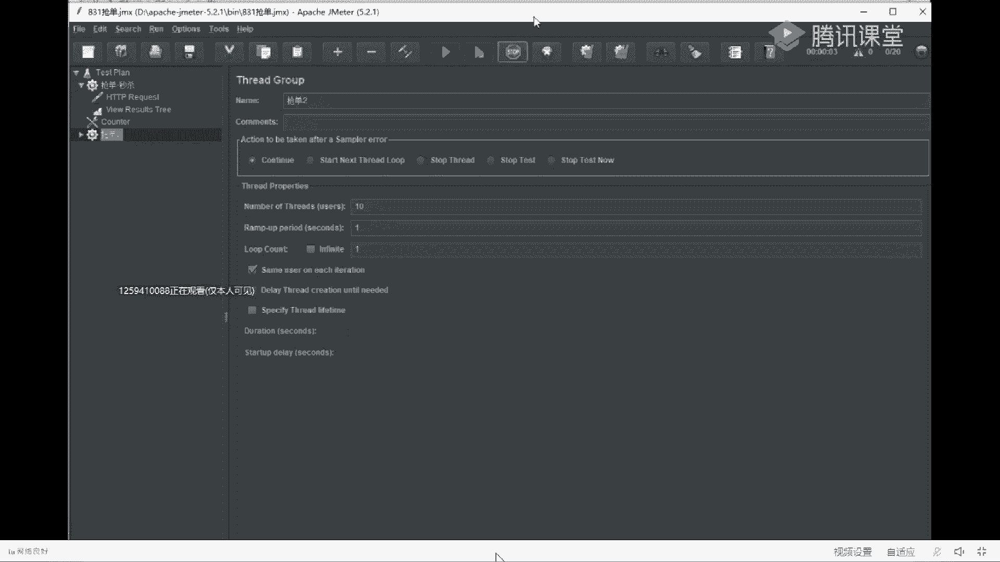
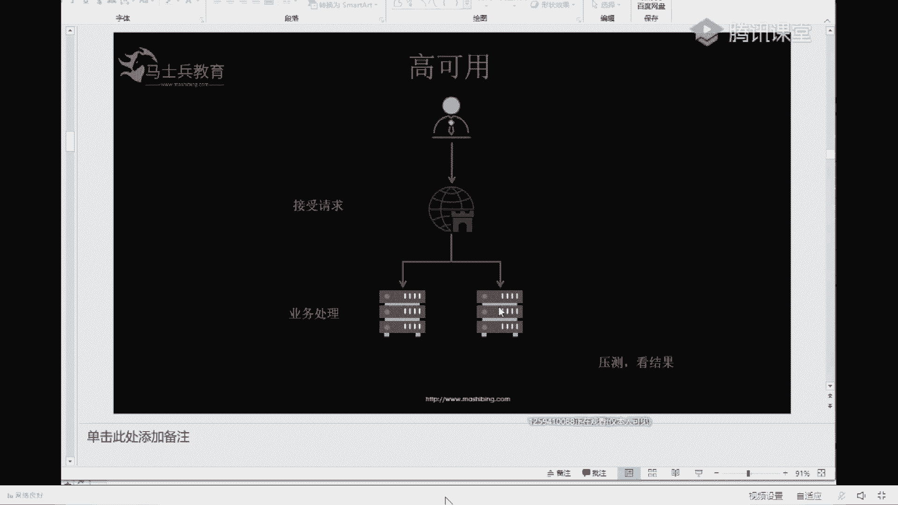
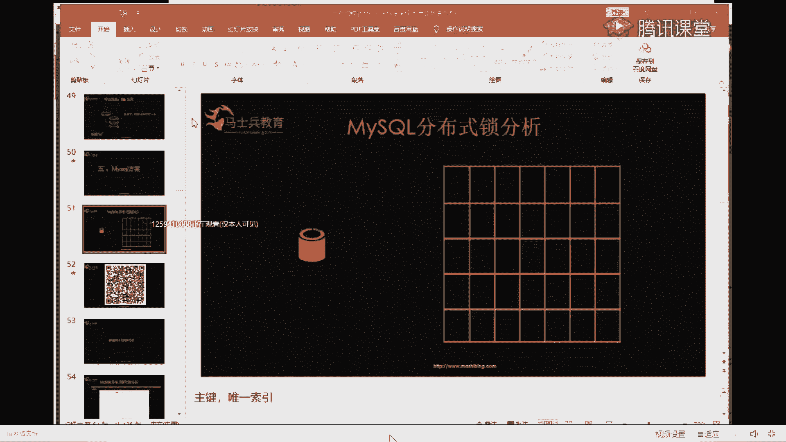

# 系列 6：P101：高并发秒杀场景下MySQL分布式锁实战 - 马士兵学堂 - BV1RY4y1Q7DL

先从先从一个业务场景入手，第一步先从业务场景入手，然后秒杀的解决方案通常是这样的，就是在极短的秒杀的关键词，为什么叫秒杀，秒就是时间短，杀就是用户量大，就是在极短的时间内，忽然涌来的大量的用户请求。

然后你的业务系统如何能承载住，这么大的业务系统请求，并且数据还不出错，理解了吧，现在把秒秒杀秒杀的关键词我已经说完了，大家记住了吧，在面试中问你秒杀，你应该能分析出这两个点时间短，用户量大。

然后还要保证保证数据就是业务系统不崩溃，然后数据还要一致理解了吧，是我我说清楚了吗，你在面试中打秒杀的时候，你们是在听课还是不听啊，问问问问话都没人吱声，懂了是吧，懂了，那我们懂了，继续啊。

秒杀场景我已经说完了，就那几个点，然后业务实现业务实现怎么做，我们这节课的例子是这么做的，整体架构上市用户的请求进来之后，我有一个服务呃，这个服务是接收用户的请求，然后另外它有一个功能是做负载均衡。

然后呢再调用后面的服务来实现业务逻辑，后面的服务就是业务逻辑最终实现的地方，所以我在我们的项目里，我要起两个服务，就是一个服务接收用户的请求，一个服务执行最核心的业务代码，ok这块听懂了吗。

我在这堂课上的例子是什么样子的。

懂了吗，清楚了吗。

一个一个是这个接收用户的请求，一个呃service执行核心的业务逻辑，ok ok我们继续啊，然后说一下呃，先说一下秒杀中间的数据怎么做呃，秒杀秒杀的核心业务，大家想一下，你如果去买一个东西。

比如说抢茅台酒，然后呢你抢茅台的时候，你想一下你的业务逻辑是什么样的，是不是第一我的请求过来之后，我先查一下茅台的库存有没有，如果库存大于零，然后我才去购买，是不是这个是不是这个核心代码的逻辑。

请求进来，先查库存，如果库存大于零，然后扣减库存，就是把库存减一个，然后呢创建一条订单，这个订单就是我就是我的订单，然后呢如果库存不够的话，那就购买失败，这块理解的同学敲个一，这块都比较简单啊。

接收请求是前端，那么对接收不管是前端h5 的还是还是安卓的，什么端发来的，我都说我是后端，好了理解我们继续啊，简单的东西我们就快点过，然后直接就上代码了。

ok然后呢这就是我们的代码，大家看一下核心的代码。

刚才我说了这个这个这个核心代码的流程。

然后这块儿就这就是实现先去库存表里查库存，然后这块我休眠了两秒钟，为什么休眠了两秒，是因为等后面其他的并发都一起，涌入到这个地方，这话能理解吗，我秀我在这写睡眠的目的，我不是为了拖慢性能啊。

我是为了等并发，能理解我这话说的目的吗，就是如果要模拟出并发睡眠，睡一会效果会更好一些，能能否理解我这这个点理解是吧，ok直接直接把库清了，然后呢，把库设置好，这个就这个表，这个表是库存表。

然后查完库存睡一会儿，然后判断一下库存如果是大于零，进行库存的扣减，然后呢扣减完库存之后新增订单，ok也有逻辑带大家看完了可以继续了吧，继续的敲个一，直接压测了，ok那我直接压了啊，然后现在库存是二。

然后呢订单没有好了。

直接拿缜密特压测，点击添加地址，这就是我们要请求的地址，然后呢有一个接收器，这个技术是模拟用户的id，就是用户是递增的，然后呢我一共发十次请求，ok现在直接开始，我把这个关一下好了，已经关掉了好了。

直接秒模拟并发并发已经过去了。

感觉并发连秒没效果，为什么叫并发两秒没效果好了，来大家看结果，一堆的日志中，一堆的简单成功是不是，然后我们看一下这边，这边的数据，然后数据先看一下库存是两个是吧，库存是两个，然后刷一下库存变成一。

库存变成一，然后但是我们发了十个请求变成一，明显是不对的，然后呢订单大家看一下订单新增了十个，是不是也不对，来这块能理解的同学，你敲个一，就是说我有两个库存，有十个请求，然后呢库存只少了一。

然后订单加了十，这是一个错误，这是不是一个错误的例子，但是这么一看代码其实写的也没毛病是吧，我代码选择其实是吧，乍一看也没毛病，先查库存，库存大于零，我我去扣减它，然后呢我再新增订单，是不是没毛病是吧。

但是问题出在哪呢，问题就出在这块地方，给大家简单解释一下，执行到这的时候，有一个请求进来，一个请求，两个请求，三个请求，四个请求，一直到十个请求都在这，他在这查出来的库存都是二，然后判断一下二大于零。

然后十个请求都进入到这个里面，然后都执行的是2-1=1，所以库存最后是一这块大家理解了吧，然后呢，然后就新增订单，那么就是十个请求都都进入这个if循环的话，那就新增了十个订单，知道吧。

所以这块错这块错误的原因，就是因为大量的并发都涌入这个方法，然后怎么解决这个问题呢，加锁用什么synchronize或者lock都可以，这就在j v j v m级别加锁，因为现在只起了。

只启动了一个服务，我看一下啊，然后把它切换一下，切换成有锁的，然后呢把服务重启一下，不锁吗，我先从最简单的没锁的给你演示到有锁的，再演示到分布式锁的啊，sweet有点甜，别着急别着急啊，明白是吧。

o好了，然后呢重启一下，现在把锁已经加上了，然后重启一下，然后把那个数据我们再恢复一下，对山本力所在分布式锁，你说的对，you are right，好了，然后呢库存刚才已经改过来了吧，库存变成二。

然后订单还是没有，然后呢再来压一把，ok但是这十个请求都走完，你看十还是现在还是9765，郭鑫鑫，谢谢，二三等他走完啊，这边二一，ok。

然后呢看结果先上库存从二变成零，是不是库存对了，刚才是一，现在变成了零对吧，然后看订单，两个十个用户来买库存，就有两瓶茅台，然后呢库存减了二，东西卖完了，然后只有两个用户买到了来。

现在的结果大家能理解的，敲个一就结果已经正确了，不像刚才那样，库存最后变成了一，然后订单加了十。

ok那那接着继续啊，但是这种情况下还有这种情况呢。

还有一个问题，这个锁是怎么加的，好的，我给你看一下啊，这里有一个gm什么，我我把这个注解打开，然后呢点一下这个呃，有一个jvm锁lock，谁就写了个synchronized。

你也可以用用lock去做简单吗，就实现了j u m级别的枷锁。

但是这个不是我们课程的重点，这个比较简单好了，然后在在实际在实际的工作中呢，肯定会遇到这么一个问题，是集群的问题，第四集群的集群问题，什么问题啊，就是说处理就是为了避免服务的单点故障。

我们会用多台服务来实现，就是说这个服务挂了，有另外一个服务能顶上，这个大家可以理解吧，就是在实际工作中，然后呢通前面通过加一层负载均衡，然后来平衡这两个符，就是有比如说有十个请求过来，先给这边加放五个。

再给这边放五个线程，一直能量后遇到会被超时呃，这个一会儿再说啊，这个你先听，我把主线就是把我们主要的思路捋完，然后呢中间课程中有任何的问题，到时候你再问老师一一给你解答好吧。

然后现在我们就说呃有两个业务处理的服务。

我们再额外来起两个，刚才是一个8004，你看下面是8004，然后现在呢我再起一个8005。

这样的话我们的架构就变成了我图上的这个样，子，就是这边是8004，这边是8005，两个业务服务来执行。

然后等它起完之后，我来压测一下它的结果，咱这边启动完成，好8005基本上启动了8004日志清掉，然后呢，这边再重启一下，然后呃代码给它删，数据库给他删掉嗯，库存给它变成二。

然后呢再来压测一下呃，压刚才有同学问压测什么，压测用的gma，然后负载均衡怎么做的，负载均衡其实就是用微服务ribbon做的，用ribbon做的就是spring car ribon，但是现在最新的。

大家知道spring cloud最新的负载均衡用什么做吗，现在现在不用ribon了，好了直接压了点，好等着请求一个一个示范完，剩下九个八个不是，不是fan也不是完了，最后给大家好好讲一讲。

因为这个一讲话题又扯出去了。

先收回来，先看我当前这个结果，然后当天的结果是我起了两个业务服务，然后呢还是像原来的请求一样，原来的压在一样，请求压过来，看我们的数据还对不对。

我们直接看数据库，数据库的库存现在是几个二，一刷新变成了零是吧，库存变成了零，没毛病是吧，然后呢看这边订单变成了四，是不是又发现问题了，四个用户来买两个库存的东西，结果库存卖光了。

结果是有四个用户抢到了，是不是有，因为原来的库存是二，我们有十个人来买，结果呢有四个人买到了，是不是有问题，应该是有两个人买到才对，这块大家能理解吧，结果现在有四个人买到了，明显是错误的。

错误的原因是什么，就是因为多了，表面上看是因为多了一个服务。

就是原来只有一台，现在多了两台来这块大家能理解吗，就是我做了一个操作，是另又起了一台服务来压榨这个业务，导致了这个结果，然后我们分析一下原因，原因就是最开始在这个在这个服务里。

你看两个服务在这个服务里加的锁，和在这个服务里加的锁，它不是同一把锁，所以他们两个拿到了两把锁，都去执行业务，知道吧，load balance，对你说的对好了，微服务的事先放一边。

一会儿我统一给大家讲一下，spring cloud最新版本怎么着啊，先那个先翻一会再说原因，我给大家说清楚了，就因为起了两个服务之后，两个服务加的锁不是同一把锁，他们不具备互斥性。

所以导致了跟他的错误结果这块大家能理解吗，能理解的，敲个一老师就继续，要不你不吱声，老师在这在这不知道该退还是该进，进退两难好了，怎么才能让他们两个拿到一把锁互斥一下呢，大家想一下，在我们的实际生活中。

你就是他家的锁，他不认他家的锁，他不认怎么着，你在工作中是不是是吧，房东和租客和房东之间是吧，你不信你不信我，我不信你，那么找个中介，然后在那个政府的软件处理中也是一样的，我们也找一个中介。

下面给大家看这么一个一个小小的动画。

我把这个缩小放进来，就是说还是用户的请求请求到这个服务之后呢，这个服务要加锁的时候，去这个中介中介拿一把锁，然后中介把锁给他之后，然后又有另外一个请求打到这台服务器上，然后这台服务器再去中介拿锁。

他就拿不到了，理解吗，这就解决了，刚才多个服务之间不是同一把锁的问题，就是说我在我服务里拿的锁给你，在你服务拿的锁不是一把锁，那么我们都把锁放出来，我们都别自己在自己屋里玩，我们都放出来。

都去一个公共的地方去哪所，这一块大家能够理解理解的。

敲个一继续o，好了这就是我们做分布式系统，分布式系统，分布式锁的思路给大家说一下啊，就是这个，然后呢他思路的实现有这么几种方式，就是用有my circle的方案，有release的方案。

如kb的方案和etc d的方案，当时这几种方案都给大家说一下，我们先说第一种mysql，mysql的方案，说mysql方案之前为了便于大家理解第三方，第三方这个呃。

第三方中介这个事儿给大家拿文件举了个例子，就是说在同一个目录下，比如说名字叫一的文件，只能有一个理解吧，就是说比如说这个线程来这个目录下，创建了民族唯一的文件，然后又有另外一个线程来这个目录下去。

创建名字唯一的文件之后，发现原来已经有了，所以他就创建不了了，就是说明这个锁被别人拿着了，就是别人来获取所的时候，就创建一个1号文件在下面，然后当另外一个人再来呃，文件系统拿死的时候。

发现别人已经有这个1号文件，所以我就拿不着锁了，这块能否理解，理解是吧，其实这就是他最本最核心的思路，然后紧接着我们来说mysql，mysql的方案呢，其实跟刚才我说的那个思路，大家想一下。

如果要去mysql拿锁，就是一个线程进来一个，甚至进来之后去mysql插一条数据，然后让别人进来，再插不进来就成功了，怎么做，大家想一下是不是用组件第一用主键pk，然后在这一行记录中。

我插一插一个组件为一的这么一行记录，我插进来了，然后别人再来插的时候，也是要抢这个商品，商品的id是一，它也要往这里面插一，那么它就插不去，插不进去，他就报错了，这是主键，还有可以用唯一索引。

唯一索引保证这个列在这张表中只有一个，就说你在唯一索引，你放一个一，别人再来插，唯一索引是一的这一行记录他就插不进来，他就会他就会有问题，就拿不到锁好了，mysql的思路已经说完。

大家理解的超过一为什么都是一啥意思啊，你是说我屏幕中写的一吗，比如说你买某一件商品，它的商品的编号就是一，大家都来抢这个商品的编号，把一放在这里，就是我就说明我要来抢他了，你们谁都别来抢了。

你别人再来抢一的时候，要往里面插一个一，你就插不进去，就说我抢这个东西，你不能抢，等我抢完你再来再锁住它，看看库存有没有，那这个值怎么生成的呢，为啥值是一呢，商品id，这是商品的id。

你你要去锁抢哪个商品，哪个商品的id就是一，不一定是一，有的时候你商品id是二，有的时候你商品id是三，不是一，这这懂了是吧啊，懂了懂了懂了就继续啊，怎么锁锁，刚才我已经说了。

就是说差数据就叫锁一个相对来插一个一，他就锁住了，只要这条这行记录还在另外一个线程，再来插一，它就插不进来，他就锁不住，就这么个规规定，大白菜白菜懂了吗，因为这块比较这块啊，懂了是吧。

这块比较简单一些哈，好了呃，对用pk用用主键和唯一索引，ok，释放所就删除这条记录吗，你说的对，jonny你说的对，释放锁就是把这条记录给干掉，然后别人再来插这行记录，他不就能插进来了吗，懂了吧。

释放者就是把这条记录给干掉，get o好开心，看到你们每次发一个get懂了，我就非常开心好了，那我们就来实践一把。

拿我的代码实践一把，好了，把它切换成mysql的锁，这就是java的好处，要换啥业务，不用动，直接换注解好了，我重启一下服务，这个太危险了，崩溃了，怎么整，这个四谋青年等着别走，等我把代码演示完。

告诉你怎么它就不危险了，这个注解什么意思，autowire qualifire，这个什么意思，这个spring就是把一个bean注入到这个内容吗，这个很简单啊，老师你条理很清晰，听着清楚舒服，你舒服。

我也舒服是吧，好了，把它两个人都起来，然后呢这边再稍微重启一下，然后呢我去数据库把它恢复掉，然后把它清掉，把库存恢复成二，你这个，库存释放有点问题，你看出啥问题来了，一会你说啊，等我把代码演示完。

一会你说问题我一一给你解答，随便问，好了来再来一把亚瑟。

那个亚瑟好了，开始压了啊，好了，十个线程顶上去，现在十杠十，八七，三，你等一下啊，你别走，带着你的问题别走。

等我把这个演示完给你回答好了，零现在是零，我们看结果刚才的结果是二变成了零，然后订单加了四个，是不是有问题的，现在的结果我用了mysql的锁，应该是正确的，二变成零，正确没毛病。

然后呢订单是几个才是正确的，订单是几个才是正确的，一直听课的同学，ok刷新一下，两个对了吧，mysql解决了吧好了，刚才mysql问的那一系列问题都甩上来，我现在给你回答，现在成功的结果已经看到了。

刚才刚才我记得有两个问题，你甩上来，老师刚才说唯一这个人刚才说唯一建设good id，可明明两件商品的id都是一样的，我我在这个系统里只抢一件商品，只抢一件商品，我经常记录，你看库存id就是一。

它的库存就是二，我这里我这个例子里只有一个商品释放，锁断完怎么办，ok回答你这个问题，如果释放所断网的话，刚才加那条记录来，我把ppt打开。

p p t打开这边释放锁的时候断网是吧，然后这是一这是i d，比如说这是主键1号，然后呢你加一个什么start time，然后加一个end time，就是在这个有效，比如说呃在一分就是在零一秒到零三秒。

这个锁是有效的，哪怕网断了，下一个人再来插手的时候，发现超过了不在这个时间内，它就可以接着插，知道吧，你可以把它的唯一索引再加上时间来判断，懂了吗，对类似于一个过期时间。

就是说你判断所所是不是有效的时候，你可以再加上时间，懂了是吧，懂了继续刚才的问题还有吗，有问题甩上来，然后mysql就过了，会不会竞争过大，导致表所两个商品是同时两两把两把锁并行吗。

对的两个商品就是两把锁并行，时间完不成，时间完不成怎么办，就说这个业务没有执行完，另开一个线程，为了做手，用一个买sl数据库，有点杀鸡用牛刀的感觉，这个就看怎么去衡量，知道吗。

有的人有的人有的公司的业务，比如说就十个人，他搞两台服务器都觉得是浪费，但是有的公司的业务有1亿个人，他搞100台他都觉得不够能懂吗，不是说用几个mysql的问题啊，行云流水，我这么说你能懂吗。

mysql只有一台挂什么，那就做mysql的集群，咕咕咕，懂了是吗，好了这个能否过，因为这个mysql，它一般人一般的也就是一些小型系统，有mysql大系统用的redis，我在后面给大家详细的讲一个商。

一个商品可以抢两份，好像不行了，什么叫一个商品可以填两份，好像不行了，就是买两买两个是吗，那个是业务那个业务的情况，等我课后再跟你聊啊，就是这里把我的先抢一个，然后拿这个把所有的锁讲完给你聊。

给你聊抢多个的时候怎么做啊，实际业务与白色分布者不多吧，实际业务用一些小项目会会用，会不会把mysql压垮了，呃mysql的话呢。

看你是什么样的mysql，我给你看过，你看看这个mysql，我就我就知道你们会问的一些问题，我都给你准备好了，这个mysql它的q p s是10万，他的q p s是10万。

你写的业务代码能达到10万的qp吗，mysql说mysql能把mysql压垮了，你得看是什么样的mysql是吧，用这个mysql你压不垮，你就往死的压，你的q p s也达不到10万，你压不垮了。

mysql都能顶得住100000q p s，它已经不是你系统的瓶颈了，所以没关系啊，得看配置，对硬件好了，这不是这不是都一样啊，我说这个的目的是刚才有人说mysql的性能不行，我是给你拿这个举例子。

看是什么样的配置，才能达到什么样的性能o，好了mysql过。

然后下面给大家说redis的解决方案。

