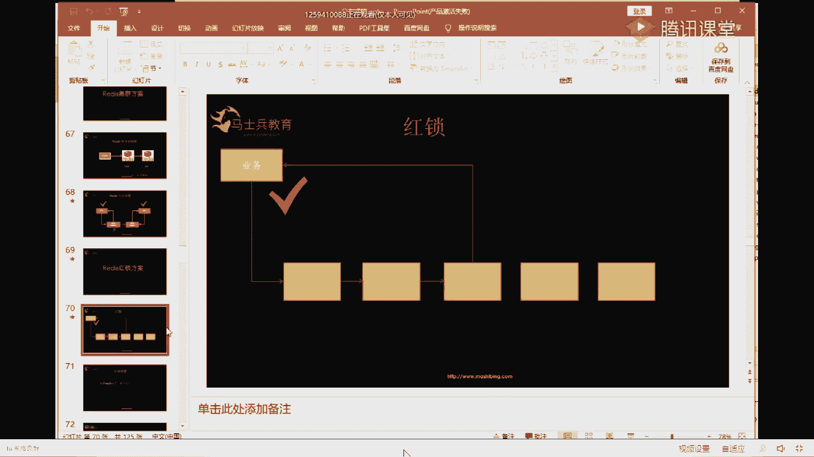
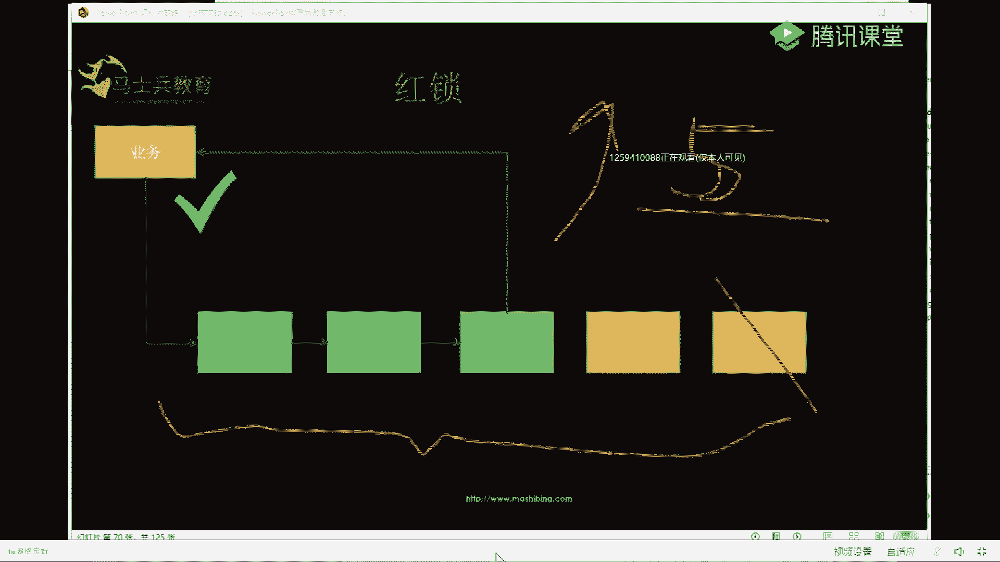
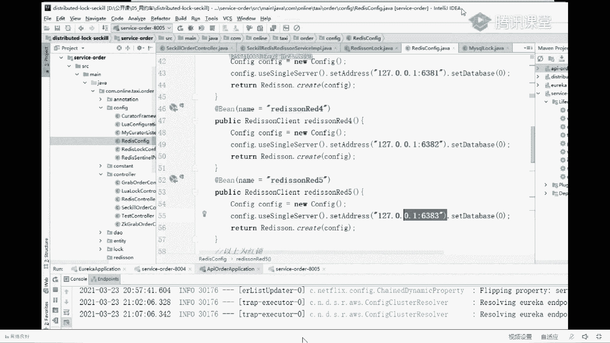
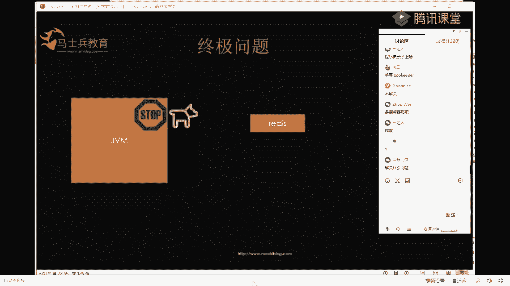
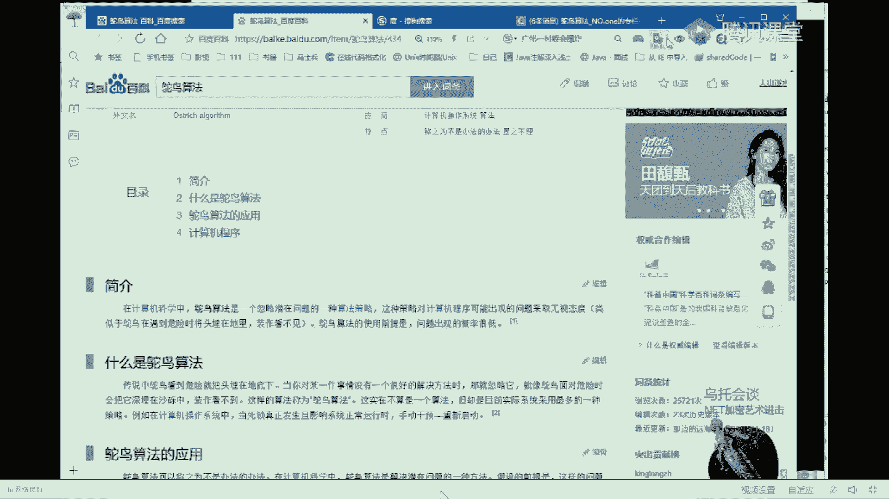
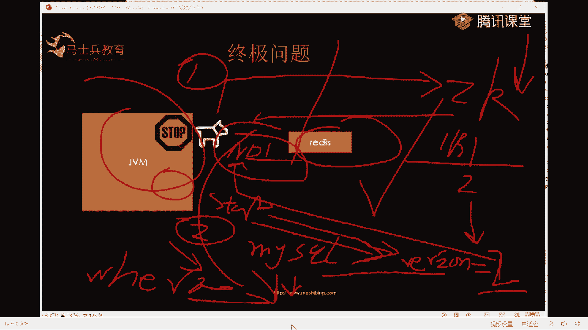

# 系列 6：P103：Redis红锁方案 - 马士兵学堂 - BV1RY4y1Q7DL

为什么叫红锁？😡，这个名字取的它本来其实它的本名叫radis。L。然后把意思给去掉了，所以叫readd lock，翻译成中文就叫红锁，知道吧？为什么叫红锁？懂了吧。

然后红锁的话给大家演示一下是怎么加的啊。😊。

5台元意思。这就是我们准备好的舞台readdies啊，这是readdis rais，它们之间没有数据同步，这是舞台独立的readdies。然后好了，业务来进行加锁，来了一个业务，然后先加锁的时候。

先在第一台redase加，你看它变绿的加锁成功。然后接着他去第二台reds加加锁成功，接着去第三台加加锁成功。😊，🤧超过一。超过一半，比如说5台它超过了三台，就算它加锁成功。来，这就是红锁的解决方案。

就这么简单。然后呢，这样的话另外一台服务来加锁的话，他去这个地方加锁肯定失败，去这加锁肯定失败，去这加锁肯定失败。去这加锁它可以成功去这加锁，它可以成功，但是它整体加锁还是失败。因为他只有两个没有过半。

知道吧？没有过半，所以加锁失败。谂不懂。挂了一个这个李亚问挂了一个怎么办？挂一个就挂一个呗，挂一个，他他又能怎么着挂一个。你比如说这这台挂了，挂一个，它加速成功，它加速成功，它加速成功。

那么它整体还是可以加速成功的。只要它超过5个的一半就可以成功，懂了吗？利啊。😊，5台readD之间没有主存关系吗？没有没有舞台readD之间没有主存关系。😡，为什么用这种方案？

就是为了要避免reice之间主从导致的数据同步的问题，所以它们之间没有半毛钱的关系，就是独立的reice。会不会出现同时请求一个readice情况下冲突的问题？这个呢如果说你就说这么情况，你看啊。

来两个请求，他加他他也加他，他加他，他也加他他加他，他也加他reies是单线程的，只能有一个来加速成功。比如说一个加速成功，那么他来加锁就不成功。然后他又加锁成功，他俩加锁又不成功，所以不存在。😊。

懂了吗？这不是耗性能吗？搞这么多台re。首先这个耗性能其实。也没有那么厚，因为reis本来操作就很快。第二。😊，性能和你的业务的正确性之间，这个你要做平衡，不能说因为因为怕耗性能，就让我的业务去出错。

能理解我这个意思吗？我要保证业务的一致性，哪怕我提升性能都可以。就像123061样，或者银行一样。我可以让你用的慢一点，但是我的数据绝对不能出错。12306，哪怕让你抢不到票。

我也不要让一个车厢多卖两张票。😡，懂了吗？Yeah。好了，红锁的解决方案就是这。😊，大家有什么问题可以问一下啊。😊，我觉得应该在在实际工作中，应该这块这块集中的问题会比较多一些。有问题了。

没问题就过了啊。有问题随便问。再减一面re的lock一个线程加三个锁，我都我都剪完了。你看啊5台reis呃，这里面加锁成功，这里面叫什么？这面加锁成功，只要有3台reis加锁成功。😊，他就是加的。

就是过半就加做成功。偶数咋办呀？来偶数正好给你说这个点，就是你们问问题的时候啊，就能把这些。你们需要注意的点全给问出来，偶数尽量不要用偶数，就像国家是吧，常那个最近比较火的那个老杨。是吧老杨是吧。

美国没有资格跟中国这么说话的老杨，他是一个什么人啊？是吧。常委。长尾有你见过有4个长尾，6个长位，有8个长尾的吗？啊，还有10个长尾的，你见过偶数的长尾的吗？你见过偶术哥的长尾吗？

所以这个系统是你自己来搭的，你就搭基数个就OK了。😡，这敢举例子，我又没说什么。我又没说什么，我就说常委是基数个的，怎么了？联合国五大联合国五大常任理事国也是基数个的。挂一台就是偶数了，哈哈。

莫名的笑点。首先挂一台，我程序启动的时候，在程序中就配5台。如果你挂一台的话，我程序认为的总数还是5台。大家看一下我的代码啊。

大家看一下我的代码。一台、两台、三台、四台、5台，我程序一启动，它就是5台。哪怕你挂一台。

这台挂了，我也认为它是5台，只要还存在的高于三台就能加锁成功。那要是剩俩呢，来进来这个人，我得把你拖进来。😡，这个利亚是吧，这个同学你啊首先我们为什么要用多台re是为了解决。单点故障呢。

单点故障就是因为一台挂了，业务实在没法搞，所以我要用多台。你还说我搞了5台又挂三台，那你这多台不白搞了吗？😡，知道吧？所以别忘了初心，我就知道有人会问这个问题，你就是要避免一个问题的。

结果你好像大多数都挂了。那这不是这个集群不是白搞了吗？😡，你就啦哇，你啊。就剩两台云养加速失败积木，你还没懂我刚才说的意思吗？就剩两台。😡，啊，你找多台，你你为了避免单点故障，你找了多台reies。

然后你还要让大多数reies都挂，你搞这个单点故障，你这个运维就该被开了。知道吧。如果如果你如果你这样如。如果不是。嗯，你懂是吧？懂了好了，刚才懂了吧？😊，你要想到你是为了解决什么问题的。

然后说我那个问题其实我不解决是吧？解决问题时我不解决它是吧？这没没没没必要啊。😡，好了，那么这个。三个机器怎么保证三个机器怎么保证都成功。首先三个机器啊，你看啊。给他的keyset成功，这台机器成功。

然后紧接着有一台成功之后，赶紧去另外一台也set，它又成功给它又set，它又成功。就是s NX执行完这个命令之后，成功不成功，你自己是你自己是知道的。然后呢，只要成功的数量超过三台，就算它加索成功。

懂了吗？三台加网锁后挂了一台锁呢。三台交管锁和挂一台锁，我一会给你解释，先把红锁的方案说完。紧接着我会就要说三台挂一台的问题。如果绿色的挂一台呢，好了，你们迫不及待，那我就开讲了。

本来想着在这块把你们的问题都答一答。你看你们问的这些问题，如果绿色挂一台呢，马上讲，还有刚才三台挂一台呢，马上讲好了。😊，都集中在我后面要讲的问题，你们太聪明了。好吧，接着讲红锁的问题。中间这地址挂了。

怎么整来看着啊。😡，5台ed紧接着加锁，这个业务来了，给他加锁。好了，这个成功，然后这个成功。😊，加锁成功，这个加锁成功，现在有三台relis，看绿颜色的，三台res都加锁成功。

那么我这个业务的线程是不是加锁成功？那么此时就像刚才那些同学问的那些问题。绿的readies挂了。好了，这台挂了。😡，这台redis挂了，你别管他怎么挂的，反正硬盘硬盘丢了，机房爆炸了，被水冲了。

反正数据没了。运维哥哥很勤快，又搞了一台redis上来。这台reis里面你原来不是 set了 key值吗？😡，你原来不是 set载了K值吗？现在呢K值没了，变空了，我还用个白色的来表示，就是里面空了。

然后呢，紧接着另外一个线程又进来，用另外一个业务又进来加锁。你说这个业务他来之后，他去他家能加上吗？此时他能否加上。😡，加不上去他家也加不上去他家能否加上？去他家成功。去他家成功。去他家。成功，然后又。

成功，然后又回到了我们最开始的问题，两个县程拿到了。同一把锁又会造成了。超卖。这字写的有点飘逸，好了，懂了吗？用红锁，你依然会造成超卖。理解了吧。不知道挂了还能成功吗？这不是给你给你说。

他又会造成超卖吗？虽然说多卖一个没事儿，但是对程序员是吧，伤害不大，侮辱性、侮辱性极强是吧？这是侮辱程序员的一件事儿。😊，为啥还没懂吗？神雕大侠。😡，Yeah。第三开不是挂了吗？怎么加锁成功的？😡。

你不好好听课。竖起你的耳朵好好听哦，我现在再给你重新说一遍。第三台挂了，我说的是你的运维哥哥又起了一台。😡，一台空白的赶紧起来，因为很积极。就因为做了自动化。是吧111一挂马上起一挂马上起。😡。

所以就会导导致后面又加锁成功了。来这块听懂的同学敲个一。手噶。好，懂了是吧？那这个问题如何解决呢？就是解决问题的时候，我们要分析问题产生的原因，产生的原因是什么呀？原因就是因为。😊，运维太勤快了。

这块起的太快了，还没等这个程序执行完，或者说这里面的锁都过期，它就起来了。导致这个程序一一来拿到了锁，就是两个程序都拿着一都拿着同样的所在执行业务就超卖了。所以这个reies如果运维要启的话。

要么等这个业务执行完，要么等这边的锁全过期。OK懂了吗？所以这个里面在你的部署方案里，你要用红锁的话，你告诉你的运维哥哥要延迟启动是吧？哪怕延迟一天都可以。😊，把约费关小黑屋是吗？程序员的天敌有很多种。

有产品，有测试，有运维。还有boss是吧，程序员啊。Yeah。对，隔隔隔一段时间再起，哪怕就写上24小时之后再重启，就是这几台挂了，24小时之后就是这5台燃D嘴挂了不要紧，你别起早了，起早了会出问题。

就是挂了时间长了时间长一会儿没有问题。😊，程序员全是天敌，程序员是所有人的天敌是吧？好吧，这块听懂的同学。😊，敲个一。基本上reies的锁都给你们已经讲清楚了吧，喝口水啊，让老师喝口水。😊，好了。

到这之后，大家觉得这个。这个方案就特别完美了吗？嗯。😊，讲清楚了，不知道怎么写代码，代码给你代码都已经写好了。你们刚才没看到我的配置吗？😡，红锁真强好了，stop。然后红色。

怎么做延迟启动都已经给你说清楚了。好了，接下来要给大家再说红锁的另外一个问题。好啦。😊，然后我把这个问题呢抽象一下，就是这个JVM呢，就是说所有的程序，你别管是一一个服务，两个服务还是三个服务。

它就是多个服务。然后这个reice，你别管他这一个reies还是多个人的，我就当它是一或多个reies。😡，我抽象成这两个概念，然后呢。在java里面有这么一个概念，就是说你程序在执行时候。

你锁也加上了狗也开始不停的给它续期，一切看似很美好。然后呢。java里面有这么一件有这么一件事情。叫stop the world。嗯top。日。😔，Word。在负JC的时候。会有stop world。

当stop the world发生的时候。狗这个续期就是你家狗狗也被冻住了，就是整个世界都stop了，你的狗也冻住了。你的狗冻住之后，这个key是不是会慢慢的过期？是吧然后这里面就没有key了。然后呢。

另外1个JVM进程又来了，它没有key，他来加锁能否成功。😡，能是吧能成功之后他加成功了。然后这边呢stop word它没了，又开始start正常执行业务了。你说是不是？他他在同时执行。

同时拿到了所在执行业务。来这块听懂的同学，你敲个一。又超卖了是吧，你看大家都懂了，不用我说又懂了。😡，那么此时。要封了是吗？没事，到时都快快好了，马上就让你不封，马上把你拉回来。😡，好吧。

那么此时这个问题怎么解决？这个问题怎么解决？class那冒出class class不就是集群吗？😡，好了，这个问题的原因就是第一，readdis的 key会过期。第二。

用GVM会有stop word发生。只要它ki会过期，它就stop the word，那么它就会发生刚才的问题。🤧Okay。那么怎么解决？你让reis keep过期了吗？

你让这JM不发生stop the world吗？no，你都干不了。😡，你都干不了的情况下，在负J4的时候会发生stop the world呀，你都干不了的情况下，只有去换掉它。😡。

那你说是把res换掉呢，还是把JVM换掉呢？换哪个？如果你要换它的话是吧？找一个没有stop word的语言去写是吗？你的代码是不是改动量很大？换redice是吧？换redice的话，你换什么呀？😡。

用阿里的reis。阿里的readdis它也是reis用ZK是吗？有的同学说用ZK用ZK就没有这个问题了吗？😊，用ZK用ZK的话，一般我们都用临时节点做分布制锁。

临时节点的话是靠心跳去保持stop the world的话，心跳也没了，所以这个节点又挂了。知道吧？所以换ZK。也有问题。那如何解决呢？没想到转语没想到转语言是因为一条狗，哈哈西塔怎么能冒出西塔？天哪。

你们这都什么来想一会儿想一会儿怎么解决。😊，来，想想这就课让大家把这个把这个知识点都彻彻底底搞搞懂了。崩了放弃，别放弃。手写如keeper鸵鸟算法。哎，默默，我喜欢你这个词。陌陌。我喜欢你这个词啊。

鸵鸟算法。就这个到就是问题，如果你能跟你能跟如果你在面试中能达到这一步，你已经很优秀了。😡。

然后刚才有人说鸵鸟算法，我们先看一下鸵鸟算法是什么。因为这个问题太罕见了。鸵鸟算法解决什么问题了？看百度百科。这都没有百度百科呢怎么。好啦。鸵鸟算法。在计算机科学中。

鸵鸟算法是一个忽略潜在问题的一种算法策略。这种策略对计算机程序可能出现的问题。可能出现的问题，采取无视态度，类似于鸵鸟在遇到危险时间头埋在地里，假装看不见是吧？就是有这个问题了，我假装没有不解决了。

知道吧？有这个这还是在计算机科学里。😊，就是有这么个算法，知道吧？然后呢，这个问题使用的前提就是问题出现的概率极低，对吧？那有个前提啊，问题出现的概率极低。靠还有为什么高深的东西，你别着急。

我给你把这个解决掉啊，鸵鸟算法是一种。好多人都这么解决，都忽视。因为这个stop world太不常见了，可能你开发代码一辈子到80多岁，就算你80岁不退休，你在生产环境中也。😊，也遇不到这种问题。

一般面试官也问问到这也就差不多了。好了，但是呢作为老师很既然你都来了，很负责任，我们是马志敏教育，但是肯定给你把这个问题给你解决掉，不能让你是吧？遇到问题逃避，知道吧？要积极的面对人生，那叫什么来着？

😊。

刚产生的问题没听明白。你哪个问题没明白，你到时候打出来呀。😡，好啦。给大家说解决这个问题。解决这个问题给你解决马世频教育什么问题都能给你解决掉。好了。😊，为什么遇不到负为什么遇不到f负来来来好了。

拉收收收别讨论这个问题了啊，可以讨论fJC是可能遇到的吧，是可能遇到的哥哥，我刚才跟你说了，可能遇到它，只不过是遇到它的概率极低，知道吧？我没有说你说的不对啊，只是说这个问题概率极低，你可以忽略它。

采用鸵鸟算法忽略它。但是呢老师给你讲的，讲讲一下怎么用它。😊，好啦。😊，回来回来回来收怎么解决这个问题？😡，还是用ZK。是吧刚才同学说了，老师说了，用ZK不行。😊。

因为sstock the world之后，它跟ZK的连接也断了。好了，那怎么解决？😊，在加锁的时候返回一个序号。ZK临时节点有序号。number比如说加了个number one，然后加到序号之后。

再配合一个ready呃，配合一个my circlecle。mycircle中加一行记录，这行记录里面有个wason。等于一第一这里面有两步，第一步去ZK拿临时节点。第二步，拿到临时节点之后，把它s到。

数据库里这是一行记录，我省是一这个一对应于这个临时节点。好了，此时哪怕它stop the world了。狗狗停了ZK的临时节点，一号临时节点过期了无所谓。另外一个程序再来。

它拿到的是几号节点回答我的问题。怎么还是一这个reies不是roki学的不合格啊，这个le啊去找小姐姐要一份roki啊，好多同学说二是吧，他拿到的是2号节点，2号节点，他拿到了2号节点，他去。😊。

更新这条也插这么一条数据，把这个version变成了2，它拿到了2号节点。然后这边star the world，哪怕他世界重启了，它去数据库执行业务的时候，它update数据的时候，它加一个Y条件。

Y are version等于我这边加的number one。此时发现version已经变成了2，所以我。执行失败，因为不是我家的锁了，说明我当时昏过去了，被别人抢了，那么不是我了。😡，懂了吗？

此事就解决了。😡，res和JVM的所有的恩怨情仇。懂了吗？

总结一下方案其实很简单。