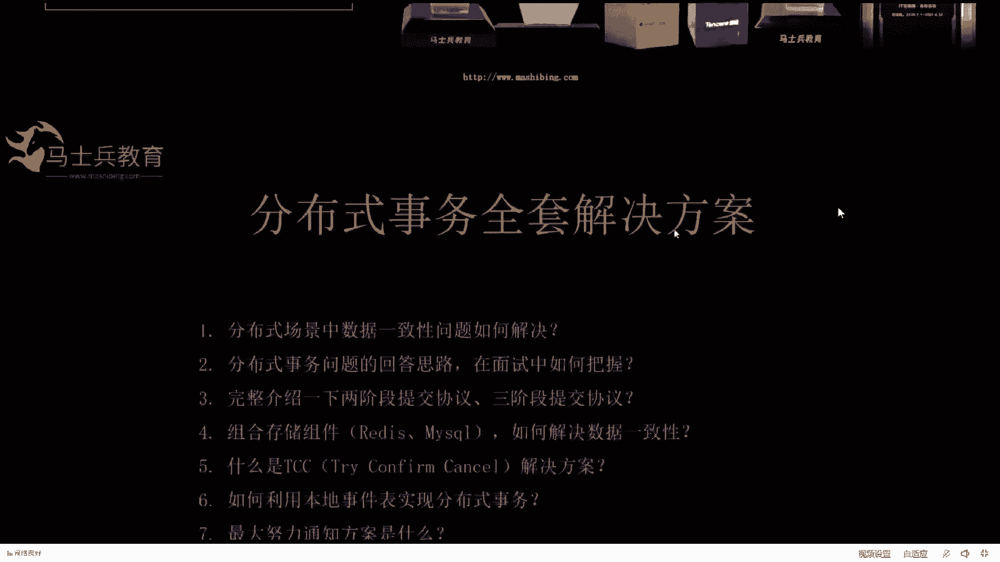
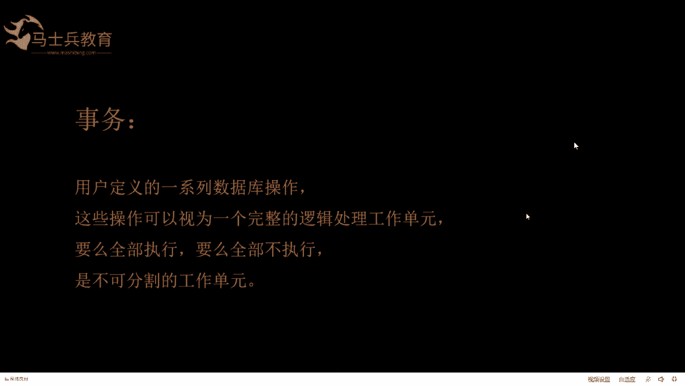
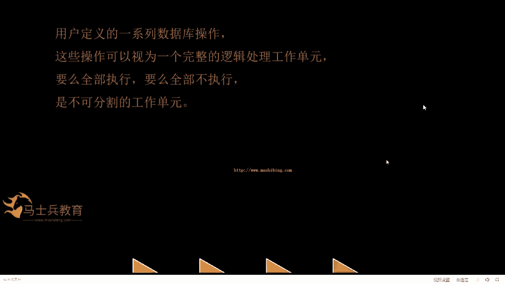
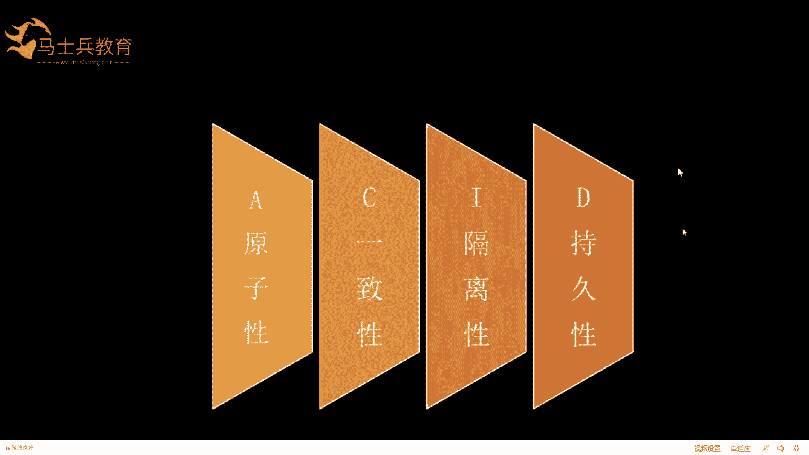
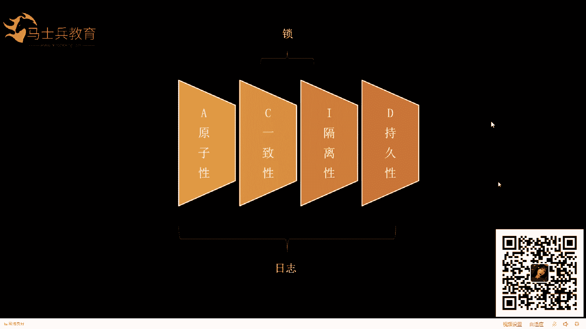
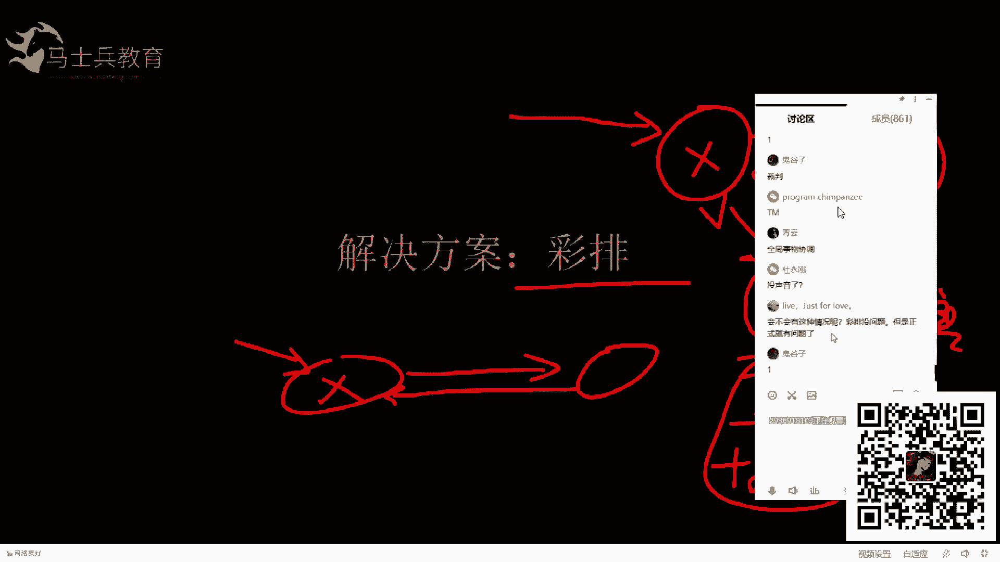

# 马士兵教育MCA架构师课程 - P109：分布式场景系统中数据一致性问题如何解决 - 马士兵学堂 - BV1RY4y1Q7DL

我走不动。好，那个这是今天我们呃今天一晚上的所有的课程内容，然后。

第一个我们讲一下分布式场景中数据一致性的问题如何解决。因为分布式就是涉及到多个服务或者多个数据库之间数据的同步，就是是吧？比如说现在比如说这是服务一服务2，然后每个服务挂一个库，每个服务挂一个库。

怎么能保证这两个服务和两个库之间数据的同步呢？这是我们今天的课程的主题呃，还有就是。分布式事物问题比在在面试中就是分布式事务和分布式锁，它是呃几乎是做分布式系统必问的一些问题。

然后这里面呢我会把分布式事物的解决的思路，在这节课里告诉大家，呃，这个思路有几个目的。一个是你在面试中回答的时候，能把它说清楚。第二呢，就是你知道这个思路之后，你在学习后面的分布式事务的方案。

那你就会更加的从容。好了，这是第二点啊。然后还有就是呃我会在课程里面介绍一下两阶段和三阶段提交协议，就这两个协议。对学习后面的分布式事物就是特别有帮助。虽然是一些理论性的基础，但是你把它掌握了之后。

不管你学以后的西塔还是LCN都会有一些帮助。然后再有就是第四点组合。存储中间件如何解决数据一致性的问题。这个大家能理解吧？比如说我这里面写了两个reis和myscle。也就是说你在一个方法里。

比如说是你的方法，你在一个方法里呃调用了，比如说set呃KV就调用了reis，然后也也update了，就是update了一个数据库是吧？这是第一个调用reies，第二个调用呃myscle。

如何保证它俩的数据一致性呢，这是个这是我们要解决的这个问题，还有就是什么是TCC然后TCC的解决方案是什么？这个我们课程里也会说到第有就是如何利用本地事件表实现分布式事务，这种这个实现事务的解决方案呢？

就是不不需要引入额外的任何组件，只需要利用本地的一些特殊的设计，就可以完成分布式事务，这个就比较简单也好理解。第七点呢给大家解呃那个讲一下最大努力通知方案是什么。好了。

这就是我们今天晚上要讲的所有的内容。大家脑子里应该大概有个印象吧。刚才有个同学问讲西塔吗？西塔必须得讲啊，必须得讲西塔。我们讲两阶段和三阶段的时候就会讲西塔。然后讲TCC的时候也会讲西塔。

我们都是基于西塔框架实现的O。可以吧。然后听这个。这节课所有的内容就这些。然后呃听这个课的时候呢，建议大家认真听讲，然后该问问题的时候，我会留出时间让大家问问题，要不然就会拖慢我们讲课的速度啊。老师。

这个上周不是讲过吗？是啊，上周讲过。是的，上周讲过，因为这个这个是公开课。啊。公开的话公开课的话，我们就是因为就是内容有一些重复。如果呃我们VIP课里的话是不重复的。啊，好了，我们开始可以开始讲课了吧。

😊，嗯。😊，听你们的啊，确定就写一啊，有有有疑问就把疑问打出来。曹老师听十遍都行。好，那你听着啊。好了，开始上课了啊。😊，好啦。😊，好了，开始上课。好了，讲课的。讲课之前我们从一个场景来入手。

因为我们做技术的，好多人都以为我们做技术的，其实就感觉是一种特别伟大高尚的职业，是吧？我也这么我也这么认为，但是。谦虚一点说，我们技术其实就是个服务行业，我们是为业务服务的，脱离了业务。

你说这技术还有什么用？是吧这这个大家能理解吧。😡，就是虽然我们敲着键盘是吧，拿着鼠标感觉是吧？自己不种田不种地，感觉现在玩高科技是吧？但是其实我们不是这样的是吧？我们是为业务服务的。

所以我们的技术都要围绕业务产景出发。O好了，业务场景。给大家说两个例子。第一个例子。大家如果用过第三方支付的话，比如说用过呃支付宝或者微信用过这两个吧，直播间里用过的同学。直播间里用过没有？用过是吧？

OK好的，用过的话应该知道。比如说这是一个服务。举个例子啊，这是一个服务，就是我们呃一个serverer，他提供一个web外b接口，让别人来调用。然后这个呢也是一个web服务，提供一个外b接口。

让别人来调用。首先我们把这个人理解成第三方是吧？第三方收到钱之后，调用我们的服务。然后我们的服务呃，支付服务，更新数据之后，这边一般的指的是支付的流水，就是更新完支付流水之后。

我们再去更新我们的业务服务。业务，比如说是订单。是吧比如说我们系统里呃买了一个东西要成交一个呃，比如说买了一个手机，要付款，付完款之后，这个款是打到了第三方。打到第三方之后，第三方来回掉我方的系统。

那么我方的系统一般是这么做，它先回掉我的支付系统就告诉我，你把哪个订单给我支付了。我想把支付流水给改了。这样的话我知道我的订单是支付完成的状态。然后同时再去修改我们的订单系统，把订单的状态变成已支付。

一般的是分这么两步进行的。这两步呢也会涉及到两个服务。比如说支付服务和订单服务，这里面每个服务呢都挂了一个数据库。我们呢我们这节课的目的就是要保证这两个服务之间数据是一致性的。这个老师说的这个。

目的大家能ge得到吧？能不能get到，能get到就敲一。OK好了好了，这是这是一个例子啊。其实这种例子非常多。还有一个我们大家更好理解的理解的例子就是比如说我在电商业务中。

比如说有这么一个业务场景叫下单。下单的话，比如说这是用户，用户要去购买一部手机。举个例子，他买一个手机之后。😊，它会生成一条订单，比如说某某某某年某月某日呃，买了一个手机多少钱？

是吧多少多少多少多少人民币是吧，这是一条订单记录。OK但是在生成这条订单记录的时候，因为它要下单嘛，下单在生成这条订单记录之前，他会去判断一下库存还够不够。在一般的大型电商系统中会涉及到。

其实在那个一般的大型电商系统中，它这个下单的服务会非常的复杂。有直播间里有做过电商的同学吗？直播间里有没有做过电商的同学？有的话给老师敲个一，小马这么多同学都做过是吧？你没有啊，有是吧？做电商的。

有过做电商的同学应该知道下单这一步我图中画的是比较简单的，但是它实际会非常的复杂，它会涉及到比如说销售层，就是库存这个服务，它会有它会有很多层。比如说销售层的库存，然后还有调度层的库存。调度层的库存。

还有就是仓库层的库存。okK这是这个服务就分了好几级。我这个里面只不过是把它。抽象成了一级，统一叫做库存服务。做过电商的同学应该能理解这三个层是做什么意思，做什么的吧。能不能理解这块儿。

如果不能理解的话，我们呢我们有我们有零基础的小白项目课，这里面我们都把这些说的说的很清楚。就是在一些大型电商系统里，一个库存就分这么多层。然后只不过是我在这个例子中呢，把它呃抽象成了一个库存。

就是它去调库存，先把库存减去一个。比如说要买一个手机，就是把库存减1，然后订单呢加乙，这时候是两个服务，两个库，这边又是一个服务，一个库，理解了吧？我们的目的。

我们的目的就是要保证这两个服务和这两个数呃，这两个库之间数据是一致的，就是不能说库存减了，然后订单没增，或者说订单增加了，结果库存没减，没减，这就尴尬了。能理解我们我说的这个例子里面，我们的目的吧。

分多餐还有载图量。嗯，你说的对啊。好了，哎，那个叫载途库存。好了，能理解是吧？能理解我们就继续了啊。😊，好了，在刚才我们所说的场景就是分布式事物要解决的数据一致性的场景。在我们讲那个分布式事物之前呢。

我们先来熟悉一下我们最就是最开始上学的时候，就最开始接触事物的时候，事物到底是个什么样子。事物是什么样子？😡，事物就是用户定义的一系列数据库的操作。这些操作可以视为一个完整的逻辑处理单元。要么。

要么全部都执行，要么全部不执行，主要就是这个。也就是我们前面所说的那两个服务，要么。这边增加这边该扣的扣掉，他俩同时执行，要么他做不成，他也得回滚。能理解吧，就这两个是一个原子操作，要么他俩都干。

要么他俩都不干，不能说一个干了，一个没干，这就不是这就不是事物了。O事物就是不可分割的工作单元。这是我们最开始学事物的时候，它的一些定义，同样把它迁移到我们分布式事务中，它的定义还是这个样子的。

OK好了。😊。

我们往下看一下事物的这几个状态，我们快速过一遍ACID大家都理解吧，原则性、一致性、隔离性和持久性ACID怎么做的？😊。

ACID通过什么实现呢？就是当今事物的时候，ACID通过什么实现的？就是它最底层的技术是通过什么做的？ACID最底层的技术。有木有人知道？数据库是我是数据库事务呀。

是数据库事务日志数据库锁blogMVCC说的都对。它其实最重要的就是通过锁和日志做的。

理解吧？其实就是锁和日志，最底层就是用了这两这两个技术，把数据把那个数据库的事物给它实现了，就是锁和日志。在数据库里面有一句话。数据。就是日志比数据重要。那大家能不能理解这句话，就是数据可以丢。

日志不能丢，就是日志肯定日志比数据重要。就是一般的操作数据之前先写日志，这是在数据库里面有这么一句话，大家能理解吧？我跟才所说的这些，这都是数据库的基础知识。为啥？呃，为啥稍等一下啊。至于为什么的话。

我给你我给你一个东西，你去找我们的咨询老师。呃，要为啥就可以了。因为这节课我们不讲扫描屏幕右下角的二维码，找我们的咨询老师去要一些资料，你就知道知道为啥了。因为我们这节课是讲分布式事务这些东西呢。

我就我这节课里不讲，但是我也给你提供了资料，你扫描屏幕右下方的二维码，让我们的咨询老师给你一些数据库的基础的视频，它里面都会有的OK可以吧？这个这个G。😊，好了，我们往我们往下走啊。😊。

我们在实现事物的时候，我们一般怎么做的？我们一般怎么做？打一个标记，就是一个开始标记，得声明这是一个事物的开始。事物开始之后，我们执行业务逻辑，执行业务逻辑之后再给事物收割尾，就是开始结束。

中间是业务逻辑。这个大家能理解吗？这个是比较基础的数据库的知识。能不能理解能力的话是敲一。嗯。能理解能理解是吧？好的。😊，好了，然后这个begin try三个就是标记标记事物的开启。

然后commit呢表示事物的提交，也就是落库，这个也就是刷到磁盘中落盘。然后这个row back呢就是回滚，就是把原来做过的反悔，就是全部撤销，这叫回滚。然后中间就是也有逻辑。O这个基础理解的。

我们后面学分布数的时候就会简单好多啊。我们先回忆一下好了。在我们单体的服务和单个库的情况下，怎么实现分布式事物呢？如果我们用如果做过这方面同学的话，如果我们用呃用spprintring框架的话是吧？

加一个艾特出来三个人注解就OK了，是吧？这是做单体服务挂一个库的时候，用这个就可以，是不是？这个用过吧。😡，艾着出三个人住去。有没有用过？用过的就敲一。O ok好了。😊，好了，嗯，我知道这人问啥好了。

这不是我们这节课的重点，我只是带大家回忆一下。😊，啊，好了，前面说的是事物最基础的一些概念。我们进入我们这节课的正题，分布式事物。OK分布式事务是什么？它它的应用场景是这个样子。

前面我们也讲了一些案例是吧？比如说一个用户的请求进来之后，他请求想打到这个服务上。这个服务通过调用这个服务。和调用这个服务完成它整体的业务逻辑，明白什么意思吗？比如说一个下单请求。

就是用户发出一个下单请求，先他先调用到这个服务。比如说呃这是个user服务啊，就是对接user的一个service。然后user服务呢要调用订单服务。然后要调用库存服务，能理解吧？或者说库存在前。

订单在后，因为先判断库存在呃在新增订单，或者说他调了订单，订单再去调库存返回之后再去新增订单都是可以的。我这个图画的这个意思呢，就是呃不一定这么做，但是通过这个呢，你应该能清楚。

就是说会涉及到一个请求调用多个服务以及多个库的场景。而我们的目的就是要保证。这两个服务。就是这是一个服务这是一个服务，这是一个库，这是库这两个服务以及他们对应库之间数据的一致性。

这就是我们要讲的分布式数物跟前面那个前面那个只是调用一个相对应啊。好了，我们开始往我们开始往下了啊。😊，嗯。好了，分布式事务是指会涉及到操作多个数据库或者多个服务的事务。大家这块注意一下啊。

其实就多个数据库或者多个服务。好多同学以为一个一个服务调用俩库，就不算分布式事务，其实也算，只要你涉及到多个库或者多个服务。比如说这是一个服务，这是一个服务，他俩调了同一个库，这也算分布式事务。

ok这块理解吧，就是一个服务调多库，多个服务调一个库。也算一个分布式事务。其实就是将对同一数据库或者对同一服务的事物的概念扩大到了多个数据库或者多个服务。目的是为了保证分布式系统中数据的一致性。

O这个这个大家都可以理解吧，这样我我应该把分布式事物。😊，他所涉及到的各种各样的场景都给大家说说清楚了，理解是吧？okK好了，那我们继续啊。好了，我们往我们往下。😊，我们先来分析一下思路。呃。

分析就是解决这个问题的思路，我们该从哪里入手呢？大家想象一下啊，我给大我给大家看一句话，看完不知道大家能不能知道它的一个整体的思路。分析这个就是分布式事物数据不一致的原因，是因为事情做了无法后悔。

大家能不能理解，大家想把这句话记在脑子里，事情做了无法后悔。然后我给你详细的解释一下，为什么说事情做了无法后悔呢？大家想一下啊。一个用户发一个请求到订单，订单调一个请求到库存库存。比如说减一。

也就是说买一个商品，库存减一，减完一之后，库存给订单一个响应，响应就是说我减一成功，然后呢，订单收到这个响应之后，在订单里insert一条订单。这个大家可以理解吧。

就是insert orderinser一条记录。O当它insert的时候，这边报错了。这边报错，怎么让库存服务回滚呢？大家思考一下这个问题。如果我们要让库存服务回滚，我们应该怎么做？最笨的办法。

我们说订单服务再给库存服务发一个请求呗，说发一个请求，你把刚才你做的那些事给我撤掉，这也可以。但是我们在实际调用中，这条链路只是发过去发过去有响应执行，然后给用户一个响应。

这个事情只能这么做OK只能这么做。也就是一条链路只能这么做，但是中间没有我所说的那个后悔的这么一个步骤。就是说订单告诉库存服务，你要后悔，没有这个理解了吧？所以这个就是我我前面所说的这句话的意思。

就是事情做了无法后悔，所以说它是导致两个服务之间数据无法一致的一个原因。这块我说清楚了吗？这话说清楚了吗？有清楚的话，你就敲个一，我就知道你清楚了，我就继续了。清楚是吧？好嘞好嘞。

那他无法反悔我们实际工作中怎么去做呢？其实我们软件设计的好多解决思路，其实大部分是来源于工业设计，不知道大家能不能理解我说的这句话，大部分来源于工业设计。这句话如果不能理解，就当我没说啊。好了。

能理解的swift理解是吧？swift的理解是吧？能理解更好啊。然后这些设计呢也有一部分是来源于我们的生活。😊，生活中怎么做这些无法让我们无法后悔的事情呢？大家有没有想过这些这个东西？

生活中怎么做这些让我们无法后悔的事情呢？就是这个事我只要做了，他就定了，我就没法后悔了。那么我为了保证他的万无一失，我该怎么去做？惹女朋友生气，时光倒流，遇啊，青云青云说玉对了吗？是吧？彩排嘛。

先试一把嘛，预言。是吧先试一下，如果说都能成功，那么我就彻底去做了。如果不能成功，那我就不做了，能理解吧？彩排这个事儿能不能理解？也就是说我原来去做我原来去做这两件事儿。第一次做了，然后他又去掉了它。

结果他回来之后，他出错了，我是无法让它进行回滚的。如果有彩排之后，我怎么我怎么做，我先调它哎，你先试着做一把，然后他掉它试着做一把，然后他说成功他试了一下，说我成功了，但是我实际是吧。

可以不是最终的抵销，这只是我。预预演一遍是吧，这叫什么演习一下是吧？又不是真打你是不是？然后完了之后给他一个成功，结果执接他的时候错了，那没关系，我又不是真打。那我这边回过我这边是吧，做了。

相当于没做是吧？能理解能理解这个意思吧？😡，能不能理解这个意思，能理解是吧？OK好了，然后在演习的过程中，是需要有这么一个中间的第三方来收集演习的信息的，也就是说两个他做对了，他做对了。

都汇总到一个人这，然后这个人说哦，你们这你这哥俩都做对了，那我们正式去做吧是吧，去吧，然后说如果有一个做错了。然后这哥们说，哎，不行，他做错了，你做的也不算是吧，你俩重来一次是吧？所以。

得有一个得有一个中间人来收集这个信息是吧？像鬼谷子说的是吧，裁判可以这么理解是吧？才可以叫裁判是吧？在春晚中呢就叫导演，是不是？是不是就这个意思，然后在分布认1务中呢，我们就叫呃TM是吧？

叫transction manager事物管理器或者说事物协调器，这就是一个第三方的角色。OK这个你要理解清楚之后，就明白了LCN和西塔为什么需要启动一个第三方中间键OK彩排这个我说清楚了吧。

从彩排里面我也说出了需要需要一个协调者。这个清楚这个也清楚吧。会不会有这种情况，彩排没问题，但是正式就有问题了。会的。会的啊，你说的这个问题会的。

但是我在后面会讲到这个live just for love。是吧为爱为只为爱生，只为爱活着，是不是？好了，我后面你把你这个问题记住，后面我会讲到这个问题的啊。

