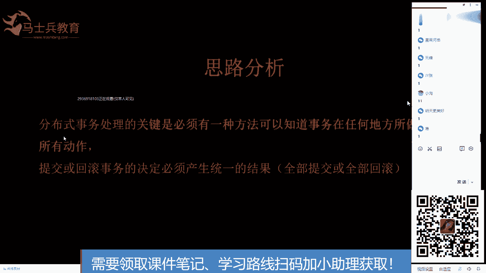
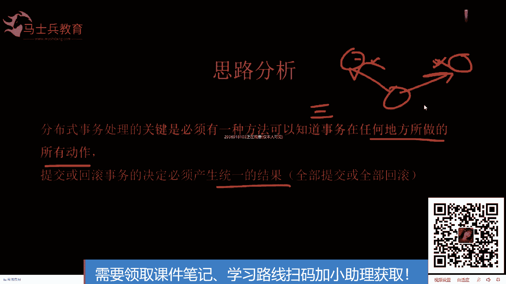
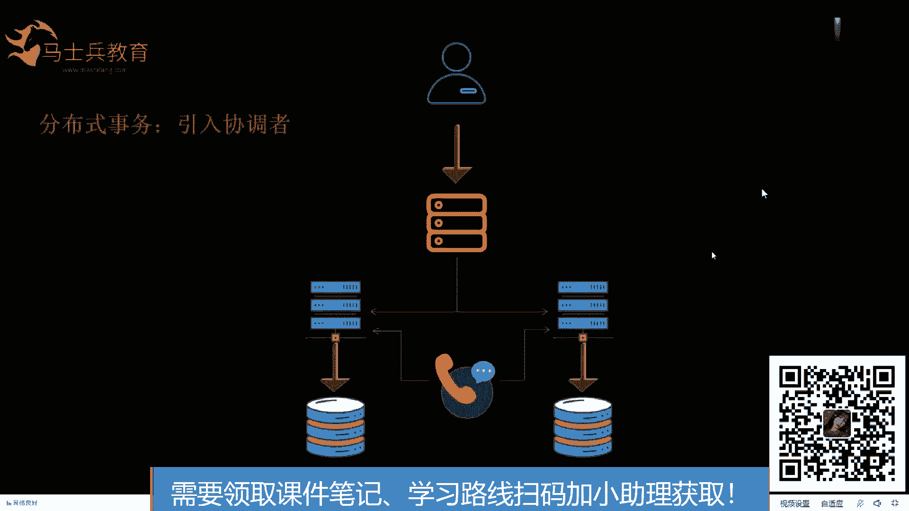
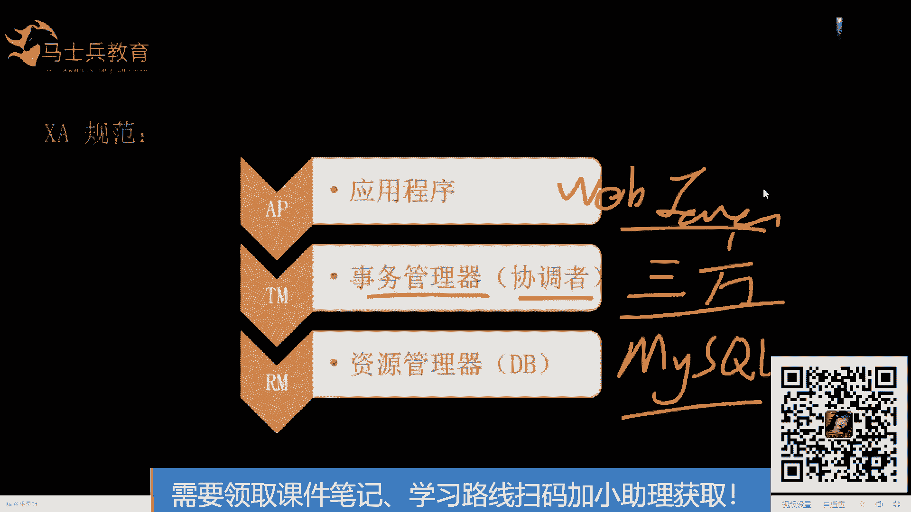
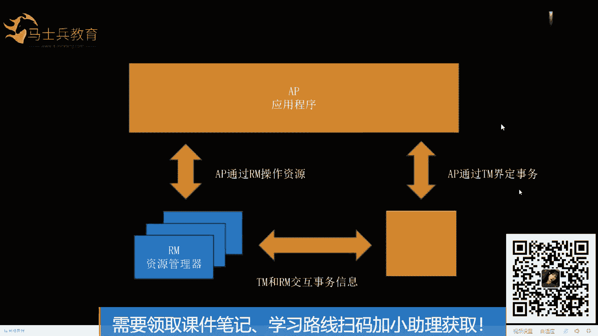
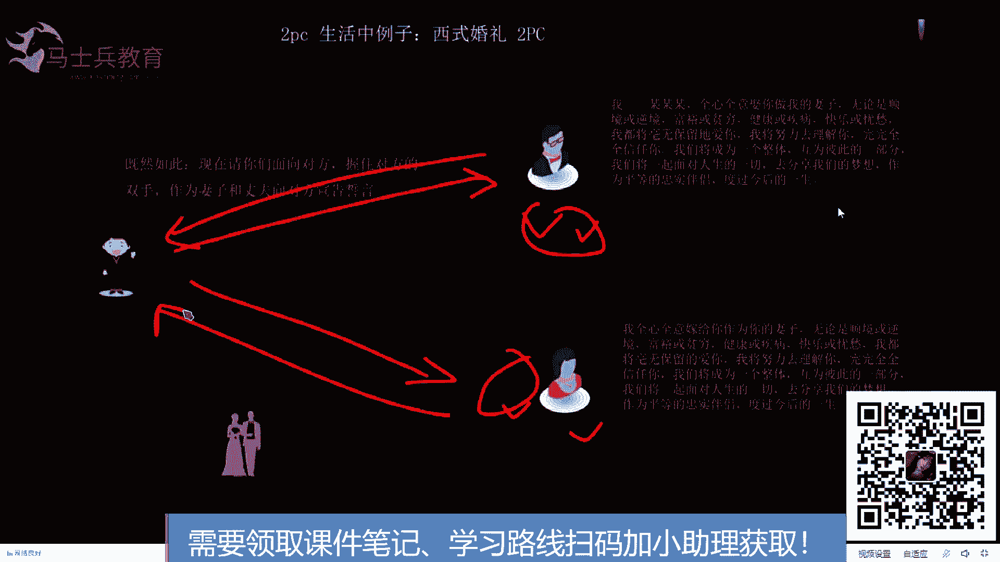
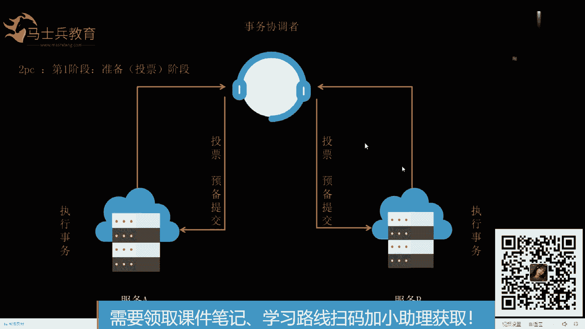
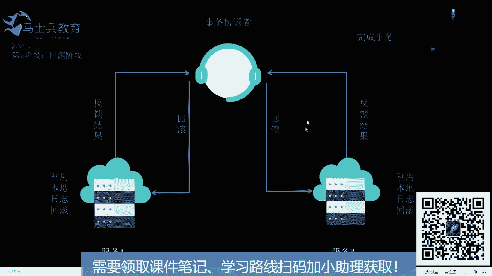
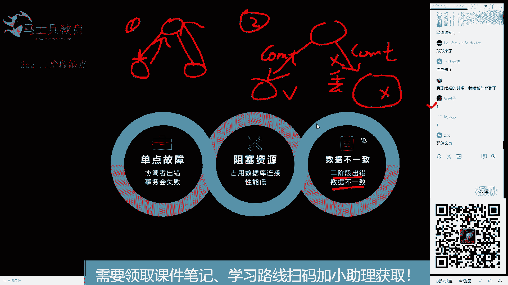
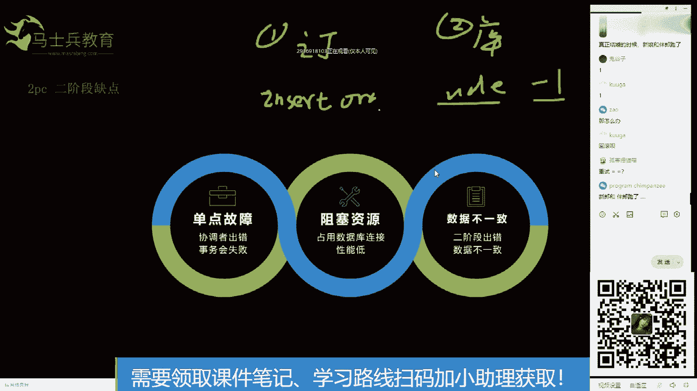

# 系列 6：P110：分布式事务的设计思路分析 - 马士兵学堂 - BV1RY4y1Q7DL

好了，刚才这个清楚了吗？😊。

还有可能导演得病了。对，这个问题我后面也会讲啊这个问题这个猫猫喵猫喵还是这个我后面也会讲这个我后面也会讲，你俩记住啊，为爱活着，还有这个猫。嗯。好啦。😊，我后面会讲到的啊，先说这个清楚了就敲一。

比喻很形象是吧？能理解就好啊，就是比喻不比喻的，主要是为了方便大家理解啊。好了好了，然后我们我把这个缩小一点，还是放这吧。😊。

这样的话我说大家提问的会方便一些。好了，然后通过前面我们所说的我们所说的一个。

分析。那么我们知道分布式事物处理的关键是必须有一种方法，可以知道事物在任何地方所做的。

所有的动作，其实这个就是我们刚才所说的一个第三方是吧，或者说裁判或者叫协调者知道事物在任何地方所做的任何动作。也就是你要知道在这个服务里做的事和在这个服务里做的事。

提交或回滚事物的决定必须产生统一的结果。也就是说让你俩你俩先试最后你俩都没问题，我说提交你俩都提交。我说回滚，如果说有一个有问题，我说回滚，你俩都回滚。

这样的话就将他们的提交和回滚统一了一起统一在了一起。这样也就保证了数据的一致性。O这就是我们通过前面的思路分析，我们得出的一个结论。O好了，那么我们在我们的整个服务的架构中呢，我们就引入了这么一个东西。

这个东西叫协调者就是你服务该调你的服务，调你的服务，该调调去。但是呢参与参与这个事物的这两个服务需要给协调者。

呃，做一次汇报。也就是说这两个服务里需要集成跟协调者通信的组建。这个理解吧，大家能不能理解？就是根据我前面所说，我们推论我们推推论出这么一个东西。OK理解是吧，所以。😊。

这个能力的话就知道我们我们我们所说的LCN呀，或者说se塔呀，西塔这些框架，为什么需要在每个服务里引入一个se塔的架包，再加一个艾g个程的注解，主要就是为了跟第三方进行通信。

也就是说在这两个服务里面做改造。okK好了，那我我们我们就继续了啊。好了，然后分布式事物说分布式事物呢，还有一个东西就是一些呃理论性的东西。这个大家也得知道。

就是叉A规范是叉open组织定的一个叉A的规范。然后这个规范里面涉及到三个角色APTM和RMAP就是应用程序，就是我们平时写java代码的地方是吧？我们的外部地方写java代码主要集中在这个地方。

然后TM叫做事务管理器要协调者，也就是我们前面所分析的第三者啊，不是第三方。

然后再有就是RMresource manager。resource manager呢就是我们所说的。买C口你可以这么理解。O现在的话这三个角色大家都清楚了吧。我们的代码第三方。

mycyclcle也就是我们的数据库。这么说就清楚了吧，你们就不用看百度百科里那么那么长篇大论的一些东西了，就没有必要了。你记住这仨就就可以了。OK好了，然后我们往下走啊。

然后这三者的关系关系是这个样子的，我们的应用程序和第三方做交互okK然后第三方和IM做交互，他们之间做交互。OK就是他们之间进行相互的交互。这个图呢无所谓，我们到时候写代码，我们到时候拿代码来过一遍。

你就知道他们三个人之间的关系了。OK好了，这个图像放这里啊，到时候我们拿代码去看它。

好了，我们往往下走。拆规范总结一句话，什么话，就是事物协调者与数据库之间的接口规范。为什么它叫规范呢？是吧？为什么它叫规范，其实就是啥事不干，指定规矩是吧？就是什么事也不干，指定一些规矩。

然后让全世界所有的人来遵守他这个规矩进行开发。是吧这个可以把它理解成。我们的JDBC就是和GDBC的地位是同等的是吧？就是。J twoEE是吧，它定义了JDBC的规范。

然后呢my circlecle是吧？然后呃oracle是吧？然后circle server，然后DB two是吧，等等等等。一些数据库的厂商来实现GDBC的规范。OK然后拆规范也是同样的道理。

我定义了分布式事物的解决方案。然后你们每个数据库厂商自己去实现它去。ok 。能理解吧？乌龟的屁股规定对，然后乌龟倒立。上面规定是吧，规定在上面是吧？好了，这个这种这种东西我们就过了啊，我们先过了啊。

好了，叉I规范的实现在分布式集群下，一般的加代理层来充当TM的角色，实现对事物的支持。叉I规范是吧？它主要都定义了一个第三方是吧？第三方跟其他人的就TM和AP和RM之间的交互。

那么这里面其实我们额外引入的就是1个TM。因为前面的东西呢，外部程序和数据库我们都是必备的，我们只需要额外引入1个TM就OK了。好了，我们往下走。

两阶段提交协议和三阶段提交协议就是根据这一思想衍生出来的，就说前面有差异规范，然后所后面才有了两阶段和三阶段提交协议。两阶段提交协议主要保证着分布数的原则性，以及所有的节点，要么全做，要么全部不做。

这个是比较重要的一套理论。这个理论呢支撑了后面好多框架的实现。比如说LCN啊C塔啊都是两阶段的两阶段的实现。然后把这个学了，你再学它们，那就非常简单了。OK好了，我们现在开始学习两阶段提交协议。

OK好了，往下走。两阶段提交协议呢，我呢不准备从那个。😊，就是那些特别理论的什么第一阶段投票啊，那些开始，我准备从一个实际的例子来给大家讲，就是讲完这个例子，我估计你对两阶段提交协议。

基本上80%就掌握了。好了，实际的例子是什么呢？就是这个西式的婚礼。大家可以看一下啊，图中所画的三个角色，这个这哥们儿是一个服务。它是一个服务，它也是一个服务。他挂着一个数据库。他也挂着一个数据库。

就是他们两个是独立的两个服务。然后这个呢是一个第三方啊，这是牧师是吧？你从穿着上应该能看出他是牧师，不是是第三方啊，不是第三者，这是第三方。好了，我们来我们来看一下啊。

第一阶段就是牧师给这个服务发一个请求。说你愿意娶这个这个女人吗？怎么着怎么着怎么着，然后他发个誓，等会儿我把微信和钉钉退了。那么太吵大家了。好了，这是D，这是牧师给他发出去的一个请求。这个请求就是让他。

😊，去做一些事情，他去想一下这些事情是吧？我先彩排在我内心里先彩排一下，这是我能不能做。然后呢，然后他心里嘀咕嘀咕了一会儿，可能当时也没想是吧，已经嘀咕好了，嘀咕了一会儿说我我愿意，然后呢。

牧师又向他发一个请求，说你愿意嫁给他们怎么着怎么着，然后他也嘀咕了一会儿，说我我愿意这就是两阶段中的第一阶段，他向他发请求，他说他愿意给他一个响应，他向他发请求，他说他愿意给他一个响应。这样的话。

这个第三方协调者是不是就收到了两个服务执行没有问题的一个反馈的结果，说这俩都愿意ok这就是这就是第一阶段就完成了，就是彩排先完成了。那你们俩先有个心理准备，是不是这是第一阶段，然后呢，第一阶段完成。

如果都说愿意的话，那么就进入第二个阶段。第二个阶段就是牧师，然后再向他发一个请求，说那你就提交吧，说既然如此，面向对方握住双手宣告那个发个誓交换个戒指是吧？这就是最后落库了，知道吧？

就是这件事已经已经敲定了，落库了，就是就是持久化到磁盘上了，然后他呢然后开始开始心理经过复杂的心理斗争，哎呀，我某某某怎么着怎么着怎么着好了，落库踏实了。然后这边呢也向他发一个请求说是吧？

你赶紧你也你你你你也落库吧，你也持久化吧，反正你俩都没问题是吧？然后他就说我愿意嫁给他，他说他愿意娶他是吧？不管以后离不离的，反正现在都先同意了，然后最后失误完成。

保证了数据一致性也就是说他执行的业务逻辑，和他执行的业务逻辑。目前来说保证的是一致的，就是说他想娶，他想嫁。不会说在第一阶段的时候，他想娶，他不想嫁，牧师也不会说是吧，说你愿意你愿意娶他吗？他说他愿意。

然后他你愿意嫁给他吗，他说他不愿意，牧师也不会也不会那么尴尬的发起第二阶段嘛，是吧？应该应该不会啊，所以这就是两阶段保证了最终的数据一致性。

ok。好了，这个通过这个例子，大家应该大概理解脸就段是干嘛使的了吧。😊，单方反悔。嗯。咱现在先不讨论这个异常情况啊，异常情况后面再讨论，先把正常的流程我们搞清楚，理解了吧？理解的话给老师敲个一。嗯。

好好吧，老老宋我又来了，你6岁的孩子来了吗？😊，牧师不愿意了啊。没关系，牧师不愿意，又不是他姐啊，好了，老宋的儿子也来了。好了，往下走啊。好了，通过前面的学习，我们大概知道两阶段整体是一个干嘛的。

但是我们还是得把两阶段快速的过一遍，两阶段分为。😊。

投票阶段和提交阶段。第一阶段叫投票阶段，就是这个第三事务协调者向每一个服务发送一个请求，就是投票预预提交。然后每个服务呢执行事务，大家注意执行事务，呃。

回到我们的那个实际编码中就是执行我们的circle语句。大家看我这只是执行circle语句。还记得我们在最开始所说的begin transaction action执行业务。

然后commit或者row back吗？还记得这句话吗？还记不记得刚才我所说的这个第一步、第二步、第三步。记得是吧？如果记得这句话，大家应该看到我这边写的这个只是执行事务。

也就是说只是执行我的第二步并没有提交。也就是说第一步开始了，第二步执行业务，没有干别的是吧？等着最后的提交，所以这就是第一两阶段的第一阶段只干这么点事。然后同样的道理，这边的服务也是这样的。

他也不干别的，只是执行业务，并没有说我们的第三步他也执行完了。okK这就是第一阶段投票阶段。好了，往下走。如果在第一阶段。

所有的操作都为同意的时候。也就是说两个服务执行的都没有问题。那么我们的系统进入第二个阶段，第二个阶段就叫提交阶段，提交阶段怎么整，就是他给他给每个服务发请求，说提交去吧。然后大家注意一下。然后服务里面。

这里面会有一句话释放资源。大家理解一下这个这个字啊，就是这边把把它所发的请求给它提交掉，提交完了之后把资源给它释放掉。你想把这几个词记在脑海中，一会儿我会总结两句段的时候，把这些东西都给大家讲到。

就是它的优点缺点，就这几个字释放资源。理解啊，释放资源之前呢，它肯定要进行提交或者回滚。因为资源一旦释放了，它就失去了对数据的控制权。所以在释放之前要么提交，要么回滚。

此时我收到的是提交O这是正常情况下是提交。然后完了之后给他一个响应，反馈一个结果，最后完成事务。OK这是正常情况下，那么异常情况下呢。就是说在第一个阶段，有一个参与者返问是no。

就是有一个服务执行出错了，协调者在规定时间内没有收到参与者的反馈。也就是说，那个第三方在那等你给他发了个请求，等他的响应，结果没等到他的响应丢了，还不知道怎么了，或者他服务挂了，没等到。那么。

就属于我们所说的这个第二种情况，协调者在规定的时间内没有收到参与者的反馈。此时，两个条件满足其一就发送回滚的指令。回滚的指令怎么发送，就发发一个回滚，说你回滚嘛。然后这时候他利用本地的日志进行回滚。

大家注意一下，利用本地的日志进行回滚。其实这个里面还是利用到了我们我们单击的事物的。原理就是单击事物的实现机制。单机的事物的机制，这个应该理解吧。为什么我跟他说日志比数据重要呢？

也就是说数据可以丢无所谓。只要日志在，我可以对它进行潜滚，也可以给它进行。回滚。这个能否理解？嗯，Ladiesd and gentlemen，现在能不能理解？把这些点都记着，一会儿我会总结的时候。

把你们的疑问全部一个一个给你们解开。好了，能理解就好啊。好了，那么这边的服务呢也同意我们快速过过完就OK了。好了，没了好了。😊，前面就是两阶段的正常情况和异常情况，我都给大家说清楚了。

但是它里面会有各种各样的问题。包括大家刚才也提问了好多，你们提问的那些问题呢，都在我这张PPT里，我全给你总结出来了。

好了，刚才有一个人说牧师不愿意了呢，或者牧师挂掉呢，那就是单点故障。也就是说协调者是吧？有的叫TMtry三个man，有的叫TC叫try三个coordinatorTC如果他挂了呢，那整个事物就无法保证了。

就是两个服务，不知道谁给他发指令，也不知道他给谁响应这个指令，所以他挂了就有单点故障。okK这个说清楚了吗？这个清楚了吗？清楚是吧？好吧，那么第一个清楚，我们说第二个，第二个阻塞资源占用数据库连接。

导致性能低下。这什么意思？还记得我刚才所说的在第二阶段有一个东西叫释放资源，还记得吧？释放资源。示放的前提是占有为什么要占有资源？大家想一想，为什么要占有。你比如说我执行了一些circle，我不提交。

我等着协调着给我发指令，让我去提交，我再提交。在我等待的这段时间内，我能不能把资源放掉？思考一下这个问题，在我等下一步指令之前，我能不能把我占用的这个数据库的连接给它放掉？不能是吧？好了。

这个大家都达成一致啊，不能是吧？喵喵喵喵和这叫。这叫新名子名是吧，还是新名呀？能且听且且听风盈，冒出一个棱。那我给你解释一下它不能为什么不能？如果它释放掉了，比如说这是一个外b服务。

外包服务连了一个数据库。我现在通过这个连接操作了一些circle， update date insertser等等等等，操作了一些circle。然后我把连接释放掉了。下次我再建立一个连接。

我能提交上一个链接操作的。是事物吗？就是上一个连接操作的这些srcle语句吗？能不能？且听且吟。且听分吟，能不能。这个应该很好理解吧。肯定不能啊是吧，肯定不能是吧？这个那哥们呢那哥们且听风吟啊。

不能好了，你已经理解了啊。好了好了，我就当你理解了啊，所以说连接必须占用，不能释放掉。冲冲冲。太莽撞了，怎么又能怎么又能呢？哎呦，我的天，清楚了吗？这句话就阻塞资源。占用资源。

所以占用了数据库的连接这个连接如果它占用了，比如说数据库的连接有100个。你100个请求来了，这100个请求占住了。那么第101个请求来了，没没有连接去服务了，所以会导致性能低下。这个我说清楚了吗？

说清楚的同学敲个一。清楚了是吧？好了，哎，这个清楚之后，我们接着说第三个。数据不一致，两阶段出错，数据不一致，什么意思？举个例子啊，这是第一阶段。定一阶段的话，我给你发一个请求，说你去执行吧。

给你发一个请求，你去执行吧。结果你你俩都说都可以，那么我就会进入第二个阶段。第二个阶段我就会说你去提交吧，叫commit是吧？然后呢也会给他发一个请求，说你也去提交吧，commit结果。

这个请求在路上丢了。OK这个请求丢了。😊，知道吧？所以他执行了他没有执行。所以就会导致数据不一致了。理解吧？因为一共就这两个阶段，我们第一次为了防止单向调用的连接，无法后悔。我们加了连阶段。

但是两阶段第二阶段又出错了，我们没有其他的服务做保障了，所以数据就不一致了。这块能不能理解？也就是说，两阶段会有数据不一致的场景。真正结婚的时候，新娘和伴郎跑了。对。就最后让交换戒指的时候是吧？

然后然后斑郎实在看不下去了。

抱着新娘的就跑了是吧？这也挺尴尬的是吧？新郎那边数据执行完了，落库了是吧？然后新娘跑了也会有这种情况啊，那怎么办？

好了，这个问题我先给你说怎么办？我举一个实际例子，回滚不了了，也没法回滚是吧？新新来还可以回滚是吧？去民政局把结婚证撕了，换成那个换成离婚证，这都可以。但是实际中可以那么搞是吧？因为人是活的。

那么在我们的系统里怎么搞呢？是吧？系统里要要要有备份，举个例子啊。😊，第一个服务，比如说订单服务。第二个服务叫库存服务。订单服务呢要做一个事叫insert订单，这个大家能理解吧？就是插入一条订单。

库存服务就是uper date的一个库存减一是吧？uper date的一张表里，将那个将那个库存字段减去一个一。然后减去一之后没问题，这边insert order加一个一。

