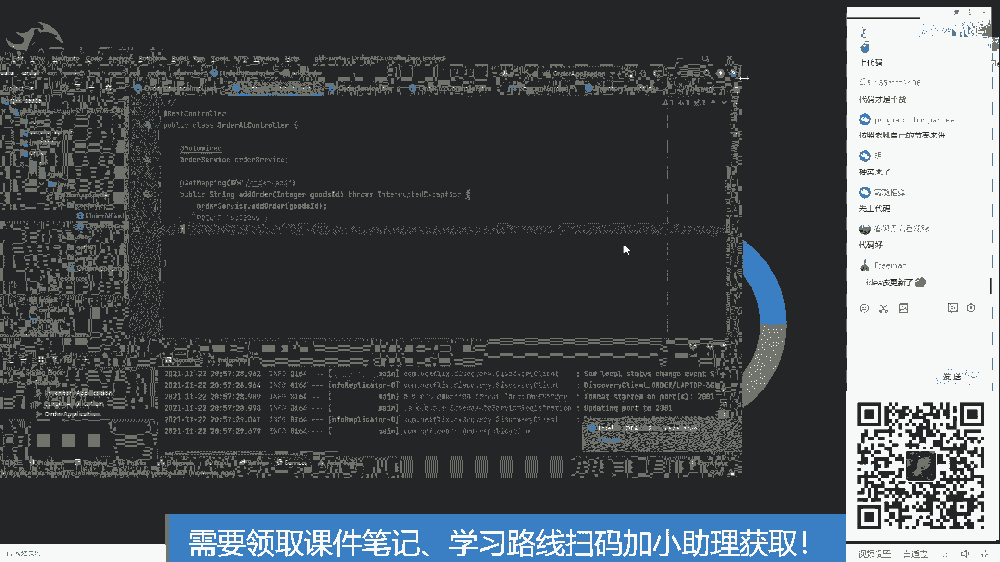

# 系列 6：P111：两阶段提交协议、三阶段提交协议 - 马士兵学堂 - BV1RY4y1Q7DL

或者insert不好理解的话，大家该这么这么来理解啊，insert啊，不是阿巴 data一个字段all呃从一把它变成2，这是一个状态啊。就是说这边比如说库存有两个，就是从二变成一就是少一个库存。

然后这边呢当它做成功之后，把订单里面某一个状态，从一改成2来这块这两个事物能不能这两个事物的操作，我说清楚了吗？这块说没说没说清楚。清楚了是吧？好了，那当遇到数据不一的情况该怎么办呢？是吧？

我们可以写circle。去检查检查一下，比如说这个表里它是不是2，如果它是2。我去看这个表里是不是一，如果是一，说明这俩人啥也没干是吧？就是连连那个教堂都没去，在去之前就反悔了，那无所谓，不管了。

如果说这边改成了一。也就库存变成了一，少了一个，结果这边还是一。现在是不是就不一致了？因为如果它变成一。下面这个应该变成2，这才是数据一致性的，结果到这就不一致了，这是一种情况，这是一种异常的情况。

那么还有一种情况。那就是他。是2。然后呢，他。变成了2。就说这个还是原来的二，就是库存没少。结果这边呢订单把状态变成了2。能理解吧？此时这也是一种不一致的状态。这个能不能理解？要么就是它是一，它是一。

这都是不一致的。它上面库存是一的时候。下面的订单应该变成2，这才是正确的是吧？这是正确的。然后一一也是错误的。好了，如果你知道数据哪种情况是正确的，哪种情况是错误的，那么你是不是就知道哪种情况下出问题？

比如说这两举这两举这两个例子，这两个例子出问题了。它上面是一，也就是从二变成了一，结果下面是一，下面是一，我怎么整，要么把它。调成2。要么把他调成2。能理解吧？也就是说上面是一和上面是一。

下面就必然是2，上面是2，下面必然是一，这才是正确的状态。要么只能把它俩都调了，要么。从这个例子，要么它减去一个一是吧，要么它减去一个一就是一个货的关系，这个能不能理解？就是我们发现异常数据之后。

手动给它改掉。能不能理解能不能理解我说的这种方式？能离的话就敲一。

如果不能理解，把你的问题打出来，手动改是不是很累，当然很累了。

好啦。前面有个同学说手动改很累是吧？当然当然是很累的了。所以在好多大公司里有一些脚本一直在线上跑着批量的去修改你的就是一些监控类型的脚本在线上跑着。当发生数据不一致的时候，它会这些脚本会去自动执行。

能理解吧？这些脚本会去自动执行。理解吧，什么时候去现证数据，这个取决于你的业务。举个例子，当。😡，比如说现在是呃8点52，举个例子，现在是8点52，那么我的脚本肯定要去查吧，是吧？先去查分两步。

第一步去查。第二步去改是吧？那么查的时候是不是查这个数据before是吧，再。

8点50之前的OK8点50之前的数据，我要看它是不是符合一致性。如果不符合，我把它改掉。如果符合拉倒。

能理解吧？可能有的有的人查的，我说的是8点50，这个条件你可以自定义是吧？你可以选成是8点45到8点50，就是用between去查是吧？between45到50，然后这个查过之后。

再between50到55，然后再beten55到60，能理解吧，就是分阶段分阶段的去查一批一批的去扫描。OK这话能理解吗？😊。

万一两个业务服务都是更新操作呢，我刚才所说的不就是都是更新操作吗？

我刚才所举的例子都是更新操作呀。你好好想一下。为什么要执行这些脚本？因为为了防止数据不一致，这是这叫这叫兜底的方案。兜子咋写呢？就是裤兜的兜兜底的方案。OK你也可以把它弄说成是降级的方案。

这个不同的公司定义不一样啊，能理解吧？前面我所说的这个意思能对吧？从手动变成自动。能力他的目的是做啥吧？这是目的啊。我一开始就是要。😡，啊，对，就这个意思啊，麦多的都老师再讲一次。花了马，如果你。

大厂真的都是这样做的吗？当然。好啦。我晕。啥啥意思，你晕了，还是我说的不不不明白。来，这块清楚的同学给老师敲个一。再讲一遍吧，清楚的敲个一，不清楚的敲2，我看看有多少人需要讲，有多少人不需要讲。

因为这是公开课照顾大多数同学。好了。好了，这是一一的一的多一些啊。😊，好啦。😊，怎么二又多了？好尴尬，如果不懂的话，你可以扫描屏幕右下方的二维码，让老师给我拉群给你解答就行。

你你把问题提交给屏幕下方的二维码，到时候我给你解答啊。好吧，可以吧？这样跳二的同学，我也给你提供了你的解决的渠道，你可以扫描右下角的二维码，到时候我会让咨询老师联系我，我给你解答，好吧，这样可以吧？😊。

一对一比这样集中集中解答，更能节省一些其他的时间啊。好了，这个问题就过了啊。😊，讲快点，太慢了。这个刚才还有的同学说可整的快呢，还让冲奖，你说我怎么整，所以。😡，一个一个来啊。确实慢。那你说咋整。

速度正好，有的说快了，有的时慢点，说速度正好行吗。我们看代码啊。我们看下代码吧。是的，每个人理解都不一样啊。坏的同学呢，你先忍一忍是吧？等会我现在起段代码，大家直接看代码就好了。😊，众口难调是吧。

那个这个你你自己调整你自己的时间啊，时间在你在你手里把握着是吧？😡。

等等，我请一下服务。我想一个一个起，把这仨服务，这个是一个库存服务。然后这里面呢一个订单服务。然后。

不影响那个PPT啊，我想把它去掉。我把地我把那个代码起来，你们应该就差不多知道知道怎么啥意思了。

Yeah。好了，先把代码上上来啊，然后我再给你。打开一个数据库。idea该更新了。

这个很重要吗？再说了，你怎么能看出我idea的版本呢？

是吧下面该更新了是吧？2020年1月3号的差不多了。才过了10个月嘛？不就是啊没必要啊。好了。然后我现在给大家看一下我的数据库。然后数据库呢，我这边有两个库，这一个库这是一个库。然后这个库呢是库存。

然后这个里面呢。

商品ID我写个一，然后。呃，库存我写个100吧。OK就是我现在去购买一号商品，一号商品有100个库存。大家记着啊，然后呢，我去新建一个这个订，这是订单库，订单库里什么也没有。OK好了，然后现在我来。

我来做这么一件事儿。好了，大家先先理解一下我所说的这个业务啊，先调库存服务去扣库存。我们执行这个接口，这是订单服务里的这是订单服务里的一个接口。

是吧啊那个old add，然后点进去之后，它去调了一个库存服务的接口。这个这个ID呢我一会儿会传进来，它传的是一，然后呢，我也会把它写到呃，先看这个吧。

固I在这收，然后我传进来的是一个一，然后呢把它调过去，然后他去调用库存服务，然后减一。然后我这里面呢模拟了一个异常是吧？就是说。执行订单新增的时候出错了，但是在库存的时候没有错。来家看一下啊。

库存的时候没错，然后代码在这里。是吧库存直接就看它是吧，把这个库存减进去一个一，然后直接就更新掉了。okK代码很简单。好了，然后我们现在开始直接请求。😊，好了，我先请求一下啊。😊，好了。

报1个500错很正常是吧？这是我故意模拟的500错。然后大家看一眼啊是吧？这是50错是我们故意模拟的。然后我们看一下数据库。数据库呢大家看一下，原来是库存是100。我们看一下它的结果变成了99，对吧？

库存少了一个。是不是？然后订单呢？并没有新增，看到问题了吧。来这块如果能看到问题的同学给老师交一。代码很简单，问题看出来了吧，库存少了一个一，调这边的服务少了一个一，结果这边的服务呢想加一没加上。

是不是就数据不一致了？O所以这就是我们这节课要解决的问题。好了，怎么解决这个问题呢？很简单。😊。

嗯。大家看一眼，马上就解决了。然后等他起来，我把数据恢复一下。

库存给它变成100吧。

。

。好了，我们现在再来请求好吧，还是跟他的请求走走一把。好，还是报50错。然后我们看一下日志。😊，还是报500错，错误跟跟他一模一样。然后现在看库存。我们期万的库存是多少？是不是报错了。

就是两个服务之间处理出错了，是不是库存不应该少100是吧？然后刷新一下，不停的刷新还是100，订单呢也不增加。😡，是不是这就对了。😊，能理解吧，现在能理解吧？所以说现在这个问题我们已经解决掉了它。

改对了。😊，怎么控制的，你先看结果。怎么控制的，我会告诉你的。来，结果能理解吧？就是我现在实现了这么一个功能，把它给把这个问题给解决了。能理解吧？好了，结果能理解的话，我们我们看一下它怎么做的啊。

首先怎么做的，首先得启动一个。😊。

第三方这个第三方叫西塔是吧？大家可以看到我是用我是这么启动的，然后怎么启动的呢？它在这里有一个。

这个组件叫西塔。ok。😊，你直接执行它启动就OK了，是吧？直接进行它启动OK了。😊，然后它里面会有一些配置，然后配置的话呢，你可以去这里看，然后叫registtry count。然后大家可以看一下这个。

然后这个配置里面呢，我我在需要修改的地方都加了修改两个字。你如果拿到这段代码的同学呢，你你看修改的地方就可以了，是吧？我这里面用了配置了一些注册中心，然后呢呃这里面用了fill。

这个type用的fill，这个都不用改，这个是它默认的fill，然后fill呢对应的是file点com是吧？然后我们去看file点com，然后点开。大点com这里面我也写了修改，需要修改的地方。

这个大家现去自己看就可以了，然后往下走，主要是store这块目呃，我用的是DB，然后DB呢对应的对应的数据库的配置是这个样子的。OK是不是是配置数据库的呃连接。

就JDBCULU的 password这些东西，这些简单好了，这就配完了。中间件就配完了，这是我们前面所说的第三方协调者。那么我们呢再来看每个服务需要做些什么。其实如果你都用默认的话，每个服务很简单。

只需要引入一个架包。

引用一个价包就可以了。阿里巴巴的sta架包就OK了，别的不用。知道吧？然后这个服务也是别的，不用，只用阿里巴巴的一个战包，别的不用。然后呢，在order里面，也就是说在服务开始调用的地方。

大家可以看一眼，在服务开始调用的地方，我写一个global transaction省。把它当成一个全局事务，就加一个这么一个注角。原来不是艾 try三嘛，现在写gbal try三就OK了。理解吧？

现在理解要做这几件是吧？然后还有你去网上会找一些文章，会在或者说在某个在服务里还要配置呃配置这些呃result下面写fi andcom和 rejection co。其实这些不用默认情况下不用也是可以的。

你只需要引入一个炸包。这块引入一个炸包，然后加一个注解。就O了。加一个注解。就OK了，别的没啥。怎么用清楚了吧？然后想要这套代码的同学呢，扫描屏幕右下方的二维码，招募的咨询老师去要就OK了。

很简单很简单。

没有吧。然后代码呢，我大概给你过了一遍，然后其他的呃其他的细节呢，你扫描二维码，要代码就可以了。and度log表需要自己创建吗？需要需要自己创建。

大家可以看到我在呃我在每个服务里都创建了一个安度log表，这个都需要自己创建的啊。ok k。好了，这个都需要自己创。因为每个服务的回滚都需要依赖自己的自己库里的andlog。然后这个西塔呢。

它对两阶段做了一个优化，大家知道优化在哪吗？好了，现在我给大家讲一下s塔的优化。

西塔把这个阻塞资源给它优化掉了，就是西塔里面这个两阶段没有这个了，它优化掉了。为什么说西塔是一个高性能的分布式事务解决方案呢？是吧？毕竟阿里的东西它必须得承受高性能的考验。为什么它高性能的nction。

大家思考一下，如果让你去解决性能低，你怎么去解决。西塔怎么解决的？大家思考一下啊，它。性能的平静点在哪？在占用连接是吧？占用数据库的连接，也就是这个这是它的平静点，它怎么解决呢？

它解决的办法就是释放连接是吧？只要把连接释放掉，我就知道我我就提升了我的性能了。先说这个点，先说这个思路，大家能不能理解？思路能理解吗？能理解是吧？好了，既然思路我们能达成一致的话。

那怎么去怎么去释放它呢？我们原来不去释放它是为了保证我们的提交提交和回滚是吧？在一个链接里，就上一个链接，我们做了一些数据，通过同样的连接，我们去提交它去回滚它。那么我们把连接释放掉之后。

没有连接可以依赖了。那我们依赖什么呀？我们就去依赖每个服务里面的undolog表。anddo log表能能明白啥意思吗？大家大家看一下啊，我我我给大家看代码的就知道这个这个东西是啥啥意思了。呃。

我在执行这个表的时候呢，我我我在这打个断点嘛，然后拿debug启动。

等会我拿debug启动，在这打个断点，大家就能看到了。我在这里打一个断点，也就是程序执执行到这之后卡住了，卡住之后。调用库存服务是不是就执行完了？大家思考一下，调用库存服务是不是就已经有返回了？

这块能不能理解，就这个找错误去验证它的这个这个思路能不能理解啊，在这打一个断点，到时候直到执行到这卡住。然后这个服务是不是已经调用完了？能不能理解，给点给点反馈。

是是吧？是是吧？好了，那我现在就来请求了啊，请求那就等断点卡着，请求一下。好了，断点卡在这里呢，大家看我的数据库。😊。

然后我们去库存表好了，这张表。好了，来看数据库里。这是我前几天做验证的这条数据不管，这是19号的不管。我们只来看这这条22号21。0嘛，这是现在的数据库。好了，我把这个东西复制出来，然后把我程序停了。

OK停了吧，别浪费我的精气心能在这耗着。好了，我把成员停了。然后我把这段我把这段给大家复制出来。😊，然后复制。编辑。怎么换行呢？看到换行给我说一声啊。回车。行了，不管了，无所谓了。我们来搜一下啊。

我们说befo大家可以看到一个看beimage。然后我们再搜after。

