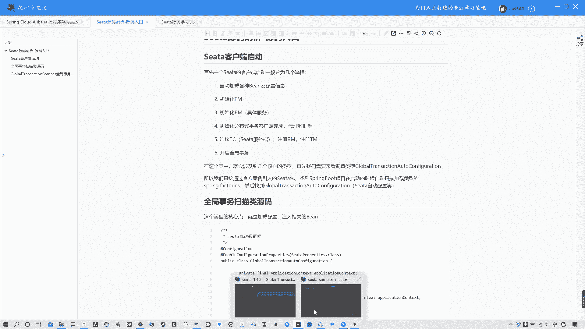
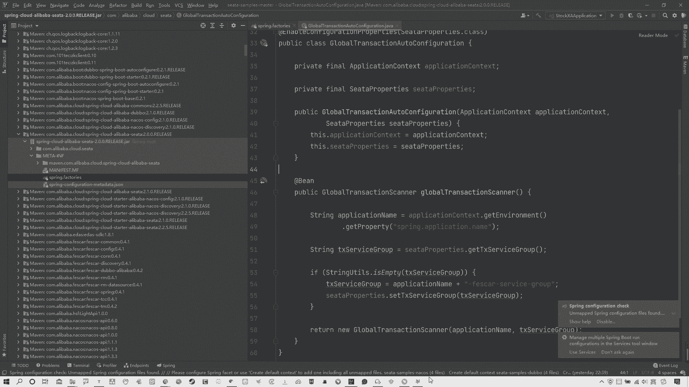
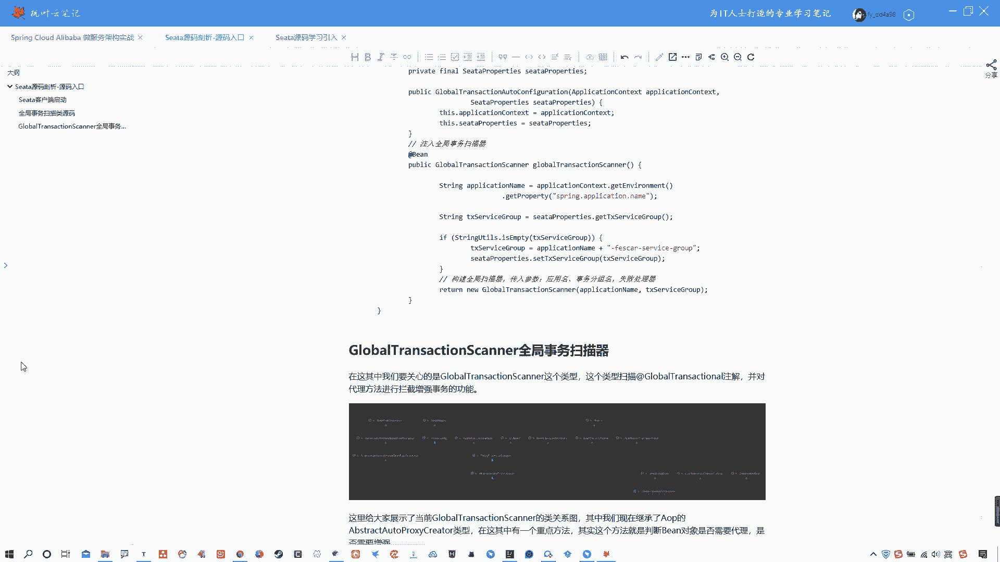
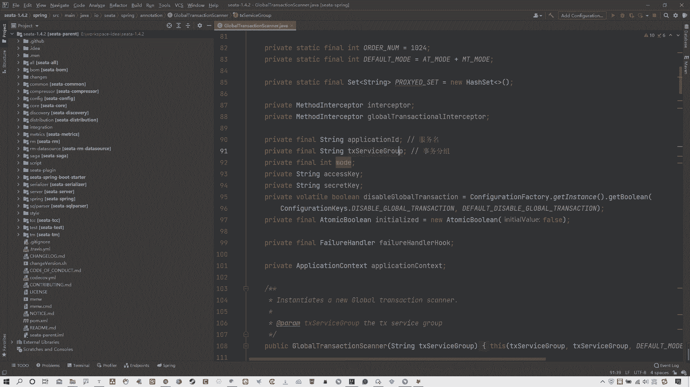
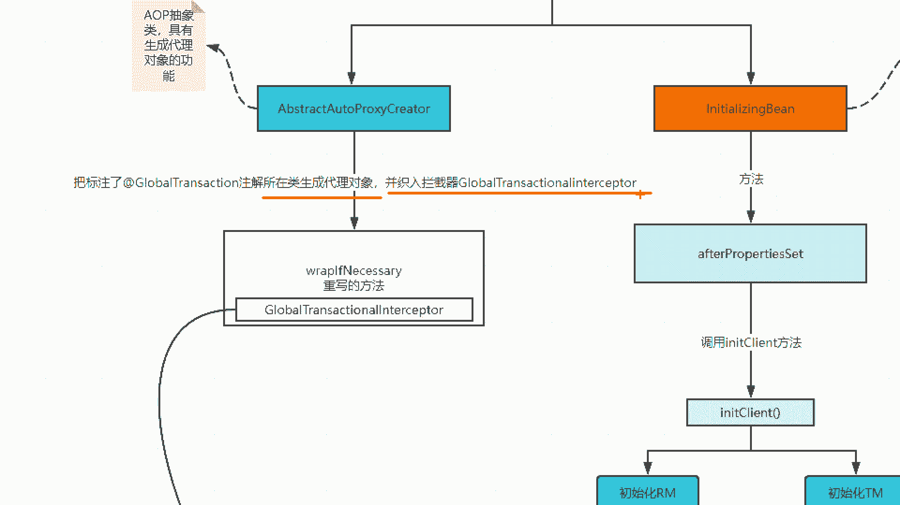
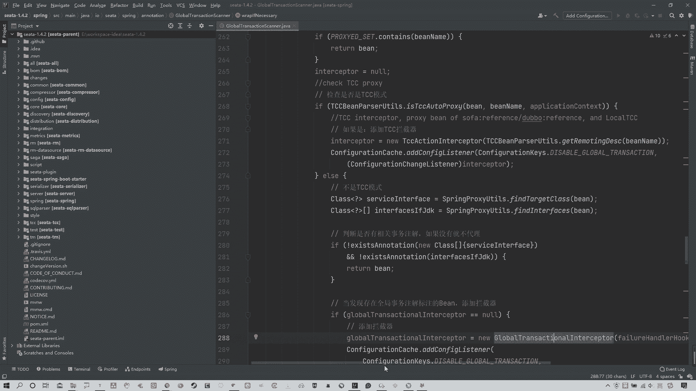
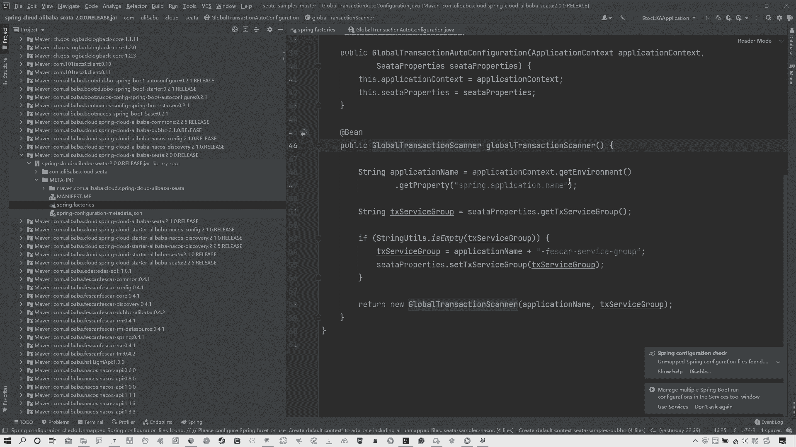
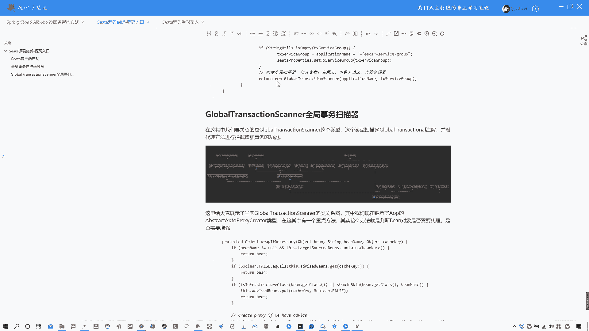

# 系列 6：P116：Seata源码剖析-源码入口 - 马士兵学堂 - BV1RY4y1Q7DL

好，那么这节课开始我们就开始正式的讲解s塔源码啊。那这节课的话，我们先分析一下这个se塔的源码入口啊，包括呃像sta的客户端启动等等一些东西吧。包括我们分析一些呃核心的类型啊。那么我们先说一下。

其实sta的客户端启动它有几个步骤啊，这几个步骤我们还是跟大家说一下的啊。首先这里我说一下，就是一个Cta的客户端启动一般会分为几个流程啊，第一就是自动加载各种bin以及配置信息啊。

这个不用多说spring boot的项目，对吧？因为之前我就说过，呃，你像ns也好，你像sta也好，它本质上就是一个啊spring boot的项目，对吧？然后第二步。初始化TM。啊。

再来初始化RM就是具体的微服务啊，然后初始化分布式事务的客户端完成。那么代理数据源啊这个数据源代理这个事会回头我们再细讲啊，那么还有就是连接TC，也就是sta的客户端啊，连接TC。然后注册RM注册TM。

然后我们之前说过啊，RMTM是可以替换的啊。因为那个我们之前讲那个AT那个例子，像AT那个订单和这个库存那个订单那个就是既是RM也是TM啊，那个服务。第六步就是开启全局事务。然后啊我这要先说一嘴啊。

就是各位我们再去讲这个的时候，你们一定要去把我们之前讲过的那个案例啊带入进来。这样的话我们会更好理解啊。呃，在这其中啊，其实我们会涉及到几个核心的类型，就在这个集中过程中啊。呃，首先我们说过。

它既然是一个spring boot的项目，那么spring boot的项目的话，我们必然要去找谁啊？找的就是它的一个什么。找到的是spring pool项目启动的时候。

自动扫描加载类型的spring factories啊，然后呢我们找到其中的某一个类型啊，就做seta的自动的配置类啊。这样的话我们来看其中的一些啊核心点。那么这样吧，我呢。

我这是官方案例啊，咱们这样吧，为了问大家好理解啊嗯。啊是吧就在这就在这吧啊，我们就直接找官方案例吧，好吧。这是不是那个方案例啊，是那个O在官方案例中啊，我们就找对应它引入的这个s塔包。

然后呢找它对应的这个spring的启动加载类型啊，spring factories。然后在这其中啊，我们来看一下啊，这个不用多解释这个东西已经说过很多遍了啊。

它自动启动的时候会自动去扫描这个类型中的一些类型。那么你们来看啊，我为什么说大家把之前的那个AT的案例带入进来。

因为我们整个的这种啊分布式事物的一个开启是通过那个艾那个注解global transitional那个注解啊来进行开启的。所以其实这个位置是我们的一个入手的点啊，那个注解其实是我们入手的一个点。

所以其实在这其中你就看呗，那很明显只有一个。thelobal transitional auto configuration有这么个类型，这么一个配置类型。所以其实这个位置就是我们要主要关注的第一块。

也就是源码的入口。我们就从这分析好进来。进来以后啊，你会发现这就是一个就是自自动装配类，对吧？啊，其实就是说白了啊，这个这个东西如果说你之前用过chair的配置的话，其实这个跟chm配置是一样的。

也是一个bin啊，包括什么其他的一些这个这个这个类型，对吧？OK好啊，所以这个位置你可以看到有一个艾 bin。那你看到艾 bin的时候，它注了一个什么？

叫做 globalbal transitional scanner，这个实际上是叫做全局事物扫描类。啊，所以其实我们应该从这去入手嘛啊，我们就应该从这儿去入手。为什么从这说呢？

全局事物扫描类从这儿去扫描，你通过at特global transitional注解所标注的对应类型。那么他从事是扫描。啊，OK所以其实我们可以看一下笔记，因为这我没有办法写写注释啊。

我在笔记中给大家写了一下。

这个类型就它啊global transitional auto configuration，那么它就是sta的自动的配置类。在这儿它注入了一个全局的事物扫描器。在这它注了一个全局事物的扫描器。

然后在这其中啊。你可以看到有个return newglobal transitional scanner，它是构建全局扫描器啊，包括传入的参数是对应的应用名称以及事物分组名啊，包括这种失败处理器。

所以在这儿各位啊，我们现在。

就来去看一下他。呃，这个的话我们就不通过这来看了，我们直接上源码吧。好吧，我们现在知道了入手点在global transitional scanner啊，这个全局事物扫描器。那么我们就直接通过源码来找。

原码的话，我在这里啊。已经把源码给大家开起来了。OK好，那么就是它啊就是它global transitional scanner那就这个。OK啊，我们来看一下这里面都干什么了。

那么其实啊先不着急往下看啊，我呢在这个讲源码过程中啊，给大家去做了一张图啊，我们讲到哪儿画到哪儿啊，这样的话方便大家复习，回头这个图会给大家的啊。那么可以看到我们最开始第一件事情。

其实说白了就是呃我没有拿那个我们那个案例去演示啊，至常你们拿我们那个案例也是可以的，他通过去找到我们那个older service订单那块啊，它是TM嘛，对吧？

找到这个sring boot自动装配对应的一个类型，然后找到这个ide注入的这个全局事务扫描器，现在到这儿了。对吧那么在这其中啊，我们往下来分析。在这其中你可以看到它首先继承了一个什么。啊。

obstract auto pro这什么东西啊，这不用多说了吧，这个这是AOP啊。对吧这AOP啊，我们之前nacocentino都见过AOP其实啊这个OAOP其实在我们你会发现，在我们越往后越往深学习。

包括学习源码的时候，你会发现它变得越来越重要了。很多相关的这种代理啊，都是通过AOP的形式来进行增强啊，来进行使用的。它进行动态代理。对吧？OK啊，所以这个位置你可以看到全局事务扫描器第一件事情。

它继承了一个啊AOP的对应的这么一个核心类型。那么还有什么呢？我在这儿啊都在这儿。我把这几个类型给大家列出来了。一个是监听器的一个基准接口啊，监听器因为它有一些呃事物事件的一些东西啊。

那么包括有一个啊bin的初始化过程，就这个in南引。ling bin啊，包括还有一个啊spring容器。这个后续我们慢慢说啊，包括有一个容器销毁，它其实用到了spplayring容器相关的一些内容啊。

这个咱们慢慢说啊。那么呃我还是说一嘴啊，我们去学源码的话，一定要去先看整个的主流程，对吧？先看整个主流程，那么这个位置我们上来有1个AOP其实我们应该从这开始入手去看一下，在这其中它做了什么。

当然这里面源码有很多很多内容啊，这个咱慢慢分析，不着急啊。然后我要就大让大家注意两点啊，一个是这个叫做application ID这个是服务名。

这个属性还有就是一个TX service group只是事务分组啊，这两点各位记一下。好吧，我这给大家标下来了。那么我们可以看一眼图啊，找到了这块以后，我们要分析的实际上是一个啊。

这个你看我这写了一句话，把标注了at特ggbal transitional注解所在类生成代理对象，并植入拦截器啊，global transitional这个inter capture啊。

这个东西什么意思呢？这个咱慢慢说啊，但然这个位置不光有它，还有一个这个。

啊，呃lesser en bin啊这个东西我们就一个个来看吧。其实我们可以先看一下这头啊，简单来看一下。这个指的是谁？指的就是他。啊，那么它里面可以看啊，有这么一个方法。下载一下啊。有这么一个方法。

after方法，对吧？可以看一下这个方法在这儿它去实现了对应这个接口以后，他需要去实现对应方法。所以我们。所以再找一下啊。🤧嗯。在这个方法中，他干了什么呢？我们来注意看啊。

在这儿首先这个监听咱们先不着急看啊，我们主要来看这个位置。他调用一个叫做init client方法。init初始化cle是客户端，这什么意思啊？很明显了，对吧？初始化客户端方法。

所以在这个位置我们就找到了一个初始化客户端方法。然后这个日志这我不看啊，咱们主要看看主要流程。那么它这个位置会对应有个检查，包括检查对应的应用名称以及事物分组名。如果唯空就抛异常啊，这都不用说。

那么你要看这儿一个初始化TM和初始化RM。初始化TM是什么？不用多不用多解释了。对吧初始化TM。O还有一个初始化RMRM clientant点init。啊，包括obplication。

什么ID这是应用的名称，包括事物分组，应用名称、事物分组，还有一些其他的属性。那说白了在这个位置啊，在这个global transitional呃这个这个这个scanner中。

它有一个继承这个接口的目的是为了去初始化你的TM和RM这点其实符合我们在说过那个启动流程中的几个步骤。对吧？OK当然这个位置后续我们会详细分析，现在我们就先暂且啊分析到这个位置。因为这好说。

我就先说了啊，也就说白了他去调用对应的重写这个方法来去初始化的客户端，初始化客户端的RM以及TMOK这一步就完成了。那么现在我们再回到这头。啊，我们来看这儿。这什么意思？往上翻啊，首先我们可以看一眼啊。

它继承的这个AOP的这个核心类型啊，我们可以看一眼，在这其中有个关键的方法，嗯，我来找一下啊，有个关键方法。嗯。关键方法就是我们说的那个。哎，哪去了？来看一下啊。我记得是wep什么这儿啊，找着在这里啊。

vap if if if necessary啊 necessaryces necessary啊vap if if necessary这个方法。

其实这个方法它就是来判断你当前啊所用注解所标注的那个对象是否需要代理啊，就是那个bin我们代理以后那个bin啊，我们标注注解以后那个那个类型的那个并对象，它是否需要被代理，是否需要被增强。

当然这是它的一个负集写法。我们可以看一下啊，我们当前在这个呃全局事务扫描器中它继承了这个类型，所以它重写的这个方法，我们给它找一下啊。找一下再重写这个方法啊。

在这呢OK啊wep一副necessary找的这个方法，我这也标注是代理增强啊，而且spring的所有的 bin都会经过此方法。说白了，其实就是你通过对应的那个注解标注以后。

那么他就会在这儿啊来走它自己的这么一套模式。啊，它去继承负类方法重写之后啊，继承负类重写以后啊，重写方法以后完成它定制化的效果。其实我们可以看一下这方法。🤧它的定制化效果是什么啊？首先加锁。防止并发。

然后你来看这儿啊，检查是否是TCC模式。Check TCC。啊，什么检查是否是TCC模式，是否是TCC的代理对象。说白了这个位置就是它根据了不同模式会走一些不同的这个对应的一些呃拦截器啊。

因为你这个东西本身就是你想啊我们这个AOP里面就是有拦截器的对吧？这是关键点，所以这个位置不用多解释。很明显。TCC模式它走了对应的是TCC的拦截器，所以上来才会先判断你当前啊是否是TCC模式。

如果是的话，它会走对应TCC的拦截器。啊，但正常来说，我们现在说它是AT。所以说如果不是TCC模式的话，它会判断是否有相关事物的注解。啊，如果没有的话就不代理了。那这个的话就不用很很不用多说了。

我们写的那个我们之前代入，我们之前写的那个order订单那个和scket的那个库存那个我们在order那就去添加了对应的这个注解，所以它必然是开启啊这个全局事务的，所以它也是有注解的。

那么它必然会开启相关的这什么代理，对吧？所以我们先来看啊，你看这个位置说了，说当发现存在全局事物注解at变啊，全局全局事物注解的bin则添加拦截器。啥意思啊？也就说白了。

你这个位置它在你oldder订单那个位置发现对应有注解了。好，那么它就添加拦截器。而且在蓝截器这个位置有这么个对象啊，global transitional啊 interrate这个这个对象啊。

所以实际上后续的话我们应该是往这个里面去深入来看一看啊，在这里面去干了什么。当然我们先不着急往下看啊，先不着急去进到这深入啊，先往下来看。他往下还有就是说检查是否是代理对象。

也就是说当前你看AOP u点isAOP啊 products啊。代理对象对吧？如果不是的话，会调用负级的这个代理。如果已经是代理对象的话，他会做一些这种集合的一些添加，这个就不用详细去看了。

我们主要还是要看哪儿呢，看的是添加拦截器这个位置。啊，要知道这个拦截器里面具体干了哪些事情。所以说到这儿的话，其实我们可以看一下我们这个流程。嗯。在这个位置我就说白了。

你看这个对象它的作用是AOP抽象类具有生成代理对象的功能。也就说白了，对你当前所艾特 bin注解所标注的那个类型进行增强啊。

而且它后续是把标注了这个艾特global transitional注解所在类的这个代理对象啊，生成它的代理对象并且植入到这个蓝截器中。那么在拦截器中要做什么事呢？在这儿啊，你们要想一点。

我你看我这写了啊，我这写了一个说拦截器调用这个inwork方法。但是去调这个invo方法之前，怎么去触发的？是你浏览器请求触发全局数。啥意思？我还是把之前的案例给大家开开吧，这样的话好理解啊。

OK就是他啊，稍微等一下啊，很快。好啊，我之前带着大家写过，这个是应该在就是就是它啊8001。我们之前写过1个80018002，然后呢，我们现在是在8001的这个位置上。我后期改了一下。

我是把它放到了这个业务层中啊，我在这儿去开启的全局事务，创建订单的时候。所以说白了我们再对照这张图。他的意思就是指啊通过这个AOP对象，然后呢找到你对应的这个注解所标注的这个所在的类型，就这个类型啊。

然后生成一个代理对象。啊，生成代理对象以后编入对应的拦截器，然后做对应的增强。也就是说他要具体做的一些事情啊，这个增强所谓的增强就是指这个代理对象，我像大家都玩过啊。

这个所谓代理对象就是在原有的这个功能之上去加一些其他的功能，就像我们AOP1样，对吧？啊，去做这种监听啊，环绕监听等等这些东西一样的道理啊。🤧那么怎么去触发这块呢？你看我这写了说浏览器发起请求。

触发全局事务。说白了就是我们浏览器在调用这个当前订单以后去发起创建订单的时候，那么走到业务类型的时候啊，那么就会去触发什么呢？拦截器中其中的inwork方法。这个其实我不用给大家去试了。

这个应该是比较基础的内容了啊，这个蓝截器实必然会触发这个inwork和方法了。所以啊。当我们。有这个请求进来以后啊，有这个请求进来以后啊，哪去了？这个代码有点多了啊。就会走到拦截器中的。

in work方法。在这儿。🤧啊，走到拦截系中的inwork方法来执行对应操作。那么这里的操作是什么呢啊？我们可以看一下。首先，获取执行方法。啊，类型包括这有一个messr的获取执行方法，什么方法？

就是你通过注解所标注的那个方法。啊，我们那个是创建订单，它获取是这个方法。然后在这儿啊，你们要注意看，它会获取几个东西，一个是获取global。transitional全局事务。

还有一个就是global look什么全局锁获取全局锁，这说白了就是原数据。那么这个一点就验证了我们之前给大家讲过那个读隔离且隔离其中所有的那个全局锁。

而且这会写了说这个全局锁是会将本地事务执行纳入到西塔的分布式事务管理中啊，一起来竞争全局锁，保证全局事务在执行的时候，本地业务不可操作全局事务中的记录。张写张读啊，就在这儿体现的。🤧所以说白了。

我们获取到了拳局事务，同时要拿到对应的拳击锁。拿到这儿以后再来往下来看说判断啊，在这有判断说看首先是否获取到了这个全局事务。如果没有获取到的话，另当别论。如果获取到的就执行全局事务啊。

然后再去执行本地事务。先不着急看这个本地事务。其实就我们要往后分析的话，需要分析的是这个全局事务。啊，分析是这个全局实物，我们可以看图。走到一个一mo方法，对吧？它实际上就是解析你的这个注解。

然后对应的执行全局事务。在这儿handler啊global transitional啊，所以后续我们真正的核心是在这儿。而且这里面的核心是在这个判断方法上。但是这块的话啊，我们就先不往下分析了。

因为现在分析的已经有点多了啊。所以回过头来的话，其实我们可以看图总结一下这节课分析的内容就是说白了我们这个源码是从哪入手的？把我们那个案例引入。

从订单那个位置去找到对应它spring boot自动装配的那个spring factories，找到我们对应的这个类型。

global transition auto to啊transal auto configuration，然后找到对应它里面的一个非常核心的类型。

就是全局事物扫描器跟我们那个atglobal transition transitional那个注解有关的啊，找到它。在这个。扫描器这个位置比较核心的两个功能。

一个是去继承AOP相关的核心类去做一些这种拦截器啊，环绕监听等等啊，不是环绕，就是做一些拦截器，做一些监听啊，做一些对当前对象生成代理进行增强啊。那么还有一点就是整个的对你当前的这个病的一个生命周期啊。

生命周期啊，不是生命啊，生命周期。啊，生命周期的管理。那么这一点的话其实呃没有详细分析，只是先给大家说了一下，说白就是初始化RM初始化TM这一点给大家看到了，具体我们后续再分析。那么。

后续主要看的是这儿。在具有了这个AOP代理以后，那么他去重写了负极的这个方法，然后去啊生成对应的这个代理对象，然后构建拦截器。在你去触发这种全局事故的时候，也就是controller发起请求。啊。

之后走的是in work方法，拦截器的in work方法，解析你的全局事务注解，然后对应执行全局事务。当然，对应执行全局事务具体干什么了，我们还没有分析。这个话我们下节课来分析。啊。

所以这里块的话我们就暂时先分析到这里，说白了就是给大家去原码开了个头。让你们知道怎么去找源码的这个入口，然后呢啊我们会后续慢慢根据整个的这个流程啊，刚才我提到这个流程来一点分析。其实这里课的话。

我们也可以看到自动加载并啊这些信息，包括初始化IMTM。

啊，代理数据源这个我没说，这回头再说啊，连接TC也没说啊，注册RM和注册TC啊，注册TM这个也没说，然后呃开启选举事务。这个事儿我们看见入口了，但是我们后续会详细分析。好吧啊。

OK那么这节课的话我们就先分析到这儿啊，回头的话你们可以去把这个图啊，我回头把链接给你们，把这个图好好看看，跟这个图走一遍流程啊，就能熟悉了。然后说一下啊。

其实我们当前的这个位置有一个global transitional scanner，这个类型是非常重要的啊，所有的基本都在这呢，而且可以给大家看一下它的一个类关系啊。

多说一嘴吧。啊，就是他啊。这是它的相关类图啊这是它相关类图。首先它继承了哪有哪些接口啊，继承哪些类型啊，这个类型怎么回事啊？这个的话大家可以自己看一下。好吧啊，OK。😊。

那么原码分析上来可能大家会觉得有点空啊，说老师这玩意分析的没什么意义的感觉。这个别着急啊，刚开个头，慢慢的我们现在只是把一些分支给大家列出来了，对吧？两大分支，一个是这个。

AOP这头的一个是这个整个的一个初始化这头的。那么后续我们会针对这两条路线再去展开分析。后续我们就会越来越清晰。好了，各位啊，那么这节课就先到这里了。

