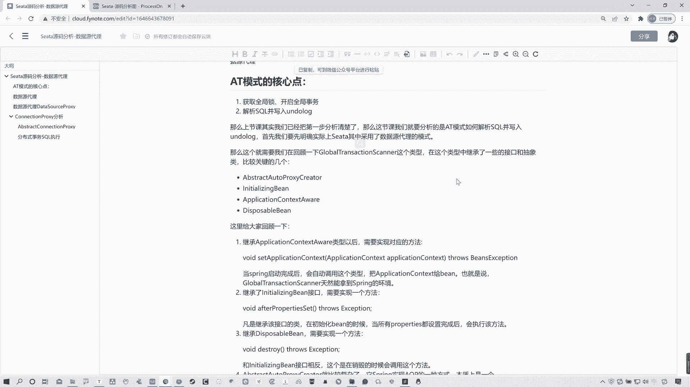
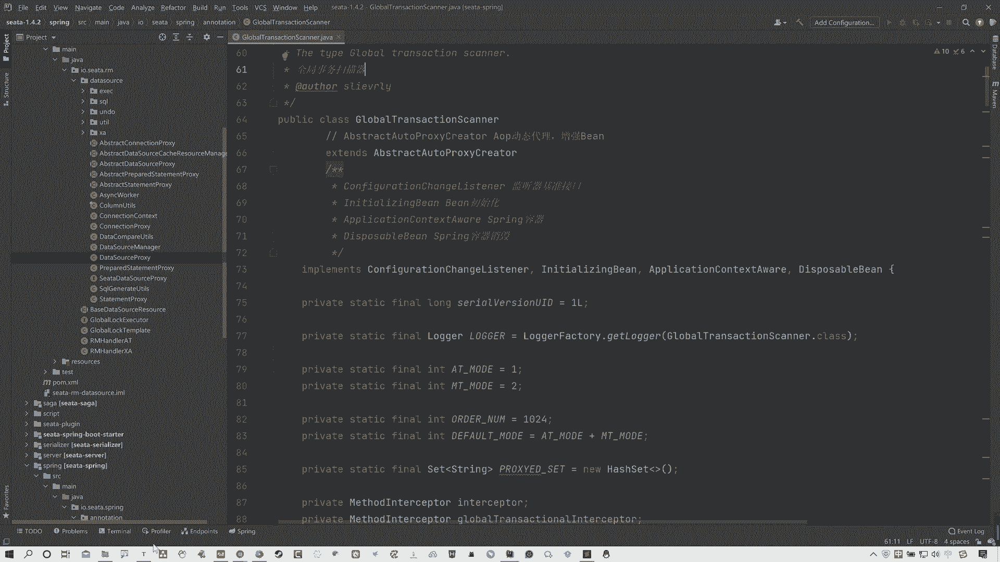
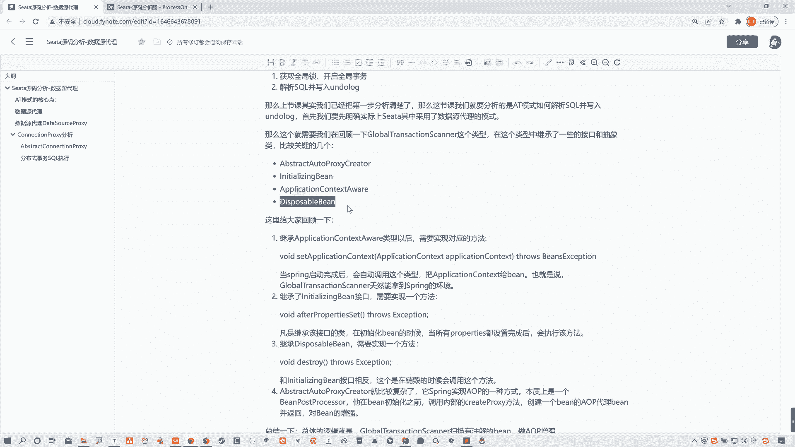
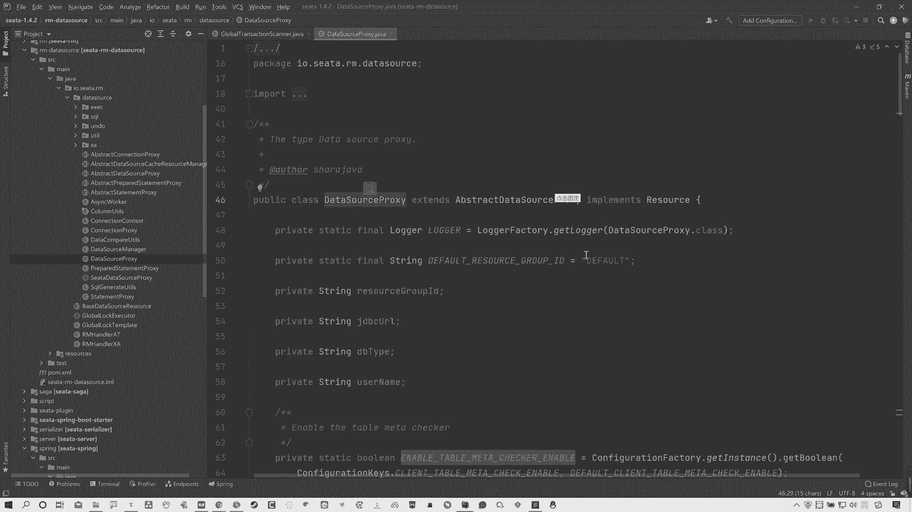
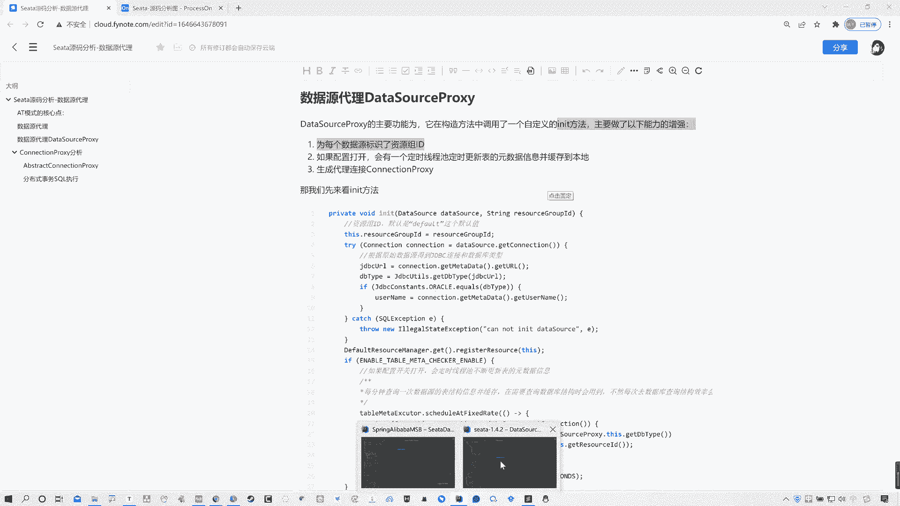
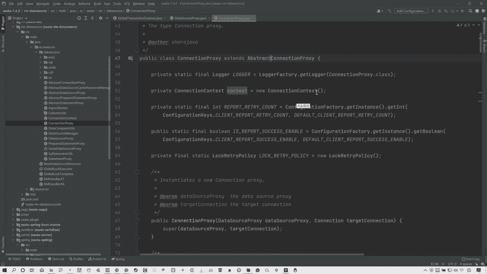
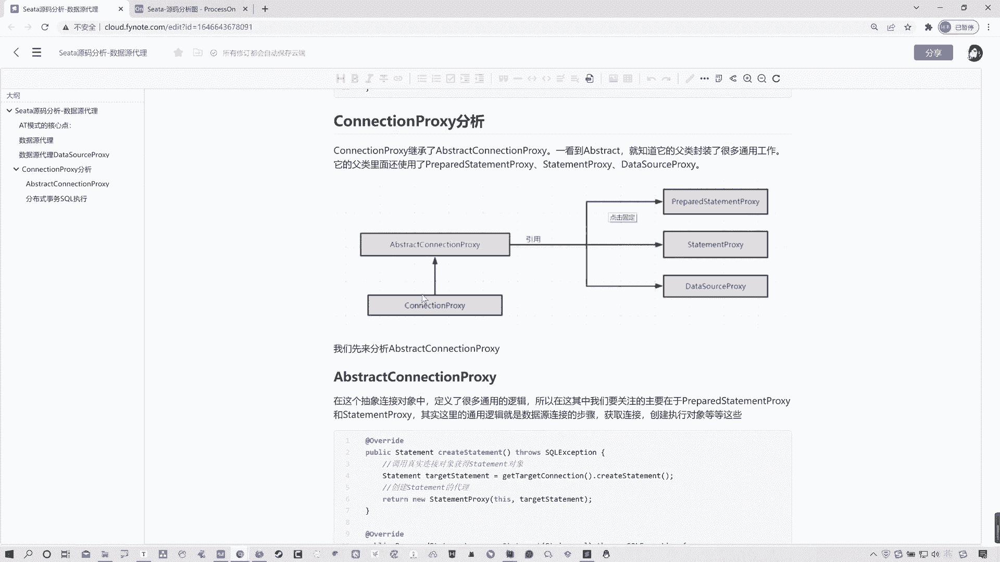
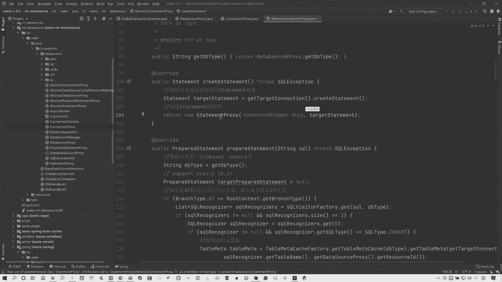
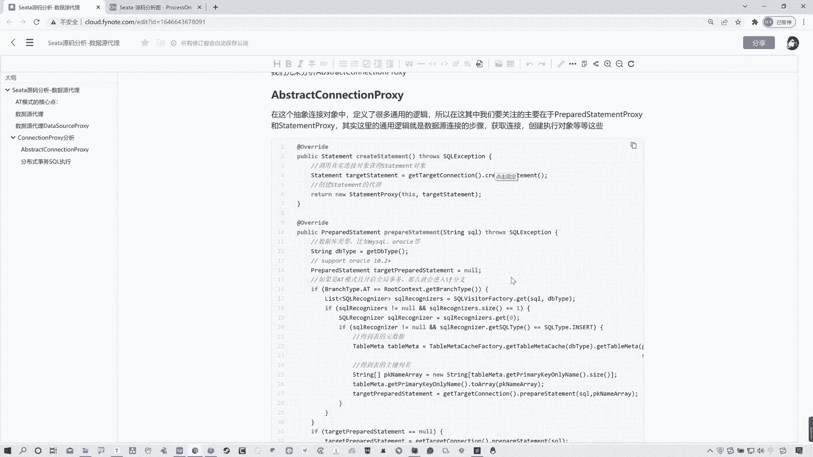
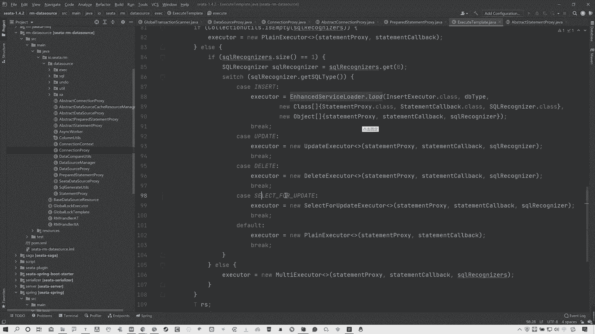

# 马士兵教育MCA架构师课程 - P118：Seata源码分析-数据源代理 - 马士兵学堂 - BV1RY4y1Q7DL

O同志们啊，那咱们这节课来继续讲解西塔源码啊。那我们这节课要分析的实际上就是西塔源码的数据源代理相关内容啊。上节课的话，我们分析到了说这个staAT模式整个的2PC或者叫两阶段的这么个执行流程。

这节课的话我们要分析的就是AT模式中的另外一个关键点叫做授据权代理啊。首先咱们来回顾一下说AT模式的核心点在哪儿。AT模式有两个点，一个是说获取全局锁开启全局事务。另外一个点就是解析circle。

并且写入andlog啊，这个用于回滚的这么一个日志快照，对吧？OK。那么上节课分析的很清楚，整个2PC的阶段我们分析明白了。

它实际上就是通过这个global transitional scanner这个类型去继承一些啊抽象类，包括接口啊，实现一些接口来对应的一些方法来解决的问题。所以我们可以简单先回顾一下啊。

给大家找一下这个啊。先来看一下啊，我们都知道这个global transitional scanner，那它是一个啥？它是一个叫做全局事务扫描器啊，所有的事物都从这咋开始的。

它其实简单来说就是去扫描你对应并组件上面那个global transitional那个注件啊。然后呢你可以看这儿啊，它有几个比较关键的点啊，在这我给大家写了，包括笔记中给大家写了啊，看一下笔记本来。

有这么几个关键的啊，就是一个是继承了这么一个obstract auto to proxy creator这么一个出现类啊，这是AOP的对吧？

包括initializing病application contest of award和这个is呃。Ddispointable这个 bin啊，那么这么几个东西，实际上简单来理解吧啊。

这个位置其实特别简单啊，这个咱们先不说，先看这个application contest award这啥呀？

这实际上就是spring嘛。所以你通过这一点，你可以很清楚的知道，就是当spring启动完成以后啊，就是会自动去调用注应这个类型，对吧？那么会把这个obplication contest去交给这个病。

也就是说，当前global transitional scanner，它是天然就能拿到一个spring环境的。然后对应的这个initializing bin和这个d就就就这两个啊，其实也非常简单。

它其实就是一个销毁啊，一个是开启，一个是销毁。这是之前after。purse呃这个这个p啊s这个什么意思？它说白了就是去凡是继承或者叫实现这个接口的类型。在初始化并的时候。

那么当所有的pur都设置完成以后，它就会执行该方法。OK那么还有就是对应的有一个销毁方法，整个生命周期完成以后会有一个销毁方，销毁方法叫做destroy。那这个方法就是由当前的这个。

当前这个这叫叫dispointable bin这个类型来提供了。那这是什么呀？这不就是对应着你这spring的一个生命周期的一个感觉嘛，对吧？所以啊就是凡是去继承啊，凡是实现这个接口。

并且重写对应方法的。那么它就是说白了这个接口跟这个接口是个相反的关系啊，在销毁的时候会调用这个，这是在初始化时候会调用它，销毁的时候会调用它。所以这个比较好理解。这里可能唯一比较复杂的就是这个类型。啊。

obstract auto pro。那当然这个上节课我们也讲过了，那这个就是对应的一些整个的AOP的代理啊，做AOP增强的。啊，作AOP增强的。那么其实总结来说吧。

就这个global transitional啊scanner它就是去扫描你当前啊这个 bin类型上面是否有那个global transitional那个注解。如果有。

那么它就会做进行代理增强来做一系列的操作，完成整个RPC操作啊。整体流程的话在这儿。我上节课也给大家分析过了啊，在这儿。啊，就是我们这东西。从开始从哪去扫描的啊，自动装配扫描到以后，然后干了什么啊。

对吧？整个的从这儿开始说有业务发起请求以后啊，触发全局事务以后干了什么，全局事务的执行流程等等等等等等啊，这全部都分析过了，对吧？OK这块就不详细说了啊，那么其实我们这节课要分析的是数据源代理。

所以其实我们还需要去回到这个自动装配的这个位置。那么我还是去拿我之前这个案例来给大家举例子啊，把它关一关。我们正常来说的话，去找这个开头啊，分析源码开头的话哎。他会我们会从这找。去他找了找他引入的包。

然后呢对应找他一个自动装备类型，s boot的对吧？那在这可以看到有个叫做sit auto configuration。

那么我们之前所看到的对应的那个叫做global transactional scanner是在这儿的。对吧，那么这节课我们要看的是什么呢？

看的是这个叫做seta data source bin post proxy啊，在这儿他对授据员进行了一些代理啊，拿到授据员对象以后来做代理来做一系列的操作。所以关键点在这儿，我们要从这儿去看起。啊。

所以说白了你要知道，就是关于授据源代理这里啊，我们是在全局事务拦截成功之后，那么它最终是一定要执行它的业务方法的。而且我们sta是对数据源做代理了，所以sqcle的解析也好。

包括andellog入库这些操作全部是由授据源代理来完成的啊。那么这些授据权代理是在哪儿，又给大家找啊，咱们先去找这个对应类型。你可以先看一下，咱们进来啊，进来以后你可以发现啊，在这里面。啊。

有这么一个方法啊，包括在这儿有这么一些方法，你可以看看，先看先看这儿来先看这儿来。😊，先看这个类型啊，它首先继承了一个接啊，不是它叫继承啊，实现了一个接口叫做be post policycy。

这个接口相对相呃感觉大家或者说对于你们来说应该是很熟悉了。这是什么呀？从这图中啊，我在在这儿啊也给大家去列出来了，它是spring的拓展接口。相信大家对spring没有问题的话，这个都能知道啊。

那么所有的B对象再去进到这里以后都会去执行这两个方法。哪两个方法，一个是post啊after方法和一个before方法。那么这两个方法都是由这个接口所提供的。啊在这儿。我这。

对吧这两个方法很浅显很显而易知，就是在初始化的时候啊，首先会执行什么。啊，这个be啊在什么之前，然后执行after在什么之后，对吧？所以说我们从这开始分析，在它执行什么什么。

在在他这个初始化的时候之前啊，所做这个事儿，看after看be啊，befo这里面其实并没有做什么操作。啊，整个都在这儿啊。你看比这我没标什么，对吧？befo这里并没有做什么操作。

它只是说对当前的并组件啊类型做对比，看一下是不是这个代理对象，授权员代理对象，对吧？所以这儿其实并没有什么可看头的关键点在于哪在这儿。After房款。你在after方法中，你可以看这有个判断啊。

说bin当前并类 bin bin这个对象啊，我们所有的这个bin类象， bin对象进来以后都会走这两个方法。那么走到这儿的时候会判断说当前你这个 bin是不是data source也就是不是数据源。

如果是O好，看第二头，这不是一个与或飞的那个语吗？对吧？好，第二头这头是什么？这头就是说这个啊 bin判断是不是代理对象类型取法了。那说白了这里的判断是不是就指你当前的对象是不是一个数据源。

这是啥玩意儿啊啊，不用管它啊，是不是数据源，对吧？如果是数据源的话啊，如果是数据源的话，它是不是这个这个这个data source这个procy代理对象类型啊，如果不是好。

那么这个位置它调用了一个方法returnprocy data source什么bin把 bin传进去，这个方法做了什么？Did source policy。 Did source policy。

去调对应的方法，把你的这个data source传入。说白了，它最后返回的对象类型不就是一个数据源代理对象吗？那也就是拿到你的并这个这个数据源的并 bin类型啊，对它进行一个代理。

所以其实这里我们要分析的关键点就在于data source proy啊要分析它。O这些整个的流程我在这给在这儿啊给大家标注了。你可以看到说有拓展接口实现两个方法。在这个after方法这个位置。

当data source进入到这里以后，就会被直接代理成data source proxy。OK所以其实在这儿我们就要去分析这个东西了。那么分析谁呀？

分析的就是这个叫做data source proxy代理对象。啊，O那么这儿我们找到入口了。那么咱们现在就看源码。OK我再这给大家找一下啊。😊，data source Per，然后来盯了一下。

首先啊大家来先来看这儿啊。看这头。这个data source privacycy啊，它存在于这个包中，你会发现啊，嗯哎不对，我看一下啊，不不不对不对不对，点错了啊，找他找他啊，我点错了，sorry。

找的是。我这边找错了啊，sorry，再找一下啊，我说不对劲儿。不是这handler啊不是这handler，直接找这个啊dta source pro。可以。Data source Pro啊， O。

然后我们再定论一下，我们来看这里啊。你会发现这里不光是有这个数据源代理对象。还有什么connection property，还有什么？Statement policy。

Ppared statement policy。首先我们都知道data source是干啥，授权员connection是干什么？连接对吧？连接对象。

然后statement包括prepared statementment，他们都是circle语句的执行对象。那也就是说白了这些关于数据源代理连接对象执行 circle扣语句的这些组件。

他们全部都被sta进行了代理。那么，为什么要被sta进行代理，代理后的目的就是为了去执行你sta的对应的一些逻辑，就是AT模式里面这些逻辑生成andlog呀。

全局事务开启呀等等这些东西执行搜扣语句解析搜扣语句等等。这些全部在这里面去执行的。所以这个位置授权代理我们应该去从哪分析呢？就是从这个dta source privacycy开始，你是从这开始的。

而且笔记中啊我给大家去记录了一些内容。

🎼哎，不是他啊呃，这儿。啊，这点我都标出来了啊，然后你看啊数据源代理是个非常重要的环节。我们知道在分布式事务运行过程中。

安度log等记录、资源锁定等都是用户无感知的那这些操作实际上都在数据源代理中完成了。这刚才说过O所以数据源代理对象它这个位置dta它主要分成了三个功能。而且其中我非常关键的方法叫做in方法。

数始化方法啊，一会儿给大家去看咱们先看这三个功能是什么？它实际上是为为第一点为每个数据源标识着资源组ID就是数据源不同的数据源有不同的ID啊，都不不同的资源组ID啊，那么同时有一个配置。

如果这个配置打开的话，会对整个的定时现程池进行更新原数据，并且把信息缓存到本地。这个实际上就是去说白了你当前呃。比如说我们之前所做的个业务就订单和那个库存那个啊。

那么他需要去拿到你对应的一些呃表里面的数据嘛，对吧？库存表的数据，包括你订单表的数据，那么它在时时刻刻的应该没记错是一分钟一个一更新一分钟一更新，却拿到你准确的这个数据信息，缓存到本地。

为什么要缓存过来呢？是因为缓存的操作要快，对吧？OK啊，然后最后一点就是生成代理连接对象，就是connection propertycy。所以这个位置我们就先来去分析它的初始化方法，阴力的方法。O啊。

那这儿就不看了，我们直接看代码。

以内的方法实际上是在它构造方法这个位置，调用完构造方法以后，那么它这个位置会传入。你看啊。资源组ID完了是对应的一个data source，对吧？OK然后在这儿调动引匿方法。O所以咱们来看这个引匿方法。

它的前两点它的前两点其实比较好理解啊，就是一个是资源组ID当前这个ID覆盖ID只是这比较比较简单啊。然后呃通过原始的这种数据源得到GDBC连接和数据库类型。

你看GDBCUL对的DDB type数据源数据源类型，对吧？这都不用说，然后主要是我们看这个类型。啊，如果配置打开，会在定时啊会定时。呃。啊，你该少写个字啊，会在。

会定时在数这个线程池不断的更新表的原数据信息啊缓存到本地。什么意思啊？这个位置其实这么去看不太好理解，但咱们先理解大面啊，我先跟大家说意思。这个意思其实就是说白了你在业务开启的时候。

你在有业务发生的时候，有这种数据这种分布式事务出现以后，它会把对应相关的表的数据缓存到本地。为什么要缓存到本地呢？其原因就是在于缓存到本地以后，它的速度快，因为它在缓存中，它可以去节省一些查。

因为你数据库查询这个时间是比较长的。如果你每一次都查询的话，会浪费时间。啊，会时间变长，所以它每次都缓存到本地，你从本地缓存拿数据去比你查肯定要快，对吧？所以就这个意思啊。

其实所以所以所以说白了这个阴利的方法中只做了这三点增强啊，只做了这三点增强。所以这就比较好理解了。OK那么这里说完之后啊，我们再往下看。他第一件事情是有引it。那么刚才说过的。

还有一点就是说去创建一个连接代理对象。那么这个所谓的连接代理对象在哪儿啊？你们可以注意看一下一个东西，就是它继承了一个。Obstract， data source property。数据源连接对象啊。

数据员这个呃抽象的这么一个数据源代理对象，对吧？在这其中啊有很多很多方法啊，这个咱们先不关注啊，其中我们要关注的点在哪儿啊？有一个方法。嗯。给大家找找啊。哪儿去了？啊，这儿。概率可能是。

这什么连接获取数据源连接，对吧？获取数据连接，那包括这有很多啊，你看这也是一个，这是一个无参数，一个是有参数，应该。啊，对，是你看。gege connection get connection。

这是那个有那个用户名和密码的那个啊。所以说白了这个位置，它的第二件事情就是对整个的这个连接对象做了一个代理。因为你可以看到它最后return new connection proxy。

这也是一个连接对象的授据权代理，对吧？证明哪儿，它用哪儿啊？用的是这个。啊，所以说过了C塔最开始我说过了，它整个就是全部都是用的这个授权代理。那么你的授权对象被代理以后。

那么建立的连接也是通过啊连接对象来完这个这个代理对象来完成的OK所以到这儿我们再来看。这两点我分析明白了，对吧？一个是说这个整个的数据源加ID，然后去打开配置定时更新，然后生成连接对象。

通过的是get connection这个方法来返回的get connection啊，connection pro方法。啊，pocy不是方法是一个代理啊这个。这个连接代理。OK所以现在这儿没什么可分析了。

我们主要看这个连接对连接代替对象又干什么了？走往下走啊。这就是那个connection啊，pro proxy继承了一个obstractconnection pro，又是个出生类。

啊，实际上在这个里面啊，我先跟大家说一下，看笔记。啊，在这我还提一嘴啊，就是在这个增增强里面啊，这三个其实就这前两个比较容易。第三个是最重要的AT模式里面会自动记录andlog和资源锁定等等。

其实都是通过这个connection policycy完成的。所以其实我们主要去分析的话，就是这个connection policycy分析啊那么你们可以看一下啊，connection policy。

它继承了一个叫做obstract connection policycy。那么一般看到obstract，我们都知道它的工作是啊副类封装了很多通用的工作。

而且它的副类里面还使用了prepared statement policycy和state policy，包括还有dta source policycy啊，这一点的话我们这有一个类图，大家可以看一眼啊。

放大一下。obtract开始。首先它啊这个实现这个里面，然后包括引用了对应的三个类型。啊，那么现在我们主要分析的话，就不能去分析当前它了，看的应该是这个负类，因为这里封装了一些痛方法。

所以我们先来搂一眼它。

啊，来看。那么这里大家可以看一下啊，我为什么说啊有这几个东西呢？你看data source是不是用了，对吧？然后还有啊往下来看，说白了这个步骤，你们可以简单这么理解啊。

就是我们再去用普通的这种数据源的时候去操作srcle语句的时候啊，我们都知道有数据源连接对象啊，数据源代理数据源对象，然后有连接对象，有具体执行circle语句的对象。

就是statement  preparedpared statement，对吧？所以这里我们可以看到数据源有了，连接对象也有了，对吧？

然后现在我们要看的是它连接对象所定义的一些针对数据库circle语句操作的对应类型，可以看到这有一个statementcreate statement创建这个执行circle语句的这么一个对象。

包括有防sql注入的一个prepared statement，这里都有。啊，那你们可以看到这两个方法中。比较关键的点在于哪儿呢？statement和prepared statement，不管他俩是谁。

用的是哪一个，他最终都会去返回一个prepared statement privacycy和statement policycy，都是数据源代理啊，不是都是这个执行对象代理啊。

执行sqcle有据对象代理。他并不是用了原生的原生的statement和prepared statement。所以这个位置我们要往下分析的话，分析应该是这儿。

对吧你看我在这给大家标水了。啊。呃，所以这里我们就要关注的是prepared statement proxy和这个statement proxy。其实这里通用逻辑啊，就是数据源连接步骤，获取连接。

然后执行对象等等，这些明白了吧？啊，就是这样，这就是步骤是一样的，只不过每一个步骤seta它都做了代理。啊，然后啊我们可以分析一下这两个方法，先看一下这两个方法啊。在这两个方法中。

首先state没什么好说的，它就是获取连接对象，然后最后返回的是一个代理对象。然后呢，这个里面可以看一下啊，它实际上就是上来先获取数据库类型。比如说你是mycicle或者是orracle，然后呢。😊。

有一个模式的判断。如果当前你是AT模式啊，那么就开启全局事务，当然默认走就是AT模式啊，然后会进入到if分支。那if分支这里其实就不用多说了，就是得到原数据，然后获取表的一些主件名。

然后通过它对应的一个这个prepared statement这个方法，传srcle语句和对应的一些参数就完了啊，这都是技术操作了，不多说啊。然后最终关键点在行这在这啊。

它会去创建prepared statement pro代理啊，所以可以现在发现，不管是这个prepared statement还是state，它都是通过代理对象来执行。那我们就来看一下这个代理对象。

它里面的一些具体执行方法。啊，在这其中，其实你会发现有三个比较关键的方法，就这就这仨。看到了吗？result set公共部体啊，这有一个呃exator query。

ex呃exex啊ex啊exe updatedate，还有一个exec方法。这个三个方法实际上就是具体执行circle语句的三个方法。你可以可以看到啊，这里拿就是。

srcle语句拿完ciqcle语句以后呢，它通过这个叫做execetlate点ex方法，都是这个方法看到吗？都是这个类型对应这个方法。而这个exece templatelate它是啥？

它实际上你可以理解为是一个这种不同类型的一个处理器。啊，它来执行不同的这种scle语句啊，通过不同的代理。那么这个咱们一会儿分析啊，先不说它。主要是你来看一下这个。

这当前是statement prepared这个代理对象关键点在于这方法。那么其实你可以看到，不光是它啊这两个执行逻辑差不多。你看这个prepared statement policy。

它的非常关键的方法也是这三个，看到了吗？嗯。excuse啊excuse query和exece update也是这三个方法。同时你会发现这里他们所使用的都是这个excuse template。

通过他来完成的来调用的对应的excuse方法来完成一些操作的。所以这个位置各位啊现在应该知道关键点在于哪儿了，对吧？OK所以啊各位回到笔记中。这里我都给大家分析清楚了。

这个数学连接对象啊有对应的一个obstract。那么实际上它实现的接口啊，我可以告我可以告诉大家啊，它所实现的。呃。这个啊。它所实现的接口就是connection连系对象，对吧？

所以它这里面实际上就是设计了一些通用方法。只不过说你在最后执行circle语句的时候，你是选择这个statement还是prepared statementment并且都是代理对象执行啊。

然后啊然后往下重写对应方法返回代理对象，然后执行ciircle语句通过了就是这三个方法来执行。说过了。然后实际上是不同的circle语句类型来执行啊，不同的circle语句类型的执行模板，就是谁。

就这门儿。为什么说它呢？你可以看这底下啊。插入的修改的删除的这是我直接说过的开启全开启全局锁那块啊，select of update，对吧？O那这些我们一会儿来分析。

现在我们分析到就是找到了这个数据源代理对象，整个的入口和找到了一些关键的代理对象。那么还有一些什么生andlog这些东西怎么这些东西怎么来呢？这些东西我们留到下节个分析，我们先把这个整体的大流程。

先分析出来。好吧，各位okK啊，那么这节课我们就先到这里。

