# 马士兵教育MCA架构师课程 - P119：Seata源码分析-数据源代理-undoLog生成 - 马士兵学堂 - BV1RY4y1Q7DL

好了，同学们啊，我们这节课来接着去分析这个sta的数据源代理相关内容啊。那这节课的话我们就要去找一找它当前对应的，比如说你数据源代理它怎么去生成的这些andlog相关内容啊，OK那么先来看一下吧啊。

那么在这儿啊，我们上节课去分析到了一个类型叫做obstract connection pro啊，这个副类的这么一个抽象负类的一个代理。在这其中啊，它有对应的创建了create statement。

包括prepared statement。那么它最终这两个创建的类型都是一个代理类型。你看这。啊，是prepared statementment prox，包括这个statement proy。对吧？

OK我们可以看上节课这个图啊。在这儿，首先obstract重写这两个方法。重写的实际上是这个接口所对应的这两个方法，然后返回的是一个代理对象。那么在这两个代理对象中就对应执行ciircle语句的方法啊。

这也是人生方法。我们可以看一眼啊来。

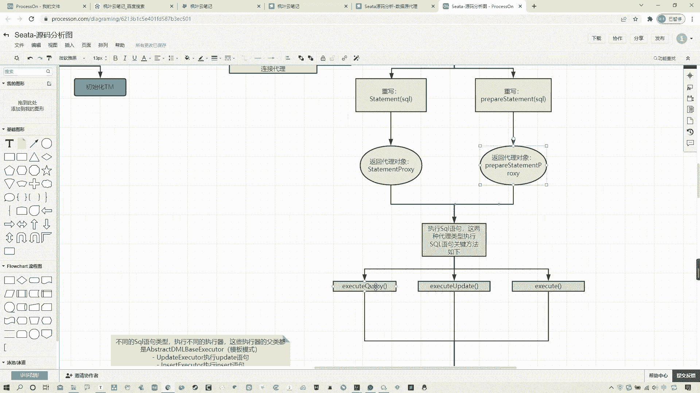

就是咱们就拿statement prepared啊，这个pro啊，说错了。来举例子，你看这其中啊。😊，是不有对应的，你看。Qury， update， execute。

对吧那其实这就是我们主要要去看的对应方法。对吧它的对应所有的执行其实都是这样的。你不光是state proy啊，你包括prepared statement proy，它的执行方法也是这三个。

这是最关键的。对吧。ok好，那么不管是prepared还是这个statement啊，我们比如说就拿state来举例子。

你看这里面它这儿啊最终所执行的是一个叫做exece templatelate点上exece方法。啊，是通过这个time美的模板去调的这个execcuse的方法。所以这是核心关键。我们就需要去看一下这个。

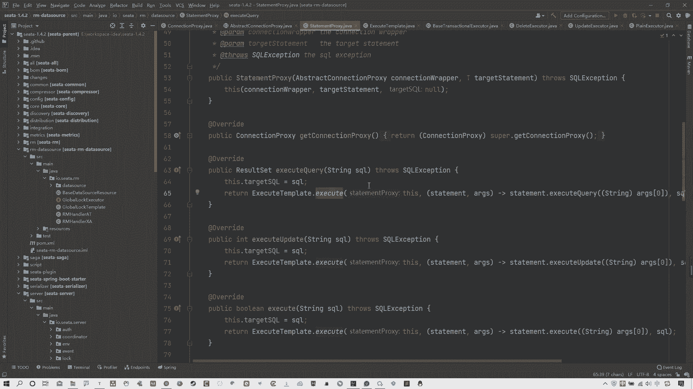

exclude的方法，他具体做什么了？可以先看图。啊。在这儿我给大家去标出来了，其实这个叫做excutor template这个模板，它是根据你不同的circle语句的类型来生成不同的执行模板有哪些呢？

在这儿你像有update，有insert，有delete，包括还有这个slate for update，就是加锁的对吧？包括有个叫做ploing呃呃excutor啊，它是执行普通的查询cicle语句。

这是原生的啊，包括还有一个复合的。那这里实际上我们比较关注就是这三个update insert和deelete。所以这儿啊各位你们要记住，还有一点就是实际上这个位置它应用了一个模式叫做模板模式。

就是这是它具体生成的执行器，根据不同sical语句类型。那么这些。不同的这种执行的一个呃类型来说的话，它们有个共同的flay，就这个abstract电脉而baseex，这是这个模板模式啊。

这上节课没提过的，从这开始是新东西，对吧？O所以现在我们就可以看一眼啊，首先我们先进到这个exex方法中，那return execute走O。

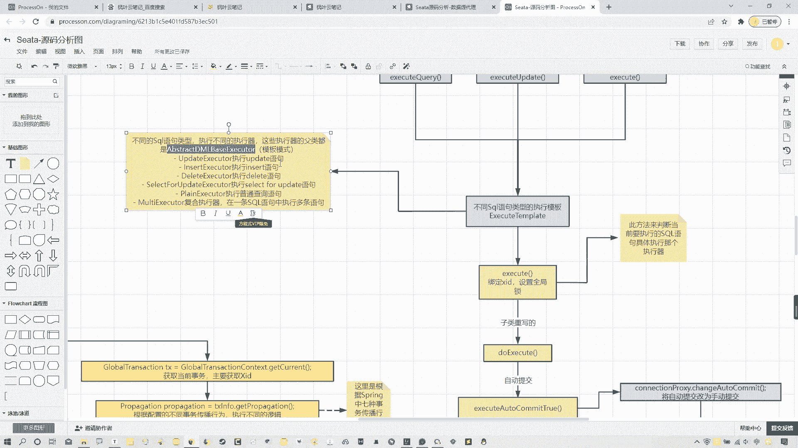

首先核心方法就在这儿。那么这个方法上来，首先会判断说当前有没有全居锁，而且是不是AT模式，这个不用多解释啊。再往下来说，得到数据库类型，当前一定是myciql类型。然后注意看这个。啊。

这个circle这个类型啊，我跟大家说一下，你可以把它姑且理解为circle的语句解析器。那么它可以执行这个这个获得执行circle。

通过它呀还可以去获得对应的一些circle语句的表明相关的列名以及类型等信息，最后解析出对应的circle表达式。相信大家都知道，我们在讲这个AT模式的时候说过它对应的这个。什么呢？

它对应的这种呃circle语句，在这个二阶段提交中，它是需要解析的。那么怎么解析的？就在这儿解析的。啊，然后往下可以具体来看在这儿啊，比较关键的在哪儿。如果说这个位置啊。

你看它没有找到对应合适的sQ语句解析器，那么它就会执行这个对应这个解析器。那这个解析器实际上就是直接通过原声对象来执行。所以这个不用我们多看，主要是看Ios里面来看这。😊，啊。

它有一个switch这么一个东西，它去判断你当前srcle的类型。如果你当前是增删改查任何一项，包括这种加锁查询等等啊，包括普通查询等等啊。那么只要任何一项，它就会对应去生成一个执行器啊。

可以看到这有个insert啊excuser查询，这是这这个inser插入的啊，还有update的还有delete的，还有这个加锁的，包括这种普通的默认的啊，默认就是普通的这种原声的执行。

ok包括最后他可以去处理多条语句啊，就是多语句cicle的。那么各位我问刚才为什么说它是模板模式呢？其实啊比如说我们可以看一下，你就看任何一个，比如说update这个。你看啊他这个位置它的副类是谁？

obbstract DML basease Exor。啊，OK然后你再来看啊，还有什么？😊，delete，你看他是不是继承的负累，依旧是这个。啊，包括。这个音色是这。啊。

他首先这个位置还有一个被s继承啊，你看他来。是不是还是他？所以这个位置各位啊要知道，就是这些所有的我们关注的是这三个insert deleteele啊，这个upate这三个这三个对应的执行器。

它们的这种副类型啊，不光是他们仨就是所有的执行器所对应的副类型都是那个obstract那个，也就从图中可以看到看这个。

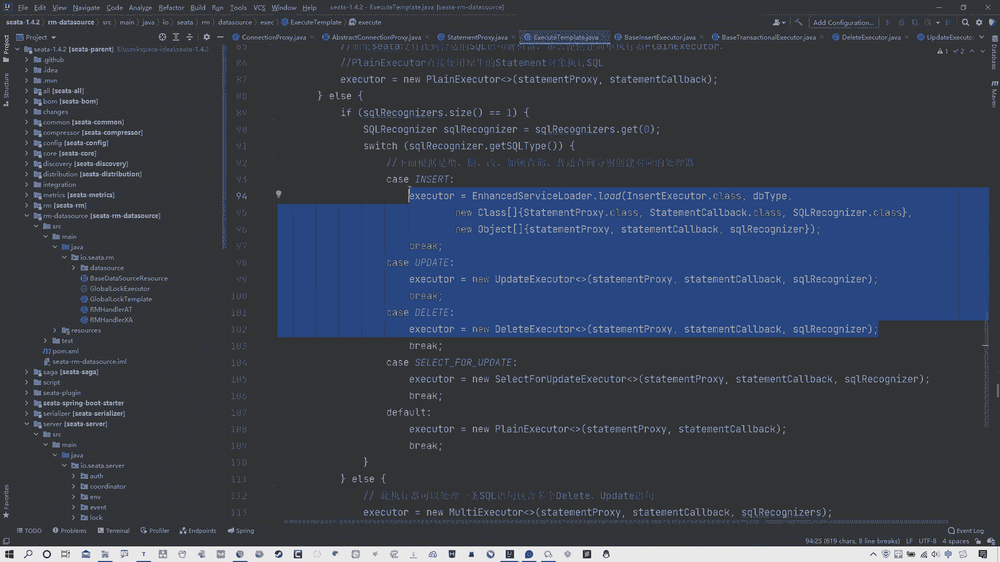

嗯，哪去了啊，这个obstract dML baseaseex，它就是这个最大的模板。那有了这个模板，我们就很清楚的知道。也就是说当前我这些对应执行器里面所执行的语句。

那么有一些共同的方法都在这个模板类型中OK那我们就可以往下继续来看啊，当然我说的这些啊，在我的笔记中都有体现在哪儿呢？给大家搂一眼啊，或者头你们复习好复习啊，就在这。看到吗？啊，那这不多说了。

然后在这儿啊给大家看一眼笔记中，我给大家去找的一个关系图，就是当前我们整个的这块一个类型的关系图。你可以看到啊statement这是最大上面，包括还有个excutor。

那么你这个位置你可以看到呃delete。😊。

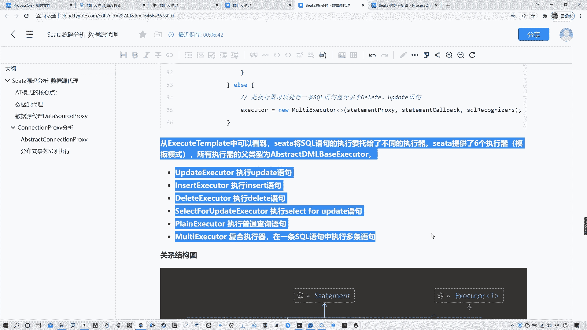

update是不是都从哪来的？base insert啊base呃这个这个inexer是不是也从这来的对吧？OK然后这个obtract呢，还有一个上级。

就是这个base transitional啊exer。😊。

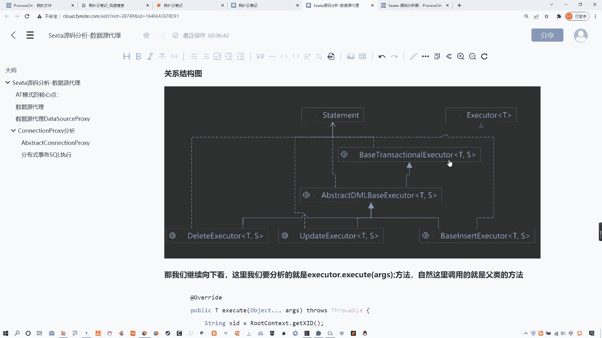

所以各位啊要知道这个关系，那么现在我们就可以往下继续来观看这个代码啊。它最终执行是在哪儿？是在这儿。那也就是说白了，当前这个excuter点上excut方法，这个方法就是你具体选择。比如说是个插入。

比如说insertok咱拿它举例子，当前你语句类型为insert，那么找的就是一个insertex。那么就是通过这个具体的插入执行器来调它的excut方法。好。

那么现在我们来找一下这个位置调的就是负极绑法。当然啊它这个位置调的是最大的一个负极base这个啊，走看一眼。在这其中他做了什么事呢？往下来看啊，在这个位置，excuscuter进来以后。

你看首先他去拿到对应的叉RD，这是个全局ID对吧？O然后获取叉RD这个位置statement proxy我们现在不用它执行吧，对吧？好state proxy等点上get connectionxy啊。

点上ban去绑定当前的这个叉ID也就是说把这个全局事务ID给它绑上。😊，然后再来去设置全局锁，那么就证明你当前的这个全局事务加上了。对吧这是个标识嘛？对吧？OK好，那么全局事务这些关键的东西加好以后。

这个位置有个叫做doex方法。这个方法就是我们比较关键一个方法啊，可以往下续续看。但在但在这之前啊，我跟大家去说一个事儿。😊，哦大家一定会发现一个问题，就是如果你看过spring源码啊。

你会发现什么excusor啊，doex。包括后续我们可能看到comit，有do commitit这个方式跟spring非常像。所以啊我建议大家如果说你之前没有看过源码。

你最好是把spring的源码看一遍，把它理解透了以后，你再看这些源码的话，其实大同小异。😊，好吧，OK啊。

那么可能说它的意思一般都代表说你这个excuser是一些啊具体操作前的设置到do这个位置是具体执行。这个do这个位置具体执行找的是谁呢？你可以看它是个抽象方法。那么当前这是个最大的负类。

这个抽象方法是由谁来实现呢？就是刚才我所说的一个模板obtract baseO找的就是它所以来看在这儿就是我们那个具体的执行方法。😊，看到了吗？嗯，然后在这个位置，各位啊注意看啊。😊。

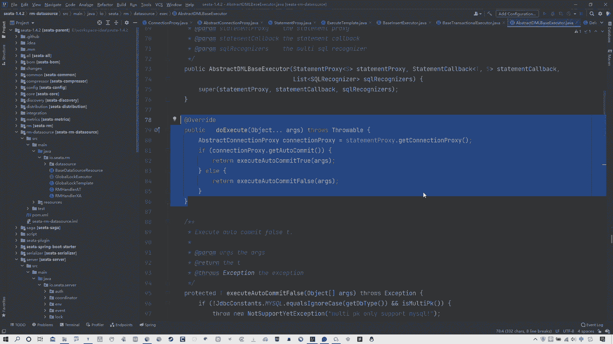

我先给大家看图啊，到哪一步，我先跟大家说啊，到图中的哪一步啊。你看首先绑这个这个excusor绑定ID设计权设置选局锁啊，就是此方法是用来判断当前要执行的circle语句，那么执行哪个具体的执行器啊。

然后子类重写，这个子类重写就是我们的abstract。

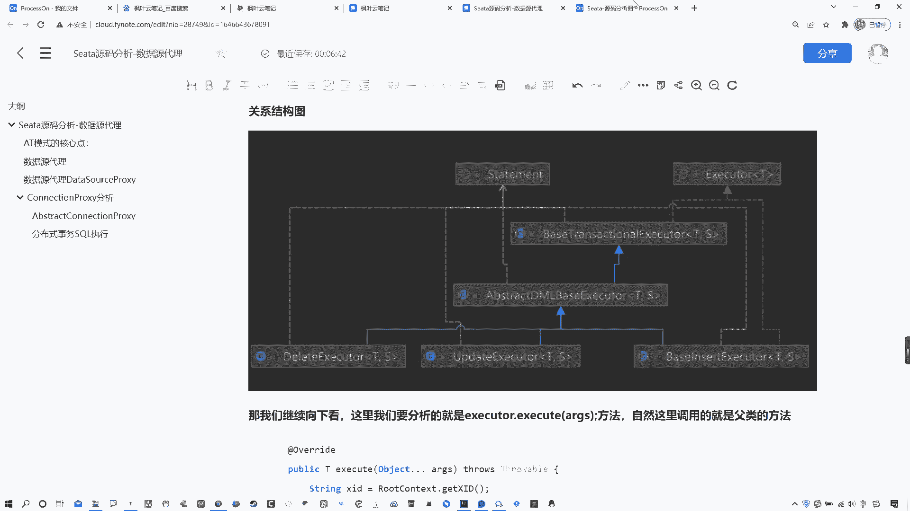

啊，然后这儿我要问大家一个问题。😡。

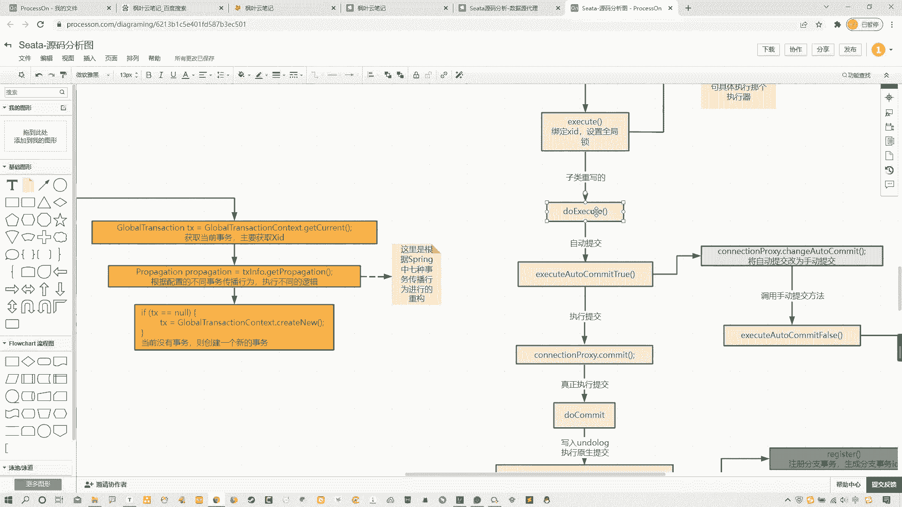

这是关键了啊，注意看。你们要知道当前我们这种啊数据库就是mysqcle，它是自动提交呃，就事物是自动提交，或者说我们写语句的时候是自动提交还是手动提交。这一点相信大家应该都知道。

我们买sqcle举个例来说，我们在写一条查询语句，或者写一条insert或update语句的时候，是不需要在我们啊就是我们写完，比如说写一个select语句哎呀。啊，没开放大镜，稍等啊。

比如说我们写一个st语句以后啊，SELECT啊，星号我随便写啊，写这么条语句以后，我们是不是不需要在这个语句后面写个commit？这应该都知道吧，这是比较基础东西。我们是不需要自己写的commit。

我只要回车，我就能看见我查询结果。比如说音色上就能看到我插入的结果。😊，对吧所以说白了从这儿我们应该就很清楚的知道，这也是比较基础内容，就是mycyclqcle这个位置它都是自动提交的。

所以你可以看当前这个具体执行的方法，在这是不是有个returnex auto tocommit true和commit force把参数传进来。那你想我们当前是自动提交。

那是不是应该走的就是这个commit true。O所以在这儿我们进到这里方法。😊，好，就到这儿了。那我们可以看一眼到哪儿了，现在现在走到的是这儿自动提交这。

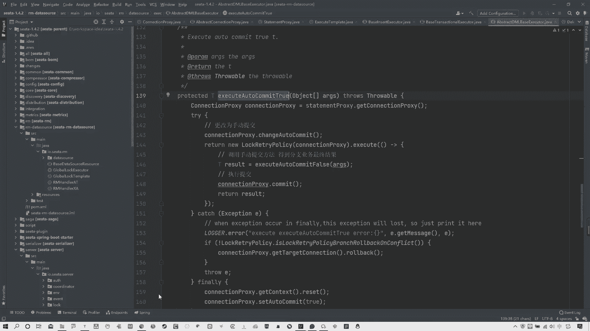

对吧走到自动提交这了。OK那么现在我们就可以观察在这个自动提交的这个位置，它具体做了哪些内容啊，我们仔细来看啊。

首先在这儿啊在这之前我要先说清楚各位你们要知道我们这2PC阶段是在第一阶段与这个数据库交不是呸与这个TC交互以后，那么他再去提交的时候，最开始最开始这个事务是没有直接提交的。😊。

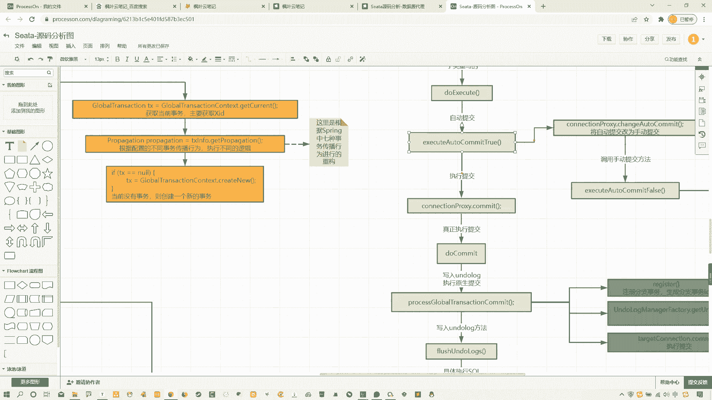

所以他需要做一些相关在提交前的一些准备。比如说啊啊记录信息，这些乱七八糟的东西。那包括在第一阶段的时候，你本身在提交以后，你需要去得到一个具体执行结果，你去把这个结果去告诉这个TC。

然后由TC来通知你你是具体的一个执行还是回滚，对提交还是回滚，对吧？所以当前这个位置，你要知道在这儿它并没有真正的去做执行啊，去做这个这个提交，为什么这么说呢？你看上来第一句话。

connection privacycy点上称着all to commit。我们可以看一下这个称职all to commit是干什么的。这个不用管它，你就看这儿来。

这个set auto to commit，你看它传了个false，我相信大家应该都知道这个set auto to commit什么意思。我们可以看一眼来看这儿啊。

这是原生的connection原生的给的一个方法。这个方法说白了意思不就是是否开启自动提交嘛，对吧？如果你这个位置传的是个false，那你回过来看这儿啊。哎，回哪去啊，回到这儿啊。

你看它这个位置传过来的值为 false，那是不是就证明说白了把当前的自动提交模式改为了手动提交模式。为什么这么改呢？是因为这个位置我们先不让它真正的去完成提交。对吧OK那么改完真正的提交模式啊。

不是改完手动提交模式以后，再往下来看，看这儿关键点在这儿啊，调用手动提交方法得到分支的业务最终结果。你看这方法是什么？excut or to呃 commitit force那这个方法的话。

你看它干了什么？😊，也就是说，在你真正去提交前，他做了一些事情。首先你看。before image是不是快照的意思啊？这个快照就是我们那个前镜像。就是执行sql语句之前的前镜像啊。

就是那个and log中所记录的那个前进像用于回滚的。那么还有一个after image，这是后镜像。

而这句话result等于什么s呃这个这个statement call back点上这个这个这个呃iterator这个位置我可以跟大家说啊，它就是来具体执行业务了啊，这个位置就就是具体执行业务了哎。😊。

具体执行业务了，这就不用多说了吧啊，局行执行我们具体的业务不是业余啊，业务打错了ok。😡，然后还有就是这有一句话就是。呃，prepared un do log看到了吗？

然后把befo image和after image传过去，可以看一下它是什么啊。他这个位置这个ppere。他实际上是把它存到了。你看be啊，我看一下不是空啊，这里判断它实际上是把这存下来的。啊。

先不看这吧，这个回头咱们后面看，后面看不着急，不到这儿啊，你就记住它这个位置实际上就是暂存and卓log是不在commit的时候再去提到数据库。它把目前的这个数据先保存下来。

前镜像和后镜像我先给你保存下来，暂存。😊，好吧，OK啊，那咱们接着说，那现在我们就找到关键点了。哎，什么关键点？首先在这这个位置的时候，我先把它改为手动提交，然后调的是一个什么。😊，手动交方式。

把前镜像和后镜像要搞出来啊，但是这个语句最终还没有真正提交呢，真正提交在哪儿是在这儿的。connection policy点 commitit，这是真正提交。

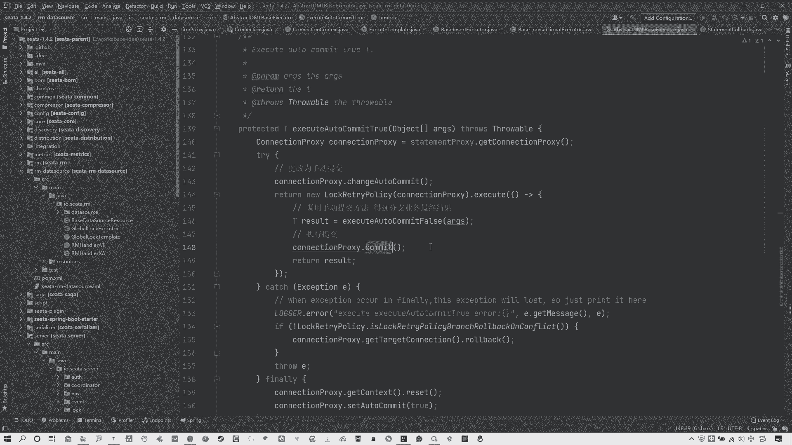

对吧OK啊，所以说这儿我们可以看图总结一下。在这个图中我给大家画出来了。在这儿上来，比如说我们这儿首先啊你看啊这个这个这个到这儿嘟是吧，自动提交这儿，然后呢把当前的自动提交改为手动提交模式。

然后这个位置他做了一些事情。

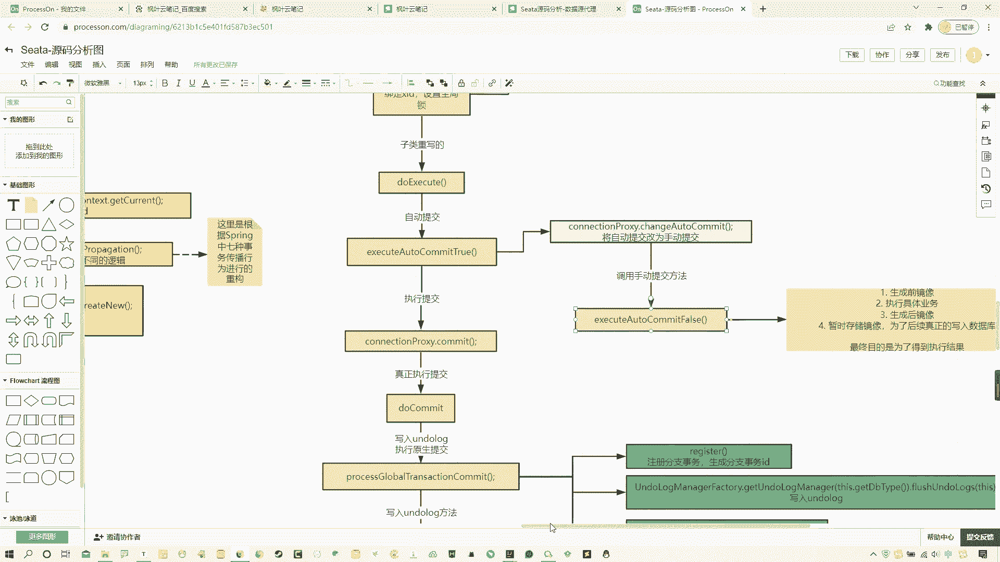

就刚才咱们看的这儿啊。手动交方法，这儿首先生成了前镜像。然后具体执行具啊执行具体业务，然后生成后镜象。然后暂时储存镜像，为了后续真正写入数据库，就是把你的安度log中的一些前镜像后镜像。

就两个快照去写入到你的那个数据库中。所以这个最终目的是为了得到执行结果。啊，得到一个执行结果。就是说你C口业务执行完以后，你就是你那个本地的那个分支事务的一个执行结果。

OK那么现在把这个执行结果完完事以后再回到这儿，我们往下来接着看。😊，再往下看到就是这个connection policy点commit。

这个connection policycy点 commitit搁哪搁这呢？这才是那个真正的去执行提交。啊，这才是那个真正的去执行提交。我们可以再往下来看啊，直接进到这个commit方法中。

现在前镜向后镜向是不找着的对吧？好啊，没关系，一会儿我会找他具体怎么写，咱们先往下看commit走。😊，然后你来看这儿啊，进入到这个commit方法中，在这儿还有一个docommit。

那这个就是跟spring源码的那个方式就非常类似了。😊，啊，如果你阅读过的话，你应该很清楚就知道。所以很明显就直接往这里进，do commitit看他干什么了。OK来看这。进入到这个读卡密的方法中。

首先它判断你是否存在全局事务。你看in globalbal transactional，它这个就是在这儿啊，就是说白了判断有没有叉ID啊。如果你叉ID不为空，就全局事务，对吧？

okK那很明显我们现在有走的就是这。procyglobal transitionals这个这个这个commit再往里进走。好，然后进入到这个方法啊，我们先来通过这看一眼。进入到的是这儿。是这个方法。

对吧？OK这个方法它实际上干了三个事儿。😊，第一个事儿，注册分支事物，生成分支ID。啊，说白了这个位置就是真正去注册分支事物了，去生成一些分支ID。然后第二点还做了一件事。

就是说去真正的写入这个andlog。然后最后才是执行提交，也就是告诉结果去把这个数据真正提交起来。啊，ok所以咱们可以先看一搁哪儿啊。第一件事情在这儿呢，rejectctor。😊，走，你看他干什么了。

log这个啊。b这个ID它代表的就是分支 IDD。然后它通过这个det result manager点get点bsh reject。

这个方法就是注册分支ID注册哪些模式相关的这个代理以及这种呃资源ID等等一系列的相关内容。他把当前的这个分支ID给它注册进去了。OK这是注册方法。好，再回来。😊，往下有一个写入数据库。

写什么把and do log真正的去写进去。你可以看这啊。核心方法在这儿。face andlo。啊，然后最后你看这执行原生提交，这不就是那个一阶段提交嘛？对吧？你看这儿。

target这个这connection是谁？就是原生的connection。然后呢，在这调了一个方法，叫commit。这commit是谁？原生的commit提交方法是不是在这是真正的提交啊，对吗？

OK那么现在我们要关注的是数据源这块，那么数据源它最后要写入那个andlog前镜像后镜像。所以在这儿我们要关注的就是这个。😊，flash方法flash and logs走往里看看这个方法干什么了啊。

当然这个位置是一个接口，它有实现类，那么对应的实现类就找到它在这flash and log，我们可以通过这看一眼来。在这儿啊flash andlog，然后再往下来找找哪个方法啊？首先咱们可以先看一眼。

在这个方法中，你看首先。干啥了都。上来str叉 IDD啊，connection contactt获取叉ID分支ID等等相关的一些信息。看到了吗？相关的一些信息。

and logs什么什么什么什么什么andlog怎么怎么着的，是不是拿到相关信息啊？😊，然后这些啊拿到以后，真正写入数据库的位置，在这儿有一个insert up啊。

这个这个under log维斯啊这个方法。有没有方法？那你可以看啊超作参数什么叉ID啊，blashID啊等等等这些东西。那你可以看一这方法里面怎么写的。啊，当然你可以看到这是个抽象方法。

它也需要我具体的实现类。那你来看这仨实现类都是啥？😊。

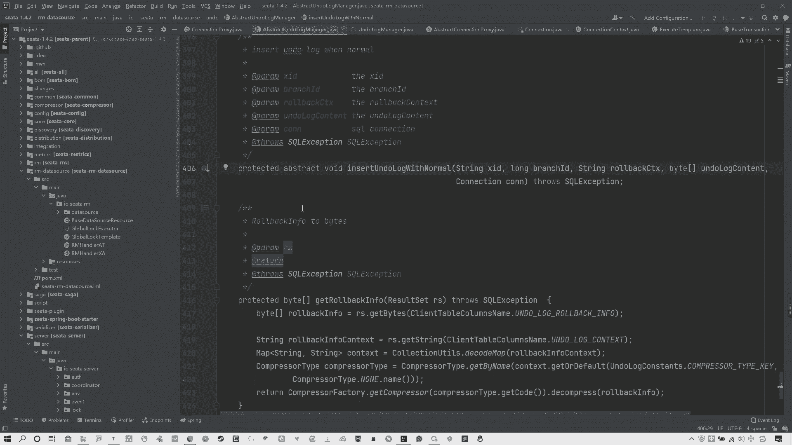

my circle oracle，还有这个。不同的对应的你的这个数据源，你是买circle的类型的数据库，还是oracle的还是什么的啊，当然这个位置很明显，我们目前用的就是mycircle。

所以直接去找mycicle andlog manager就行了。

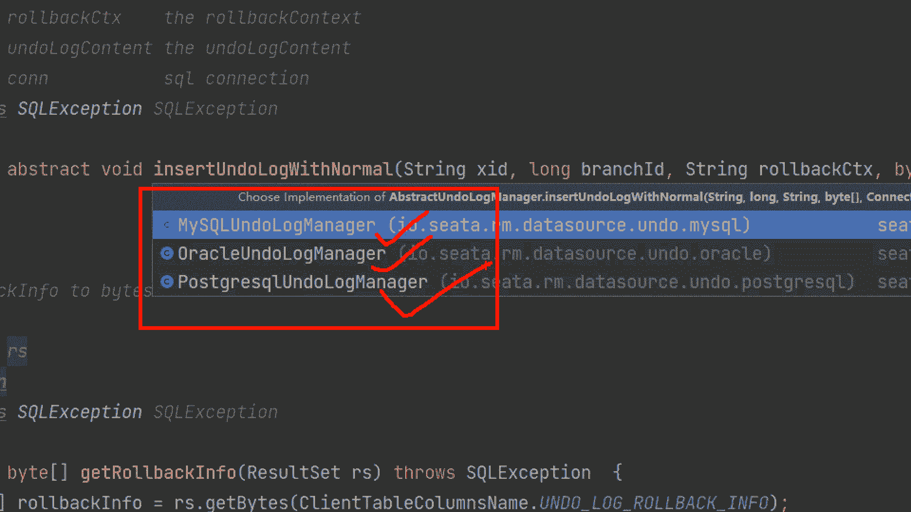

然后你再看这个insert的方法，其中调用了一个叫做insert and do look方法。走，你来看这是干啥了？这是不是就是最终去写入相关的那个叉D不是那个安 do log。那个那个写入方法。

就真正去往数据库里写的那个号啊。对吗？所以在这个位置时候，就把相关的所有的这个and dolog中的表中的数据。写入进来了。对吧这个这个这个很熟吧，这个不能说不认识了。😡，对吧？OK好，所以分析到这里。

我们就很清楚的知道这个数据源是咋回事了。这个数据最终是怎么写去的。okK我们就全分析清楚了，可以看图再总结一下啊。来这个数据源这个位置。😊。

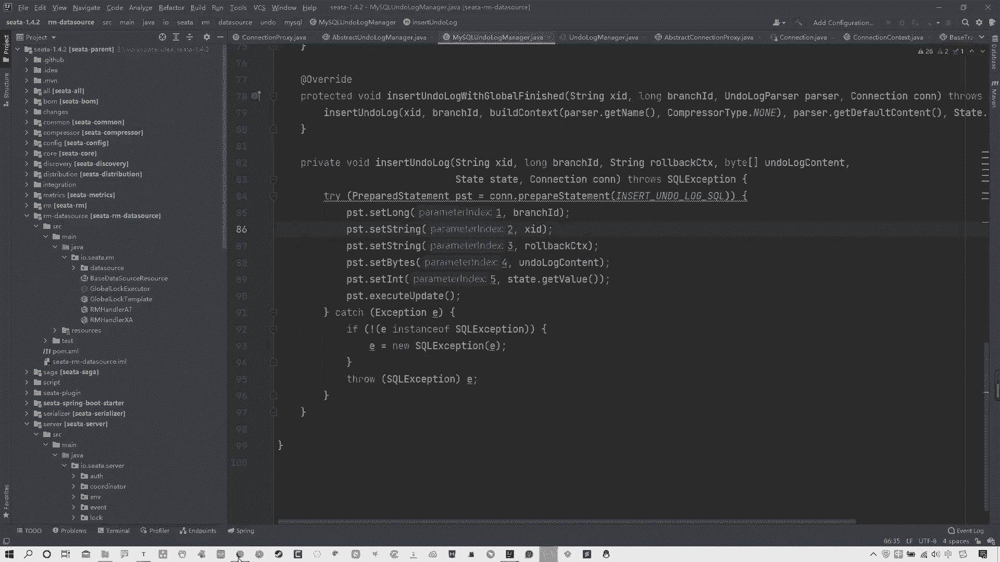

我们最开始是从这过来的，然后呢绑定元素以后嘟这个啊，不是绑定元素，绑定叉ID以后。进来子类重选，然后自动提交自动提交这个位置改为手动提交。就说白了先不让它提交，然后把对应的这个调用手动提交方法。

首先生成前进项去执行具体业务，生成后镜像。那么这个时候生成前进项是为了保留这个之前的数据。😊，执行这个具体业务就是执行你当前分支事务那个具体业务生成后镜像，就是是更改之后的数据。

然后暂时去储存这个镜像啊，去为了后续真正去写入到你的数据库里面去。所以这个位置再往下来走，真正的一个提交执行，找到do commit写入原生啊，写入这个andlog，然后并且执行原生的提交。

首先注册分支，然后通过对应的这个方法，这个face方法来写入写入完以后，真正的去执行commit提交。啊，这个时候comit提交以后，就会有对应的结果去告诉服务端成功还是失败，对吧？

然后这个位置往下怎么写入呢？走的是flash这个flash这个方法执行具体circle。我给大家看的是通过买cil实现的那块。对吧？OK这就是我们数据源啊sta数据源源码的整个的分析啊，那就分析到这里。

好吧，各位OK那么各位这张图回头会发给大家啊，我现在就把它分发给大家。😊。

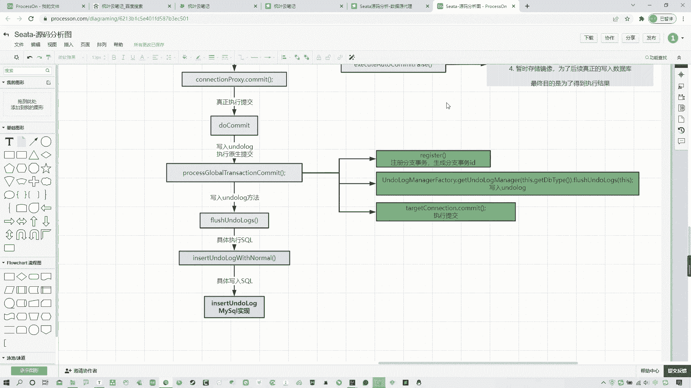

分享。OK那么都在我这个笔记中的最后。

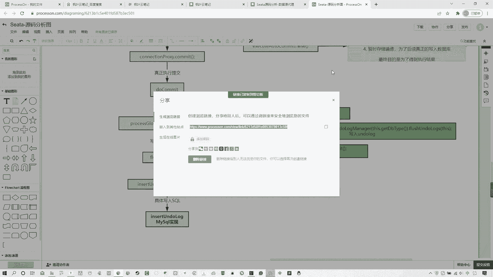

啊，都在这个笔记中的，最后我这样给大家去写一下啊。再是咱们这个风云笔记啊，在最后给大家说写一个就是这个呃原。很漂亮。原理图。行了，原理图。地址。O在这好吧，你们直接去打开这个链接。

就能看到我给大家去画一张图，通过那个自己再捋一捋就可以了。好吧，各位okK啊，那咱们这节课啊sta的这个数据源代理我们就讲到这儿。😊。

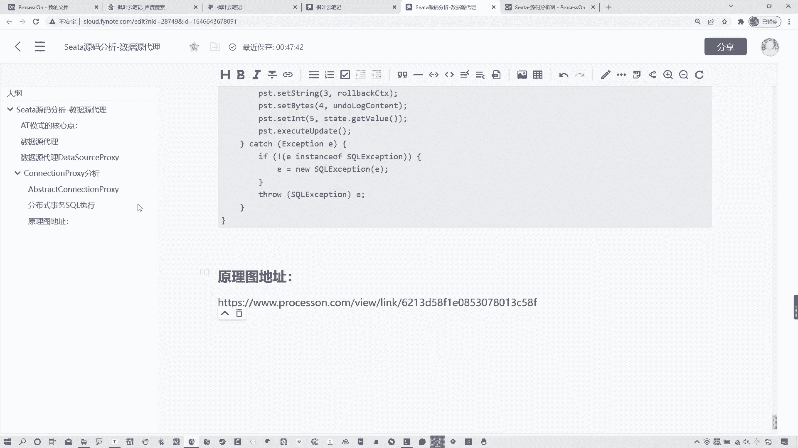