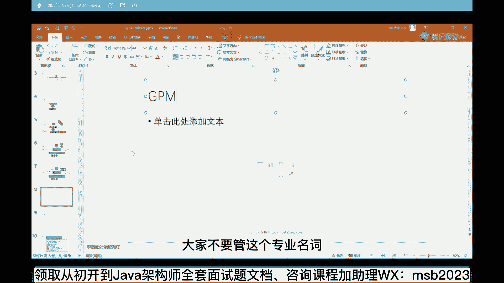
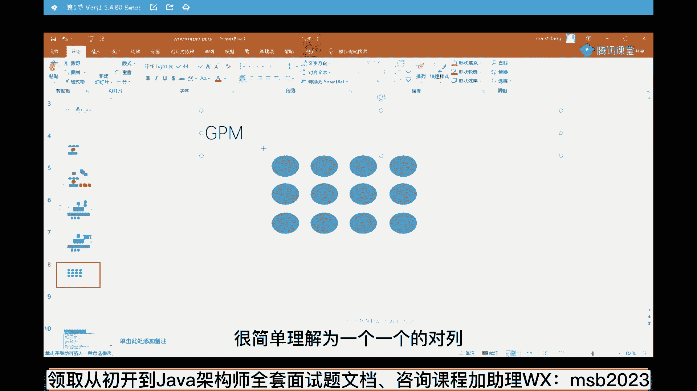
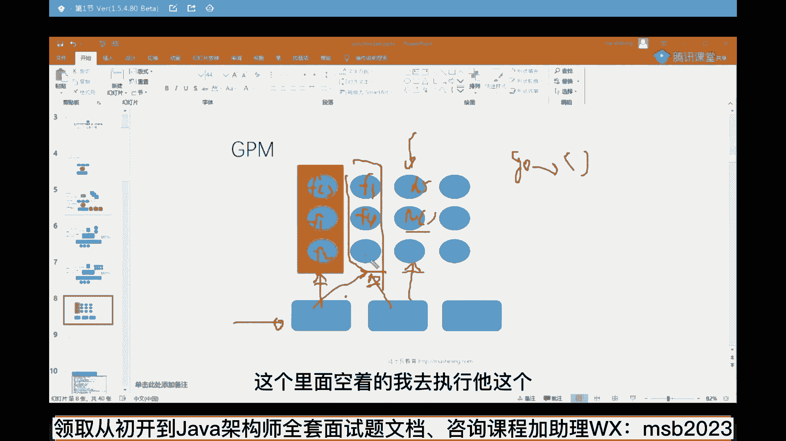

# 马士兵教育MCA架构师课程 - P12：GPM模型 - 马士兵学堂 - BV1RY4y1Q7DL

大家不要管这个专业名词。

你听我讲就行了，呃作为我们go语言来讲。

你在这里起的任何一个的go routine。

go routine，go routine，go routine一堆。

你可以写了一堆，这个东西呢叫做一个一个的g。

就是一个一个的购入outine，这个g的意思就是go入outine，那么p是什么意思呢，p叫processor，processor的意思，简单理解为啥很简单，理解为一个一个的队列好了。

这就是一个一个的队列。

ok。

这个叫一个p，那什么叫m呢，m就可以具体理解为一个真正的底层的线程。

这是我们操作系统级别的线程。

作为go语言里面，你要启动一个一个的go routine的时候。

相当于什么呢，相当于往队列里面扔了一个任务。

扔了一个task，那么这个任务具体由谁来执行呢，具体的执行人是我们操作系统级别的，内核级别的这种线程，ok这是内核级别线程，同学们你们看一下，来看一下这个模型，看能不能看懂，我再给大家说一遍。

比如说我刚才的那句话，go f就相当于我起了一个f这样一个任务，然后呢可能还有其他任务，比如说f1 f2 f3 f4 m5 啊，n等等，每一个任务都是一个方法，我只要前面加一个go字的话。

就不是方法调用，而是我直接把这个任务扔在了一个队列里，再说一遍，那这些队列由谁来执行的，是由底层的一些线程来取，这些任务里头，任务队列里头去找好多线程去找诶，这个里面空着的，我去执行它。

这个我去执行另外一个这个给阻塞了，怎么办，他就等他正在等待网络的写回的数据，我现在没有执行了怎么办，我跳到其他里面去执行，我找到另外一个去执行，能执行的，我马上执行，那么这两个之间要需要交通信怎么办。

go语言里面叫channel对吧，那是go语言的那两个携程之间，两个go入t之间的通信模型，ok同学们好好看一下这个模型。

不知道大家看上去眼熟不眼熟，不知道能不能大家听得懂，大概大家能get到go语言这个模型吗，能get到的话，给老师扣个一来，如果你学过java线程池，我相信这个模型对你来说很简单。

java的线程池是什么意思。

同学们，你们想想看，作为java线程池来说，他是不是首先得启动一堆的核心线程，有一个线程的最大值，线程数量的最大值，然后呢他自己有一个阻塞队列。

对不对，阻塞队列，接下来队列里面，你是不是可以往里头扔各种各样的test呀，那这个test是什么样的呀，不就是一个一个rable吗，或者是一个一个colorable吗，其实本质上和这个有区别吗，没区别。

go语言先进就先进。

在他把这些东西全给你封装了，他不像java语言，你要做这个模型，必须得起线程池，然后自己往里扔任务，任务和任务之间的同步需要你自己做，go把这个模型封装的超级简单，一个关键字go就可以了好了。

这就是go语言比java语言所谓牛逼之处就牛在这，m表示具体的限制好吧。

m它就是它专业名词叫machine。

实际上就是线程线程池里面那个线程的意思，所以go on就是自带线程池。

没错你说的太对了，eddy以后这个课你来讲。

所以go on的意思其实你只要把牛逼就牛逼在这，这是他最牛逼的一点，就是它简单，并不是说他它效率到底有多高，运行的效率到底有多高，no它简单，你懂吗，非常的简单，test里放线程吧，不对。

test里放的是任务的歌，java为啥不封装，因为它古老，每一个新诞生的语言。

总是在原来语言的基础之上要做一点新东西，不然你怎么超过原语言啊。

既然讲到这了，我就多说两句，go语言以后会取代java，不会go会抢谁的市场，说到这多说两句啊，go语言会抢谁的市场，会抢c加加的市场，会抢java的部分市场，会抢菲律宾的市场，好多pp都转了够了。

为什么呢，简单但是请大家注意简单这个事情，如果一个事情特别简单，他要想多赚钱，他就在别的地方得增强，所以go语言呢他主要是做的做什么呢，做中间件，原来占位语言开发的中间件也非常多。

现在go语言开发的中间件越来越多，所以将来我预测应该是什么呢，构造中间件，java做业务逻辑，这是两个黄金组合，站在牛逼架构师的角度，不要跟我那区分语言，牛逼掉狗是什么，都要选大人，大人从不做选择。

我们都要小孩才做选择，牛壁架构师，这个地方该用水泥柱子，用水泥柱子，该用玻璃柱子，用玻璃柱子，所以这个地方该用java语言，用java，该用够用够，该用python，用python，该用julia。

用julia，该用rust。

用rust k，好这是我们底层的一个线程模型，当我说到这里之后，同学们，我来呃，不知道有多少同学能够理解，这个线程在本质上到底是个什么东西的啊。

