# 马士兵教育MCA架构师课程 - P120：Seata源码分析- Seata服务端（TC）源码解读 - 马士兵学堂 - BV1RY4y1Q7DL

hello，同志们啊，我们这节课来继续讲解这个西塔的源码啊，稍等一下，我把这调一调OK啊。呃，这节课的话给大家去讲一讲我们这个sta的服务端，也就是TC相关的一个源码的一个阅读啊。呃。

因为这段时间各位我们一直在讲它客户端相关内容啊，包括我们从最开始的这个稍微缩小一点啊，从最开始的哪儿呢？这个它对应的一个自动装配。

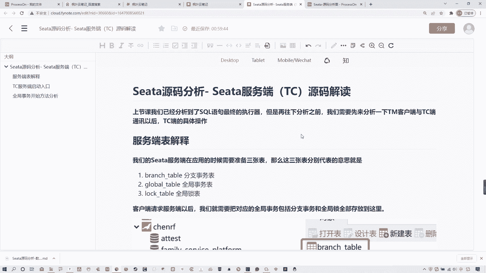

找到这个全局扫描的注解，然后。包括这个什么obstract auto pro，然后它的一个重写的一个方法，然后再去程序启动的时候，呃，事物发起时所调用的一个in work方法啊。

然后到解析注解以及对应的处理。到我们找到这个啊这个exccuse方法，最终执行我们这个整个核心的几个步骤，全局事物的几个步骤，包括获取这种事务信息，然后它的一些操作，包括执行全局事务和它的一些操作。

对吧？啊，去什么发起于TMTC发起请求等等这些，然后呢，包括这个呃。这个这个commit整个整体的这个全局回滚或提交，对吧？然后呢啊全局回滚啊，然后到最后的提交以及清除资源。

这个位置是我们之前所看到的整个非常核心的一块内容。什么内容呢？就是我们的呃。全局事务提交整个流程。那么之前我在这讲过说在第四步commit的时候，它需要跟sta server端进行一个调用。

那么调用以后呢，我们需要去找到sta server端相关的一些内容。啊，就是说呃这节课我们要分析的就是去开启这个全局事务提交以后，如在sta server端它是如何进行调用的，还干了什么事儿？啊。

这是我们这一课主要分析内容。好吧好，那么废话不多说，我们就来实际分析啊。当然我们可以先找一下哪个类型啊，先找一下这个我们先看一下来。找这个handler这个啊我们来到源码这儿啊。搜索一下okK好啊。

然后我们来看一下之前我给大家去讲过这个过程，什么in work从这开始对吧？O然后呢，到它整个执行全局事务，从这开始，handler transactional，然后进来啊，然后它具体的步骤。

我来看一下啊呃。合理去聊。超时时间。然后。这是最开始的构建信息执行异常。哎，不是。哪儿去了？我来看一下啊。啊啊在这儿在这儿看错了ok啊，在这啊handlergbal transal啊。

从这找找这个excuter方法啊，从这进去OK然后呢，我们可以看到它整体的执行流程，第一步去获取事物信息，然后这是第一步相关的操作，对吧？这个我们都讲过了啊，然后到哪第二步呢，到的是。1。

3第二这个位置开始执行全局事务。然后第三步发生异常，全局回滚，对吧？然后进行安多loggo的补偿啊，包括最后的这个第四步提交资源啊，全局提交啊，然后以及最后的清除资源啊。

当然这个位置我们其实实际是从这儿可以去看到，从这儿开始提交全局事务去调用我的服务端。

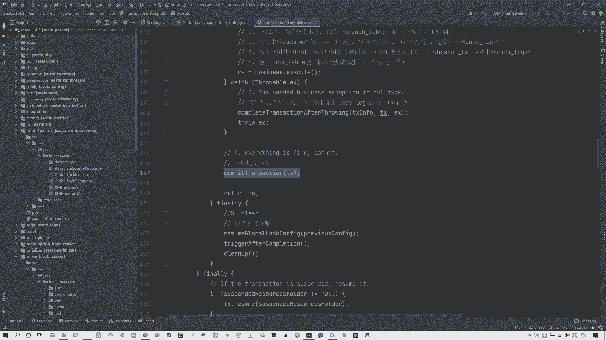

那么服务端的话，各位从图上来看，怎么去找啊？实际上他这服务端是这样的。

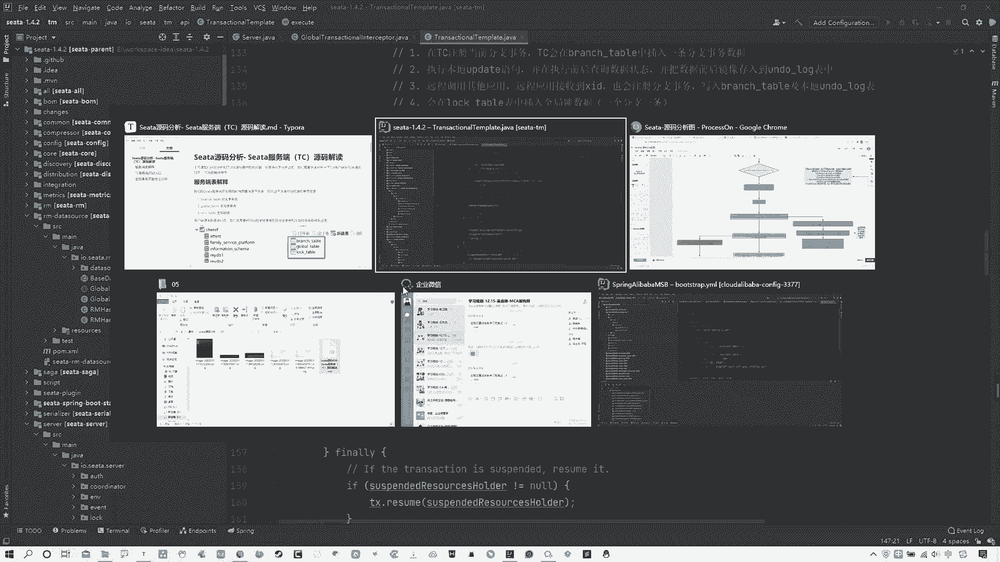

呃，我们这个服务端是我们在这个我们自己电脑上配置的那个sta serverber端，对吧？这个应该都知道，我们之前装过啊，带大家去呃应用的时候，带大家去讲过seta serverber端。

那么这个staso端，它实际上本质上它也是个项目，它也是个s的项目。而且各位你们要知道一点关键就是不管任何看笔记啊，就是我这写过了说。就是我先说啊，就不管任何的这种牛逼的项目或者牛逼的框架。

它的这个都是java项目。那Java项目的主启动类肯定是幂啊幂函数。所以一会儿我们去找就找这个密函数啊，所以这点不要着急，我们一会来看一下啊。然后现在我让还要解释一个事儿，就是我们服务端所做的一些事情。

那这个位置的话，我需要把我的这个数据库开一下，我先解释一下。😊，这个位置有一点啊，有几点，我需要跟大家说一下啊，稍等一下。有哦，这个不要不要不要着急啊，是我那个服务掉了。这个电脑内存有点不太够使。

稍等一下啊。服务我来找一下我的myscle应该是。自己关了啊，你看关了，okK把服务器一下啊。好了啊，然后咱们回答回到数据库这儿啊，回到数据库这啊。😊，再连一下。好。

我们之前啊去构建这个s塔 server的时候，去创建过一个表哦，一个库就叫西塔。在这个s塔中呢有三个表。看这来。啊，brsh这个这个tableglobal table，还有look table。

这三个是什么东西？各位还记得吗？啊，可能同学忘了啊，所以这我给大家回忆一下，这三张表，实际上是我们sta server端所用到的三张表。在这给大家看一下来，在我的笔记中啊，在这儿。

第一个实际上它是分支事务表，也是它进行存储你的分支事务相关信息。第二个global table它什么全局事务表啊，还有一个就是look全局锁表。所以这是这三张表的作用。也就是说白了。

我们全局事务在开启的时候，它是需要对这三张表进行相关的一些信息的填写的。前提是你使用的是DB模式，还有数据库模式。当然各位应该都知道，我们之前讲过，sta是分为这种呃文件模式，嗯，还有DB模式。

数据库模式，包后还有个redis模式，我们目前用的是数据库模式，对吧？所以这张3张表是我们自己构建的。OK啊，那么我们现在说完这点了，刚才也说过，就是任何java工程的启动程序都是主函数密。

所以现在我们就要从这入手去看一下整个的构建过程。其实我们今天主要看就是个全局表，好吧啊来。😊，那我们就找一下啊，这个我就不给大家去现找了。就是你们全局这个暴力搜索一下，搜索找到这个秘方法。

它实际上是在server在这里面，这type server在这里面啊，在这里面你可以看到秘方秘方法在这儿。

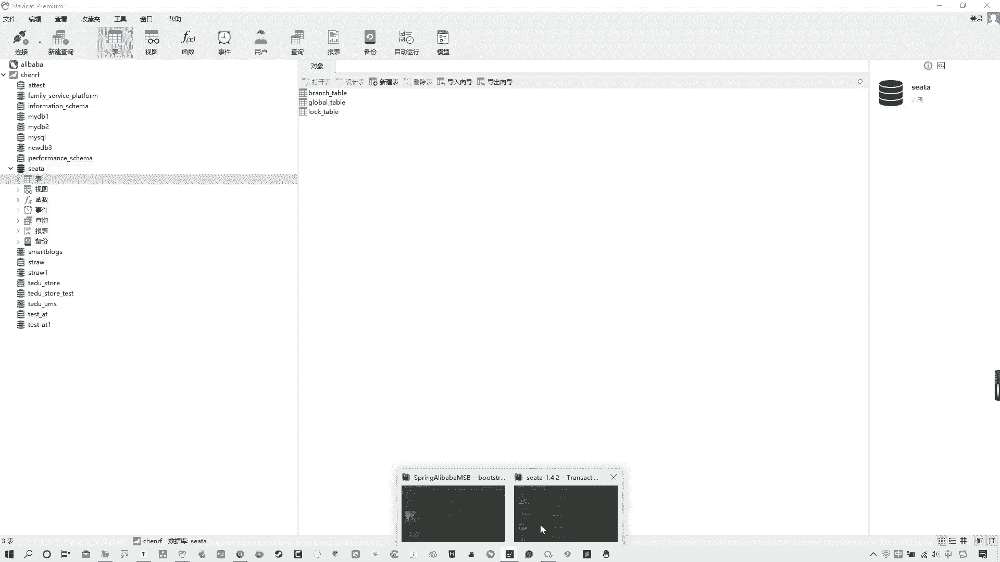

对吧命方法在这儿，然后在这其中我们要找一个关键点啊。在这儿。他就是那个关键点，默认的调用者。不能叫调用者，叫默认的协调者，叫deund coordinator啊。

那么这个东西的话是我们就可以从这儿去进行去查看啊，包括从我的这个图中你可以看到这标出来了啊，不是这个图啊，从这个图中可以看到啊，到塔搜端，找到这个默认的协调者然后去找这么个方法。

叫做do global begin，你可以往下来看啊，在哪儿啊。

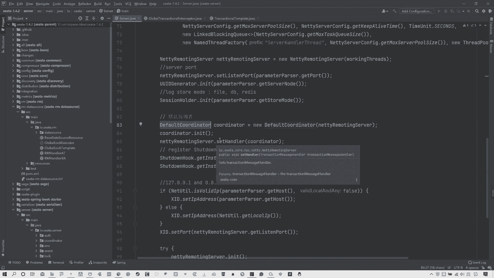

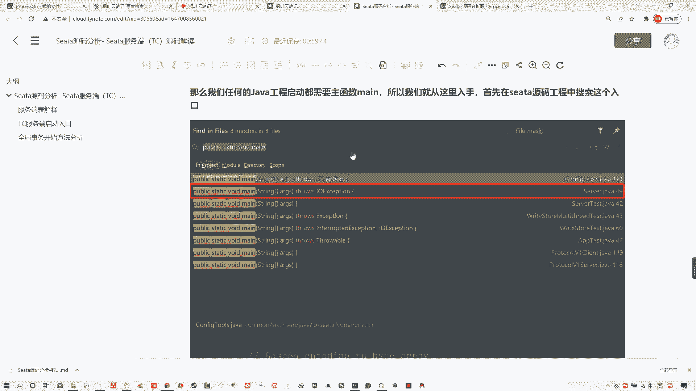

在这儿。在这个默认协调者中，有一个叫做dog begin。从这开始是一个处理全局事务的开始。那我们来首先看一下这个方法里面具体做什么了。第一件事情，你看啊响应客户端叉 IDD看到了吗？

response点set IDD去把对应的叉 IDD响应过去。哎，那实际上关键点就在于哪啊？咱们先不着急看啊。

先看这个这是个do global begin还有什么do global commitit全局事务提交，还有什么do global全局事务回滚，包括全局事务的一些状态等等些其他信息。

这三个是我们比较关注的对吧？当然今天我们主要关注这。😊，啊，全局事务的开启它怎么去做的？我们往下来瞅啊，所以在这儿首先啊你可以看这有一个call点begin。核心begin从这去开始，我们从这看来走。

OK看到这个begin方法啊，在这个begin方法中，它做了哪些事情呢？我们一点点来分析啊，我们一点来分析。那么你看这个比方法中啊，上来第一件事，global session。

session等于global呃session点create globallobal session，这干啥呀？实际上它是创建了一个叫做全局session。从图中我们可以看到就在这儿。啊。

创建了一个啊begin在这啊构建一个全局session，这是第一件事情。那么第二件事在这儿还有。session点I的 sessionession。Listener。是什么东西啊？

那么各位要注意中间这个词儿是什么意思？lifecycl。at session lifecycls listener是啥呀？首先这是一个添加一个监听，而且这是个观察者的设计模式。

同时这个位置lecycl它代表的意思是什么生命周期。session点 and sessionession lifecycl listener说白了是干什么？就是给他去添加监听嘛。

那么还有就是一件事再往下来看啊，全局事务开启section点be，这是一个全局事务开启。那么这这三件事啊，我分别在这个图中给大家列出来了，这也是我们主要分析的三件事儿。第一件事情。

构建全局session，我们看到了，这不用多是很简单的事儿。然后第二点就是为全局session去添加监听。那么第三点是调用调用全局session点 beging方法来开始对应的一些。具体处理。

所以啊第一步不需要分析。我们先来分析。第二步就是个为全局session添加监听。他干了什么事儿。所以从这儿开始。啊，从这开始爱的时候开始。O啊，那我们从这开始对吧？O啊，那么在这之前我们还是先看一下嘛。

这个构建全局session啊，其实它所谓这个固建全session就是把看plication ID包括transal service group group分组，包括name把一些相关的信息传去。

它构建全局session的目的就是为相互能够去进行一个么相互有个信息的互通对吧？所以这不用多解释再往下来看看这啊那么点 session leave这个东西list我可以看这他在这个位置去干了什么啊？

其实啊在这我们可以看它。😊，session holder点上get root session manager这个位置他做了一些什么事情，它实际上是获得了一个全局的session管理器。

那么各位可以注意到的是它虽然说这写的是获得了一个全局的session管理器。这个session管理器到底是谁呢？这有一个常量root sessionession manager，我们可以看一下这常量啊。

你看它的默认值是session manager，这是一个啥，这是个接口。对吧okK那么它是怎么去构建的是谁的？具体这个筛选管理器是谁呢？其实我可以往下来看，看它的初始化方法，init方法嗯。😊。

那么在引匿的方法中啊，往下来搂一眼啊，看这来。😊，他上来这都不用管啊，你就看这儿来啊。😡，这个是一个模式的判断，看到了吗？啊，这是个模式的判断。store model点get model。

其实这个位置它是去读取你的配置文件来获取你当前的一个。什么sta的模式。而很明显我们当前的sta就是个DB模式。所以说你看当前这个模式，如果是DB那好，我们现在这个位置它 equals嘛，对吧？

如果是DB模式的话，那就走相关这个位置啊，如果是其他的file模式，走的是fi相关的。那么还有如果是res的那走res。😊，看到了吗？它是根据这个模式去读取对应的文件。

然后来拿到你具体的那个真正的什么session的一个全局的这这这么一个管理器。OK所以很明显当前我们是DB模式，那我们就看这儿。然后你看啊我们要找那个长量值叫做root session manager。

然后他这是读取了一个叫做session manager class啊，如果是DB模式获取名字，它这个位置实际上如果各位你们自己来看的话，其实你们应该能看出来，它实际上采用了SPI的机制。

去读取了对应的接口时间类。那么他读取的是哪里？它实际上读取的是哪儿啊？读取的是当前这个ressource中对应的这个文件下的一个叫做DB模式的这么一个文件。在这儿呢看到了吗？啊，它读取的是它。

所以咱可以看一下走啊，在这其中啊，你就可以看到哎，我看一下啊呃，是不是这文件。😊，啊，不对，sorry看错了啊，不是他啊不是他啊，他读取的是这个。看错了。

就是这是data source provider啊，这不是他啊看这个来它读取的是这个session server sessionession啊，session manager。😊。

在这里面所记录了对应它的一些专门的类不同类型的一个实现类。你看啊有fi文件的实现类型，session manager有dabase的数据库类型的，还有redist的。很明显这个位置我们是dabbase。

对吧所以当前这个位置我们再回来回到哪儿啊，回到啊，就是它再往下翻啊，咱看才找了个哪儿来着？😊，这个这个这个这个init往下啊。咱算了，这么看，别推进了啊。就这啊。这个方法这个root是谁呀？

那不就是我们看到的这个对应的配置文件中。这个吗？是不是dabb session managerO所以在这儿我给大家去记录了，说去添加全全局这个监听以后。

那么然后呢这个位置啊还要去通过SPI的机制去读取对应的session的一个持有者。这个session的持有者实际上就是我们读取到的。

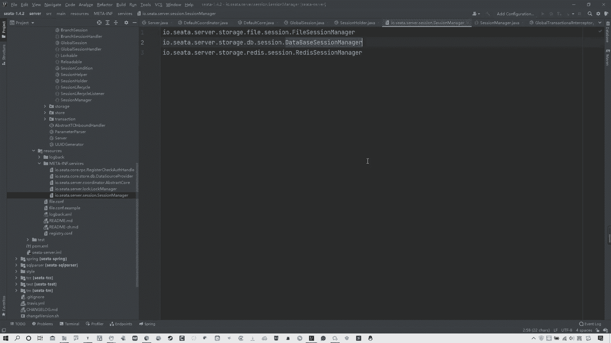

这个文件也就是DB模式。啊，返回的是它dabb session manager。所以当前我们这个管理者就是他。

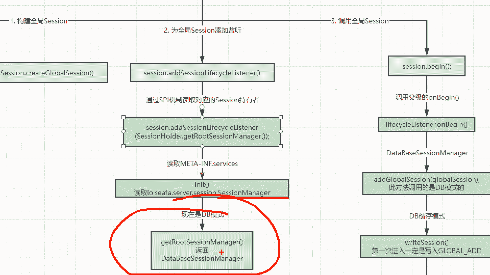

好明好明确了吧，这块O那么咱们再回到这儿。😊，啊，回到这。所以当前第一步构建了全局事务ID第二步干什么获取了一个啊这个这个就为这个当这是个观察者设计模式啊。

去添加了一个对应的创建了一个daatabbasesession manager啊，添加今定同时找了这么一个管理者，对吧？全局session根据你的这个类型去管理的。我当前数据库也行。

所以找的是daatabbase，然后再来就是全局事务的开启。😊，那我们就再关注这儿。往下来走啊，sction点 beging走O。😊，那么进到begin这个方法以后，你看他干了什么。

这个方法首先声明全局事务开始。为什么这么说呢？你看当前全局事物状态，你看global status点begin点begin实际上就是个开始状态。O它是个开始状态。

然后当前的开始时间以及激活全局事物active状态为 true。啊，然后将当前的这个session manager去放到这个集合中去调用它的什么on。begin方法啊，去调它的un begin方法。

所以这个位置啊，我们现在就来看一下这个begin方法啊，需要去进入到哪儿，进入到这个un begingin方法，这是关键奏。啊，当然这个位置啊。调的是谁呀？

这个位置有个副类叫做obstract session manager啊，这个obstract session manager就是它相关的一些session manager的副类。所以我们现在就找到它啊。

on begin有个叫做at global session啊。那么现在我们可以看一下啊，这个at global session在这儿。他又干了什么？往下来看啊往下来看啊。当然这个位置啊。

其实如果你直接进的话，它是负类的。那么这个位置你要想刚才我们是不是说过了啊，在这个位置。😊，哪儿去了？哎，哪去了？回来回来回来回来啊，就是在这儿啊。😊，我是不是在这去搞了一个叫做什么那个。这个东西。

dta database session manager对吧？从这找到它。所以当前我们在abstract session manager中去调用这个at global session方法，它应该是谁？

是不是就是我的datase，这个，而不是fi或者re。因为当前是database模式嘛，数据库模式嘛，对吧？所以找它在这进去。😡，在这儿实际上真正去执行的方法是这个。

也就是我的dabbase session manager所执行的这个at global session方法。啊，添加这个方法。那么这个方法它具体干什么呢？首先第一件事情写入session。啊。

写入相关s审。在这right session。对吧ok然后关键点就在于这儿，我们走看这个readd session啊，当然这也是一个。需要去找它的一个实现类啊，也是这个datb的啊。

一定是dabbase的。因为现在数据库模式就是它好造汁儿。那么你走到这个写入方法以后，来看啊，他干了什么？当前这个位置他判断说啊你这个。是否是啊第一次写入？如果你当前我们可一定是第一次写入。

因为刚开始掉嘛，如果你当前是第一次写入的话，你看它一定是走的insert。啊，如果你你如果不是的话，可能是有修改，有删除，有其他的。

但当前我们第一次进来一定是insert global transactional deal走这。对吧那再往下来看。

我们就看看这个insert global transactional deal是干啥的啊，当然啊这个位置还是有需要对应的时现类啊，来看一下。他这干啥呢？这个东西是不是就很明显很直接了。

它是不是就是去真正的写文件了，写什么，往数据库里写东西了。😊，那么它往哪个数据库里写啊？有对应的一个类型。global transactional什么DO看一下这个类型。

strring chin long啊，这个这个transal ID啊，ts application ID等等这些。你看看这些跟它是不是一样的。

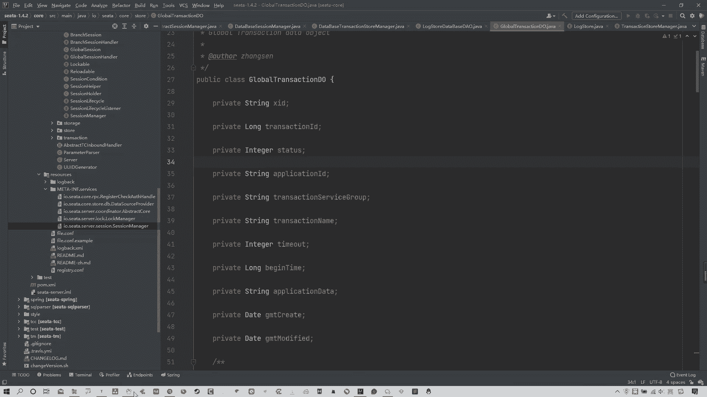

跟他是不是一样的，前四个是不是对上了？

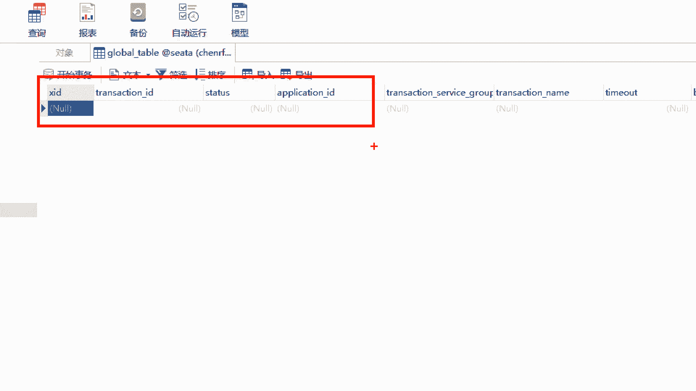

啊，包括后面什么service group，是不是也对上了什么对应的transal name是不是也对上了？😊。

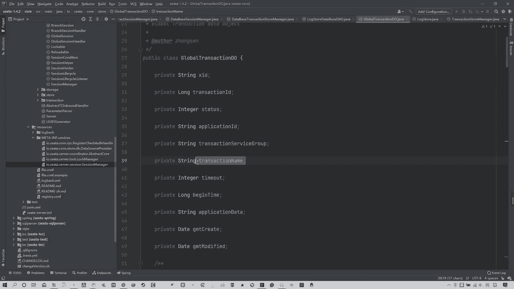

所以分析到这儿，各位明白咋回事了吧？啊，咱们看图来说啊。这个位置调用全局session实际上就是调用负极的un begin，然后走的是datbase session manager啊。

是我们那个DB模式的。然后进入到DB的储存模式的这个right写方法。第一次进来一定是向当前这个inser去写入数据，写的就是你这个global table表中的数据，也就是去记录一个当前的全局事务。

所以这就是我们这个位置。全局事务提交的时候干的事儿就是在你当前的这三张表中，哪三张表啊？刚才课户笔记中说过，这三张表中在全局事务表中去记录一条数据，证明当前有一个全局事务进来了。

这就是这个位置的交互相关内容啊。当然今天我们主要分析的就是这个global table这张表。

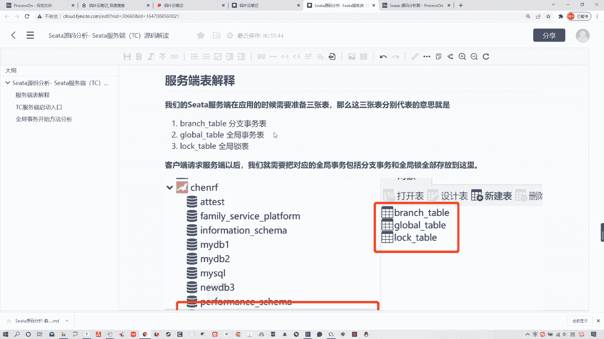

能理解了吗？各位OK那么讲到这儿的话，其实这个事儿我就基本说完了啊，整个流程我在这个笔记中都有记录，你们可以去按照这个笔记再过一遍，包括这个图也会给大家。😊。

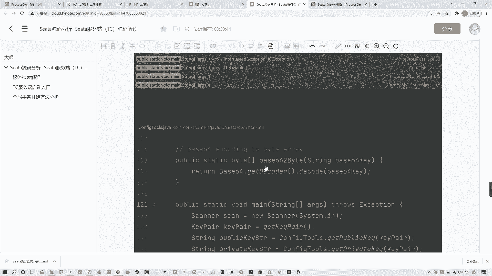

啊，它其实非常简单，就是服务端开启以后找这个默认的，然后去找这个dogle logo开启全局事务，然后对应的 begingin方法做了三件事，构建全局session。

为全局session添加添加一个监听。那么这个位置实际上找的就是一个叫做dabbase什么session manager这么一个呃数据库模式的一个manager，然后再来去调用全局session的时候。

它调用的方式，其实最终的最终干的事就是去向DB模式储存全局事务的那个表中去写入一条数据，证明当前有一个全局事务。当然你们要知道，就这个东西在最后写入完以后，为什么我们在这个表中看不到相关的内容。😊，啊。

就是我们这个数据库的表中为什么看不到相关内容？是因为他每一次执行完成之后，会把当前的这个表中所有内容清除掉，它也就是一个记录的事儿。好吧，各位啊，当然其他的这两张表道理其实差不多。啊，就是其他这两张表。

一个是。分支事务，一个全局锁，这两个其实差不太多，道理都一样。所以这我就不详细分析了。我们主要分析就是这个全局事务表，明白了，各位啊，这就是服务端交互这个时候啊，尤其是服务端交互这个位置，他所干的事儿。

就是全局事务全局事务提交以后，他干的事就这些。

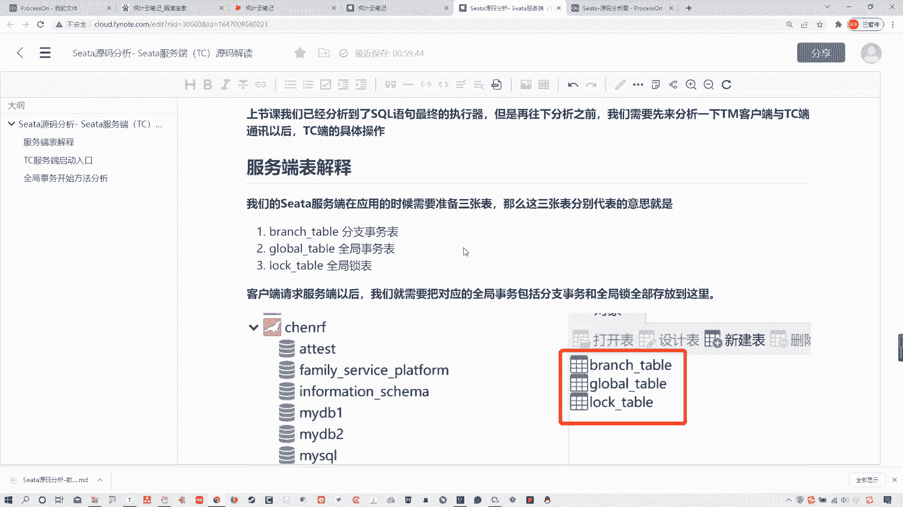

好吧，各位啊，OK那么这节课就分析到这里。