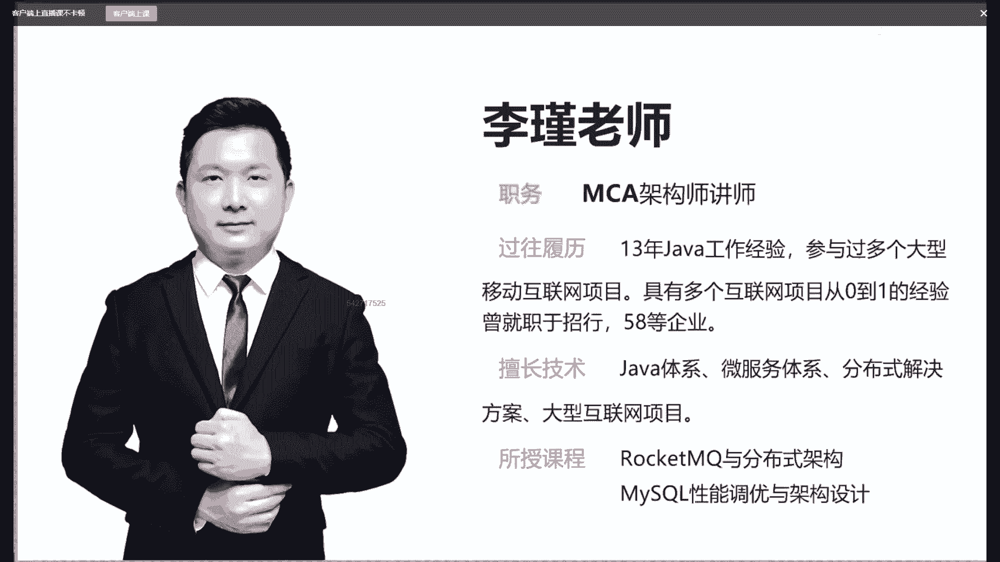
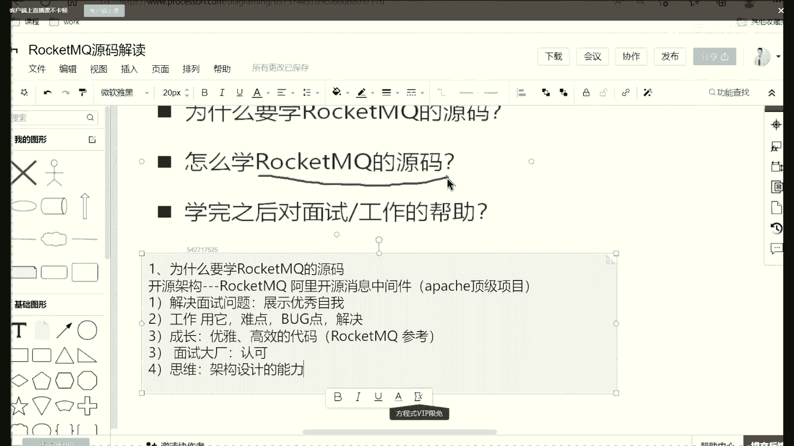

# 马士兵教育MCA架构师课程 - P121：为什么要学习RocketMQ源码？ - 马士兵学堂 - BV1RY4y1Q7DL

然后在正式上课之前的话呢，我们抛三个问题啊，就是对于roing的源码解读。第一个我们为什么要去学reing随源码，这是我们的第一个点啊，就是今天这节课的话，你可能会接住就是要听上两个多小时。

我们首先要知道啊我们为什么要去学req，这是非常重要的一点啊，然后第二点的话，该怎么去学呢，对不对？所以我们在课程当中，我们去解决怎么学源码的问题啊，然后学完之后的话。

比如说你要去面试或者你工作当中要进行运用。然后学完源码对你什么帮助啊。所以我们今天就围绕啊这三个点，然后把这三个点把它搞清楚的话，那么你这节课就没有白来。好。

那么首先我把这个东西copy到我的笔记里面来啊。😊，Okay。这节课的话我就围绕这三个点来进行讲解啊。第一个点，为什么要学re的源码？😡，OK有没有小伙伴能够跟老李一起互动一下？😊，啊，MCA是谁？😊。

MCA是我们的一个java体系架构啊。首先学源码啊，第一点大家要注意为什么面试官会问，对不对？有的同学说，我学源码的目的是为了干嘛？那是不是有可能面试的时候会问？😊，所以第一个问题啊就是。😊。

为什么要学roingQ的源码？啊。首先呢源码它分很多种啊，第一种的话呢就是这种开源架构，对不对？开源架构里面呢，像roken歌的源码的话，它是阿里开源的。好，阿里开源的一个消息中间键，对不对？😊。

然后这个消息中间。建的话呢请注意啊，他为什么今天老李李锦老师要去讲他了？一个主要的原因他是阿帕奇啊阿帕奇的一个顶级项目。也就这个项目的话呢，不是不单纯说阿里的内部认可，就是在编程行业啊。

或者是我们传说的这种程序员这个行业，你能够成为一个阿帕奇的顶级项目，那说明你这个项目对不对？你的代码，然后你的这个性能，然后你的这个拓展性，还有呢你这个代码比较逼格啊，肯定非常高的。

但是站在我们自身来说，对不对？我们要学的话，那无非就是第一个要去解决面试问题。😡，你去解决解决面试问题的话呢，大家知道我们经常所说的在面试过程当中，很多情况下面你要去展示自我。😡，啊。什么叫展示自我呢？

就是如果说像re的源码，你能跟跟面试官是吧，然后把自己的源码，然后讲出来，然后加以条理的说出来，说出其中的亮点，或者说出其中的一些核心关键点。那么这样的话呢可以展示自我啊。

并且这个自我的相对来说是比较优秀的自我。😡，优秀。😊，好，那么这是我们讲的第一个点啊，就是你面试的时候，大家注意了，你不能说我平时的这个项目里面对不对？然后就是一些简单的CRD。然后我可能就只会。😊。

用一些con API或者 API或者pen API等等之类的啊。那这样的话呢，你可能会比较的掉逼格啊。然后第二点就是不单纯是解决面试。你在工作当中对不对？你比如说用它啊。

这个时候那可能会在用它的过程当中会有一些比如说一些困难点，一些难点，或者是一些什么bug点。这个时候你可以去解决它。因为你如果读过recon源码啊，比如说你当中如果说使用它报错了。

或者要使用它去搭建集群，或者使用它进进行性的优化，你读过它的源码的话，那一定能够做到啊，不是简单的去百度。然后第三个点站在我们一个长远的角度来考虑。就是大家知道啊，一个程序员要成长。😊。

我们经常所说的啊，我们做技术要成长，这个成长是依据于什么？那依据于不是我写了多少的if else，不是我写了多少的业务逻辑，而是说我要去编写这种叫做优雅。😡，啊，优雅，还有呢。😡，高效的这个代码。

而这个代码的话呢，我们知道啊你平时写的这些，比如说你们公司用的这些框架，公司用的这些项目啊，里面呢可能涉及的点比较少。但如果我可以做一个像rockQ源码，然后呢做个参考。😊，啊。

那这个时候你的收益会非常非常大啊。所以呢学着更多的源码的话呢，我们可以去增长我们编写优雅优雅高效代码的一个经验。OK啊，另外的话呢也不用说了，如果说你要去面大厂。😊，就是说你要去面大厂的话。

那这个时候啊别人一一定会认可你啊，不是因为你去大厂面试的话呢，你说一下你们公司的项目，对不对？那你公司的项目肯定没有像阿里京东，还有像字节跳动，他们的这些项目相对来说啊你们的项目比较low逼。

你们项目当中运用。😡，这个技术应用啊它比较的低。所以的话呢我们可以得到一些大厂的认可啊。然后同时最后一点啊，其实是非常关键的。尤其是像像我们做java开发的这是我们要去锻炼一种思维。😊，什么思维呢？

就是我们去做一个东西，对不对？或者我们完成一个对应的需求。我们要提高这种叫做架构设计的能力。好，这是我们讲的啊，前面我给大家聊了一些，就是我们为什么要去学recon嘛。

所以呢给大家去分享一个一节这样的课啊，当然re源嘛，如果说要进行一个全盘读的话，比如说我们要去全部去读的话，那可能两个小时读不完。所以呢今天我把中间的一部分非常重要非常核心的点。然后我给大家提炼出来。

然后给大家进行一个讲解。😊。

