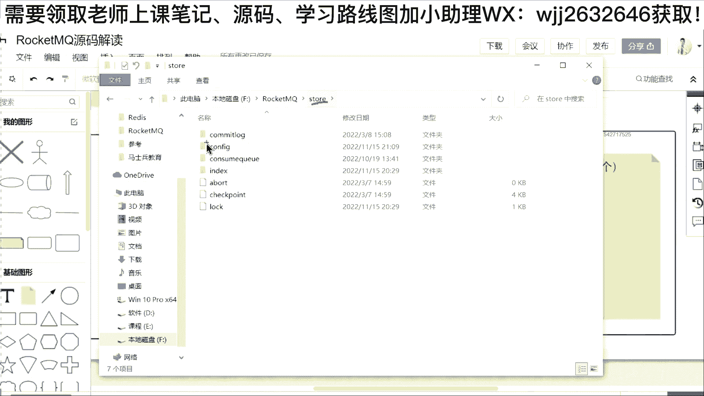

# 马士兵教育MCA架构师课程 - P124：RocketMQ源码之CompletableFuture的运用 - 马士兵学堂 - BV1RY4y1Q7DL

这就是最核心的部分，就是name server里面所有的数据都是存在这个地方，并且它都是存在哈西 map里面。😡，那么为什么存耗新卖？为什么不写磁盘呢？😡，对不对？

为什么不像做 keep一样的把它写到我们的磁盘里面？😡，所以你看到这段代码的时候，你要想到为什么在rock conq当中，我要单独去写一个name server。😡，啊，这么长的代码呀，为什么不分文件？

😡，哎，好控制啊，哥们，它叫做我们的manage这个类。就意味着我所有的存储，我就是放一个类里面。😡，好不好？我就用一个类管理不可以吗？😡，就是这个地方我管了所有的map的存储不好吗？😡，啊。

你管其他几个地方的话，我问你一个点。好，如果其他几个点要去加锁，要确保多多线程安全，你怎么办？😡，那是不是在每一个你的管理类里面，你都要去加锁，或者是采用一种一些同步方案，或者采用一些并发安全的方案。

但如果我写在一个类里面，是不是可以统一处理？😊，对不对？这是第一个点。第二个点的话，我好交互啊。😡，比如说有的东西的话，我可能要从另外的信息获取或者另外的信息判断。😊。

中间要去类似于一个完成一个业务查询，就是我提供的功能对外面提供的时候，心跳里面的信息不全。但是我要返回我的客户端，或者返回我的这一个生产者或者是消费者，告诉他这个心跳的一些详情。

那是不是还要结合他跟他进行查询。😊，对不对？如果说在同一个类里面它处理起来方便很多。好，其实这个地方最本质啊给大家说一下关键点是什么？你会发现。😊，name server就是服务的。注册与发现它的存储。

它都是基于哈西m。哈西 map是什么？是内存。啊，就是为什么说roq它快的一个原因，就是因为他对这些服务的路由和注册，它都没有放到磁盘，它都放到内存。所以这是它的第一个原因，比较快。你要抓它的亮点。

抓它的核心点。😊，啊，就是如果你使用的是做keeper，那么它是写文件。但如果这个地方你使用的是一个哈西 map，你写的是内存，那谁快？当然是内存快。😡，对不对？

这就好比说readdis快还是我们的mycyclq快，它是原因是一样的那当然是readdis快。所以为什么我们查询的时候，需要把数据从我们的mycyclq放到readdis呢？是不是很简单？😊。

就是因为内存很快。好，这是第一个。第二个问题来了。😡，大家可以看到回顾一下我这张图，在这张图当中，生产者也好，消费者也好，还有我们的bro也好，对不对？我们是不是可以启动多台，像生产者。

你也可以启动10台，消费者你也可以启动10台，然后他们需要去从我们的namemo server当中拿取信息。同时的话，大家发现没有。在我们bro的时候，我也可以向我的namemo server注册信息。

😊，另外的话呢，我还可以去改变我相关的信息。所以在我们n server这里面保存相关的哈西 map，你是不是会遇到一个问题叫做多线程安全。因为这些API提供出去之后，你可以看到。😡。

每一个方法里面他都没有加锁的。看到没有？每一个方法，无论是查询还是修改还是删除，还是创建，它都没有加锁。那。怎么确保的他的多线程安全？我给大家看了啊。

就是在我的最上面这个地方写了一个它确保多线程安全使用的是一把读写锁。😡，什么叫读写锁呢？其实它就是一对锁。😡，就是我们像GOC的编程里面有一个叫做reentread write knocker啊。

本质上面它属于nock接口。所以呢你把这个锁扭出来，然后通过这个锁，它可以控制下面的各个m在并发读写情况下面的安全。😊，啊，它适合于我们常说的读多写少的这种场景。为什么这个是读多写少？

因为这个name server它是服务的注册与发现。😡，那注册的信息可能在启动的时候，可能在你去增加一个主题的时候，对不对？可能在你发生这种节点之间变化的时候，他才会去进行写进行注册。而读的话。

我只要启动一个生产者，启动一个消费者。那么是不是我就要经常向这里面进行读。所以这个业务叫做读多写少。所以我们可以去搜一下这个n。😊，啊。在这个nock里面。😡，哎，看到没有？

你如果要去删除topic这个地方它就拿到一把解锁了，就是通过通过这个n点rightite lock这个接口，然后调它的n对应的impurity。这个东西就可以拿到一把解锁，就是拿这个解锁的时候。

它会针对我们的写操作。针对我们的读操作全会阻塞。😡，好，当然干完之后记得啊n。好，紧接着再来看。啊，你去拿的时候看到没有？叫做get our topic list，就是拿到所有的主题相关的列表。

这个地方是一把毒锁。😡，啊，这个读锁的话呢，基本上就是他除非遇到我们这把锁里面，对不对？它是一对锁嘛，一个是解锁，一个是读锁。这个读写锁就是一旦有解锁了，那么你就读不行了。但是如果是多个读的话。

它没有冲读，所以它可以确保我们发送时的一个高效。😊，所以这个地方我可以检索一下，很多地方用到了这个。看到没？包括这个地方只要发送，就是你的bro。如果说进行注册，就是你启动了我们刚才所说的。

先启动name server再启动bro。😊，那bro启动的时候，是不是他要调我们的这个regest broker这个地方用到解锁。因为你要去向我们lemon server写数据了，所以在这个地方。😊。

有哪一个系。没错，这个锁把它 copypy出来。😡，那在这个地方我再进行一个灵魂的拷问，好不好？我再拷问一下大家一个问题。为什么要采用读写锁？😡，就是大家知道为什么不采用。

就是在我们name server当中，其实。😊，还有一个数据结构啊，我给大家找一找嗯。😊，啊，有一个康坤的哈希迈普。😊，大家这个东西应该用的多。😊，嗯，conquestent哈西 map。

就是就是为什么不采用它哎。😡，怎么一点的话就卡死了。啊，这个地方比较卡。と。对。东。con困的哈希迈，对不对？我这里面提一个这样的问题啊。😊，就是为什么不采用它。😊，有没有同学有这样的一个疑问。

因为我们学并发编程的时候，你会发现，其实很多情况下面我可以不用锁啊，我解决哈西 mapap的线程安全问题，为什么不用康坤的哈希 mapap，而你要去定一个哈西 mapap普通的，然后外加一把读写锁呢？

😡，ok。😊，同学们。所以我们读原文的时候经常会遇到这些问题啊，我希望你在读原文的时候可以提出这样的质疑。😡，读多写少。如果你是说这样的，读多写少的话，康坤的哈西迈普也没问题，这不是本质的啊。😡。

你没有达到一个关键的点，就是你对康冠的哈西迈他的语言嘛，你也没有读过。😡，Yeah。你要知道，如果你使用读写锁，它可以确保并发的叫做什么一致性，就是读写锁，它可以确保我们的。叫做什么强移制性。😡。

但是如果采用的是康冠纳哈西迈。你要知道一个专业词叫做弱已知性。这是中间有差别的。就是如果你能够把一致性这个问题讲清楚，你才能讲到点。😡，它关键点就是针对这个业务场景，他必须要求的是强移致性的场景。

而不是弱移致性的场景。ok。就是你理解的这种什么康棍的哈希 mapap这些东西里面采用的CAS加什么lock机制啊，我可以告诉大家，其实像康棍的哈希 mapap里面。😊，他没有去实现我们所说的强义执性。

什么叫强义执性呢？就是我们再回回到前面的图。😊，这是我们bro，我们的bro，或者是说你往里面去创建的一些主题。比如说你的conproer或者conser，或者是你后台来了一个控制台，对不对？

你也可以去创建一个topic，或者是删除一个topic，或者是更改一个topic里面的Q相关的信息。好，当然你干了这件事情之后。😊，我们是不是要去改里面的这些哈新m？对不对？

所以这个地方我画出一个在我们nmmo server里面很多的哈希 mapap。😊，而如果说你使用的是con观难还是map就有一个问题了。往里面写的时候，我生产者和消费者是不是还会同时去拿？对不对？

这个地方con官的哈新ap没有保没有保证我们的强一致性，就是你写入的数据，只要写入成功了，你就可以立马拿到。😡，Yeah。就是你去发消息的时候，那别人会说，哎，我这个地方我要创建一个主题，创建完之后。

我立马去调我的生产者。你只要创建成功了，我就发消息，结果说失败了，结果拿不到。😡，是不是有这种可能性？结果从我们的la server里面就拿不到，它就不会去往对应的bro里面去。😡。

发虽然看起来他的并发会更高一点。😡，但是本质上面跟我们的业务长。景他不符合好不好？所以我们平时为什么去读一些源嘛，或者是读一些东东，你会发现哎康官的哈西 map它并不是说多线程在线程安全的场景当中。

一定百分之百用，要看场景。😡，就像这种场景的话，就用一个普通的ac心 map，然后使用这种锁机制，确保我们的一个强意制性。什么叫强意制性？只要写成功了，立马可以读到。😡，OK这个点能够get到的话。

可以给老李刷个6。😊，有没有问题？😊，这个点啊。就是你回答面试题的时候。😊，或者是跟面试官去读解读原嘛的时候啊，说你的这个感受的时候，一定要去说到关键点啊，不是说什么看冠的哈西 map里面的性能更高。

不是这些东西啊，它就是一个所谓的强一致性和弱意致性，强一致性就是。😊，在多线程并发啊。就是多呃并发场景当中啊。😊，场景中只要写了。只要写入了。立马可以读到，这叫强一执性啊。弱一致性的话呢就是说不能确保。

但是可以确保最终可以读到。😊，只要写了。就可以读到。然后这个写了。😊，不一定啊。不一定。可以读到。但是的话呢，他可以确保最终读到。可以确保最终就是最终我可以读到啊。OK这叫做弱移制性啊。

当然站在我们的这一个性能角度来说的话，弱移致性它肯定并发可会更高一点。但是这种场景的话，它必须要使用强硬制性啊，所以强硬制性只有使用锁。那锁的话为了去减少我们锁的一个性能的话。

这个地方就使用的是读写锁OK所以我们通过读源嘛的时候，我们抓它的亮点，好不好？😊，然后装完奈奶之后，紧接着我们再来去讲。就是在我们的刚才的这个过程当中，你会发现，其实这个消息啊，它经过produer。

然后发给我们的broker。而broker请注意一个点。😊，我们下面再来讲几个亮点啊。就是在消息进入到。我们的bro之后。对不对？作为我们的roQ，他最终要把这个消息保存到磁盘。就是卡夫卡也好。

还有像rockq也好，你给他发消息之后，最终他需要把这个消息保存到磁盘。那么关键点就是这个磁盘这个文件它该怎么去设计，这里面是一个非常关键的点。😊，Okay。

就是大家知道像mycycl里面最关键的就是它的文件系统的设计。😊，啊，不单纯是它的一些什么应用层啊，更多的时候涉及到它的一些存储文件的设计，这是mycycl它的一个优势，包括ES它也是。😊。

OK所以在这里面大家可以看到啊。😊，看过的哈心脉不是弱一之性。😊，Yeah。有没有问题啊？你你怎么去抵线？😡，ok。😊，因为它里面没有完全采用锁的机制，好不好？它们里面没有完全采用锁的机制。

它里面是CES机制。😡，对不对？然后里面加锁的话，它也不是全部加锁。😡，ok。😊，内存挂了怎么办？哎，这个问题提的很好啊，有位同学说这个内存挂了怎么办？😡，内存挂了的话，在ro compute里面。

它有配置文件。😡，啊，就是这个地方给大家说一下这个这个name server底下呢，它会有一些jason的配置。😊，就是他除了把这个信息保存到我们的这个哈希 mapap之外啊。

它还会一些jason的配置。然后另外一个点的话，name server它总是先启动的，就是它是一个服务的注册与发现。它的信息来源是什么？是我们bro启动。😊，所以一般来说在bro启动的时候。

就算你之前创建的主题，对不对？这个地方它也有对应的jason来保存我们相关的信息。只要它启动了之后，就要向我们的lemo server发送信信息。所以你要知道，服务的注册与发现中心。

首先它的数据必须要从我们的这一个什么。😊，这个brolock里面来，所以它放到内存里面是没问题的。所以这一块放到一个哈西 mapap里面是没啥问题的。😡，好不好？就是你服务启动的时候。

首先必须要那broer启动往我这里面进行注册，我这些数据才能来，对不对？😊，ok。😊，我自身本身就是一个专门来负责服务与注册与发现的。好，这是刚才一位同学提的点啊，现在紧接着我们要进入第二个点。😊。

就是第二个点给大家怎么去说呢？😊，OK我把一些东西关掉啊，太卡了。😊，太卡了啊。不知道是网络的问题，还是什么其他的问题啊，就是刚才消息进入book的时候，消息要保存到磁盘，这个地方会涉及到文件的设计。

😊，好，文件设计里面我给大家提示一个点，就如说conq。😊，哎，他的早期是完全抄袭卡不卡。Right。这是rockq它的第一个版本啊，就是把卡夫卡全部抄了。卡布卡使用的是scara语言编写。

而roQ使用的java语言编写，就是把它的代码把它复制过来，然后用java版本做了一个重写。所以在它的文件设计里面，它的早期版本。😊，是一样的。啊，但是runq里边呢，它进入它的3。0啊，就是。😊，3。

0的这个版本之后。然后他的文件进行了一个大改。这个大概给大家说一下啊，就是这里。😊，方需要要把一些知识进行普及。这个普及的话呢，我把这一个再调大一点啊，拖下面一点。好。就这个地方。

我把一个卡夫卡把它扭出来啊。卡不卡是怎么做的呢？卡不卡，就是比如你定义了一个主题，比如说叫做topic。😊，在它存储的时候，这个主题下面你对应的有多个队列。ok。这个地方叫做Q。比如说Q。好。😊。

这叫做Q1。Yeah。Q1嗯这个地方可能不好去画这个，用这个东西来画吧，会方便很多啊，然后把这个变大一点。😊，变长一点。然后在卡夫卡里面，它这个名字呢不叫Q1啊，本质上面叫做什么part第。

但是在我们理解里面可以把它理解成Q，比如说Q1、Q2、Q3、Q4、Q5、Q6、Q7、Q8等等之类的啊。😊，在它的一个主题下面，请注意。比如说我这个地方扭出4个Q。😊，这4个Q它都是一个单独的文件。啊。

就是你有一个主题，比如说你这个主题创建出来叫topic A或者是叫李锦的主题。那么在底下你划分出了4个Q的话，那么它就会有4个文件，这是卡夫卡的一个设计。😊，好，那么在roq的早期版本，它也是这么干的。

OK那问题来了，在它的新的版本里面。😊，或者是在他的3。0之后的版本里面，以及3。0的版本里面，他不这么玩了。😡，啊，我我告诉大家他怎么玩，就是他的文件存储里面是这么设计的。我不管你里面有多少个主题。

😡，在我的这一个rockQ里面。OK我不管你底下有多少个主题，我只有一个文件叫做community。😡，Yeah。log这个文件。并且一般来说只会。写一个。Okay。啊，就是这个文件的话。

一般情况下面它只有一个。所以你可以看到它们中间对于数据，然后进到我们磁盘里面，它的处理方式是完全不同的。ok。😊，啊，大家想一下，对比一下卡夫卡，对不对？就相当于。😊，你创建了一个主题。

那么底下有4个队列，那么它就有4个文件。而rock andq的话，我不管你创建100个主题还是1万个主题，它只会去写一个文件。这个文件称之为community log文件。这个文件在哪里呢？😡。

OK我给大家看一下。😊，打开我的磁盘啊，给大家看一看。😊，比如说打开我的。这个叫做roq的一个目录，然后底下有一个stone。这个stone的话呢就是我们ro的存储目录。

然后在这个存储目录里面有一个community log的文件夹。那么我刚。😡。

