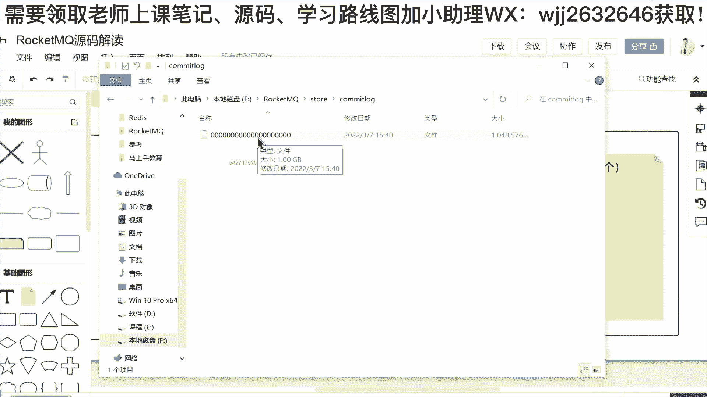
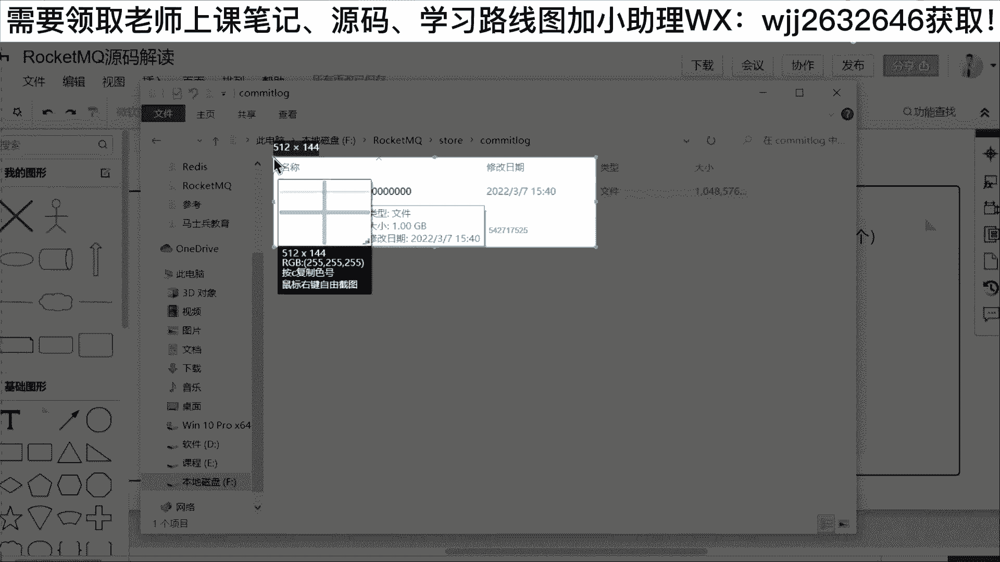
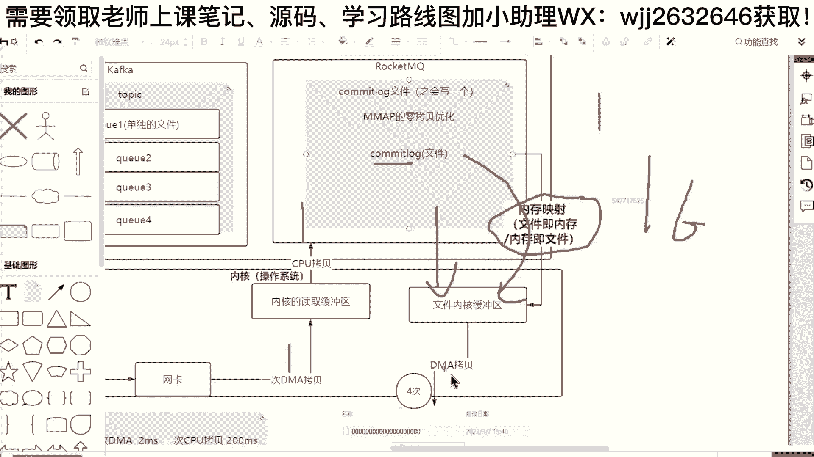

# 系列 6：P125：RocketMQ源码之零拷贝技术 - 马士兵学堂 - BV1RY4y1Q7DL

刚才所说的这个come log就是讲的这个文件夹里面的文件。然后这个底下。只有一个就是一个全零的文件，并且这个文件默认的大小是一个G。

OK好，把它复制出来。😊，然后对，放在这里。大家发现没有？😡，就是当我们rockq启动的时候，本质上面，哎，你去写消息的时候，为什么只写到一个文件？😡，啊，请注意，其实这是它设计的一个优化。

就是在卡夫卡里面，它有一个性能瓶颈。什么瓶颈呢？就是当你的这一个主题数量特别多。比如说你的主题达到了100，甚至达到了200，达到了300之后，大家发现没有？卡夫卡里面它不适合于创建非常多的主题。

为什么呢？因为你的文件数量非常非常的多，会降低我们生产的效率。😊，啊，这个就好比我们经常所说的，你要给别人传单代码。😡，专代码里面包含很多的文件夹，很多的文件。如果这个文件夹和文件数量超过100的话。

你把它传给李锦老师，你不打包，请注意意。效率很低。为什么？因为这个网络的开销，这个IO的通道，这个创建的话，它非常的频繁频繁，对不对？😡，啊，就算这个项目它只有几百兆如果你不打包啊。

里面包含了2000个目录，然后每个目录下面有几个类，所以它总共加起来可能有一两千个文件。这个时候你传给我，你不打包的话，我可能不断的在这里进行文件的读取，读取它读取它他他他他他他他它，然后就卡死了啊。

😡，但是如果你打成一个包呢。你给我发的时候，把这个项目打成一个压缩包，你再发给李静老师，是不是效率很高？所以reconq它为什么只会设计一个存储文件，它的原因是什么？😡。

就是它可以满足海量主题下面性能的稳定。而run你Q它应用场景是什么？是阿里的淘宝，还有它的天猫系统，还有像他的什么滴滴之类的，还有像他的一些其他的这种很多的系统。你像这种电商场景当中的淘宝。😡。

或者天猫，哎，他如果要对消息进行分类的话，那分类起码是成百上千，对不对？你比如说把衣服化成一个主题，那么衣服是不是有一个topic？😡，然后把手机化成一个主题，手机有个topic，把电器化成一个主题啊。

把我们的啊这种什么零时，把我们的一些什么啊叫做电脑，还有一些什么大街大家电小家电，还有等等之类的。所以像这种淘宝像这种京东，他们这种电商的话，主题动不动成百上千。而如果再采用卡夫卡这种存储架构的话。

会导致它的消息写入速度很慢。所以呢它就不管你三窍二十一，哪怕里面是100个主题，我都是按照顺序的方式写到这样的一个存储文件，这个存储文件默认情况下面，它就有一个G。😊，Okay。OK那具体怎么写？😊。

具体怎么写？这个地方还要有第二个问题就是。我们做了这个之后，是不是还有一个问题？还有他关心他的性能。大家知道，如果我们去写文件的话。这个地方它会有一个性能瓶颈，这个瓶颈的最核心或者是最关键的点是什么？

😊，ok。你进行IO这个地方它会有涉及到。拷贝问题。哎，这个地方为什么会涉及到拷贝问题？我问大家一个。这样的面试题啊面试题大家有没有听过零拷贝，听过的小伙伴可以刷个一，没有的话可以刷个2。Okay。一。

OK大家有没有听过零拷贝零拷贝这个技术？😊，好，我给大家分析一下，无论是卡夫卡也好，还是rock andQ也好，你一旦要把这个消息把它写到一个文件，或者写到多个文件，它肯定会涉及到IO中间的拷贝问题。

原因在哪里呢？因为本身作为roQ或者作为卡夫卡，它都属于我们中间更大的一个范围。这个范围我们把它称之为。😊，应用。😡，这叫做应用层。啊，这一点我不知道大家能不能理解啊。😊，叫应用层。

那与之对应的还会有一个什么？😡，它会有一个内核。所以我再往下面画。不。这个地方会有一个叫做内核，内核就是我们所说的操作系统，或者我们经常所说的cannel。好，那么我问问大家，在内核里面。

首先作为我们前面这个架构的话，大家发现。无论是生产者也好，还是我们的消费者也好，还是我们的bro也好，还是我们的lemo server也好。😊，啊，这些角色他都是单独部署的。😡，他都是。😡。

属于中间的一个应用啊，一般情况下面，我们的生产者，还有我们的消费者去发消息的话，他肯定不会跟我们的roq在一台机器上面，就是你的roq像它的broer，你把它部署在阿里云服务器上面。

那么我可能是在本地的电脑上面跑了一个produer。或者是我在另外的一台阿里云的服务器上面跑了一个proer。所以我向你去发消息的时候，本质上面就涉及到了网络通讯。😊，网络通讯底层一般来说，TCP。啊。

发消息给你对不对？然后发消息给你的时候，首先站在我们这台机器上面接收这一个消息的肯定是网卡。😊，对不对？比如说有一个消息发过来了，我们称之为叫做。😊，Ser。Message。好，有消息来了。

他他当然首先是进到我们的网卡，然后进到我们网卡的时候，大家可以看到OK。😊，进到网款就结束了吗？😡，网卡里面是不是要读取数据，所以在我们的操作系统内核里面，它还会有一个叫做。😊，内核的。啊。读取缓冲。

好。😊，就是我们所说的这种，你也可以称之为内核的独具缓冲。这个地方要把相关的数据拷贝过来。😊，好。大家可以看到，在这个地方涉及到了一次叫做DMA拷贝。就数据你如果说发送过来的话呢，首先从我们的网卡。

然后跑到我们的内核的读取缓冲区啊，这个地方它会涉及到一次DMA拷贝。然后紧接着数据再要跑到我们的runQ或者跑到我们的卡夫卡，这个地方又会要涉及到一次拷贝，这次拷贝给大家说一下，称之为CPU拷贝。😊。

好，这个地方大家发现没有？一次DMA拷贝，一次CPU拷贝，它才会把我们的数据从网卡送到了我们的roQ的应用，然后送到应用之后。😊，我们干嘛？我们接收它，我们要写文件。哎，那问题来了，这个文件。

我们不能说是应用层的啊。这个文件它要写的话是我们应用程序写段代码，然后获取这个come log。那一般来说它是个fire嘛。它是个文件嘛，那fire点read这个方法，大家知道哎。

你往里面拿到了相关的缓冲区的数据，对不对？这是通过网络来的。网络来了之后的话，这个数据最终是不是要去写写的话，你去调这个fire点read这个方法，或者往里面去写的话。

文件最终其实还是我们的内核来操作的。😊，啊，因为文件最终是交给什么文件系统的驱动来干。所以这个数据的话呢，还需要去经过一次拷贝。啊，这次搞拷贝的话呢，到就叫做什么文件。😊，内核的换出去好。

这个地方它又有一次CPU拷贝。嗯。好，做完这次之后的话。😊，OK它仅仅还只是我们的文件内核的一个拷贝，最终要调什么？要调文件驱动。😡，OK所以这个地方它其实到了文件里面，它还有一次拷贝。

这也是一次DEMA拷贝。就是我们常说啊，很多时候为什么我们不愿意跟文件进行交互？但是站在reQ的角角度来说，我必须要把数据写到文件。因为数据不写到文件，它就会发生丢失。😡，好，这个地方大家可以看到。

像我们就用这个原点表示数据啊，数据然后跑到了网卡。跑到网卡之后的话呢，经过第一次拷贝啊，我的拷贝数量加1。😊，好，然后呢考完这个之后到我们的内核的读取缓冲区，然后到了我们的这一个应用。

就是rockq又进行了第二次拷贝。好，就是数据来了，走了第二次拷贝，拷完之后，因为我的应用的话呢要去调用文件，对不对？我使用文件，然后给它写，所以又会把这个数据从我们的应用，然后传给我们的内核。

然后走了第三次拷贝，然后紧接着。😊，这个数据最重要写入的话，它是不是还要调我们的驱动，文件的驱动，调磁盘的驱动。不这个地方最终这个数据写入要经过4次拷贝。我给大家分析出来啊，以前我在做测试的时候。

这四次拷贝它的开销大概是什么样子？😊，就是当时我测试的时候用了200兆的数据。200兆的数据的话呢，大概。😊，把它做一次DEMA拷贝。啊，就是这200兆的数据。如果经过一次DMA拷贝。

它的耗时大概是2毫秒。很快的啊，但是如果经过了一次CPU拷贝。它的这个耗时大概是在200毫秒左右。啊。就是站在这一个性能角度里面，你会发现其实DMA拷贝是不可怕的，为什么呢？

因为DMA拷贝其实是操作系统站在硬件，它去进减少我们的这一个拷贝的时间。😊，进行了一个优化。但是一旦涉及到了CPU拷贝，它就没有办法优化了。因为这个地方它要涉及到CPU的调度。

所以它的耗时的话呢需要200毫秒。所以我们刚才这四次拷贝给大家算一下，我之前做了测测试的话呢，基本上如果你要去走4次拷贝。😊，大概他需要的这个时间就是404毫秒。啊，因为他有两次DMA也有两次CPU。

OK好，那现在站在这个点，如果是runckQ，对不对？他的开发者的话，他知道每一条消息我最重要写的文件，这个地方我就该采用零拷贝技术优化。😊，注意这个零拷贝技术优化的话，很多同学可能对零拷贝有个误区。

叫什么？零拷贝是不是等于。名次拷贝。答案是不是。啊，这个地方给大家说，零拷贝技术不是零次拷贝。为什么呢？哎，因为你的这个数据的话，它总是要经过内核啊，那操作系统大家知道操作系统是windows也好。

是linux也好，这操作系统它管的内存，然后操作系统上面是不是你还要安装驱动？😡，就是默认情况下面，很多的这种原生的操作系统，它是没有所谓的网卡驱动的，没有所谓的磁盘驱动的啊，一般来说都是给你自带了。

所以这个地方DMA拷贝它是百分之百去不掉的。😊，对所以零拷贝技术它的本质是什么？叫做减少没有必要的。😡，拷贝。大家看一下哪个地方没有必要，好像就是这两次CPU拷贝，没有必要。OK就是这CPU拷贝的话。

我是不是能减少一次。所以在rockQ里边呢，它针对这个叫做com log文件，它会做一个优化，叫做M map。😊，的零拷贝优化。哎，这个Mm给大家说一下啊。😊，本质上面我们经常所说的Mm的零拷贝。

它就是减少的这一次拷贝。这意思。就是减少的中间这一次。OK那看他怎么做的。😡，OK他的处理方式是怎么玩的呢？😊，首先在它文件启动的时候，就是roQ启动的时候，对不对？我知道了文件的目录。

然后知道了这个文件的目录之后，我可以通过一种调用方式，我给大家找圆码。😊，就是在rock andq里面，我们刚才讲到的这一个comity log这个文件大家可以看一下。😊，他有一个专门的类。

跟他同名的类叫做。come log啊，但是往这个com log底下找的时候，你会发现一点，好像这个地方它没有去写存储，它存储的地方是放哪里了？叫一做mify这个东东。好，在这个mify这个东东之后呢。

你可以看到这里面其实本质上面它使用的是m fire文件。😊，啊，就是它里面用到了一个叫做copy on write写实复制的容器容器啊，里面存的是m file。啊，这个怎么去理解啊？

可能很多些看代码的时候会有点晕。我告诉大家。😊，这个comy log。是它的一个叫做什么跟我们保存的文件是个同命类，就是涉及到你专门这个文件的存储。你可以把它比喻成我们经常所说的。啊，这个serv沃斯。

啊，业务层。对不对？然后到了具体的数据处理的时候，我们知道所有的东西他都是写文件。😊，所以他要拉文件的时候，你只要送一个文件名，对不对？比如说你的文件名是零还是一还是2，而是哪个目录下面的012。

你只要告诉我，那剩下是不是可以经过一个包装类叫做mify这个类。而在mify这个类里面，大大家可以看到它提供的构造方法。😡，啊，他有一些有餐的构造方法，所以这个无餐的可以不看。😊。

因为在我们的这个类里面，一般提供的有餐的构造方法，我们就看有餐的。😊，好，这个有餐里面一般送入两个参数，一个叫做faair name文件的名字，一个叫做f size，就是文件的大小。好。

那么我们看到它调它的init这个方法。你会发现就是当我们的一个文件，如果他要去构造的话，他要在我们ro启动的话，一定会去调我们的unitity这个方法。送一个文件，送这个文件的大小。

然后干嘛new出一个fill，因为这一个地方它可能代表的就是cover log这样的一个文件。所以呢他把这个文件扭出来。扭出来之后的话，大家可以看到，为了让它的读写效率更高。😊，他怎么办？

他不是说你拿的这个文件直接往里面进进行读进行写，而是要经过下面的一些骚操作啊。这个操作我们把它称之为Mm的零拷贝技术。也就是说拿到这个文件之后。干嘛？

然后扭出一个readdon access that一个高级类，然后点它的channel方法就可以拿到一个文件通道啊，这个chnel也是通道的意思。所以拿到一个fi china的文件通道。

然后再调这个文件通道里面的点m方法，就是这一段代码，我把它copy出来。😊，然后再放到老李的这张图当中。Okay。😊，啊，把上面提前好不？这图的话还可以往这边放这边放这边放。就是这段代码。

就是在我们rock andQ启动的时候，会干嘛会调这个文件点map方法。如果调了文件点map方法，那么在这个地方，比如说有一个community。😡，log这个文件啊这个fin。Yeah。啊，这个文件。

好，这个文件如果掉了这一个点m方法的话，那么它就可以中间做一个内存映射。啊，中间可以完成一个这样的活。😊，哎，这个地方。你这个地方。完成一个内存映射。好，把这个内存映射了，把它变大变粗。😊，Okay。

啊，完成一个内存映射。这个内存映射意味着什么？中间它就没有这个CPU拷贝了，就没有这个东西了。内存。😊，映射本质上面什么？😡，是两个意思，文件及内存。然后呢，内存即文件。及文件。8。这怎么去理解。

对不对？什么叫做文件及内存内存及文件。😡，大家可能有没有听过一个叫做分页文件的概念？😡，我打开我的电脑给大家展示一下啊。打开我的电脑，我的电脑啊里面有没有高级这个属性，看一下。嗯，高级的系统。设置啊。

好。我给大家展示出来。😊，什么叫做内存映射？就是我们的windows里面，它也有内存映射啊，它的名字叫做虚拟内存。😡，OK叫做虚拟内存。大家可以看到，在我们windows启动的时候啊，他也说了。

它有一块叫做分页文件。我们知道分页文件，它说了是磁盘上的一块区域。但是windows却可以当做RAM当做内存来使用。看到没有？就是当我们的操作系统启动的时候，本质上面像windows也好。

linux也好，很多系统也好，它都支持这样的一个映射技术，就是磁盘及文件啊，磁盘及内存内存及磁盘。😊，就是文件和内存的话，它可以通用。你只要把它进行了映射。这中间它的优势点在于哪里呢？

就是你去往这个地方的内存写的时候，然后他要去写到磁盘，它就会去减少我们刚才所说的中间的一次CPU拷贝，就这一个没有了。看到没有？之前这个地方它有一次CPU拷贝。😊，啊，只是在你启动的时候。

他需要加一个额外的操作。😊，那当然我们rock没有启动的时候，我知道里面就只有那么一个文件。那启动的时候是不是很快？😡，不对，把这个文件把它变成一个内存映射。比如说一个G，那我内存映射一个G。😡，啊。

如果说这个地方的数据不多，我映射512G也可以。那么把这个数据映射完之后的话，当我们收到相关的生产者发送消息的时候，他就只需要进行一次DMA1次CPU再加最后的一次DMA。😊。

对不对？相当于是说我们。