# 系列 6：P129：RocketMQ源码分析：消息发送者启动流程 - 马士兵学堂 - BV1RY4y1Q7DL

是也非常重要。因为这个启动流程以后有可能影响你经常去做一些生产上的配置。

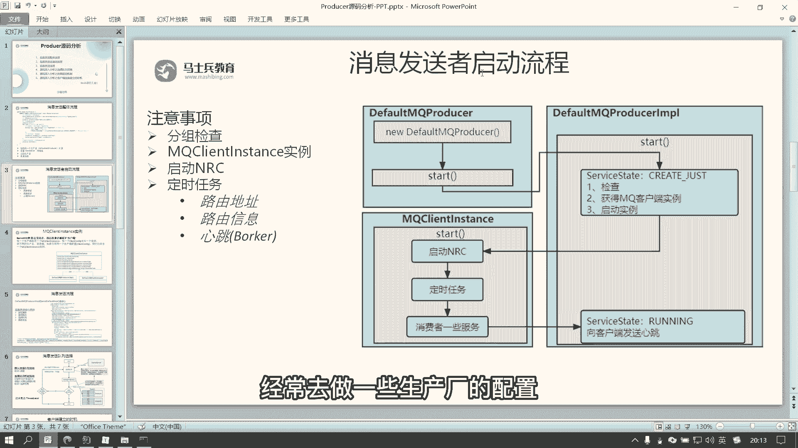

那么启动流程的话呢，大家应该要知道。那首先第一个把它拗出来。对不对？那你出这样的一个对象，扭出来之后，最核心的方法就是去调这一个star方法。那么通过我们的这一个star方法，我们点进去。注意了。

因为这个proer它会有几个分支啊，默认使用的是default mq producer底下一个trans mq producer了，是后面我会去讲的事物消息的发送者。

一般的消息是通过这个default mq producer。好，那么掉进去这个star掉进去这个star之后呢，你会发现啊其实这一个default m producer自己没有干。

它是交给了一个实现内叫做de mq producer implication的实现内掉了它的star。

所以作为pro它的启动核心其实是deult mq producer implication就是它的一个实现内点star。所以正如我画的这张流程图是吧？

就是刚开始是default mq producer调star。其实最重要的环节是进入了defa mqpro的implication的这个实内啊，然后在这个实现内里面，我们点进去。😊。

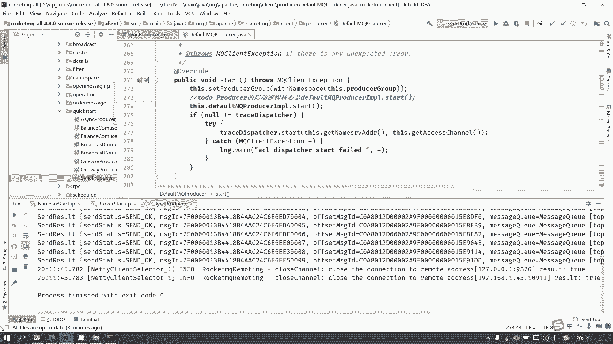

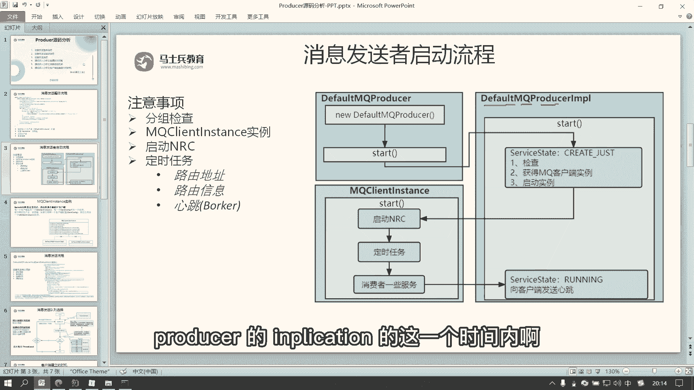

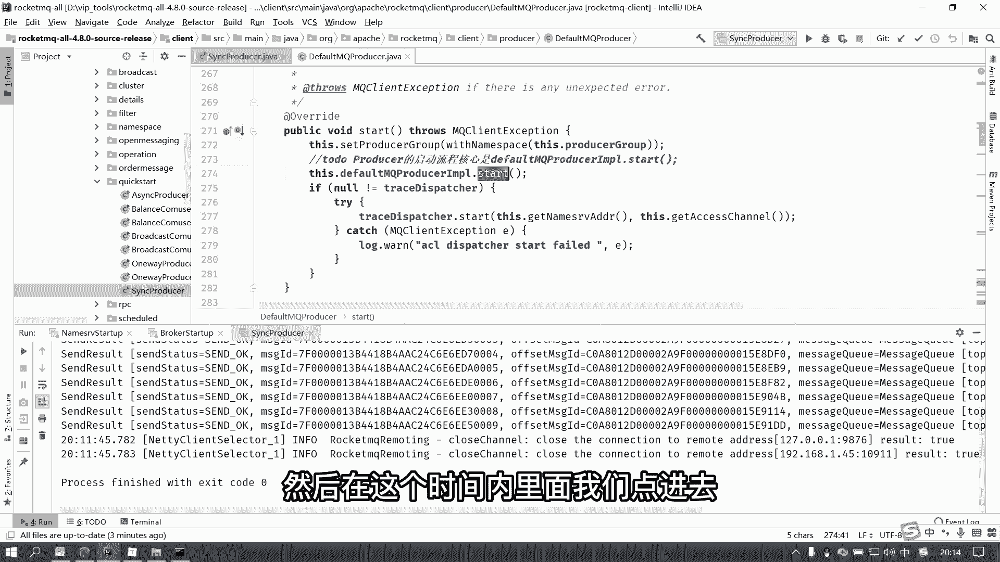

点进去之后。注意了啊，大家都可以拿到我的这一个代码，我的代码已经给同学们了，然后叫this点star。this star的话呢，你会发现我的注释或者是我的注释写的非常的详细啊。😊，但是这个地方要注意了。

就是这段代码当中。他有一个switch。就是你启动的时候啊，它其实规定了几种状态。这个switch里面呢，它判断一下这个service的，就是我们常说的我启动的这个客户端，它处于哪种状态。

比如说你是刚开始创建，我们的代码是刚拗出来，那它肯定进入的是第一个状态，对不对？就是这一个状态叫做great， just就是刚刚创建。所以呢它第一次一定是跑到这个流程。好，跑到这个流程之后呢。

当然你会发现啊，如果这个流程干完了，就是这个流程跑完了，最终这个状态就会变成一个running。😊，啊，也就是也就是说大家应该要知道，其实这个star方法它肯定会多次调用。😡，啊，调完一次不止对不对？

第一次的话跑我们的叫做great just。后第二次的话呢又power running，如果说遇到异常的话，什么s down啊什么都都可能，对不对？所以的话呢我们就进入第一个啊第一个里面的话。

大家可以看到，如果你要去创建一个生产者，他首先要去检查你的配置是不是符合要求。就是我们的生产者的组是不是满足要求，所以这个地方有一个叫做check confi去检查配置的方法，注意这个检查配置的方法呢。

当然啊你你可以发现首先校验为不为空。就是我们如果创建一个生产者，这个地方啊一定是要去送一个东西的，就是这一个group这个pro的这个生产者的分组一定要给他送东西，这是第一点。然后第二点的话呢。

他还不能跟系统的分组名冲突。因为就算你的q没有启动的话，你会发现。😊。

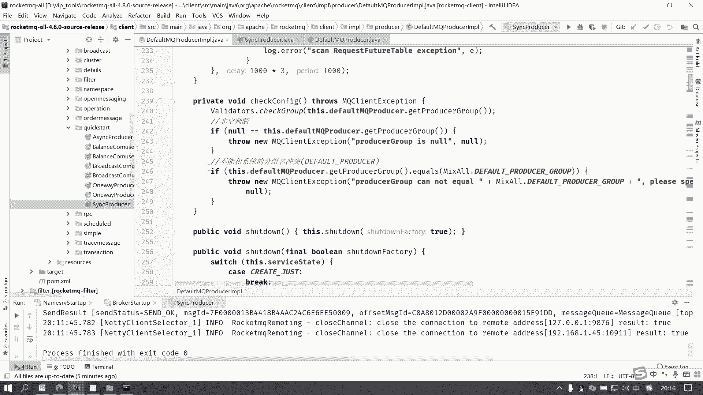

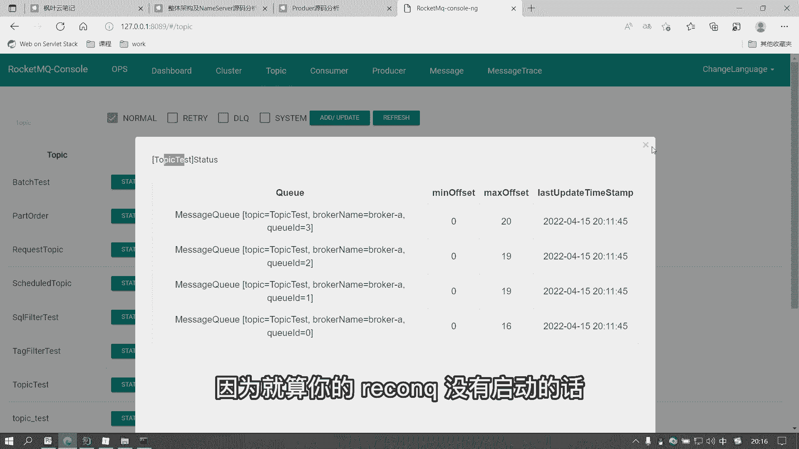

底下还有一些这个标识为系统的主题。

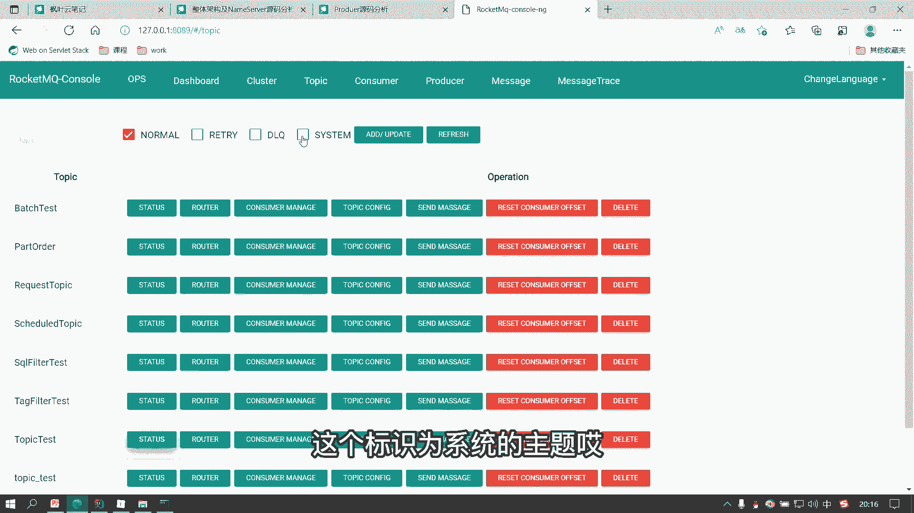

哎，你看到没有？这个上面我只要把这个normal插进去。这就是系统主题。啊，当然呢你会发现除了这个系统主题之外，它还有一些系统的什么proder。所以的话呢在我们这里面的话，如果你建立一个分组。

你也不能是一个叫做defaer producer。😊。

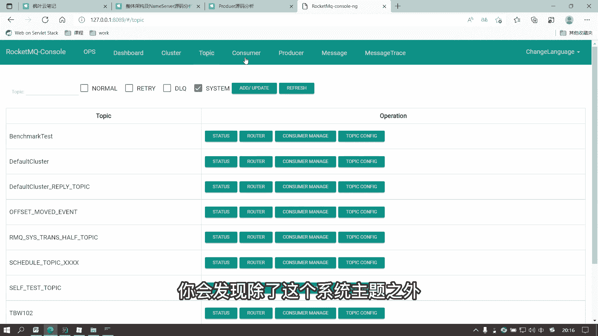

啊，如果说是一个depro的话呢，他也跟你说不行啊，所以不能跟我们系统的这个分组啊有冲突。所以我们就知道了啊，原来校验其实就是校校验这两个啊，然后再回来再回来之后，这一个环节就比较重要了。😊。

这一个环节为什么重要呢？就是很多同学啊就是搞不懂。我们创建的时候，为什么有一个叫做de MQ producer？为什么要有一个deult default MQ的consumer？

然后这两个东西它都属于clan端。对不对？他们其实有一定的联系，联系在哪里了？你可以看到就是。这个地方。这个地方可以说它是去改变我们的一个叫做instance的 name。啊，就是这个地方。

如果说你等于我们的客户端的这个proder的分组的话，他就会把它改改了啊。然后的话呢你可以看到底下最重要的这段代码是这一段。😊，这一段是干个什么事情呢？这一段其实就是获取一个实例。因为作为客户端也好。

作为服务端也好，你生产者或者是消费者，它本身应该来说站在系统的设计角度应该是个实例。所以他通过一个叫做MQ clman一个类，这是一个管理类，然后拿到它的intance。

拿到它之后再去调get or great mQ cl instance。那么就很明显，这个方法就是要去调我们的获取一个MQ客户端的实力的个方法。好，我们可以点进去啊。点进去之后，大家发现没有？

他其实入仓有几个，一个就是我们前面讲的这一个配置参数。对不对？这个配置参数大家可以看到啊，就是首先放在这里。然后第二个的话呢，还有一个钩子叫做RPC的一个hock。😊，钩子东西啊。

这个钩子呢跟GUM有关系啊。好，钩子的话就是说它能够去实现一个优雅的关闭，大家先了解就可以了。然后我们进入这个get or great mQ clean instance，你会发现在这个方法里面。

它就是需要去构建一个MQ clean instance。当然这里面呢使用了有一种叫做缓存的模式。😊，因为我们知道啊就是你在去创建这个生产者的时候，有可能你经常去跑，对不对？

我经常去new一个produer，你有一个produer，你一个proer，难道每一个proder他都要创建一个单独的实例吗？这里面我做一个问答，就是每次。我们去扭一个proer的时候。

又扭一个生产者的时候。都需要创建一个实力吗？啊，觉得需要的话呢，可以刷一啊。觉得不需要的话，可以刷2。就是大大家站在这个系统的角度，我们来思考一下。大家可以互动一下，我的课堂是这样的，我喜欢互动。

因为我觉得如果没有互动的课堂，没有灵魂啊。需要不需要需要讲一讲你需要的理由，不需要讲一讲你不需要的理由。好，这个问题其实。怎么说呢？嗯，我给他们挖了个坑啊。😊，这个问题就是像面试官一样的啊。

可能其实有时又需要，有时候不需要，当然条件是不同的。😊，OK我给他们挖了个坑啊，也不是单那问题。😊，大家可以看到，就是比如说我这个地方。我另外一个类里面再这么去写呢。比如说命名为一个pro。

那大家就觉得肯定不需要。对不对？肯定用同一个。但如果这个地方我改一个，那你又觉得肯定需要。啊，前提是什么？前提就是这个实力，他以什么条件去创建，这才是关键点。所以的话呢你会发现这里面它有一个依据啊。

就是如果我要创建这个实例的话，它跟一个条件有关，叫做客户端的ID calendar的ID。啊，就是它的主就跟我们插数据库一样的，这个ID就是主件。😡，如果说你主件是一个。

那我就可以把这个数据放到一个table表里面。所以与此同时，在这个管理端里面放了一个concorrd的哈西 map。这个哈西麦就是它的主件是cland ID。

然后呢它的value是我们MQ calendar的 instance我们的实力。当然，为什么使用看oon的哈西 mapap？因为这个地方它允许多线程，所以我要确保多线程安全啊，所以这一点就不用去多说了。

所以你会发现啊，它是通过这个东西来干的，首先去获取。如果没有的话呢，就 new一个。对不对？如果实力为空的话，我们就创建一个新的实例，并且加在我们的康过的哈希ap里面就行了。所以这段代码的话呢嗯很清晰。

也很简单。😊。

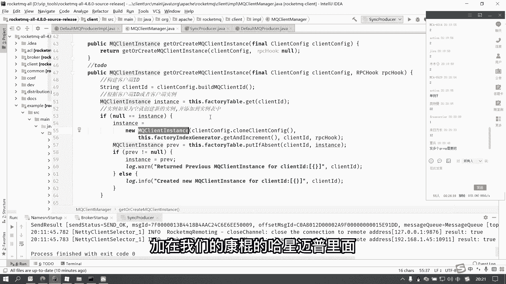

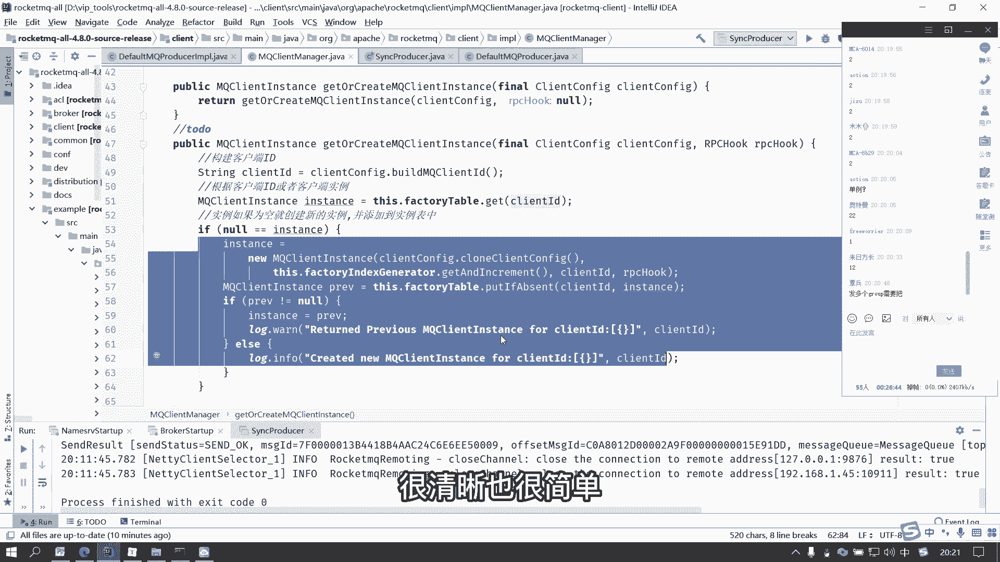

对不对？很清晰很简单。所以重要的话呢，这个地方就是相当于用到了一个哈 map的缓存嘛。就是以后你如果说在这个项目里面，你要频繁的去创建我们的客户端，然后你的客户端的ID是一样的话。

那这样的话我们就缓存就不需要重新创建了，这就可以节约我们的内存啊，同时也没有必要，对不对？然后这个客户端ID怎么创建的，要进这个叫做bu mq ID这个bu mq ID它跟几个因素有关系。

就是你这个ID的构成啊。😊，不是说你随便取的，而是说第一个跟我们客户端的IP有关系，看到没有？这个IP的话呢，他会去获取本地的一个地址。所以的话你就知道客户端里面第一个因素就是你启动的这个生成者。

它的IP地址属于1个ID的决定因素，但是不是单纯是他。第二个部分是什么呢？实例名称啊，叫做get instance的 name。实例的名称。当然这个实例的名称你会发现啊，除非说你自己去配了这个配置文件。

一般情况下面是default的。大家一般也不会去配这样的一个配置文件。所以大家就想到一个点，如果说你在roq的客户端想做一个，就是我有学生问我这样的问题，叫做多个生产者。多个生产者，多个实力对不对？

然后每一个启动的实例，他可能要去访问不同的rockq集群或者是rockq服务器。那你是不是就可以去通过这个配置参数改一下？啊，不然的话你定义成都是IP一样的，你自己跑的这一台服务器，当然IP是一样的。

你起一个proder是一样的，起第二个proder也是一样的那这两个实力其实是就是一个。所以如果说你想去通过一个客户端，然后去创建两个不同的proder。

这两个不同的proder去访问两个不同的服务器该怎么办？😊，对不对？那这个地方你就要去改嘛，你要去设嘛。你就要通过这些参数去设置。当然这个地方呢其实也很难去设置啊，因为它是拿着一个系统参数也很麻烦。

那那第三个还有什么呢？第三个的话有一个这个做unity name啊。😊，unit time name呢，其实这个更方便一点。呃，大家发现没有？就是unit time默认设置文档。所以的话呢。

它的这一个叫做cl ID的组成叫做IP加instance name加unity name啊，所以如果方便设置的话，就是为什么我在开始的时候有段这样的代码。啊，这个地方如果说你想客户端不一样的话。

最好的方式设置什么？设置unit name不就行了吗？这个是。啊，李景。对不对？然后有的同学说你要改一改，改成奥特曼都可以。😊，那那这样的话呢，他在客户端创建的时候，他就会是两个不同的实力了。啊。

两个不同的实力就意味着里面的参数你就可以随便配了。如果说你不通过这样的方式去修改的话，你就在同一台机器IP1样。然后呢，那个配置参数肯定是你怎么改都是一样的。第一个获取，第二个获取对不对？

那只有通过这个un name去进行修改。所以呢通过多元码，我们是不是就了解了这个点。😊，啊，这个点有没有问题，没有问题刷个一啊，这里面我再互动一下。😊，有问题的话呢，可以提出来。

因为开发当中极有可能有这样的情况。你经常去做一个生产者的时候，你可能在一个工程里面要去发两个不同的这样的roQ是有可能的，并且频次还不低。啊，只有这么少的人刷一吗？大家都在听课没有？嗯。

都在听课没有问题不大啊，我觉得太容易了啊。😊，好，问题不大，我们就接着继续啊。😊，好，接着继续了。嗯，那我们就回来。

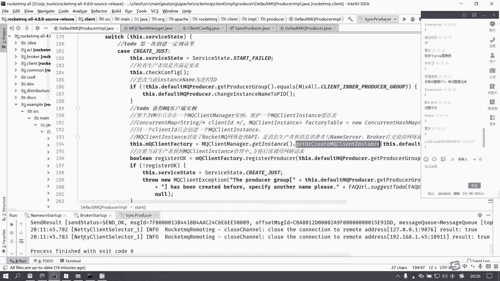

就是我们刚才进入了我们的读源码中间的一个部分，就是进入这个star方法，然后它的这一个状态叫做great just。然后进入了一个叫做获取MQ客户端的实力啊。好，这就是我们刚才所说的那容代码。

然后下一个步骤的话呢，其实就是要去注册了啊，因为很多情况下面，我们把这个实力拿来之后的话，我们还要去调一个注册啊，所以这个地方叫有一个叫做MQ factory注册进去啊。当然这个注册进去的话呢。

其实也就是往一个专门的con map里面去存放。

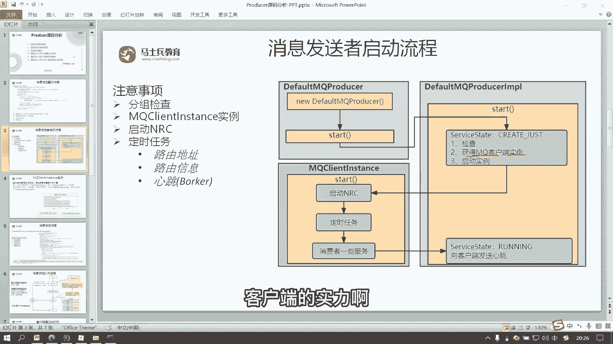

就是作为re good的客户端的话，它当然应该有缓存啊。前面我们讲到了嘛，你要有produer的一个缓存啊，我既然创建了生产者，我当然有生产者的缓存，所以的话呢这里面有生产者的缓存，有消费者的缓存。

还有一些拓展客户端的一些缓存表。😊，ok。好。那这个东西就不用讲了，对不对？然后注册成功以后会怎么样，注册不成功以后就给他抛一个异常啊。然后与此同时的话呢。

嗯这个地方就会去拿到一个我们常说的我们的这么个默认的生产者。😊，他是不是要去有一个啊比如说自动创建的一个主题，对不对啊，然后拿到一个我们的啊就是消息发布的一些东西。好，那么这个东西就可以不怎么去讲。

反正是一个往里面进行put啊，最后的话呢，最终看到没有？里面有一个叫做stard factory。这个start factory呢，一般来说在第一次掉的时候。它是等于Q。啊，就是我们第一次调用的时候。

调用star的时候，它肯定是为te。就是这一个客户端。如果说它没有调过star，那它肯定是te，肯定是te的话呢，就会去进到我们的MQ clean factory点star。那么上面我写了一行注释。

就是最终呢还是会调用一个叫做MQ clean instance，对不对？所以这里面点进去，就到了这一个类叫做MQ clean instance，就是我们具体去执行。😊，生产者的一个实力类了。

OK所以你就知道了啊，他为什么要这么去写，为什么要搞这么麻烦呢？为什么都不放到叫做de mQ producer呢？😊，对不对？OK这里面的话呢就需要给他们用一张图来给他们稍微的说一下。😊。

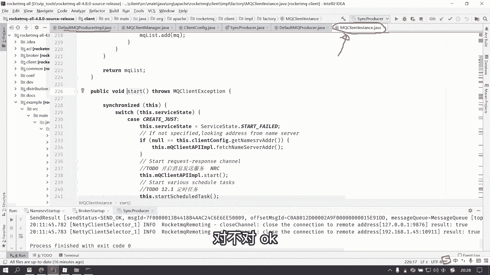

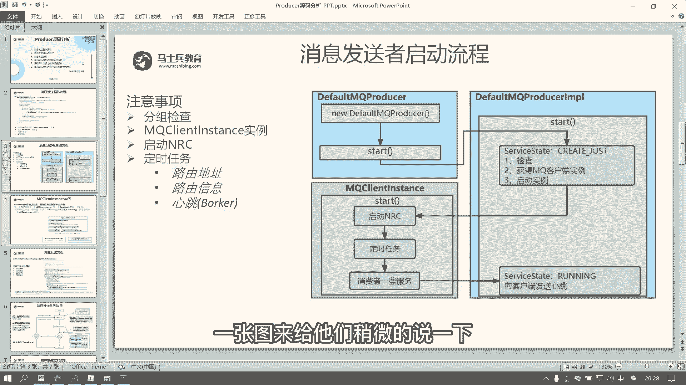

就是嗯稍微解释一下啊，在rockQ当中，消息的发送和消息的消费它都属于客户端。所以呢它有一个顶层的类叫做MQ clean instance。好，每一个客户端。

它当然就是一个MQ clean instance。然后呢，每一个c的config对应一个实例，就是我们刚才讲到的那三个因素。所以故所以呢不同的生产者或者消费者，如果说你配置上面写的是一一样的。😊。

那他就会共享1个MQ calendar instance。

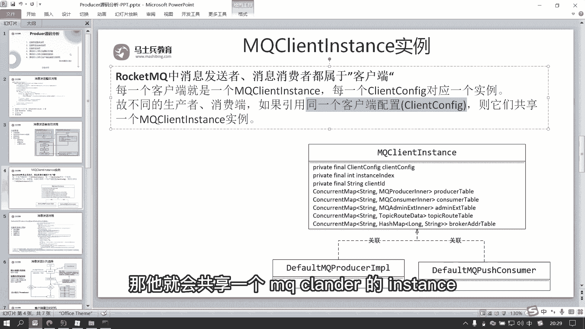

所以有时候就会发生这样的问题啊。如果说大家去嗯就是有时候你要去重视你进行消息生产的时候的这个group。对不对？这是第一个。然后第二个的话呢，你要去重视你启动的时候，对不对？

是同1个IP或者同一个其他的东西。所以这里面呢大家应该知道，从底下它会衍生出defa MQ producer application，关联出我们的deult MQ pushush consumer。

一个是生产者，一个是消费者。😊。

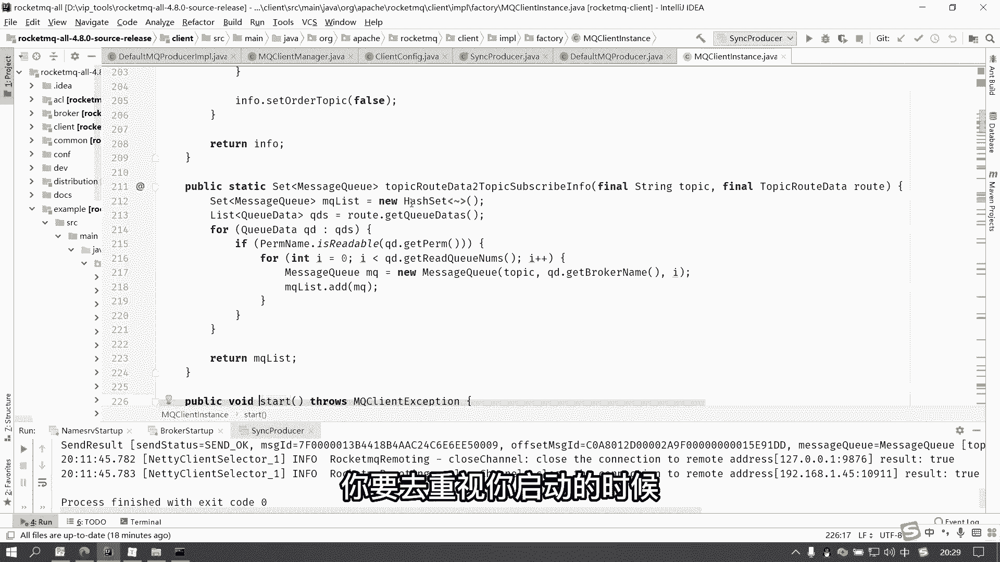

啊，然后呢他们啊都是通过这样的一个配置文配置类叫做cl confi。去区分的。如果你们的配置类是一样的那你就会共享这一个实例。生产者和消费者是一个实力吗？当然不是大家都想得出来啊。😊。

肯定不是一个实例啊。他是一个客户端，就是一个实力嘛。

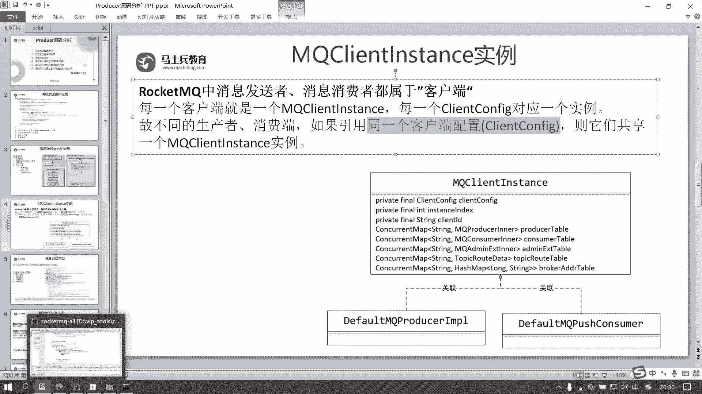

因为你扭出来的东西，最终啊你你这个M科 calendar的话是一个实例。然后你调用的时候，我们再回到这个。😊，回到这里。你是不是不是还是一个MQ producer的bro好。当然这个实例里面它会放嗯。

怎么说呢？这个实例你来看啊，你要仔细看你就会发现啊。😊。

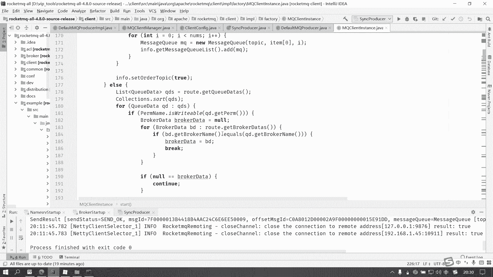

他其实里面会放一个proer的 table，放consumer的 table。我们放一些相关的信息。如果你配置相同就是一个啊，这个就不用解释了啊。好，我们再回到刚才的这一个发送者启动的流程。

在这个发送者启动流程之后，拿到这个实例之后，它就会进入MQ clean instance里面的star方法。😊。

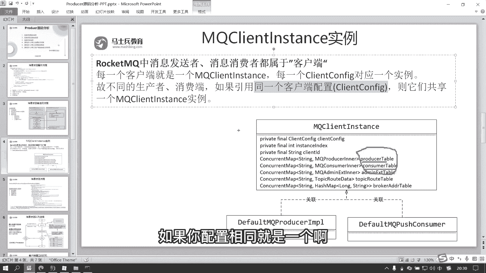

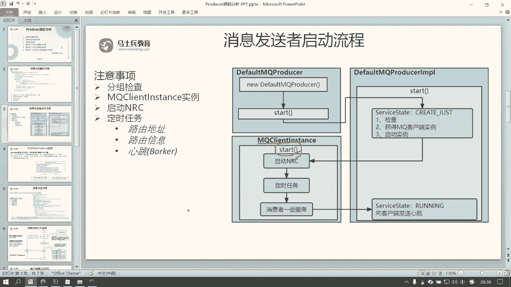

好，进入这个star方法。大家。再看啊。哎，我们回到。这个时线内，然后从这里掉进的这个star方法。在这个star方法里面呢，它依然会去判断我们service的状态。比如说第一次你是刚创建啊。

还有呢可能是比如说启动失败了，所以这个地方呢无非就是你是在刚创建还是启动失败。如果是其他的话，它就不用管。好，那么在这一个switch里面呢，大家可以看到。

首先第一个嗯它就是拿到我们cland的一些配置，对不对？判断它得不等于空啊，如果说不等于空怎么办呢？或者是如果等于空怎么办呢？等于空的话。

就从重新在 server去拿一次就是itch server address就刷新一次嘛。如果说我们的这个name server没有拿到，我们就通过这对应的类刷一下，看看能不能缓存里面拿到。

或者网络通讯里面拿到。好，另外的话呢因为你是客户端，最终你要去进行消息的发送，所以我们就需要去启动一个叫做NRC这称之为na remote calendar端，所以这个star方法呢，很明显。

它最终呢就是去把这个叫做的 remoteote calendar端啊，就是remote calendar端把它进行启动。😊，好，那启动完之后，它还要开启定时任务。这个定时任务用来干嘛？

定时任务我们再来点进去。定时任务里面呢，当然他有很多定时任务。啊，比如说我们每隔2分钟，我们就要获取一次路由的地址。就是我们的一些IP呀，对不对？所以这是一个定时任务。然后第二个的话呢，我们每隔30秒。

我们就要需要去修改对应的路由信息。因为有可能这里面的对应的主题呀，对应的路由对不对？比如说对应我们的这一台name server，这台name server底下了它的主题信息修改了，所以怎么办呢？

每隔30秒要进行一次更新。😊，好，那除了这个之外，在我们第一节课里面讲过了，无论是客户端还是leme还是broer，他们都要与name server进行心跳，对不对？那除了这一个客户端客户呃。

客户端主要是跟哪个心跳呢？是跟我们的bro进行心跳。所以这一个定时任务是每隔30秒也要跟我们的这一个bro进行心跳啊，这都是使用的sex底下呢这个配置就是它们的一个间隔时间。啊。

这个就是对应的间隔时间啊，这个东西的话啊，这个除了这个地方是写死之外。下面的都是有配置的。也是可以通过配置参数配置文件去改的。所以为什么这里是30，为什么这里也是30？因为它默认都是30乘1000。

也就是30乘1000毫秒。因为对应的单位的是mining seconds。

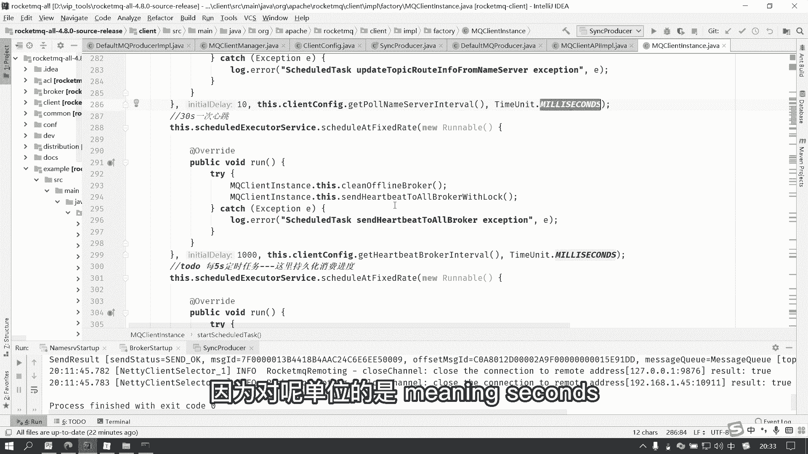

好，那么还有包括这种持久化消消费的一个进度啊。其实这里面后面讲到这个消费者的时候，其实这里有用。现在讲的生产者的话呢，你可以认为这个地方对我来说没啥用。

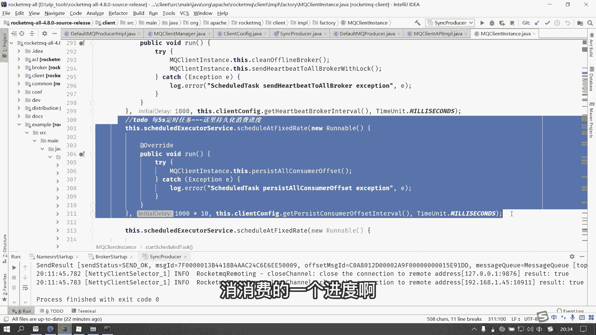

然后还有包括一些我们去啊就是动态去啊就是降一些下线程池啊这种东西的话，我们就不需要去过多讲了啊，所以。

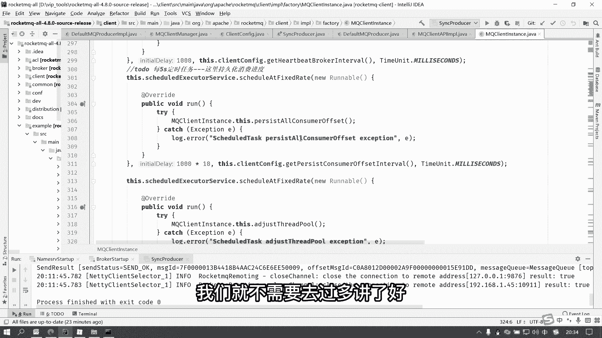

回到我们最主这个流程，就是这些定时任务啊，它主要是一些路由地址、路由信息，还有心跳。OK还有心跳。

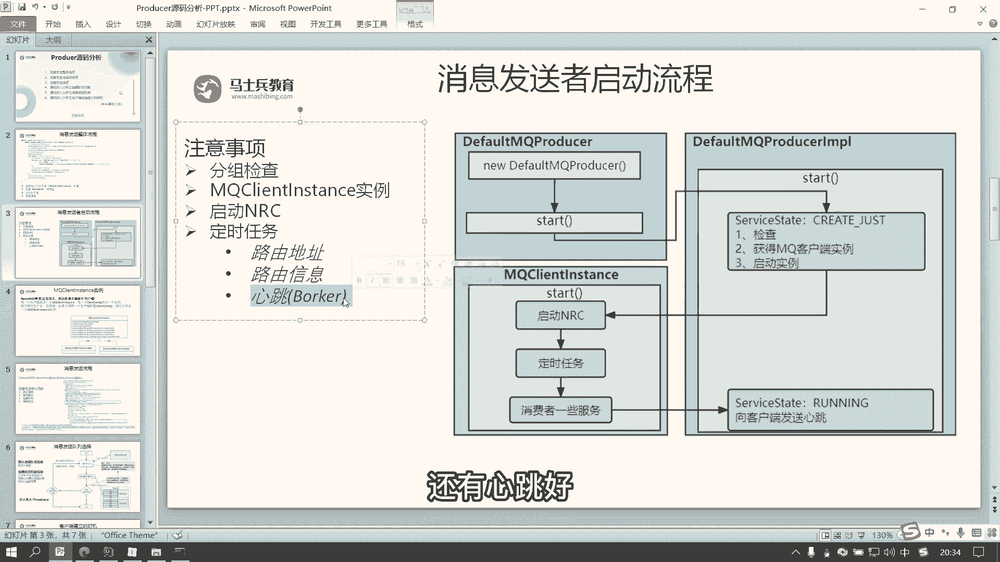

好，那做完这个之后。我们定时任务就开启了。😊，然后开启完之后的话呢，它还会开启一些我们消费者的一些拉取消息的服务，还有负载均衡的这些服务啊，这些东西的话呢，你都可以先不看。

后续的话我们会给他们进行一个详细的讲解。好好？然后最后它又去调了一次star方法，看到没有？这个star方法。

相当于是又回到了我们刚才的这一个叫做什么de mQ producerimplication又回到了这个类，就是把这些东西干完之后，又回到这个类，回到这个类呢又去调了一次star方法。

在这个star方法里面，我们就知道它的这一个状态肯定不是great just。😊。

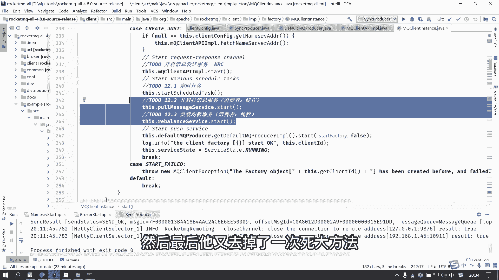

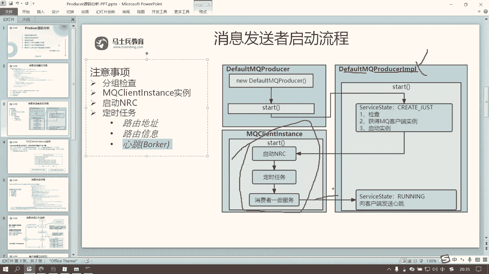

因为只要把前面的这个东西干完，对不对？他的状态就是running了。啊，所以这个地方呢你可以看到嗯前面把它干完，是不是？那这些状状态就没有了。没有之后，那个switch的话就会把它跳出来。😊。

跳出来之后的话呢，你也可以看到他最终还要去及时发一次心跳啊，就是我们之前讲的。

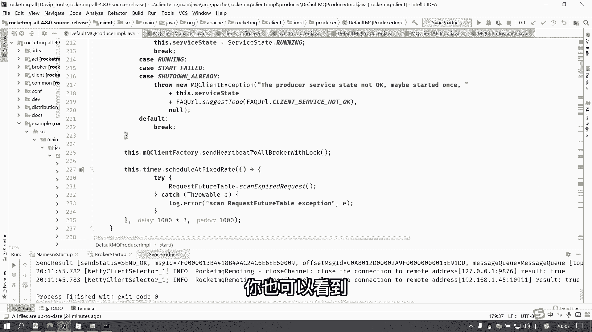

这里面的这些定时任务啊，是起的定时任务发心跳，就是每隔30秒发一次心跳。但是你客户端启动的时候，你把这些东西启动完之后，是不是立刻要向我们的broer发心跳所以呢在最后的这一个跑完之后。

这里面也直接会去send headbitat to all broker with knock意思就是说我们向所有的bro进行心跳的发送。啊，当然这里面具体的这些通讯的细节我就不去讲了啊。

因为这些东西的话，其实在就是在我们第一节课里面我们也讲的很清楚了。😊。

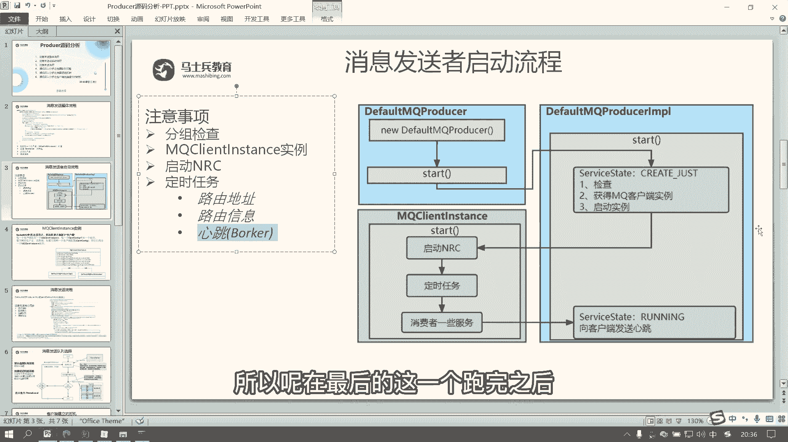

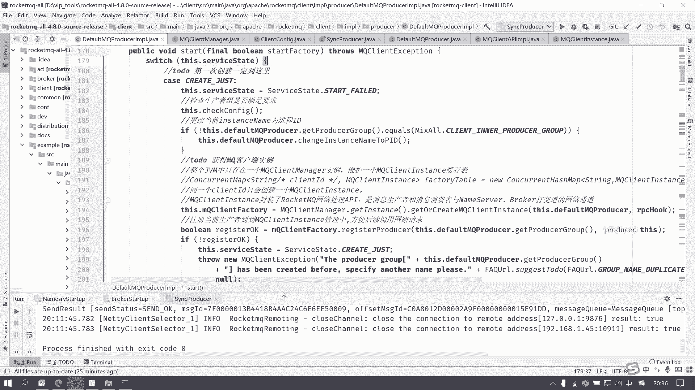

好，所以这个地方呢，我们就把消息发送的启动流程给他们讲清楚了啊。

