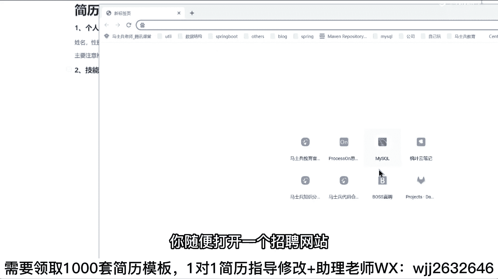
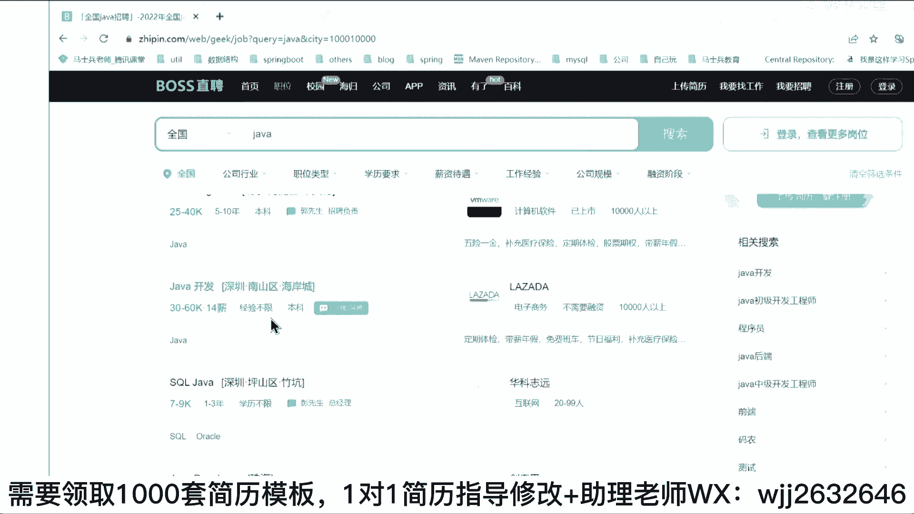
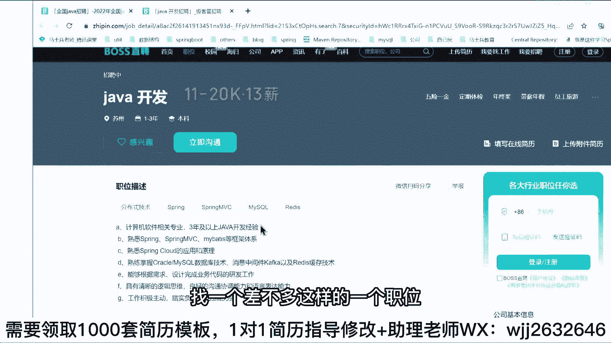
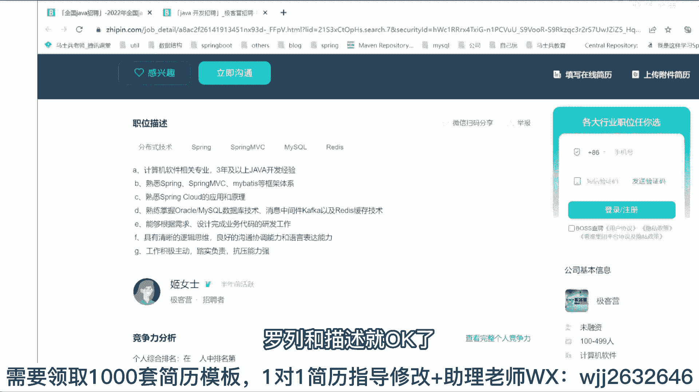
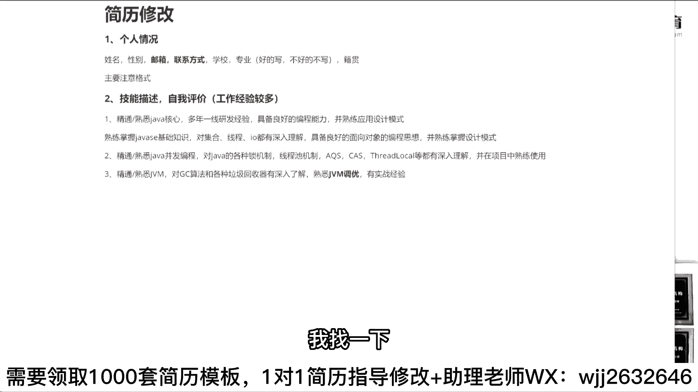
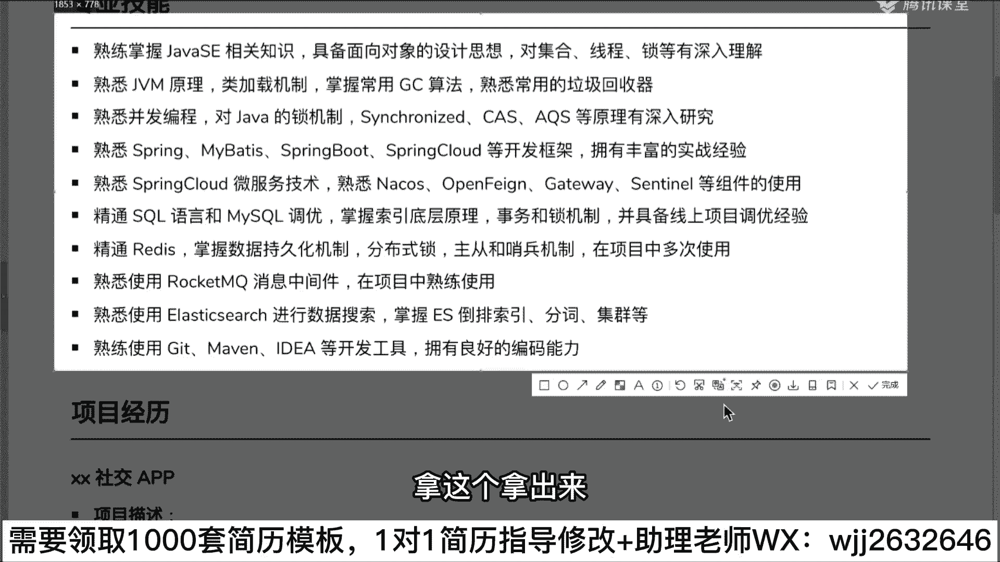
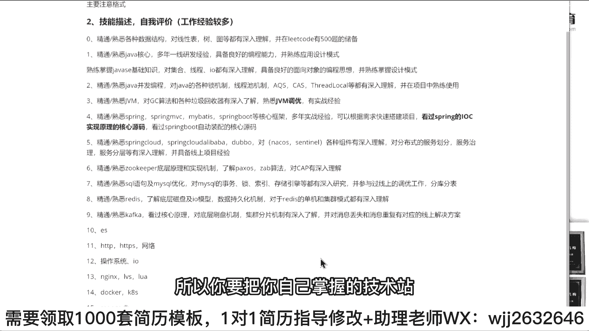
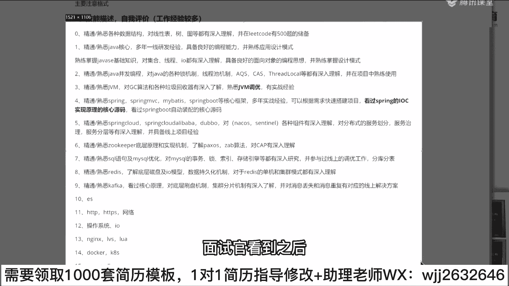
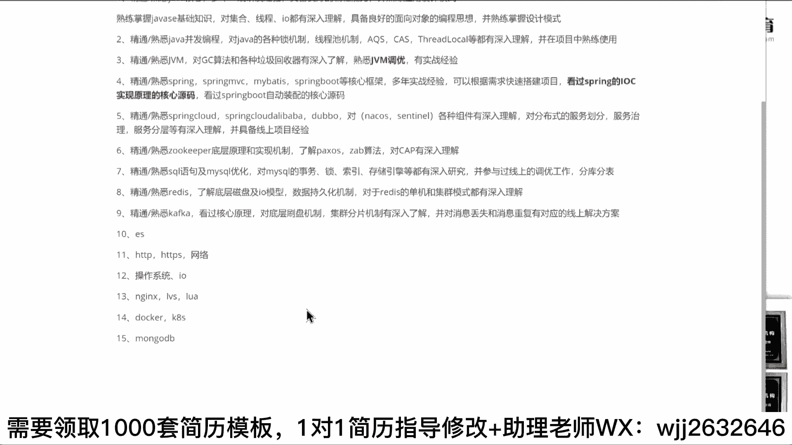

# 系列 6：P132：技能描述、自我评价该怎么写？ - 马士兵学堂 - BV1RY4y1Q7DL

来第二个，当你的个人情况完了之后，这块有选择性的写两个东西，要不然这块先写什么，先写你的自我评价。要不然就写你的专业技的技能描述。这2块你分条件来写。对，这块，如果是工作经验比较多的。

较多呢你就先写自我评价，工作经验少的就先写技能描述，先写技能描述，听白了吗？好吧，那技能描述这块应该怎么去写呢？非常简单。我还这句话，同学们技术这块啊，每个人在面试之前基本上都会做技能的准备工作。

但是很多同学在做技能描述准备工作的时候，可能做的不是那么完善。所以呢在技能这块你也没办法预估说面试官他可能会为什么，会可能会问什么，所以你要尽可能去多展示你个人的技术优势。

同时要把你掌握的这种技术细节和技术亮点，你必须要把它给凸显出来。如果你的技术细节和你的技术亮点表现不出来的话，就很麻烦。有人会说老师我为我刚问了问题，我问大家为什么要写那一些什么idea这样的东西。

很多同学会觉得说老师，因为我没东西可以写。作为一个普通的java开发程序员，你不可能不知道你要学什么东西，你不可能不知道说现在企业里面需要什么技术。如果你真的不知道怎么办，也非常简单。

你随便打开一个招聘网站，你在里面随便搜一个java开发工程师，对吧？里面有一堆的这种职位上面的要求，一111到2。😊。

lawyer。

你找一个差不多这样的一个职位，看看它里面要求的技术是哪些，把这些要求的技术都单独拿出来做一个罗列和描述就OK了。罗列和描述就OK了。好吧，那这块应该怎么去写呢？非常简单，比如说第一个要写什么东西啊？

大家注意了，写技能的时候是有顺序要求的。什么叫顺序要求。很多同学在写技能的时候，他不注意情况，我想到什么地方，我就写什么地方。其实不是这样，你正常情况下写技能的时候，应该按照你学习的方式。

或者按照你学java的顺序来写？比如说刚开始你在接触java的时候，你先写什么？不是先写javaSE吗？对吧？那这样应该怎么写？对于已经有工作经验的同学呃，对于已经有工作经验的同学怎么写？😡。

你怎么写这东西？第一个写上。京东大家有朋友会问，老师，我到底写京东还是写熟悉。我说一下京东和熟悉，你自己随便看着办，它就是一个描述词。如果你敢写京东，你就写京东，不管你进题写写熟悉。

但是简历里面千万不要出现了解，听明白了吗？😡，你的简历里面千万不要出现了解什么技术，千万不要这样写。因为了解在我看来，几乎等同学不会投简历的时候，每个人是一定有没有人说老师我的简历也没有水分的没有吧。

基本上所有人在投简历的时候，简历里面百分之百是有水分的。所以如果你有水分的简历都写的是了解。那实际情况在我看来，你的了解等同学不会，所以不要写这个东西，啊，最起码你要写个熟悉熟练掌握，类似于这样的描述。

好，如果有把握，你就写精通但是我之前每次一说写精通的时候同学就会怼我老师我写精通被笨的很惨怎么办？你先有面试机会，再说混同学都会怼的很惨，你连面试记录都没有，你就想着会不会怼得很惨，有点过分了。😡。

好吧，所以先不要想这个东西，那这玩意怎么写啊？表彰S我要怎么写这东西。😊，你可以这样写吗？好吧，京东熟悉。ja案核心好吧，多年一线研发。经验具备。量好的。编程。能力。并熟练。应用。设计模式。

可以这么写吗？这是已经有工作经验的同学，你可以这么写。有说老师，我没有研发经验怎么办？😡，我没有研发店怎么办？😡，这样写吧？熟练掌握javaSE基础知识。对。集合。县城爱O都有深入理解，具备。

良好的面相。对象的编程思想并熟练。掌握设计模式。能这么写吗？😡，这不都是废话吗？可以这么写，应届生。😡，生宝贝儿们能这么写吗？😡，你怎么会没东西可以写了？你掌握的技能这么多，不就可以这么写吗？

把你会的东西尽可能多的去罗列清楚。😡，哎，咋没反应啊，应验生能不能那么写？😡，可以吧？这些服都不会啥不会。😊，ピ？你不会，你要学呢，你说老师我连设计模式都不会，那怎么办？你不学怎么办？😡，你得学呀。😡。

你老师，我现在号论都写不出来，我要投这的简历了，你不扯了吗？😡，你肯定是要有最基础的技技术储备的啊。你不能说老师我一点技术储备都没有，你让我去写，我写不了。😡，我写不了。好吧，设计模式是单列一行。

如果你设计模式想单列一行的话，你就要准备好面试官考你设计模式的能力了。比如说你项目里面用过哪些设计模式，有哪些应用需求，你要这样写。😡，听白了吗？第一句话就是个废话，好吧，其实没啥用，就这块意写东西啊。

想让他问问啥，问问rease的原码啦，哈y map的原码了，问问这点东西。😊，好，让他问这个东西的OK。😊，然后紧跟呢，你的账号SE学完之后还要学啥？😊，他是什么东西？框架不要这样，还有一个很重要的。

在ja在javaSE里面包含了很多东西。比如JVM和并发编程这样的东西你需要单独写的JVM和并发编程的技术，你是必须要好好去学的。比如说变化编程怎么写？好吧，还是这句话，精通。😊，或者熟悉。啥玩意儿？

java。并发编程对吧？对java的各种锁机制。现城池机制AQS。等都有深入理解。如果有工作经验的同学好吧，可以写什么并在项目中。熟练使用。如果没有工作经验同学，后面这句话就不要有了。好吧。

那这个同学有人说老师，我我对于这个所机制现成制机制AKS不了解怎么办？不了解，能不能写什么CAS你会吗？😊，所logo你会吗？这会吗？哇，GMS你会吗？😡，你挑选你会的东西吗？你挑选你会的东西。

你往上写嘛，这块东西是什么？是你自己的对于自己技术细节的一个把控。😡，没听过不行。就这块凸显是什么？是对于你自己的技术细节上面的把控，你要给面试官有这样的感受和感知。就是说我最起码说我具备这样的能力。

这东西是你必须要去凸显的。如果这块东西你凸显不出来，那么就很麻烦，懂我意思吗？😡，你看你们问的这个问题，AQS是啥？来，你讲到这个东西，我要给你讲讲，你这逼着我给你讲东西。😊，只知道拍照看。😊。

我告诉你啊，如果你对于并方编程没有基础认知的话，并方编程里面包含什么样的技术点，就这些技术细节啊，你是要有所知道的。😡，你得逼着我给你上大纲，完上看啊，我给你看V下面装上什么东西。

比如说操作系统并发支持内存模型阻塞队列线程池并发集合CAS和原子操作，sloc gUCGH disrupt像这些东西你要选择其中的一些点往里边进行添加。你要老师我这个东西我一点都不会。

或者说这些东西老师我都没听过，那就不要写了。😊，但是我坦白说一句话，同学们一定记住了，像这些东西，它就是在兵发编程里面，你必须要掌握的东西。比如说你说老师我不懂很很多别的东西，你可以写什么？

你懂不懂偏向素。可重入锁像这样东西能不能写一下？比如说你对锁升级是不是理解？明白吗？对，我了太养都能写。😡，懂意思吧？synchize mono这些东西能不能写？就是你要去凸显你所掌握的技术细节上的点。

你不用说老师，我技术细节不懂，我这个东西一点都不清楚，我咋写，那你肯定写不了吧。😡，就是把你现在会的已经掌握的技能能尽可能多的陈述给面试官看，懂我意思吗？李老师，我这都不会我，你不会，我还能说啥？😡。

这你不管他说啥，你既然想做张娃的工作，那就意味着你一定是有最基础的技术储备的。那么对于面试过程中要掌握的这些必备的简单的核心技能，你要有一个最基础的认知和了解。你说你这些东都不了解，我怎么办？😡。

对不对？大罗金线来了都救不了你好不好？😡，来，第3个，这是我们讲我们说的平方变程要想用的东西。除了平方变成之外，还有什么K边M吧，这MM怎么写啊？😊，怎么写？还有我要我要复制一下。京东熟悉什么？

JVM是吧，对JC。算法和各种垃圾回收器。有深入。了解，然后呢，熟悉。这边我调有。有实战。经验。对不对？我问一下这块写完之后有什么意义啊？干什么作用啊？作用在于什么？同学们记住了。

作用在于我要引导面试官去问我这C的算法和垃圾回收器。同时我已经埋上肥伏笔了。基本上在这块我写到JVM调优的时候，我就要求面试官必须要问我GVM调优点，我没实战经验，我能不能提前做准备。

你不能说老师我要面试了，我啥都不准备，能不能准备几个案例？😡，写吧，写了一个写了一写了一问一个死。这就是你们大部分人的认识认知，就是写了一问一个死。这就是区别，这就是为什么别人去面试的时候。

简历投出去之后有回应，而你投出去简历之后没回应。因为你觉得这东西我不敢写，我问了之后，一问你写了之后一问一个死，所以我不敢写，你不写，不代表别人不写啊，同学们。😡，就举个例子，你没写别人写了。

你告诉我你有什么优势。😡，别人凭什么让你去面试？包括之前有个同学给我单独发过一句话，我给你看看啊，就是他这这他的认知，就这东西啊我也不想去扭转大家认知。但是我希望能改变一下大家的想法。

这之前一个同学我讲简历课的时候，下课之后单独发给我的，发了一段很长这样的描述。他说听完我就讲简历课时，他给了这样的描述。他说可能我们投的不是同样的面同样的面试，不是一样找工作。我的经验给的建议就是没错。

简历确实可以随便写，但是绝对不是按照这里说的这么轻松的。你。😊，你80分可以写100分，然后你会遭受挫折，但是不是那么容易补的。说实话，尤其是大厂人家面试的人几个问题就能问到你几斤几两。

面知识面怎么样多多深。没错，比如今天你问了四后台友，你可以说临时报会的准备，下次再问，你以为回答上来了。实际情况是面试官会再问下一个问题。为什么要这样又又积极了。其实这种简历的写法，所谓写的水平高一点。

其实就是需要那么多能力才能经得住面试的考验，要摸到应届生申请太容易了。这大家大部分的认知，我觉得有很多同学也是支持这样的观点的，但是我想说的是什么？同学们，你在面试之前，你不能抱着一个心态。

说我面试一家，我就成一家。😊，这有问题的，你面试的时候，你报的心态应该是什么样子的？😡，什么样子？我不管这家面试，我能不能过，但最起码我要先把这个机会要先拿到手，明白吗？当你的机会都没有拿到手的时候。

你就在想面试的时候，如果面试官难为我怎么办？如果面试官羞辱我怎么办？如果面试我面试官鄙视我怎么办？如果你在面试间，你就这样现在去写，那很简单。那大家写的这些东西。

就是你们刚刚我给你们展示的简历描述里面的东西。那就是正常的技术官也好，HR也好，我看到这样的描述，我就不会让你来面试。😡，这就是行情，这不是我决定的，这就是市场决定就就这样的。就像你们刚刚写的一些东西。

两份东西拿到一块，你自己做做一个对比。你们来说哪个会会要哪个不要哪个。😡，很简单一东西，我们还是拿刚刚那个举例举来给大家举例子吧。😡，我找一下。

有一个。拿这个拿出来。

这东西多少钱？三年工作经验。还有没三年的，我看看。哎，不是这个。然，这也是三年的。这三0斤啊，这个是果果的。同学们你们自己来评判，如果两份简历，两份简历的技能描述都是这样的。然后你看到简历之后。

这两份简历，你告诉我你会要哪个。😡，你会要哪个，你你来告诉我，他们俩同时同一同家岗位。你看到这简历之后，你会让谁让谁来面试？😡，我觉得大家大部分人都会让上面人来面试吧。大部分都会这样的。那有人会说。

老师，我写的这个CAS写这个AQS之后，他不让他面试中妈妈崩垮怎么办？😊，问垮了，你是不是也有面试机会了，你写成这样，他没面试机会怎么办？你告诉我。😡，小孩才都选择两个都来面。

你问问HR是不是会让所有头简历人都来面试？😡，别的企业不会浪费这个时间的。😡，所以我希望大家先把这种错误认知啊能给能改掉，能改掉。你不要尊重老师我不敢写，我就就就就怎么样了，你活该没面试机会。😡。

对呀成光说的很好嘛，垮了就垮了呗，没啥损失。继续下一下。这次面试的时候，你做好总结，做好录音，做好复盘，对不对？下次再面到同样问题的时候，我保证自己不出错，这不就是一个成长的过程吗？😡，是不这意思？

好吧，所以要掌握这些东西。OK。好来，下面写完了。第4个。😊，核心东西写完了，还要写什么？该写框架了吧，是在框架快框架怎么写啊？😊，一样的精通熟悉。Spring。spring MVC买 bags对吧？

spring boatat。等。核心。框架多年。实战经验可以。根据需求快速。搭建。像目看过。框架的。核心编码。可以这么写吗？好，同学们可以这么写吗？可以吧，这里面重点是啥？😡，这玩意吧。阅读过原码吗？

没实战间把它删掉行不行？😡，没时在就能把它删掉。😡，能能行吗？阿生。你不敢写，你适量去斟酌嘛，你适量去做筛减嘛，是不是道理？😡，好吧。去的。只看我一个块钱部分页码可以写吗？那你就写看过spring。😡。

到。IOC实现原理的资行源码，或者看过。thringbo自动。装配的核心源码。行不行？能那么写吗？你给他提示。😡，让他去问你这些东西挖坑嘛。😡，别人问别的东西，来，你给我讲一下循环依赖的实间过程。

不好意思面试主播，这块我还没看到啊，我暂时就看了这两个东西。😡，可不可以？最起码说你简历里面凸显你具备这方面的能力嘛，最起码说我看过对不对？你别上来之后，我连看都没看过，对不对？是不是道理？😡。

这个描述方式你可以多换嘛，你想怎么换怎么换嘛，对不对？😡，来，听到线在能听懂的朋学给我扣一能听懂吗？😊，能听懂吗？这张能写的方式吧。😡，好吧，来第五个这些什么？😊，框架写完了之后。

同学们写微服务和分布式。刚刚有人说老师为什么不写算不写那数据库，数据库啊跟中间件这些东西啊放到一起好，他们统一其实应该算是中间件范畴的好，所以把它统一放到一起，那会儿写微服务怎么写？😊，京东熟悉什么。

Sring卡好的。sring cloud阿里巴巴。这你自己写好吧，然后呢。对，各种。组建有深入理解。对分布式的。什么服务划分。服务治理。服务分层。等有深入理解并。预备。线上。项目和线上。项目经验。

可以这么写吗？对你可以把大大bo加上。如果你实在想凑字数，就把组件这儿分别罗列出来。什么nco斯。对吧什么seno。对吧这些东西你把昨片写上来吧，挨个写嘛。😊，是不可以这么写？好吧，第六个还有啥？

这时候你可以写写写朋友们卢可会吧，那能写吗？😊，京东书记。有K方。一层院里。我实现机制是吧，了解。他是不是。人B。算法对。C要深入。理解对吧？包括里面要写的什么选举机制。对不对？你可以写嘛？

都可以详细写啊。玩这句话，你会哪些技术细节，你就写哪些技术细节，你不会哪些技术，你就不写哪些技术细节，好不好？OK来第七个还有啥。😊，书这边写完了，mycyclcle，你的熟悉。😊，Mycyclcle。

我这样这样写吧，京东书机ciqcle语言及。mycyclcle优化对mycyclcle的事务所。所以。存储引擎等都有深入。研究并参与过。线上的调优。工作。可以这么写吗？对吧这里面你可以加什么？

有人老师我对分工分表。😡，还有了解可以，你可以加吗？对不对？你想怎么写怎么写嘛，尽可能过去描述你的技能吗。对不对？再比如说re least是。京东。书记readies好吧，了解底层。你说。磁盘及磁盘。

姐，哎呦。模型数据19。挂鸡翅。对吧对于。reads的单机和集群模式都有。深入理解。听这不清吗？对不对？第9个。还有啥可以写的？什么ra这块，什么储存复制啊这类东西都可以写。好吧，你自己去编好现卡不卡。

😊，卡不卡。要什么看过。核心原码对底层。刷盘。机制集群。分片机制。有深入。了解。对吧病。对，是。消息。不丢失盒消息。消息丢失。和消息。重复。有对应的线上。解决方案。听东写吗？能懂我意思吧？

我现在已经写9个点了吗？😡，后面还可以写写写别的吗？同学们。有文老师，我人节变声，我算法数据结构怎么写？如果你想写算法和数据结构的话，马上写。😡，算2数9怎么写？嗯。熟悉监通熟悉。各种。

数据结构对线性表。树图等。都有。深入理解，并在离后的。挺。500提。到。储备。可以这写吗？能懂我意思吗？下面你还可以写什么东西，可写东西太多了。同学们，比如说刚才提到TES怎不写？

对吧你可以把刚才ATDB。HTDPS网络。能不能写一下？对吧对于你的。操作系统。哎呦。能不能写一下？N，这个是。LVS。你们写一下，包括这块可以写。撸啊。明白吗？对吧是在老写多ker。K8S。怎不写。

还能解答。还的理解吗？那我地边能写吗？对不对？你们既然说老师我没有什么技术可以写的这可写的技术太多了。可以就太多了，听白了吗？所以你要把你自己掌握的技术站尽可能多的去展示给面试官。就这样的东西。

写完之后，面试官看到之后，他的感受是什么样子的？能懂我意思吗？就是为什么我希望大家能听完这节课，你能得到一个反思是什么？就为什么你投完简历之后，面试官不让你去面试。😡。

懂那个意思吗？就为什么别人不让别人不让你去面试？😡，这我希望你了解的。😡，啊，当然啊这些技术在进行描述的时候，你要有对应的技术储备。你不要说老师，你说这东西啊，我都不会，我怎么办？你不会。

你只能学技术了。😡，明白吗？你不会，你只能学学学学技术了。你不能说老师，我现在啥机会都不会，你能不能告诉我一种写法，让我有面试机会。😡，如果你自己真的啥也不会，你就也这么写，面试的时候怎么被被虐。

面试等的都有备剧。行吧？调整好这个心态哦，就我就我刚刚说这句话，可能一定记住为什么别人有面试机会，你没有我希望大家能找准差距。不管你面试啊能不能过，最起码说你先具备了自己的，就最起码你先有面试机会。

听白了吗？你连面试机会都没有，这很尴尬。好嘛。来，讲如现在能理解的同学给老我扣个一，能理解吗？😊，我给你看一个之前我们一个同学写的东西吧。这是之前一个同学写的东西，你们可以自己看一下。他写的东西怎么样？

你们没事，你们截图好吧，你截图你也不敢写，我还不知道你们。😡，这是一个同学写的写的写的简历，他的面试机会是很多的，他下面也写这些废话，什么power designer。

什么gate main gate这东西他也写了，但是只是在下面有了，你上面还是这些关键的核心技能。😊，懂意思吧？好吧。项目中应用应该怎么说？还是那句话，你现在储备的技术量这些技术点。

不一定说每一个在项目中都有实际的应用环境。你就告诉他，这是我在额外的私下时间，自己储备的技术站和技术体系不就完了吗？不可能说你不可能说你你问的所有东西都是都是要自己都都都是要用在项目中运用的，这不可能。

嗯。行了。来进量这块听明白同学给我扣个一，听懂了吗？😊。

。