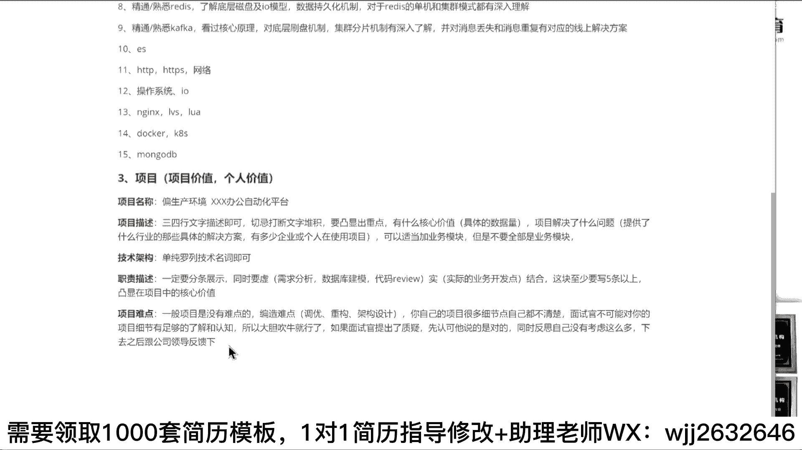

# 系列 6：P133：项目经验该怎么写？ - 马士兵学堂 - BV1RY4y1Q7DL

好了，听到之后来，我们聊第3块。项目。下午怎么写啊？这个同学们项目在凸显的时候要凸显的是什么？两个东西。第一个。项目价值。第二个个人价值。这样东西我希望你能够凸显清楚什么叫项目价值？

项目在描项目在描述的时候，我们一般要求同学们好吧，你要具备三个模块，最起码三个模块，哪三个模块。第一个小模块。叫什么叫项目描述。项名称。第二个项目描述。第3个。技术架构。第4个。

职则描述有可能的话加一个项目难点。嗯。类似这样东写好吧，这张写子怎么写？第一个项目名称在写的时候，同学们一定要。😊，偏十。平安生产。环境什么叫偏生产环境？很多人写了一个。办公自动化系统。

并不是说你不能写OA，你可以写OA没问题，但你最起码加上一个什么什么OA系统吧。😡，把你写的CRM也行，你写一个什么什么CRM系统吧，是不是道理？你给他把这个名字补全了，它是一个真实的项目履历。

而不是像你们写的什么博客管理系统，对吧？后台管理系统不要写这东西好，有可能的话更多写一个什么，不要用系统和项目这样的描述，更多用什么？😡，比如说叉莎办公自动化平台。用平台这样的描述。明白吗？好吧。

这个没啥说的。第二个向描述写什么？向描述记录三四行。文字描述即可。切记。什么大段文字堆积。好吧，要凸显出重点。什么叫凸显出重点？凸显重点是什么样子的，指的是你的项目。有什么？核心价值是吧，以及项目。

解决了。什么。问题这个核心价值计划怎么说？比如说我像像C价值怎么写，比如说这里面在写的时候，你可以带上具体的。😡，数据量这数据量不单单是说你数据库里面数据量，比如说你的日活，你的PV，你的UV。

像这样都是可以带的。项目解决了什么问题，你可以写什么？😡，提供了。什么行业的哪些具体的解决方案有多少？人货有多少？企业或个人。在使用。项目类似这样的东西，你要这样去写。听白意思吧？三四行足矣了。

然后如果你实在没啥写的话，可以适当。😡，将什么业务。模块，但是不要。全部是业务模块。明白明白意思吧。好，这块大家定要注意。OK然后架构这块怎么样？单纯。罗列技术。名词。

即可好多同学啊很很很很很很很体谅面试官什么呃开发工具有哪些？然后呢，开发框架有哪些数据库用哪个？然后呢，服务器用哪个，哪个地方写的很详细，没必要，就单独单独只是单纯的努列技术站就可以了。好吧。

能列多少列多少，尽可多多多罗列完事，好吧，然后下一个是你的职责描述，职责描述一定。😊，要分条展示，同时要虚实结合。这块儿至少。要写5条以上。好，什么叫虚实结合？所谓的虚是什么东西？😡，需求分析。

对吧什么数据库建模。对吧什么带包re。这样东写什么叫十？实际。的业务开发点。没意思吧？一定要先把这东西都都补全了，至少5条以上要凸显出什么，重点是什么东西？凸显。😡，在项目中。的核心价值。

OK项目难点是什么？😡，难点。一般项目是没有难点的。这个认可吧？嗯。很多人在外包，在国企。做一些CRB项目，对吧？基本上没有什么外包，那基本上没有什么难点。牛在什么？编造难点难点从哪些点可以编造？

第一个。香油。第二个。重构。第3个。代构设计。从这三个维度去改变它。去准备它这块大家一定记住啊，老师，我我们项目中实际上没有遇到5点的点，我怎么跟项目中套呢？😡，记住一句话，同学们记住一句话。

你自己的项目。很多细节点。自己都不清楚。面试官不可能对你的项目细节。有足够的了解和认知。所以。大胆。吹牛逼就行了。听你就行了，听白意思吗？如果面试官。提出了质疑。怎么办？就是什么。先认可他说的是对的。

同时。反思自己没有考虑这么多下去之后跟公司领导。反馈一下。能懂我这意思了吗？我能看到你的问题啊，一会儿我先我先讲完，讲完再回答你们问题好不好？行吗行？朋学们。😊，能懂我意思了吗？

面试面试官问的一个解决方案，你说这样解决方案，他说不对啊，你们解决方案也不应该这样啊，这样解决不了问题啊，你就直接告诉他，大胆并且笃定的告诉他。面试官，我们当时项目确实是这么考虑的。像您刚刚说那一个点。

我们当时没有考虑到，他可能会存在这方面的问题。好吧，下来之后我给我们的领导再重新反思一下，反回回顾一下，我们把这个问题解决掉。😡，懂我意思吗？关键在于你自己的表述和表达的方式懂我意思了吗？朋学们。好吧。

所以这里面每一个模块我希望你能够重点把它给说清楚。这样的话面试官的感受和感知是完全不一样的。该分块的分块，该分条的分条，该详细写的去详细写。懂我这意思吧？来，我给你们看一个案例，好吧。

这个同学写的s斯名单。我接别截别人简辑的图啊，你看别人写的怎么样，你们自己看胡干这个这个这个这个描述，他很清楚。第一个告诉你，这是一个s平台。第二个实际上多租户的东西好吧？第二个，我们集成哪些功能模块。

第三个私人定制的移动化办公平台。好，简单的告诉你，我项目中用到哪些技术站。第三个告诉你责任描述里面，我用什么东西，需求分析什么之类的，制前平行任务什么之类的，这样写写完之后告诉你。

我用哪些具体的细节点解决什么问题。😊，很清楚很清晰，别人知道了你在项目里面承担什么样的职责。能懂我这意思吗？来项目怎么写，了解朋友给我扣个一，能理解吗？😊，能不能理解？嗯。你要多去展示展示展示，别老虚。

你们的问题就是动不动就是老师我不敢写，动不动就是老师我我怎么怎么样，你能怎么样，你会怎么样，你会你你能怎么着。😡，不会的不会的。然后刚刚那个那个PC还在吗？AP现在吗？不在了。在是吧。

刚刚是你你叫啥来着？是这个吗？对。你这边有飞哥，可这电商业务。这个啊应该是一个非常非常大型的一个项目。对于你个人而言，你不需要写很多项目了。其实你只需要把这一个项目能写的非常完善就够了。我告诉你。

其实你这写的没啥问题啊。如果你想优化的话，我给你看一个也之前的一个学生，他写的一个简历，就他写的东西，我坦白说，我也写不出来啊，我也不一定能写得出来，我给你找一下。😡，哪儿去了哪儿去了啊。😔。

你找一下啊。哎这个。这是一个学生，他写的这个他他他现在啊呃薪资应该提大大几十万。他简历里面他有很多员工工作经验了，简历里面就写了一个项目，就一个多余的一个都没有，就写一个项目。他的技术描述也是这么写的。

你可以看一下。😊，当每两把刷子同学别这么写，好吧，每两把刷子别这么写，你会把自己坑死的。好吧，这些同学写的项目，你可以看一下技术描述使用什么东西，解决了什么样的问题，基于什么东西完成了什么功能。

采用什么东西解决了什么样的问题，用什么东西解决什么问题，用什么东西解决什么问题，这是他整个项目里面他写的技术的描述。比如说整个项目里面用到了哪些具体的。😊，细节点业务点它写的很清楚。好吧，重点看什么？

我们看它的职责描述。一般职责描述写不出来的。参与核心模块需求评审、架构规划以设计以及技术选型系统重构，系统优化，攻克系统技技术难题，构建高可用、高性能高并发高扩展的系统架构。第二个。

参与核心模块产品需求评审合理性开发周期开发资源项目项目排期电稿最终产品需求定型。第三个，设计大版本下平台整体架构方案，跨部门流程协作沟通，参与架构团队技术研究，解决复杂需求下系统架构难题。

参与系统重构多维度分析系统问题，解决推行方案，架构改进策略，最终深受力方案。负责。😊，高密发多级缓存架构的设计研发，负责高并发秒杀系统的架构设计研发。参与系统网关集群中间件服务需据填度优化。

然后针对什么什么东西，请进行优化。然后参与什么资源网关的开发，同步中间件的一些研发等一些东西，灰图发布的东西。这个一年30万吧，30万，赶写这样。😡，30秒赶紧这样，你30秒就就就行这样。

那个那个那个那个同学在吗？百变欢城。能能这意思吧？就你可以只写你那一个飞鹤项目，把那个项目构建。😡，成这样的方案。像这样东西。就你写成这样的东西之后，你不需要写太多，真的不需要写太多，写太多，没必要。

就一个项目让他问到死。没关系，我这一项目足以cover，或者说足以展示我自己的任何方面技术点及技技术优势和我的技术深度，只要玩这方面东西就OK了。😡，但是大部分同学啊听好了。

大部分同学你呀就踏踏实实中规中矩的按照这个方式写。听白了吗？OK没头发吧，你管别人有没有头发呢？😡，想管你管这么多干嘛？😡，没他妈有不用又不用不需要你给他吃饭。😡，你管这么多干嘛？

🤧你要考虑的就一件事儿，什么我如何在面试的时候去展示我个人的优势，不就不就行了吗？是不是道理，你还管别人头发的事儿，你管的真宽。都这样我还要啥头发，哎，是这个道理。😊，你知道年薪百万了。

你还关心头发事儿。😡，大了执发吗？是不是这意思啊。😊，所以啊。很多时候不是大家说你会不会写，而是你敢不敢写的事儿。嗯。

这下我写这么多啊。

