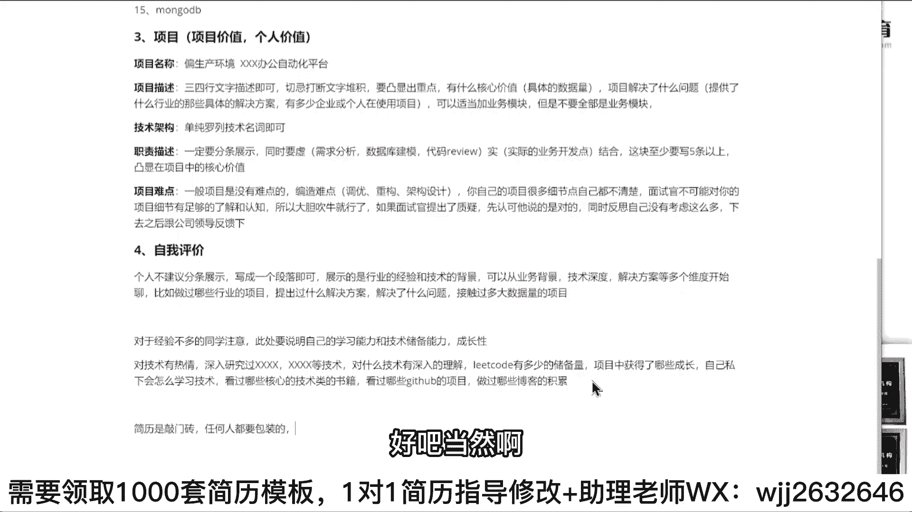

# 系列 6：P134：自我评价该怎么写？ - 马士兵学堂 - BV1RY4y1Q7DL

来第4个。自我评价。作评价怎么写？作品量同们记住了。个人。不建议分条。展示。写成一个段落即可。展示的是什么？是。行业的经验和技术的背景。🤧可以从什么。业务背景。技术深度。解决方案。等多个维度开始聊。啊。

比如什么做过哪些行业？的项目。提出过什么解决方案，解决了。什么问题接触过。多大数据量的项目。明白意思吗？也可以这样方式来写，我一样给大家看看几个案例吧。那个P7。你可以写这个东西。

这P气啊一年生一会儿我跟你说，一会儿我跟你说怎么写，好吧。😊，百变换城，你可以这么写，多少年开发经验，三年什么样的设计经验，好吧，三年什么样团队管理经验具备什么样的研发经验？

目前正负责项目是多少多少多少多少的什么样的一个服务平台架构研发。然后呢，拥有什么样的技术功底，对什么东西有深入研究。😊，别这么想。明白意思吧？还是这句话凸显你的深度和优势。

OK当然有些人啊可位老师我没这么强的实力，我就是一个普通能开发，我怎么办？一样的。写这样的方式。多少年开发经验，其中有多少的管理经验和架构设计能力，好吧，然后负责过什么样的业务。

后面可以加上你的这些废话。好，后面可以加你的这些废话，什么虚什么责任心强啦，加班啦、功能力强了，乐观啦什么这些东西，可以加这东西。刘老师，我没有讲设计能力，没关系。写吧。负责过什么核心页面的开发。

做过什么样的重构，做过什么样的编写，这样的方式写。好吧，那有人就会说，老师我现在啊经验非常匮乏，我现在就是个应届毕业生，我现在很low，我怎么办？😊，你怎么写？写什么东西？对于。是。经验不多的同学注意。

此处要说明自己的学习能力。和技术储备能力。怎么办？还是那句话，你现在刚工作一年或者你大学刚毕业，你其实没有太多的一种项目上面的沉淀，或者团队管理方面的沉淀。没有这方面东西，你要凸显什么东西。

凸显你个人的技术实力。什么叫技术实力？比如说。你不要说什么性格太朗，好吧。😡，对。技术有热情。好吧，深入研究过。叉叉叉跳叉。等技术。对。什么技术有深入的理解。好吧，然后告诉别人。呢字扣子。

有多少的储备量？这东西必须要加好吧，对于大学生而言，椰字扣也是必须要加的。😊，明白吗？好吧，包括还要写什么东西，工作经验短，但是凸显你项目中。获得了。哪些成长？自己私下会怎么。学习技术。

看过哪些核心的技术类的书籍？明白吗？自己。看过。哪些？给他哈吧的项目。做过哪些博客？的积累。懂我意思吗？这个可以写吗？看朋友们。可不可以写？没反应啊？你要这些东西，老师我都写不了，你要一个都写不了。😡。

那就完了，那那你就踏踏实实就像原来一样写一下什么热爱及团队啦，责任心强啦，对吧？有耐心啦呃，沟通能力没问题了，你就写这些东西。😊，就大家你记住一件事儿，朋学们，如果现在让你我举个最简单例子啊。

就现在让你真的夸自己，你都夸不出来。😡，你不觉得有点惨了吗？😡，好不你找一个姑娘相亲。明道吗？别人让你去夸自己，你都夸不出来，我就是一群，我就是一群屌丝。Do。不要写虚的东西。

同学们为什么不要写虚的东西，这些东西都是可以被问到的，你懂吗？就是为什么大家不要写虚总西？因为虚总西无法考证，无法考证，意味着这东西可能是假的。而我刚刚罗列的这些东西，它是可以去问的，明白吗？

比如说你看过词种原版的书，看过mes性能mecyclco，这些书我是可以去问的。面试官如果有这样的储备的话，我是可以检测你的学习水平的。😡，你没有经验怎么办？你不就展示你的学习能力吗？就展示两个东西。

学习能力、技础储备能力。还有一个点叫成长性。就虽然我现在很菜，但是我的成长空间无限，懂这意思吗？😡，你别我又我又菜，我又不上进。😡，你这就麻烦了吗？你要给别人展示这些东西，就是。😡。

问问不知不知知不知道咋不知道咋说了，好吧，反正这意思你们你们能能理解吧？就你一定要去学会夸自己，你知白吗？你你说你连自己都夸不出来不是很尴尬。😡，你一定要能一定要能。好吧，一定要能。

如果你自己夸不出来自己，说明你有问题。😊，Yeah了。今天我我我我结婚了啊，但我如果出去相亲，我肯定不会告诉别人，我200斤。😊，我肯定告诉别人好吧？我我我讲的有多好，我技术多牛逼，我心思有多高。

我肯定告诉别人这东西，我不会说我是100斤胖子。😊，Yeah。能懂我意思吧？就是就是你你你学会避重就轻，好吧，学会你的这个。😊，侧重点。啊，就是有有有。自己优势的地方重点突出重点自己优势的地方。

不要不要不要不要说嘛，避重轻嘛。我记得我之前讲过一节课，关于就专业专门管这讲这个简历的。我当时总结了总结了很多这个。相关的点啊。简历课你要学什么？第一个不要害怕写简历，不要草率点也，不要粗心，不要敷衍。

要学会埋陷阱，扬长处，避短处夸优势，对吧？每个地方你应该怎么去写写什么样的东西，要怎么样的方式去注意。其实我讲过很多这方面内容，这东底是你要好好去弄的。😊，啊。这我的相亲一样吗，我说这东你们不理解。

举些通俗生活中的例子，你就你就能理解了。啊，一定记住啊，朋友们保住好一个心态，什么心态？简历是你的敲门砖。嗯。任何人都要。包装的。好吧，因为每个就像星期跟本你跟你女朋友出去约会一样，你约会的时候。

你是不是要洗洗头理理发，收拾下自己穿一身干净衣服。是不这意思？好吧。

当然啊就刚刚伯约说这句话，我觉得特别好。嗯。😊。

这句话我就说到每个人的重点上去了。他说简历写的好，只是获得面试权，主要是面试有货。这就是很重要一点，就是什么？就是你在写简历的时候啊，你在写简历的时候，不要考虑说太多说我能不能做这件事情没意义。

因为你既然已经准备准备找工作，说明你就你准备已经跳槽了，说明你的技术储备没问题了。如果你的技术储备有问题的情况下，再再再再说一句话吧。在现在。如果技术储备有问题的情况下。不要想着碰碰运气去找工作。

原来可能。有机会现在。百分百没戏。听不了吗？朋友们。你看面试能过，害怕拧到螺丝，你先把面试过了再说能不能拧螺丝。明白吗？就你别技术储备，还有问题的时候，你说老师我去试试吧，万一我过了呢？😡。

天上有个馅饼，正好砸你头上，凭什么呀？😡，嗯。用那个张雪峰老师的话，怎么着，你家祖坟着了，冒心烟了，不可能。不可能。

好吧，所以就是踏踏实实的储备你的技术是吧。