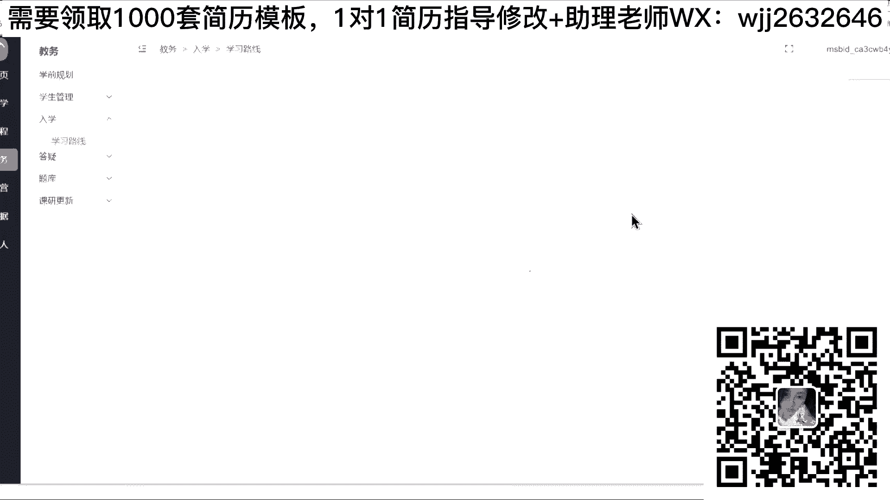
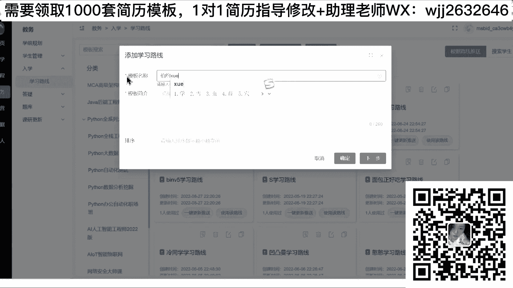
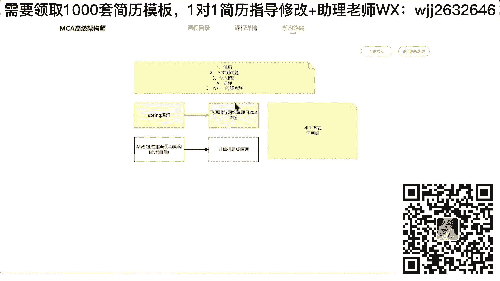
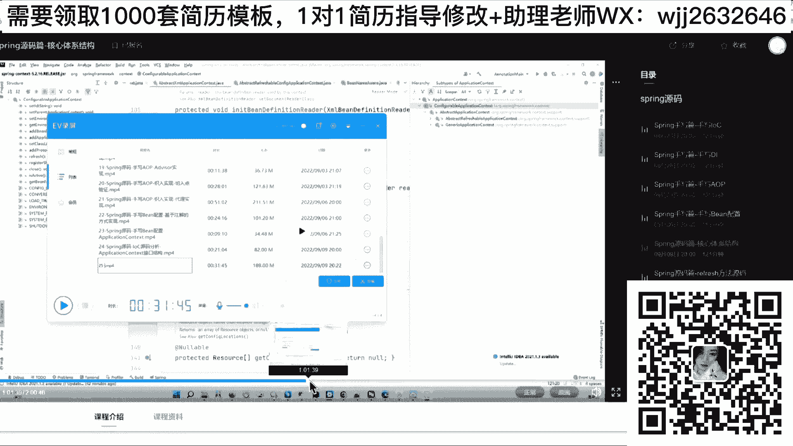
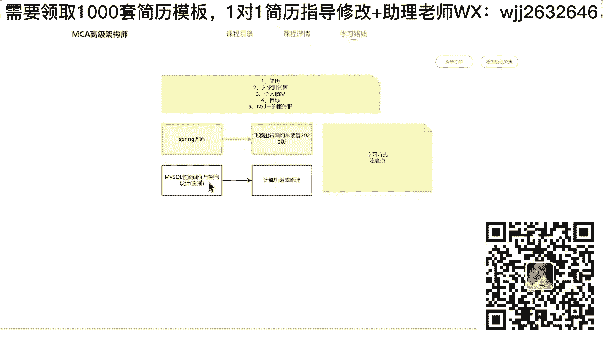
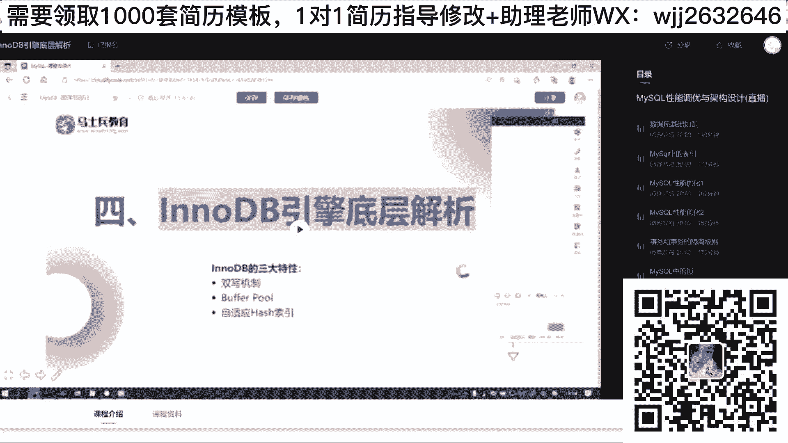
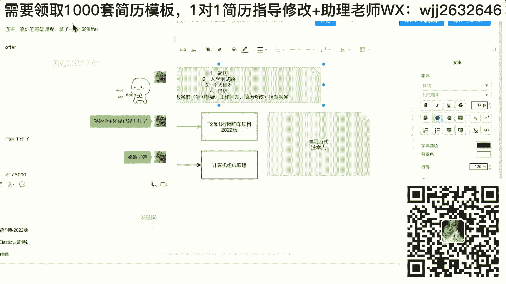
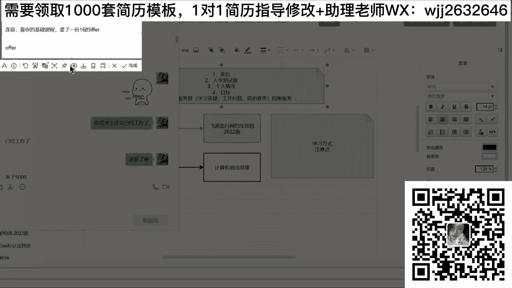
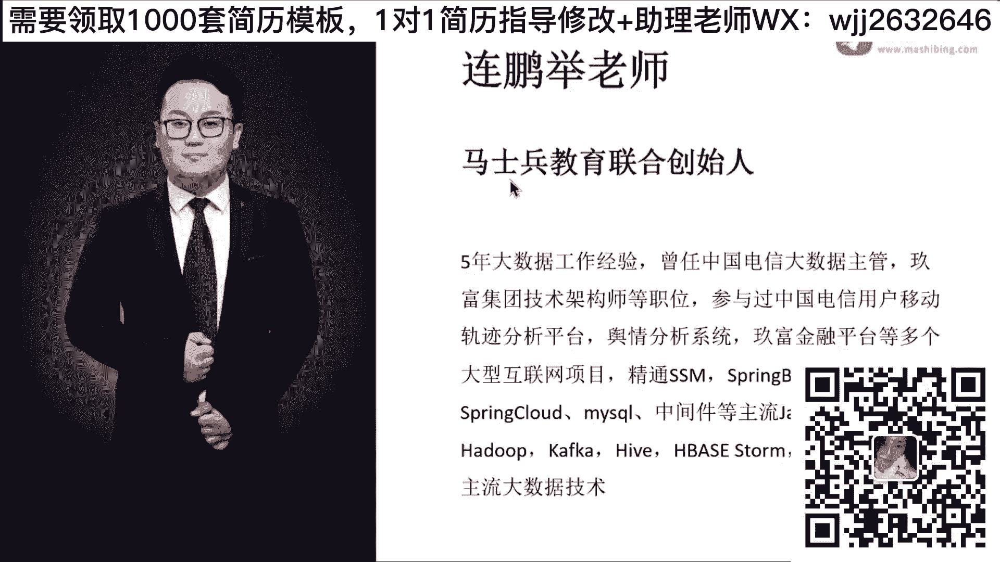

# 系列 6：P136：最根本的核心点—打铁还需自身硬 - 马士兵学堂 - BV1RY4y1Q7DL

那一些简历有有些矛盾，这就是我说的，你找工作的时候，你的心态是什么样子的？就如果你找工作的时候，你就本着一个目标说，我面试了，我就一定要过。那你就不要这样写。听白了，同学们，就如果你要记住一件事儿。

如果说你现在报的现在就是我面试一下工作，我一定要去过，那你就不要像我这样写简历。因为你像我这样写简历的话，你基本上过不了的。😡，为什么很少有同学能进行这样技术的cover？

但是你现在又发现一件神奇的事情，如果我不这么写，我几乎连面试机会都没有。😡，他现在就是一个很矛盾的点，你怎么办呢？😡，你咋办？你说怎么办？有啥好办？有的有啥有啥好办法吗？没办法，所以归根到底，同学们。

你的简历写的再牛逼，你的简历再优化，你的简历再包装。最根本的核心点是什么？啥玩意儿？继续。技术。就刚才说的一句话，我觉得很好。打铁。还需自生音。当然我现在给大家讲这些东西啊，讲这个简历课的意义是什么？

是希望同学们你们能获取到一定的面试机会。就算你现在不准备去面试，最起码说当你投递简历的时候，不管你的技术多烂，最起码说你能感受到，就是你能去体验一把面试的感觉。而不至于说我现在连面试的感觉都体会不到。

我连面试的机会我都获取不到。明白吗？因为你没有可备不就这样吗？😡，我连面试机会都没有，我不敢写，我就按我实际的情况去写。按照你实际的情况去写，你就什么面试机会。😡，我举一个例子啊，朋学们就是。

我不夸张的说啊，我毫不夸张的说，就举一个最简单的例子，现在很多人都在找工作。对吧我不拿你们跟外面的这些学生去比啊，我就拿你们跟马诗斌教育的VIP去比。每一个马诗斌教育的VIP同学老师都要去帮他改简历。

表完简历之后，基本上都要变成这个样子，或者说类似于这样的形态，但不可能一模一样啊，大概都要去以这样的方式去搞。就是你们的简历跟我们的VIP去比的话，你觉得你的优势在什么地方？就单纯我们我们不说技术啊。

就单纯指数面试机会上来说。😡，你觉得你有优势吗？😡，其实都没有。所以我想说的是什么？同学们，不管你跟着我们学不跟着我们学没关系，好吧，但是我希望做的事情是什么？是你一定一定要怎么样？

先去外面感受一下面试，先去外面有一个面试机会，让你知道我自己到底有多差，或者说要知道我自己到底差在哪儿呢。😡，而不至于说你现在处于一个什么阶段。😡，我知道我很差，但我不知道差在什么地方。

我也不知道面试官问什么，反正我想去面试，别人也没不给我机会，我没招了。😡，你们现在是不是很能处于这个状态？我想面试，我想看看自己的差距，但是我又没面试机会。😡，有多少人这样状态给话扣个一。😡。

就是我现在想学，我都不知道我要学什么东西，因为我不知道前面是什么。😡，我也不知道我的技术短板技术短板在什么地方，我没得补。😡，是不是道理？所以我还是那句话，我呢讲这节课不是说你一定要报名VIP课。

更多是什么？我希望你们说你能有机会更好的去。怎么说就是获取到一些机会，最起码说知道我差在什么地方，要不其说洗脑成功。行吧，你说我洗澡就洗澡吧，我去上麦克了，好吧，你怎么着？😊，洗脑成功。

你可以认为人洗脑，我这个不给你犟，你觉得我是洗脑就洗脑吧。没关系，好吧，每个人有每个人的认知和见解，对吧？但我说的这句话啊，你们可以真正的真真思考一下，我说的是不是事实。😊。

但老师应届生有个笔试关卡过不去怎么办？这个其实也非常简单，把你的算法把你的基础实力重严扎实了就可以了。就可以了。好吧，在家把这下单，你爱买不买，你爱买不买，啊在家买这就下单，你爱买不买，好吧。😊。

只能跟我求着你买客一样，还爱买不买，别买啊，千万别买。😊，啊我求着你学习。我疯了。我只是给你讲清楚现在的情况是什么样子，好吧，你要不要学，取决于你自己。懂吗？啊好，我求我求着你了。没那样好吧。

离职原因怎么说比较好，这个很好说啊，就就是。来，有多少同学不清楚一个人怎么说的，给老师扣个一来，我教教你们。😡，其实啊你们现在很多人离职原因啊，为什么想离职？其实非常简单，要不然钱不满意，对吧？

原要不然就是呃很简单。第一个觉得你的领导太。😊，太二了，对吧？要不然觉得工资低，对吧？要不然跟同事相处不来，要不然加班严重，就这几个点吗？对吧？你描述的可以换一种方式，怎么说，你比如说。😡，直接告诉他。

你说在现在的公司里面，在之前的公司里面，好吧，已经获得了足够的成长和技能和经验。好吧，但是能够希望自己能够干什么事，能够扩展自己的知识面，能够希望自己能够进行进行一些更加深入的学习和成长。

而不是在原地踏步。😊，明白意思吗？好，或者你告诉他，你就是说这样，你说其实我在研公司里面待了很长时间了，我已经具备了这个行业和这个岗位相关的一些呃经验积累了，包括能力相关的东西。

希望呢有一个机会可以迈向更高的一些台阶，能学习更多的知识，能获取更高的一些发展，对吧？然后或者再说我比较侧重于公司的平台发展。我发现我自己自现在的平台，已经怎么说，我每天在做一些重复性的工作。

基本上已经到达了我发挥价值的一些瓶颈了。所以希望能到一些更大的平台里面啊，凸显一些更好的个人价值。😊，对不对？或者说我之前做的工作都是一些低效重复的工作。

我希望能有一些更加高效、更加可以提升的点就行了吗？😊，一句话不说上家公司坏话，但是基本上说都是什么？我要自己获得更好的成长，或者我希望能有自己更好的一些进步，保证你的什么上进心和成长性。还是那句话。

保证你的上进心和你的成长性。明白了？被裁了被裁了，你还能怎么说，找个理由吗？就刚拿拿刚刚那些理由去说嘛？😡，是不是道理？好吧，老师，我是个大四应届生，学生有疑问。😊，看下这个啊就是现在技术站不够完善。

加上现在外包公司实习，学不到重要的东西。我是继续积累实习经验，还是停下来回去，要继续深造好纠结。如果你在外包里面实习的时候，没有实际开发项目的，这这这这这这个就没有实际开发项目机的机机会。

就别在里面待着了，它没意义。😊，就实际这件事啊说过很多次了，如果你能获得成长和进步，你就待着。如果你获得不了成长进步，就踏踏实实学学技术，别在外包公司里面耗着，耗着是没意义的。好吧。

我就是目前公司待了4年多了，面试逼问的机会是你在这家公司时间挺长了，是什么原因让你再看别的机会，就告诉他，我在这家公司从事到现在4年时间了，我这边这家公司获得了很多的成长。

但是正常时间我也给公司做出很多突出贡献。但我不希望我自己能够一直这么下去。因为我希望能获得更高的一些成长和发展。但公司现有的平台啊，每天都在做一些重复的工作，还不太利于我个人的发展和职业规划啊。

所以没办法，我只能选择离职。😊，离职原因都说不出来，我的天哪。😡，上无言，上进心和成长性。上进心和成长性这俩东西。好吧。没梦的日子，我现在离职一年了，中途在家有事情没干啥过工作，现在出去找工作的话。

面试官问这前公司，比如说工资流水是保质就易被掉怎么办？告诉他，这些领导拉你去创业了，但是创业失败了，所以回来了。😊，好吧。我这这话秋招帮找不到好工作，有机会去C安实岗，要不要转，不建议红转不建议。😊。

🤧Yeah。你还有什么想问的？对于你还有想什么想问的这个问题，好吧，非常简单，问的是什么？跟面试官聊的时候不要问钱，跟HR问钱问福利，跟面试官聊什么，聊公司的技术体系什么样子的，公司技术站什么样子的。

公司的解决方案是什么样子的。你可以这么说，之前来咱们公司面试之前，了解到咱们公司是做金融行业解决方案的，你能帮我说一下咱们公司主要做的方向是哪些吗？主要做金融哪些产品吗？

对吧比如问咱们公司有哪些内部晋升的计划吗？比如咱们公司呃有什么内部分享会吗？有什么技术培问那个那个技术分享会吗？😊，围绕技术去聊，围绕你的成长性来聊。😡，好吧。记住啊，切记一件事儿，同学们切记一件事。

千万不要傻话乎乎的问你问面试官，面试官我过了吗？不要问这样的问题，好不好？😡，你们这样等于。打自己好吧。简历只写三四个项目的话，最开始项目是简要写还是直接不写不写。😊，工作十年了，很老的项目不写了。

干脆不写好吧，干脆不写。😊，你写的简历里面的每一句话，每一个字是为了展示自己的优势啊和能力，而不是为了凑字数，也不是为了梳理你的工作经验，听懂了吗？同学们。😡，你做了20个项目，每个项目都写，你疯了。

😡，你写多少页？😡，我说了，简历没有实际个数的限制，好吧，而在于什么？你能不能凸显你的价值和能力，你能一个项目能凸显，你写一个项目都行。从来没有人告诉我说，我简历里面一定要写三个5个项目，没有这样的。

只能有些同学简历比较简单，或者项目里项目比较简单，那没办法，所以只能写三四个。😡，懂了吧？可以让面试官评价本次面试吗？不可以。😡，不可以。34月和90月份有什么区别？什么时候涨？😡，我问一下朋友们。

就是你们觉得找工作一定要在34月份和90月份找工作吗？😡，觉得必须要在34月和90月找工作的扣1。没必要的扣2。😡，当然很多人啊有一个错误认知啊，什么错误认知呢？都觉得。就是。

都觉得说什么都觉得说老师三金三银四，金九银十，面试机会多。你有没有想过一件事儿，面试机会多了。意味着竞争压力也大。你想过这件事吗？就是你的技术储备好了，什么时候跳都可以。你的技术储备不好，我告诉你。

金九银十，金三银四好吧，金啥银啥都没戏。😡，懂吗？不要凑那个热闹。😡，不要同原闹。你们觉得1月份11月份整工作容易吗？同学们。😡，1月份找工作找工作容易吗？😡，啊。何涛老师，那个12月份马上过年了。

1月份是不是找不到工作了，真不是真不是。😡，你真的技术储备好了，真的可以找到工作。同学们，我真不骗你。😡，我哎。给你看好吧，我。哎。就我其实特别不喜欢大家金三银四金五银四的时候，你去扎堆儿。

你扎堆少你你有技术实力，你扎多就扎多了，你技术实力不扎堆的话，你真的很很难。好吧，就是你你啥时候技术准备好了，你啥时候去找工作，谁告诉你找工作必须要34月份90月份啊。😡，没必要，好吧。那你些得。

给你看一下，2022021年1月15号，1月份找工作，没问题没问题。好吧，应届生可能要在你大四下半学找工作，但在职的同学，你什么时候找都行。😡，啊，校招不一样，校招有时间限制。

这个这个这个这个是必须要有时间，这个没办法，对社招而言，啥时候都行。😡，听白吧？所以关键点是什么？你的技术是否储备扎实了？如果你的技术被扎实了，就OK了。😡，好吧，阎阳瓜说咋学呢？😡，我问一下。

洗的更进一步了。还是得看学历和各队刚入行的学历肯定是个很重要的关口啊，但你没学历怎么办？不然还得凭技术吗？我还是那句话，你有技术不可能找不到工作。你没技术，我告诉你，你找不到工作的。哎，赵子龙说的很好。

林老师四边M板天下无敌，不要停，继续说。😊，就是还是那句话啊。😊，就感觉每个地方都不是很扎实，应该怎么补？这里面涉到学习方法的问题啊，同学们来这个刚刚这个蔡先生问了一个问题啊。😊。

有同样困惑的同学跟老师扣个一。有的有这有这共的个扣个一。就这个问题啊的很就是这个问题是大部分同学一直在纠结和难受的一个点。就老师我到底要怎么去学，我感觉我啥都不会，我应该从哪个方向和从哪个维度去补。

这大部分存在一个问题啊，看了马智培教育课程感觉好多啊就是。😊，怎么说呢？我先先给大家看一个东西啊，先给大家看一个东西，每个技术都懂，但都不精通。😊，刚刚我展示一部分这样内容啊，这个东西是啥啊？

是我们规定的一个java的一个路线图。然后呢，这是我们的VIP报名之后，他要学习的技术点。有刚才看过这个内容啊。看过这个内容可给我扣个一，没看过的扣2。😡，就这东西啊我不再详细讲了。

因为我每次公开课我都讲很多遍，我不再详细讲了，就这是你作为一个渣号开发工程师，你可能在现阶段要面试的时候，你必须要储备的技能点，大体上包含这么多块，什么底层基础，比操作系统了，网络IO了对吧？

机组这这些东西，然后变化编程的东西，然后RPC的东西，然后缓存中间件，不设计中间件缓存的，然后分布式的微服务的优化的存储的，然后检索的数据处理的，然后运维的带op的。

包括下面有一些源码的理论设计的算法的对吧？还有架构设计的东西，里面包含内容很多很多很多学之前听我讲无数次。我之前讲的很详细啊，我这次不再详细讲，就这是你作为一个号开发工程师，你必须要学的。

其实你们不可能不知道现在学什么内容，你告诉我你现在面试考考什么。😊，你们告诉我，你现在在面试考什么？😡，我不不现现在我不现大学不出来。

说说不出来微服务分布式中间件数据库缓存GVM并发编程算法源码架构设计云原生是不是这几块？你们所有人都知道我要学这个东西，那这块就是你要处备的内容。这个东西啊，如果没详细看过同学。

可以找咱们咨金老师要一下这个图，要图不花钱，要图不花钱。好吧，如果你加过咨金老师直接找他要，没加过咨询老师的扫码加一个好吧，找能要下这个图，就是我不想给大家讲这里面学习路线时说你到底要学什么内容。

但这个路线里面东西很多，他足以覆盖现在面试上市面招聘的所有内容，对吧？那刚刚同学们说这要学多久，你们觉得这个东西学员要多长时间啊。😡，这东学，你告诉我你这要学学学多久，十年夸张了，好吧。正常情况下。

你要学两年。就只是老的内容，你要学两年，你要学两年。你有必要说，老师我闭关两年，我来把这个东西学完之后再找工作吗？😡，不需要，好吧，咱们这个行业它不它跟古代练武功不一样，不是说你在古墓里面住住了10年。

住完十年之后，你出来之后就成大侠了，不是这样的。😡，是更多是什么？😡，更多是什么东西？更多是说你要把你现在的短板优先给补充起来，然后我先涨薪，涨薪完了之后，我再提升，提升完了再涨薪，一步一步稳着走。

这是最主要的。虽然很多人有一个疑问说，蔡叶说老师感觉每个地方都不是很扎实，应该怎么补？每个地方都不扎实，有没有最不扎实的。😡，有没有？你能不能找到你自己最不扎实的东西？😡，能吗？就是你要记住一个点。

同学们，你现在要补充的不是这些全量的东西，而是你在面试的时候，能不能有几个点是自己能拿得出手的。😡，举个例子，假设电视考这几个点。😡，恢复。公制。中渐见。数据库。缓存。这边路。变外编程。

假设就考这7个点，这7个点里面你能不能选一个选两个，选三个是你能拿出手的东西，能不能？😡，那么。可不可以？比如微服务分布式充间线这三个，我把这三个东西搞了搞搞熟线，搞精通，其他的四个东西我就了解。😡。

一般问题，常规问题能答上来，深重你答不上来。没关系，这三个东西你只要问到我了，我百分之百能给面试官说的很清楚，能做这件事吗？😡，能不能就能能扣一，不能的扣2。😡，就是你在学东西的时候，一定要有侧重点。

同学们知道吗？你知道你们现在为什么拿不到高薪工作吗？😡，你知道为什么拿不到吗？😡，拿不到最根本原因在什么地方，在于你啥都想学，但是啥都没学会。举个例子，有多少人经常听我们的公开课？😡，给老师扣个6。

就经常现在听马上就叫公外课扣6。😡，很多吧，很多人经常来听，你听完课，你会发现公开课，咱们公开课是由普通老师讲的。今天我讲数据库，明天老周讲re list。后天老爷讲GM大后天好吧。

老李讲周凯MQ大后天马老师讲变化编堂，每个老师讲的都不一样，每节课你都听了其中一个小点。😊，比如我讲听过，我讲索引好，听会了，对吧？我讲了讲了讲了那个MVCC听会了。😊。

但这只是数据库或其中一个技术体系的一个点啊，它不是一个体系性的东西啊。什么叫体系？同学们。😡，就举个例子啊，我再举个例子，比如说。😡，一个技术框架。😡，它里面有10个点，有10个小框框。也是个小公告。

咱都在罗列呢。甚不是每次面试完问你问题的时候，你只能答一个。😡，你能有一个前后的关联关系吗？😡，你能把它关联起来吗？就比如说现在面试的时候问一个问题，说来谈一下你对叉叉叉叉技术的理解，你怎么回答？😡。

何同学想到哪儿说到哪儿。你的技术体系储备是散着的，明白吗？你要把它合到一起。当我面试官问到一个问题的时候，我能通过这个点往上或往下去延伸出来我相关的知识点。

我给面试官展示的并不是说我对于这一个技术点的掌握程度，而是我对于这个技术点整个体系的掌握程度什么样子的。😡，因说感觉我靠，这个人好牛逼啊。啊，最起码在这一点上面，你是无敌的。你懂我意思吗？

我敢放心的把某一块业务，某一块的技术架构，我把它放心的交给你。你要展示的是你这方面的能力。😡，而不是说我都是担绷子。😡，会一个readies会一个mycle。

会一个read里面一个点会my circlecle里面一个点，你这样去搞是没有意义的。听白意思吗？所以蔡线人问这个蔡线生问的问题说哪个地方都不是很扎实，应该怎么补？还是那句话，你就挑蔡线听好了。

能不能挑一个字。你刚说了分布式，我就挑微服务和分布式。😡，这头两个玩意儿。我把这玩这两玩意儿搞到巨无敌，前东我都不会，或者我稍微了解一点，这两个就搞到巨无敌，行不行？😡，面试的时候。

我所有的面试回答都往这两上面移，只要问到这方面东西了，我就展示我的技术深度和我的技术体系性。其他问题能回答我就回答，回答不了达倒。😡，能不这样。你以这样的方式学习。

你会发现慢慢的你会把每一个点的技术体系都去补充完整，而不是像你们现在一样，你再去散着学。就是你们跟报名VIP同学最大的区别是什么样子的。你们原来的学习是什么？是一个一个点1个点去学。而VIP报名之后。

老师会帮他规划路线，路线里你会告诉你，你必须要先学什么后学什么，再学什么。每一个点你的体系要怎么样做做准备，做什么储备，老师要怎么去帮你做这种监督服务，包括你后续的发展，你的学习过程都需要这样的东西。

这是他们的区别点。😡，就刚刚有哥们问的说，学习老师我怕遗忘，像蔡先说，以前现在通目室现在玩差不多了，有多少同学学习怕忘了，要2扣1。😡，觉得你胖胖的扣1有吗？你告诉我咱们现在听课同学有谁过目不忘吗？😡。

供不旺的给老扣2。谁都做不到，过目不忘，别想这事儿了。所以你要做是什么事儿，体系学习。在学的时候，我要保证我对于这个技术点的理解是深刻且到位的。就算我忘了，我可以根据我自己的总结来把它给迅速的回忆起来。

😡，来，我要举这个例子啊。来看一个图。我每一个我基本上展示这个东西啊，这是我们的1个VIP同学，他做的一个总结。他学习GVM的时候，他做的笔记。😊，我给你最小话，同学们。你看一下别人在学KVM的时候。

别人总结什么样的东西。看我放大一下好吧，所以你们说老师你是不是便随便拿一个东西来糊弄我，真不是JC日志设置调优的原则是什么样子的，检测工具是什么样子的？内存高应该怎么怎么设置参数应该怎么去做设计。

压缩点怎么做时间调怎么做，空间优化怎么做，看到了吗？😊，你如果真在学习的时候，你能做出这样的东西出来，你告诉我你会怕遗忘吗？就算你忘了之后，你根据你写的这套东西，他能不能快速回忆起来，能不能？😡，能吧。

你们现在是怎么学的？😡，你告诉我你们怎么学的？😡，我去B站，我看书好吧，我发现了一个巨牛逼的视频，我最牛逼一本书，对不对？然后呢，我看视频的时候，我看到视频里面某一个点了，讲的很牛逼。好了。

我啪你点击暂停。大家好了之后，赶紧去抄考试笔记，截图也好，写写文字也好，记完了。记完之后接大下听。😊，听完之后又遇到一个关键点。好了，我再暂停一下，赶紧截图做为文字笔记。你这玩意儿做完了之后。

我告诉你毛用都没有，为什么你这种方式不叫记笔记，叫什么？😡，叫什么叫抄笔记。因为在这个过程里面，你没有自己的总结和思考。明白了吗？什么叫自己的体系？为什么很多人听我讲课的时候，讲技术课听的很爽。

爽完了之后就爽完了，过一睡睡睡一觉，啥都忘了。😡，为什么这呀？就是因为你没有获得这方面的一些什么总结。对吧比如之前我问一下有多少人同学听过我讲原马课。听我讲羊满分送有多少扣个一。😡，很多吧。

我觉得很多人听过我讲完幼二课之后，你自己做个总结吗？😊，有多同学自己做个总结。扣个，我看看。我给你看一个东西。1个VIP同学，他听我的原码课做的一个总结。这是一个word文档。

这个word文档你可以看它这个名字啊，叫死维源码2，它这个文档一共有3个。光这个二这个文档它大概有92页。你看一下别人里面的东西。别他写多少？是别人做的总结，同学们，你真的把总结做成这个样子。

你觉得你会怕忘吗？下面有自己的理解，自己的解释啊，自己的东西他会做这样的标注和做这样的思考。我给你看这哥们儿他是怎么去问问题的，好吧。叫啥来着？这个呢。网的叫啥？就这。🎼我一看看他问问题的过程，好吧。

你看他问题的过程，你就知道他有他有多牛逼了，就他的学习方式是什么样子，你们是不是可以跟着或者模仿这样的学习方式去做一个这样的储备，你们可以尝试一下。😡，就别人在学完这小东西之后。

他到底是什么样的一个感受，这个是真的不一样的。找一下啊。人叫啥来着？哎呀。等家看。这是哥们加我微信之后问我问题好吧，你知道别人怎么没问题吗？同学们。😡，他说这边有些问题老师给讲解一下，对吧？然后呢。

这是循环易赖这块，他问的问题，然后别人问问题的时候是怎么问的，我给你看一眼啊。😊，文档还有5个问题，其他问题我已题实操搞定了。61页有什么问题，看到吗？每个问题到底是什么样子的。

他应该怎么去方式别人会这样来问问题，明白吗？😊，你没有这样的过程吗？😡，这种东西才是说我真正的学会了这东西之后是啥意思？而不是说我我就听一遍，你听一遍是没有意义的，听明白吗？朋学们。

这才是你需要应该储备的东西，这大家需要注意的。😡，哎，我为皮萨狂叔老师，怎么判断自己学的什么学到哪些，感觉内容太多了，也不知道如何下手。还是李壮同学们记住了，这里面涉及一个很重要的学习方法。

什么学习方法？你们现在有多少同学是已经工作的呃，应届毕业生不不怎么怎么说，还没毕业的学生扣一，已经毕业的扣2。😊，你们可以看一下你们的人群比例啊，咱们现在不管你是已经毕业了还是已经没毕业的同学。

基本上你们的学历，你们的技术储备，你们的薪水，你们的城市，你们的目标，每个人都是不一样的，明白吗？所以很难我去找到一个统一的适配路线。说OK你过来之后，你一定要先学这M，一定要先学平方编程。

一定要先学飞服务，一定要先学中间键，他没有一个统一的适配路线。😡，好吧，所以这里面需要一件什么事情，大家需要去去外界寻求一些帮助，什么帮助，你要想办法让自己找到一种更加高效并且更加及时的一种学习路线。

让自己做提升。我举个例子，还是呢我这这个事啊，你不一定一定要找我们做好吧，但我们做的更好，你也可以找你认识的一些师哥师姐或者或者比你牛逼的一些人，让他们帮你去做做什么东西，每个人过来之后。

你需要自己的技术评估了。什么技术评估。我给你看一个东西，同学们。😡，就在这块，它有一个很重要点叫什么？叫学习路线。什么叫学习路线呢？我也可以给大家看一下，好吧，有人想看吗？😡，徐路线的东西。

就省呢学习路线，我还是这句话，每个人跟每个人都不一样。所以一定要找到什么独属于你自己的最有效、最高效的学习方式。那这里面必然涉及到学习路线的东西，就这个路线我到底要怎么去做制定好吧，我们怎么做的。

我给你看一下，好吧，这种方式啊，你可以找比你厉害的人去做啊，这个关键点取决于你自己OK怎么做。比如说这块我们就拿这个火销来说吧啊，对，拿拿拿这个吧，英文名字我也不知道叫啥，就火销吧，能复制吗？😡。

手表算了，就回销吧。是要胡销吗。啊，就活。火火。学习路线。可以吧。啊，博约你就博约吧。学习谢谢。

我们会给学生做这种东西。下一步。做什么东西？每一个学生我刚刚说过了，每个人每个人情况不一样好吧，老师怎么帮你做这种东西？第一个。😡，每个路线不一样，意味着什么？第一个我需要看你的简历。

就是简历我是必须要看的，我怕简历没法帮你做规划。除了简历之外，第二个我需要一套什么叫入学测试题。😡，我需要去评估你自己的技术水平是什么样子。第三个我需要知道你的个人情况。比如你的城市啊。

你之前的薪水这些东西好吧，第四个我需要知道你的目标。比如说我现在10K，我想涨到20K，还是我现在20K，我想涨到30K，我必须要知道这些详细的明确信息。因为我只有知道这些明确的信息之后。

我才能知道说你应该储备什么样的技术实力。真的会准备好。同时我们会有一个什么。😡，针对一。服务区。老师给你们做服务，做完这个东西之后干嘛？我把这东西收集到了，收集到之后，我会给你做技术评估。

做完技术评估之后，O我随便推搓几个。比如说你需要学springM码，比如说你需要学myscle高性能的架构设计，对吧？比如说你需要学。😡，网易车对吧？比如说你需要学计算机组成原理。

我会帮你去做这样的制定路线，对吧？我可以给你画个路线配上色对吧？能不能好看一点，这是独属你个人路线。包括我会在这上面给你加一些个人的备注，你要怎么去学习这个基础模块，你要怎么样去做这样的一个技术储备。

😊，学习方式好吧，注意点，我给你规定好，规定好之后，这个路线是独属于你自己的一套学习路线，跟任何人没其他关系。当我有了路线之后会干什么事，我会选择把这个路线去推送给你。比如说刚刚学叫伯约。

我们找一下伯约。不会学路线吗？我可以选择使用路线，我推一下。什东线。但我只能退我自己啊。特别让别人。李总。嗯。🤧好了。当我推完之后大家发现了这边出现一条消息。

2022年9月19号10点23分022秒可以吗？同学马世民教授团队为你推送一条学术路线，点开学术线之后，是我刚刚制定的吗？同学们。😊，是不刚做好了吧？我做好这个路线之后，你可以按照这个路线来学习。

我保证的是什么？你现在规划这些点里面不需要你自己来选择的说老师我要学什么东西，不需要老师帮你来把这件事情做好。那做好之后，你干什么事？有一路线鼠标放上去。😡，直接跳转哎，直接跳转对应的课程进行学习。

跳转到视频这。你看完一个东西之后，接着往下看，看完一东西之后，接着往下看，看明意思了？同学们，这是你适合你的学习路线。哪一个路线里面，老师会告诉你，你要学什么？你不要学什么好吧？不需要说老师。

我说每次都要问了，你不需要我帮你做好这种平台化路线。OK你来学习就可以了。😊。

能理解吗？来觉这种路线定制方式，牛逼的同学给老师扣1。😡，这是直接内嵌在我们平台里面的，直接会给大家进行推送的。而且我们真正做到一种什么呢？叫私人定制，就是每个人跟每个人都不一样。

真的是独属于你自己的一条路线。但是我刚做路线没意义，好吧，我只是做了一个演示的一个效果。😡，啊，所以你会发现这种方式最高效的，我们会根据每一个人的情况给你量身定制这种路线。这个路线难道不是你最高效的吗？

也不是说我辛辛糊的给你推一个路线，不是这样的。😡，老师们在录做路线的时候是很负责的啊吧，而且一定是把你的需求，我要了解清楚之后，我才会去帮你去做这样的路线。你以为做路线马上就结束了吗？其实并没有。

除了做这个路线之外，我们更多提供的是什么东西？我们称之为啊叫陪跑服务。什么叫陪跑服务呢？为给大家想一下。😊，其实这很简单，刚刚这里面出现一个东西叫什么？叫一对N对规划群。什么意思？有我告诉大家。

你是初级也好，中级高级好，都有啊，任何阶段我们都有对应的路线。我们这有个N对一规划群是什么意思？这个N对规划群里面是你独属于你自己的一条什么？独属于自己的一个群，在这个群里面，老师会为你提供对应的服务。

什么服务。第一个是你的学习答疑，你说学习过程肯能遇到疑问嘛？之前一到文字的时候疑问的时候，可能要百度，我要去搜，现在不需要了，把你的问题扔给老师，老师帮你去提供解决方案，帮你去解决这些问题。

是你学习过程的问题，说学习问题之外，还有什么？😊，工作中的问题。对吧谁咱有不说了，比举个例子啊。😡，像刚刚这个这个这个这哥们问问题，他在学习过程遇到的问题，基本上都在给他回答好，你看一遍看不懂的。

没关系，哪地方要用用用什么东西，我告诉你怎么去做老师来给你解答这个服务好，这是老师来赠，就是这个课里面带给的，老师会为你服务的东西。第二个是什么？是工作中的问题。有很多同学的工作可能工作不太顺利。

遇到一些难点解决不了，怎么办？老师帮你提供对应的解决方案。我举个例子，有多少同学不会画架构图给老师扣1。😊，不会换套都不一。😡，我觉得很多同学啊在公司里面都会遇到这样的难点。这老师我价构图不会换怎么办？

😊，🤧不话没事儿。我告诉你怎么画，我教你怎么画。😡，好，我一步波带着你怎么快，这东西按道理说这是你工作中的问题啊，我是没没有义务帮你解决的。但是你工作中的问题，我依然会帮你解决。看那儿。😡。

这哥们四年开发经验了，目前处于脱离CD的初期，刚在这家公司入职，处于试用期阶段，被分配到了互联网项目组。处于初期阶段。经过前期的环境熟悉，项目经理希望我给出IOT项目架构图，这块刚起步。

所以寻求您的帮助。这东就说如果给不出来，基本上过不了试用期。好，这计些机遇也是一些挑战，希望通过这次东西从CLD转型的架构图。好了，都会换。😊，我告诉他怎么做，我说你大伙儿的前心设计吧。

看开是怎么做好吧，中间沟通沟通沟通，这儿我们在语音打电话告诉他怎么去解决，一步步带他，告诉他你要做什么样调整，做什么样的规划，应该怎么去做这种优化。😊，到这时候老师，我的价构图第一版通过了。

感谢老师欣欣指导。能看到差距，朋学们。这玩意儿就跟什么一样。😡，你现在在公司里面工作也好，学习也好，你是孤军奋战。你一个人再牛逼没用，为什么有4个队友拖累你，对吧？但是你现在有这个东西时候有什么好处？

你出门自带蓝buff，红buff，出门自带6件神装，你去跟别人打架。😡，你告诉我谁能打应，谁能打输，这个东西就是最基本的区别点啊。整个过程里面，老师去带着你做这样一个东西。除了之外，还有什么东西？

每一个同学我刚刚说了，我刚刚简讲的是简历指导课，简历指导课讲的时候，其实非常非常粗糙，只是把关键点给大家讲。每一个报名同学我们都会做这种什么呢？叫简历修改工作。😡，好，我给你随便看几个。

就在今天下午的时候，我还给N多的同学做一种简历指导。给你看一下好吧。就今天。这哥们。好吧，5点多的时候改简历，告诉他什么东西怎么改，应该具备什么样的能力，做什么样的东西。好吧。

下面介绍一下你没必要涉及到什么东西，应该怎么去改一部分告诉他你要做什么样的调整。😊，是吧保证一件事儿，你投递出去的简历必须要有回音，不能说投递出去之后跟没跟没头一样，不要这样好，不要浪费太多的机会。

好吧，那除此之外，还有什么东西，最重要的一点，朋们？有时候你们面试没过，你们自己会分析原因吗？😡，或者说你这样问个问题吧，有没有同学有这样的感受，就是我面试的时候感觉自己答的挺好的。

但面试官就不给我发offer，有遇到这样的情况吗？😡，有没有遇到过？就感觉面试打挺好的，跟面试官交流也很通畅，也很舒服。但是呢他就是不给我发offer，后面就没有消息了。😊，你知道我们怎么做的吗？😡。

我们给我们的每1个VIP的同学做一件事儿，做一件什么事儿？叫录音的复盘。我给你看几个我录音复盘的东西，好吧。随便抽几个啊。你看一下这哥们。你们自检有时候可能发现不了问题，但是老师可以去帮你发现这个问题。

你看一下。有人想听的录音吗？想听录音频的玩扣个一，有没有想听的？😊，没有没有就算了，好吧，想听啊。来。😊，文件夹显示。就这个啊没做任何修改，好吧，就这个。😊，来播放一下吧。前面跳过有自我介绍跳过了。

所以说这一块我还是做了一些自己特殊处理，能听到吗？啊，自己解析就是重新写的解析方法解方法。行啊，导入最大的实应的时候是是多少平方？最大的时候应该是1万多多，因为这是导入。

你他那个应该getge应该是先提交一下，然后再拉拉完之后再push。然后SVN是看到吧？他录音的录音，他面试录音帮他做复合，我说念的很紧张吗？自我介绍有什么问题，好吧，写怎么写稿子，要说明什么内容。

要怎么去解答问题，对吧？后面的环节调优要怎么去回答，要注意哪些细节点，怎么具备这种体系性，怎么去做这个引导，看到吗？我会骗房他，每一个都会分析吗？你看这哥们儿。😡，发录音，我再给他听录音，给他分析。

分析完成之后往下走。😊，这中间沟通的过程啊。老师，这个有点长啊，你再帮忙分析下，就9月份你再帮忙分析一下我的不足点。好了，这个问题我不知道有几个方，你不应该不知道。好吧，直接给移到原码怎么做。

用回答录音听听完回答。😊，看到吗？这是个过程。懂你意思吗？😡，你身上区区别点，你自己总结这些区别点好不好？就你你你自己去找别跟别人别的差距。😡，你人说老师这是不是独立个例啊？还有一个同学。

我带你看一下印象比较深的一个同学。是这个吗？不是。还有一个比较深印象比较深的点这个。你看好吧。你看这哥们儿我跟他咋分析的，好吧。😊，诶。😮，他那个。老师面试录音，帮忙分析一下吧。

说自己工作经验怎么打磕巴呢？怎么说表达什么东西，描述一下怎么描述，做什么样的东西，好好怎么梳理，现人值是干干什么。然后现人成计三方这也没记住，非以说他这个必要说呀，看到了吗？😊，英动DB什么之类东西。

说了吗？会分析吗？同学们。就这种东西才是最最最最值钱能帮你做一种提升的。听白意思吧？所以你要知道你跟别人之间差距在什么地方，所以我们更多要求是什么？每一个学生我们要求做到一件事，什么事儿叫陪跑服务。😡。

老师带着你去做这种提升，老师是带着你去做这种进阶成长，这才是你个人最最最最需要的，也是你成长最明显的东西。好，希望你能意识到这个东西。啊，同时给大家看一个东西，好吧。我讲这么多了，好吧。

这是我们课程能提供给学生的，能帮助你做这种提升的啊吧，你自己去思考说，你现在给别人差异在什么的地方。我还那句话，为什么别人上饭比较快，你上饭比较慢，这是根本点。别人是有加持的。

而你们没有你可以把我们当成老师，但我更多希希望学生把我称之为什么？称之为大哥，什么叫大哥，我来罩着你，你往上冲就完事了，懂这意思吧？好吧，有没人想知道一个学生，有人会回后有疑问啊，老师。

你们这种答疑是不是只是报名之后答疑一下，后面就不管了，有人有这种疑惑吗？😊，我再给你看一个例子，好吧，就是我目前啊帮助过一个学生，我自认为啊我对于他的帮助和提升是非常怎么说，非常明显的，明显在什么地方。

有没有人好奇一个学生跟着我们一年能获得什么成长的，就跟着马成培教育学一年能获得什么成长，你比较满意。同学们，你们听课的同学。😡，有吗？就跟着我们学一年，你觉得你获得什么样的成长之后，你会比较满意。

拿钱来说吧，就跟着我们学一年涨多少钱，你觉得会你就满意了。😡，有没有？啊。2倍。50K。做不到好吧。😊，50K做不到。😊，你要50K我做不到好吧。😊，我不我这个人啊，我河北邯郸人，我北方人。

我不喜欢这个说谎，也不喜欢吹你吹牛逼，好吧，你要550K，我达不到，我直说我达不到，好吧。😊，我一看一个学生啊，就是目前为止跟着我踏踏实实学的一个学生，他获得了什么样的一个成长，怎么赔保是吧？

我给你看看一个学生，我我我给他整个方面的帮助，好吧，这是我们整个人聊天聊聊天记录，我给你看好吧，这都是微信的，这个没法造假，我给你看就真式聊天。😊，你往上翻。一直晚上返回。

就这哥们儿我我我我帮帮他打达到什么地步，你自己去去看好不好？等着啊，往上翻再往上翻。他应该是2020年报名的，到现在还在跟着我们学，你可以看一下他具备了什么样的一个成长。不需要自制力。

我们有班主老师会督学，天天催着你学习。好吧，他加我的时候是2020年12月25号下午的时候是加我的时间。连老师刚开始叫连老师，有个问题要问你好吧，OK我们来回答问题，好吧，给大解答对应的疑问，对吧？

中间一直有疑问，一直在给他回答，疑问回答疑问回答疑问回答，刚开始的时候，我们关系还很陌生，叫连老师，对吧？后面开始改改连哥了。😊，好，那还是连哥。来到看了。他是12月份加了我，大家记住这个时间点。

看这个。连哥靠你的基础课程，我之前讲过一门基础课，从harlowork开始讲一门基础课，说靠你的基础课程，拿了1个16K的offer。

我说你的学生已经工作了，他说已经工作了，我涨薪了吗？涨了5000，而且从上海回苏州涨了5000，我说厉害了，接天学习都OK然后中间成功之后给我们推学生，建议你早点报班。好吧，他们真的很牛逼。😊，看到吧？

这些东西然后呢，往下他找到工作之后，并不是结束了，找到工作之后，我还在给他回问题，一直在给他回复，给他解答他现在所有的问题中出现的疑惑，再给他答疑。😊，你看聊天记录有多少，好吧。我给你看这个东西。

你们自己去评估好吧。😊，看到吗？我们又不理他吧。😡，来在今年的时候。2022年3月25号。看到了吗？严哥，你电信出来了吗？我说是的，之前在北京，他说我拿到电信的offer，你帮我分一享值不值得去。

2022年3月25号，1一年0两个月的样子。😊，你们自己去对比好吧，然后呢说了连哥下课了吗？11点多了，我还在回。兄问详细说明情况，拿到了中国电信股份有限公司网络安全产品运营中心。好吧。

和中国移动苏州营业老offer不知道是哪家，薪水区别，电信35，移动32。😊，同们告诉我剩下限是多少。上线是多少？多少？16万。现在多少？看区别了吗？看原理差距了吗？没同学们。这是差距，懂意思吗？

就为什么别人成长比较快，你成长比较慢，慢在什么地方。为什么会有这样的问题，你自己琢磨和思考。😡，🎼懂我意思吧？真男孩，我现在上课，我刚刚讲了两个小时课，你看多少人找我77的消息没回一堆等我回问题。

懂我意思吧？所以你要理解跟别人之间的差距在什么地方。我希望你们能了解这个差距，并且把这个差距给补回来。😡，好不好？O。😊，好了，多余东西不多说了不多说了。如果你觉得东西还还不够满意。

我再给你看一个哥们儿。他呢是我们的一个VIP同学，应届毕业生。我问一下，还有多少同学是大学没毕业呢，准备参加校招的这老师扣个一。😡，准备参加笑老多少扣1。你看一个学生好吧。他是也是跟着我们学的一个学生。

他学完我们课程之后，拿到实习offer，然后给我们做了一个总结。Thank you。可以看。也是今年的，不不给你看之前的，好吧，2022年5月10号找工作。各位老师好。

刚刚已经收到了腾讯的暑期实习offer，很多人老师大厂裁员了，找不到工作了。总结一下，去年10月份加入学习的，按照连老师安排的路线进行学习。如果没有规划路线，当时可能还在迷茫，不知道学什么东西。😊。

看明意思了吧？你们现在是不是也在迷茫，不知道学啥他也是一样的。回头看来，马世兵团队老师给我的感受都很好。周老师很地道，按照逻辑一点点顺下来，面试时候能感觉到跟别人单纯背面筋回答答案相比。

你的回答是有逻辑在里的程老师跟课实不够加今年面试突击班的好过遍真形成回堆真之我跟突击班看梁老师基本没问题，对不对？

算法怎么学的周老师这块怎么学的怎么学的最后这句话重要最觉得加MC最值觉得简历修改这四个简单，但没好形容词这个就整体缺什样式体细节啥就搞定近简历吐槽老带着你老面试后复盘答疑你不P复盘去里看课插漏补缺值。

😊，お？看到吗？这里哥们儿的一个情况。所以你可以看一下他们的差距在什么地方。the inplay说没有敢说百分之百能找到的。我告诉你，如果你真的跟着我们的课程来学习了，你百分之百找到工作，除非什么情况。

你跟着你买的课，你不学班主任催你说问你学习了没？让你提交笔记，你不交，对吧？让你汇报学习进度，你汇报老但是假的，因为咱们毕竟是远程的，这个没法控制。你只要保证说老师，我肯定跟着你们学掌心也好。

找工作也好，绝对没问题。😡，明白意思吗？我们现在有太多太多这样成功案例了，这不是说我在给大家吹牛逼，明白意思吗？我给你看一个东西，同学们。😡，我们这有这些行报。这是这个东西进度条。

你可以看一下有多少同学找到工作了。这里面每一个东西有些东地方打马赛克了，你说学术老师打马赛克我不太信任好吧，还是那句话，你报名之后，你对任何一张截图有任何疑问的时候，有任何疑问的，我告诉你。

我可以支持背调，我把原始的痕镜拿出来给你看，没问题，明白了吗？😡，肯定可以的好big老师老师会专改能找到出题开发工作吗？不能现在不会被服务什么的。所以刚刚我已经展示清楚我们的课程优势。

所以剩下东西就在于你自己了。你自己到底想以什么样方式学习，到底想怎么样的方式来学习，你自己来做决定。好吧，等今天晚上一样的讲一节课了，肯定有课程的优惠，给大家说一下，今天晚上课程优惠是什么样子？

梁老师课堂聚会进晚聚会仅限前十名。第一个直播课优惠券12000元。第二，专属福利二选一67分。😊。

