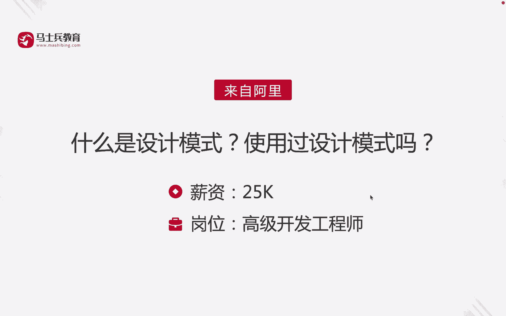
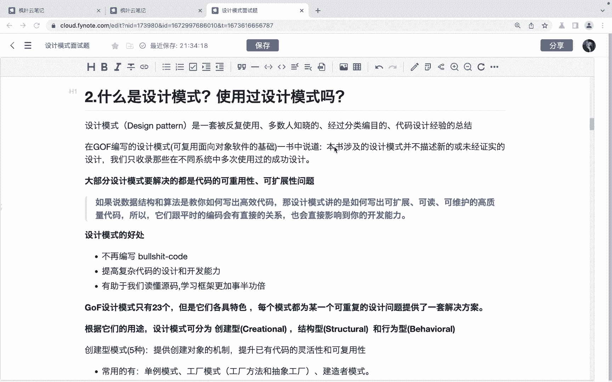
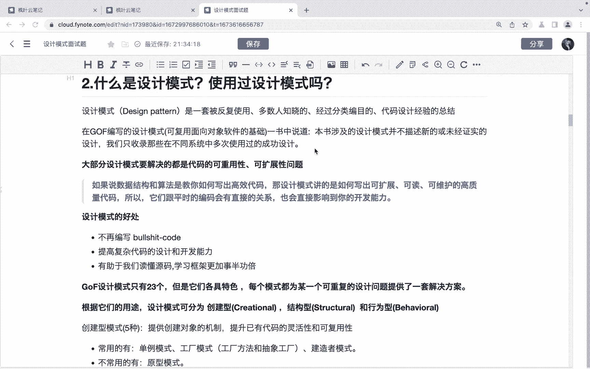
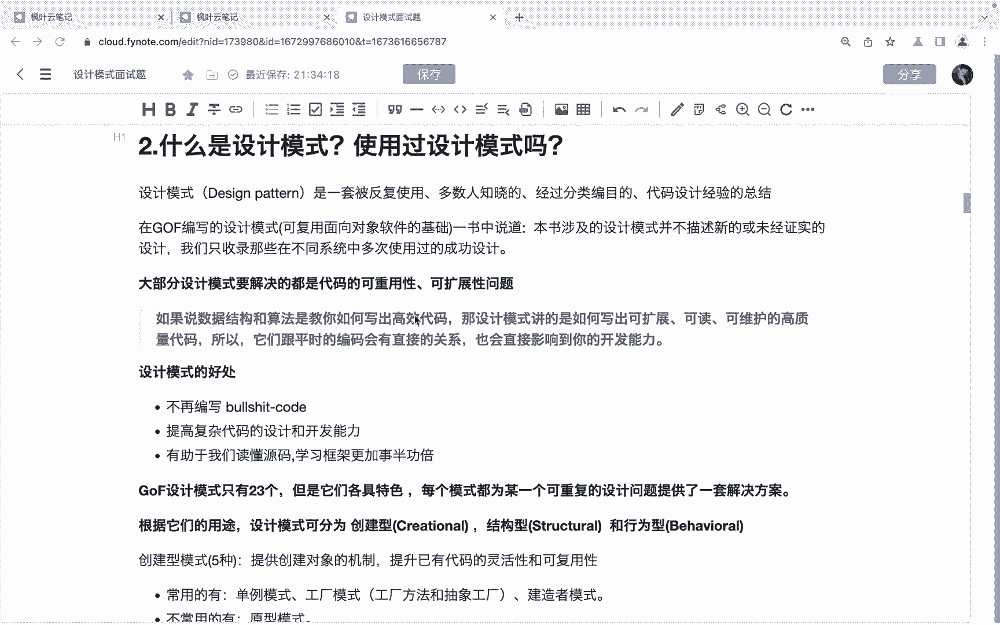
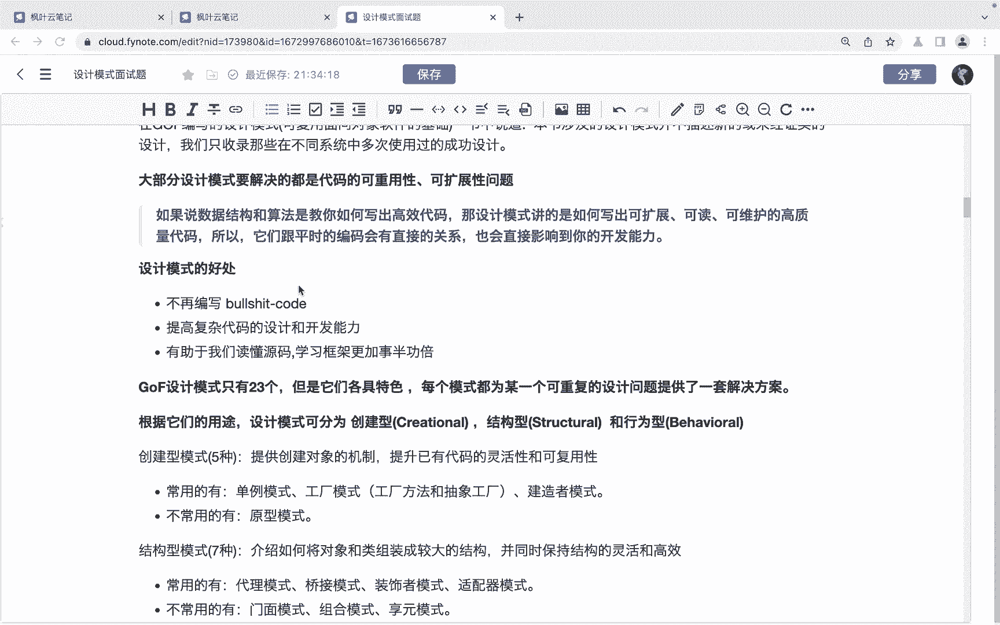
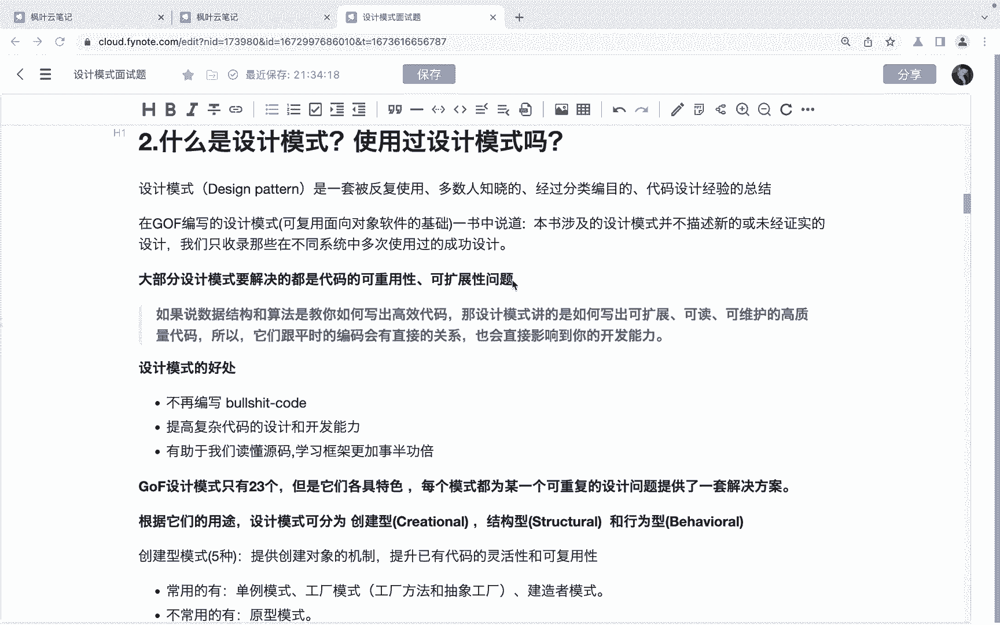
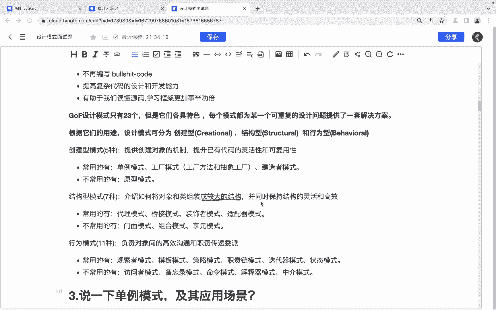
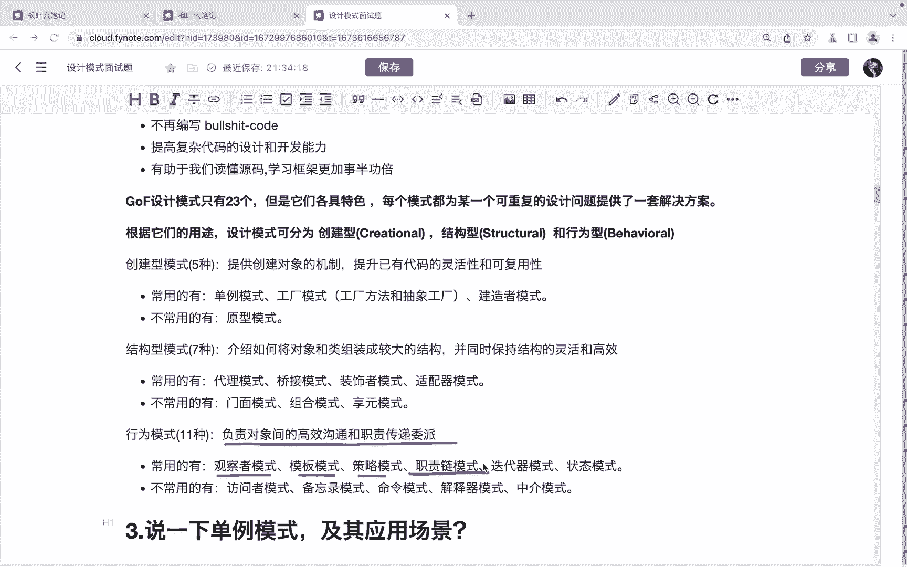
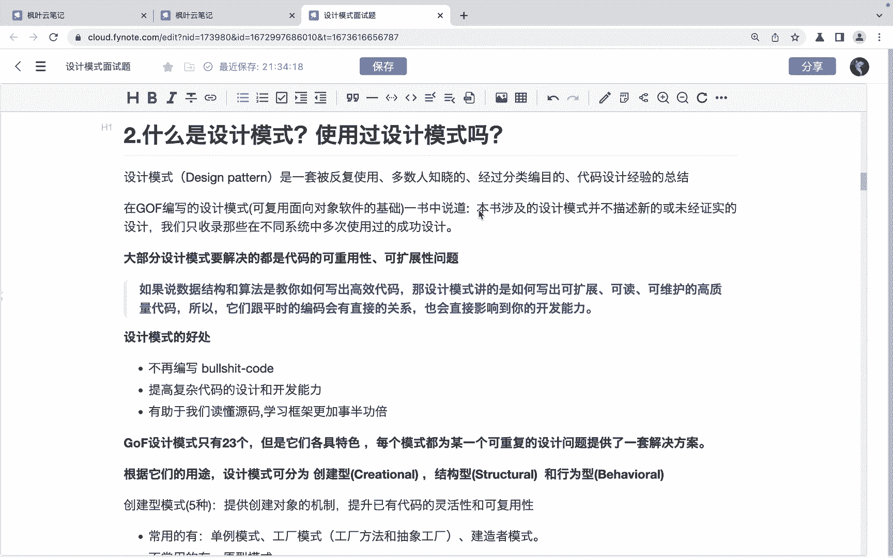

# 马士兵教育MCA架构师课程 - P138：什么是设计模式 使用过设计模式吗 - 马士兵学堂 - BV1RY4y1Q7DL

同学们大家好。接下来呢我们来看一道来自于阿里的面试题。什么是设计模式？使用过设计模式吗？对应的薪资呢是25K，对应的岗位呢是高级开发工程师。😊，那么。首先我们说什么是设计模式呢？

其实设计模式呢它是一套被反复使用，多数人知晓经过分类编目的代码设计经验的总结。在这个设计模式艺术当中呢啊这里边他有提到啊，本书涉及的设计模式并不描述新的或未经证实的设计。

我们只收录那些在不同的系统当中多次使用过的成功的设计。那其实简单来说就是设计模式就是什么呀？😊，这些有经验的同学的代码设计的一个经验的总结。😊。

那么大部分的设计模式呢，它主要解决的都是代码的可重用性和可后展性的一个问题。

设计模式它有一些好处啊，首先呢它可以呃。😊。

我们学习设计模式呢，可以让我们这个嗯不再编写那些什么啊比较烂的代码。第二点呢就是提高这个复杂代码的设计和开发能力。第三呢就是有助于我们去读源码啊，学习一些框架的时候呢啊这个更加的事半功倍啊。

另外呢就是我们还可以介绍一下这个关于这个设计模式，它的一个种类啊，那么。😊。

其实呢设计模式当中呢，它是按照这个。类型的不同来去进行了一个划分啊，根据他们的用途的不同啊，进划分成了不同的类型，包括了创建型模式5种啊有5种。

它的重点就是创建型模式的这些设计和模式都是用来去做创建对象的啊，那么提供了创建对象的机制啊，提升已有代码的灵活性和可用性。😊，啊，比如说常见的单力模式、工厂模式等等啊，还有呢就是结构性模式啊。

结构性模式呢有7种，它呢就是介绍如何将对象和类组装成较大的结构啊，并呢同时保持结构的灵活和高效。😊。

啊，那么通常情况下呢啊比较常用的话呢，是我们呃比如说代理模式、调节模式，这是我们可能在实际开发当中都会用到的对吧？啊，装饰者模式、适频器模式啊这几种。然后呢就是行为模式，它有11种啊。

他负责对象间的高效沟通和职责的传递委派啊，比如说观察者模式模板模式啊，策略模式，还有什么我们的职责链模式等等的一些模式啊好，那回答到这里呢，其实我们就把设计模式给说清楚了啊。

那么还有一个问题就是使用过设计模式嘛。那么同学们可以根据自己在工作当中的经验来去进行回答。如果说没有在这个实际的工程当中没有使用过设计模式的话，那我们可以随便单拎出来一个，比如说单列模式比较好说的啊。

然后我们就介绍一下这个单列模式的一些德性。然后呢啊一些实现方式也是可以的啊。😊。

好，那么以上呢就是关于这道面试题的一个讲解啊，希望呢能够帮助到同学们。

