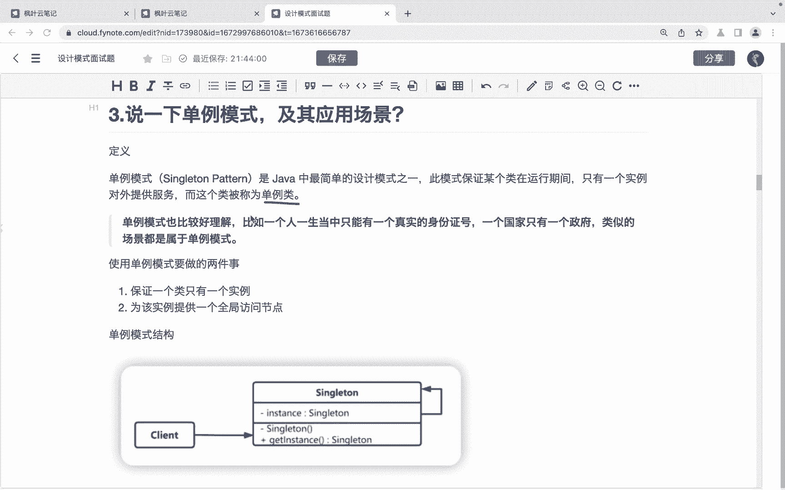
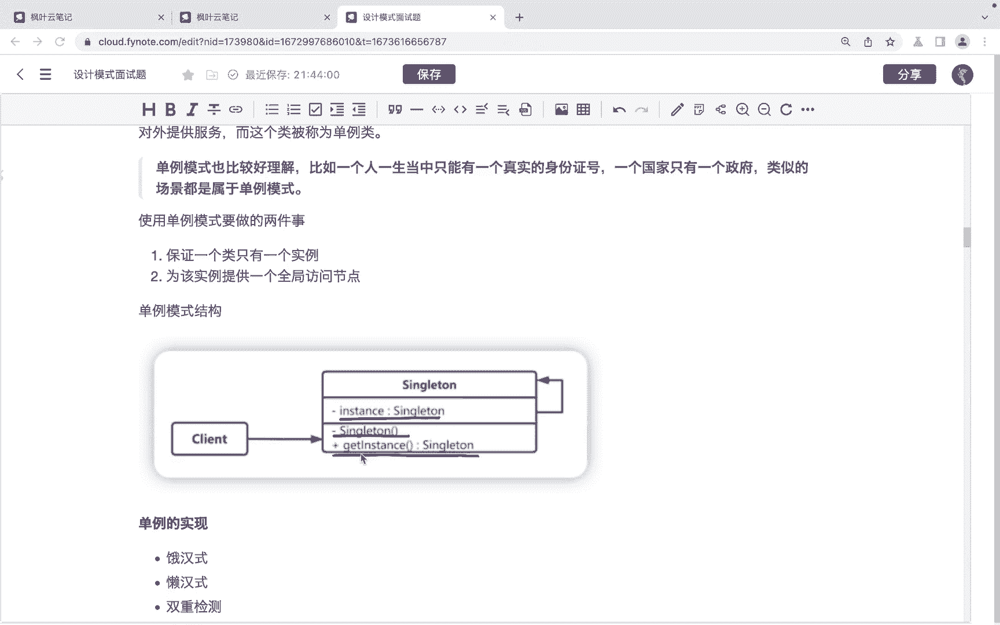
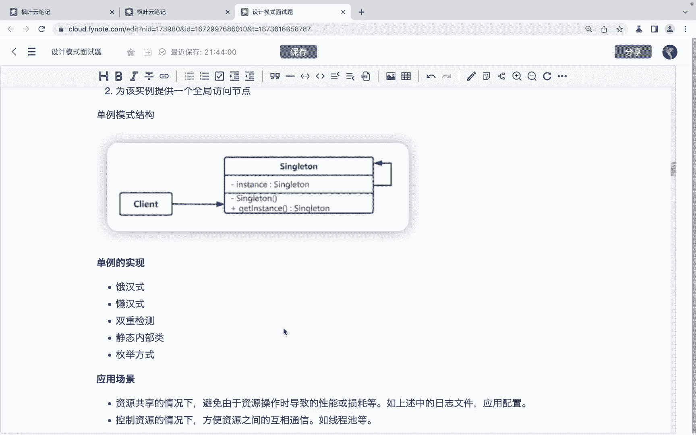
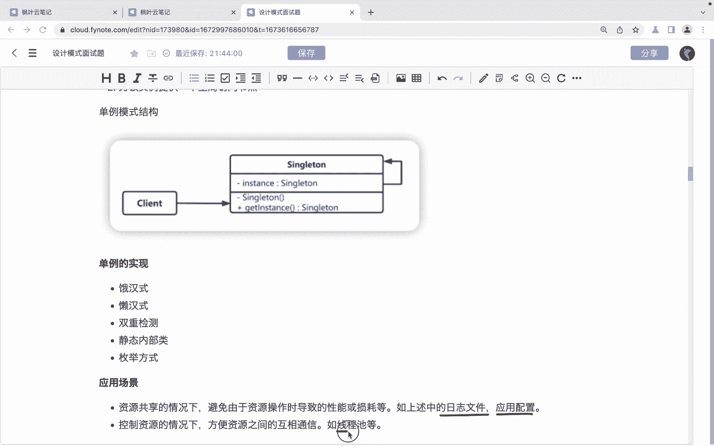
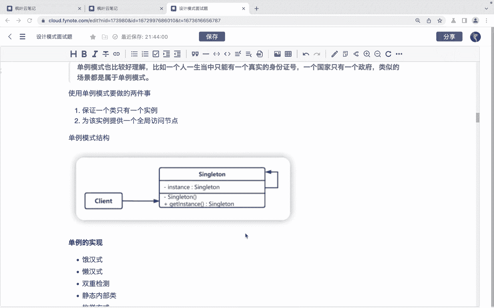
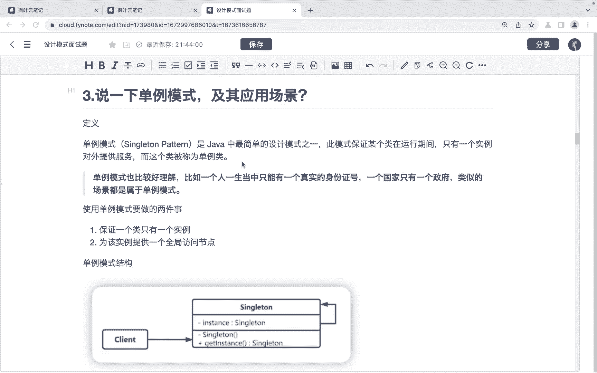

# 系列 6：P139：说一下单例模式，及其应用场景 - 马士兵学堂 - BV1RY4y1Q7DL

同学们大家好。接下来呢我们来看一道来自于美团的面试题，说一下单利模式及其应用场景。😊，对应的薪资呢是25K，对应的岗位是高级开发工程师。首先呢我们先说一下单力模式它的定义啊。

单力模式呢它要保证某某个类在运行期间只有一个实例。对外提供服务。而这个类呢就被称作是一个单粒类。那么。单立模式呢。他也是比较好理解的。比如说一个人呢一辈子他只有一个真实的。这个身份证号，那么。

一个国家呢只有一个政府啊，类似于这种场景呢，都属于单例模式。

那么使用单例模式呢要做的两件事。第一件事呢就是保证一个类只有一个实例。第二呢就是为该实例提供一个全局的访问点啊，怎么去完成这两件事呢？就是我们在设计单例类的时候呢。

我们首先呢要去这个提供一个这样的单例它的一个实例。然后呢要私有化它的。这个构造方法啊，不让外界呢去通过构造方法创建这个单例类的实例。再一个就是既然不能够创建单例类，不能够从外部创建单例类的实力的话呢。

我们就提供一个公共的方法来去获取这个实力啊。单例的这个实力OK啊，然后单例的实际实现的话呢，就包括了。😊。

这个啊扼汗式、懒汗式、双重检测、静态内部类，还有枚举的方式啊，有啊这个这么几种方式。当然其实可能还有其他的方式啊，那么一般的面试的时候呢，可能还会去让大家去对这个这几种方式呢来做一个比较。

那么这几种方式，它的一个区别。那同学们也要去了解那那相对来说比较简单啊，那么再一个就是可能会要求大家去。手写一个单列模式的实现。一般情况下，我们就直接手写一个汉式就可以了啊。

如果遇到这种手写的这种情况的话啊。那么另外就是单力模式的应用场景啊，首先呢资源在这个资源共享的情况下啊，避免由于资源操作时导致的性能和损耗这种场景。比如说日志文件还有应用配置啊，第二个就是。

控制资源的情况下啊，那么方便资源之间的互相通信。那么比如说先证尺啊，都可以用到我们的代理模式。

OK啊，那以上呢就是关于这个啊单力模式和它的应用场景的一个面试题的一个讲解。希望呢能够帮助到同学们。😊。

