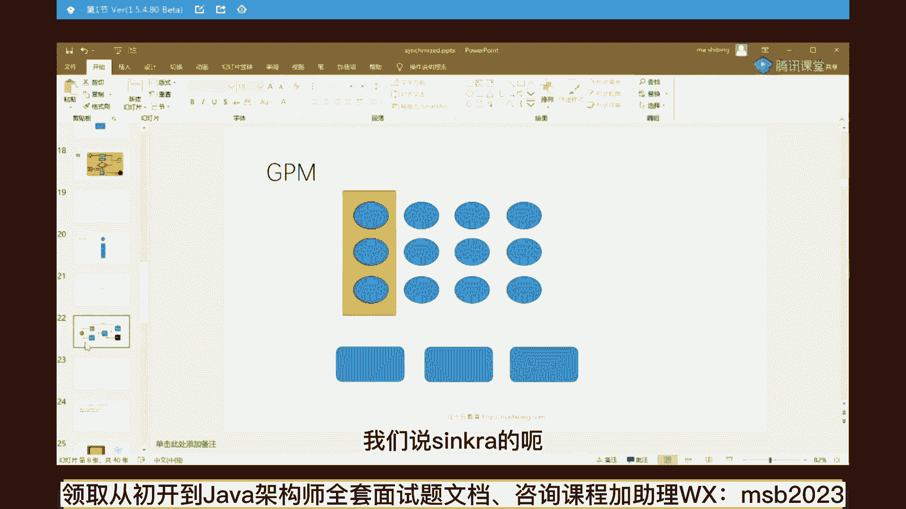
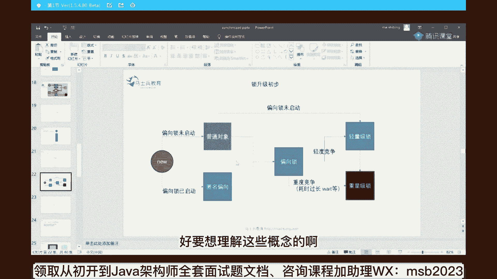
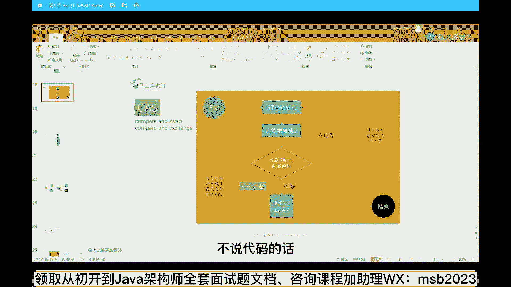
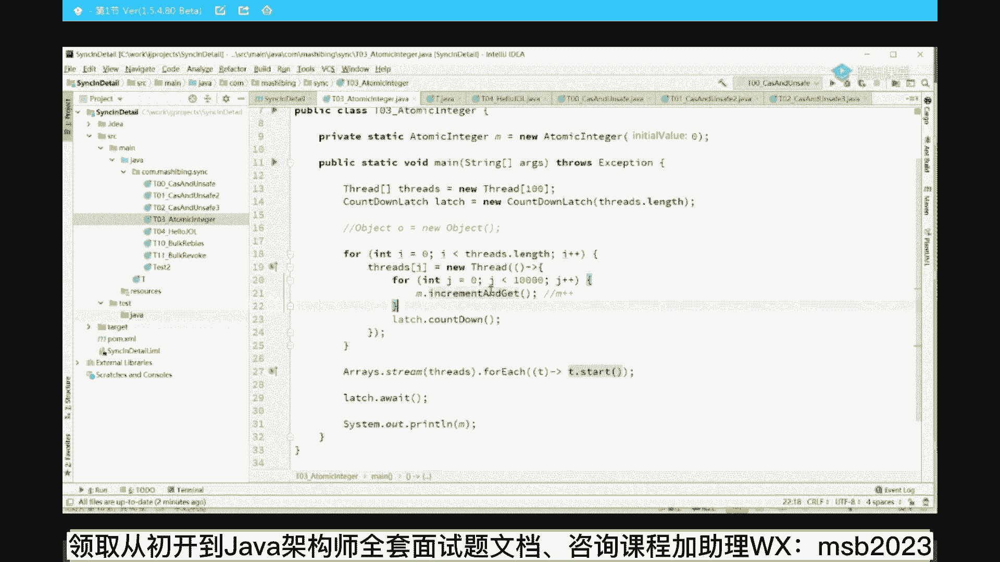
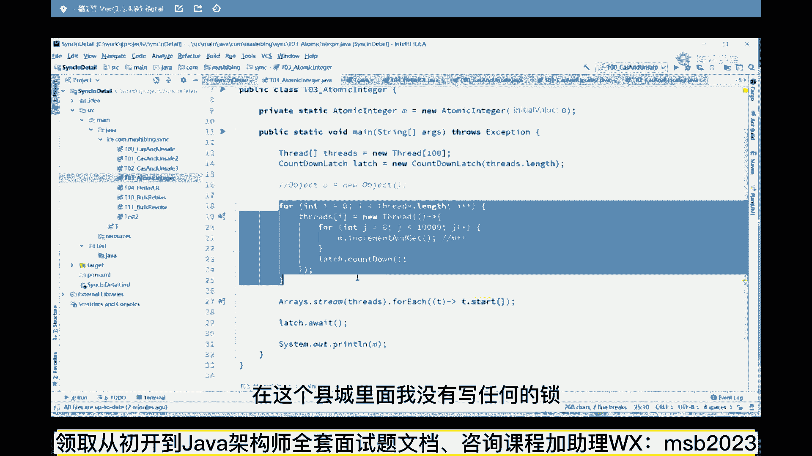
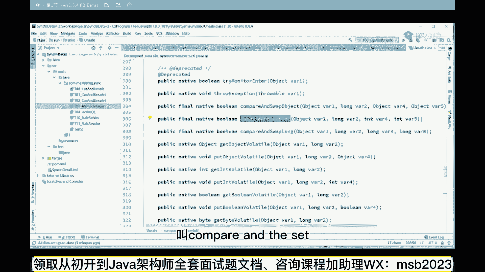
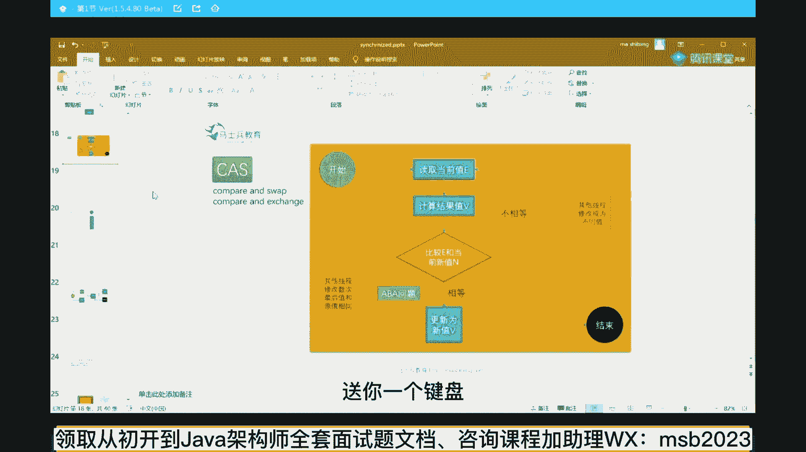

# 系列 6：P14：自旋锁 - 马士兵学堂 - BV1RY4y1Q7DL

好了呃，我刚才也讲了一堆一堆的概念，那么下面呢我们来聊java最底层的这种并发的时，候，对一个数对一个数据的并发的访问，大家都知道啊，作为一个数据的并发的一个访问，能控制这个数据的前后的一致性。

最简单的一个方法呢叫做加synchronized对吧，上锁，关于上锁，这个是面试的重灾区，synchronized，我们首先引入第一个概念，这个synchronized在jdk的1。2之前效率极低。

超级低，效率特别低，为什么特别低，是因为jdk一点二之前，它的内部实现重量级锁，我只要把这名字写出来，你现在是不是能理解什么意思了，就有同学说老师jk一点二之前呢，一定是重量级锁，那什么时候。

难道他最后进行了一个升级吗，没错他后来1。31。4，1。5都对synchront做了一系列的升级，在1。5的时候应该说到1。6的时候，对这个升级应该就比较完善了，后面就没怎么再动过，它的视线。

在后面的一个实现过程里头，它有一个锁升级过程，叫做轻量级锁，升级为重量级锁，它中间有一个升级过程，就是他开始利用了轻量级锁，重量级锁，轻量级锁，现在大家是不是能理解什么概念了，仔细听重量级锁什么意思啊。

重量级锁就是要经过操作系统的管理吗，我再说一遍，操作系统管理就是你要申请这把锁，操作系统的就帮你在自己的内核里面申请好，把你的java的对应的线程给拿过来，放到放到队列里进行管理，需要老大的管理。

而轻量理所的概念就是，我不需要老大哥们儿老大，我不需要你作为我jvm来说，我在我自己的内存空间就完全足以完成，这个叫轻量级锁，好这两个概念能get到的，老师扣个一，现在的面试题就开始问你。

k synchronize，内部的这种轻量级锁到底是怎么实现的，那下面我们就来聊这个过程，好先说最基本的概念，我们说synchronized的呃。

最基本的这种轻量级锁是怎么实现的呢，它有两种轻量级的锁，作为synchronized的内部，它实现了两种轻量级的锁，第一种叫偏向锁，第二种叫轻量级锁，叫自旋锁或者叫自旋锁，好那有同学会说老师啊。

这个偏向锁它真正的是把锁嘛，其实偏向所，严格来讲他不是不是把所它只是个标记，我们一会来讲就行了，好要想理解这些概念的啊。

我们首先来理解最基本的一个概念，这个概念呢叫c a s来听说过这个词的，给老师扣个一，目前j u c的这个包里，jdk一点五之后增加了java的这种concurrent bar，是吧。

嗯j o c这个包里多数的锁的一个实现，比方说lock这个锁，比方说reenterlock，比方说red red lock，比方说psychic barrier，比方说condoledge，好。

这些个时间基本全是用了cs，当然他底层用的是a q s a q s就是一个队列，再加c a s啊，就这个意思，我们先来了解这个cs的最基本的概念，cs的意思是它的全称叫compare and swap。

compare and exchange，有同学说，老师这这这这这这到底是个什么概念呢，它是一把锁吗，首先我们说它是用来替代重量级锁，重量级锁，我们先要了解重量级锁什么概念，重量。

你所说我锁定持有持有这把锁，才能进行一个操作，这个就是我们平时synchronized的一个语义对吧，我持有这把锁，synchronized这把锁，然后才能进行一系列操作，ok，这我来打开代码说吧。

不说代码的话。

好多小同学的基础稍弱啊，到现在大家还能跟上吗，同学们，咳咳，能跟上，你老扣一了，好来看我桌面是吧，看看你桌面，来哈哈，看这里啊，比方说我们做一个最简单的操作，最基本的操作来给大家伙十几秒钟。

你看一下这个小程序，小程序做了一件什么事呢，在这呢我们定义了一个静态的变量，这个变量叫m，然后我起了100个线程，这100个线程每个线程把这个m加1万次，从零开始，m加加循环多少次，循环1万次。

最后整个程序结束之后，我这个m的值正常的情况，100万，这个没问题对吧，那大家想一想，如果这个程序执行完，会不会是100万，看这里跑一下，99万多，原因是什么呀，哎原因是什么，原因非常简单吧。

就是为什么他会比100万少呢，是因为我们多线程做并发的时候，往往会发生这样一种情况，所以这个m这个值我第一个线程来了，把这个m的值，比方说他现在是100，我读过来把它改成101，我还没有往回写的时候。

另外一个线程同时把这个100夺走了，他也改成101m加加嘛，然后你也往回写，我也往回写，你写了一个101，我也把这个101写回去，相当于我们加了两次，本来应该是102了，可是现在只有101少了。

这是因为多线程访问的时候没有做同步，那最简单的一种方式怎么能做同步呢，怎么做同步啊，最简单的就是上锁嘛，对不对，volatile是不行的啊，不用不用看volatile，最简单就是上锁吗。

synchronized吗，就是我我每一个代码执行的过程中，保证只有一个线程中运行上锁synchronized，这个肯定没问题，因为，我保证我加完了之后，另外一个线程才能继续运行。

哈哈我这个线程给他加完了，加完了之后，另外一个线程才能继续运行，这样的话呢，保证最后的结果一定是准确的，必须你要想加下一个，值得等我加完，我加完之后，你另外一个电脑都能运行了，ok上锁。

可是如果这个锁是重量级的锁，其实它的效率并不高，我再强调一遍，为什么，原因是它要经过操作系统老大的一个调度，那么除了这种方式之外，我估计有很多同学应该是能知道这个方式的，这个方式没有锁，仔细看一下。

我没有写任何的synchronized，在这个县城里面，我没有写任何的锁。

我干了一件什么事呢，我用了一个atomic integer，atomic原子的原子原子类，这个类型的应该比较常见了，这块大家是不是应该还能跟上了，能跟上的给老师扣个一了，其实这个内容挺多的啊。

也是对那个零基础的稍微有点不友好嗯，但是你也听听是吧，打开你的新空间，你又能理解呢哦原来外面还有这么多空间，你可以提升好看。

这里atomic integer m等于new一个atomic energy 0，在这呢我们并没有对m加加这种操作，并没有给他上锁，它只是调用内部的一个叫m点。

increment and get好inquirement that get，有同学说老师您在讲cs啊，没事讲这个程序干嘛，我们下面就来看看这个m点，increment get它外面没有加锁。

它是不是里边加锁了，点进去你会发现这个increment and get，调用了on safe这个类的，get and at it跟进去，你会发现get at at int这个方法。

它调用了compare and swap it，ok点进去，然后你可以发现他是native代码，就是c加加的一个实现了，好那从这你能看出来，至少是它内部用什么实现，他们内部并没有上锁。

并没有写synchronized的r用的是c a s好，这就是cs全称，cs全称叫compare and swap，比较并交换compare and sweat。

当然它还有一些别的叫法叫compare and set。

比较并设置一样的，当然还有一种叫法呢，这个稍微的不常见一些叫compare and exchange，因为swap本身也是exchange的意思，好多好多底层的源码。

他用的就是compare and exchange，无所谓，他叫啥没关系，反正还是一本菜，它叫c a s好，下面我们来聊一聊cs到底是个什么操作，cs是怎么能实现那种不需要上锁，不需要那种重量级的锁。

就能够做同步的，你仔细听，这里面隐藏着很多很多的面试的问题，好我们先说cs的概念是个什么概念，举个例子，还是那个值那个m值，原来这个值是零，我现在不想上锁，也能保证这个数据前后一致。

不会出现那种多线程并发访问下的，数据不一致的问题，怎么办呢，我第一个线程拿过它来之后，把它改成一，改成一之后，我往回把这个一往回写的过程，我首先进行比较，compare，比较什么呢。

比较的是a我写的时候，这个时候的这个值是不是依然为零，这个很重要，哥们儿，你是不是依然为零，依然为零代表什么概念，就代表着没在，我把这个改成一，在王辉写的这个过程之中，没有任何其他线程改过这个值。

那没有改过，我当然可以放心的把它给更新成一了，就我就把它改成一了，ok那有同学会说，老师这个过程你确实没有上锁，可是你在compare exchange的时候，万一中间有人把它给改过了吗。

已经改成二了呢，那没有关系，你发现你往回写的过程之中，它不是不为零，说明啥，说明有人已经把它改过了，有人把它改过了的话，那我就把这个二重新再读出来，把它改成三，然后把这个三往回写。

往回写的过程看看它是不是依然为二，ok，如果依然为二，说明没有人改过他，我就可以直接都威胁，那有同学说不成，有人改成八了，没关系，我把这八改过来，改成九九，往回写的时候看看他是不是依然为八。

一直到成功为止，就跟他转圈，它是一个while循环，well，你只要跟原值进行比较，我就给你设置好，如果我跟原值不一样，我就继续循环，ok这个就叫乐观锁，或者叫自选所，或者叫轻量级所。

它轻量的原因是他们不需要经过操作系，老大的重量，你所的支持，我在用户空间进行while循环就可以搞定了，会不会死，循环不会的，因为总是能成功，总有一次能成功，别的线程执行完了，我不就成了吗。

比较完了之后改了呢，对你说的非常对应，a b a问题，对你们说的非常对应，这个概念，讲完之后，我们主要讲两个，这里面面试中两个问题，第一个是a b a问题。

第二个是compared swap本身的原子性，刚才这个概念能get到的，给老师扣一，什么叫cs其实很简单，我几句话就能解释清楚，就是每次往回写这个值的时候，看看这个值是不是被别人给变过。

当然这里面隐藏着两弹面试中的重要问题啊，好好听，第一代问题是如果发生了这样一种情况，这是那个值，不管它是什么，我把它改完，改完之后，我往回写，我们写的过程之中，其实中间已经经历了别的过程。

什么叫有一个线程把它从零改成了一，又有一个线程把它从一改回改回成零，所以这个零看上去依然是原来那个零，可是很不幸的是，它也不是原来那个零了，他是中间被人改过去又改回来的，从a改成了b又改回成a的。

这就是著名的aba问题，a aba问题的意思非常简单，一个小比喻，就是你你你你你这是你女朋友离开你的状态，然后呢，你女朋友经历了别的男人又分手了，回来之后你怎么知道他经历了别的男人呢。

怎么才能知道这个当然是选择那个呃，当然当然是选择原谅了是吧，哎这个时候加版本号就可以加version，这是最简单的解决方案，你别他，你在他脑门上写一半码号，你离开的时候是一点。

中间经历了别的男人回来之后呢，晚上写了99点，very good，那说明呢经历了一些人，ok，好这个呢就是aba问题，b问题非常简单，就是加一个版本号就可以，这问题能理解的同学给老师扣一。

他回来依然是一点啊，你很好是吧，正在等着你，但你是99点了，已经太过分了啊，好看这里我们说第二个问题，第二个问题才是一个深层次的问题，第一个问题很简单啊，那个java里面有自身。

有好多好多现成的类都能支持呃，stamp，这叫全称叫什么来着，stamp，那个那个那个那个那个那个那个那个那个，突然之间就忘了，好，先不管它啊，就是加一个版本号，加一个时间戳就可以对。

atomic stm reference，没错啊，假发抄你，你记得你记得很好，送你一个键盘啊。

