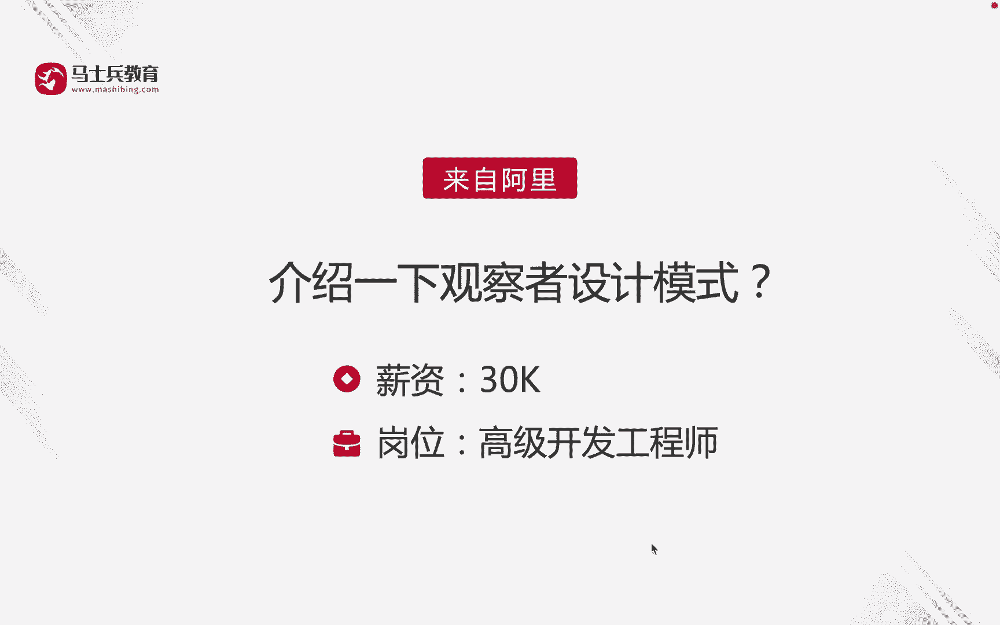
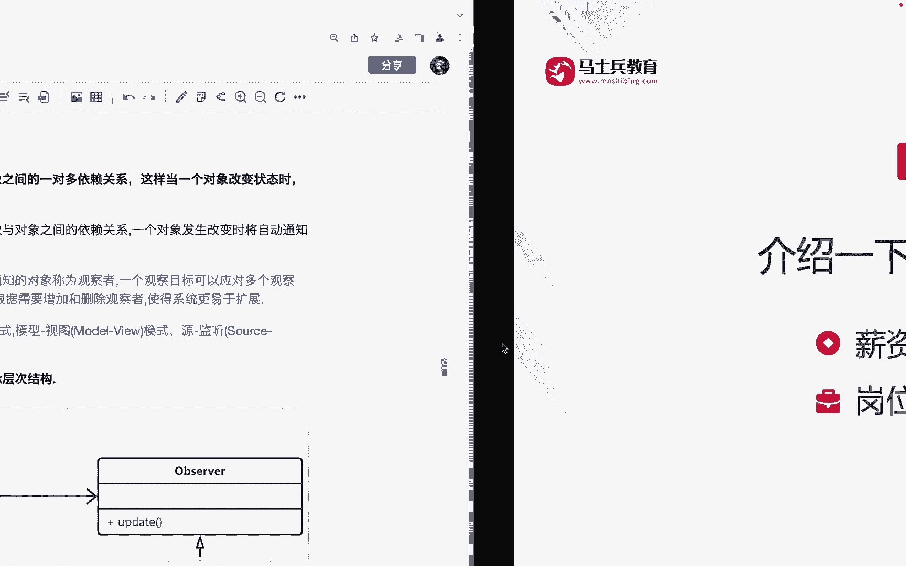
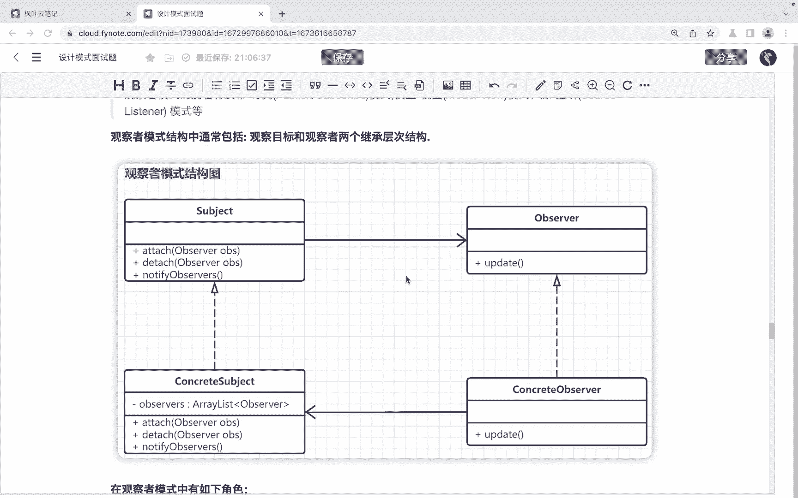
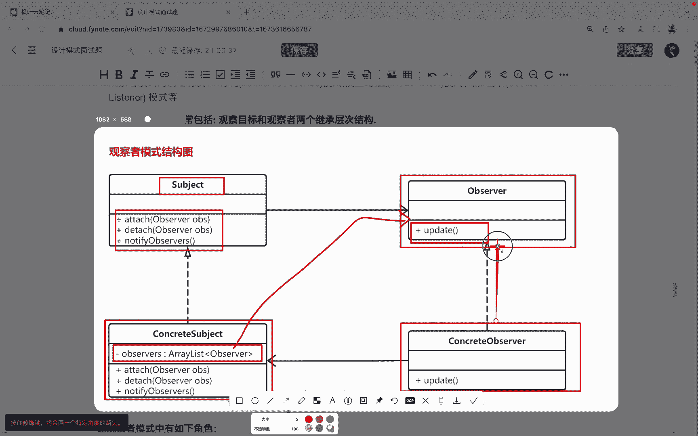
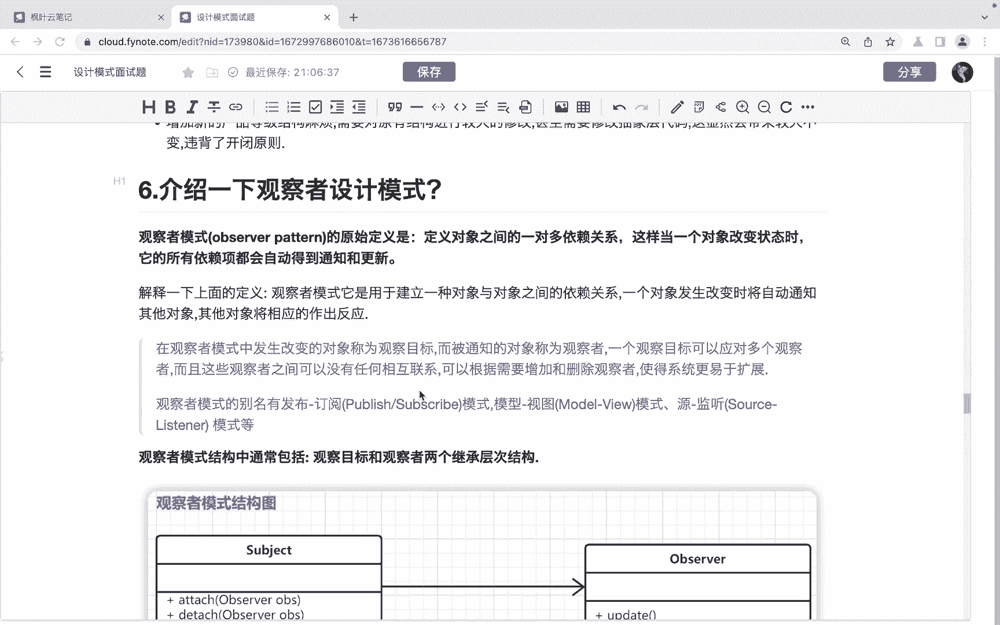

# 马士兵教育MCA架构师课程 - P142：介绍一下观察者设计模式 - 马士兵学堂 - BV1RY4y1Q7DL

同学们大家好，接下来呢我们来看一道来自于阿里的面试题。😊。

介绍一下观察者设计模式。对应的薪资呢是30K，对应的岗位是高级开发工程师。

观察者模式的原始定义是它用于定义对象之间的一对多依赖关系。这样呢当一个对象改变状态时。他的所有的依赖项呢都会自动的得到通知和更新。那么其实观察者模式呢，它就是用于建立一种对象与对象之间的依赖关系的。

当一个对象发生改变时，将自动通知其他对象。那么其他对象呢将相应的做出反应。在这个观察者模式当中呢，发生改变的对象呢，我们把它称之为观察目标。而被通知的对象呢，我们把它称之为观察者。

一个观察目标它是可以对应多个观察者的。而且呢这些观察者之间呢可以没有任何的联系。我们可以根据需要增加和删除观察者，使得我们的系统呢更易于扩展。😊，那么我们可以看到啊，在观察者模式当中呢。

它其实包含了观察目标和观察者两个基成层次结构。那在这里呢。

首先呢我们是可以看到这里。这个s这呢它其实就是一个抽象的被观察者。然后在被观察者当中呢有三个方法，第一个方法呢是用来去添加观察者的。第二个呢是用来移除观察者的。第三个呢是它是一个啊通知方法啊。

它是一个通知方法。那么啊这个方法呢，它是用来去这个啊便利咱们的观察者集合，然后调用每一个观察者的它的响用方法的啊，那么在这里边呢，我们在这个。😊，观察者的这个抽象的这个被观察者，他的这个子类。

也就是具体的被观察者里边呢，它是有一个集合的。大家看到这个集合当中所装的就是这个观察者的对象啊，那么还是一样，这边呢也是一个抽象的，有这样一个抽象的观察者，它这里边有一个。😊。

update这样的一个方法，对吧？有这样的一个up方法。那么呃这个方法呢，它是为不同的观察者的这种更新的行为呢去定义一个统一的接口。然后呢，不同的观察者。

也就是我们下边的具体的这个观察者可以对这个方法呢啊做什么做这个不同的不同的实现啊，不同的实现。好，那么。😊。

接下来我们再来看一下观察者的他的优缺点啊。首先呢观察者的模式的优点啊，它降低了目标和观察者之间的偶合关系。两者之间是抽象的耦合关系。😊，还有就是被观察者啊发送通知，所有注册的观察者呢都会收到信息。

这样呢就可以实现一个广播机制。啊，它的缺点就是如果说我们的观察者非常多的话，那么所有的观察者收到被观察者发送通知的时候会耗时比较多。😊，第二点呢就是如果被观察者如果有是有这个循环依赖的话呢。

那么被观察者发送通知会什么呀？使这个观察者。产生循环调用，导致咱们的系统出现问题啊。那么观察者模式常见的场景。包括了以下几个啊，当一个对象状态的改变，需要改变其他对象的时候。可以采用观察的模式。

比如说商品库存数量发生改变的时候，需要通知商品详情页啊，购物车等系统改变数量。再一个就是一个对象发生改变时，只想要发送通知，而不需要通知道什么接收者是谁这种情况啊，比如说这种订阅微信公众号的文章啊。

发送者发送者呢通过公众号发送订阅者呢并不知道哪些用户订阅了公众号啊。第二个呢就是第三个呢就是需要创建一种链式触发机制的时候，比如说啊在系统当中触发一个创建一个触发链。

那么A对象的行为呢将影响B对象B对象的行为呢影响C对象。这个时候呢，我们可以采用观察者模式。😊，第四个的话呢就是微博或者微信朋友圈发送的场景，这个也是观察模式比较典型的一个场景了啊。

那么一个人发微博的话呢，呃或者是朋友圈，只要关关联的朋友都会得到通知。一旦取消呢，那么这个人以后呢就不会接到相应的通知了。😊，这是我们说观察者模式的使用场景。OK以上呢其实就是对于这道面试题啊。

介绍一下观察者模式的这个讲解啊，希望呢能够帮助到同学们。😊。

