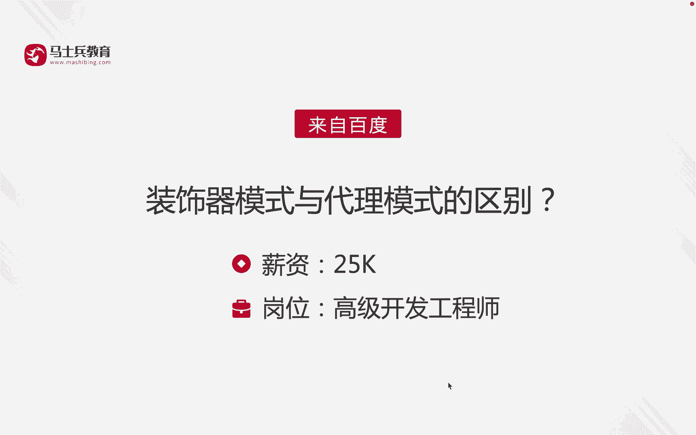
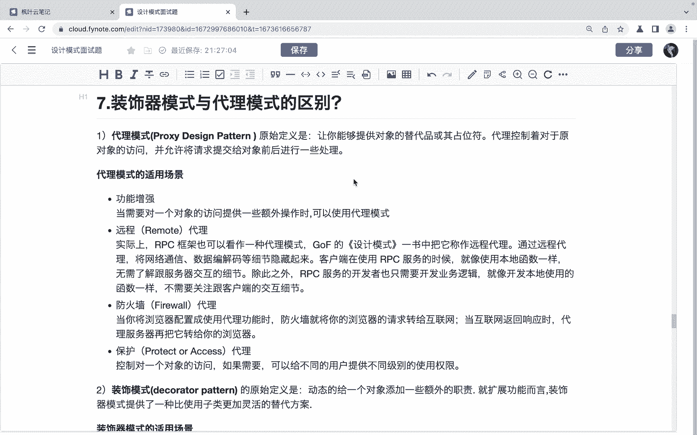
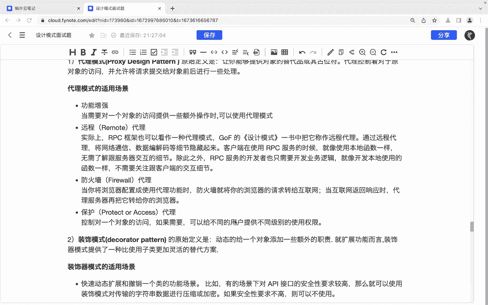
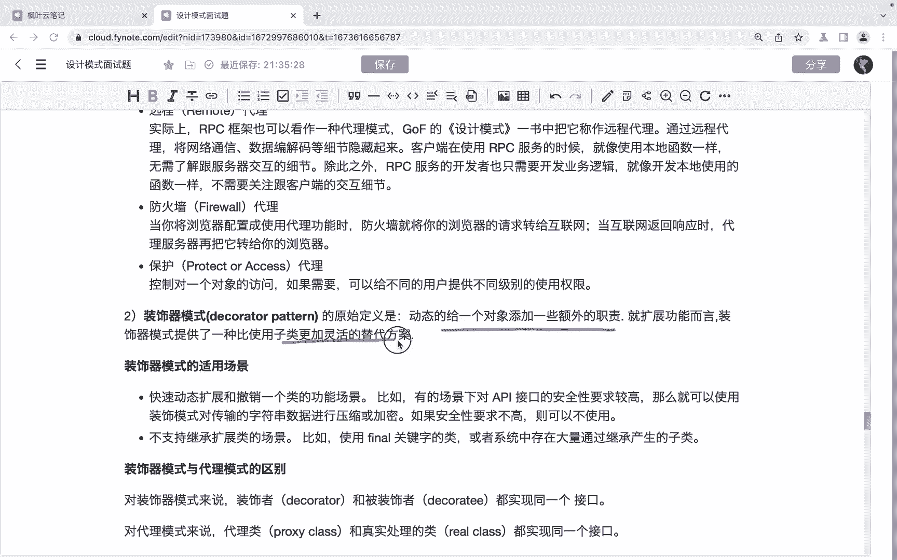
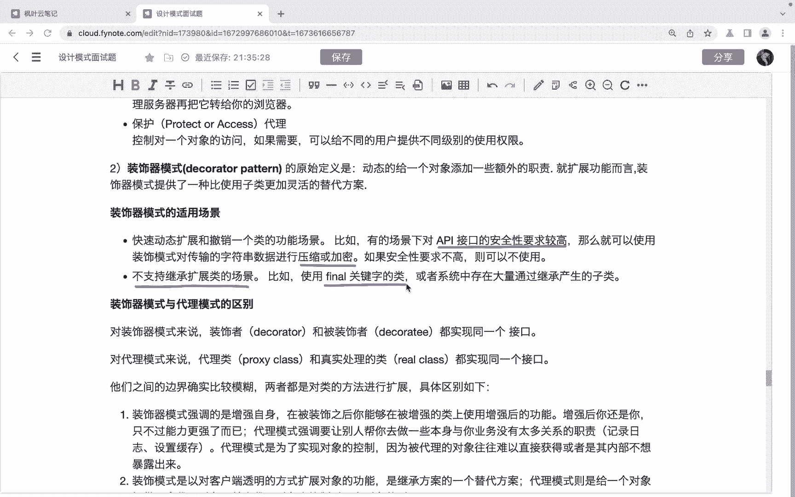
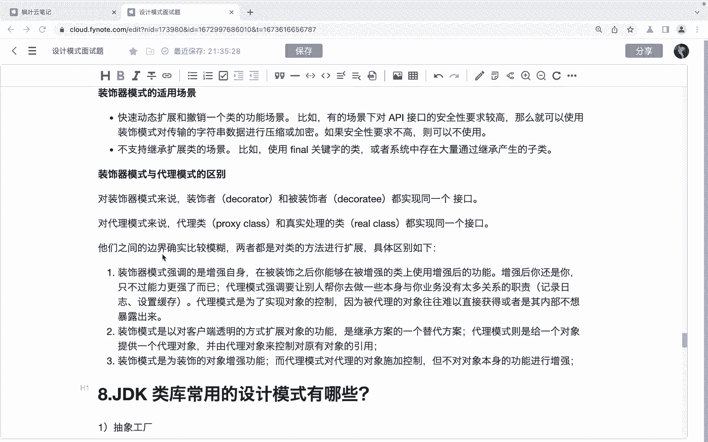
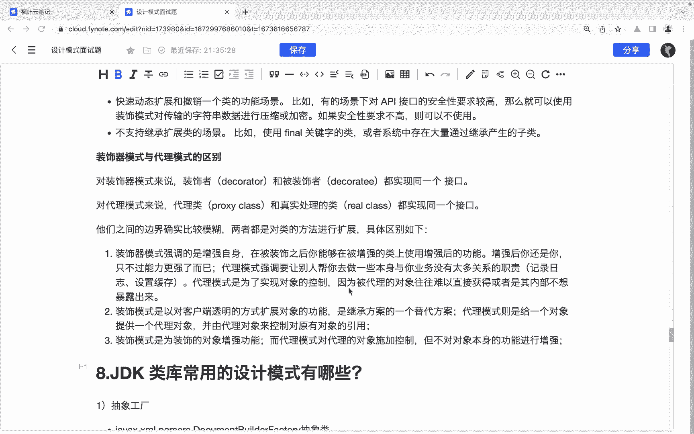
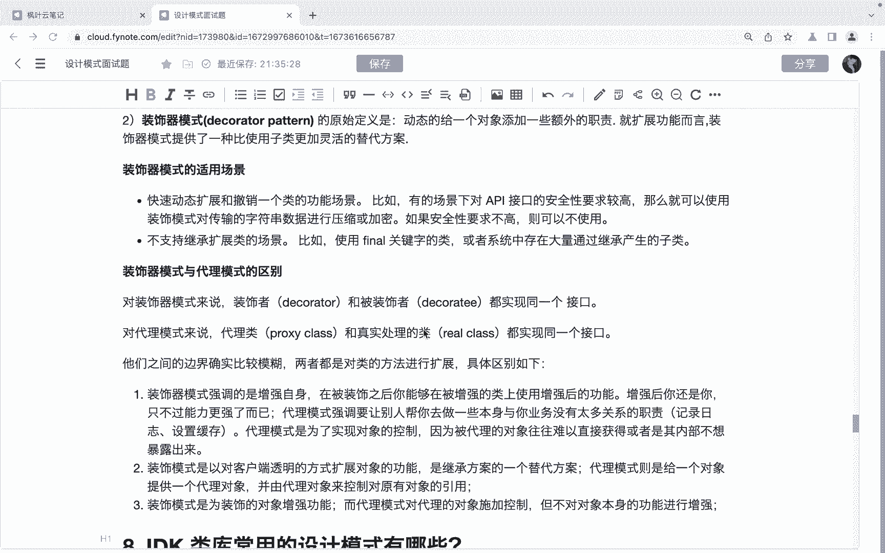

# 系列 6：P143：装饰器模式与代理模式的区别 - 马士兵学堂 - BV1RY4y1Q7DL

同学们，大家好。接下来呢我们来看一道来自于百度的面试题。😊，装饰器模式与代理模式的区别，对应的薪资呢是25K，对应的岗位是高级开发工程师。那么首先我们先来看代理模式。代理模式呢。

是这个它的原始定义是让你能够提供对象的替代品和其暂位符啊或其在位符。那么代理控制着对于原对象的访问，并允许将请求提交给对象前后进行一些处理。其实我们这个代理对象呢，它的一个作用呢就是用来去啊代理一个啊。

我们不希望什么呀？这个不适合或者是不能够直接引用的一个目标对象。然后呢把代理对象呢作为访问对象和目标对象之间的一个中介。

那么代理模式它适用的场景呢有这么几个。首先呢第一个是功能增强。啊，当需要对一个对象的访问提供一些额外操作的时候，我们可以啊使用代理模式。还有一种是远程的代理。😊，那么实际上呢，这种IPC框架呢。

也可以看出是一种代理模式。啊，golf的设计模式一术当中呢，把它称作叫做远程代理。那么通过远程代理呢，将网络通信、数据编码、这个数据编解码等细节呢给它隐藏起来。客户端在使用这个IPC服务的时候呢。

就像使用这个本地函数一样，无需了解跟服务器交互的一个细节啊。😊，还有就是防火墙代理。啊，当你将这个浏览器配置成使用代理功能的时候呢，防火墙就将你的浏览器的请求呢给它转给互联网，对吧？

当这个互联网返回响应的时候呢，代理服务器呢再把它转给你的浏览器。还有呢就是一个保护代理啊，它可以用于控制一个对象的访问。如果需要呢，可以给不同的用户呢提供这种不同不同级别的级别的这种的使用权限啊。

然后我们再来看一下装置。😊。

装饰模式啊或者装饰器模式啊，装饰器模式。那么它的原始定义是动态的给一个对象添加一些额外的职责啊，就扩展功能而言呢，装饰装饰器模式呢提供了一种比使用子类更加灵活的替代方案。

其实装饰器模式呢主要还是用来去替代这种啊子类的啊，就替代这种继承的啊，那么。😊。

呃，装装饰器模式的适用场景呢包括了啊快速的动态扩展和撤销一个类的功能场景。比如说有的场景下对API接口的安全性要求比较高，那么就可以使用装饰器模式，对传输的字符串数据进行压缩或者加密啊。

还有呢就是在一种在这种的不支持继承扩展类的这种场景，对吧？比如说我们这个使用了final关键字的这种类，它就是无法继承的对吧？好，那么那么最后我们来看一下装饰器模式和代理模式的一个区别。

对于装饰器模式来说呢，这个。😊。

装饰者和被装饰者呢都实现同一个接口。都实现同一个接口。而对于代理模式来说呢啊代理类和真实的处理类它都实现什么呀？同一个接口啊，那么从这上面来看呢，他们之间呢好像这个呃。😊。

他们的定义的边界呢是比较模糊的。但是呢啊。😊。

我们可以看一下他们的一个。具体的区别啊。首先呢这个装饰性模式呢，它强调的其实是增强自身自身啊，在被装饰之后呢，你能够在被增强的类上使用增强后的功能。那增强后的你呢，其实还是你，只不过呢你的能力更强了。

而代理模式不一样，代理模式强调的是让别人帮你去做一些你本一些什么本身与你业务没有关系的一些资责。比如说记录日志啊，设置缓存呢这些。😊，啊，那么代理模式呢是为了实现对象的控制啊实现对象的控制。

因为呢被代理对象呢往往是难以直接获得，或者是其内部呢不想被他暴露出来，OK吧，这是他们之间第一个区别。😊，然后第二点就是啊这个装置性模式呢是以对客户端透明的方式去什么呀？扩展对象的功能。

是继承方案的一个替代方案。而代理模式呢则是给一个对象提供一个代理对象，并由代理对象控制对原有对象的一个引用。OK吧，还是我们代理模式呢，它更强调的是控制，对吧？那么装第三点啊。

装饰器模式呢啊是为装饰的对象呢增强功能，而代理模式呢是对什么呀？对这个啊。代理的对象去施加控制啊，一个是增强功能，一个是私加控制。对吧啊，好，那么这是我们说装饰器模式和代理模式的一个区别啊。

以上呢就是针对于这道面试题的讲解啊，希望呢能够帮助到同学们。😊。

