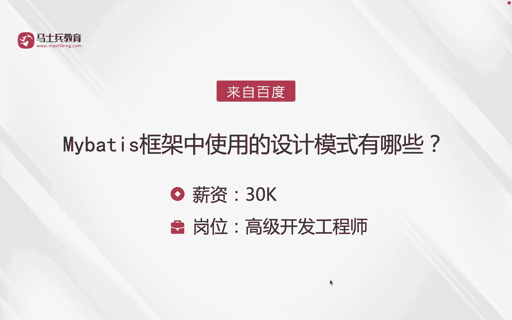
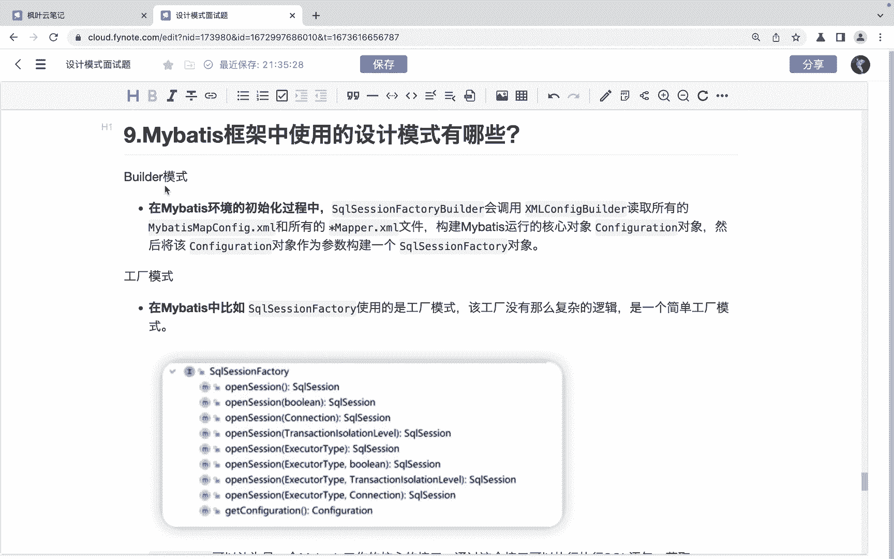
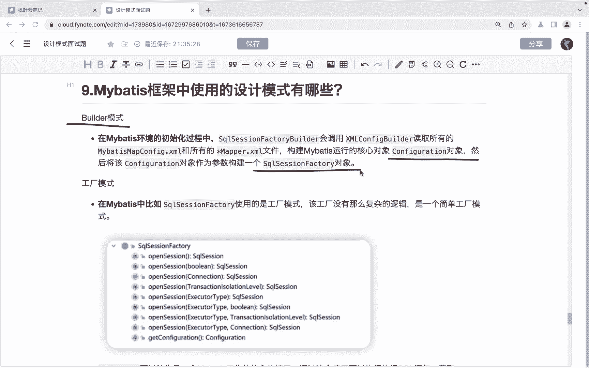
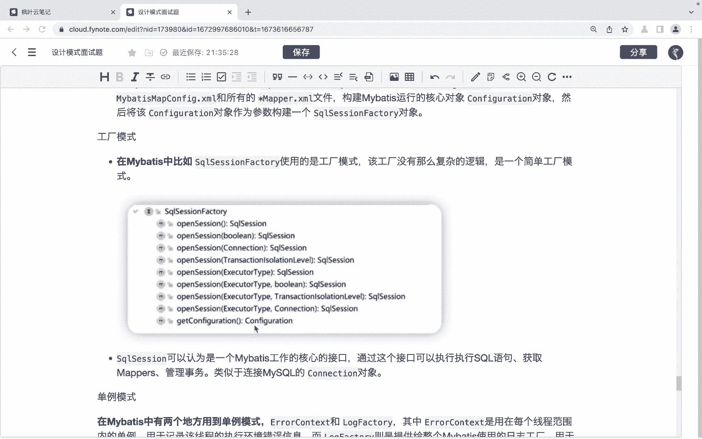
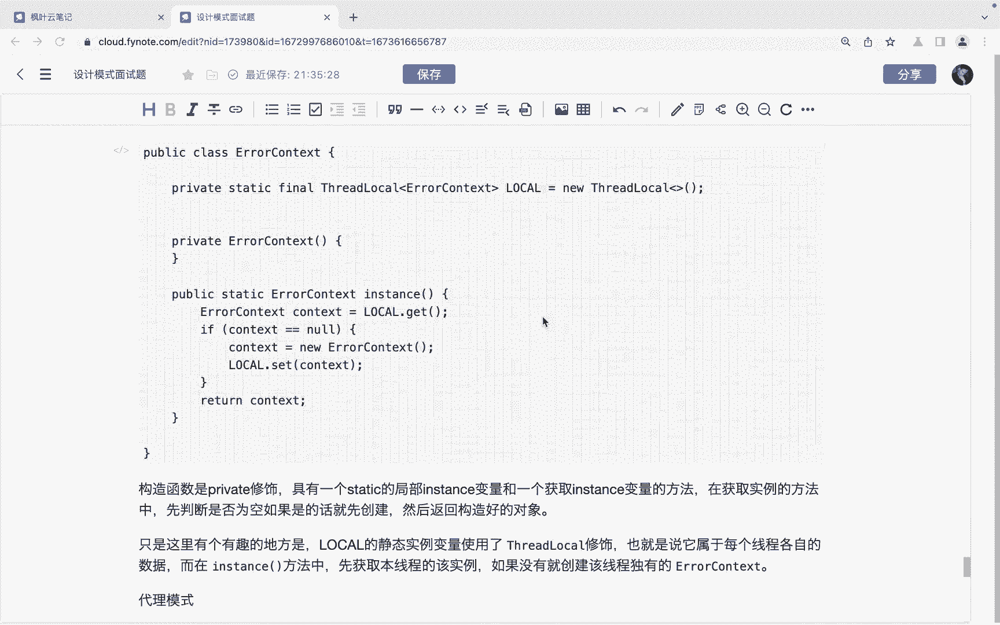
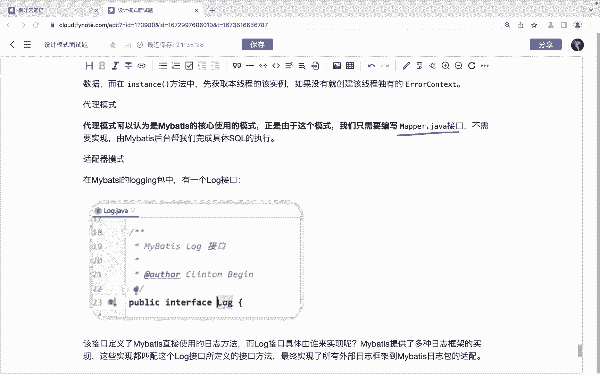
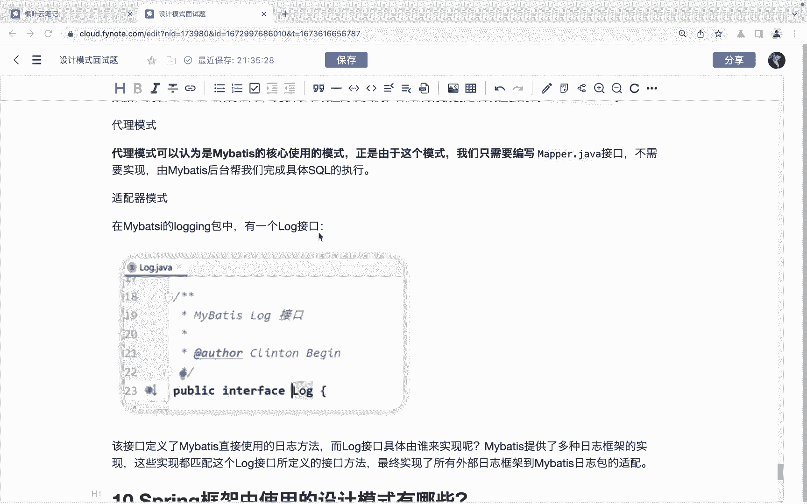
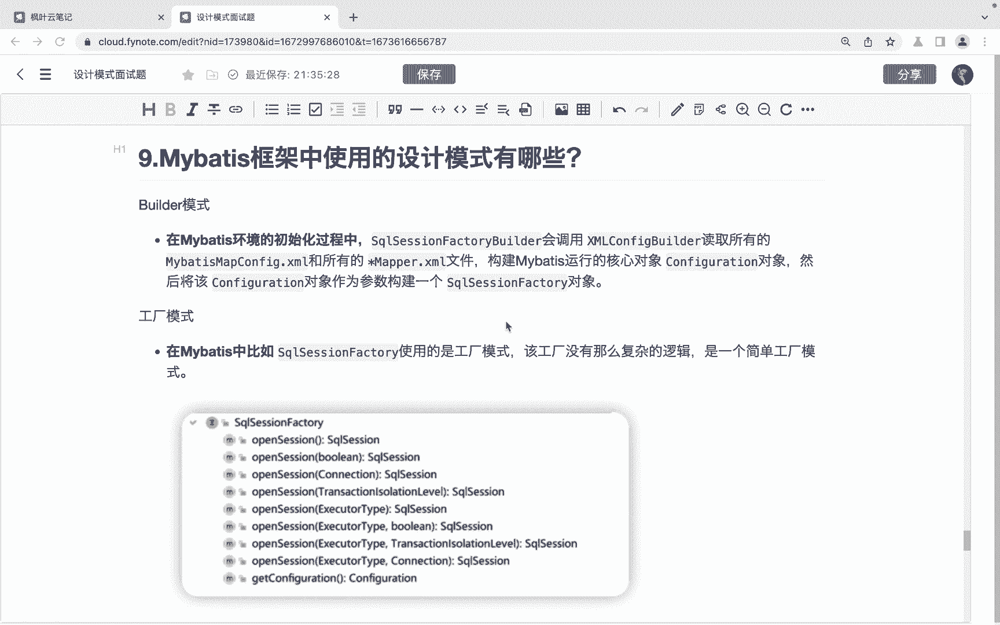

# 马士兵教育MCA架构师课程 - P145：Mybatis框架中使用的设计模式有哪些 - 马士兵学堂 - BV1RY4y1Q7DL

同学们大家好，接下来我们来看一道来自于百度的面试题。😊，买 base框架中使用的设计模式有哪些？对应的薪资呢是30K，对应的岗位是高级开发工程师。那么首先我们先来看第一个就是build模式。

build模式。那么在myb的环境的初始化过程当中呢，这个circle session factory builder会调用这个叉m configurefi build读取所有的myb map map configurefi点叉m和所有的这个m文件。

那么去构建my base运行的核心对象，就是configuration这个对象。然后呢将这个configuration对象呢作为参数构建一个什么啊circle sessionfactor对象。

这是我们说的buil模式。然后呢。😊。

是工厂模式。工厂模式呢，在买贝斯当中呢，它比如说这里边有一个circle session factory，它使用的就是工厂模式啊，那么它其实就是一个简单的工厂模式啊。

那么circle session可以认为是买贝斯工作的核心接口。那么通过这个接口呢可以执行这个circle语句获取mper啊管理事务等等的。那么我们就是通过这个。😊。

circle session factory来去获取这个什么来去获取这个circle session啊，还有就是单列模式。在买 base词当中呢，有两个地方用到了单列模式，一个是i contest。

一个是log factory啊，factor啊，那么i contest呢，它是用在每个县程范围内的单列啊。

用于记录这个该线程执行的环境的执行环境错误信息而log factory呢它是提供给整个买 base去使用的日志工厂啊，那么这是单列模式。😊。

然后呢，还有就是这个代理模式。那么代理模式呢，我们可以把它认为是买b的核心使用的模式。正是因为有这个模式呢，我们只需要编写麦搏接口，不需要编写这个实现。

而是由什么咱们买b后台帮助我们去啊完成这种啊具体的scle的执行。其实它使用的就是这种代理模式啊，然后呢还有就是识配型模式了啊，那么在买b的这个loging包中有一个loggo接口啊，那么这个。😊。

接口当中呢定义了买b直接使用日志的一些方法啊，那么而log接口它的具体是由来由谁来实现呢？那么买b呢提供了多种日志框架的实现。😊，啊，那么这些实践呢都匹配这个loggo接口所定义的方法。啊。

那么最终的话呢就是实现了所有的外部日志框架呢到买b日志包的一个适配啊，这是适配器模式。

OK以上呢就是对于这个买杯子框架当中的设计模式有哪些的一个讲解啊，希望呢能够帮助到同学们。😊。

