# 马士兵教育MCA架构师课程 - P15：compare and set（不具备原子性） - 马士兵学堂 - BV1RY4y1Q7DL

好看，这里其实最关键的是在于这就是compare and set，到底具不具有原则性，这是什么意思，好听同学们，你们想看，作为一个从零，然后把它改成一，又把一写回零的过程，注意写回零这个操作。

往回写的这个操作，这个操作是什么操作呀，这个操作叫compare and set，也就是说它是它有两步，第一步是什么，第一步是判断哥们儿，你是不是现在这个值是不是依然为零，唉如果你是依然为零的话。

那么我这个时候把你从零变成一，注意这是两部，同学们，你们想想看，如果这两部中间被打断了，比如说我这个线程正好判断哥们儿，你是不是依然为零，目前目前它依然为零，然后还没有把零改成一呢，由另外一个线程过来。

已经把这个零给改改成改成八了，接下来你执行零变成一，结果又把这八变成一了，这明显不是你想要的结果，这肯定是不对的，所以如果你想compare and set这件事能够完成的话，还有一个很关键的操作。

就是这个compare and set必须得是原子性支持，就这个中间不能打断，来能get到这点，同学老师扣一，对啊没错啊，你说的非常对，那么它到底是怎么支持的呢，仔细听看这里有同学说。

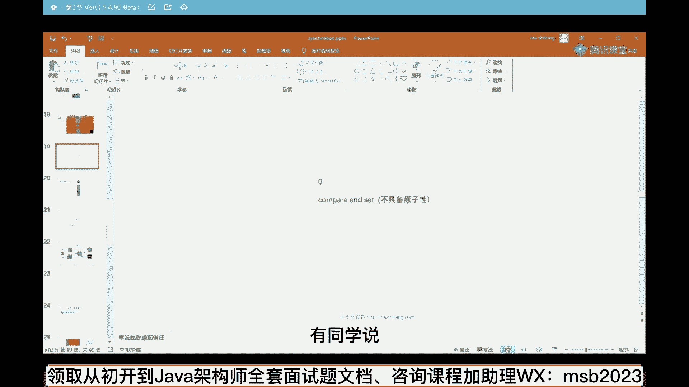

老师我这没法干了呀，虽然我知道跟跟到cs了，但是往下跟就跟到c加加了hosport的事项了，没关系，你不就是unsafe那个类的compare and swain吗。

看这里作为on safe这个类来说。

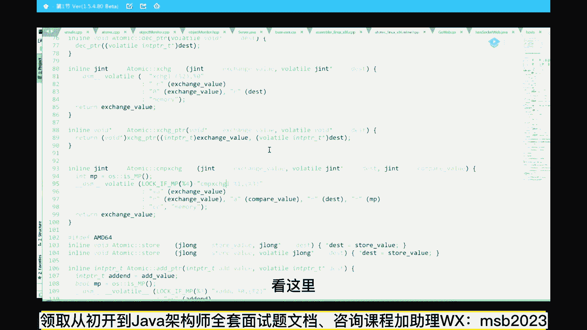

当然这个就是呃c加加代码，c加代码看起来远远不如java那么的轻松一些啊，呵呵凑合看，没关系啊，你认真的跟着我的思路走就行了，注意这里给大家看的是unsafe这个类的cpp，就是c c加一个代码。

就是hot sport的具体实现它是怎么实现的，它是unsafe这个类里面的compare and sweat，and具体怎么实现的呢，我先不用去管它，直接看他最后的时间是什么。

是atomic这类的compare and exchange，它它底层叫compare exchange k这样一个时间好，那这个compare and exchange。

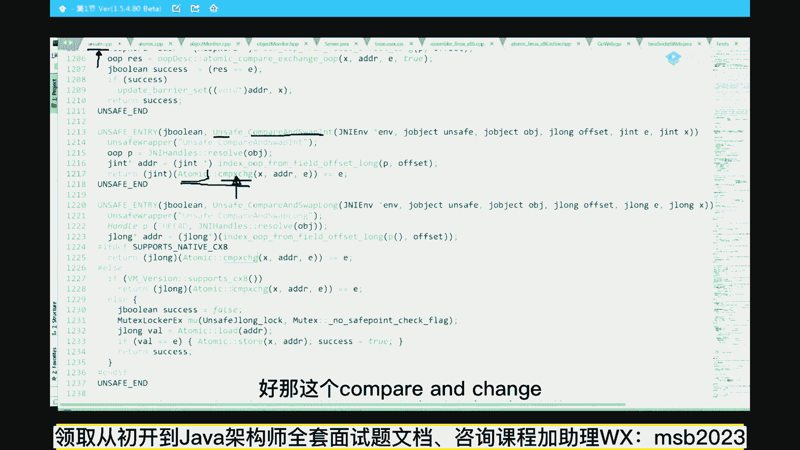

如果你再往里跟的话，它有好多好多好多定义，转来转去。

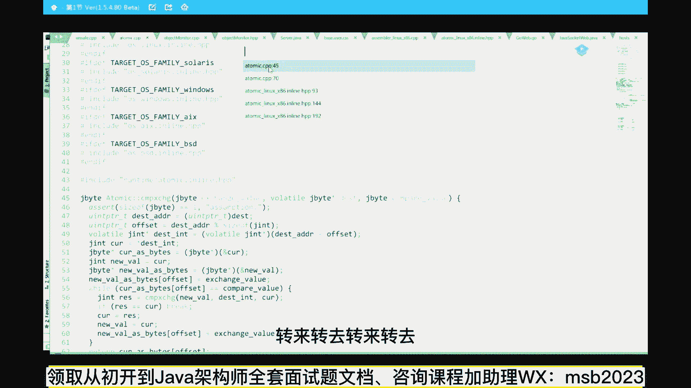

转来转去，我就直接给大家看最后的结果，告诉大家，最后的执行是在这里执行的是这个类atomic linux，x86 in lin h p p，atomic原子的具体实现哪个哪个平台上的实现。

linux的平台上哪个cpu的架构，x86 的架构具体是怎么实现的，在这atomical compacts change，如果你仔细读的话，你会发现它是一条汇编的直线。

a s m c语言里面嵌汇编就这么欠，好最终的汇编时间是在这lock 1 p同学们，你们发现了这样一条指令，这条指令是x86 的cpu原语，cpu的汇编。

这条指令叫compare and exchange，c m p and exchange，what，ok啊，原来这条指令是在底层上就直接支持的，看懵逼了，我靠不会吧，我这讲的够慢的了。

已经这玩意能跟上吗啊，能跟同学老师可以啊，还可以是吧，嗯反正呢这个过程非常的详细，比较比较比较细碎。

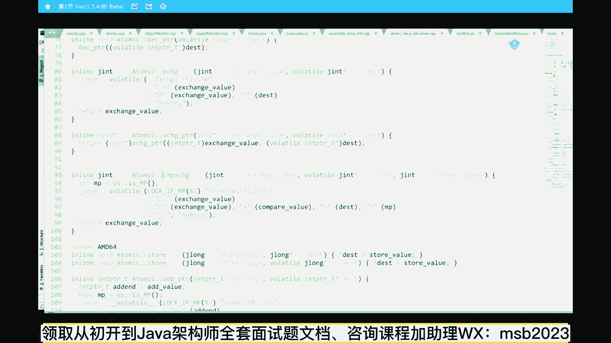

尤其是跟c加，如果说你没跟上的话。

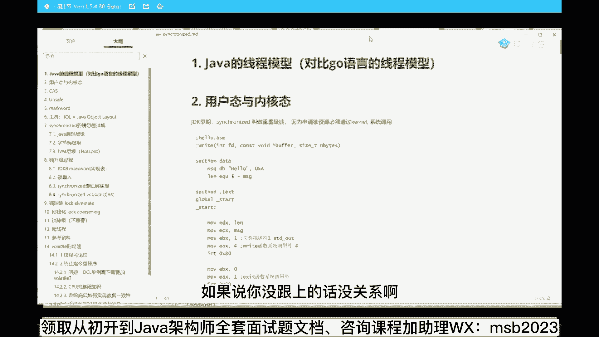

没关系啊，像老师这么体贴入微的人，当然是选择给你做好笔记了对吧，如果你想跟进去unsafe这个类的，compared sweat in。

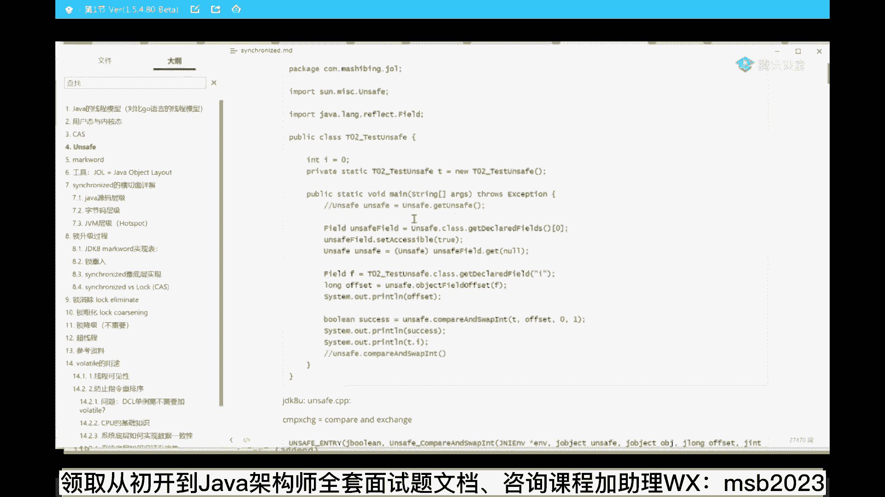

会跟到unsafe的cpp这个类里面的，会跟到atomic这个类的哪一行。

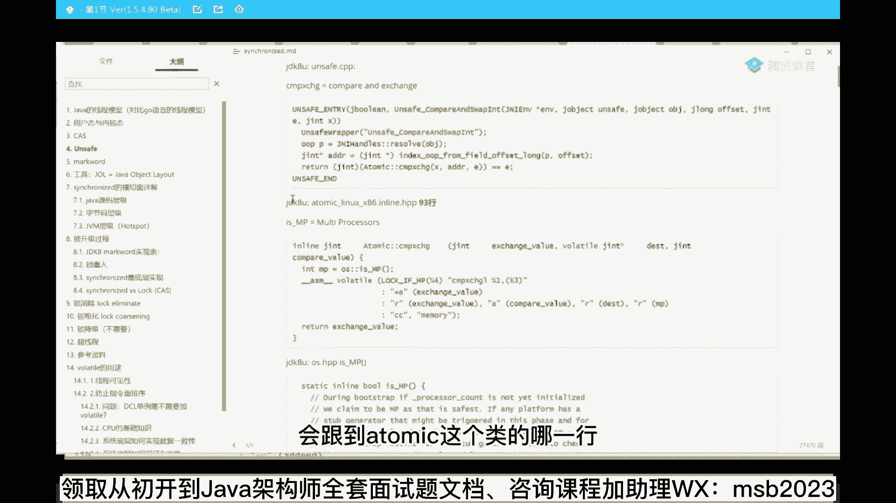

最后会给你解释到底啥意思。

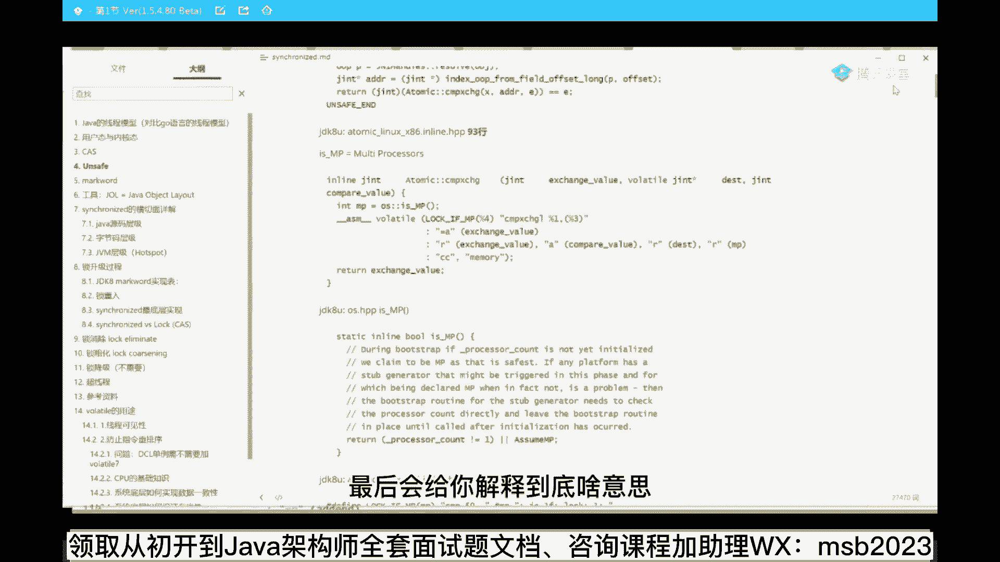

好吧，所以没有听懂的，大概听懂就可以，大概听一个就可以，笔记可以发吗，明天因为我们是一个训练营，当然笔记可以发，讲的很润，居然讲得很润，我的天一点儿一点儿一点儿都不硬核吗，好你看这里啊，同学们。

atomic这类的complex change，最终的一个实线是这条指令叫lock if mp，compare and exchange，细节我们先略过它前面是一个红，叫lock if mp。

这个lock 1 mp到底是个什么东东嘞。

转到定义来看一下，这就是那个红的定义，这个定义是什么意思呢，总而言之很简单，就是如果说，是mp的话，if mp如果是p的话，前面加一条质量叫lock，所以m p是什么意思，最关键是在这儿是吧。

mp是啥意思呢，p的意思呢就mti，multi person，有没有s啊，mi buds啊，叫多人多多个人的运动，sorry讲错了，multi p scissors，ok多核多核运动啊，看这黑。

while processors啊，叫多核多个核，如果你的cpu有多个核，前面就要加这条指令，lock指令，如果你的cpu只有一个核，那你就compare chang这一条指令就可以了。

你想想看没有自己能打断自己的自己，先把自己给干死，然后再去干敌人，没有这种可能性，所以一个核的不需要加lock。

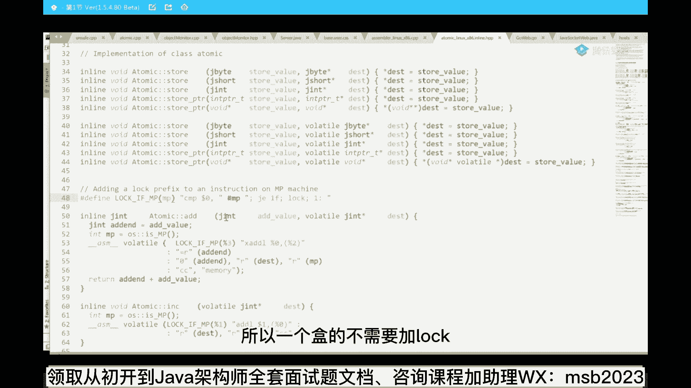

那也就是说多个核的需要加这样一条指令叫lock，所以最终的一个具体的实现就是这样一条指令。

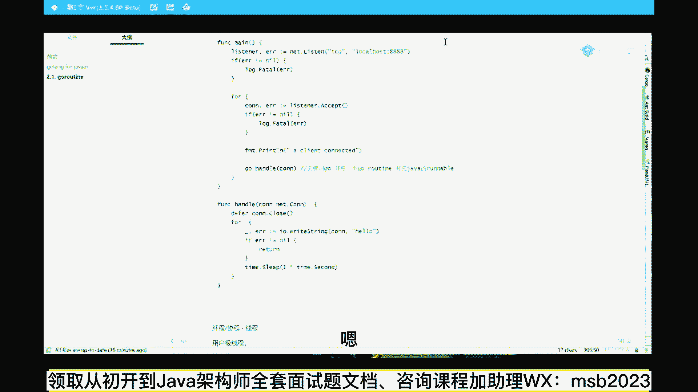

go语言的。

看这里最终的一条实线就是这条指令，这条指令叫look compatichange，好这条指令支持原子性，这条指令是atomic的why，这条人流为什么是atomic的。

我们再说一下compare exchange本身，他们不需要不，它不是知识原形，这块还能跟上吗，同学们，茅茅厕顿开啊，你的茅厕终于开了，原来都便秘是吧，还能跟上啊，能跟上同学老师可以啊，o。

啊原则性就是不可分不可断的，没错没错没错，你说的太对了好听，我说我再给你说一遍啊，为啥要讲其他的语言，因为一个牛逼的架构是对于你来说，语言都不是问题，小case看这里，这是一个cpu，这是cpu 1。

这是cpu 2，他们的对内存里的某一块数值，要进行一个什么操作呢，就是这样操作叫compare and exchange c a s操作，这俩哥们儿啊都是通过一条总线去访问cpu的，去访问内存的。

sorry，访问memory的，我粉我，我执行这个操作的时候，有可能被其他cpu打断，所以我保证不了这条操作的原则性，我保证不了说我中间不能被别人打断，但是我现在需要对它进行保证，我怎么办呢。

我前面加一条lock指令，lock指令的意思是把整个总线给我锁住，哥们儿，我在锁这个锁住它的时候，o其他cpu不能进行操作，c2 c3 c4 c5 c100 ，随便你是谁，这个时候总线不能传数据。

只能传我自己的数据好了，这是他最底层的一个实现，叫locompared change，好我们稍微回顾一下，就是所谓的cs操作是啥意思呢，稍微回顾一下啊，这讲的有点有点有有有有有点多了。

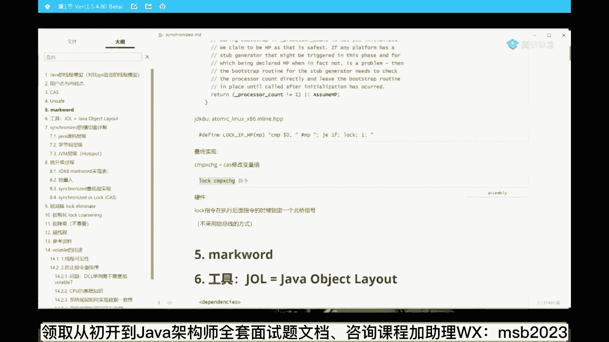

看这里回到我们接下来的操作，所以这个cs操作是啥意思呢，就是哎我底层我执行了compared wap int。

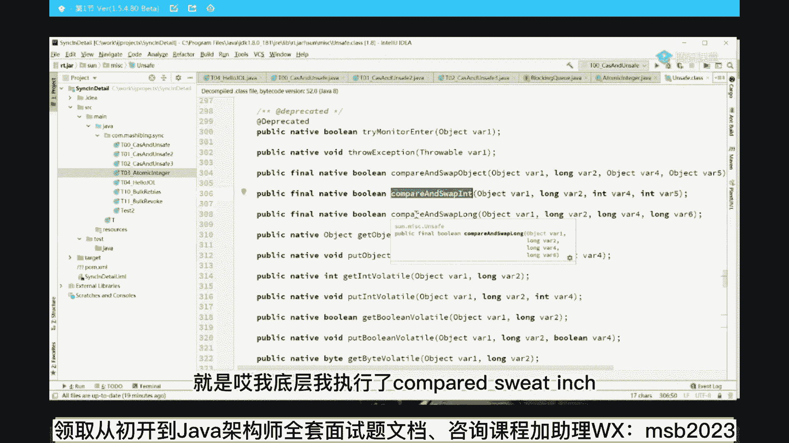

然后呢，如果我要跟现在的这种hobt时间呢，我最后我最终会跟到一条指令上，这条指令叫lock compare and exchange。

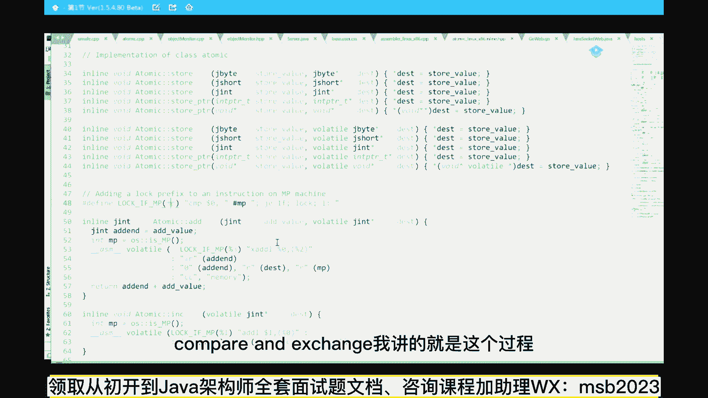

我讲的就是这个过程，那么如果你了解了这个过程之后，你就会知道了哦，原来所谓的c a s它是cpu级别的一个支持，是支持的，第一个呢它有一条短语叫cas，原语叫compare and exchange。

第二个呢这条源于本身不具备原子性，可是如果他前面加了一条lock指令，它就支持原子性，当然这条logo指令，它在硬件层面也进行了一些优化，比如说它锁定的是北桥信号，而并不是一条总线，那个就有点超纲了。

就算了，ok请问总监是怎么所做的，硬件级别的一个标志，标志位在硬件级别上，说这根线通电了，这根线通了电，高电平一表示锁定了，哥们儿，只能归我用，我什么时候用完了把它归零，其他的cpu就可以用了。

好了基本上面试就面到这种程度了。

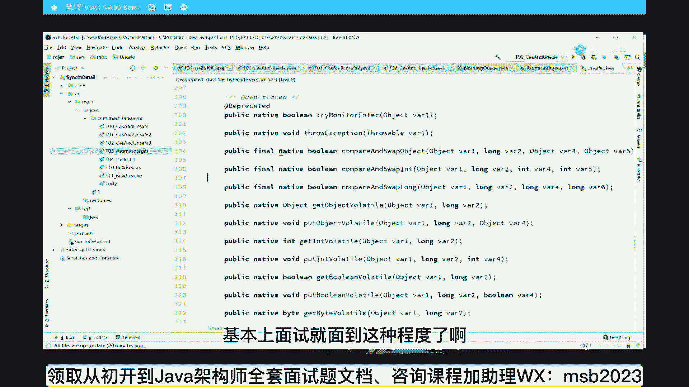

不会再升了，所以我讲到现在关于cs从表面一直到最深入的，来，能get到同学老师扣一。

嗯那好，那有同学会说讲到现在为止，老师那个synchronized跟这有半毛钱关系吗，对这个叫自旋锁，synchronized的原来的实现叫重量级，所，而自旋锁是用来实现轻量级锁。

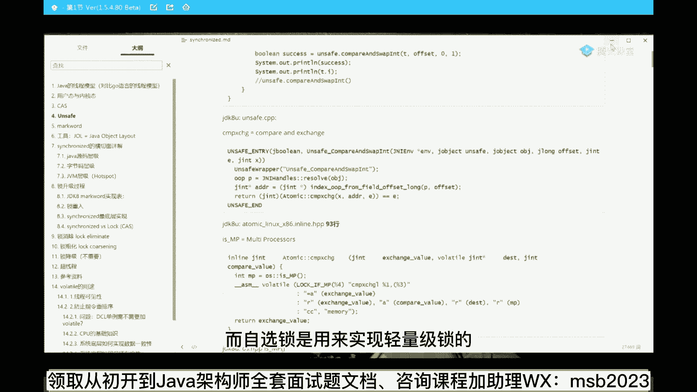

轻量级锁的意思我再强调一遍，虽然他总线上也是需要加速，有同学老在这里做混淆啊，说老师，你这个cs到最后了，不也是得通过硬件的这个lock吗，那你中间经过操作系统，是不是他中间最后还是要经过lok啊。

好我画完这个图，你不就理解了吗，轻量解锁的意思是我不需要经过操作系统，我自己就到lock了，而重量级锁的意思是，我要经过操作系统的一系列的管理，我需要把我的等待的线程放到队列里。

我需要订购操作系统的一系列的调度，我才能够执行，所以重点是有没有操作系统的参与，听懂了吗。

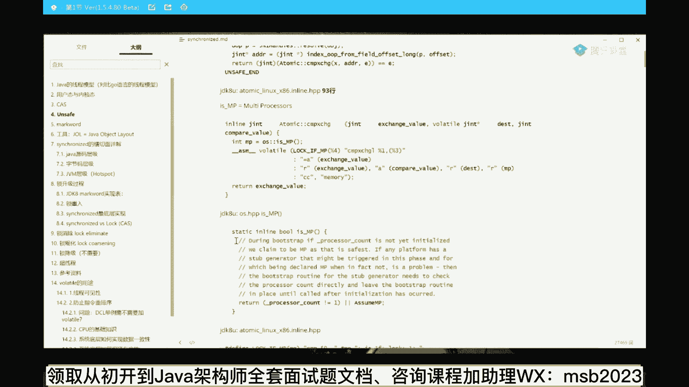

这就是轻量级锁和重量级锁的概念，那有同学会说，老师原来synchronized，到目前为止是有一个锁升级的过程，中间它是有一个轻量级锁的实现过程，是这样的吗，是的好，还能跟上吗。

能跟上我们就牵扯到更细致一点的内容了啊，能跟上给老师扣一啊，ok。