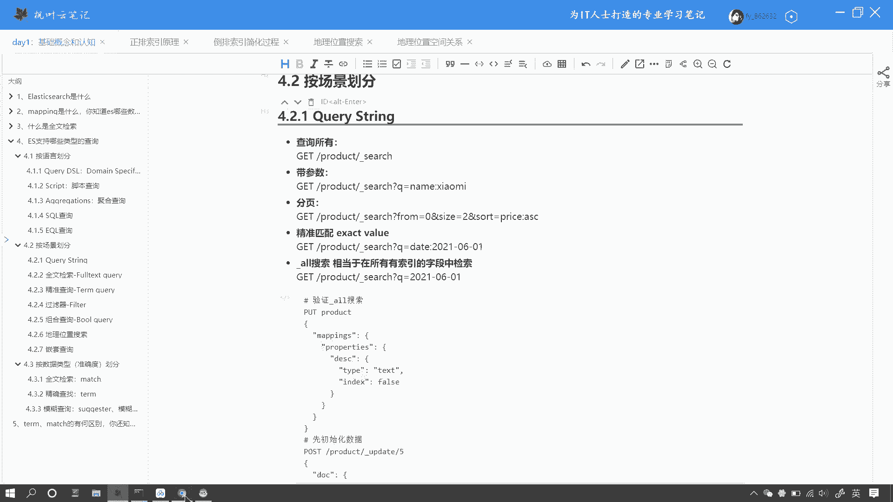
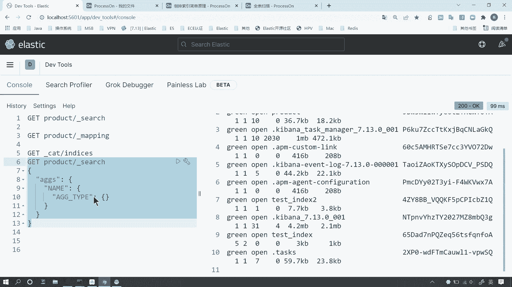
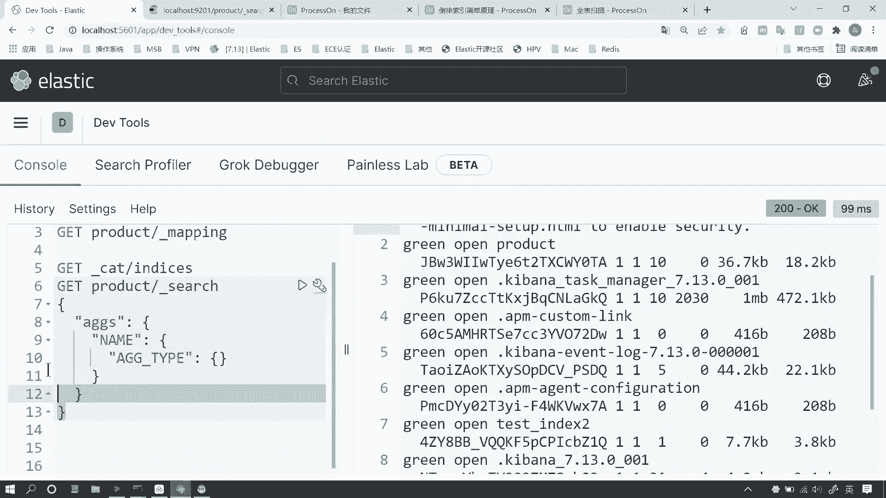
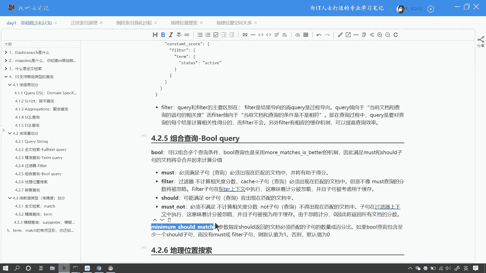
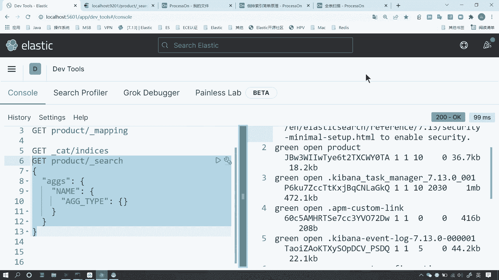
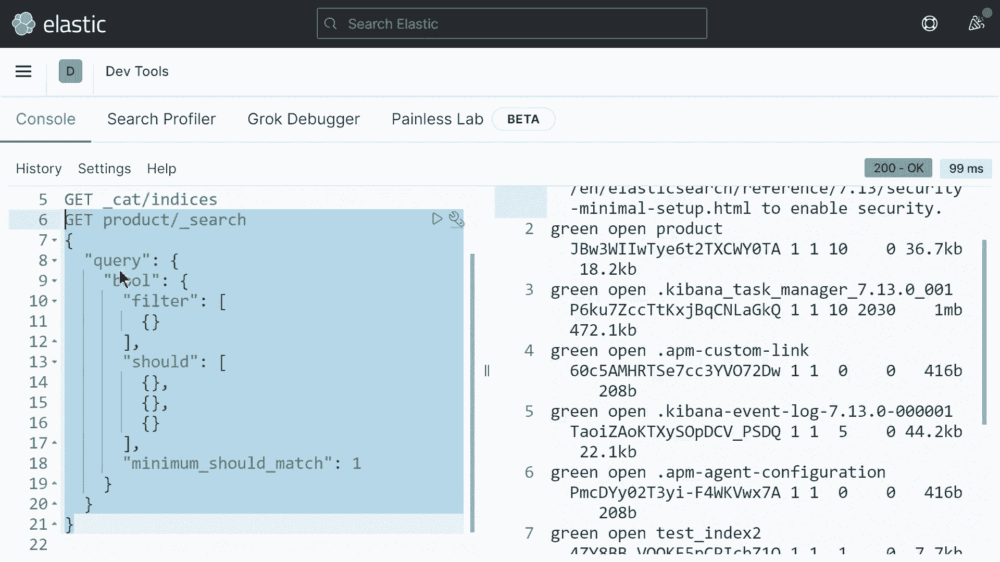
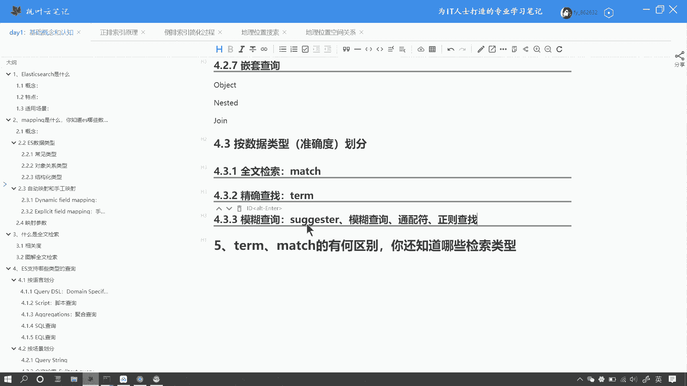
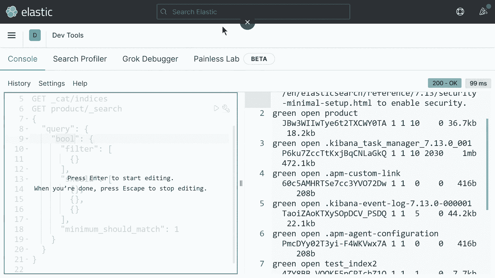
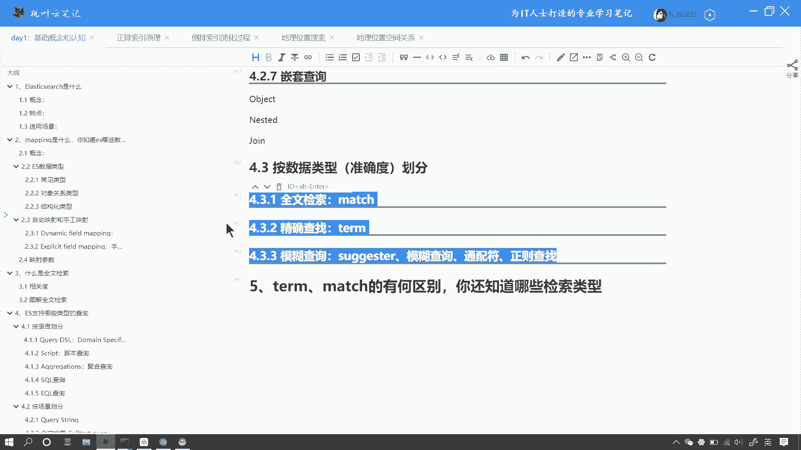

# 马士兵教育MCA架构师课程 - P150：ES 支持哪些类型的查询 - 马士兵学堂 - BV1RY4y1Q7DL

好，我们来看下面这个问题。那ES支持哪些类型的查询呢？这是一道来自美团的面试题啊，对应的岗位薪资呢在25K左右。啊，下面我们来看一下这个问题，我们如何来回答。啊，那么这个题目呢属于一种开放性的问题啊。

那其实也比较简单。那么咱们按照不同的划分方式呢，其实答案也不唯一。比如说咱们可以把人呢分为好人和坏人，按照年龄划分呢，也可以分为大人和小孩啊，你也可以按照性别划分，划分成男人、女人。

或者按照国籍划分成中国人啊，外国人或者巴基斯坦人、印度人等等等等。好，那么咱们ES中的这个查询类型呢，首先咱们按照最常见的划分方式呢，比如说咱们按照语言来划分啊，那么ES呢支持多种查询语言呢。

首先那么第一种呢咱们最常见的叫rySL啊，也就是编specific language啊，那它是ES中啊支持咱们ES就是ES内部的特殊的一种呃查询语言。好。

那么第二种呢就是脚本查询啊scripting或者叫script都可以。好，第三种呢是aggregations脚本查这种是呢聚合查询的语言啊。好，第四个叫查询啊。

是支持咱们使用那种关性数据库的查询语句来进行查询。那么第五种呢叫事件查询啊EQL查询。好，那么如果问到这里啊，就是面试官可能会延伸的去问你一下啊，那么这几种查询语言的区别是什么呀？

那首先呢快DSL呢是解决我们80%应用场景下的这种啊查询语句。啊，就是说咱们大部分情况呢用的都是DSL来进行查询。那么脚本查询呢，它本质上是ES啊。

为我们提供一种专门用于复杂场景下支持自定义编程的这种脚本语言。那它是一种可编程的语言，它的灵活度是比较高的。它的语法是类似于java的啊，也有那种关键字啊变量函数等等啊，但是它的性能啊是不如快DSL的。

也就是说如果咱们能用DSL来解决的问题呢，咱们坚决不用script的好，只是script呢它能解决。一些特别复杂的场景啊，那这个就是他们俩的区别。而这个呃aggregations呢，它的。

它和这个上面两种最本质的区别啊，就是尤其是和快越DSL的区别呢，在于它的他们解决的业务场景不一样。那快越DSL呢，它是用来解决全文检索的问题的而我们aggggregs用来解决数据分析啊。

这种数据聚和查询啊，他们的业务场景是有本质的区别的那这也是他们最本质的区别啊，最大的区别。🤧那srcle查询啊这个circle查询的支持呢本质呢它是ES为一些啊他不愿意去学习一门新语言啊。

比如说DSL他不愿意去学DSL这种脚本啊，这种语言的时候呢，你可以使用my circlercle来进行一些呃或者说是大部分场景下的查询。但是呢circle查询它有一个缺点呢。

就是对新版本的支持不是那么友好。还有一种是对复杂的一些脚本呢，可能支持的不是特别好啊，这个就是咱们常见的几种呃查询语句的区别啊。那么这个EQL呢，其实咱们用的就比较少了啊。好，那么第二种咱们来看。嗯。

咱们还可以按照场景来划分。按照场景来划分呢，就是说按照业务场景来划分啊。那比如说第一种呢也是最简单的一种啊叫queries string。

那queries string呢其实咱们在生产环境中用的是比较少的。什么什么情况下来什么场景下，什么情况下咱们可能会用到的。好，比如说咱们看到那么当前我打开的这个页面。这个网页呢是叫的一个查询的工具啊。

叫 tools啊，它有一个conl的界面，它是在这个界面里边咱们是可以执行一些一系列的查询脚本啊，咱们的queryL applications脚本语言呢等等，都是可以在这里边去进行执行的。

那么它有一系列的好处啊，首先呢它分为左右两个区域。那么右侧可以给我们返回这个响应的上下文左侧可以支持我们去写一系列的脚本。比如说啊我们查询一些这个索引的时候呢，它会给我们去智能的产生一些智能提示啊。

比如说我们在写一些。

代码啊，写代你写一些代码的时候呢，好，除了智能提示之外，还可以给我们进行forat啊智能的格式化。还嗯当然了，这里边呢既然有好处，它也有一定的麻烦啊，它有一定的缺点。那就是它依赖于客户端。

依赖于我们安装这个be banner这个组件啊。

好，那么carry dream呢它有一个好处的，就是说当你有一些比较简单的查询的时候呢，比如说我们local host的9201啊，这是我们的服务地址啊。9201一些比较简单的查询。

比如说我想查询呃caping index，我们查询当前集群中嗯唉。Local host， cat notes。我们来看一下9201。点com。好，我们可以方便的看到当前集制中有哪些节点是吧？

或者说我们呃加个V也可以啊。那或者说我们可以查询，比如说刚才的查询语句product search。好，我们同样可以看到当前呃这个集群中的product所以给我们导致一些数据啊。呃。

它的好处呢就是我们不依赖于客户端，我们可以方便快捷的查询一些简单的脚本。但是呢它的致命的缺点啊，就是说这里边呢，首先它没有智能提示。那第二个呢，我们一些比比如说像这种稍微简单一些，要跨越多行的这些代码。

我们写起来很不方便啊。好，这个是什么时候会用呢？就是我们这个脚本比较简单的时候可能会用。

好，那这个呢是关于这个que string啊，咱们来看第二种呢，就是这个for textex啊全文检索。那么这个咱们第三个问题呢，实际上已经讲过了。好。

que stream呢大概有这么几种match match all，还有match呃mtimatch啊，这个知道就行了。还有这个短语查询啊，match phrase。呃。

以及咱们呃后面要说的这个time们 queryry啊精准查询，还有咱们嗯这个过滤器这个过滤器和ferry的最主要区别呢在于这个filter呢，它本质上是没有这种评分机制的啊。

它的查询性能是要比query要高一些的。好，还有这个组合查询。那么组合查询呢可能面试官呢可能会延伸的问你一些其他的问题。比如说这个组合查询里边这个叫minum啊ho match这个参数它是什么意思？好。

那这个啊这个参数的含义呢，实际上呢咱们简单的要说一下吧。好，在呃组合查询呢，其实就相当于我们在呃执行scle语句里边V尔啊后面跟多个条件。啊，比如说V尔条件一and条件2是吧？好。

那么当我执行多个条件的时候呢，这个shoul啊它默认啊，比如说sho相当于我们这个al句。啊，这个or组句里边，比如说里边我查询了多个条件啊，比如说这个。布尔查询呢，咱们这样啊，咱们结合代码来说一下啊。

因为这里边呢面试官可能啊有很大的概率，可能会问到这个问题啊。比如说咱们以这个。

我是大哥，所以为例。好，咱们在 searcharch置的时候里边呢，首先quary最外层嵌造一个布尔查询啊，布尔查询呢其实就是组合查询。这里边呢首先支持四个词句filuter。然后。嗯，还支持m。

还支持。m note还支持。秀的。好，那这里边呢可能唯一可能会出现的一个考点呢，就是说当我们这个shift这个条件啊，呃这个子句在查询的时候呢，就相当于我们这里边有多个条件。比如说条件一啊。

我这里边就写伪代码了啊。好，这是这里边第一个中括号呢就是条件一啊，第二个条件呢就是条件2。那么当shift的句出现的时候呢，这多个条件啊，你至少要满足一个啊，比如说我们这儿有三个条件。好。

那么这个时候呢，我们的查询语句这三个条件你至少要满足一个，就是它返回的结果呢是至少要满足一个条件。好，当我们出现map的时候呢。好，比如说我们当前查询的是这个m啊。而没有s的时候。

那么比如说这里边也有多个条件。那么此时呢这里边max句里边的多个条件要同时满足，这里边有两个条件都要同时满足。好，那么假如说我们同时有效的啊，又有map的时候，这个情况是比较特殊的。

首先啊我们来说一下这个参数叫minum嘛，就是咱们刚才说的这个叫minum。好，在这里边啊。MI好，那么这个参数什么意思呢？首先啊在我们只有s子句的时候呢？默认情况下，你即便没有这个参数。

那么我们当前s子句需要至少满足的条件数呢，默认就是一。如果我们把这个参数配置上，我们给它改成2。那么此时呢s子句里边需要满足的条件数呢至少为2，也就是三个条件至少要满足两个。好，那么有一种特殊的情况呢。

就是在s子句和max的子句同时出现的时候。好，那么此时呢呃如果一旦s啊，那么它遇到了max的子句呢，那么此时的条件，这里边三个条件呢啊至少要满足的条件个数呢变成了0。也就是说呢。

如果max子句出现的时候，那么sho里边的条件呢可以一个都不满足，那是没有关系的。好，那么呃当然了，除了max之外呢，还有filter也是一样的啊。好，也就是说呢s子句遇到了filter子句也是一样的。

这里边条件可以一个都不满足。好，那么如果我们想让它满足啊，我们可以加上这个minum should match，那么一旦有了这个参数呢，那么这个s子句里边需要至少满足的条件个数呢，就是比当前配置的个数。

那么我们配置唯一，那么它至少要满足一个条件。那不管是有bi filter或者m子句都是这样的。好，那这个是唯一在面试中啊，可能会问到布尔查询的一个考点啊。

好了，那么这四个子句的意思呢就是m的每个条件都必须要满足filter也是每个条件都必须满足。但是那么filter呢它是不计算相关度的。那么秀呢就是多个条件，你可以满足其中一部分。

而m的n呢是每个条件都必须不满足。好，那么这个是他们四个子句的分别的含义。好，那么当然了你还可以按照地理位置，它支持的这种搜索类型，啊，还有地理位置搜索。那么地理位置搜索呢，咱们之前。我看一下啊。

这个云笔记里啊，我简单说一下，你像这种呃矩形查询呢，在矩形中查查找一些点呢，或者说基于你当前位置查询啊半径查找啊，比如说半径50公里查找范围，有哪些点。你像你的外卖软件呢。

或者说你的一些美团或者说一些团购的软件呢，都会有这样的呃查询信息，或者或者说是查询方式啊，还有这种多边形的查找以及复杂比例位置的这种查找。当然了，知道这个地理位置查找这种类型就可以了啊。

那么不用在这个里边去探究的过于去深啊，就是探究的太深啊，是没有必要的。呃，还有一种查询类型呢叫嵌套查询。那么嵌套了查询呢其实只持三种啊，一种叫啊你记住这三种类型就行了。第一种类型的叫object。

第二种类型的叫啊，我写一下啊，第一种叫OBJECT。其实咱们在之前讲呃第二个问题讲那个ming的步骤类型的时候说过啊，第二种类型叫NESPED。第三种类型的叫jo啊，好，记住这三种类型的查询就可以了。

那么以上呢就是关于当前的这个呃按照咱们看一下啊。啊，是按照场景来划分啊。那么不同的这种呃查询的场景呢，它对应对的这种呃业务逻辑是不太一样的啊。好。好，那么下面咱们看啊按照数据类型划分呢。

咱们就可以分为全文检索啊，精确查找以及模糊查找。那么模糊查找呢主要包含以下几种sgeer呢就是智能提示啊，咱们看到的比如说。

好，比如说百度的这个这个搜索包啊，百度。好，那么我们看到呢这个呃蓝色的方块呢，其实就是这个sgeer，它的这个智能提示框啊，就是这个方块。

好，那这是第一种啊。那么当然了，还有像模糊查询啦、公配服啦，正式查找啊，那么它统通都是模糊查询，而精确查找呢就是查询指定的值啊，matdge就是权文检索啊，大概呢就可以分为这么几类。

好，那么下一个问题呢，咱们来看一下这个prome match有什么区别。