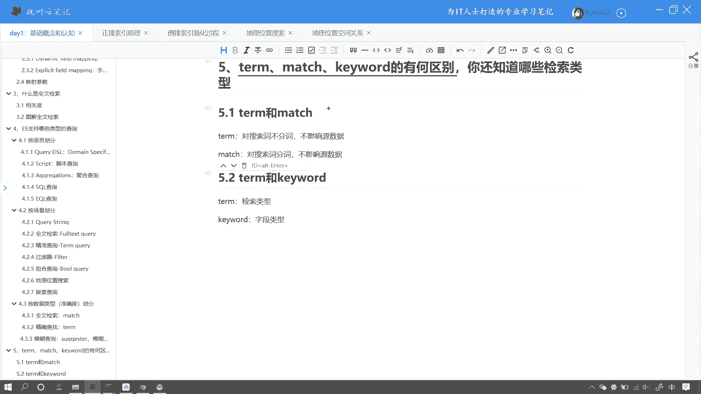
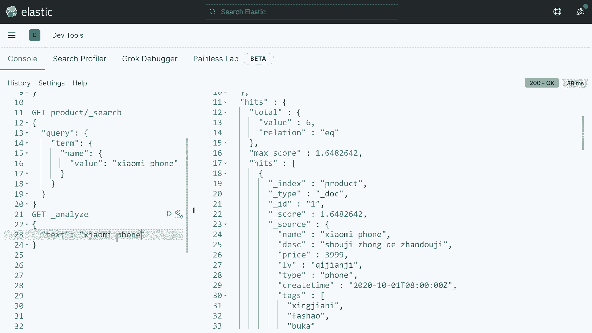
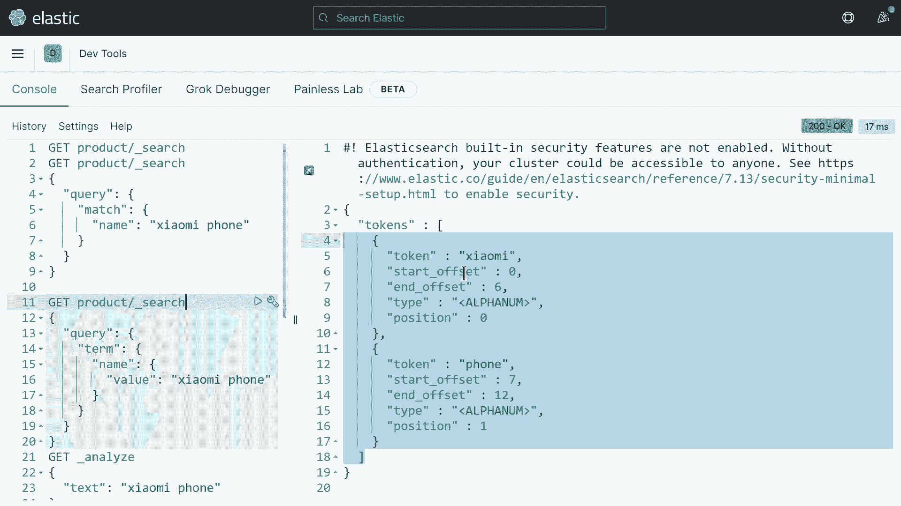
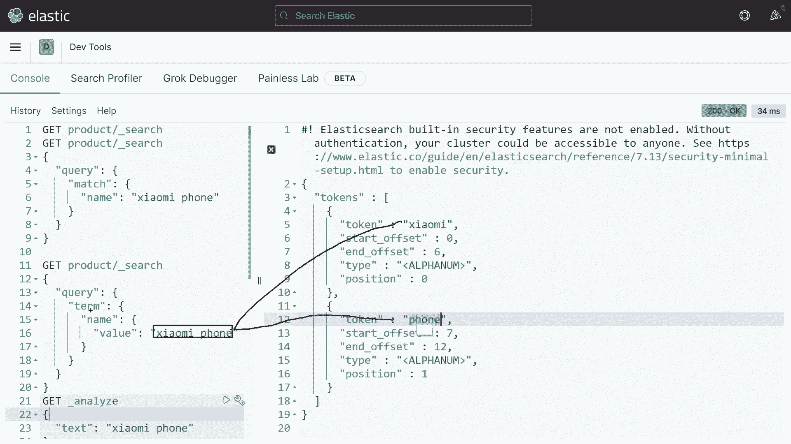
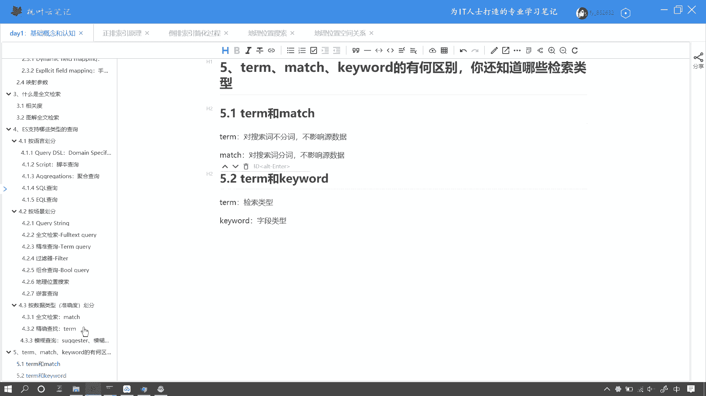
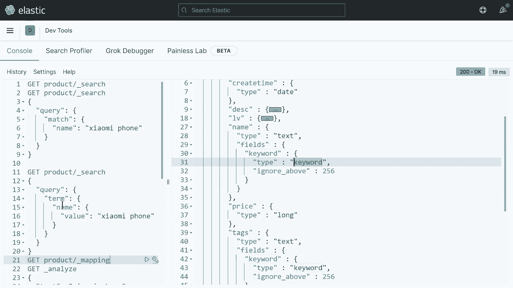
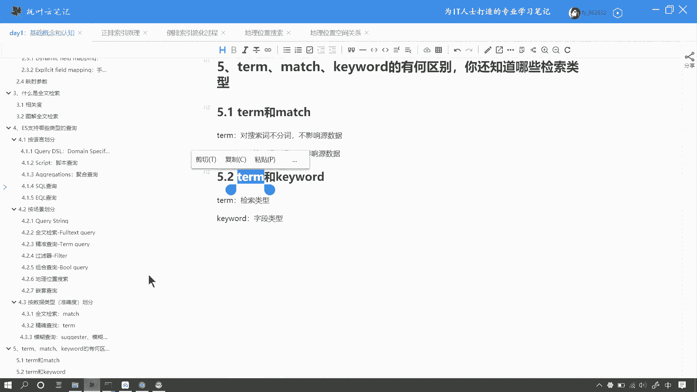
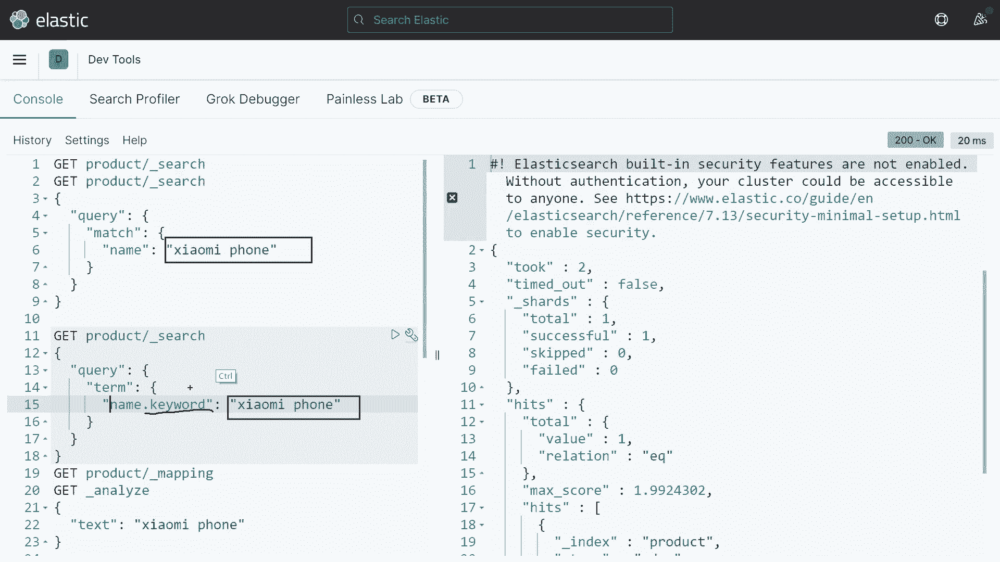

# 马士兵教育MCA架构师课程 - P151：ES 中 Term 和 Match 搜索有什么区别 - 马士兵学堂 - BV1RY4y1Q7DL

好，我们来看下面这个问题，term和mat的区别是什么？那这是一道来自阿里的面试题啊，对应的岗位薪资呢在25K左右。好，那么下面啊我们来看一看这个问题，我们如何来回答。

那么很多小伙伴呢在面试中被问到相关问题呢，就是栽了跟头啊。那么如果屏幕前的小伙伴呢在面试中也被问到类似的问题啊，可以在弹幕里扣1。那么下面我们来看一下，首先是tom和match，它们的区别是什么呢？

我们来从代码层面上来看一下啊，那么当前屏幕的左侧呢有一个match搜索啊，在这里边有一个match搜索。那么下面呢有一个tm搜索。好，这两个他们同样都是搜索的一种搜索方式，一种搜索类型。

那么它们的区别呢在于当前对搜索对啊，是搜索词。这个搜索词呢是用户传过来的搜索词。

他们的区别呢就在于是否对搜索词进行分词。啊，也就是说match对搜索词是分词的，而我的tm呢对搜索词是不分词的。不管是tm也好，那个呃不管是mat也好，还是tm也好，他们对于这个原字段啊。

就是这个name原数据是没有任何关系的。那么原数据是否分词呢取决于它的字段类型。好，也就是说呢我当前这个两个查询呢其实匹配的结果是一样的。因为小米这个词呢它本身就是一个词项。

那按照默认的分词器它是不会再产生任何更细利度的这个词项啊。好，咱们可以验证一下啊，怎么去验证呢？好，可以用1个API当然了，这个面试官在面试的时候呢，咱们不呃可以不去这个这个代码咱们是不用执行的啊。好。

我这是为了方便你去理解。然后咱们anaer，然后通过这个首先呢这个TST。指定这个小米。好，因为默认的分词器呢就是stander的，咱们可以不写。好，你看得到了一个词项，小米。

也就是小米是一个最细腻过的词项，咱们不用去管它，咱们验证一下。那么可以看到啊第一个这个结果。啊，第一个搜索的结果呢有。呃，5条数据都搜到了，因为每一个每一个结果里边呢，它都其实包含了小米这个词项是吧？

那么当前麦去搜索，它的语义呢就是所有name幕字段中，只要匹配到小米这个词项都是可以被搜索到的。我们看每一条数据呢，第嗯这个第四条数据，这里边有小米往下，那么这儿有小米啊，同样小米。

小米好OK那么如果要体现区别呢，比如说咱们随便拿一个这个数据来举个例子啊，那么比如说咱们要搜索小米PHONEPHONE小米phone好，那么咱们下面同样。没。嗯。好。

那么下面啊咱们同样啊也匹配一个这个小米蜂。PHONE好，那么这样的结果就不一样了。好，咱们看上面搜索它是有结果的。好，执行看一下结果还是啊toto还是6条数据啊。因为除了小米之外呢，我们多加了一个词项。

好，在这个搜索词里边，咱们添加一个。好，咱们来看一下它的分支结果。

那么它被分成了两个词项，也就是说，如果我们使用麦age查询的，那么包含小米或者phone任意一个词项的结果都会被匹配出来。而我们如果使用tm查询的时候啊，如果我们使用t查询的时候。

那么当前的这个搜索词会被原封不动的，它原先是什么样，就是什么样啊，我们此时用小米phone搜索，那么当前就没有任何结果，这是为什么呢？咱们验证一下啊，首先来执行一下结果啊，没有任何结果。因为呢。

Tm查询呢会拿着这一个词，拿着这一个短语作为一个整体和当前每一个字段啊，咱们来看一下所有的数据，每一个字段它的每一个词项来进行检索。你看比如说小米 phone啊，它的它的这个分词结果是什么呢？

是小米和phone。那么如果我使用T查询呢，我会拿着这一个短语分别和每一个词项去进行匹配啊进行比对。那么发现每一个词项都和小米 phone这个短语是不匹配的。因此它搜不到任何结果。

那它这个就是ter查询。好，那么什么是keyword啊，咱们来看这个文档，那么什么是特m和keyword呢？好，那么默认啊每一个每一个字段，它默认都是一个t类型。比如说咱们查看一下当前所引的这个m啊。

它的字段类型。

好，我们可以看到name字段啊，咱们把这个其他的字段折叠起来。那么name字段呢它默认是一个t的类型。好，当然了，它有一个字段叫keyword。那么这个keyword，那它就是一个sstore类型。

它是不分词的。也就是说呢好，那么我们在比较 termm和 keyword的时候呢，其实比这种比对呢其实是存在一定的问题的。Tm是指的搜索类型。而我们的keyword指的是字段类型。好。

那么我们比如说我们当呃我们这个查询把这个 termm改成。

name点keyword的时候。啊，当然这样子查询可能会出现问题啊。哎，你看我们这个结果又出现了啊，结果这这个结果又又有了，什么意思呢？好，注意看。当我们使用name讲keyword进行查询的时候。

因为这个keyword字段类型呢，它是不对啊我的数据进行分词的。那么name点 keyword这里边看不到啊。那么它的子字段呢会在name的基础上，我保留原封不动的保留我的原数据，它原本是什么样。

就是什么样。也就是说此时呢我这个特m搜索是拿着小米phone这个短语去匹配这个完整这个短语，所以它就能匹配到。好。这样大家应该明白了吧，match啊，如果我们改成match呢，咱们再来进行检索。啊。

会报错。那么怎么办呢？咱们把这个小米磁项呢把这个给它贴出来啊，它不能用这种方式进行检索。啊，不能用这种value的方式啊。好，用这种方式好，你会发现呢它的结果依然能匹配到啊，因为因为什么呢？

因为我match对小米这个词项呢呃它本身是不应该被匹配到的。为什么呢？因为小米这个词项啊，首先我这这是一种特殊情况啊，呃，那么小米和phone我使用match搜索的时候，按理说呢是会被分词的。

而这个keyword啊而这个name点 keyword是不分词的，也就是说呢原本这个是不分词的，而我这个小米和phone呢是两个词项分别和它匹配，但是为什么匹配到了呢？

因为啊当这个当这个搜索词和name和你的这个原数据完全匹配的时候，那么match搜索是一种特殊的情况。好，到这儿呢，其实我把这个match和tm。

还有这个keyword它们之间的这个区别呢给大家已经介绍清楚了。那么。呃，其实在面试的时候呢，你只要能说出啊match和这个term啊，咱们再改回来啊。好。

你只要知道magdge和 termm它是针对搜索词的，是针对于这个传入的搜索词的。而这个keyword呢，它是针对原数据的就可以了。好。

那么如果能把这几种搜能把麦agdge和 term这两种搜索以及keyword和t这这两个字段的类型彻底理解了，那样更好用自己的话去描述，千万不要死记硬背OK。

