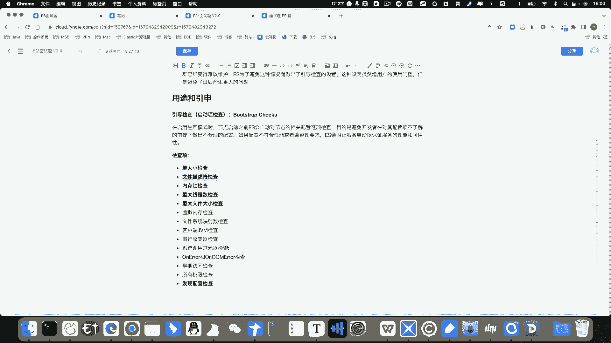
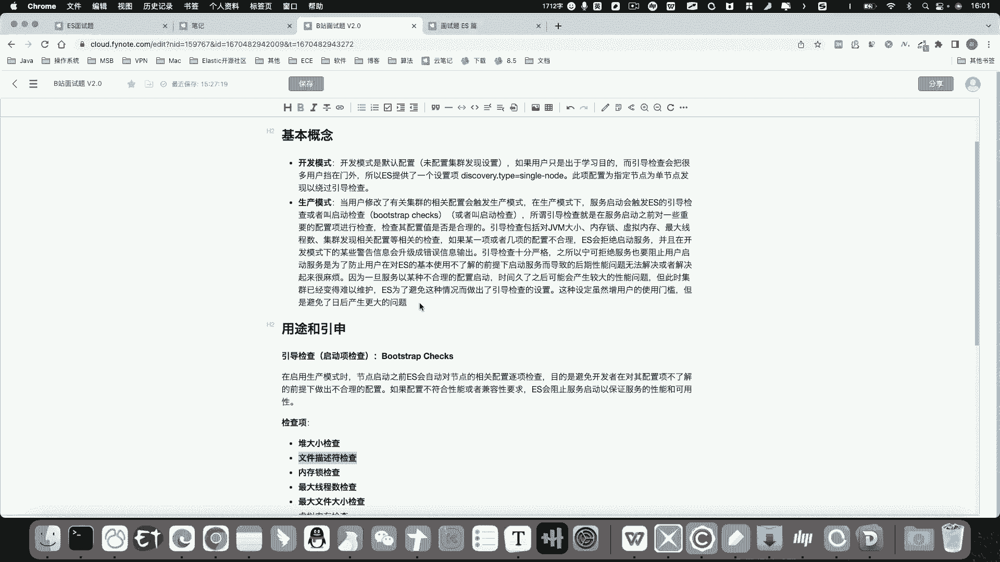

# 系列 6：P152：生产模式和开发模式 - 马士兵学堂 - BV1RY4y1Q7DL

OK我们来看下面一个问题，什么是开发模式和生产模式？那这是一个来自阿里意面的面试题啊。呃，首先我们在回答这个问题之前呢，先来思考一下面试官问这道问题的初衷是什么。

首先呢这两个概念呢是一个非常表象的ES问题。那么开发模式和生产模式呢是在我们学习过程中呢非常容易被忽略的两个概念。尤其是我们在没有对这两个概念充分理解的前提之下。

在项目的前期啊是非常容易给项目后期啊挖很多坑的。好，我们下面来解释一下什么是开发模式和生产模式。

首先开发模式顾名思义呢就是ES为我们以开发或者学习为目的而提供的一种模式。我们都知道呢，ES在索引创建成功之后，很多业务参数，很多我们这个ES的这个参数啊，所引呢比如说像呃m屏的字段类型。

比如说我们使用的分支器，比如说我们设置的主分片的数量啊，一旦我们创建成功之后，这些参数是没有办法在后期进行修改的。所以我们在项目初期如果没有对我们的业务呢做充分的调研评估和测试啊。

贸然的就开始创建索引啊，开始往里边写数据了。那么后期我们维护起来是会变得非常困难的。那么基于这个前提之下呢，ES给我们提供了一个开发模式和生产模式。那么在用于生产啊为前提的这么一这么一个前提之下呢。

我们生产模式啊，会触发一个叫引导检查这么一个。呃，启动项检查这么一件事。好，在生产模式下呢，我们启动ES啊生产模式顾名思义，就是用于生产啊，用于生产开发为目的的这么一种模式。那么在此模式下呢。

ES会给我们启动一系列的这种机制的检查，包括我们的配置的检查，一旦发现了我们配置不合理或者说我们在启动的时候，可能会犯一些这种比较低级的错误，它会阻止你这个服务的启动，也就是说换句话说，就是宁缺毋滥啊。

就是我宁可服务启动不起来，我一定要让你的配置呃变得非常合理。因为一旦我们以一个不合理的这么一种呃这么一个前提啊，比如说我们的这个JVM大小配置的不合理。我们没有打开内存锁。比如说我们分片分配的不合理啊。

等等等等。那么此时ES阻止你启动。因为这样的话，在项目后期啊，呃就是把问题呢尽可能在我们项目开始之前。啊，就暴露出来，否则的话后期会拆呃挖很多坑。但是呢这一系列的检查会导致我们一开始学习。

尤其是对我们新手刚接触ellect search的同学呢会变得非常困难。那么在此前提之下呢，ES为我们提供了开发开发模式。而开发模式下呢，ES会忽略这些检查。目的呢是为了让我们尽快的上手，啊。

就是尽快的启动ES嘛，否则比如说我们呃刚刚学习ES。那么一开始我就是启动ES的服务就要花很长的时间，那么可能会非常打进学习的积极性。好，综合以上原因呢，ES为我们提供了开发模式和生产模式。好。

那么我们在学习啊就是以学习为目的的这个前提之下呢，我们可以为这个。节点之上呢，配置discovery点s啊s signal的配置当前节点为单节点模式。那么此时就处于一个开发模式。

或者我们在多节点的这个前提之下呢，不要去配置和集群发现相关的配置。那么此时我们仍然会处于一个开发模式。因为一般来说呢，我们如果是要学习像DSL是这种ES特有的查询语句啊。

比如说像aggregations，像script的这种查询脚本，是不需要去启动集群的。所以当我们一旦呃去在配置文件中配置了和集群发现相关的配置项的时候，就会触发生产模式。因为因为什么呢？因为生产模式下。

一般都是需要我们去配置集群的。如果你仅仅是用于学习，我们没有必要去配置集群。所以ES就会觉得啊你如果是用于学习，你干嘛去配置完呢？你既然配置了这个集群发现，那么我就认为你是生。

环境啊，那么此时我就要去启动项做启动项检查。那么我总总要有一个这么判断的依据。好，那么一旦触发了生产模式之后呢，就会启就会触发一个叫启动项检查的这么一个叫bu checks的这么一个东啊这么一个东西。

或者叫这么一个玩意儿啊，那么这个启动项检查会检查哪些项呢。好，我们在下面呢也给大家列出来了。当然在面试的时候，这些东西我们不可能每一项都记住。所以在面试的时候，我们可以把这个启动项检查作为一个引申。好。

怎么引申呢？好，我们在回答这个问题的时候，我可以说啊基于我自己的理解啊，那么为什么ES要出要设置这个开发模式啊，以及ES为什么要设置这个生产模式呀，好，就是为了刚才我说的那些原因。好。

那么它会检查哪些项啊，把这些东西呢，你能记住几个记住几个就行了啊，不用每一个都背出来。比如说这里边包含什么对大小的检查呀，文件描述符的检查呀，以及内存锁线程数以及。

这个文件的大小的检查啊等等等等吧。这些东西呢我们不用去全部啊给它背下来。只要知道啊，作为一个面试的引申，或者理解为一个加分项就可以了。

好，那么以上呢我们就把这个开发模式和生产模式呢给大家讲清楚了。那么在面试的时候呢，一定要组织好自己的语言，不要呃在回答的时候磕磕绊绊啊，这就可以了。

