# 马士兵教育MCA架构师课程 - P154：为什么 ES 不采用 B+树作为索引底层的数据结构 - 马士兵学堂 - BV1RY4y1Q7DL

好，我们继续来看下面一个问题啊，为什么ES呢不像my circlercle一样采用B加数作为索引底层的数据结构呢？那这是同样是来自一道阿里的面试题。那对应的岗位薪资呢在20到25K左右。好。

下面呢我们来看一看这个问题，我们如何来回答。那么在理解这个原因之前啊，我们首先来看一些概念啊，一些其他的概念。首先什么是索引？那么每个人我相信大家呢呃心里都对索引有一个自己的认识啊。那么关于这个索引呢。

咱们不必在这里边探究的过深。什么是具体索引啊，什么是非聚体索引啊。好，咱们从宏观层面上来看，索引啊，它其实呢就是一个静态的文件。它就是以文件的这种形式落地啊，保存在你的计算机的磁盘里的。

我们看到右侧这些文件呢，就是my circle它的数据文件，还有索引文件等等等等。那么并且呢所有的索引呢本质呢都是为了帮助我们快速检索原始数据的。那么这个是它的目的。啊，这是他的目的。那么并且啊任何的。

所以呢都是有。啊，都是以数据结构作为载体的一种或者多种数据结构啊，那么。在my circlecle中呢，它的这个数据结构呢就是低加数啊，就是这种叫递加数的数据结构啊，我们待会儿会来说。好。

那么我们可以看一下啊，咱们打开我们本地安装的myscle。好，这个是我my circle安装的个目录。那么打开它内部的一个data的一个目录。好，我们可以看到这里边呢有一些文件啊，有一些文件夹。好。

我打开我本地的my circlecle的这个客户端。

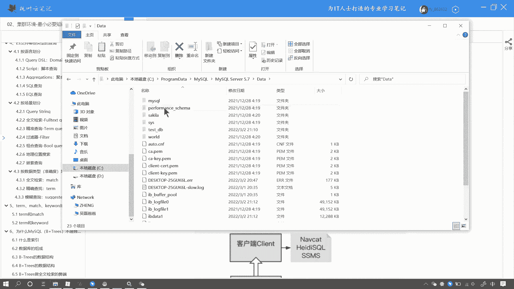

好，我们可以看到这里边的数据库啊，打开文件夹对比一下。😊，首先除了第一个数据库，我们可以清楚的看到数据库和。当前安装数据库的文件啊，它的根目录呢有一个一一对应的这种。关系。你比如说你像beom。

还有t DB是不是一样的？好，那么这说明什么呢？这说明我们对应啊关联的这个数据库的文件呢，就保存在我对应同样名字的这个文件夹里边。好，我们以呃当然这里边除了第一个数据库除外啊。

那这个里边呢保存的是呃其他数据库的数据库信息啊，那么我们以当前比如说t测DB这个数据库为例啊，我们打开一张表，任意一张表。好，我们打打开它的选项啊，呃，我们打开对应的文件夹可以看到里边有一些文件。

首先呢前两个文件。是同一张表的数据文件。那么这里边呢后缀名不一样呢，指的是什么呢？要FRM的文件呢，这个指的是表。结构啊表结构。好，那么这个IDB呢，它存储的是索引和数据文件啊，点IDB代表当前这张表。

它使用的是inow DB的存储引擎。好，那么我们把当前这张表啊，我们找到这张表就是哎CN这张表啊，尝试修改一下它的存储引擎啊，这个引擎咱们可以给它改成my sum，这是最常见的两种存储引擎。好。

保存之后，我们可以看到这个数据文件呢，瞬间呢就变成了3个而D的文件没了，变成了MY和MID这个MY和MID呢是同时出现的。好，下面这个MYD呢它存储的是数据文件。而这个呃原始数据啊。

那这个点MYI呢它存储的就是my sum这种存储引擎的索引文件。啊，那么这就诠释了什么是以文件的形式落地啊。

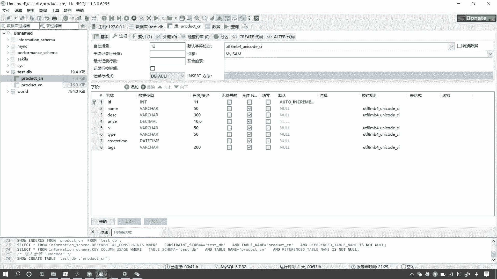

好，那么我们理解了索引的基本概念之后啊，我们来看。其实我们刚才提到了一个概念叫存储引擎啊，那么数据库是由哪些部分组成的呢？好，我们可以看到这个图里边清楚的标注了三部分。首先是客户端啊，那么客户端。

咱们刚才使用的这个叫inno这个叫heycircle啊，在最上方看到没？

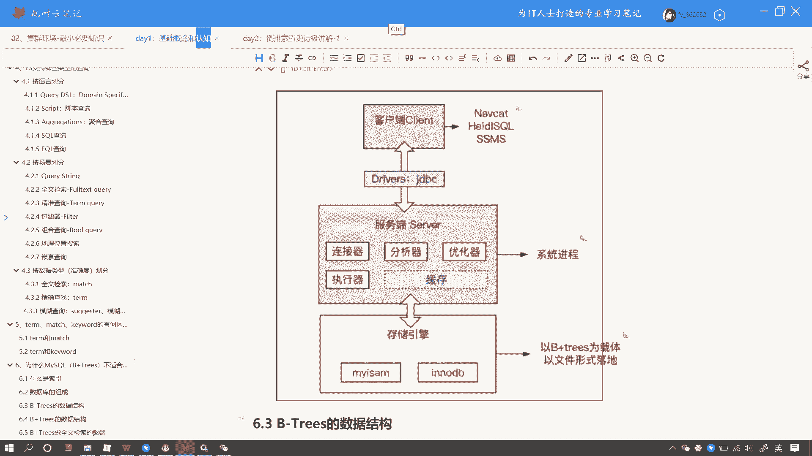

这个黑 circlecle其实就是一个客户端。还有咱们经常用的n，还有这个circle server management studio啊，这个是给 server用的啊，这些呢通通都叫客户端。

它是使用drivers驱动，就是咱们使用的GDBC的那个驱动文件啊，连接到我们的数据库服务里的。那么数据库服务里边包含的这些连接器啊分析器啊等等。咱们不必去关心。

那么所谓服务端呢就是安装在你的服务器里边的这些呃我们看啊，我这已经打开了，我们这里边安装啊，windows里边安装的这个my circlecle的服务呢，是一个正在运行中的一个状态。好。

那么linux也是一样的啊，它其实就是运行在你计算机里边的一个进程。😊。

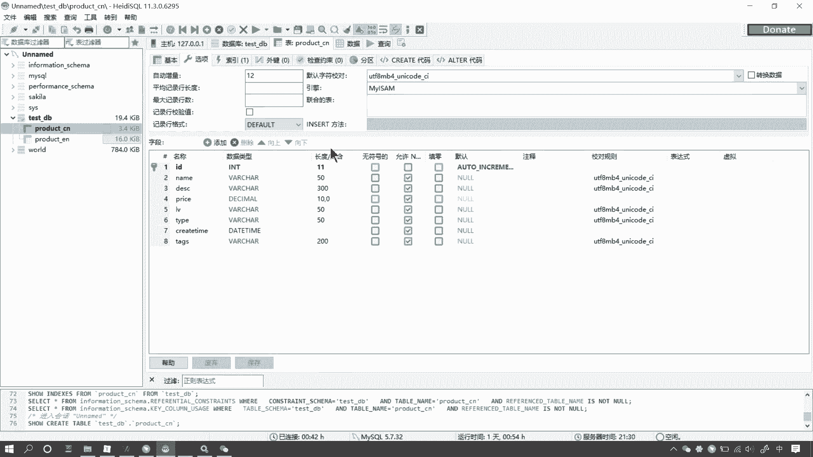

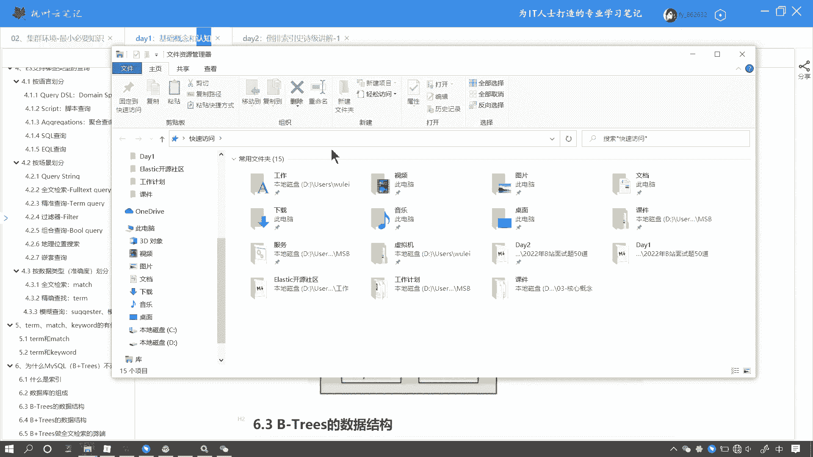

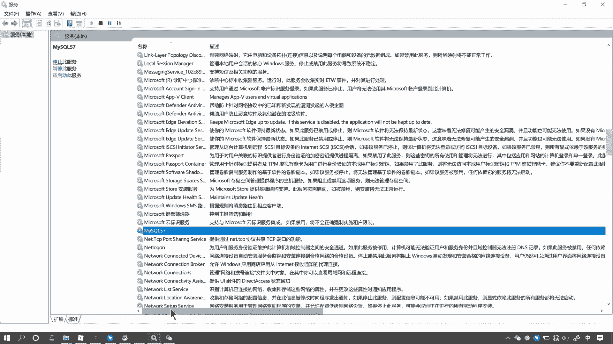

他就是一个进程。好，那么最底层呢就是存储引擎，它是啊就是存储引擎呢是通过呃你像m sum和indoDB啊，通过存储引擎来调用你的数据文件来对你的数数据文件呢进行逐合写啊，负责管理你的数据文件啊。

包括你的索引文件。那么这两个存储引擎内部呢使用的就是以B加数这种呃数据结构为载体。啊，这两种分种引擎呢它使用的就是B加数这种数据结构啊。好，那么下面啊我们要理解B加数这种数据结构。呃，换句话说呢。

就是说我们my circle为什么啊不适合做全文检索？其实本质上呢就是数据结构的问题，它不适合做全文检索。好，那么下面我们来看啊毕加数为什么不适合做全文检索呢？

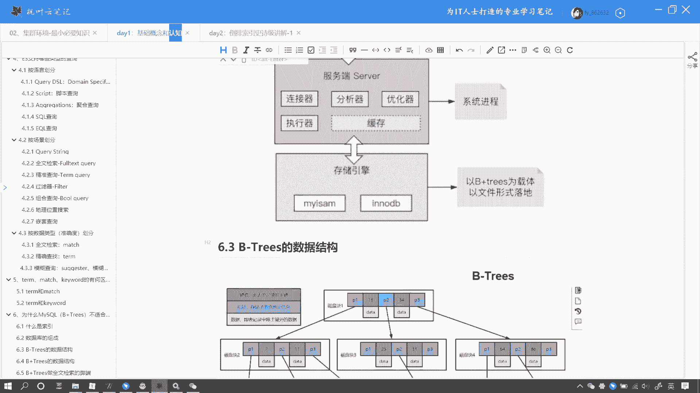

好，之前我们已经了解过全文检索了。那么我们下面来看，那么什么是B加数呢？那在理解B加数的概念之前呢，我们有必要呢先来看一下什么是B数啊，那么B数和B加数呢，其实也是呃除了ES之外啊。

就是抛开ES在my circlecle的层面也是经常会问到的一个面试题啊。所以大家呢注意听一下。好，那么B数啊，B杠数呢指的是B数啊，这个不叫B减数，它就叫B数。好，我们来看一下这个图啊。

那这个图可能画的比较复杂一些啊，咱们打开一个网站。那这个网站呢是一个专门学习数据结构的一个网站啊，那么这个里边呢有一个叫B去。

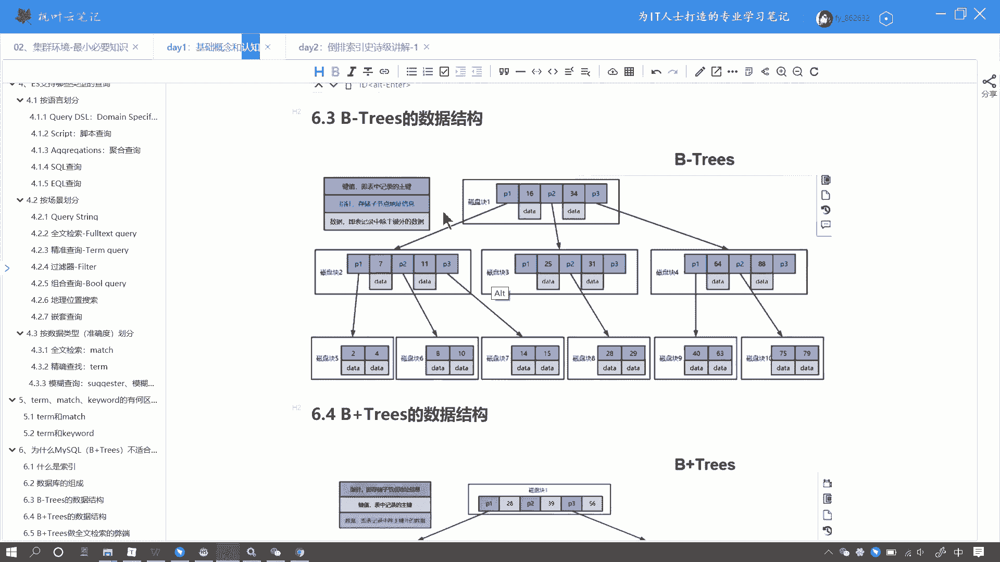

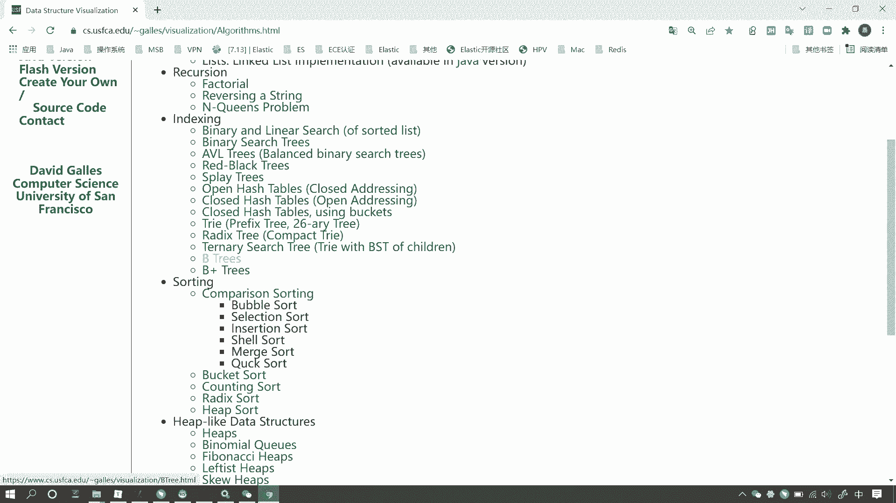

好，我们打开，也就是B数啊。好，那么我们在当前这个页面里边呢看到了一些信息啊。那么首先我画红框的这个里边呢，有一个叫max maxax degree啊，这个degree指的是不或者接啊。

老师呢一般喜欢把它叫做接。那比如说我们当前这个呃我们以max maxax degree等于4为例子。咱们往呃B数这种数据结构里边存储几个数字，咱们来看一下它是怎么存储的啊。

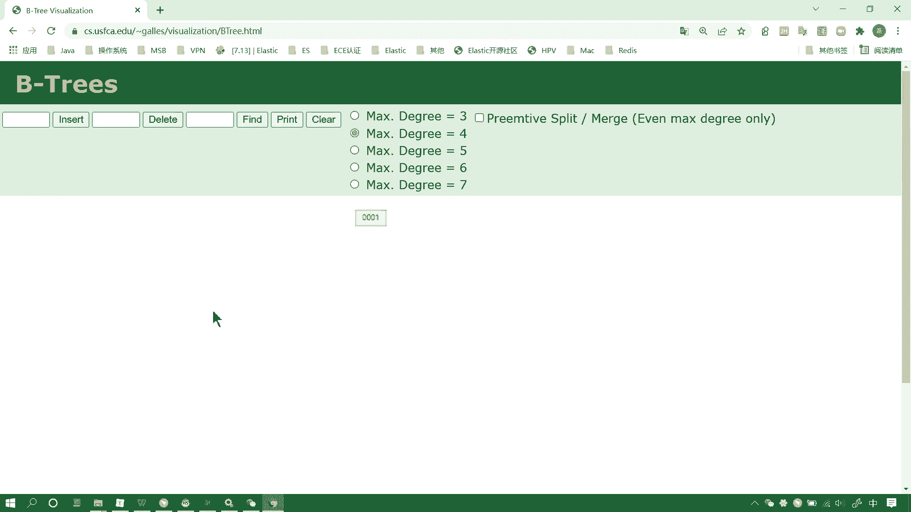

好，我稍微把这个页面放小一些。咱们把这个速度呢调快一些啊。2。是。是。5。没有。7。八。9。是。好，那么我们再把页面稍微放大一些啊。好，我们看到呢当前这是一个竖形的结构。

那么当前这个树形结构呢就是一个B数。

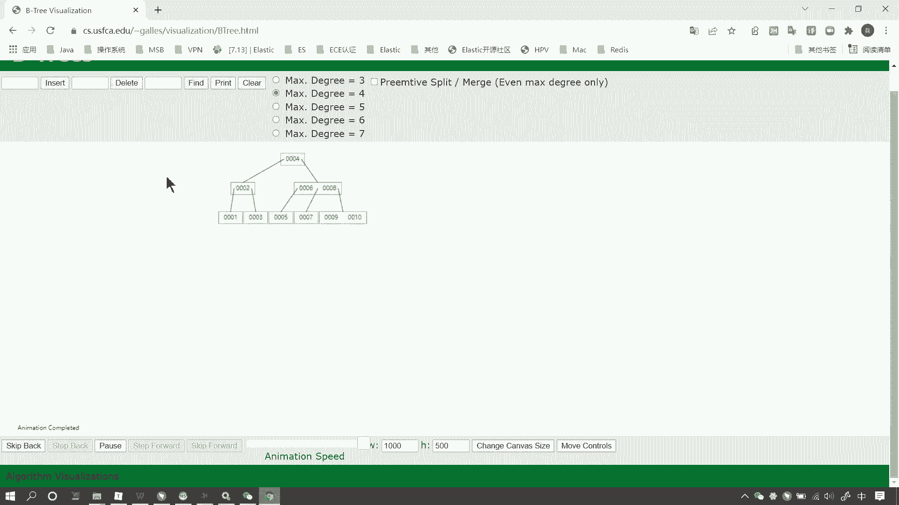

Okay。好，那么数据的检索过程是什么样的呢？首先呢我来解释一下这个max maxax degree的一个概念啊，呃max degree呢指的就是最大的出度的数量，也就是说指一个节点，它向子节点啊。

它的子节点最多有多少个。说白了那么这个绿色的这个线呢，它就是它的出度。好，max degree呢指的就是它最多有多少个这样的出度，其实呢就是寻址路径。max degree等于4呢。

就代表当前0004这个节点最多有4个子节点，最多有4个寻址路径。好，那么这样做呢，也是为了避免它的子节点过多啊，造成这个资源的浪费啊，导致你的这个呃查询效率变慢。好，那么我们来演示一下啊。

我们把这个这个速度稍微降低一些啊，咱们来演示一下啊，如果是B数这种情况呢？好，我们要检索当前数据等于七的这一条数据好，它存放在什么位置。

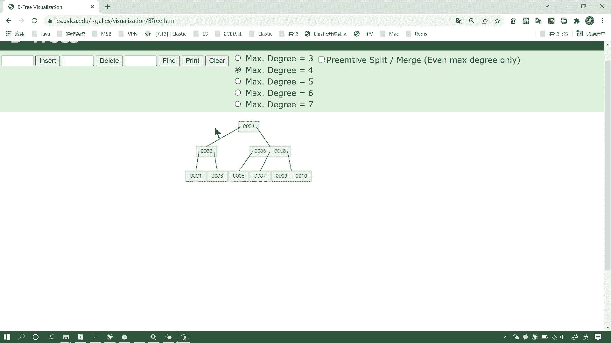

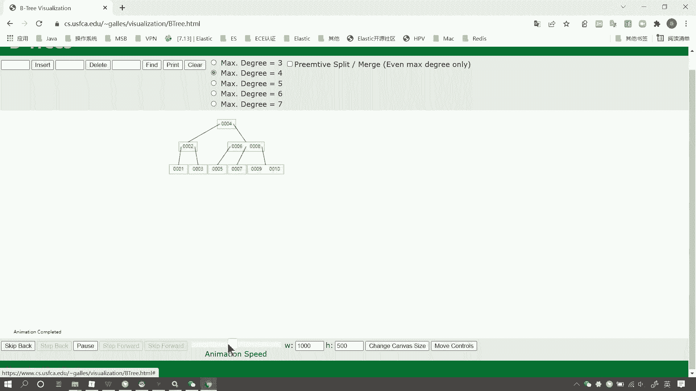

好，我们来看啊。fin的。看当前红框转移的顺序。好，我们来看啊。那么首先呢当前红框第一次闪烁是闪烁在这个位置。好，当发现0007呢不在这个节点里的时候。

那么计算机呢会判断啊这个计算机的交互过程是什么样的呢？首先呢这个数它是啊我们刚才已经解释了，这个数据结构是以数据啊就是以数据结构为载体嘛，以这个BB加数的数据结构为载体。当然这个是B数啊。

那么最终存放的位置呢是dis，也就是磁盘。哦，那这个磁盘在计算机进行交互的时候呢，首先呢会被拿到内存里。当然了，根节点是缓存在内存里的啊，叫RAM。好，拿到内存里之后呢。

其实最终啊给我们调度的叫CPUCPU是负责来计算的。那么计算就是说CPU从内存里拿到这个数据之后，发现啊，0007这个数据不在你当前这个节点里。OK那么我调用啊我我告诉这个计算机。

我操纵计算机来进行第二次这个磁盘的IO好，进行第二次IO呢，这个路径就是这里因为000070007是大于0004的，所以我们向右侧进行寻址。那么寻址好。

那么CPU呢会调度呃这个计算机资源啊当前这个节点好，放到内存里，然后供CPU来调度。好，那么当前又产生了一次IO。那么在不考虑根节点缓存的情况下呢。

首先根节点一次IO那么当前产生了第二次磁盘IO那么就是第二次。好，那么0006和0008被CPU调度之后呢，会判断0007在不在当前这个节点发现不在之后呢，好，那么0007是大于0006的。

同时它是又小于0008的。那么它的三个寻址路径呢？好，就会按照中间。这个位置进行寻址。好，最终找到0007这个节点。好，那么这时呢就产生了3次IO。好，那么也就是说我们当前这次查询呢有三次红框的闪烁。

每一次红框闪烁呢，都要把这个磁盘中的这个节点呢放到内存里，供CPU去调度和计算。好，那么知道咱们知道了这个调度原理之后呢，好，咱们就理解了这个呃CPU这么检索的一个过程啊。那么在此过程中呃。

速度最慢的就是磁盘的IO。因为在计算机的这个呃模型里啊，就是说咱们所有的计算机呢都是基于这个弗诺伊曼的这个模型，是吧？在计算机的这个硬件里边呢，磁盘它的速度是小于。什么小于内存的。啊，这个没问题吧。

这个是绝对没有问题的。那么。内存的速度呢又是小于CPU的。所以一般来说呢，咱们磁盘呢都是计算机的这个性能瓶颈。啊，这个能理解吧？那么所以说咱们要尽量的避免啊我们对磁盘频繁的产生读和写的操作啊，OK。

那在这里边呢，又涉及到一个概念啊，咱们需要了解一个概念叫d。

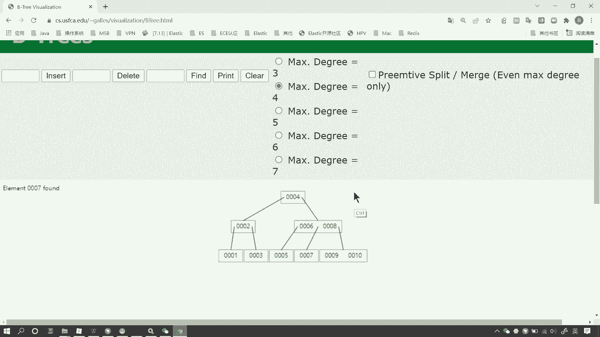

叫。data配置。好，那么这个data page置呢是my circle中的数据页，也就是最小的数据单元啊，是my circle中磁盘和内存最小的数据交互单元。好，不理解这句话，没关系啊。

没有这个不知道这个d page的概念没关系啊，我相信大家呢都听过一个词叫做格式化。

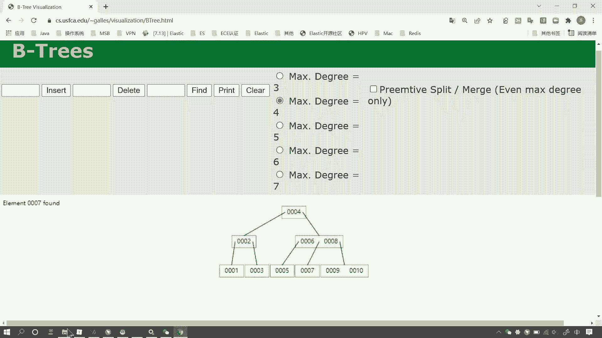

好。好，那格式化什么意思呢？很多人把它理解为删除当前磁盘的数据，其实不然啊，那么删除磁盘的数据呢只是格式化的一个结果，而不是目的。好，那所谓格式化呢，就是写对当前的磁盘呢写入文件系统啊。

这里边的文件系统呢有很多，像NTFSFTS啊等等，还有那个linux常用的那个。叫EXT是吧？EXT4，咱们现现在最常用的。呃，那么什么叫文件系统呢？这个里边有一个概念啊。

是为了帮助我们去它可以帮助我们去理解这个d配置。好，我举个例子啊，比如说咱们呃你新房的装修，比如说这是一个衣柜。那么假如说衣柜里边呢没有做任何隔断，就是一个箱子。那么你的衣服放在这里边。

你女儿的衣服也放在这里边。啊，你妻子，你太太的衣服也放在这里边。那么只能堆在一起，因为我只有一个箱子。那么这样的话就是说如果你从这里边找一件衣服，那可能就会相当困难。那么有什么办法呢？好。

我们聪明的人类呢就想到了一些办法，对当前的衣柜呢打隔断画格子。好，划分成若干个隔断之后呢，哎我就可以把不同分类的衣服呢放在不同的格子里。比如说我这个衣服放袜这个格子放袜子，这个格子放我的衣服。

这个格子放我女儿的衣服，这个格子放我呃妻子的衣服。好，那这样的话就是说我可以快速的定位到一个格子里边去找我对应的衣服。那其实呢所谓文件系统呢，就是对你的磁盘打隔断。

那么像windows默认的文件系统呢叫NTFS。那么这个格子啊最小的这一个格子呢就是4KB。好，那么这一个格子是什么意思呢？就是说你每一次CPU调度的时候呢，从磁盘里边取数据的时候。

我一次性呢最小去读取一个格子的数据，也就是4KB。好，这就导致一个什么什么结果呢，咱们来看啊，我桌面上有这么两个文件。好，有一个是叫16KB的文件啊。咱们打开来看一下。啊，点击。看一下属性。好。

我们看来看啊，那么它的大小呢实际上是15。6KB，但是它却占用了16KB的空间，是为什么呢？好，注意啊，那么当前也就是说我磁盘呢每一个格子是有4KB没问题。那么当前我这15。6KB的空间呢。

首先前三个格子呢都填满了。那么前三个格子，1个4KB呢，就是12KB。那么剩下3。6KB呢，占用了最后一个格子啊，它留了一点空间没有占满。也就是留了这么一点空间，没有占满。好。

但是在CPU去取磁盘数据的时候呢，我一次至少取一个格子。所以当前15。6KB呢就占了4个格子。那么CPU在取的时候也只能取1616KB。所以它最终占用的空间呢就是16KB。好，那么咱们还再来看啊。

那么这有一个呃叫两1KB的文件。那么其实它占用的空间是稍微大一点，是2KB啊，咱们打开看一下。你看啊它的内部空间呢啊实际数据只有1。5呃1。65KB，但是它却占用了4KB的存储空间，因为没有把格子占满。

它也要占用一个格子CPU在取的时候，它只能取啊这4KB的空间。好，其实这就是4K对齐啊。

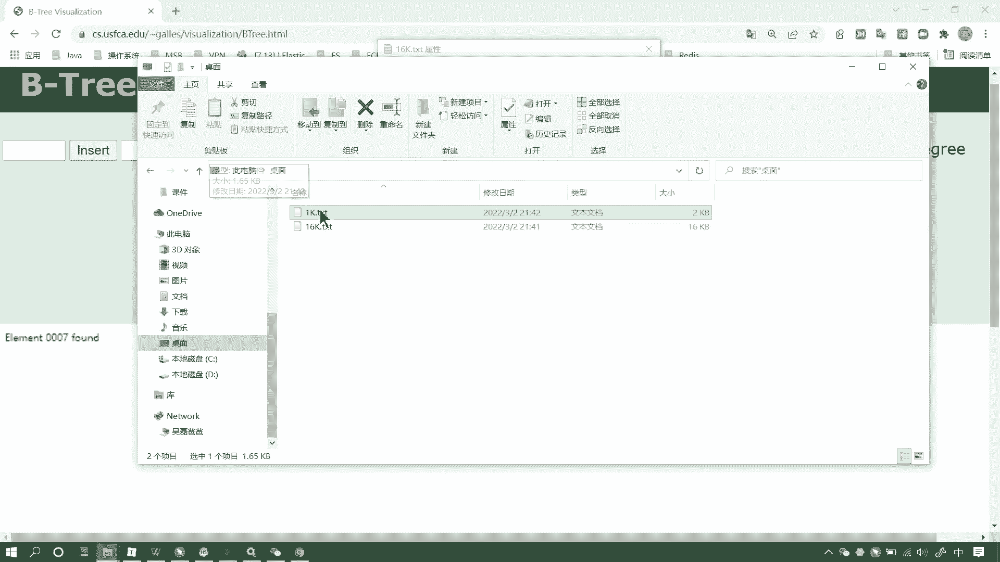

好，那么咱们尝试呢把这个1KB的数据复制出来。

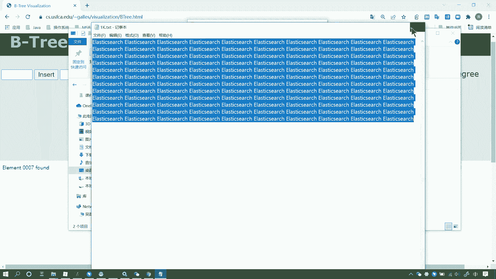

啊，放在这个16KB的文件里边，放在最末啊放在最末。对。放在最下面啊，敲一个回车，一个空格。好，咱们保存保存之后呢，它占用了多少空间呢？实际上就是10啊15点。15。6加上。啊，加上一点几来着。

一点几忘了啊。那么其实呢它的大小一定是大于16的对吧？一定是大于16的，而小于。20。但是啊因为一个格子呢就是4KB，那么它就是CPU带取在读取磁盘的时候呢，肯定是四的倍数。

所以呢它取它那个当前文件呢占用的空间呢一定是20KB，咱们可以来验证一下啊。好，你看这个空间。诶。好，是不是20KB没有问题啊没有问题。

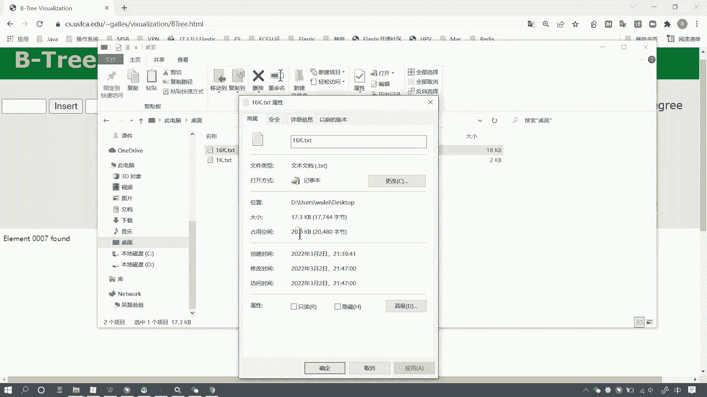

好，那么咱们把这个关了，那我讲这些有什么用呢？好，那个当前的这个格子啊，在NTFS的文件系统。是4KB，一个是4KB。那么在它的上层应用呢。

就是说我们的这个my circlercle呢作为呃操作系统上层的应用呢，它的这个每一个啊也就是最小的格子呢，这个data配置呢它其实就是这么这么一个小格子，它是类似的。但是上层应用呢。

它一次性啊只能取N多个格子。所以这个data配置它一次就是my circlercle和呃内存它交互的一个最小的数据单元。那么它的大小只能是四的倍数。在my circlecle里边呢，它的这个倍数呢。

它的这个大小呢就是16KB。也就是说啊咱们当前这个B数的这个图形，每一个节点呢它就是一个最小的数据交互单元，也就是一个data配置也就是一个数据页，它的大小呢就是16KB，并且是固定的。好。

知道了这一点。那么我们刚才在当前这个数里边去进行查数的时候，那么数据ID为7的这条数据呢，我们检索了3次，这是第一次，这是第二次，这是第三次。那么也就是说我们从磁盘中取了3次数。

也就是产生了48KB的IO。那么一个人48KB。那么在高并发是吧？这种场景之下呢，可能就会产生大量的磁盘IO好，那么这就会造成IO瓶颈回过了回过头来看笔记啊，那实际上B数中的存储呢啊。

实际上是这么一种啊，实际上这么一种结构啊，我们放大一些。

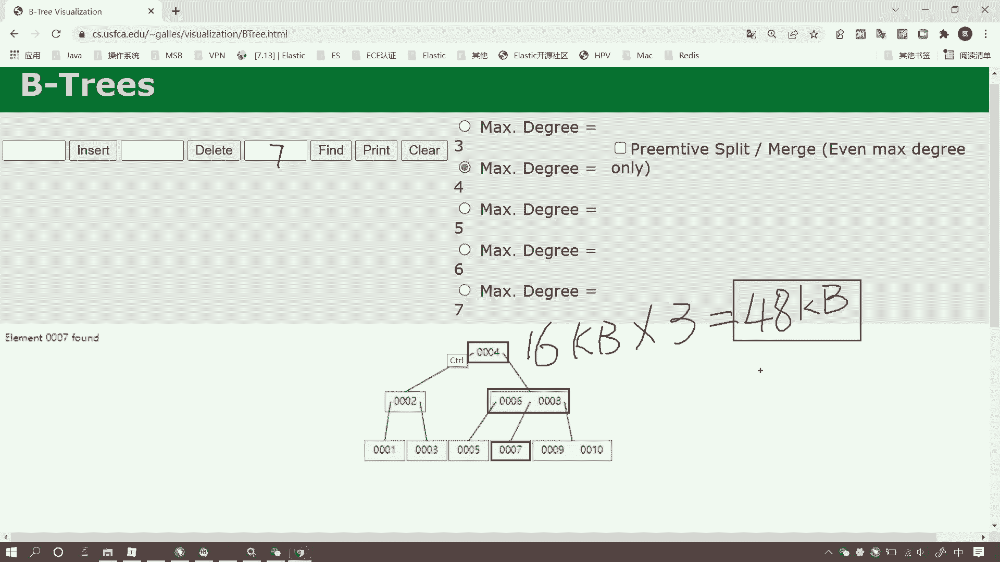

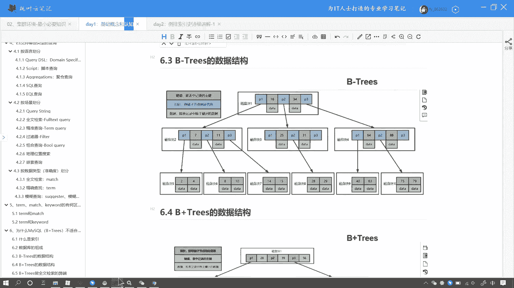

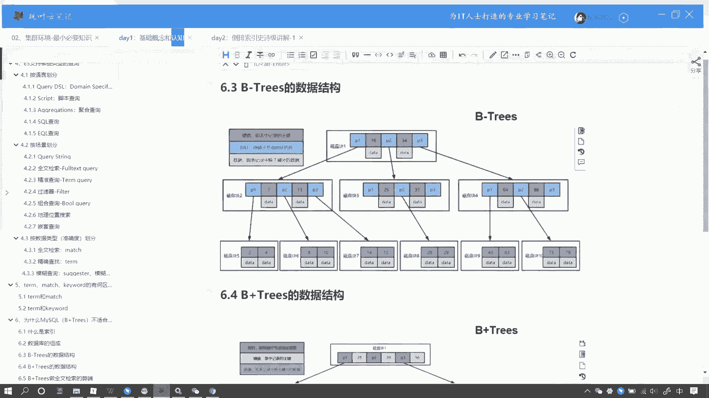

好，在每一个节点里边呢，它都存储了哪些信息呢？首先呢啊我们当前这个ID的原始数据，除此之外呢，还有你当前呃这个数据行的这些数据信息。好，我们来打开表上来看。

看一下他的数据啊。好，假如说我们在ID这个字段上创建的索引，那么原始数据啊，就是我们的索引信息呢只是一个呃数字类型，可能占用了很小的空间。而我们其他的这些字段就是nameDIC这些其他的所有字段呢。

就是我们刚才在图中看到的这个data的这一部分，它是比较费空间的。

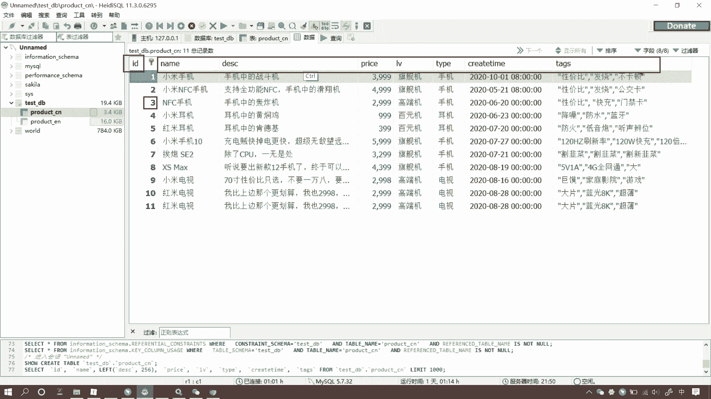

好，那么还有一部分呢，就是我们当前呃子节点的寻址地址啊，它就是指针啊，这一部分也会占量占用少量的信息啊。但是这一部分呢，比如说我的m max degree等于4。那么当前这个存储指针的这个部分呢。

就只有4个啊。好，那么最占用空间的就是黄色的这一部分，对吧？那么我们想。来想一个问题。我们每一个节点大小是16KB啊，是固定的。那么也就是说我们当前每一条数据的空间如果越大。

那么当前每一个节点存储的数量也就越小。比如说如果每一条呃每一条数据呢占用1KB的空间，那么我们当前这个节点就只能存16条数据。如果每一条数据只占用啊，比如说一个字节。或者说0。5KB。

那么我们当前这个节点就能存放32条数据。以此类推，如果说我们能尽可能的把数据进行减重，比如说我们把这个data不存了。只存它的缩引。那么可能这一个数字占用空间非常非常少。那么这样的话。

我们一个节点就能存放大量大量的这个呃数据。那么比如说我们的数据呢一共有1600万条。好，当我们的数据量很大的时候，我们的节点单个节点存放的数据越多。那么我们需要的节点数也就越少。好。

当我们的节点总数下降的时候，基于这种max degree的这种啊存储的方式是吧？degree DGRE啊，没了是吧？

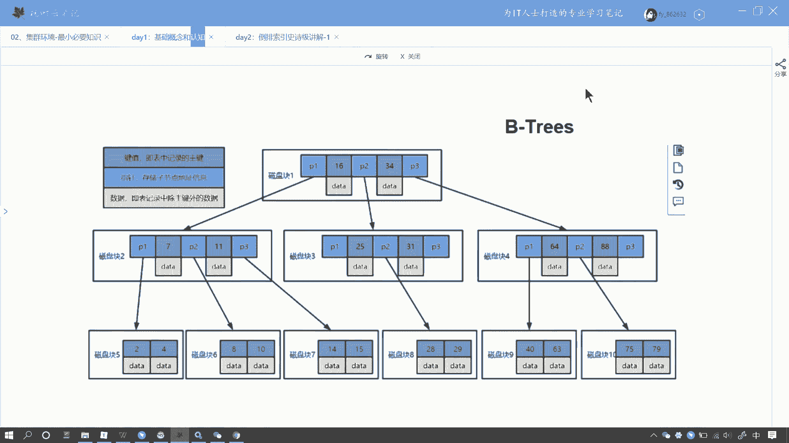

在哪呢？在这里。好。

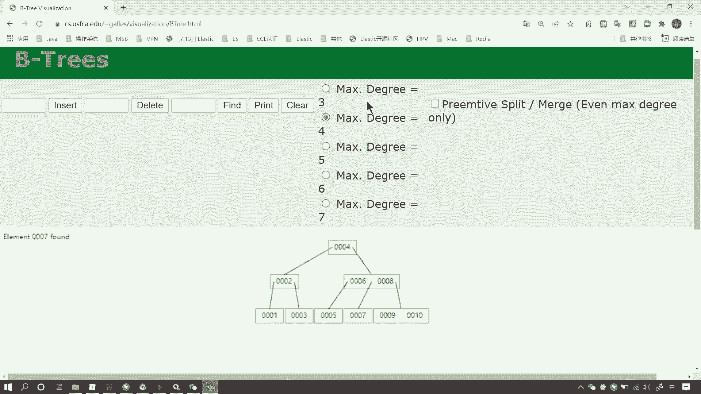

缩小一点啊。好，当我们的这个max degree一定的时候，我们的节点数量降低了。那么我们的数的深度就会降低。因为我们层啊当我们的这个层数不变的时候，比如说我们只有两层的时候。

当我们这个max degree产生了3个，产生了4个。比如说这一个节点，这儿一个节点。好，那么我们当前就前两层呢就有第一啊，下第二层有4个就有5个节点是吧？那么我们当前因为max degree的限制。

我们只能通过增加数的深度来增加更多的节点。所以说当我们的节点越来越多的时候，数的深度就会越来越深。好，数的深越数的深度越来越深。好，那么就会造成我们当前这个节点呢不断的向下寻址。啊，不断的向下寻直。好。

每一个节点呢是16KB当我们的深度越深的时候，那么比如说1616，每一次16161616，那么这样呢就会造成大量的磁盘LO也就造成了性能的下降。好了，理解了这个原理之后啊，我们再来看一下什么是B加数。

好，其实呢B加数啊，就是把我们当前这个data啊给干掉之后，你看我们啊这就看着清量多了啊。那这里边呢原本这个位置呢是有一个data存放数据的。好，我们把这个data给干掉了，把它放到了叶子节点里。

那这样的好处呢，其实啊就是方便我们每一个节点呢去存放更多的数据，从而降低我们节点的总数啊，这样的话啊我们的这个磁盘IO呢就会大大降低啊，从而增加性能。好了，那么理解到这儿呢，我们其实可以尝试理解一下。

我们想象一下我们刚开始提的这个问题啊。就是为什么说B加数这种数据。

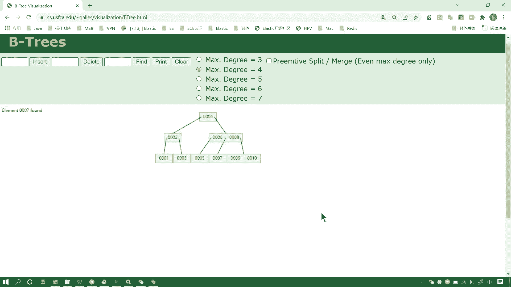

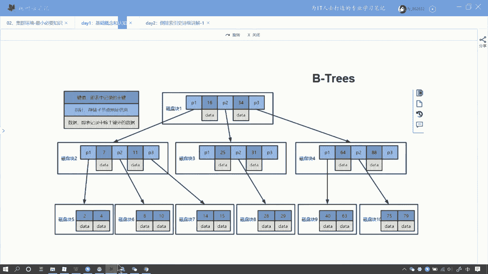

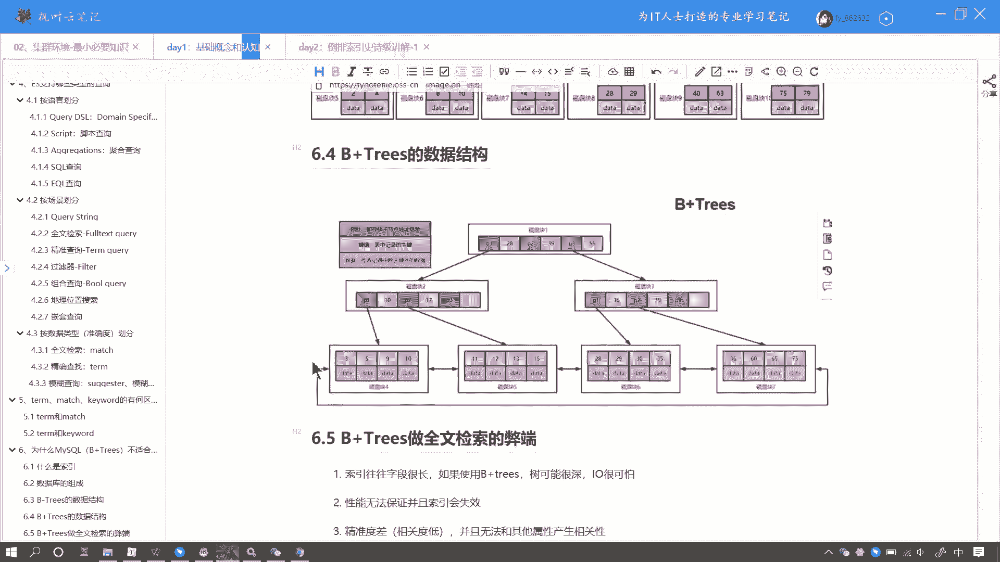

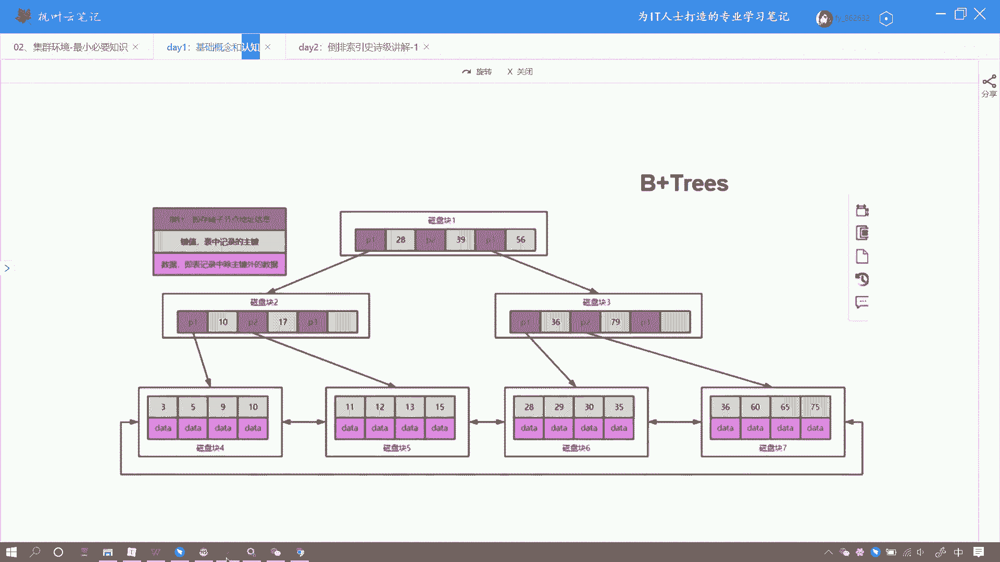

后呢它不适合做全文检索呢。好，我们再回忆一下什么是全文检索呢？全文检索一般来说呢是在搜索引擎，或者说在这个呃它的搜索需求呢是在文字字段上搜索。比如说我们搜索你拉这个 searcharch。

对。啊，网比较慢哈。那么我们搜索的这个结果，一般来说呢，我们看。😊，一般来说呢，我们搜索的这个结果啊都是在这种文本字段上进行的。也就是说呢我们要创建的索引一般都是文本字段。好，我们打开。

啊，my circlecle也就是说假如说我们这个name呢就是这个title啊，就是搜索引擎里边那个titleDESC呢就是它的内容字段。那么我们想一个问题啊，ID和这种文本字段啊。

有的文本字段呢可能动辄上几KB甚至几兆。那么如果说我们在这个DESC这种字段上去创建索引，那么势必会造成什么呢？因为一个文本字段很大。那么如果我们用B加数这种数据结构啊，我们来看。

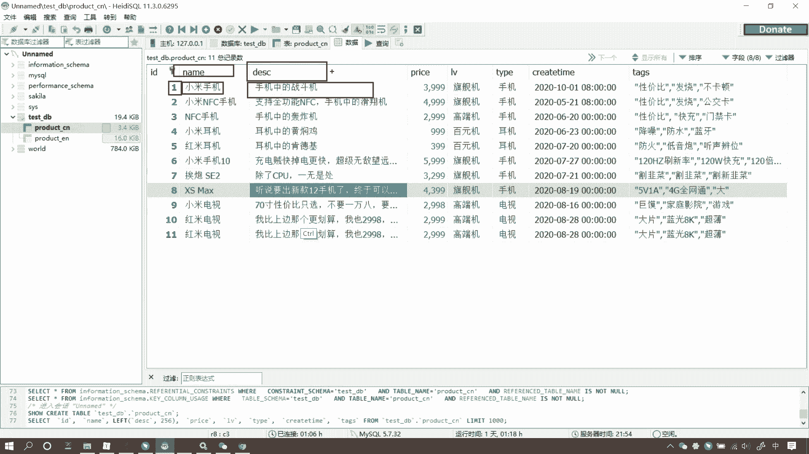

好，我们来看啊，那么每一个节点是不是啊每一个节点，咱们来看这个图吧。

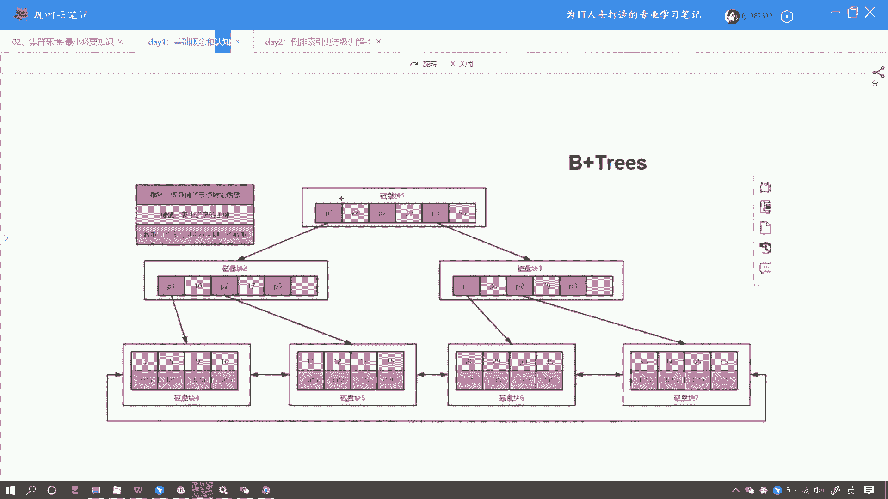

好，那么每一个节点的大小因为只有16K。那么如果说我们创建索引的字段呢，是一个文本类型，那么有可能一条数据，比如说一条数据。啊，16KB啊。那么假如说一条数据它的索引大小超过了16KB，甚至是一兆。

甚至10兆都是有可能的。或者说咱们就一兆吧。那么一兆呢，你想想一个节点，我连一条数据都存放不了。那么我一条数据我的索引文件可能就用好几个节点来存储。那么这样呢会造成什么问题。

我的这个节点数啊会指数级的飙升。啊，会以一个非常大的数量级来啊来存储。那么这样呢，其实呢就会导致我当前的这个数的深度呢特别特别深。特别的深哦，从而降低我当前磁盘查询的这个性能。啊。

因为产生了大量的磁盘IO嘛。

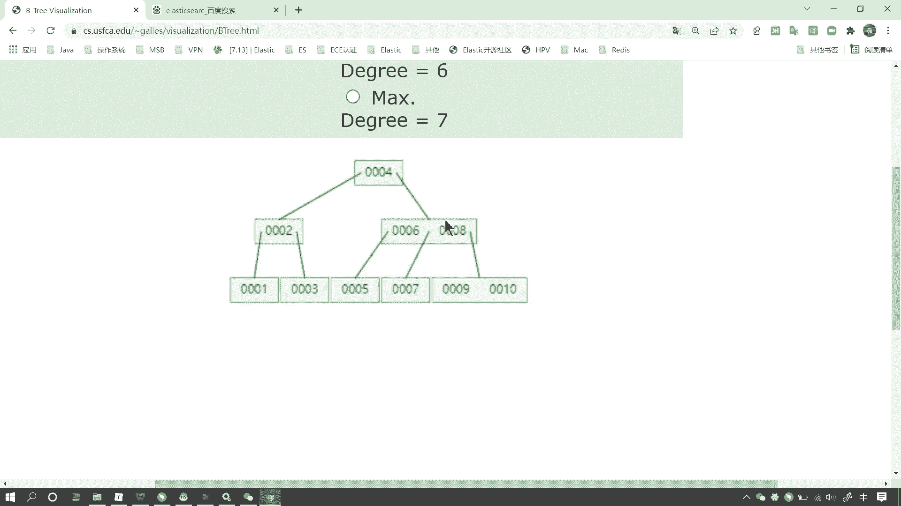

好，能不能理解？好，那么总结下来呢，为什么说这个啊。

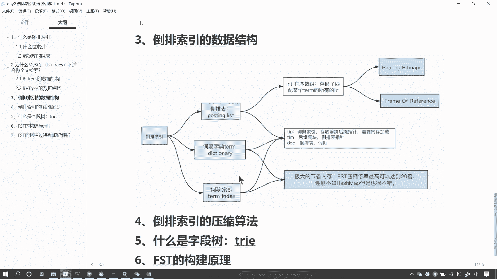

啊，在在这里啊，那么为什么说盗牌索引不适合做全门检锁呢？好，第一个原因。

索引往往字段很长啊，就是倒牌索引这个全文检锁的字段，一般这个字段的这个索引长度是比较长的。所以如果一般使用B加数来存储啊，那么当前的数会特别的深。啊，所以性能会特别的差。这是第一个也是最主要的原因啊。

这也是为什么my circle达到一个，比如说千万级的时候，比如说达到2000万的时候。啊，或者3000万的时候，那这个性能呢会指数级下降啊，会直接下降很多。好，那么性能无法保证，并且索引会失效。

索引为什么会失效呢？因为如果说我在B加数上创建索引，创建的是普通索引，那么你要查询的时候呢，我们经常在惯形数据库中使用的是这种叫likeck查询是吧？likeck查询。那么因为最左匹配原则呢。

咱们为了保证这个准确度，你不得不在两边啊做模糊查询。那么如果说你在左侧使用的百分号呢，会导致你的索引失效。啊，这个如果不理解的话，可以在搜索引擎中尝试搜索一下什么是最左匹配原则。那么并且精准度差。

那么这个如果你理解了道开索引啊，不是说如果你理解了这个全文检索，那么你应该知道为什么精准度会差啊，也就是说为什么相关度会低。啊，并且无法和其他属性产生相关性。什么意思呢？

就是说呢我们在做毕加数做检索的时候呢，只能用likeck这种方式去查询。啊而我们全文检索呢，实际上是可以关联一些像呃其他的，比如说别名啊呃英文单词啊，或者说拼音啊，或者是昵称啊。

或者是这个混淆字啊、错别字啊，这些都是可以识别的。或者说你像霸道和普拉多这个例子都是可以关联的。但是如果你用这个毕加数来做检索。那么只能说是有一个文字包含的关系。比如说你搜霸道，那么。呃，你搜霸道。

可能这个文本里边是丰田霸道，你可以匹配到。但是如果原数据中存储的是普拉多，那么你显然是存储是检索不到的。也就是说它的精准度是比较差的，相关度是比较低的。好，那么咱们到这儿呢就解释了为什么呃B加数呢？

它不适合做全面检索。

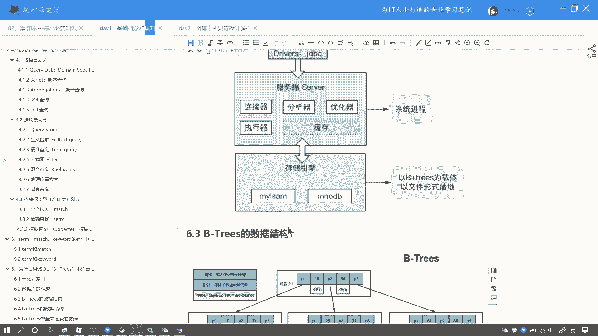