# 系列 6：P155：FOR - 马士兵学堂 - BV1RY4y1Q7DL

好，我们来看下一个问题，倒排索引底层的压缩算法。那这是一道来自美团的面试题。对应的岗位薪资呢在35K到40K左右啊，这个问题呢稍微有一些难度。如果你了解倒排索引的底层的话。

你会知道倒排索引它底层包含了倒排表，而倒排表是基于两种压缩算法来实现的。第一种叫FOR。那么下面我们来看这个压缩算法是如何来存储数据的。好，那么倒牌索引的样做算法呢。

实际上是基于倒牌索引这个问题所引申出来的一个比较底层的问题。那么我相信啊屏幕前的小伙伴啊，包括很多面试官在内呢，可能都没有真正的去深入底层了解盗盘所以它底层的一些算法。那么如果你想在面试中。

如果被问到这个问题啊，想拿到一个比较高的分数啊，我建议大家是要学习一下这个压缩算法的。好，那么压缩算法它本身解决了一些什么样的问题呢？好，其实呢从字面我们可以看到啊，那么压缩算法呢。

它的目的呢是为了压缩数据啊，咱们之前了解到啊，咱们学习了关于呃倒拍索引，它底层的三种基本数据结构之一叫posting list啊，就是倒拍表。那么它存储的是当前词项所对应的这个映射啊。

映射的是所有的原数据中包含当前词项这个小米。

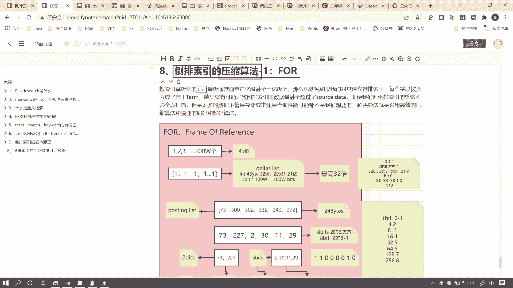

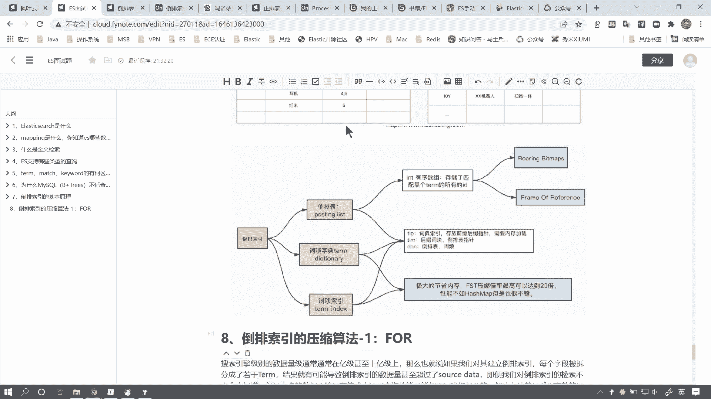

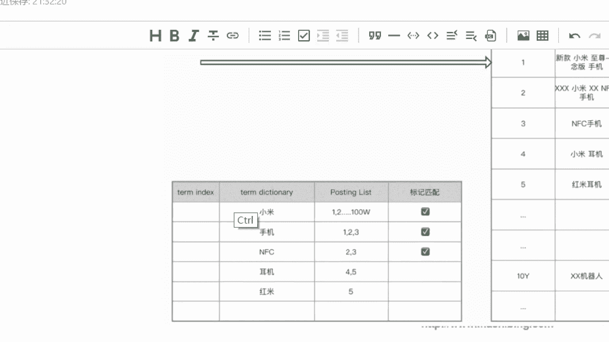

ID的一个有序的int类型的数组啊，并且是有序的，而且是int类型的是数组。好，那么这儿呢就会涉及到一个问题，什么问题呢？

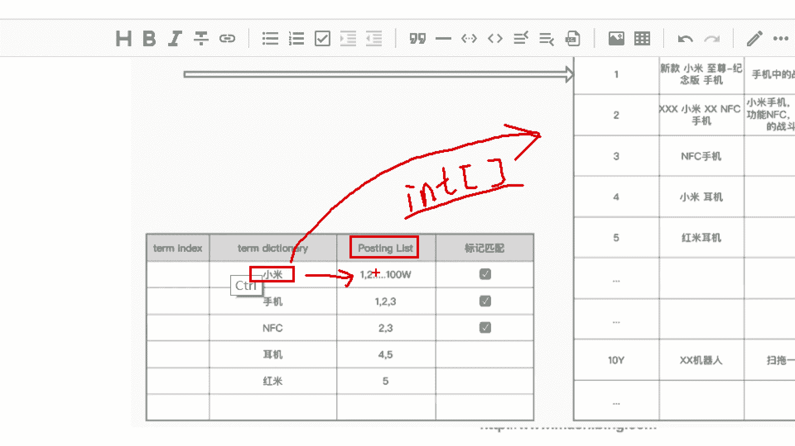

咱们目前计算机体系呢是基于一个叫冯诺伊曼的啊这么一个啊我就不写了，冯诺伊曼这么一个。啊，计算机啊里边的一个科学家。那么基基于冯诺伊曼这个模型建立建立起来的计算机体系。那么否诺易曼呢有三个基本原则。

其中之一呢就是二进制。也就是说咱们数据的存储呢是基于二进制，何谓二进制呢？好，假如说啊咱们当前要存储一个数字一，那么咱们可以用一个叫we的这么一个东西啊，比特来存储。什么叫一个比特呢？

就是一个零或者一个一。那么当我们数字存储零或者一的时候，我们就可以用一个比特来存储。然而，我们想要存储数字二的时候，二进制呢就发挥了作用。那么此时好，咱们重新画啊。40比如说我存零和一的时候。

那么一个比特已经存不下了，因为我只能存零和一，那么此时我就需要进位。好，本来呢11个比特啊，这是一个比特，我们可以存储最大的数字就是一。而两个比特，那么当前就是我进啊进位了，那么这个数字呢就是3。

这是两个比特。好，当我存储4的时候好，我这把零换成一就变成了11。这就是两个比特所能存储的最大的数字，也就是它的取值范围呢是0到3。好。0123嘛，能存储2和3。当我们存储4的时候。

那么我们就需要介入到第三个比特。那就是100啊，存储5，那就是101，存储6就是110，存储7就是111。也就是说我们单个比特的时候，存储的最大数字就是7，取值范围就是0到啊0到7。好，以此类推啊。

那么这个就是二进制的一个基本原理。对于我们程序员而言呢，这应该是一个常识啊。好，那么我们在定义int类型的字段的时候啊，我们一个类型，我们一个字啊，我们一个数字类型呢实际上是定义了。四个字节。

也就是32个比特啊，这个B是大B啊，是字节的意思。好，一个字节呢等于8个比特，这没问题吧啊，这是计算机的常识啊。那么int类型呢占用4个字节，也就是32个比特。它能存储的最大数字呢就是二的32次方减1。

因为它的取值范围呢就是0到2的32次方减1，没问题吧。这是它的取值范围。好，那么一般来说呢，int我们是有符号整形。所以可能我们其中有一个比特啊，要用来存储这个呃正负号啊，就是正数还是负负负数。

所以我们一般来说呢，int类型的它的最大值呢是二的31次方减1啊，这是这个原因啊，呃大概是21亿多吧。好。

呃，我们简单说这么多啊，那么我们来看现在问题在哪儿啊？问题在于我们当我们存储这个招牌表的时候。

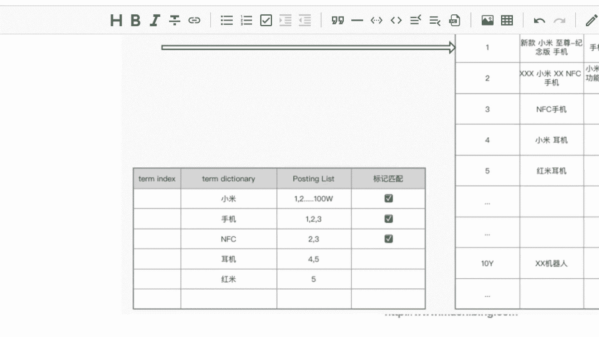

假如说我们当前包含这个此项的ID呢有很多很多。假如说我们有100万个，那么100万个ID呢，也就是。100万个4个字节。因为每个字每一个数字呢是四个字节嘛，我们乘100万。

那么他得到的最终呢就是400万个字节。啊，换算成照B呢，大概就是3。8个MB。好，也就是说我们当前这一个词项对应的倒排表，它所占用的字节呢啊它所占用的磁盘空间呢就是3。8兆。好，看似不大。

但是我们要思考一个问题。我们词项字典基数有可能很大。也就是说我们倒台表当前的3。8兆呢只是一条啊，只是一个缩引才对应的postsing list就是3。8兆。那么假如说我们有11个啊。

这里边纵向基数有11个，甚至更大。我们拿它乘以10亿。那么它的空间是不是就不可估量了？我们要知道压缩倒台表，它的一个目的是什么呢？首先第一个。为了节省什么空间。空间就是我们的成本。第二个，为了性能。好。

当我们磁盘空间占用的多的时候呢，我们会占用更多的磁盘IO网络IO和内存资源。所以说我们一般来说呢是把灶台表进行压缩，然后啊以最小的代价用来存储啊，同时也能提高它的性能。我们后续会讲为什么。

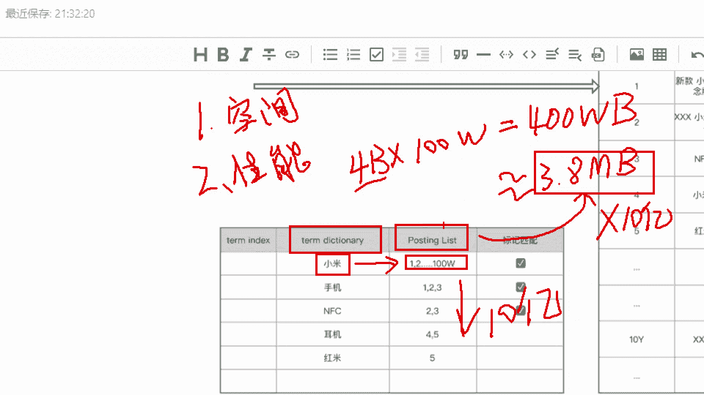

好，那么我们来看啊倒牌表呃，这个FOR呢它是如何做到呃压缩我们的这个盗牌表的。首先呢假如说啊我们当前的这个ID就我们拿小米这个词项为例。假如说它有100万个啊这个包含小米的这个盗牌表的ID啊。

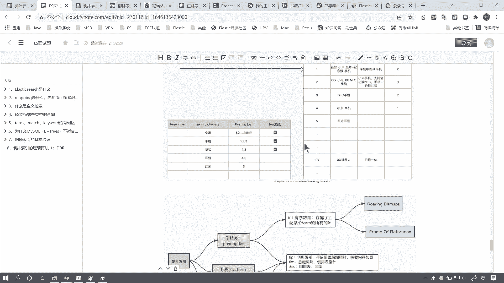

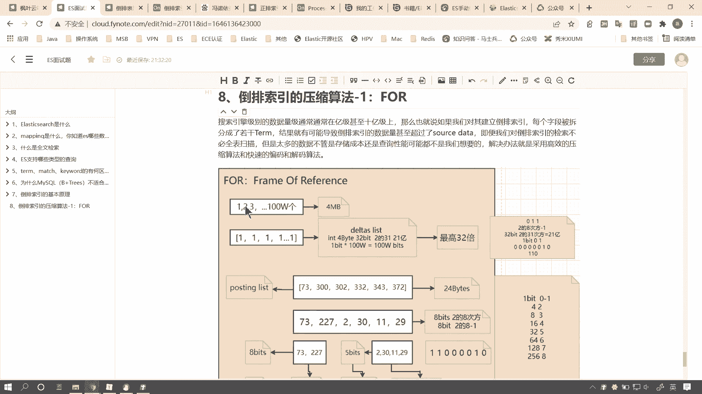

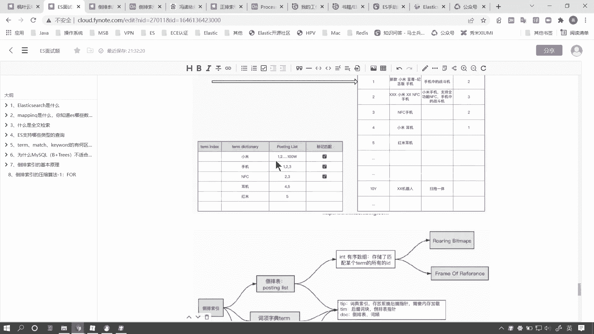

好，我们就以这个为例子啊。

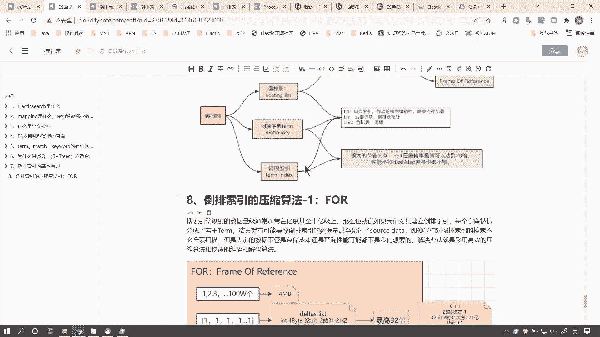

好，那么100万个ID我们刚才已经计算了，它的大小大概是3。8兆啊，我们约等于就按4兆来算啊。好，那么倒牌表这个FOR呢这个压缩算法呢？首先呢它是怎么做的呢？假如说啊我们一种最最极端的情况。

我们这100个ID100万个ID呢就是1到100万这100万个数字。好，我们先来看这种特殊情况。好，每一个ID呢就是一个第1个等差数列嘛，就是1个11到100万的这么100万个ID。好。

那么我们如果用普通方式来存储是这么大的空间。好，那么假如说我们做一个什么操作呢？做一个呃每一个ID呢，我们去减去前1个ID而保存的差值。那么第一个ID呢，因为它前边没有没有ID，所以它就是一。

那么第二个ID减去它前1个ID呢，就是它的差值也是一。第三个减第二个也是一以此类推，那么最后1个ID减去它的前一个数字呢，也是一。所以呢我们100万个int类型就变成了100万个数字一。好。

也就是说我们当前取了一个差值列表啊，下面这个列表呢是上面这个列表的一个差值运算啊，这么一个结果。好，那么有一个什么样的效果呢？首先呢我们称之啊这个下边这个列表呢叫它delta list。啊。

给他起了一个名字叫daelta list。好，我们在面试的时候，可以向监考官去输出这些关键词啊，delta list就是它的差值级。好，那么本身我们一个in类型占4个字节。好，为什么占四个字节？

是因为它的取值范围最大是2的31次方减1啊，咱们就按32次方来算。好，那么我。目前来说呢，这个100万个ID呢因为最大值里边是谁呢？里边是一，也就是说我所有的数字呢都可以用一个比特来存储，为什么呢？

我们来想啊，我们来想呃我们计算机就是我们的JDK里边为什么要定义这个呃int类型。你看硬类型嗯。撤回一下啊。int类型，shott类型。或者说这个浪类型为什么要定义这些类型呢？就是为了用更合适的类型。

好，如果你的确定你的这个数字范围取值范围足够小，我就用更短的类型来存储。这样的话会占用更少的磁盘空间。其实这个也也叫呃叫。这个int类型，你比如说我每个int类型呃四个字节，每个类型四个字节。

这样的话是便于我去检索的。因为我定一个int类型呢，实际上就在我的磁盘上去开辟了一个四个字节的空间。不管你是不是用得完，那么我都占用四个字节，shott类型呢就是两个字节，而闹类型呢就是8个字节。好。

那么这种方式啊这种存储方式呢，其实这个浪类型in的类型shot的类型就是定义在我们的JDK里的。好，那么我们当前呢一旦确定了当前这个取值范围，它的取值范围是几啊？是0到1。

0到1所可以使用的最小的啊这个存储代价是多少？那么就是一个比特啊，就是一个比特。因为一个比特它的取值范围就是0到1。那么这样的话，我们当前100万个数字，本来一个数字用4个字节存储。

那么我们一个数字就可以变成用一个比特来存储。那么原本四个字节是32个。啊，一个那个一个数字类型的是32个比特，我们现在给它变成了一个比特。也就是说，我们当前呢存储的压缩效率高了32倍。懂不懂这个意思啊。

一个比特乘以100万是100万个比特，而32个比特乘以100万就是3200万个比特。好，那么当然了，这个压缩效率最高32倍是取决于我们当前这个数字，它有一定的特殊性。我们这个ID呢它有一定的特殊性。

它比较极端。是吧。真正在啊生产。你如说你在用的时候，这个倒排表它不可能啊恰好是1到100万这么100万个连续数字的，对不对？好，所以我们下面啊我们来看。

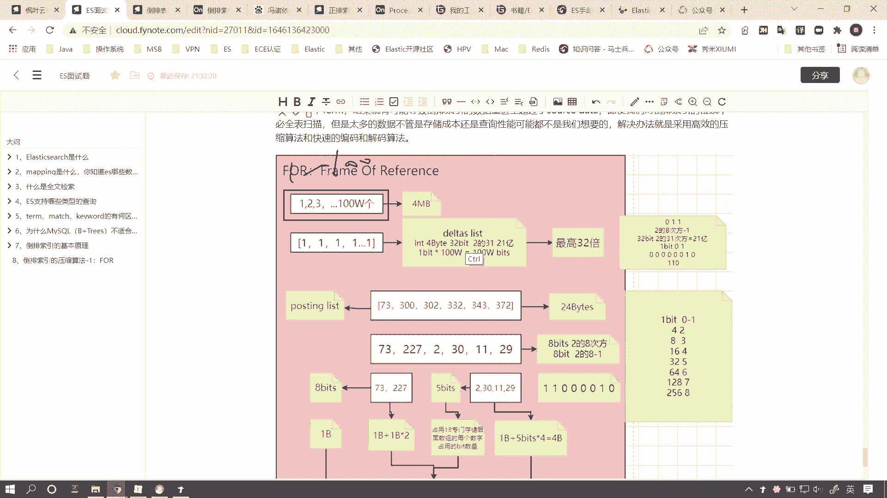

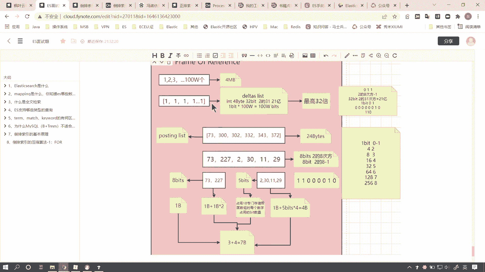

当我们这个数字啊比较普通的时候，它有一定的。普通性或者说他有一定的代表性。他。就是一串普通的。呃，声序的in类型的这个数组。那么我们怎么来做呢？

首先呢我们第一步呢还是要啊这是个posting list的招牌表。那么我们第一步呢还是要进行差值运算，计算当前每一个数字和它前一个数字的差值。好，那么第一个数字73我们不变是吧？

那么第二个数字300减73，那剩227，302减300剩2332减300剩30，343减332剩11啊，以此类推。好，那么我们就得到了一个delta list，也就是差值数组。

那么差值数组跟上面的原始数组的最大区别是什么呢？好，这里边有个关键点叫做取值范围。好，取值范围啊，这个有什么意义呢？这个取值范围很重要。取值范围决定了我们当前每一个数字类型，它应该用什么样的类型。

或者说用几个比特来存储，那么我们当前这个取值范围啊是0到227或者2到227。因为这里边最大的数字就是227。好，也就是说，如果我定一个类型能把227存储下来，那么其他的数字存储一定不是问题。

那么现在问题来了，我们应该用几个比特来存储这个227呢？好，我们往右看。右边这儿有一个啊。右边呢是用几个比特啊，左边是几个比特，而呃不是啊，左边是最大的值，而右边是用几个比特。

当我们用一个比特来存储的时候，它的取值方向就是0到1。当我们用两个比特放大一些啊。

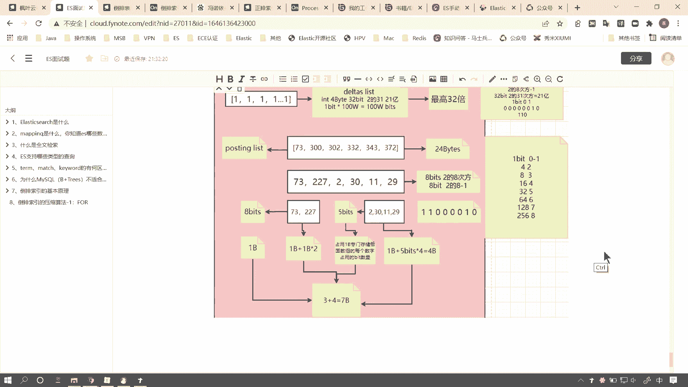

好，当我们用两个比特来存储的时候，它的取值范围就是0到2的2次方减1，也就是0到33个比特就是0到2的3次方减1，就是0到74个比特就是2的4次方减1，就是0到15。好，以此类推。

那么当我们要存储227的时候，那么也就是说我们啊我们首先使用7个比特来存储，就是2的7次方减1，就是0到啊0到127。显然，0到127这个取值范围我们是没有办法存储227的。那么我们就需要用8个比特。

当8个比特呢就是就是200呃0到255。好，这是它的取值范围。也就是说我们只要用8个比特来存储227啊，就可以足够去存储它了。嗯，好了，那么现在啊如果我们用8个比特来存储。

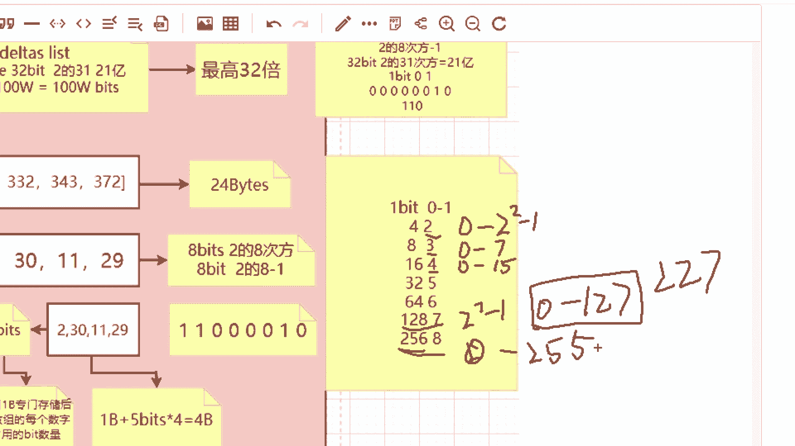

好，那么227能存储了，那么其他数字意味着也都能存储了，对吧？没有问任何问题，但是现在的新的问题产生了什么什么样的问题呢？我们用227，用8个比特来存储227是合适的。是没有资源浪费的。

因为7个比特不够嘛。好，但是我们这个数字二呢，如果也用8个比特来存储，是不是显然就很浪费呀？因为。二呢我们只需要用0到3是吧？用两个比特来存储，它的取值范围是0到3嘛。好，我们就足够来存储2了。

你非要用8个比特来存储，那么我们岂不是浪费了中间的这6个比特吗？好，那怎么办呢？我们能不能把每一个数字类型给它定一个合理的。啊，合理的这个类型呢就是说用合理的比特数来存储呢。好。

大家呢一定有这样的问题啊，你面试的时候呢，跟监考官也可以这样侃侃而谈。但是问题来了，所谓int类型。其实只不过是JDK中给我们提前定义好了这个in特类型。那么你定义这个类型。

这个类型实际上是啊你这个信息是就是类型等于一个inter类型等于4个字节。那么这个信息实际上也是需要那地方的那个空间来存储的，对不对？好，也就是说JDK中事先给我们定义好了int。

sht along这些类型，包括这个字符串这些类型，他们都是需要这个这些信息啊，这些类型的信息都是需要空间来存储的。那么咱们定义这个8个比特，5个比特，其实呢它本身也是个类型。

只不过GDK中事先没有给我们去定义这些类型。比如说我们称8个比特存储一个数字，称之为阿尔法类型。啊，阿尔法这样写的吗？好，那么5个比特来存储了一个数字叫贝塔类型。

那么其实这个类型本身它也是需要啊这个信息。你比如说阿尔法类型是用8个比特来存储一个数字，那么这个信息是需要空间来存储的，它占有多大空间呢？一个字节。啊，因为最小的这个空间呢就是一个字节。

比特啊比特是我们计算机没有办法直接拿比特来做这个这个这个和磁盘的交互的啊，最小就是一个字节。好，也就是说我们这个类型呢需要占一个字节。好，那么如果说我们把一个一个数字呢拆分开，那么我们需要为每一个类型。

每一个数字呢单独的定一个类型。有可能这个是比如说阿尔法类型啊，这个第二个数字呢是伽马类型，它是个贝塔类型。那这样的话。好，如果说比如说它是8个字节。好，它是两个字节啊，比如说两个比特，它是8个比特啊。

我我我撤退一下撤回一下。那么227呢，我们用8个比特来存储。而2的话，我们用两个比特来存储。好，那么本来来说呢，如果我二这个数字呢，我用8个比特来存储，浪费了多少个比特呀，浪费了6个比特。好。

那么如果我们硬要用两个比特来存储，那么我们就需要单独给它开辟一个类型。而这个类型使用一个字节，也就是8个比特。好，那么此时所占用的总空间呢就是两个比特加8个比特，最终等于10个比特。

也就是说本身我可以用8个比特来存储，那么你非要用两个比特来存储。那么其实最终它占用的空间是10个比特。反而更多。好，那这就是我们为什么不用啊，就是给每一个数字开辟一个类型的一个原因。好。

真正的一个比较合适的做法是什么呢？我们把这些取值范围相近的数字。拆分成一个数组。比如说从这里边切开。那么这些比较大的数字，我们可以给它定义一个类型，比如说叫阿尔法类型，用8个比特来存储。

那么它们共用一个类型。而这些数字比较小的类型，我们可以把它拆开，放在一个数组里，我们给它定义另外一个类型。那这样的话我们只需要定义更少的类型啊，这样的话我们这些类型信息呢就占用更少的空间。好，当然了。

具体怎么去拆呢？啊，这个是动态去计算的。有可能说从这儿拆性能这个效率更高，有可能是从这儿拆啊，我当然只是为了给大家讲解这个原理啊，假设假设咱们从这儿是拆开的。那么咱们来计算一下当前这个压缩算法啊。

把这个delta list拆分成更细粒度的数组，我们来看它会占用多少空间。首先呢拆开之后，那么第一个数组呃，首先呢取决于这个数组中的最大值227，227用8个比特来存储。好，用8个比特来存储。

那么它本身的每个数字就占用了8个比特，也就是一个字节。那么当前这个数组呢，它一共占用两个字节的空间。那么定义这个类型啊，需要花费一个字节。好，也就是说我们左边这一部分呢一共是三个字节。

而我们右边这个数字啊右边这个数组，每一个数字呢是5个比特。我们一共有4个。数字乘以4等于20个比特。好，其实我们之前在讲倒派索引的时候啊，讲基本原理。之前在讲成数检索的时候讲过一个关于格式化的概念。好。

那么在计算机中呢，最小的存储单位呢就是字节，一个字节，一个字节，一个字节。那么这个呢就是24个比特。好，当我们存储20个比特的时候，实际上。1个81个8前两个字节空间都已经占满了。那么第三个字节的时候。

实际上还有4个4个比特是吧？还有4个比特占据了当前字节的一半。好，但是一个字节你可以把它理解成一个盒子。我们在做交互，做数据交互的时候，我们只能一个一个字节的拿，这是计算机的底层原理啊，这是没有办法的。

也就是说呢我们当前这四个啊这5四个数字呢占用的空间呢其实是三个字节。好，那么定义当前这个数组的类型啊，这个5个比特这个数据类型，它也是要占用一个字节，对不对？一个字节，也就是说加上这三个呢。

一共是4个字节啊，一共是4个字节。也就是说左边是3个，右边是4个。那么我们最终加起来。就是7个之间。好，那这样的效率就是最最高的。好，那么当前的这个就叫做FOR叫frame of reference。

好，如果面试的时候问到了倒牌索引啊，问到了倒排索引。如果面试官向你主动发起了提问，什么样的提问？比如此类问题。好，那么ES是如何保证高效存储倒牌表的这些信息的。

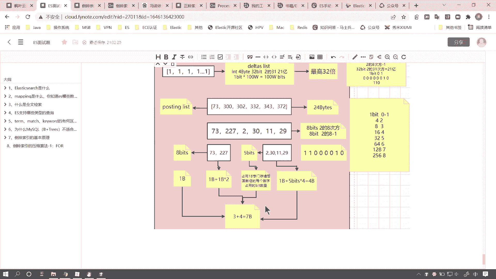

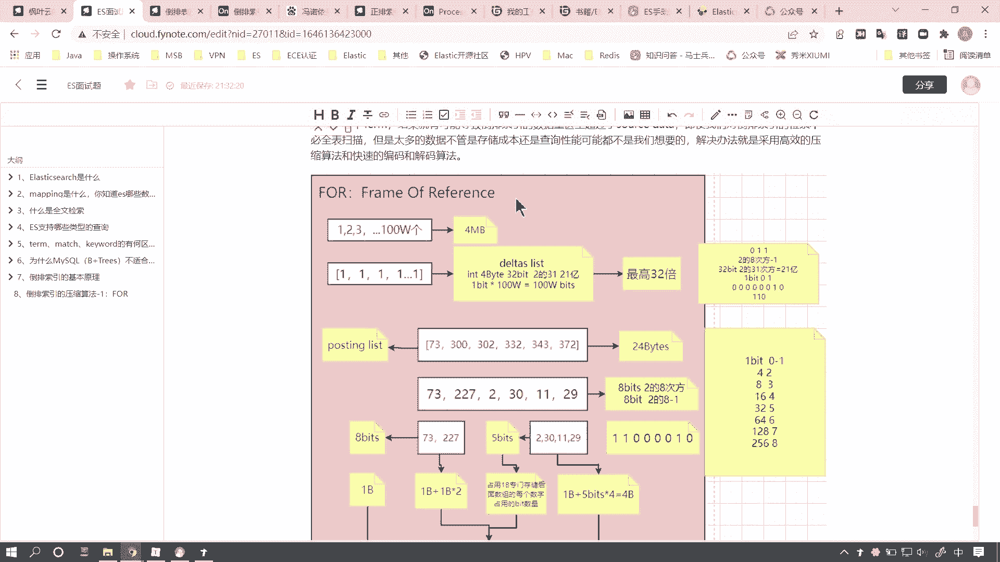

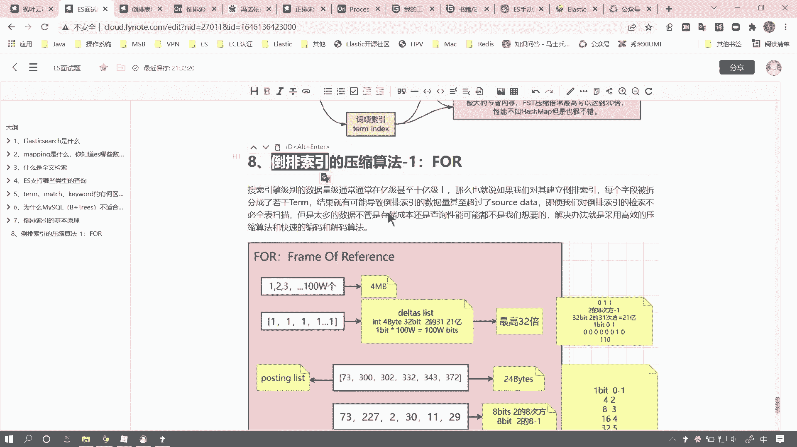

好，你就可以去回答。第一种叫FOR这种压缩算法。当然咱们后边一个还有1个RBM啊，这个好记。RBM啊不叫RMBRBM啊这两种下的算法你先给它解释出来。如果面试官没有问好了，你也可以主动的向他发起啊这个。

就是说向他主动的去解释。好，那么招牌表，你比如说里边啊有一个高效存储的问题，数据压缩的问题。好，引申出来这两种算法。那么可能监考官不知道是吧？那可能你这个题目就拿到了一个比较高的分数。好，那么嗯FR呢。

咱们就先介绍到这儿。

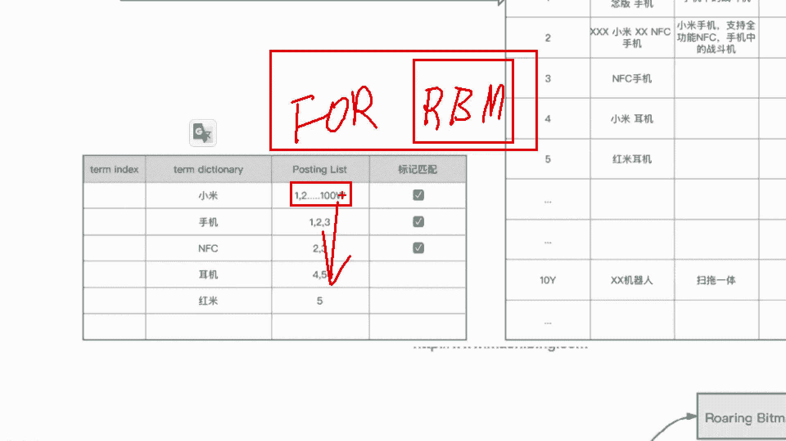