# 系列 6：P156：RBM - 马士兵学堂 - BV1RY4y1Q7DL

好，我们继续来看美团的这道面试题，倒排索引底层的压缩算法RBM那这个问题呢实际上是基于上一个问题的延伸。倒排表底层压缩算法的第二种叫RBM啊。

注意它不叫RMBOK下面我们来看一下这个RBM是如何来实现的。倒排表的第二种压缩算法叫RBM啊，它的全称呢叫rory米的 mapap啊，背译成中文呢叫咆哮未途。那其实很难理解。没关系啊。

跟着老师的思路一步不来。首先呢这个存在即合理啊，那RBM之所以存在呢是必然是因为FOR呢有一定的局限性。它有它解决不了的问题。什么样的问题呢？我们来看之前的RBM啊。

它这个数组呢其实是有一定的局限性的啊，我们来看啊。

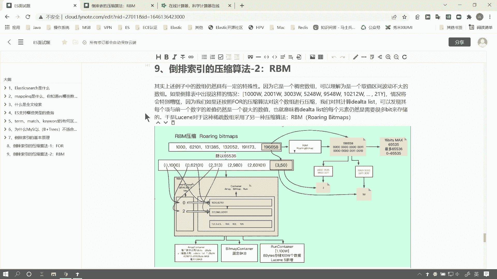

这个数组它有一定的特啊或者说特殊性啊啊可能大家觉得这个数组它既不是连续的数，又不是等差等比数组，又不是什么非分纳计数列啊。那为什么啊它的特殊性在局限在哪哪里呢？好，那么我来说，那么当前这个数组呢。

它是一个比较稠密的数组，何为稠密数组呢？咱们来看这个图啊。

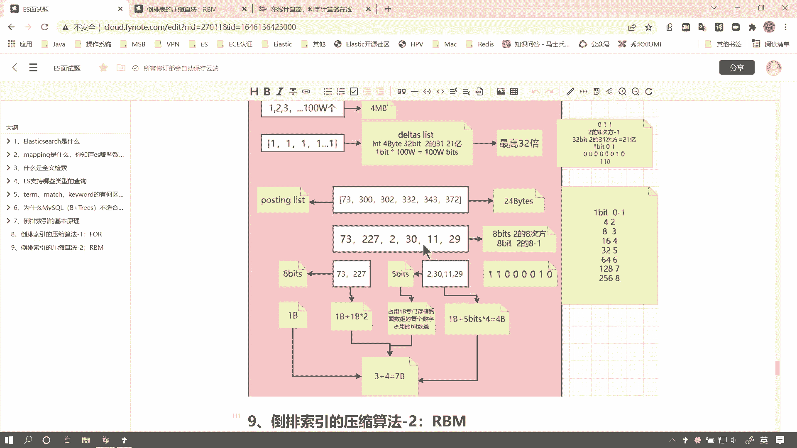

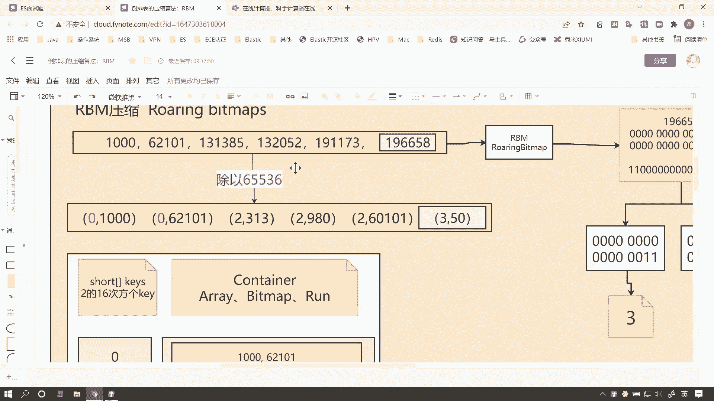

啊，我们来看这个。我这儿呢列出了一个特殊的数组。

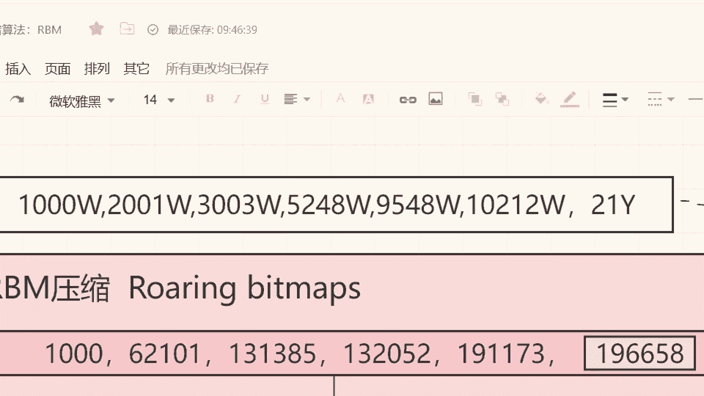

好，那这个数组呢啊我放大一些啊，它有一个典型的特点啊，大家可能觉得这数字比较大啊，其实这不是最重要的，最重要是什么呢？

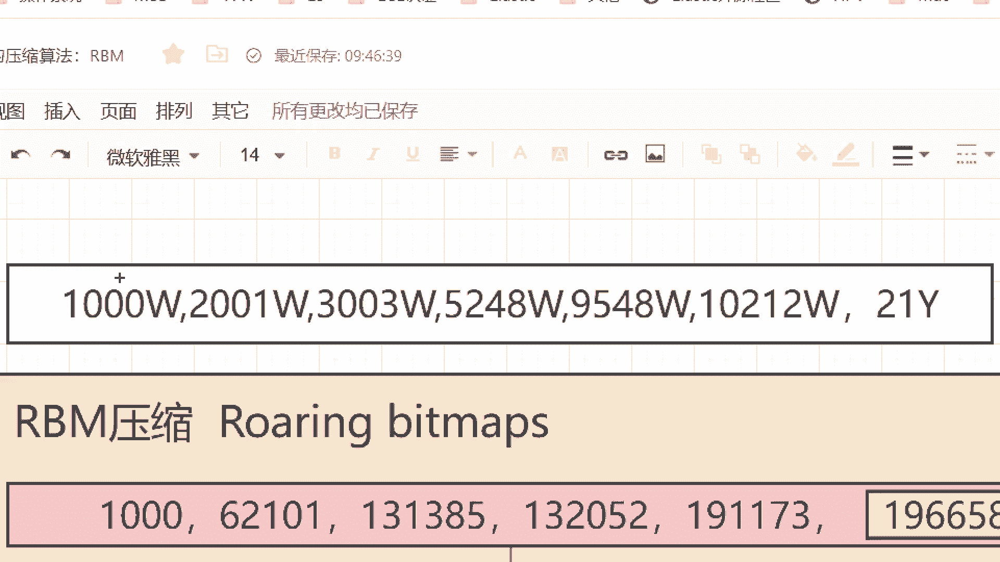

好，其实我们来回过头来看这个FOR算法呢，它本质上的思路呢是为了压缩我们当前啊所谓倒牌表这个数组的。

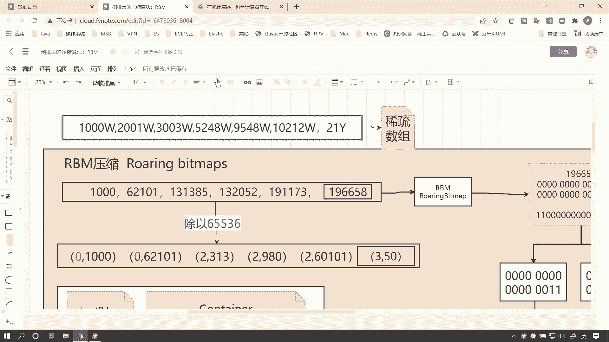

最大值或者说压缩我们的取值范围。那么零到最大值。如果越小，这个最大值如果越小，那么我们当前这个数组每一个元素呢，它使用的比特数也就越小。因为基于二进制这种原理啊，就必然是这种情况。好。

那么也就是说我们最终的目的呢就是要压缩它的这个数组里边的元素的值，它的取值范围。好，我们来看这个数组。

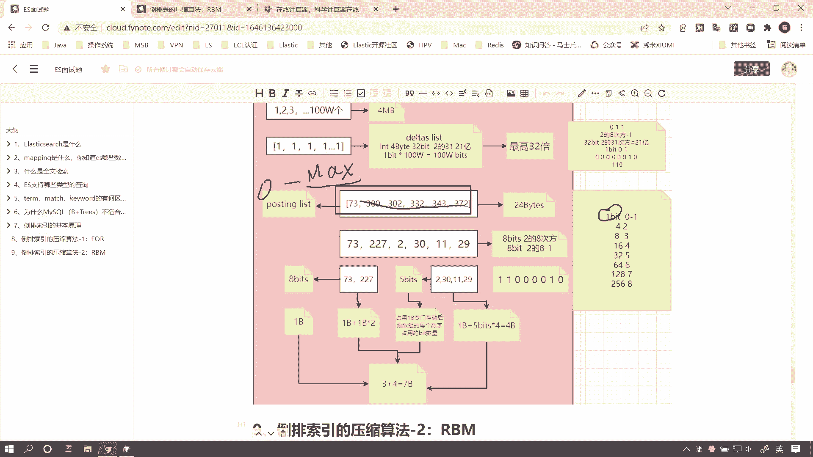

那么当前这个数组，如果我们依然采取FOR那种呃使用差值计算的逻辑，用前一个值用后一个值减去前一个值，比如说3003万减去2001万。啊，就每一个值呢它计算出来的结果呢，它仍然是一个非常大的数值。

比如说2000万减去1000万，它得到的数值仍然是一个非常大的数量级，对吧？每一个数值减去前一个数值都仍然它的结果仍然是一个比较大的数量级。那么也就导致了比如说本来我2000万啊，比如说用呃。

30个比特，当然这个不是呃，这个数值肯定不对啊。我这举个例子，比如说2000万用30个比特来存储，那么1000万可能它仍然是30个比特，因为它的数量级没有变。好，那么也就是说我们当前如果还使用FOR呢。

可能啊差值列表它并没有起到我们想要起到的那个作用，就是使用更少的比特来存储。怎么办呢？既然差值不行啊，我们聪明的人类呢就想到这个办法，我们使用除法。好，我们把每一个原始数组。

当然我们这儿呃用下面那个数组来举例子啊。我们好，假如说这是个倒拍表，那么数值是比较大的。当然了它的差值也是比较大的。当然没有刚才那个数组那么极端哈，那么6万多减去1000多，当然仍然还是6万多。

13万减去6万多，仍然还是6万多。那么这个数组我们尝试呢用每一个数字啊，就是把每1个ID呢除以一个固定的数字除以多少除以65535啊，6536，为什么是6536呢？好，咱们先暂停啊，咱们先暂停往右边看。

😊。

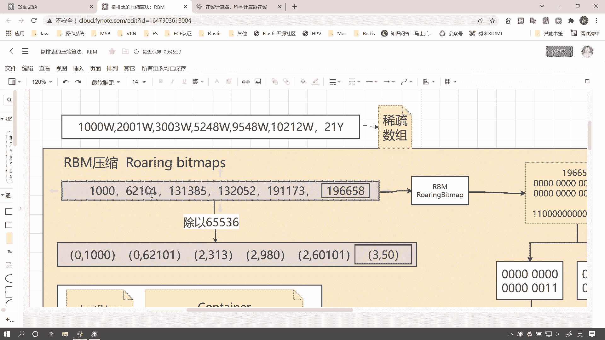

往这儿看。那之前咱们说了啊，这个int类型呢，它实际上是32个位来存储是吧？每一个位呢存储两个数字，也就是说呢零就是一个0一呢就是一个1而二呢就是1个103呢就是114呢就是100，以此类推。

5就是101。好，这就是二进制。那么二进制的最大存储。数量是二的32次方，也就是int类型啊，是最大存储2的32次方个数字。好，那么我们来看这儿啊，那么这个呢就是1个32个比特数。

那么我们把这个随便拿出来一个数字啊来研究一下。好，使用rolling beat mapap来存储的话，首先呢第一步呢会将这个数字呢转换成二进制。196658，我们来看啊，我们用计算器来转换一下。

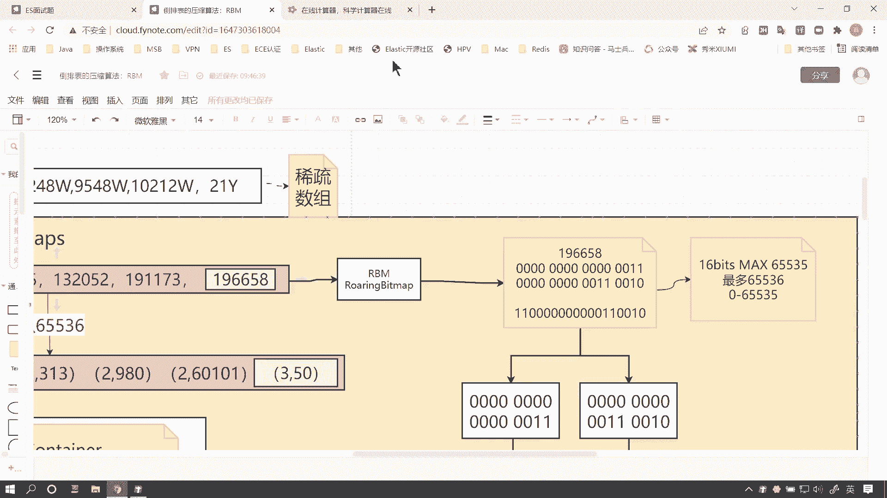

十进制的多少196658来看一眼对不对啊？196658转换成二进制。好，那么这个是就是11啊，000若10110010。好，也就是。

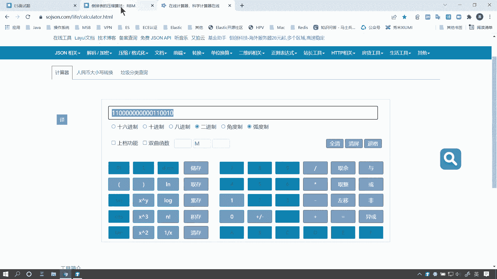

哎，也就是这个啊也就是这个底部的这一串数字。好，当然了，前面它不足32位呢，是因为前边呢它没有用到啊，咱们给它补齐就可以了。也就是说它其实仍然是占用了32个比特来存储的。好。

那么这个数啊这个二进制的数呢有一个特征啊，我们把它。高16位和低16位。

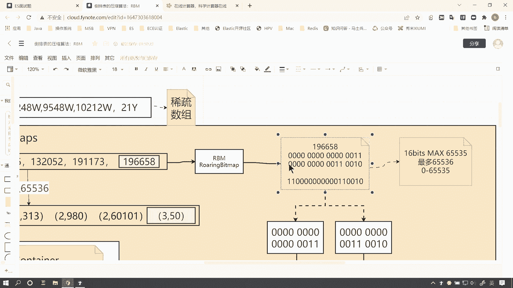

分别拿出来拆开。左边呢就是它的高16位，高16位呢前面这个零啊是不做计数的啊。那么后边这个11呢，咱们把它换算成二进制，它其实就是3。啊，咱们刚才已经说过了，零就是零，一就是一。啊。

一十进制的一转换成二进制的一还是一。那么二的话就是转换成二进制，就是103的话就是11。所以呢这个一一呢转换成二进制，它是3，而把后面这个数字啊，把它的这个第16位。转换成十进制。咱们来看一下。

实际上真正有效的啊就是它的后6位110010，也就是这一部分数字。110010，咱们转换成来110010，转换成十进制，结果就是50。好，那么也就是说把当前这个19哎，196658呢。

按照这种方式呢进行拆分呢，拆分成了两个数字，分别是三和50，对不对？

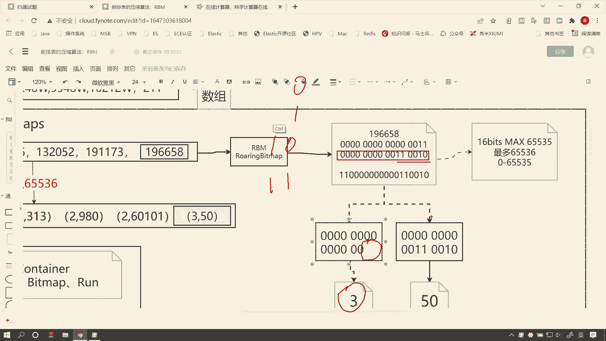

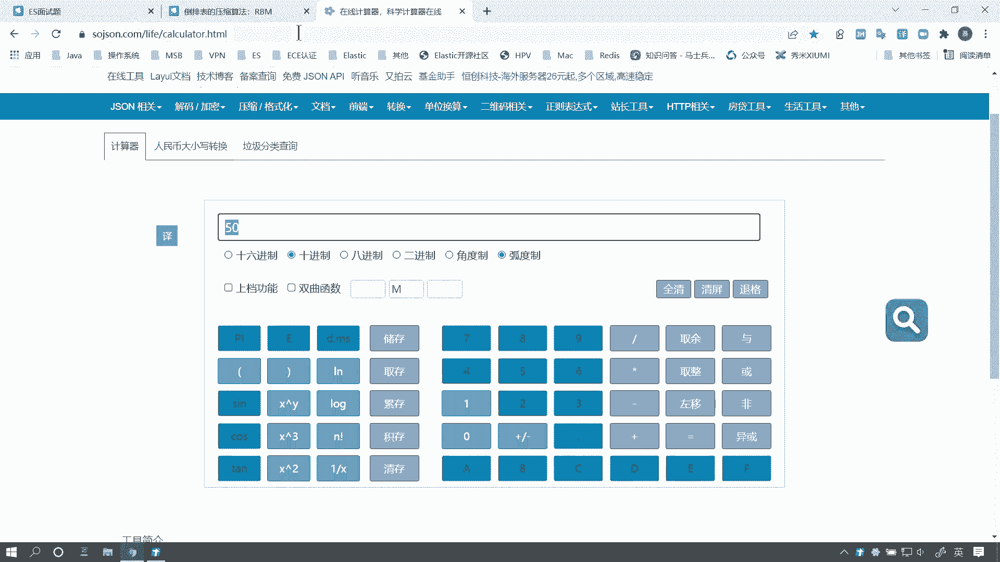

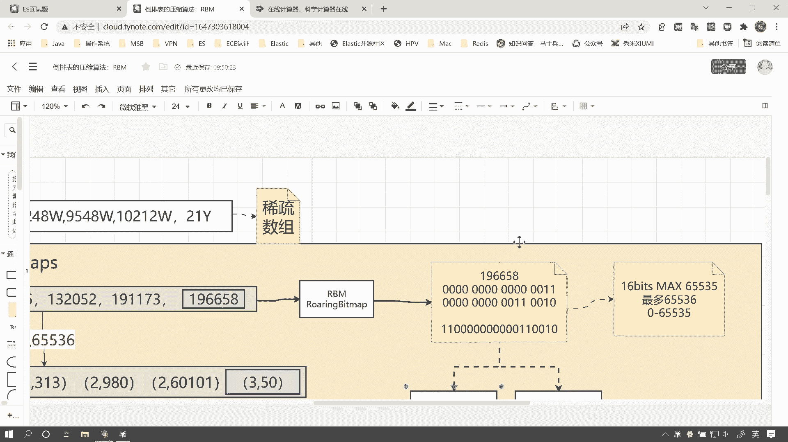

哎。

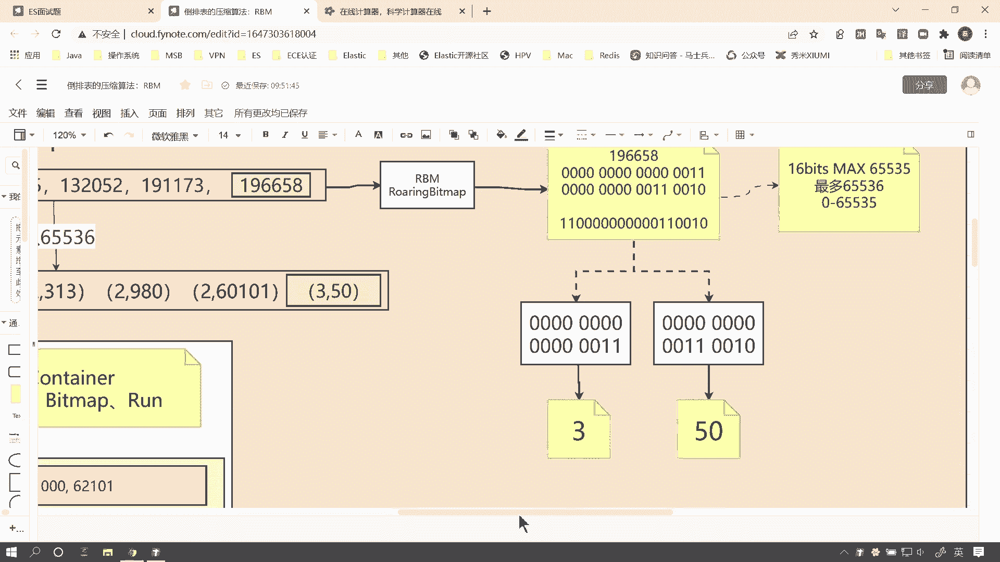

好，咱们来看啊，咱们尝试把这个196658呢用另一种方式来计算。啊，用另一种方式把它除以一个叫65536。得到的结果呢其实就是3，你可以拿计算机算一下啊。如果我们对6536啊，就是196658。

对6536取模呢，也就是说啊196658除以6536，它的余数呢就是50。哎，是不是发现啊惊人的巧合。那实际上呢这两种啊计算的结果是一样的啊，把它拆分成两个16位数，其实就是65536。

为什么要除以6536呢？就是因为一个int类型呢是32个未来存储，我们处以6536是多少？换算成二进制呢？就是22的16次方。

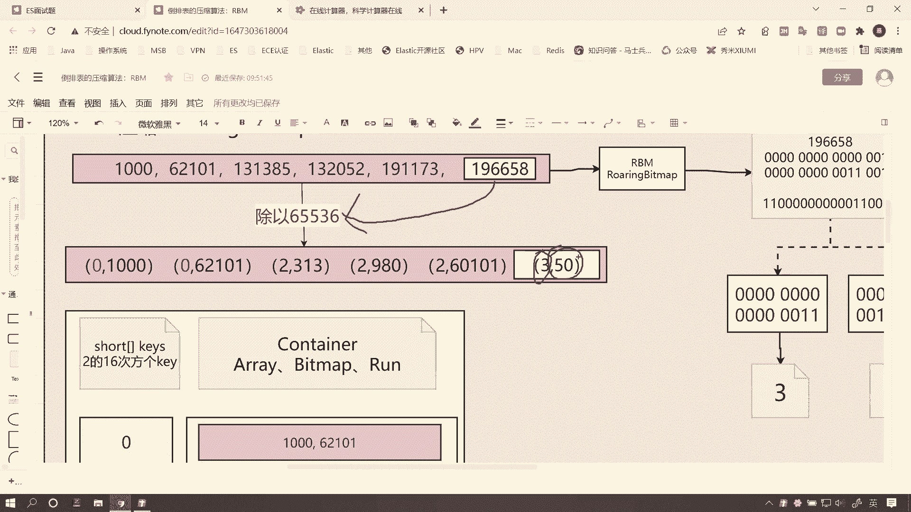

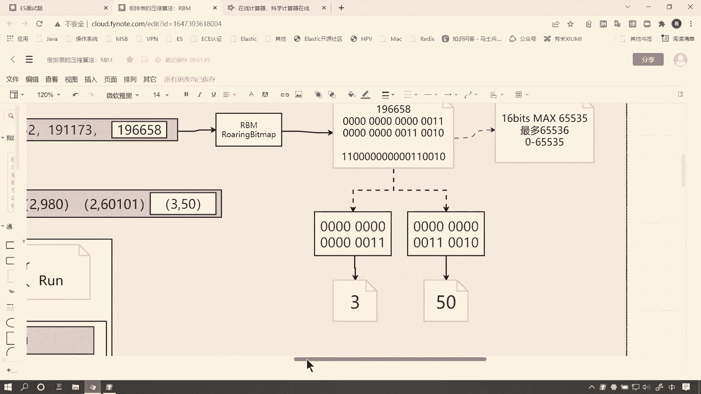

那么二的32次方实际上是等于两个二的16啊，咱们这样。二的32次方实际上是等于2的16次方乘以2的16次方的。也就是说，32个位呢是int类型，而16个位是什么类型啊？是short类型。RC对吧？

也就是两个shott类型相乘的积。那么我们如果把int类型拆分成两个shothort类型的乘积呢，那么每一个shott类型的最大值不会高于二的16次方减1。好，这就是short类型的最大值。

那么两个上的类型最大值呢啊它们分别都是65535。也就是说我们。啊，这个倒牌表中的任意一个元素，我除以6536，最大值不会超过65535。余数最大就是6535，这是必然的，最小值就是零嘛。

整除了就是零嘛。好，那么我们把当前啊就是原始的这个招牌表做。这一步除法之后呢，得到一个除数，每一个数字呢都会有一个除数。并且会有一个余数，1000就是1000除以6536，除以得数是0。

余数是100062101除以6536，得数是0，余数就是62101。当大于6536的时候呢，这个余数就更多一些嘛。这个呃得数就是2余数就是313，以此类推，当我们把每一个元素都做了除法之后除以6536。

那么得到下边一个数列。好，这个数列如何来存储呢？那么ES中呢实际上它底层呢是套用了一种叫rolling beat map的算法。那这种算法是在loin里去实现的啊。那么首先呢我们把这个T值啊我全屏一下。

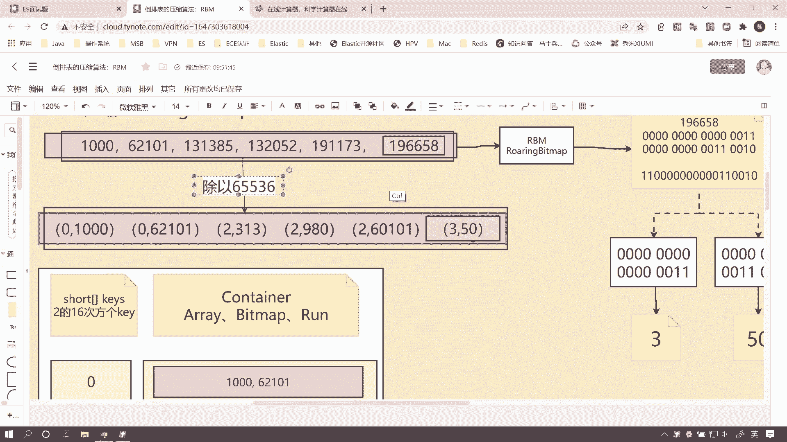

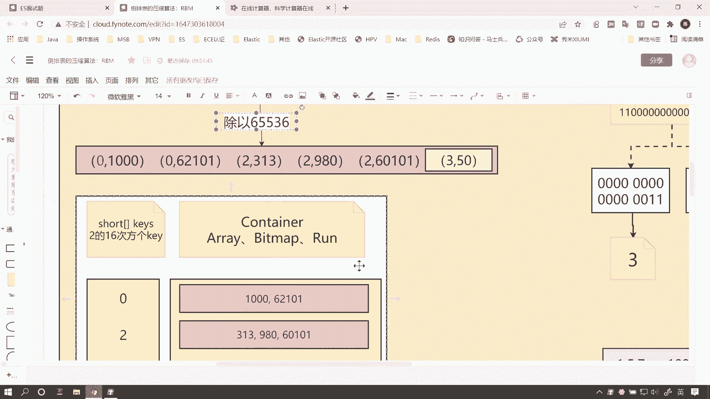

好，这里边呢我们可以把它看成1个P86对。T呢就是它的得数。而value呢就是它的余数啊，这些就是它的余数。我们把K呢可以放在一个数组里啊，这个数组呢叫它的K值的数组啊，它因为每一个值。

因为它这个得数呢最大值是65535，也就是说它的取值范围是6535，并且它的最个数呢最多也是6536个啊，也就是说当前的这个上的类型存放K的这个啊存放K的这个盒子，就是就是它。

它的元素的个数最多有65536个。哦，并且最大值呢是65535。好，如果不明白为什么呢？仔细啊仔细想一想，多想一想。并且还有个问题呢，为什么我们要除以6536呢？而不是除以其他的数字呢？

因为这样的呃我们。我们考虑一个比较基础的问题啊。当周长一定的时候。面积最大的值一定是矩形。其实这个原理是非常相似的。这样的话我们可以拆分成两个shothort类型啊。呃。

还有一个原因呢就是方便我们用类型去存储。因为这个shott类型是已经定义好的，我们不需要再去开辟额外的空间来存储这个类型啊。好，那么这个就是一个原因。那么当我们比如说把数字零存放到这个key啊。

shott类型的这个key这个数组里边之后呢，我们把所有得数是零的元素呢，放在一个盒子里，叫container。好，roller get map呢内部呢使用三种container来存储它的value。

第一种叫er ray container。所谓alcon就是代表这里边呢其实就是一个数组。并且是。呃，这个有序的啊这个有序的从小到大排列的一个数组。呃，并且这每一个元素因为都是呃一个st类型嘛。

对吧都是一个short类型，所以它的最大值不会超过65535。啊，这是它的最大值。啊，65535啊。好，并且每一个盒子都和这个K的数组一样啊，最多的元素个数是6536个，但是最大值不会超过6535。好。

那么呃这个。array数组啊是比较好理解的。那么第二种啊，这个array container是比较好理解的啊，这个呃它的三种coner之一啊，容器。那么第二种叫get map container啊。

这种coner呢稍微有一些麻烦。

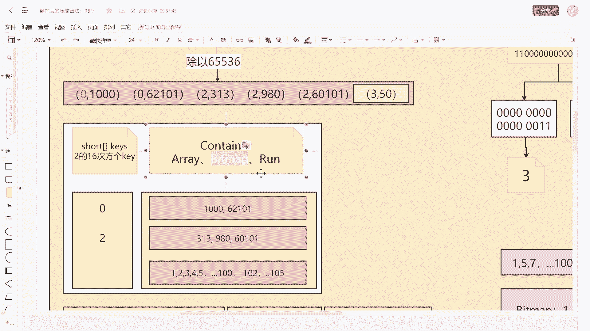

好，那么有些同学可能不太理解那个be mapap是什么位图是吧？那么咱们在基于冯诺伊曼这种模型的二进制啊这种前提之下呢，其实存储数据的这种方式呢就是用一个比特来存储嘛，什么说了好多遍了。

那么比如说我们存储一个数字。一，那么int类型呢就是四个字节，当然用s类型存储也可以就是两个字节，当然了，如果它大到一定的这个数值，比如说它超过了二的16次方，我们就必须用至少用int类型。

就是四个字节来存储。好，这是咱们之前讲过的东西啊，那么比如说如果我们用inter类型来存储这1000个数字。那么假如说这是1000个数字啊，那么我们当前呢就要消耗4000个字节的存储空间，对吧？

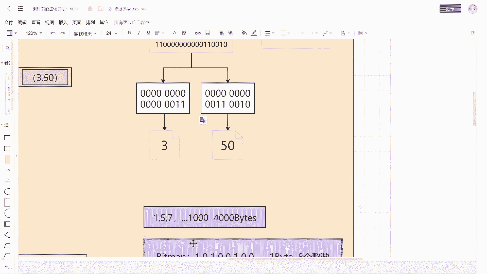

这是二进制的存储，必然会造成的一个结果。好，那么什么叫be map呢？好，那么it map呢，这是一，这是0，这是。2，这是3。好，那么当我用8个比特来存储数据的时候，它的最大数值就是二的8次方减1。

OK那么并且啊我一个八字节一个字节的这么数数字呢呃这个一个。呃，八个字呃8个比特嘛，我只能存储一个数字。最大值是28次方减1对吧？那么如果啊我们的这个比特原本是用来干啥呢？是用来存储数据的。

我们现在存储的数据稍微变一下。我们不存数字了，而是用来做标记。记住啊，有关键做标记。好，标记什么呢？标记我当前这个位置啊，记住啊，这个是beta map标记我当前的这个位置是否存数据了。

那么当前它的位置呢就是它的下标，所谓位置就是下标啊，这下边这个就是个下标，从右往左数比如说这第零位，这是第一位啊，这是第二位，这是第七位好，一共8个比特嘛。好，从右往左数一共是0到78个比特。

那么我们当前这个位置是一嘛，第三个位置是一就代表当前第二个比特，这个位置它存储了一个数字，存储的value值是几呢？就是它的下标。那么当前这个beta map存储的三个数字，分别是2。

5啊第一个数字是2，第一第二个数字是5，第三个数字是7。好，也就是说呢我用了8个比特位，存储了三个数字啊，三个数字。好，如果说我们这个beta map使用率最高的情况下呢。

我们其实8个比特能存储8个数字。但是有一个特点就是首先数字不能重复。其次啊它只能是0到7这么7个数字，最大范围，如果是8个比特，它的最大范围就是0到7啊，取值范围就是0到7，并且不能重复。好。

那么beta mapap有这样一个特点之后呢，咱们回过头来再来看看什么呢？看我们当前这个container，它有一个特点，是吗？

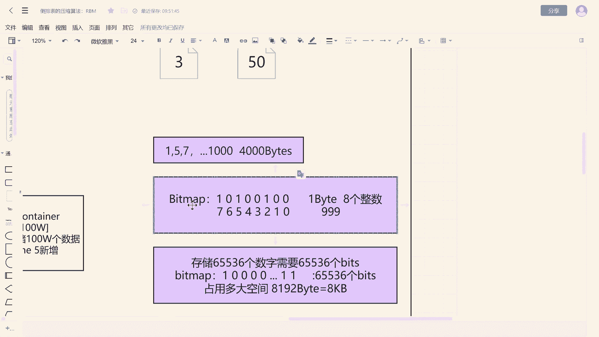

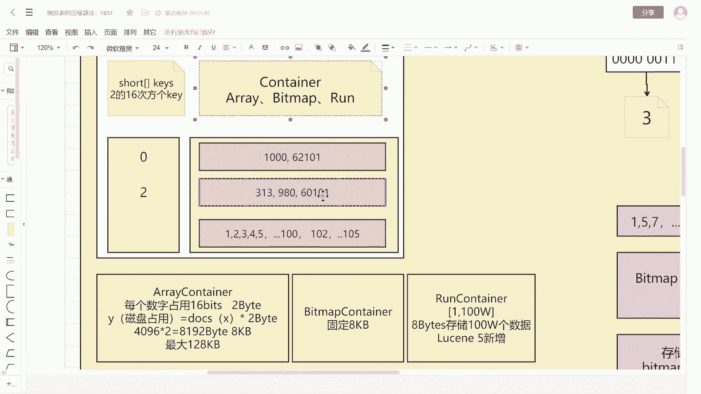

好，我们这个container里边其实是有一个特点的。好，首先呢它里边的数值是不是首先也是不会重复的，因为啥？好，我们往上看啊。

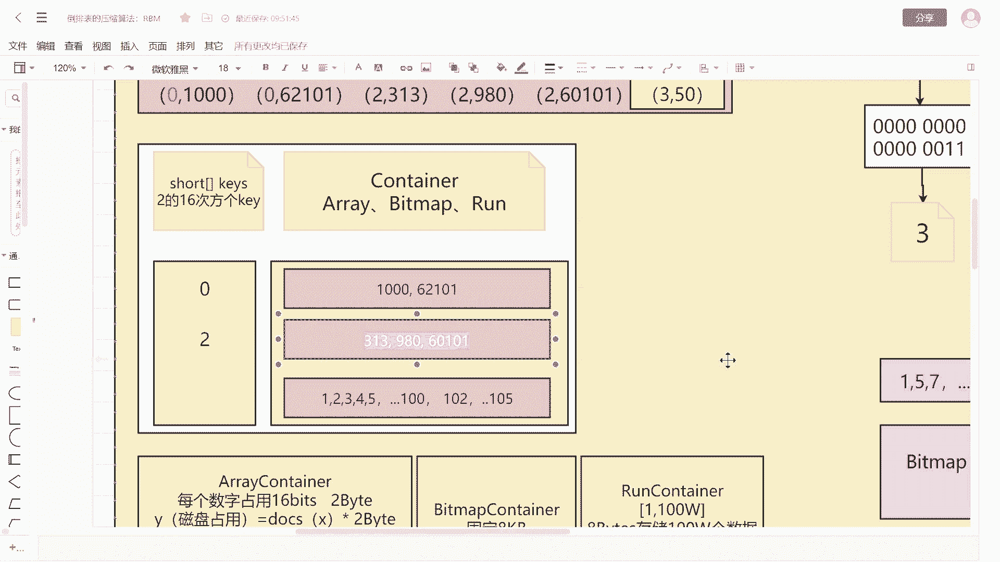

好，当我的照牌表里边的数字，首先照牌表里边存的是ID对吧？ID是不会重复的，并且ID是我们告诉你ID呢是一个有序的从小到大的数度。那么当我的这个。呃，首先呢我除以6536之后，这个数字P是会重复的。

但是重复的T呢会放在这里边啊，把重复的value放在这里边。也就是说呢当我这个一个盒子里啊，就是一个P对应的这个盒子里。我的这个里边的元素是不会重复的，并且取值范围是0到65535。啊，6535。

那么不同的盒子里边会不会有重复的数字呢？比如说啊我举个例子啊，比如说呃第一个ID啊，假如说咱们的原数据呢，第一个有1个一。

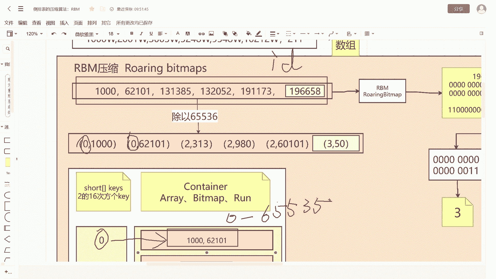

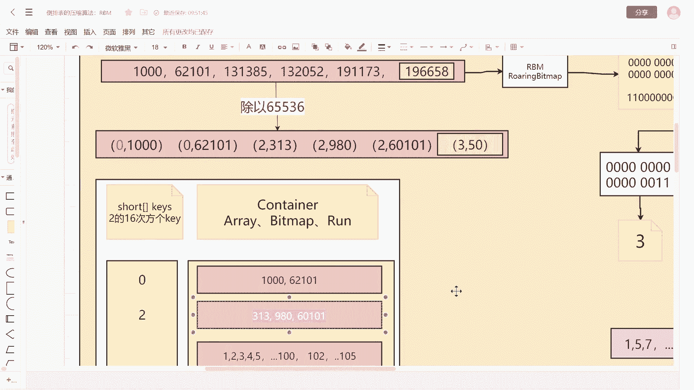

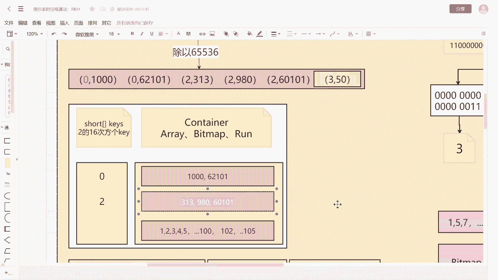

那么第二个数字呢是65537好，那么一除以6536，得数是0，余数是1，那么它就会被放在第一个呃K是零的盒子里。元数是一，那么65537除以6536，得数是一，余数是一。也就是说中间会有一个一的盒子。

那么65537呢，它的这个数字一呢就会被放在中间。这个呃P为一的这个盒子里，并且数值也是一。那么也就是说好它的value是会重复，的确会重复。但是重复的这个value呢。

它一定会放在不同的container里边。不会见面的，明白吧？好，那么也就是说呢我这里边呢最极端最极端的一种情况，65536个数字呢都已经放满了。

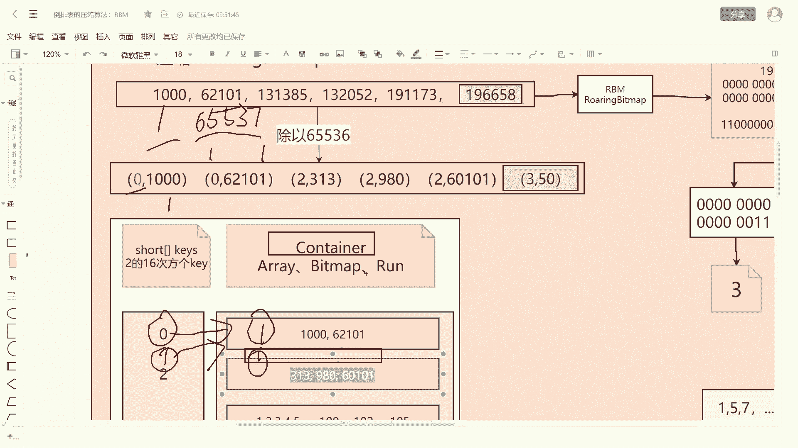

65536是都已经放满了，分别是012点点点点点点点点到65。等到6535啊。到65535好，0到65535一共65536个数字都填充满了，这是最极端的情况。哎，我们有没有发现有个很巧合的情况啊。

我们的runing bit map正好也是能存放，若干个连续的不重复的数字。那么如果我们用65536个比特来存储这样一个数列是不是非常合适啊？因为啥呢？

因为我们只需要用65536个比特就能存储65536个数字。

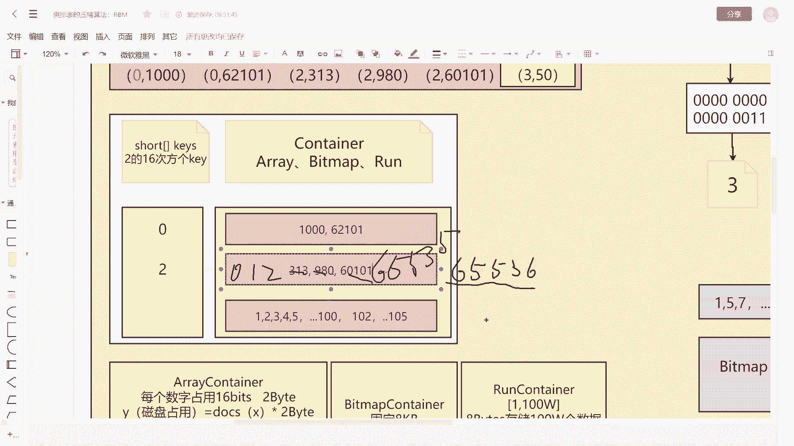

个数字。对吧好，如果我们用硬的类型来存储，我们来想65536个。字节啊乘以4啊要乘以4个字节。对吧那么是多少乘以4就相当于乘以32个比特。是吧。要占用这么多个比特。

而我们beter mapap呢只占用了6536个。对不对？这就是一个性能的呃这个存储效率的一个区别。好，那么针对这两种啊存储方式的不同，一个是array啊，一个是beat map。

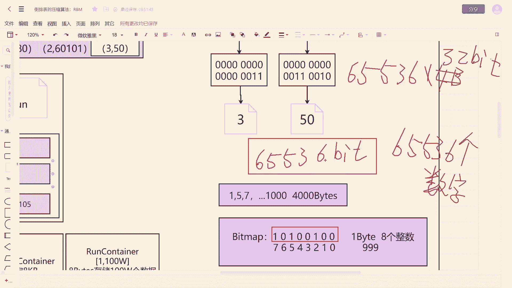

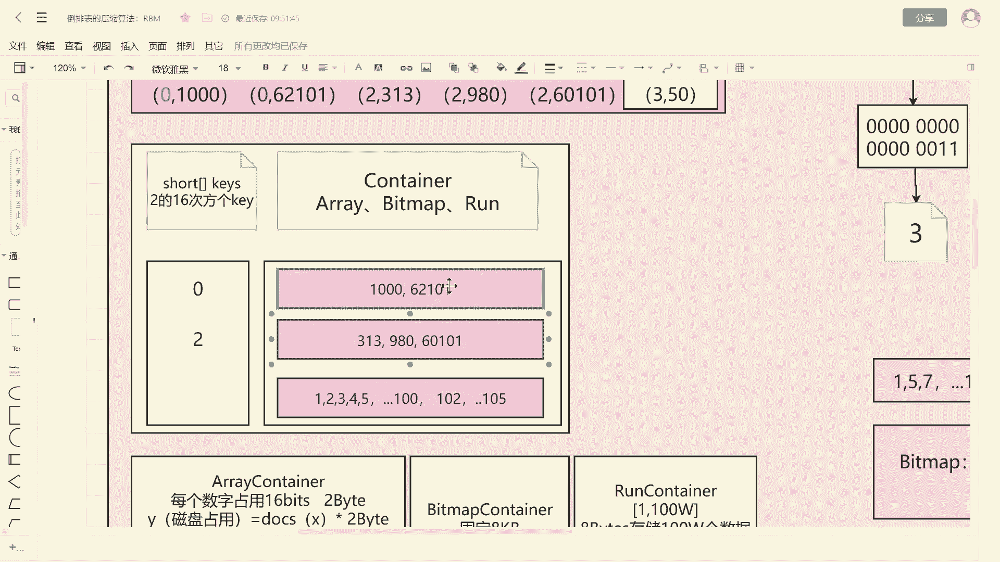

他们的这个效率是有区别的，并且他们是各有优势的。因为既然他们两个同时存在，不要觉得dta map的生用效率很高。但是如果你比如说B5536个。好，我们往下看啊我们往这儿看。

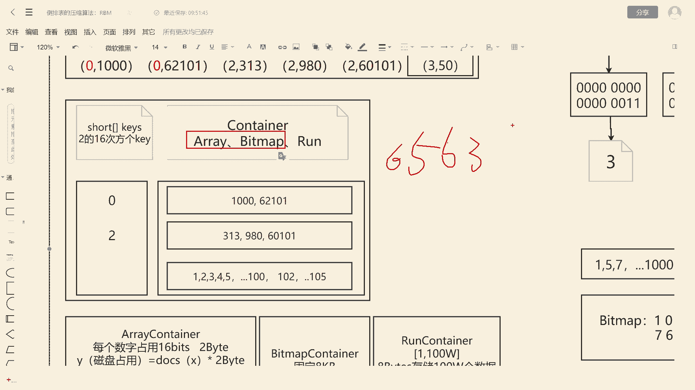

假如说我们有1个65536个呃比特的这么一个beta map。那么也就是说这个010101有65536个，但是我们这里边就填了一个数字，那是不是也是非常浪费啊？如果说数字特别少的情况。

我一个数字是多少个字节，是32个啊，等于32个比特。好，但是我如果用位图，那就是65536个。

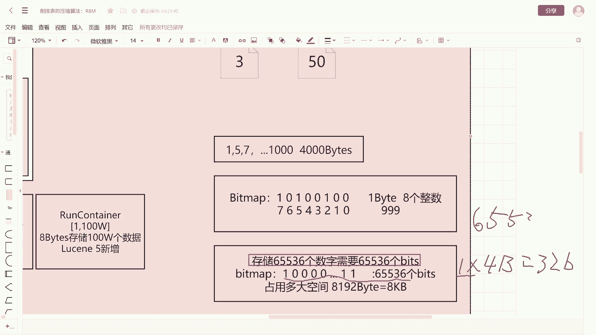

好，你除以一个8，你再算一下，肯定是比32要大的，对不对？肯定是比32要大的。也就是说呢好，在不同的情况下啊，我要采取array和beter map的这两种是哪个countener呢？是要动态决策的。

怎么决色呢？咱们来看下面这个图啊。

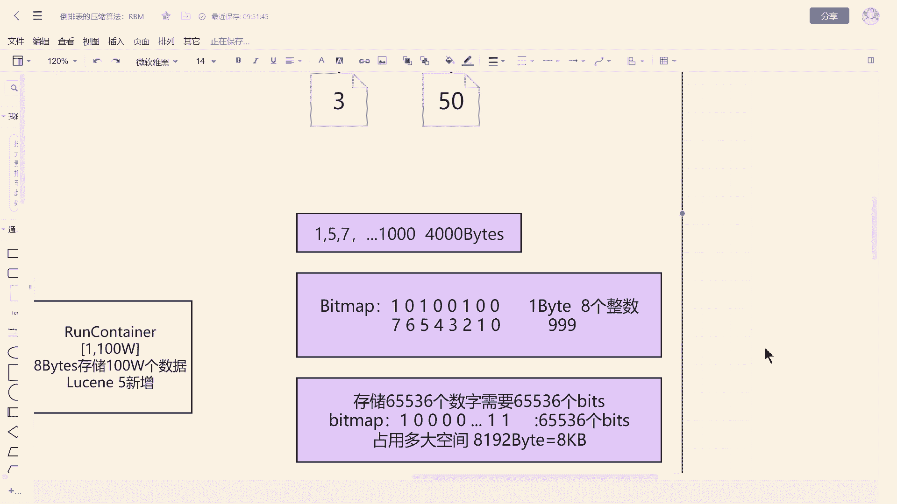

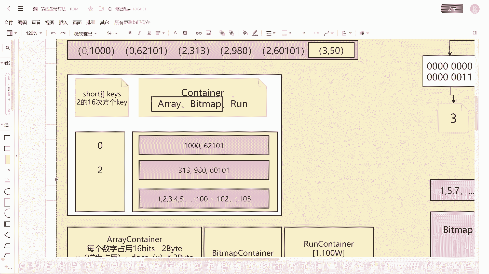

好，那么这一张图呢就非常清晰的展示了使用aray container和beat map container的一个曲线图啊，或者说一个走势图。好，那么当然了，这个横轴呢就是我们当前的文档个数啊。

就是你的ID的个数number of stop。而Y轴就是当前啊你使用这些啊就是存储这些文档ID呢所占用的空间啊，memory。used啊us啊。那么咱们来看，当然零个文档的时候是不占空间的，没有问题。

那么当我比如说有一个特殊点是40964096个文档的时候，如果使用耳瑞卡，就是4096乘以多少，一个数字占用它是shott类型的16个比特，对不对？好，咱们换算一下，4096乘以16啊。

咱们找计算器来算一下。

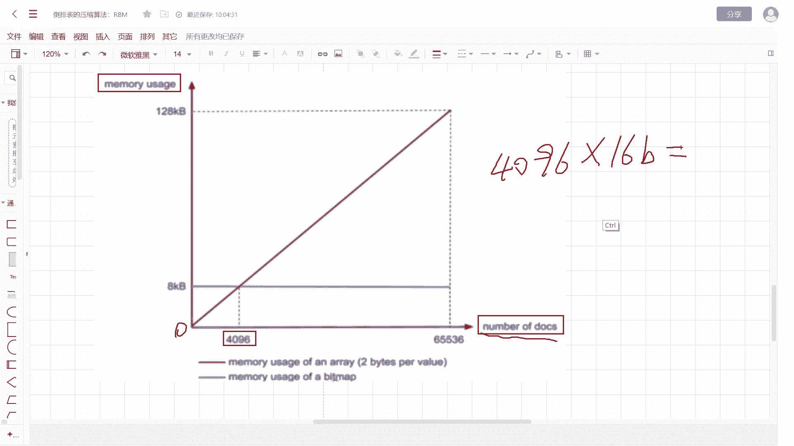

还好。4。096乘以16这么多个比特。好，我除以8得到自结数。等于808192，再除以个10哎，不对啊，1。024好，除以1024得到的就是KB数，也就是8KB。咱们来看。

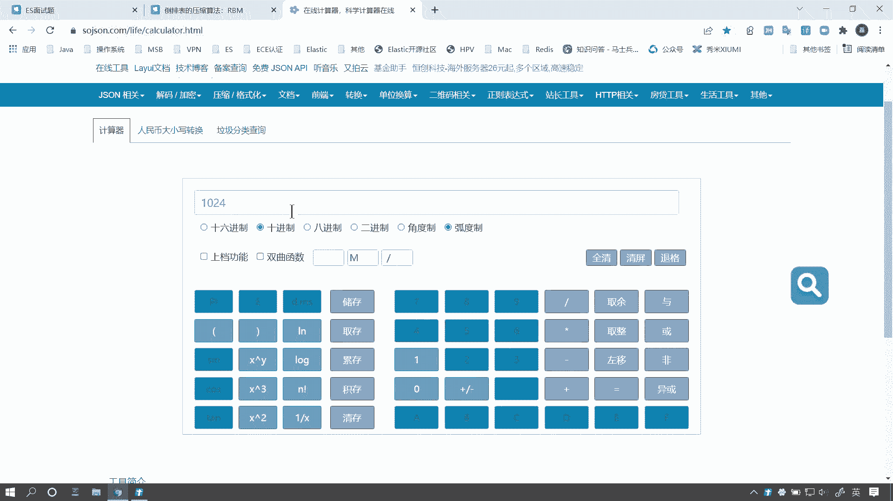

好，图上得到的结果呢，这个点呢其实就是当。我存储4096个数字的时候。好，我使用array container占用的就是8KB。对不对？好，那么当文档各数4096个数字的时候。

那么因为啊我beat map，我固定6553。6个。比特对不对？好，因为我是固定的。

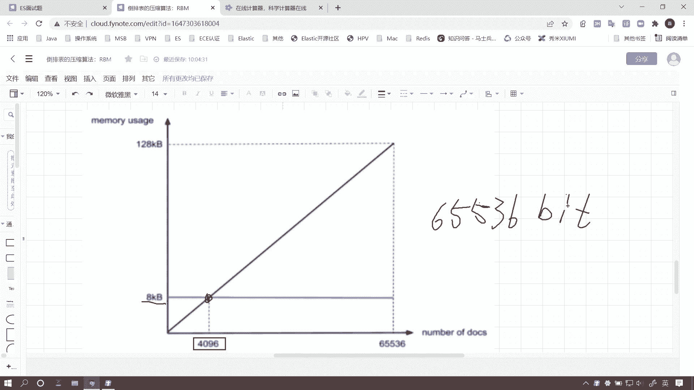

因为为啥固定呢？因为我的盒子大小是固定的。

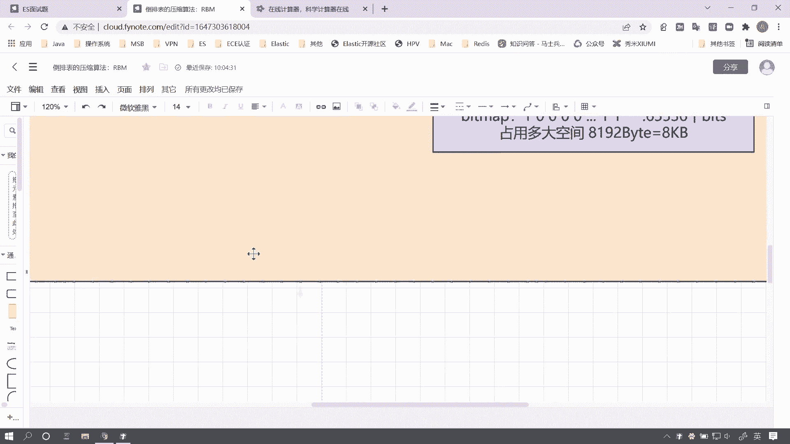

好，我来看啊。因为这个盒子大小是固定的，它最多有65536个数字。为了我们能兼容最极端的情况，就是这个盒子装满了，一共6536个数字。所以我们的这个beta mapap呢。

我们也要定定义到6536个be。

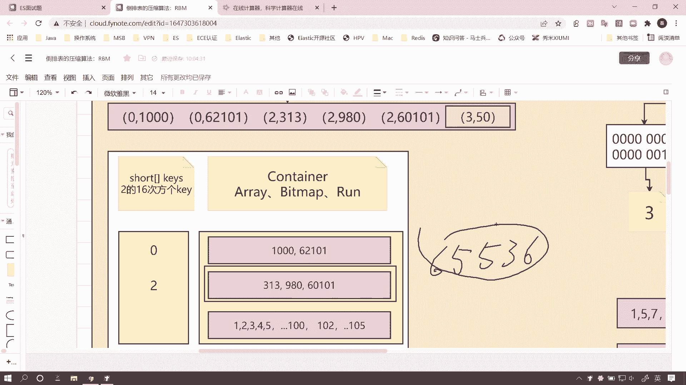

所以啊6536个B的呢换算成大小呢，咱们刚才其实已经换算过了，那就是8KB。也就是说65536个数字，65536个这个6536个容量的这个beatter mapap啊。

bit map它不管存储多少个数字，哪怕存储一个数字，它的大小恒定是8KB。好，那么这样咱们选哪个就非常清楚了。当我数字就是文档的个数呢小于4096个的时候，我使用array container。

它占用的空间是小于8KB的。当我的文档大于1096的时候，那么。显然使用这个beta map container啊是更合适的。因为它的空这样的空间更小。好，那么我们就很清楚的知道在什么样的情况下。

我们应该使用哪一种container，比如说array还是beta map。

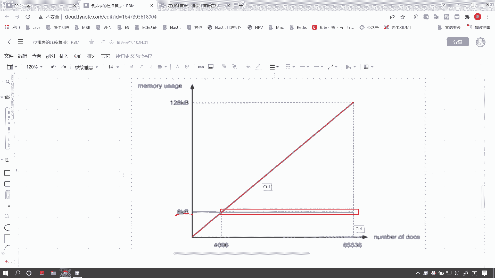

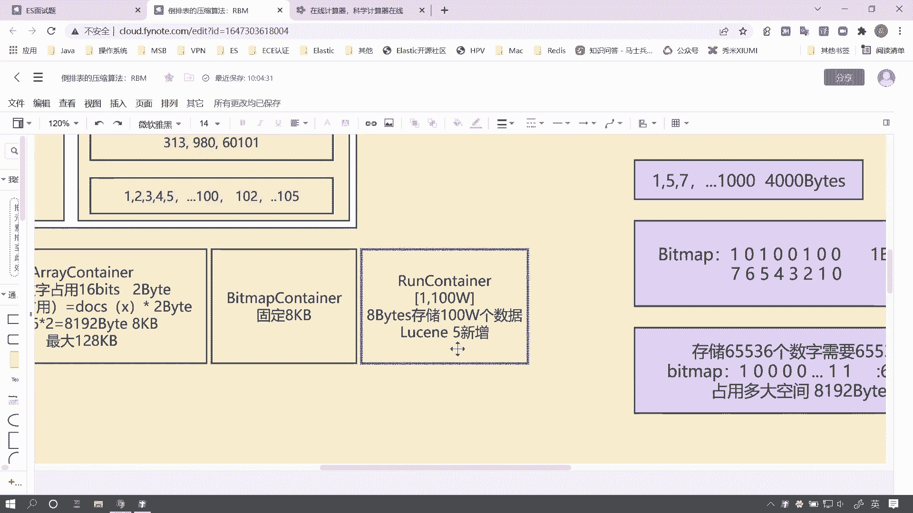

好了，那么下面呢我们这儿列出了一个对两种不同的container所占用的空间的一个呃等式啊，一个式子。呃，还有一种呢叫ra containerer，这种就是比较特殊了。它是loin5之后啊。

loin5之后新增的一个coner呃，适用于哪种情况呢？你比如说像这种比如说我的这个原始的数据啊，原始的文档啊，完原始的这个招牌表，它有一种更极端的情况。比如说它的ID是1123点点点点点点到100万。

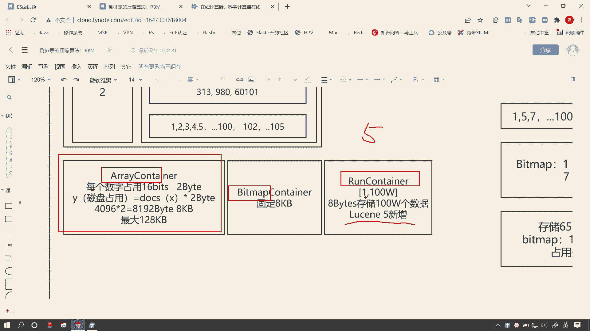

那这种情况呢，实际上我们有一种更高效的存储，我们只存头和尾。好，我们只存一和100万。因为我们知道这个数组是连续的，所以其实我们只需要8个字节就可以了。对不对啊，只需要8个字就可以了。那这样的话效率啊。

如果存100万，即使用不管用那个bitt map啊，或者是这个run或者是con，它的效率都是远不及这个run container的。好，这种情况呢就比较极端啊，咱们知道就行了。

一共这么三种bit map啊。

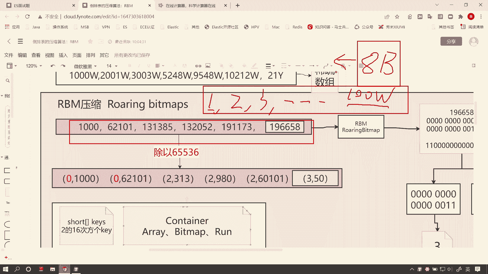

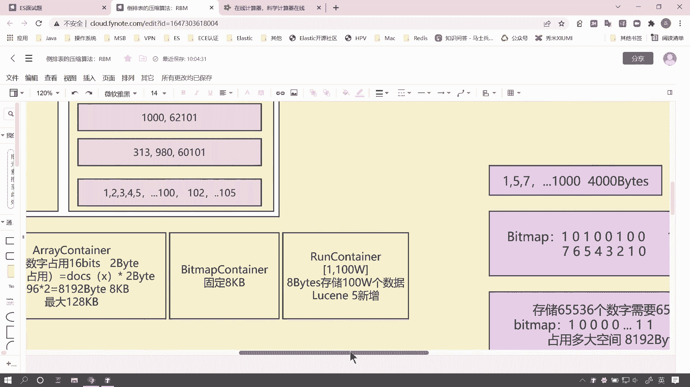

呃，一啊不是一共三种container啊，这是关于rolling map压缩算法中的呃它的一个具体的过程啊。那么只有啊就是面试的时候啊呃，一定要知道这个FOR和RBM这两种算法。

并且要知道他们针对的不同的场景RBM。

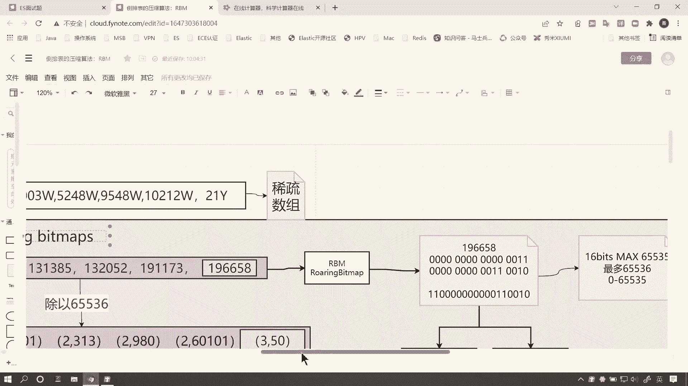

好，FOR是针对于一个叫稠密数组。F而这个RDM呢针对的是稀疏数组。给面试官说清楚就行了。啊，有有可能有的面试官都不知道这个这两种算法是什么。好，另外不管是哪种算法，它的作用，都是为了压缩招牌表啊。

倒牌表知道是什么吧？

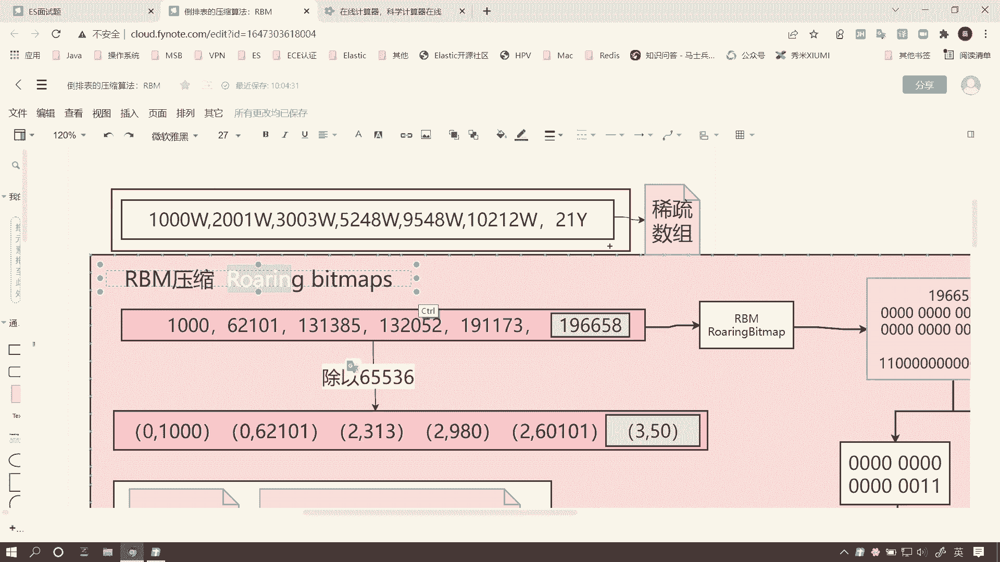

好，再回我们来再回顾一下啊，招牌表就是倒牌索引的三种数据结构之一叫招牌表。

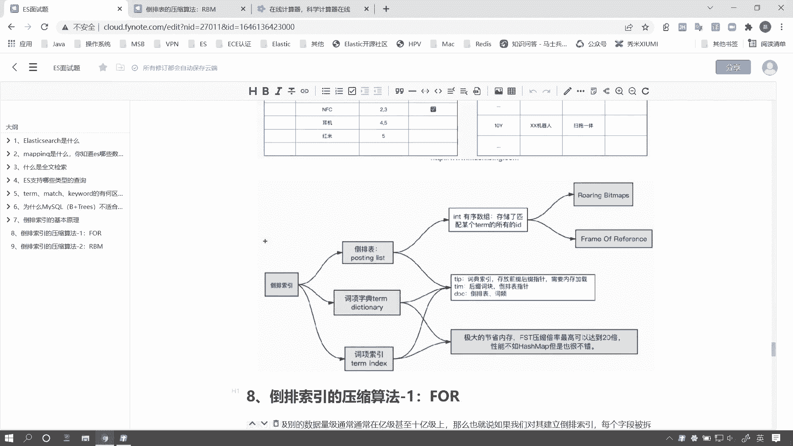

好，那么呃这两种压缩算法呢就给大家聊完了啊。

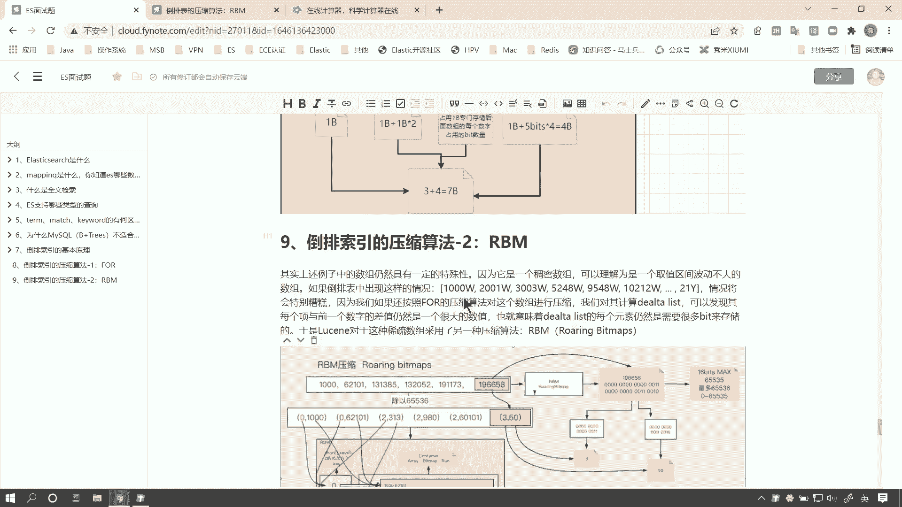