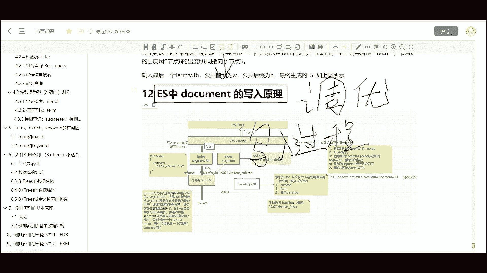
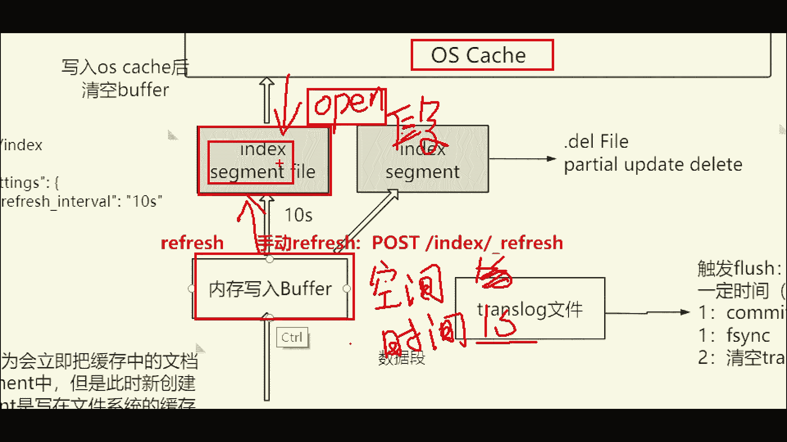

# 系列 6：P159：文档的写入原理 - 马士兵学堂 - BV1RY4y1Q7DL

。好，我们继续来看下面一道来自阿里的面试题document的写入原理啊，这也是ES面试题中一个非常常见的问题。好，下面我们来看一下这道题，我们如何来回答。好。

那这个问题呢在面试中呢也是一个非常高频的问题，并且在此问题上可以衍生出一些其他的问题。比如说ES的检索性能调优，查询性能调优。没错啊，就是查询性能。

ES的查询性能其实和ES的底层写入逻辑呢是息息相关的那包括呢写入调优。那这里边呢其实就涉及到了一个关键字调优。啊，是这个优化的优啊。呃，调优里边能涉及到很多相关的问题，甚至包括ES的写入的并发问题啊。

咱们都是基于基于这个写入原理啊，这个基础之障而来的。好，那这需要注意的是，咱们这个视频里啊，就是咱们本本节视频里边呢是不包括啊是不用去考虑。比如说多个分片的数据同步问题啊，就是数据的这个协同问题。

以及这个数据的写一致性问题啊，写一致性的策略这些问题，咱们暂时先搁在一边。其实那些问题呢是更倾向于什么啊写入过程，数据的写入过程。啊，它怎么是保证这个多个分片的这个数据一致的？啊，当然了。

这是其实是另外一个问题啊，咱们先不用去考虑啊，那么下面咱们来看这个数据是怎么写入进来的啊，咱们把这个图放大一些。

OK嗯，那假如说呢这个图呢整个过程呢，咱们好嗯好比是咱们要把一车砖头放到仓库里。那么咱们磁盘呢就相当于是一个大仓库啊，空间比较大。而咱们的这个一车砖头，就相当于咱们是批量写入数据，一块砖头就是一条数据。

那么大家都知道啊，基于计算机的啊这种。防东硬卖模型这种计算机系统啊，那么我们磁盘啊磁盘这个硬件其实是性能最低的一个硬件。好比说我们这个大仓库门口站了一个老大爷。啊。

或者说是一个工人啊负责搬砖的那我们的小车如果要直接向磁盘中写入数据呢，假如说我们里边有100块砖头啊，这是个小车。好，我们批量的往里边卸数据。那么大爷呢一秒钟只能搬一块砖头啊，每秒。

那么这个时候就会就是说频繁的啊大爷搬一块砖进去，搬一块砖进去啊，就会造成大量的这个IO嘛。自盘的IO是呃非常耗费资源的啊，非常浪费时间的。那么怎么办呢？有一件事呢啊这个缓存其实就是这么来的嘛？

缓存的作用是啥呢？其实就是做起到一个缓冲的作用。何谓缓冲呢就是缓解这个冲击力。说白了就是把整个过程放慢。好，那么你给大约时间，就是说你大约你不是这个数量大吗？你给大约时间就行了。好。

那么也就是说咱们把这个车呢不直接搬到这个大仓库门口。好，咱们打个比方。好，那么假如说呃缓存呢一般来说都是基于内存的嘛。在ES中呢啊它这个写入机制呢，实际上里边ES呢给我们开辟了一块空间呢。

叫做buffer。其实这个buffer呢就是缓冲区。咱们可以理解为它是一个啥呢？小仓库。啊，小仓库。那么这个小仓库的作用是啥呢？这个小仓库呢跟大仓库的最本质的区别呢，就是首先它的空间更小。

因为它是基于内存的，但是呃内存的是性能更高嘛，咱们可以把它想象成为一个现代化的啊机械化的仓库。它搬砖的效率比如说是100块每秒。那这个时候呢，咱们可以把小车呢，比如说咱们这一车砖头100块。好。

我们可以把砖头呢一下子就陷进这个内存bu法里边，它不是性能快吗？好，那么ES的机制呢，当我把数据写入到内存里边的时候啊，注意看我放大一些。当我们把数据写入到内存里之后呢，好，注意这个小仓库。

它的内它的空间阈值是比较小的啊，当然了，这个阈值我记得是十0兆还是G边M10%，我忘了啊，当然了，它的大小是固定的，我们可以人工的去干预去设置它大小。这里边呢有一个呃有两个关键点，叫空间阈值和时间阈值。

就是它的这个。啊，空间和时间的阈值。好，空间阈值默认就是一秒。当然呃这个时间阈值默认是一秒，空间阈值我忘了啊，但是它大小是固定的。当我这两个阈值啊，其实就是封顶值嘛，最大值任意一个条件满足的时候。

比如说时间阈值一秒钟，我当我的时间达到一秒的时候，不管我这个仓库写没有写满，我都会把仓库这个小仓库的东西。给放出来，放到这个大仓库的门口啊，那么这个一摞砖头，就是这一这个仓库写满之后啊。

就是达到空间阈值或者时间阈值之后的这一堆数据，这一小坨数据叫做一个索引的sigment feel，这么一个索引段文件啊，叫索引段啊，段落的段啊，索引的段。好。

那么索引断文件呢会马上把数据同步给OS catch。这个OS catch是基于啊操作系统缓存的。我们把数据交给OSca这个过程也是非常快的。好，那么OSca接入到数据之后呢，会马上响应请求。

告诉我们当前ES整个服务啊，我们这个sment的文件已经同步过来了。那么此时啊sment的文件呢会被处于一个叫open状态。好，当我s的文件被打开之后，好，我们当前写入了这个数据就可以被查询到了。

说白了啊，我再举个例子啊，那么当前的这个数据呢其实交接给OScaOSca给了你一张票啊。好，那么它相当于啥呢？它相当于是一个呃门口登记啊，就是登记你这个数据的。好，你的这个数据你的货已经入库了。

我给你开个票。好，那这个票他拿到数据之后呢，我们这个数据就可以呃给客户交代了，你拉了一车数据。好，那么这一车数据比如说这是这个小车嘛小车把数据放到内存里。然后说了s的文件sig交接OScaOSca呢。

其实就是个仓库管理员，我们把仓库管理员把数据啊交接给仓库管理员之后，好，仓库管理员他负责给这个大爷来对接，并且给给当前这个文件开一张票。好，那么这个票呢呃就告诉我们当前这个数据已经入库了。

当然了真正这个还没有真正持久化到磁盘。

你啊。好，那么到此为止呢，其实这个过程呃，到sigment的文件被打开之后，我们用户作为客户端啊，作为客户端的用户而言，我就可以检索数据了。好，注意啊，只有当sigment文件被打开之后。

用户才能检索到这条数据。注意啊，这里边呢因为有一个默认一秒钟的时间阈值，默认是一秒钟。所以很多人会问到，为什么ES写入数据之后要有一秒钟的延迟呢啊，就是这个原因造成的。当然了。

这个时间呢咱们可以设成10秒100秒。好，这样做的目的是什么呢？其实咱们要明确一件事儿，就是首先呢写入性能和查询性能啊是不可兼得的。或者说写入实时性。大家都知道ES是一个近实时的啊，实时性啊实时性。

和查询性能是不可兼得的。查询性能什么意思？好，也就是说如果我要更高的形实时性，我必然会。呃，牺牲查询性能。因为啥呢？因为我会浪费更多的计算机的性能，或者占用更多的资源啊，待会儿我会说好。

明确了这个呃这一个点之后呢，我们再来看它的接下来的一个过程啊，我每隔一秒钟或者当我的这个。内存bu法写满之后，就是这个小仓库塞满之后啊，不管是时间到了或者说仓库写满了，我都会把数据倒出来。

放到生成这个s文件啊。当然这个sig文件一去一回，这个呃过程是非常快的啊，并且它是一个原子性行为啊，是个原子性行为。好，当我的仓库再次写满的时候，我会生成第二个s文件。好，假如说它的编号是一。

它的编号是2。那么这个过程呢会不断的重复。第三个第四个第五个好，点点点点点。好，那么每一个s的文件呢都会把数据交给这个仓库管理员。这个仓库管理员好，他这个仓库管理员呢，这个OSca呢。

实际上是也是有一个空间的阈值的。当然他也有一个时间的预值啊。当我这个OSca写满了，或者当我这个时间阈值啊，这个条件达到了之后，时间阈值默认是30分钟啊，这这儿呢默认是30分钟。好。

我30分钟或者说我的这个OSca写满之后呢，我就会执行一个叫刷盘的操作。我会刷盘的。好，此时呢仓库管理员呢就会把这一坨数据呢好放到磁盘里。好，那么交给这个老大爷来处理。当然了。

这个过程呢和我们的用户就无关了。因为我们的用户其实这个数据只要到这个位置，我们用户就可以检索了。好，其实呢这个过程变相呢就实现了一个什么叫读写分离。读写分离的意义在于什么呢？在于减小磁盘的写入压力。

并且提高我们查询的实时性啊，提高我们的查询性能啊，减这个数据写入的性性能啊。好，这两个过程一旦分开，我这边写我这边的，你那边啊，就是我这边呃写我的。你那边同步你的数据，我们互不相干啊。

这两个过程就分开了嘛。好，那么Fthink这个操作呢，它会执行一个它会执行一系列的操作啊。这个Fthink就是刷盘嘛。好。

首先呢这个会呃当前这个OS catch呢会执行第一个操作叫做comitcomit point啊。comit point是什么呢？comuter point就是OS catch呢。

会对当前这一系列的sment文件执行提交操作。啊，我数据提交给磁盘之后呢，commit point制定一个这个提交点。这个提交点的作用是什么呢？好，首先commit point在执行的时候呢。

会执行以下步骤。首先第一个叫选择相似的sigment文件进行merge。首先这个sment文件是基于文件系统的缓存的啊，那么这个mer操作呢也是基于JVM来完成的。好，注意这里边又有一个面试点。好。

那么我先卖个关子啊，那么大家往下听，当我这个sigment文件，比如说非常多的时候，比如点点点点点有100个。那么我们这个merge。就是要合并这100个文件生成一个新的sigment文件。好。

那这个过程就会非常的消耗GVM。也就是消耗我们的堆内存空间。好，也就是说，我们如果能避免产生过多的sigment文件，就能变相的降低我们资源的这个GVM资源的消耗。因为这个GVM资源是非常有限的啊。

是非常非常珍贵的。所以说我们要尽可能的减少sment文件的产生。好，那么话又说回来了，如果要减小sigment文件的产生，有两个途径。第一个是增大buffer这个缓冲区的大小，因为空间增大了。

你这个小仓库变大了。那么我提交生成index这个文件的index segment这个文件的次数也就减小了。所以说这个文件就减小了嘛。好。

同时我要降低这个refresh这个时间就是内存 bufferffer每隔一秒钟提交sigment就是index sment文件，这个时间的阈值，我们要把它时间阈值给它放大。也就是这个参数呢叫做。呃。

叫做那个什么interval啊，叫是这个参数名字，我忘了，我看这个图上有没有啊。没有啊，这个阈值参数啊叫呃什么fixix这个interval INT我记得我不记得那个单词怎么拼了。好。

这个时间默认是一秒钟，比如说咱们可以给它设置成10秒，甚至100秒甚至10分钟，比如说10分钟。好，那这样的话，我每隔10分钟可能才会产生一个sigm的文件。那这样的话。

我的当前的呃10分钟是600秒吧。好，那么我当前sigm文件的数量就会下降到原来的61%。好，从而节省我们的资源嘛，但是有一个缺点呢，就是好，我10分钟提交一个sigm的文件。

也就是我当前比如说啊我开了一辆小车里边装了100块砖头。好，那么我当前这个司机是吧？我这个司机这哥们儿啊。好，把数据交给你了。那么你要隔10分钟之后才会把这个数据交给这个仓库管理员。

仓库管理员给你开收据。好，这个时候我这个这个开小车的这个货车司机啊，才会拿到啊这个数据其实写进去了。也就是说这个写入数据型的呃实时性呢会由原先的一秒下降到原呃现在的10分钟。你写一条数据。

我十分钟之后才能检索到。好，这也是为什么很多你在手机上，比如说提交什么提现哪或者一些操作，好多操作要你比如说两个小时之后。啊，你才能查看到结果。其实呢就是为了提升我们呃就是牺牲写入实识性呢。

其实为了提升我们的检索效率啊。因为很多数据呢对这个实时性的要求并不是很高。所以为什么ES它叫搜索引擎，而不叫写入引擎呢？啊，这其实有一点差强人意是吧？但其实就是这么回事儿啊。好，那么到此啊。

我们其实已经说了到这个sma文件的合并这么一个过程啊。那么flash呢指的就是我们当前啊就是提交point点之后呢，这个数据呢同步到这个磁盘里啊，19号到磁盘里。那么commit point。呃。

把这个index s文件合并之后呢，会标记为删除，就是iss delete。那么会标记在一个叫点DEL的文件里，把这些文件通通标记为删除，并且生成一个sigment。啊，比如说101吧啊。

咱们随便给他一个标号，然后把这些老的12345到100这些文件通通给标记为删除。好，这个时候用户的请求呢通通会打到sigment101这个文件上来。然后最终呢这些文件呢会被回收啊。

这些旧的文件会被回收啊，从而释放资源。那么这个过程对用户而言呢，是无感知的。O。那其实整整个过程啊，如果你用心听的话，其实会发现一些问题。比如说哎我们来看当我们数据呢提交到buffer里啊。

创建sigment的文件，包括交给OS catch这个过程啊，响应打开这个in indexdexs的这个文件之后呢，整个数据呢并没有持久化到磁盘里，这个过程呢可能非常缓慢。

如果这个时候我的服务整个服务宕掉了。我的数据是不是会丢失啊？那么其实呢这就涉及到了另外一个问题。那ES如何去呃保证我的这个数据的完整性呢。好，那么这儿呢就提到一个文件呢，叫translog。

那translog呢是一个事务日志啊，当我们数据写入到bu法的同时呢啊会追加写入到translog里。所以啊这里边记住啊是trans啊是end啊，是追加的方式写入的。

不管你是删除还是呃执行删除操作还是写入操作，或者是更新操作。那么对于我translog而言，都是要pen。所以说我们不用去考虑这个translog文件的一个性能问题啊，这是完全没必要的啊。

那么translog之所以存在它的目的呢就是帮助我们数据在发生意外的时候丢失的时候，我们的数据回滚。啊，也就是为了保证我们数据的这个完整性。好了，那么这个呢其实不用多说啊，很多里边很多这个呃。

很多技术啊，这个中间件都会有这样的相同的这种东西啊，叫叫translog啊啊事物日志。嗯，好了，那么咱们的这个关于这个ES的写入原理呢，咱们就先说这么多啊。那当然了，这里边需要注意一些点。

就是在这个写入原理的这个基础之上呢，可能会衍伸一些问题。呃，这里边其实能呃衍伸出很多面试相关的问题啊。咱们后边都会说到呃，这里边还有一点呢，就是这个reresh啊。

这个是最最常问到的refresh的时间间隔，咱们可以手动去执行refresh呢，就是把手动的把这个小仓库的数据呢写入到这个sma文件生成s的文件。还有一个就是flash的时间间隔。

这个都是写入调优的一些常用手段啊，比如说增大flash的间隔，比如增大buffer啊，降低呃ES refreshresh的这个interval。啊，就是把时间增间隔设置大一些啊，都是一些常用的手段啊。

好。