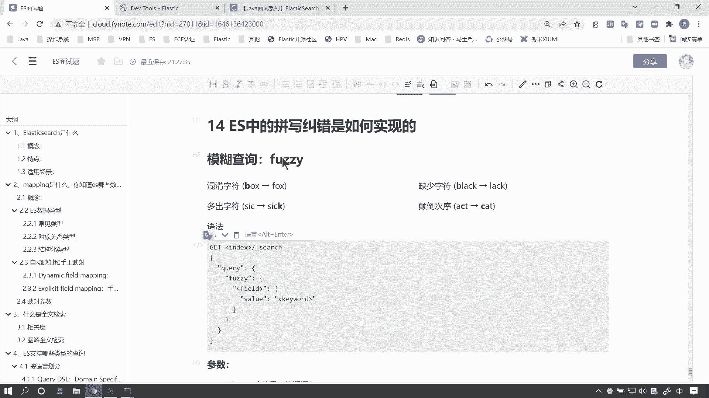
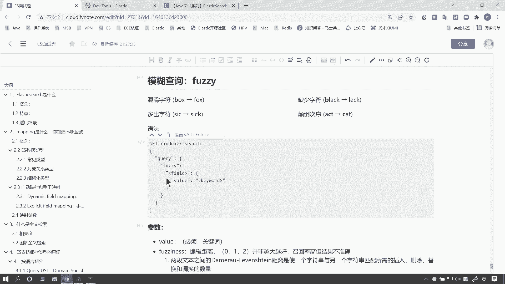
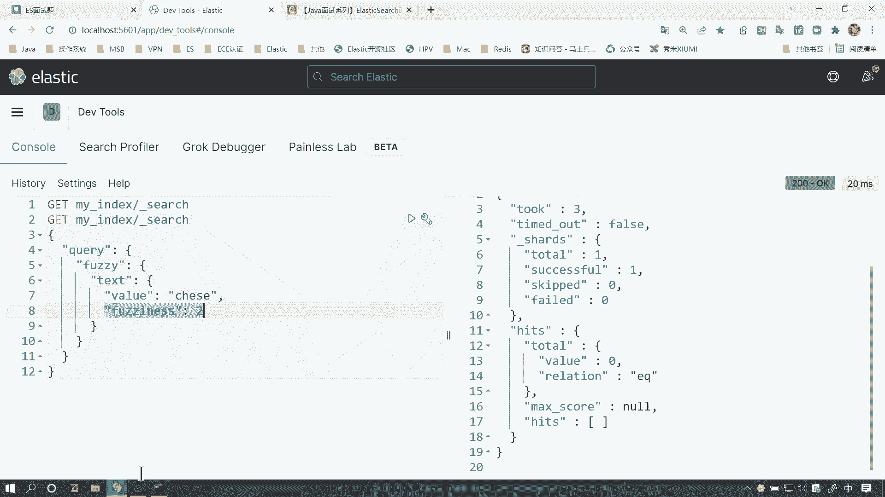
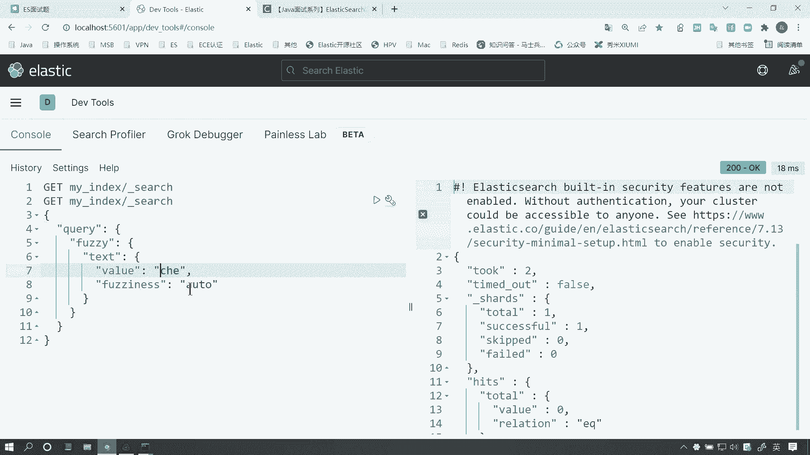
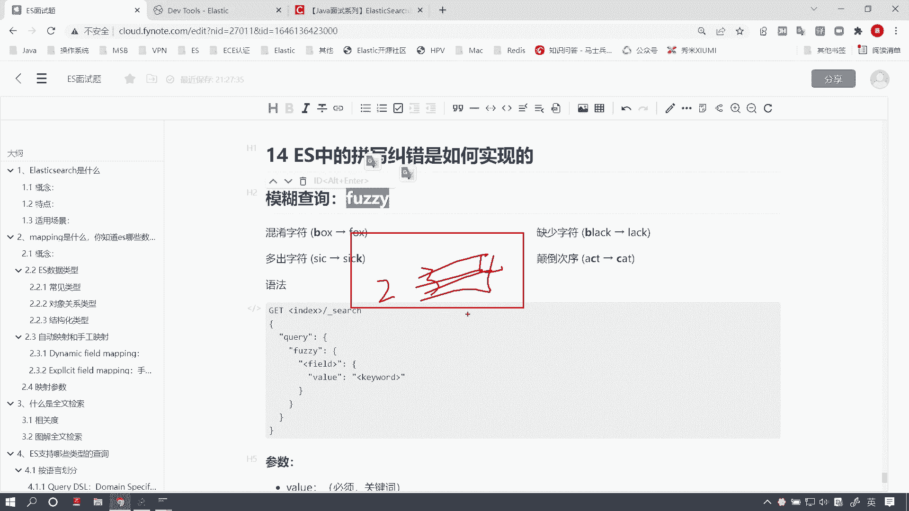

# 马士兵教育MCA架构师课程 - P161：ES 中拼写纠错是如何实现的 - 马士兵学堂 - BV1RY4y1Q7DL

好，我们继续来看下面一个问题。ES中的拼写纠错是如何来实现的那这是一道来自美团的面试题。那对应的岗位薪资呢在25到30K左右。好，那么下面我们来看一下这个问题如何来回答。呃，首先呢关于这个拼写纠错啊。

也是一个面试题中非常常见的问题。

呃，我们之前呢在。呃，网上呢随便搜了一些面试题啊，我们看到这里边呢，其实就是有关于这个拼写纠错的问题啊。如果面试的时候被问到这个问题啊，或者说被问到像某户查询是如何实现的。

先丢给监考官一个关键词叫负队啊，也就是说这俩是一回事，其实。

好，问到这个问题，先告诉他是用fZ来实现的。那么模糊查询啊，或者说拼写纠错呢，一般来说呢分以下这么几种情况。比如说第一种呢就相当于字符敲错啊，混淆字符混淆字符。第二种呢，像这种字符缺失，少一个字母。

或者说多一个字母，或者说你这种字母颠倒了ACC变成CA了。这种情况呢通常都属于呃拼写纠错啊，或者说叫模糊查询。但是它是有一定的限制的啊，咱们待会儿会说。那下面呢咱们语法就不讨论了。

面试的时候不用去回答这些问题。咱们下面通过一个简单的例子啊，咱们来看一下什么视频研究做。

好，比如说咱们当前使用这种叫副对查询，查询当前一个关键词。咱们查询chinese啊，中国人，其实这里边少一个字母N呢，但是咱们看到这个结果其实还是能出现结果的。好，这里边有一个关键的参数啊。

这其实它是实现我查询的一个关键啊，叫fo list。指的是什么呢？指的是当前容错的补长。何为步长呢？比如说咱们当前的步长是一啊，咱们设置个一，那么允许你出现的字符。错误的这个长度呢也是一。

咱们这儿少了一个字母，咱们再来少一个字母，就发现这个结果。就没有了啊，因为咱们这儿允许的长度是一。我可以把长度设置成2。结果就又出来了。但是。二是允许的最大字母长度。如果生成3。呃，其实设证三。

这个结果和这个。结果和设置成二是一样的，因为咱们把这个字符再少一个字符，你看啊结果就没有了。因为咱们这儿你即便设置成三，我这儿错错三个字符也是不行的啊，最大长度就是20到2之间。如果你设置成0。

那么代表你当前是不允许有错误的啊，一般来说咱们不这样用啊。但是为什么呢？咱们待会儿再去考虑这个问题啊，咱们先来讨论什么是步长。这是也是你面试官，你要跟面试官解释清楚的一个原因啊，解释清楚的一个问题。好。

咱们来看我的笔记里边啊，那关于这个fuliness呢。

好，咱们来看一下啊，取值范围。首先呢你要跟监考官说清楚，取值范围只有0到1啊，只有012这么3个。而且并非越大越好，这是你需要记住的。因为如果数字越大，比如说咱们在英汉词典里。

都是这种第一个单词叫什么abband是吧？咱们随便写一个简单一点的ABOUT。好，那么比如说我们五个字符，你设置两个字符。的冗余长度，或者说我们允许容错两个字符。那么可能ABT通过这三个字符呢。

我能检索到相关性比较高的词汇还是有一些的。如果你设置的这个容错步长，比如说是3，那么我允许任意三个字符错误。那么通过两个字符召回的结果可能非常多，就是召回结果非常多，但是什么呢？相关性比较差。

相关性比较差。也就是说，仅凭剩下两个字符呢，我们返回我们召回的结果，虽然结果多，但是跟你想要的结果的相关性不大。所以就没有意义了，而且这样的性能也会更差。

所以这就是为什么我们的这个长度呢一般设置为最大为2。

默认情况下呢。这个长度呢其实如果你不写这个啊，你不写这个fulness呢，它相当于在forfulness里边设置了一个叫AUTO自动长度。这个自动长度。AUTO。

这个自动长度会根据你当前这个字符的总长度啊，你当前搜索词的总长度动态的去做调整。比如说你的这个搜索词呢，哎我就一共就三个字母，那么肯定你如果设置成两个就没意义了。C开头的。

比如说我C嗯这个A开头的一个单词。那么我容错两个，那么以A开头的字符太多了，我把哪个放在前面啊都不合适。所以一般来说，你像这种比较短的，可能哎我们允许的字符长度就比较短，那这是O two啊。

咱们一般来说也都这么去用。

好，那么咱们来看啊，一般来说呢在计算长度的时候呢，在ES底层呢使用的这个luing，它计算的长度这个算法叫。那个莱文斯坦因这么一个算法，它计算长度以上四种情况呢。好，这三种情况呢，它的步长都是一。

而这种情况呢补长是2。但是咱们ES使用的是一个进阶的算法，叫达木劳莱文斯坦因啊。你只要在面试的时候把这些关键词给它抛出来。首先呢啊我们在。使用拼写纠错的时候，使用的这个叫fsy。查询，也就是模糊查询。

好，其次我们是通过一个叫莱文斯坦因和达莫劳莱文斯坦因这两个计算不长的算法来计算当前容错的这个补长的。把这两个名词抛给面试官。好，MLM斯坦因对于这个你像这种词字符错位。AXE写成AEX这种情况呢。

在莱姆斯坦因里边补长是2，但是在达摩劳莱姆斯坦因里边就是一。好，那这就是拼写纠错的一个，其实内容非常简单啊，也没有什么太多的啊太复杂的东西。主要记住一个可能容易嗯面试官可能会扩展问到你一个问题。

就是延伸一些问题。为什么说我们这个长度呢？最大是2，为什么不能设置34。啊，我们容错更多的字符啊，你针对这个问题，你好好想一想怎么去回答面试官就行了。因为如果设置的更多，长度，这个冗易的长度更多。

我们可能呃返回的结果没有意义。

