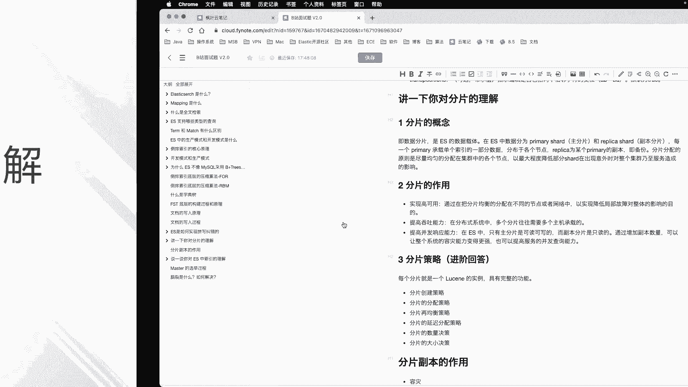
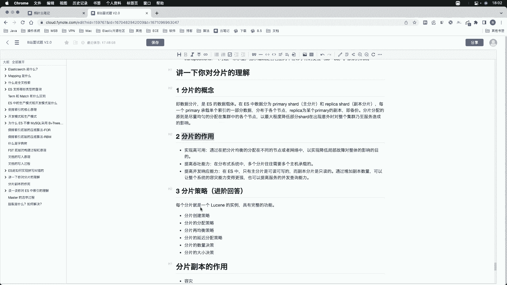
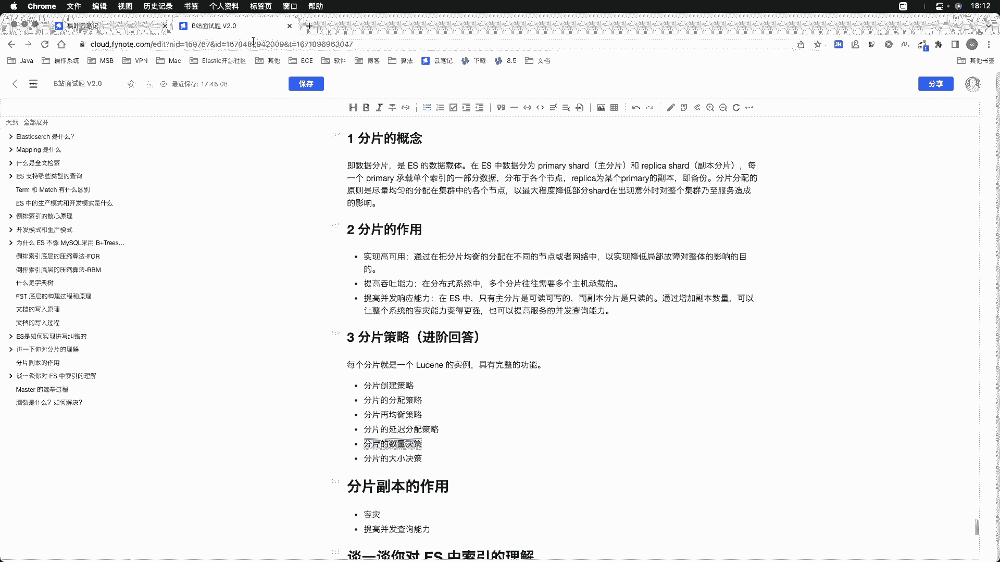

# 系列 6：P162：分片是什么 - 马士兵学堂 - BV1RY4y1Q7DL

好，我们接着来看下一个问题，说一下你对ES中分片的理解。这个问题呢稍微有一些开放啊，关于分片的内容呢非常多。那么咱们可以根据对应的岗位薪资的上下浮动来动态调整我们的答案。如果你面试的岗位薪资要求比较高。

那么我们回答的自然也要深一些。相反，如果岗位薪资比较低啊，我们也可以回答的简单一些。好，下面我们来看一下这个问题我们如何来回答。

OK首先说明一点啊，我们在回答此类问题的时候，尤其是内容比较多的问题啊，你不可能像老师一样在给你讲课的时候啊，讲题的时候呢，照本宣科有1个PPT或者有一个大纲在这儿。所以你在脑中呢不用去死记硬背。

老师给你讲的这些东西。而是要把分片就是把知识点的理解记在脑子里，在脑中形成一个大纲。哎，比如说此类问题，我们可以依据首先从概念和用途这个维度啊，它有哪些作用。

以及从这个底层原理上或者说咱们在使用上有哪些技巧，一定要结合自己的理解啊。首先我们从概念维度来解释一下什么是分片啊。分片其实其设计初衷呢就是为了实现分布式。

任何牛逼的框架或者解决方案都不可能依托于单独的某项技术或者个体来实现。贯彻到底呢，其实分片就是为了落实分而置之的思想。O那么什么是分片呢？分片其实就是一种数据的载体啊。

我们之前在解决my circlercle问题的时候，在数据量大的时候，我们可以采取分布分表。而ES中天然是支持分布式的。那么它采用的手段呢？就是分片。一个分片，我们就可以把它理解为一个表拆分成若干部分。

其中的某一部分。N多个呃独立的分片呢组成了一个完整的索引啊，这就是分片。好，你在回答的时候，一定要像老师这样去回答，而不要说去死记官网，或者说你在百度上搜到的一些概念啊，分片是什么呃分为主分片副本。

这样是没有意义的啊，一定要让面试官感觉你对分片有自己的理解，那这才是一个比较好的答案。OK那么当然了，这些简单的概念我们也要去说出来，包含主分片，它的作用是什么？包含副本分片，它的作用是什么？当然了。

这些咱们一笔带过就可以了。好，那么以上是分片啊。那么一个分片呢在ES中呢，其实就是一个loing的实力啊，这一点我们应该记在脑子里。每一个分片呢都可以独立完成啊任何请求，就是咱们对数据的查询请求。

而在ES中呢主分片是可以读可以写的，而副本是只读的。O那么分片的作用呢，就是为了实现高可用啊，我们刚才已经解释过了，通过把分片分布在不同的节点或者网络中呢以实现局部故障，对整体服务产生的影响啊。

那这就是高可用。好，这也是分片的作用之一。好，那么其次呢我们在回答此类问题的时候，一定要强调啊分片的作用呢，其实就是为了实现我们的高可用性啊，提高我们业务的吞吐能力啊。

提高我们的服务的这个吞吐量以及提高我们的并发显应能力啊等等，围绕这几点来回答。好，那么一般的这个问题啊，一般的这个岗位呢，我们如果能把这几点答好就可以了。那么如果是进阶的答案。

我们还要把分片的一些执行策略给它讲出来。好，那么关于这个策略呢，每一个策略呢，咱们。都能单独讲一节课。但是在面试的时候，这种理论层面的东西，我们不可能把每一个知识点都完整的背诵下来。

所以咱们可以把这几个点都提出来，然后简单的说一下自己的理解就可以了。好，那么分片所包含的概念呢呃所包含的这个策略呢有很多，其实这些策略呢都是围绕着数据的安全性以及我们的这个数据的可用性啊，是吗？

我们的服务的可用性。这几点来产生的或者来设计的。

首先，分片的创建策略，以及分片的这种分配策略，延迟分配策略，包括分片的这个均衡策略，还有分片的数量和大小的决策。这些几个点你能说出来几个，至少这个答案呃，咱们在面试官眼里是哎你对分片的理解还挺透的。

你能理解分片有这么多个策略。其实我还没有说完，关于分片的策略，还有share location awareness分片的分配感知策略，以及foralce awareness分片的强制感知策略。当然了。

咱们其实没有必要在面试的时候，把每一点都讲的特别清楚啊，也不太可能，因为你像我现在跟你讲对吧？那么这些策略呢是列在这儿了，我知道每一个策略它都包含，它都是。呃，用来干什么的，或者说咱们怎么去使用它。呃。

以及它的意义在哪。但是如果咱们在面试的时候，尤其是在面试一些高级岗位的时候，涉及到这个知识体系非常庞大。ES1个只是其冰山一角，而ES中都有这么多面试题。那么我们在如此做的这个知识点中呢。

我们不可能把每个知识点记得特别到位。所以你能列举其几点已经代表了你对这个技术的你对当前这个知识的理解的深度，那就可以了。比如说分片的创建策略。那么咱举几个例子啊。

分片的创建策略是指我们在分片的创建的过程中，在创建之前，我们要指定分片的数量分片的大小，以应对将来业务的变化，对我们性能产生的影响，包括分片的这个分配策略。

分片的分配要均要尽可能的把分片的均匀的分配在不同的节点上，以保证我们每个节点它的性能是比较均衡的。分片的再均衡策略呢，是指我们当前节点，呃，有节点加入或者有节点的。开的时候会自动啊。

就是我们的master节点会自动的把。离开的节点。它所丢失的分片分配到其他的这个节点上，以及比如说我们当前有新节点加入的时候，我们动态会计算我们当前集群中所有节点这个算力。好，我如果发现。

比如说我们当前一共有9个分片。而此时新进来一个节点，我们有4个节点，那么此时9个分片就会均匀的分配在4个节点上，当然不可能做到绝对均衡啊。好，那么分片的这个延迟分配策略是为什么呢？

这个延迟分配是什么意思呢？你解释清楚什么叫延迟分配就可以了。比如说我们在面试的时候，延迟分配呢就是分片。比如说我们当前有一个节点丢失。那么当前节点所包含的分片会延迟一分钟去执行再均衡策略。

那么延迟一分钟的原因，就是因为系统并不知道你当前这个节点是暂时的网络断开，还是说已经故障了，所以我要等待一分钟时间啊，那么如果这个节点在这一分钟时间内恢复连接，那么此时我就不需要再分配了。

因为分片的分配也需要消耗我们大量的这个网络资源。O那么我举个例子，比如说。我们把当前我们ES的这个服务看作是我们班级在打扫卫生。好，我们现在集群中有5个人。那么其中一个人啊，突然他不见了。

那么我们的master节点我们可以理解为技律委员或者我们的班长。好，不知道啊我们的班长不知道这个节点到底是上厕所了还是生病回家请假了，对不对？如果是上厕所，那么他马上就会回来啊过几分钟他就回来。

所以此时他的活我不需要再分配给别人。而如果他是生病请假了。那么此时我们master节点就会把他的活分配给其他人。好，这样的话我们的这个每个人干的这个工作量才会比较均衡，还能把这件事给完成。好。

那么这其实就是分片分配这个分片的延迟分配策略的一个意义，对不对？好，在实战环境中的master节点，是不知道突然一个节点的离开，是因为什么原因呢？因为这个网络的断开，是随机的。好，那么这就是分片分配啊。

延迟分配策略的一个意义，以及分片的数量决策和分片的大小决策。那么这个呢是没有针对咱们在回答面试问题的时候呢，这个数量和大小是没有一个绝对的最优值的。在回答这两点的时候呢，主要遵循以下几个点就可以了。

首先，分片的数量，避免分片数量过多，大多数搜索会命中多个分片。而每个分片在单个CPU上现成的这个现程上运行搜索。虽然说咱们分片比较多啊，可以运行呃多个并发这个搜索啊，但是如果跨大量分片进行搜索呢。

会耗尽节点的这个搜索的线程池。那么这个时候呢会造成低吞吐量以及缓慢的搜索速度，就是会降低我们的查阅速度。第二点呢是分片呃其实来说呢是越少越好。每一个分片呢都使用内存和CPU的资源，在大多数情况下呢。

就是一小部分的这个分片要比这个更多数的就是一呃一小组的大分片，比如三个大分片要比5个小分片所消耗的资源更少。所以说记住这两点啊，这是关于分片的数量。那么分片大小的决策一般来说。

合理的分片容量呢在10际到50GB之间。虽然说这个要求呢不是一个刚性要求，但是一般来说呃这个其实官方呢也是经过了测试得到这么一个结果啊，呃实际到50GB之间呢，这个效果是最理想的。

OK根据这个网络的限制啊，呃我们也可以。把分片的这个大小调的再大一些。但是。在所有的生命周期管理中，一般设置50GB单个所引的最大阈值是最好的OK另外一点呢就是关于分片数量和大小的关联，小于20个分片。

就是说我们一GB的平均啊，平均1GB的对内存所能管理的分片大概在20个左右啊，一般是这么一个对应关系。好，能把以上几个点回答清楚。那么我们这个问题就基本及格了。

