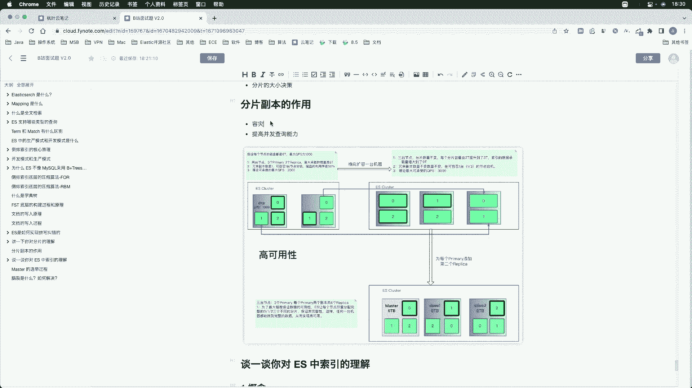

# 系列 6：P163：分片副本的作用 - 马士兵学堂 - BV1RY4y1Q7DL

好，我们继续来看下一个问题。ES中分片副本的作用是什么？那么这个问题呢，实际上是上一个问题，关于分片作用的延伸问题。ES中的分片可以分为两种，主分片prem shared的可读可写，副本分片。

也就是relic shared是只读的。那么关于副本的作用呢，其实无非就两个啊，我们来看第一个呢其实就是为了容灾啊容灾啊。第二个呢其实就是为了提高我们的并发查询能力。好。

我们可以基于下面这个图来回答这个问题啊。好。

从这个图中呢，我们可以看到啊呃我这儿呢给出了首先一个集群啊，有节点一和节点2，这两个节点组成了一个集群。那么我们创建了一个索引。把它拆成了三个分片，分别是0一和2，并且为每一个分片创建了一个副本。

咱们在不考虑高可用啊，不考虑这个master选举的前提下，那么分片设置为一的时候，那么此时我们就具备了呃索引的一个备份，我们任意一个节点宕机，那么数据可以在另外一个节点上找到一个完整的备份。好。

那么这就是副本的第一个作用啊，为了容灾。但是两节点，我们现在先不考虑master选举，两节点，它其实是不具备master选举能力的。一旦一个节点宕机，其实服务就停了啊。好，那么如果说我们把当前的节点。

有两个节点扩充为三个节点，由看右边这个图，三个节点此时会执行分片的再均衡策略。此时呢会有两个分片被分配到了第三个节点上，此时我们就达成了这个负载均衡。好，那么同样我们的这个分片啊会被均匀的分摊。

每一个节点包含两个不重复的呃不重复的分片，并且每啊这个每两个节点之间的分片都是不完全相同的。好，那这样呢任意一个节点宕机，我们都能在另外两个节点找到完整数据啊，什么叫完整数据？

只要你能找到012这三个分片，那么数据就是完整的。哪怕主分片丢失。那么这个时间也是短暂的啊，我们会从对应的副本啊，把它提升为主分片啊，其实就达到了我们这个数据完整性。好。

那么三节点同样也是最小规模的高可用集高可用集群。因为比如说我们当前好，假如说这个节点二呢，它是一个主节点。节点二宕机了之后呢，我们是可以在另外两个节点中选出一个新的主节点的。

所以三节点也是我们最小规模的高可用集群。好，那么这个你可以在面试的时候也可以可以也可以说出来啊。好，那么如果我们在此基础。之上呢再扩充一个副本，也就是说为每一个主分片分配两个副本。好。

我们就可以把集群呢升级为好，我们现在屏幕上看到的这个样子啊，那么每一个主分片呢，它都包含了两个副本。那么此时呢数据的冗余备份呢，其实也就是两份。好，那么其实比如说我们索引啊只有一T的数据。

那么每一个副本也就是说每一个分片的副本都有两个。那么此时也就相当于我们做了两个备份分别分别啊分别就是把这个分片分配在了不同的节点上。那么此时每一个节点上都能找到012这三个不同的分片。好。

那么012012012。那么此时我们节点允许任意一个节点丢失。而且可以保证我们数据的完整性。当然了，这样呢我们的这个数据的吞吐量，也就是相对于上一个集群。其实是没有提升的。

而只是我们把数据的冗余增加了一份。那么我们当前集取呢仍然是仅允许有一台节点当机，也就是出现故障啊，因为我们如果第二个节点出现故障，那么剩一个节点是不满足我们最小这个选举主节点的一个要求，也就是两票。

那关于这个呢，咱们在后边讲master选举这个面试题的时候啊，同样会给大家介绍好，以上呢基本上就是我们副本的作用啊。

