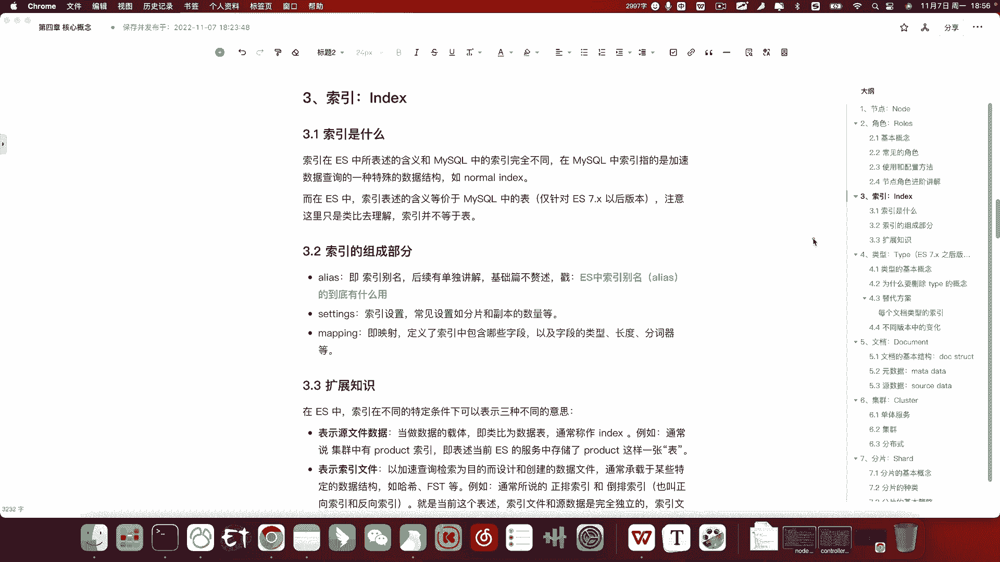
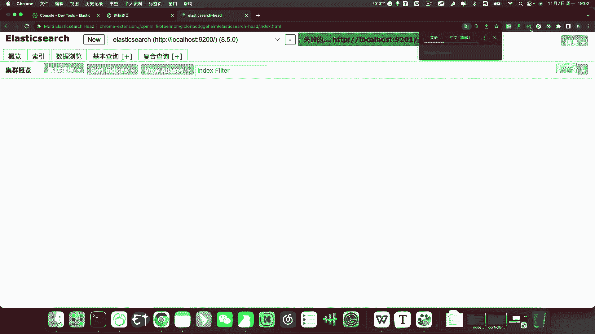
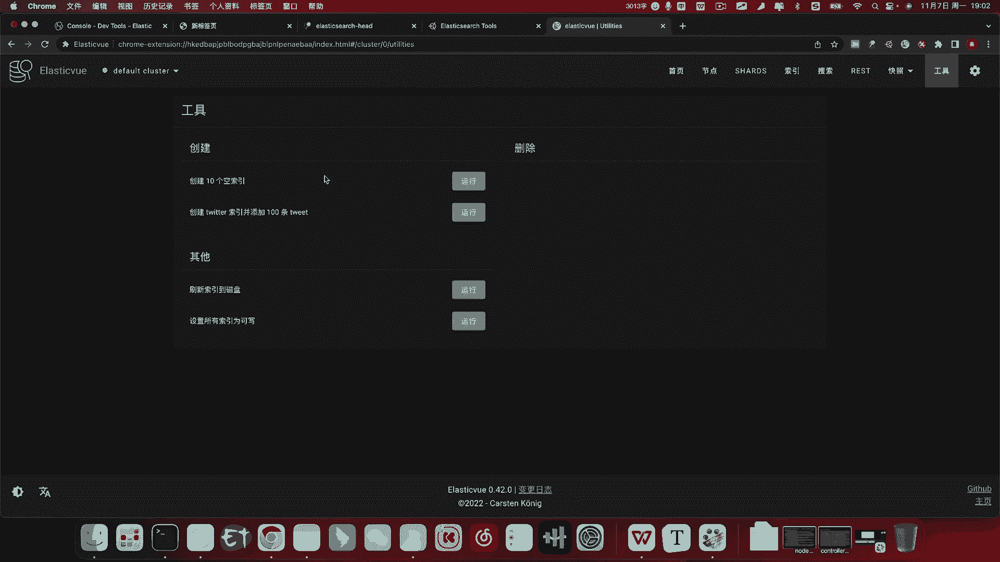
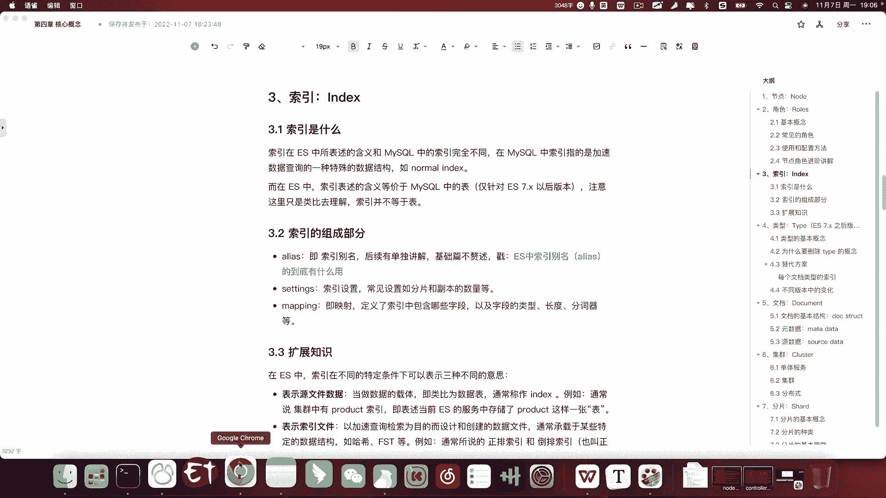
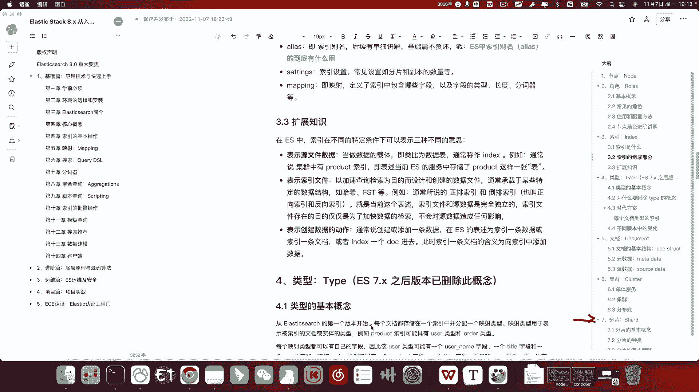

# 系列 6：P164：如何理解索引 - 马士兵学堂 - BV1RY4y1Q7DL

好，我们继续来看下一个问题，谈一谈你对ES中所引的理解。那这是一道来自阿里的面试题，对应的岗位薪资呢在25到30K左右。这个问题呢看似非常简单，其实是暗藏杀机啊。

这个问题是非常容易让面试官看出你是否真的对ES有比较深层次的了解的一个问题。好，那么下面这个问题我们该如何来回答呢？索引我们一般也称之为index啊，在ES中呢，索引可以同时表达三种不同的概念。啊。

所以换句话说呢，我们可以对索引呢有三种不同的理解。关于这一点呢，我待会儿呢也会在本节课的3。3这个小节呢给大家详细的介绍啊，作为一个扩展知识。OO啊，那么我们应该怎么样正确的去理解索引这个概念呢？呃。

我不知道大家有没有金庸老先生的粉丝啊，金庸老先生呢有一个作品叫设呃，叫那什么呢？叫天龙八部。呃啊叫倚天屠龙记。在倚天屠龙记里呢，张三丰曾经对他的这个徒儿啊，应该是徒孙吧。呃，说过这样一句话。

就是在他学习太极拳的时候，那么张三丰对张无忌说，你要想学成太极拳，你就要把你之前学过的招式和套路全通通给忘掉。好，我们在学习ES的时候啊，我知道大家呢在学习ES嗯之前呢，应该都学习过my circle。

好，咱们在学习ES的时候呢，可以借助my circlecle的一些理念一些概念。但是我要告诉你的是，你一定要把一些概念和数据库和my circlecle的这些概念的绑定呢，你给忘掉，你不要理解。

就是他们的概念在两个数据库之间呢，是有可能是完全不一样的。好，我们接下来要说到这个索引，其实就是这样的。所以你要把一些固有的概念先给忘掉。

我举个例子啊，比如说我们现在打开百度。

我们搜索所引的。所引的种类。

好，我们来看这个吧。好，那当前这个博客呢，我们可以看到索引的种类它跟我们列出的以下几种。主件索引唯一索引普通索引权索引覆盖索引组合索引等等。那么这些索引呢其实本质上属于一种单独的数据结构。

它的目的是帮助我们去快速的更高效的去检索我们的原数据，也就是我们的业务数据。好，而在ES中呢，我们主要表达的含义呢并不是这样的。我们在ES中索引的概念呢，它其实可以等价理解为mycicle中的表。啊。

但是它们并不是完呃并不是一种东西啊，只是我们可以通过my circlecle这个表的概念来类比理解为呃我们索引在ES中的这个概念。好，我们暂且可以这样去理解啊。记住啊，我们只是这样去类比。

而不是说索引就是表，因为它们是完全不同的数据结构。好好，那么现在我们的认知呢就把index呢当成表。就是tablele。就可以了。当然了，这个索引的概念呢，我们也会在后面不断的学习。

你不断的使用过程中呢呃慢慢的慢慢的去更加深入的了解啊它这个概念。那么在今后ES的学习中呢，我也给大家提一点建议啊，尤其是对我们新手朋友。婴儿在学习一门语言的时候呢，一开始呢它是基于比如说苹果。

咱们学习母语的时候嘛，苹果它会和一些物品去关联。他会用自己的这个意识去理解这么一个词儿，他到底是个什么意思。而往往我们在学习另一种语言的时候，比如说apple。我们会借助第一种语言啊。

这个苹果它翻译成apple。那这样我们要记忆的数据量呢就要翻倍，明白吗？所以我们要学习呃后面这个ES的时候呢，我们就以这种刚开始学习第一门语言的这种形式，你抛弃第一门语言，咱们通常来说。

可能对于大大多数java程序员来说，可能myscle或者oracle呢，是我们学习的第一种数据库。好，你现在先把它抛之脑后，把所有的概念都给忘掉。那么我们接下来学习ES呢会变得更加轻松。

就是回归到了我们学习，就是我们处于婴儿学习新语言的那么一种状态啊，从零开始而不要去借助一些咱们现有的固有认知。好，因为这些固有认知呢，会影响你对新事物的理解。啊，这是我给大家的一个建议啊。好。

那么索引的概念呢给大家介绍完了。那索引的组成部分呢，首先我们刚才说了啊，在借助一些my circle的概念去理解啊，我我可以这样去给大家讲，因为我已经很熟练了，对吧？那么咱们怎么去理解呢？来看啊。

我打开咱们local host的，我这儿的服务就已经启动好了，local host5601。😊，5601。好，我们现在启动的这个程序呢叫kibanana啊。

它是我们e search官方呢给我们提供了一个客户端工具。这里边的功能相当相当强大。当然了，我们目前只会用到其中一个功能。好，当我们访问了kibanana的首页之后呢，它会给我们这么一个界面。

我们点击左上角三条杠，三条杠呢滚动到最下方有一个d toolss，就是开发者工具。我们在这里边呢把所有的代码先删除啊，我这里把字体呢调到咱们一个合适的大小23。浏览器复位。好。

那现在啊我们这个界面呢呃是我们接下来课程呢用到最多的一个工具。当然了我们除此之外呢，浏览器呢也给我们呃一些好用的插件。这个之前我们提到过你像head呀，像这个 search tools啊。

像这个咱们对这种对国人比较友好的插件叫elasticE啊，那这些工具呢也非常方便的能让我们提供一些节点啊索引啊，以及一些数据的查询，甚至可以帮助我们去管理快照。

还有一些像这种帮我们创建模拟数据这样的这样的功能啊。当然了还是啊我们用到最多的还是我们这个这个ke中的 tools。好，这个原由很多啊，首先这个d toolss呢是能给我们智能提示的啊。

其次呢能帮助我们去格式化端代码代码纠错等等啊，这种这个ke banner呢你在使用的过程中，你会发现它会对给我们带来很多好。

处包括一些快捷键啊，我们使用起来非常方便，但它也有一个缺点，它的缺点就是比较重。啊，他要占占用你比较多的这个系统资源啊，所以一些简单的任务我们可以借助咱们一些插件或者工具啊。但是如果我们要系统的学习。

我们还是要依赖于d toolss。而且这个东西本身啊这个提班呢本身也是我们要学习的一个工具，也是要我们学习的一个技术。🤧好，那么话不多说啊，索引它包含哪几个组成部分呢？首先我们课件里给我们展示了啊。

它一共有3个。我们在创建索引的时候呢，通常使用一个叫put。因为ES它本身是一个基于rest风格的。啊，这么一个开发语言啊，或者是数据库。我们在写代码的时候呢，经常使用的就是put post。Get。

啊。get以及dele。所以啊我们使用put呢。哎，使用put呢它具体都能执行哪些操作呢？我现在呢先不用给大家介绍，因为我们后边课呢会呃详细的给大家去介绍。那么put我们先尝试创建一个索引。

比如叫product。好，我这里边呢。我先。看一下这个proda这个索引是否存在啊。Product。执行一下查询啊，首先这个所以已经存在了，那咱们就先不用去put了。好，我们执行get就是查询当前。

后边呢这个就是索引的名字。注意啊，索引在命名的时候有一个规范。我这加一个注释。好，第一个。字母全部小写。不要有大写字母。第二个，如果是多个单词，不要用。驼峰。或者帕斯卡。而是用下划线命名。

比如说test。index这是我们的命名规范。OK那我们现在查询productd索引之后呢，右侧给我们响应的这个上下文对象呢。好，我们把它折叠起来，可以看啊，可以看到它一共包含了三个部分啊。

其中productd的是索引的名称。而下面三个呢分别是索引的别名，以及索引的ming和索引的sing。那这三个呢分别是三节不同的课啊，是三个不同的知识点，尤其是这个ming。

我们会有很多的内容要在里面啊。ming展开之后呢，它又包含了一些字段的类型，字段的长度。还有像分子器等等等等啊，这里边的知识很多很多。所以我们在目前呢先不给大家详细的讲解。

我们只需要记住索引的组成部分一共有三个就可以了。那么它们分别发挥什么作用呢？首先别名呢，也就是锁引别名啊，那么它的主要作用呢是为了保护和封装索引，那么它具体的含义作用呢？我这写了一篇文章。

你可以点进去看一下。这里边内容比较多啊，我就不详细给大家讲了。因为我们有专门的课程安排，详细的去讲索引呢别名的使用，以及它的作用，以及在它的这个使用场景啊。包括后面呢我们要讲到这个数据流啊。

🤧以及这个ILM啊，我们用这还有这种rollover indexdex呢，都要用到这个index。好，现在我们不理解没有关系。

好，同样我给以给大家举个例子啊，我们现在呢9200啊，打开local host。我当前的服务呢是在9200端口号端口号上运行的。访问通过head插件的访问啊我们。

尝试访问。嗯。9200。🤧好，可以看到有一些索引呢，它下边有一些彩色的标签。其实这些标签呢就是别名。好，那么它现在到底有啥用呢？咱们现在也不用关心啊，没关系的，咱们后边会讲O那我们继续啊。

除了索引别名之外呢，它还有第二个叫setting settinging里边呢，其实就是索引的设置它会设置一些我们索引的属性，比如说索引的分片数量啊，索引的副本数量啊等等。当然能设置的东西很多。

对于我们目前而言，我们只需要记住索引的分片和副本的数量是在ss里设置了就可以了啊，我们后面的这个分片也会做一个单独的课程啊，在我们本章内容的第七小节给大家去讲好，那么第三个也是最重要的啊。

尤其是前期对我们来说是最重要的ming及映射映射的概念是什么呢？好，同样我们可以借助my circlercle中的表结构来理解。当然啊我们同样是作为一个类比。好。

那么表结构在my circlercle表中发挥的作用和ming在ES中所引发挥的作用是相似的，注意是相似的，它不完全一样。因为ming它和ES和这个my circlercle中的表结构呢有很多不同点。

啊，包括这个字段啊属性啊，它里边划定的这个范围也是不一样的。好，关于这一点呢，我们会在下一节啊，不是下一节了，我们来看一下章节的安排啊。第五章啊，当然照儿这个章节号这个课程大纲呢，我后续呢会做调整。

也大概就是下一章或者下下下下一章的事儿。会给大家去详细的讲解啊呃大家也不用去关心啊，也不用太在意啊。到目前为止，截止到本节课，我们理解的层面到目前为止就可以了，就不用再去深究了。好，那么我们最后呢。

给大家做讲一下扩展知识啊。什么是索引啊？我一开始说它有三种不同的理解。首先第一种呢。好，首先第一种它可以表示原文件的数据，也就是我们刚才讲的这个第一种，它指的是table。啊，我们类比理解为table。

这是第一种理解。好，我们就不再去赘述了。第二种理解呢就是它可以表示索引文件。所引文件呢我们在ES中呢有两种。第一第一种常见呢叫倒牌索引。第二种呢叫正牌缩引。好。

那么这两种索引呢分别是用来解决全文检索以及聚合排序用的这两种索引呢。他们分别也有一个呃其他名字啊，也有的人把它叫做呃反向索引，一个叫正向索引啊，这两这两个概念呢。

尤其是倒排索引是ES中最最最最最最重要的概念之一啊，甚至我们可以把质疑去掉，在面试的时候，倒排索引的这个被问到的概率呢，几乎是百分之百啊，所以说它的重要性不言而喻。因为ES的核心功能就是全文检索。

没关系啊，我现在是扩展一下全文检索这个概念。大家不理解，没关系。全文检索它的呃支撑全文检索的核心就是倒排索引，而倒排索引的底层最核心的数据结构是FST。好，我只给大家延伸那么多啊。

讲到这儿呢呃大家去理解它表示一个索引呃索引文件就可以了。那么索引文件呢，它是不会影响原始文件的，也就是相当于我们刚才在浏览器里边看到的这个啊。索引咱们再重新来索引。

咱们刚才不是在百度上去搜索了索引的一个分类吗？索引分类。啊，就看第一个吧。好，那么索引有主件索引，有唯一索引，有组合索引。那么普通索引啊，那么ES中的这个第二个理解啊，就是索引概念的第二种理解。

那么就可以类似于咱们类比理解为这些索引啊，只不过ES中的这个索引呢，它的数据结构和mycil中这些索引呢是完全不一样的。好，这是第二种理解。还有第三种理解就比较。抽象了，怎么说呢？它不是一个名词。

而是一个动词。也就是说我们在ES中呢，经常你会听到一些老呃就是有经验的人，他会你往ES索引一条数据。此时索引比如说索引。索引一条数据index a do。此时。

index表达的意思是向某个索引中添加一条数据。比如说像test indexdex。啊，中去index一条数据，其实指的就是像test indexex中添加一条数据。好，它是一个动词。好。

那么以上呢是我们在ES中会遇到的三种不同的对于索引概念的理解。那重要性或者我们按照常用的程度呢。ES就是表示数据文件，它是第一个也是最基本的。第二个呢表示索引文件表示倒牌索引或者正牌索引。

它是第二种理解。第三种呢啊其实这个呢就不强求了，咱们理解记不记得住都可以啊。他主要是表示这个创建数据，因为有人这样去说，也有人说你去put一条数据。有人说你往里边写一条数据啊，都可以。好。

那作为一个扩展知识，你可以在面试的时候啊，呃跟面试官去聊一聊这个问题。就如果面试官啊问到呃你对ES有什么理解啊，呃，这个所以你怎么去理解啊，你就可以把它向你擅长的这些知识领域里去引导。OK啊。

那么我们本节课呢就给大家讲到这里啊，如果你也理解，你也觉得老师的视频讲的可以啊，你也喜欢老师的视频，也欢迎你的一键三连啊。你的支持呢也是对我很大的鼓励和帮助啊，谢谢。😊。

