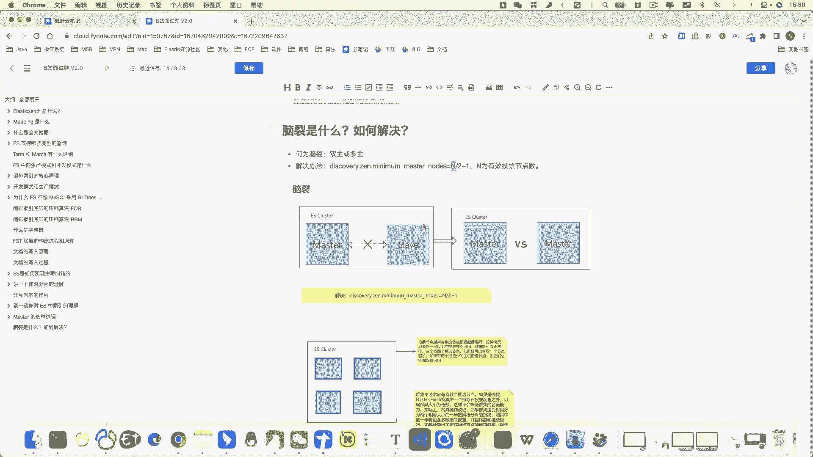
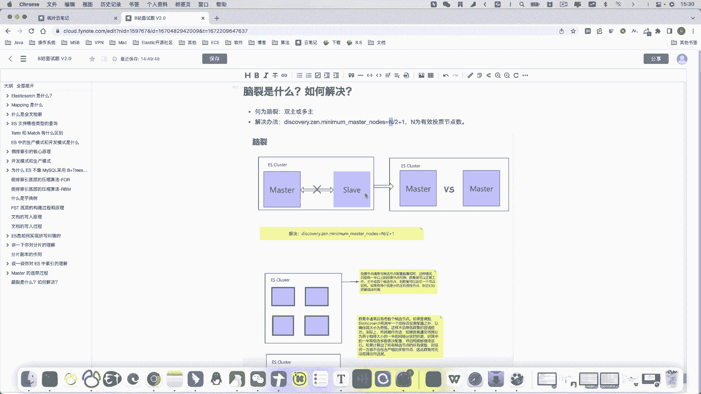
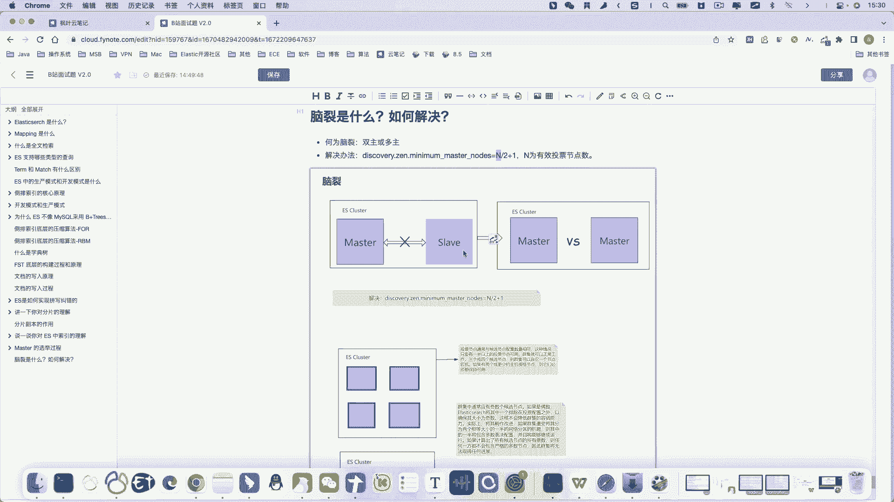
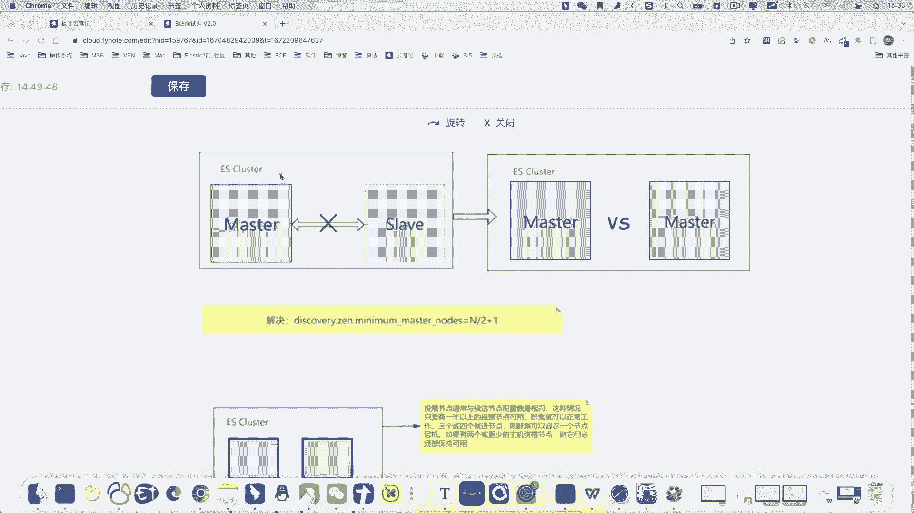
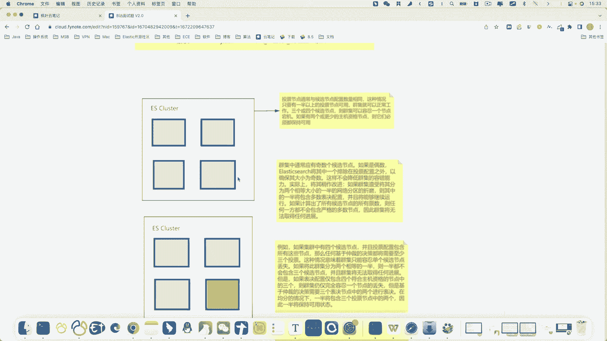
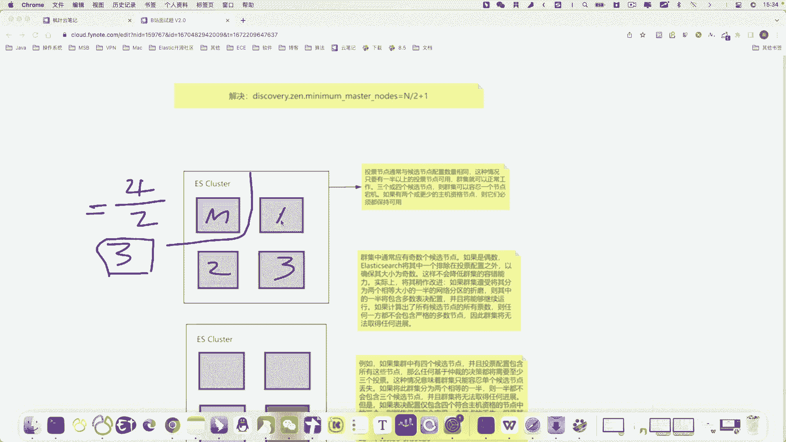
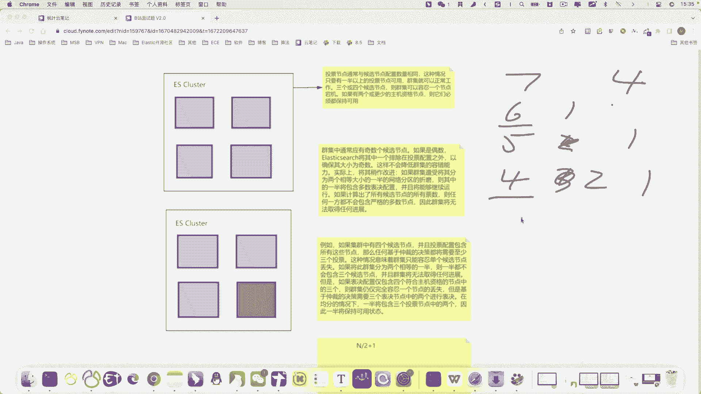
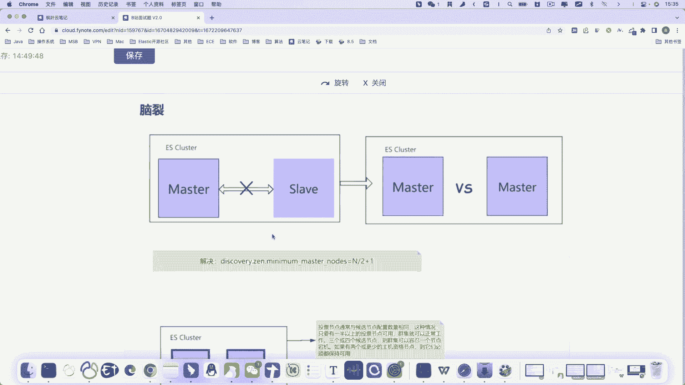
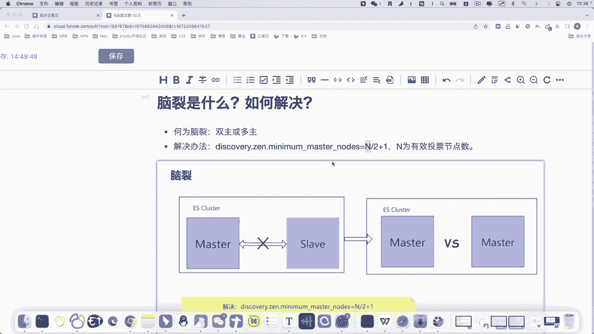

# 马士兵教育MCA架构师课程 - P166：脑裂问题 - 马士兵学堂 - BV1RY4y1Q7DL

OK我们继续来看下面一个问题，脑列是什么？那如何解决脑列问题呢？呃，这个问题一般是和master选举这个问题呢一起来问的啊。就是如果你问到master选举这个问题。

一般面试官呢可能会在这个基础上问问你什么是脑列。那么什么是脑列呢？我们来看一下。

好，脑裂这个情况呢一般啊就发生在选举，或者说我们当前网络发生故障的时候，我们来看下面这个图片啊，我举个例子。

好，那么假如说我们当前集群中呢有两个节点，那么这个节点呢一主一从，左边的是master，右边的是slaver啊，假如说由于某些原因呢，这个master sver呢它的连接丢失了。哎。

我们当前这个节点呢master连接不上啊，联系不上slaverlaver联系不上master。那么此时就产生了那种情况。那么它两个节点之间呢并不知道啊彼此之间并不知道发生了什么问题，发生了什么情况。

有可能是网络中断，对不对？那么此时slaver呢，他就要想哎master到底是不是节点挂了呀，那么我要不要进行master选举啊，把自己选举成master呀，那么这种情况啊。

如果我们在没有采取有效措施的前提之下呢，这种情况是会发生的啊，所以master呢他会啊这个slaver呢他会把自己选举为master啊，就是升级为master。那么此时假如说网络恢复了。哎。

这俩老哥那见面了，那网络又恢复了，也发生很很很eo是吧？这个一脸懵逼啊，那这俩哥们到底谁是master呀，对吧？一个集群中咱们只允许有一个master，那么此时就产生了脑列，那么这就是脑列问题。

说到底呢脑列问题呢，其实就是一个集群中发生了无主或者啊注意无主。或者是多主。啊，这种情况呢我们应该尽尽量避免啊避免这个问题的手段啊有效措施呢就是咱们配置我们当前集群中的法定票数啊。

我画横线的这个参数就是用来配置法定票数的咱们。哦，把这线画直一点。这个参数就是用来配置法定票数的。那么法定票数咱们应该配置为哪个值的？一般我们配置为2分之N。

然后加上一这个N指的是master enableable节点的数量。比如说我们当前集群中有5个master in。那么此时2分之5加1啊，这注意这个2分之5要取整加一呢就是3好，其实呢就是投票数过半。

那么这么做的目的是什么呢？好，以上面这个情况为例，2分之2加一就是2。那么当我们master啊，当我们这两个节点断开的时候，那么master由于不满足法定票数啊，比如说我们将我们把这个图画到左边了。好。

假如说slaver啊因为和master断开了，那么它就要产生master选举。那么此时一看我的法定票数是两票啊，也就是说我选举自己成为master的前提条件呢是我得到两票。那么显然目前我因为这个集群呃。

因为我当前的网络断开之后呢，slaver这一边呢，它只有一个节点。所以不满足法定票数2，所以他就没有办法发生选举。那么也就是说这样我们就避免了脑列啊，就避免了产生多个master这种风险。好。

我们接着往下看啊，其他这种节点比较多的情况。好，假如说我们集群中有4个节点。

好，不管你的网络怎么去断啊。竖着断横着断。啊，或者是横着断啊，或者说我们。一段3。好，这个节点丢了。那么其实我们当前节点2分之N加1啊，假如说有4个节点，2分之N加1，那么2加2加1。

那么就是其实最终法定票数就是3。好，那你发现老师你不是说当我们集群中啊配置了法定票数是三的时候就可以避免脑列嘛。此时假如说它是master，那么它断开了，那么其他1233个节点。

那么这个不是满足了法定票数等于三这种情况了吗？其实啊你说的没错，那么所以说一般在出现这种情况下，就是master enable节点为偶数的时候，一般我们会。

啊，不是我们会啊，是这个ES，它会阉割掉其中一个节点的投票啊，就是选举资格，不是选举资格了，就是master enable这个资格，让它变成一个普通节点所以其实你配置为偶数，那么ES会阉割掉一个节点。

让它变成奇数。那么此时不管你发生了何种情况啊，比如说网络怎么断啊，这样断也好。这样段也好或者这样段也好。那么你集群中能满足法定票数的肯定只有一个网络分区。比如说我们有5个，那么你可以分成二和3。

你可以分成四和一。那么法定票数呢是三票，你不管怎么分啊，这种情况也好，这种情况肯定能保证仅仅有一个分区内满足法定票数，也就是说此时就不会呃产生多组的情况，比如说我们有7个节点，那么法定票数就是4。

因为过半的只能有一个嘛，你不管这个7怎么去拆分啊，六和一五和。重新来一下啊，比如说七可以分成6和15和呃5和24和33和4就一样了，对吧？你不管怎么分，满足法定票数4，那么只能有其中一个啊，六和一。

你可以分成呃，比如说五和2可以分成五和一和14和3可以分成四和二和一。你不管怎么去分满足法定票数的这个分区，只能有一个啊，就避免了脑列，明白了吧？OK所以说呃当我们呃在配置脑列的时候呢。

咱们只需要配置这个法定票数让它过半就可以了。这个N呢呃是我们当前啊当前的这个。

master enable的数量啊，比如说我们当前有5个master enable，那么我们配置这个参数为3就可以了啊，以上呢就是什么是脑列啊，关于什么是脑列问题的解答和如何避免脑列问题的解决方案。

