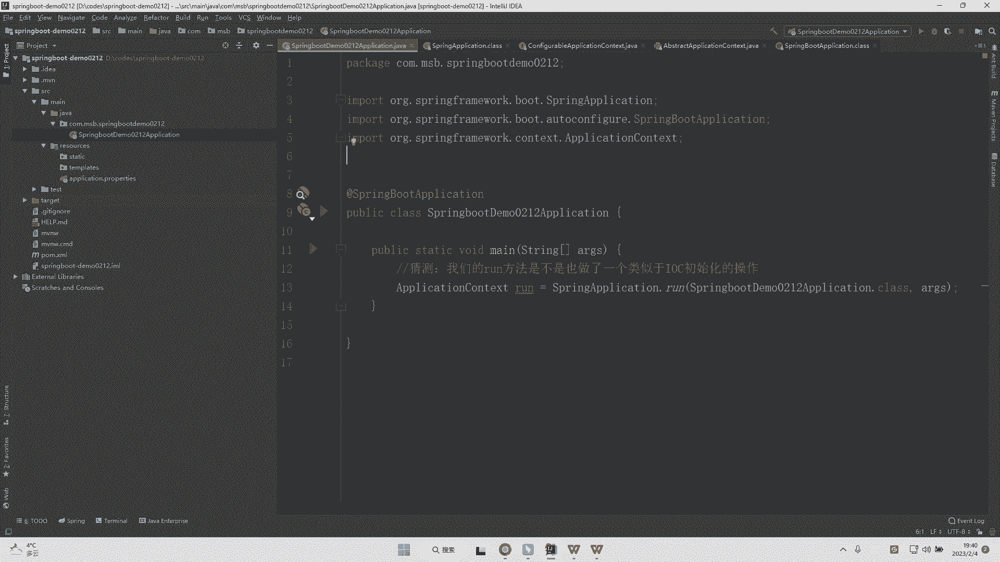

# 马士兵教育MCA架构师课程 - P167：@ComponentScan注解是干什么的？ - 马士兵学堂 - BV1RY4y1Q7DL

它是来自于美团的一道面试题啊，然后呢是秋招的时候聊到的，然后说是什么呢？说是componment scanner这样的一个注解它到底是干嘛的这道面试题主要考察的是你对于spring源码的一个理解啊。

包括其实在spring boot当中，这个注解也有在出现。在哪里呢？其实这道题是在中级加开发工程师的时候会面到并不是说大家所谓的源码全是高级题目啊，有一些简单的内容其实在终级的时候就会考到啊。

对应的新资呢是15到20K。那么呃也相当于咱们美团或者阿里的一个P5的一个级别。而这个注解在哪里呢？其实我们可以去看到啊。

在我们的一个spring boot它的源码当中有一个注解叫做spring boot application这样的一个注解。而这个注解呢，我们可以点进去啊，点进去之后。

我们就会发现有这样的一系列的这样的一个注解。而其中就由咱们的一个compment scanner这样的一个注解。

而这个注解其实很多同学还是比较熟悉的啊，这个注解它无非就是指定咱们的一个扫描路径啊，被compment scanner所修饰的java类，如果你没有在它其中明确的指定我要去扫描。

比如说咱们的点马士斌这样的一个包。那么它去扫描的实际上是什么路径呢？它默认的扫描路径是当前的这样的一个java类所在路径，以及可能我还有其子路径，这都是被扫描的范围啊。而当前这个注解里面。

你可以看到有很多信息啊，这些信息其实都是你去定义的一些属性信息啊，一些属性信息。而如果说你想要比如说我单独的去扫描什么包，对吧？它并不在当前的一个路径下。那么这个时候呢。

你可以去比如说加上compment scanner。比如。我要去扫描什么呢？扫描咱们的com点demo这样的一个路径。那么这就可以了啊。实际上我们可以用这样的方式非常简单明了的。

然后呢去进行一个就是说书写啊。OK那么这是我们的complement scanner，而它可以用来定义定义什么东西呢？就是你到底要扫描，比如说哪个包啊，哪个类这样的一个。当然啊这里是重复了啊。

这里是重复了。OK那么这个时候同时如果你要扫描多个包，其实你可以使用逗号来进行一个区分啊。所以呢这是我们componment scanner的一个基本使用。所以这是在spring项目。

或者说在spring boot项目当中去定义我们的componment scanner这样的一个注解啊。OK。

