# 马士兵教育MCA架构师课程 - P17：什么时候轻量级锁升级为重量级锁 - 马士兵学堂 - BV1RY4y1Q7DL

下面呢我们要聊整个升级的过程，这个时候你给我们到底是什么样的呢，有同学说老师这东西会有人问，没错，这个升级过程呢它并不会问的特别细，但是他基本上会问到你所有的概念，偏向锁是个什么东东，轻量级所有什么东。

什么情况下，自旋锁就是这种轻量级锁，自旋锁也叫自旋锁。

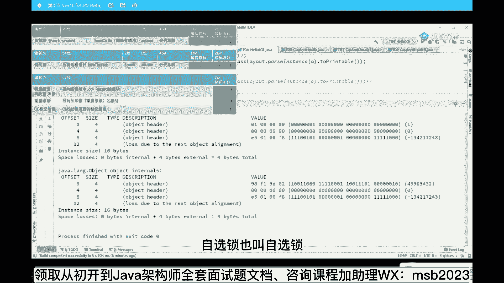

能够升级成重量级这件事情什么时候执行，好好听我说。

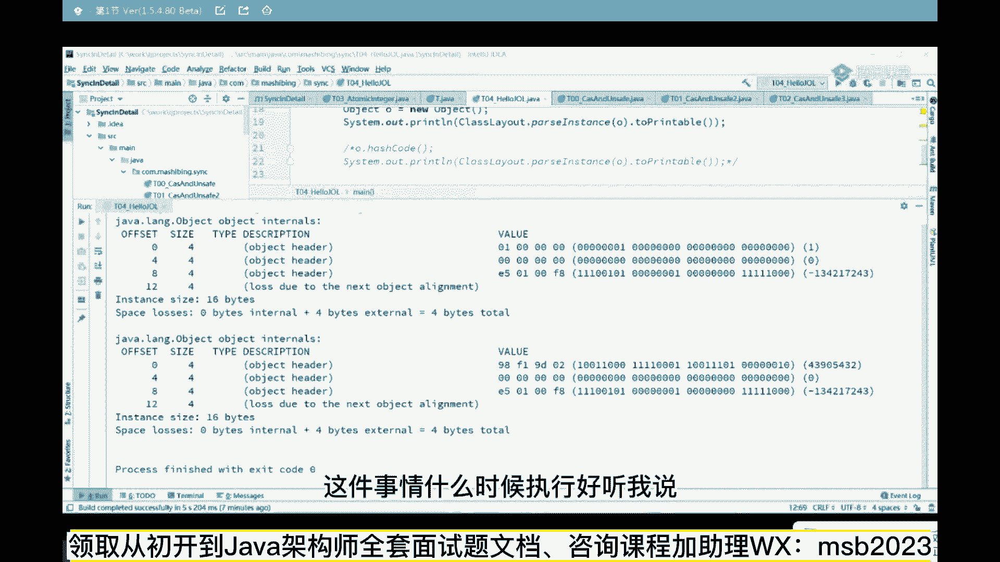

我们先了解概念，然后再了解它什么时候升级，一般来说我们new出一个对象来的时候。

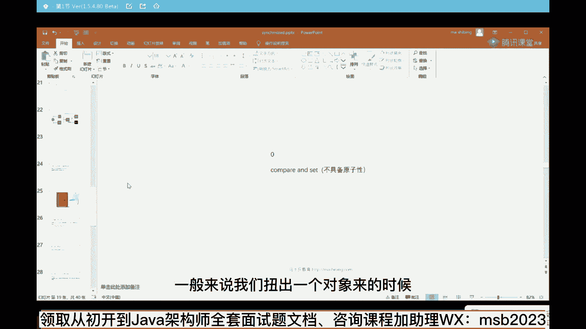

首先优先上的这把锁叫做自旋锁啊，sorry，优先上把锁叫偏向锁啊，偏向锁啊，主要看看你们有没有有没有在认真听讲，最近我好像水逆各方面事儿都不顺，脑子总是晕晕的，我们先来理解啊，什么叫偏向所所谓上锁。

再理解一下，就是我们锁定这个锁，然后进去里面干事，ok这就是上锁的一个概念哈，所谓的上锁，上锁是一个什么概念，最基本的那叫偏向锁，偏向锁的意思就偏向第一个进去干事儿的县城，叫偏向他。

偏向锁的意思是这么来实现的，我们先来看它的具体实现，刚开始我开始扭出这个对象来的时候，他并没有上锁，我要给这个对象上锁的时候，优先上的第一个线程来的时候，优先给他上的是偏向锁。

偏向锁的意思是就是把自己的名字往上一贴，就可以啪叽往上一贴，诶，什么意思呢，比方说养乐多嗯，我看这个养乐多的厕所生意甚好，对啊，养乐多来了，想持有这把锁的话，他并不会去跟其他线程竞争，注意它没有所竞争。

这个过程，这是它效率高的原因，他只是把养乐多这三个字吧唧往厕所门上一贴，养乐多啪叽往上一贴，这把锁归我了，养了多进去干事儿，就是它其实偏向锁，不是一把锁，只是做了一个记录，啪叽往上一扔就可以了，ok。

这就是偏向的概念，有同学可能会说老师能专业点。

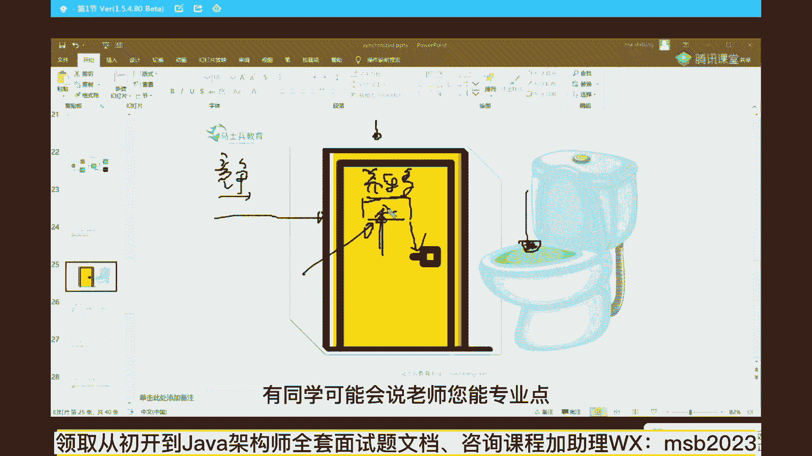

什么叫偏就往上一贴，好专业一点叫做看这图。

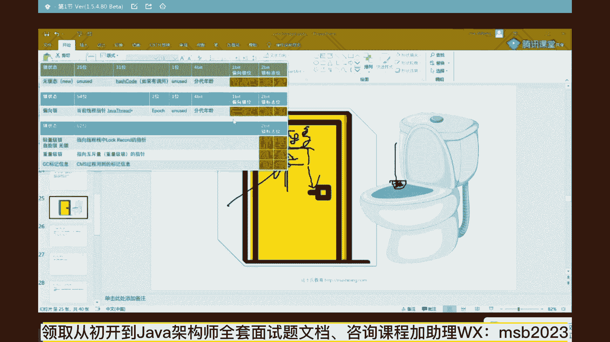

偏向所指的是当前线程，指针被记录在了mark word里面，这个线程来了，养的都来了，把自己这个线程的i d号啪叽往上一贴，贴上去贴成功了，这把锁归我好。

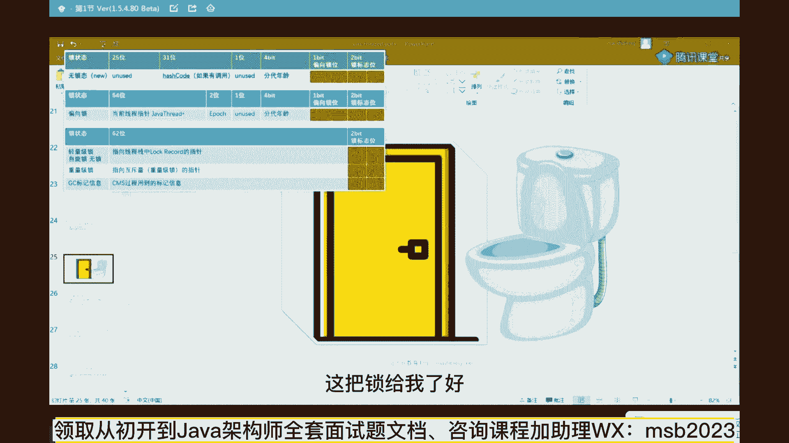

这个叫偏向锁的概念，我再强调一遍，偏向锁，严格来讲不是一把锁，它就是一个标志，这所归我了，有同学可能就会奇怪说，老师为什么会设计这么个东西啊，偏向锁它不是一把锁，就贴了个标志，为什么会有这么一个东西。

偏向锁，我们首先说第一点，它能够提高效率的点在于他不需要所竞争，只需要第一个线程来就给他直接上的偏向，所没有竞争，这个过程没有竞争的过程就少了同步，所以它的效率就会提升，这是第一点，第二点。

为什么要设计偏向锁，这个为什么为什么相对深入一些，为什么要设计偏向锁呢，设计偏向锁的原因在于，同学们，你们想想看，作为大多数的人来说，大多数的时间里头。

即便是你调用了带synchronized的这些方法，也往往只有一个线程在运行它，我再说一遍，这也是根据oracle的一个呃，这个这个这个这个工业级的一个调查吗，就说大多数人在调用同步方法的时候。

调用synchronized方法的时候，70%以上的情形，时间上都是只有一个线程在运行，比如说大家都知道那个vector这个类，hash table这个类，比如说像那个string buffer这个类。

大家都知道这些个类里面都有一些方法，它就是这些方法你就自带了synchronized，那么当你调这些方法的时候，往往其实大多数的时候只有一个线程在运行，那么同学们你们想想看，这百分之七八十的这个时间。

只有一个线程在运行，上了锁的这些方法，我真的有必要去参与竞争吗，我没有必要，如果我不设计这个偏向锁，就会发生一种什么情况，我只要看到synchronized，我就要去竞争，那这个效率显然就变低了。

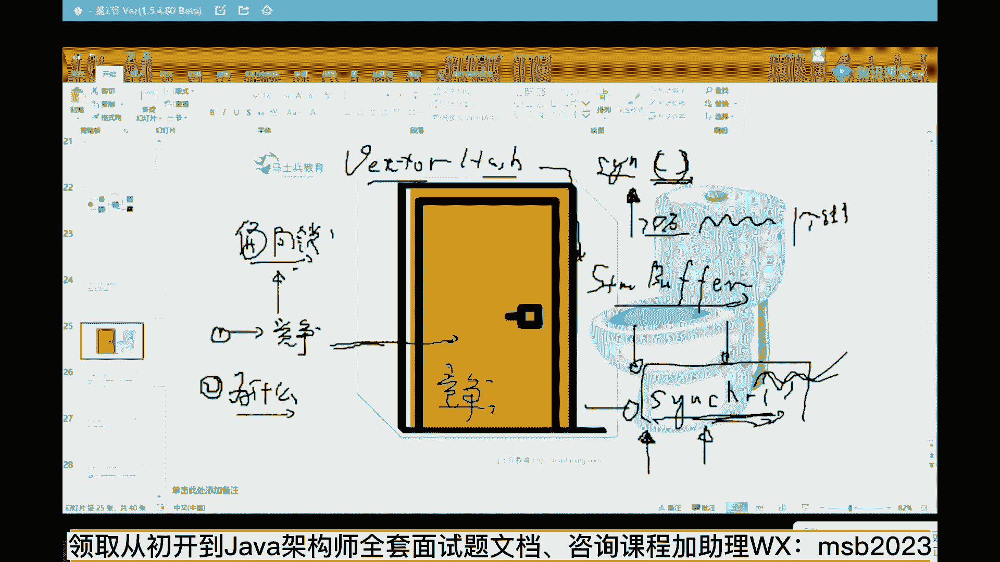

这个理论来能get到的，老师扣个一，就没必要竞争了是吧，我只有一个人，多数情况下只有我一个人，那我干嘛要竞争，我就直接往上一贴就可以了，开局往上一贴都可以，这只归我了，当然如果这时候来了第二个人呢。

我第二个人是不是不能够说我也往上一贴啊，这是我们俩进去一块的同事，你坐半边，我坐半边，这肯定是不行的，好听我说，这个时候如果第二声来了怎么办，所升级升级为什么升级为轻量级，这个轻量级叫自旋锁，叫自旋锁。

ok这个自旋锁的意思就是大家伙一块抢，转着圈的抢，这什么意思呢，当然这里面有个小小的细节，比如说刚开始是养乐多，然后接下来呢养乐多是吧，哎他占有这把偏向锁啊，然后后来又来了一个张瑞。

后来了一个来了一个叫我看还有谁，腾讯嗯，后来又来了叫藤君的这哥俩来了，说哥们儿你不能独占，我也要干事，k我要抢，我要抢这把锁，好抢的时候怎么办，怎么抢，首先进行锁升级。

就是把这个养乐这仨字啪叽给我撕下来，先把它撕下来，撕下来之后，我们哥仨来竞争，当然这个时候竞争优先的还是养乐多持有啊，这个是一个小细节，我们先忽略它，大家记住学任何东西的时候，应该先学脉络和梗概。

再去抠里面的细节，所以我一般我会先给你介绍清楚，这些最基本的概念之后，我们再来聊这些概念里面的一些小小的细节，再聊，ok这个时候就已经不再是偏向锁了，这时候就已经变成自旋锁了，那自旋锁是一个竞争过程。

是一把竞争锁，怎么竞争啊，就是我们两个，你两个都在里边干事的时候，我张睿和唐军两个人提着裤子在旁边转圈，转一圈，我就问一下哥们儿，你张你那个养乐多，你出来了没有啊，你出来了没有啊，你出来了没有啊。

好你一旦出来了之后，我张睿和唐军看看我们哥俩谁能抢到，所谓的强调就是通过一个cs操作，想办法把自己的线程id往上贴，就这意思，好嘞，再来回顾一下这个概念，这个概念就是自旋锁的概念。

就是哎哥俩或者哥仨或者哥几个，随便的大家伙抢这个，抢着把所有操作用一个自旋的操作，我不需要通过操作系统来帮我调度，用一个自旋操作，接下来谁抢到了这把锁就算谁了，谁就进去干事去，ok这个是自选的概念。

就是看看谁能够把我自己的这个id号给贴上去，谁贴上去就算谁的，hello，同学们来能get到这点，同学来扣个一，可重入锁跟自旋锁两个概念，不是这个意思，这里面我相信大家会有好多好多的疑问，别着急。

我先把概念给你讲完，咱们再来聊聊这个疑问，那现在问题就在于好，这是自旋锁，我知道了，那自旋锁什么时候会升级成重量级锁呢，什么时候成重量级呢，自选组在某一些特定的状态下会生成重量级。

你首先要理解什么叫重量级，什么叫自选，这里头有好多好多的面试题，我们先了解重量级和自选的一个区别，其实我刚才已经讲过了，自旋是发生在用户空间的，他不需要经过操作系统对我线程的调度，那有同学可能会说。

老师这个操作系统线程的调度，它主要体现在哪些方面呢，所有同学认真听，一般来讲，只要你调用了什么weight方法，调用什么notify好，这一类的时候，它就已经进入到重量级状态了。

重量级状态是一个什么状态呢，这把锁，附着着一个队列，这个队列的专业叫法叫weight set，不管它叫什么，总而言之，这里面的线程都得给我进去排队，他不用抢，你给我排队，排好了，等着我操作系统调度。

你到你了，你给我出来，唐军，你给我出来到你了，养乐多，你给我出来到你了，ok这种操作一般是叫一个等待队列，我不知道大家发现区别了没有，等待队列，区别就在于一个线程过来的时候，如果是自旋锁的状态。

它会拎着裤子转圈，它不会进入等待队列，这叫盲等待，跟那不停的转圈转圈转圈，刀也没有刀，也没有刀，没有刀，没有抢，大家伙不排队进去抢好，第二个是进入等待队列，等着我背，等着我叫你。

它的最重要的区别在于自旋所消耗cpu资源，而重量，你所这部分线程在你等待的时候，不需要消耗cpu资源，再说一遍，自旋锁和重量级所最重要的区别，自旋锁在等待的时候消耗cpu。

而重量级所在等待的时候不消耗cpu，所以有一道面试题是这么问的。

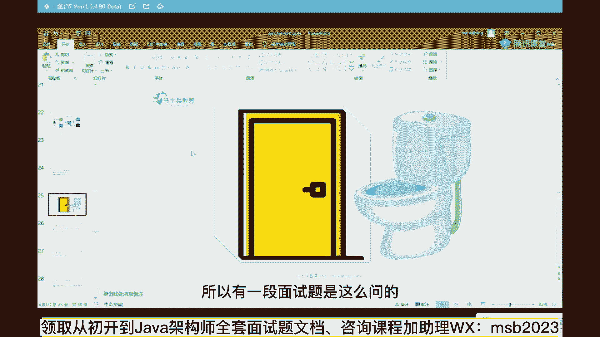

看这道面试题，大家是不是能答得出来。

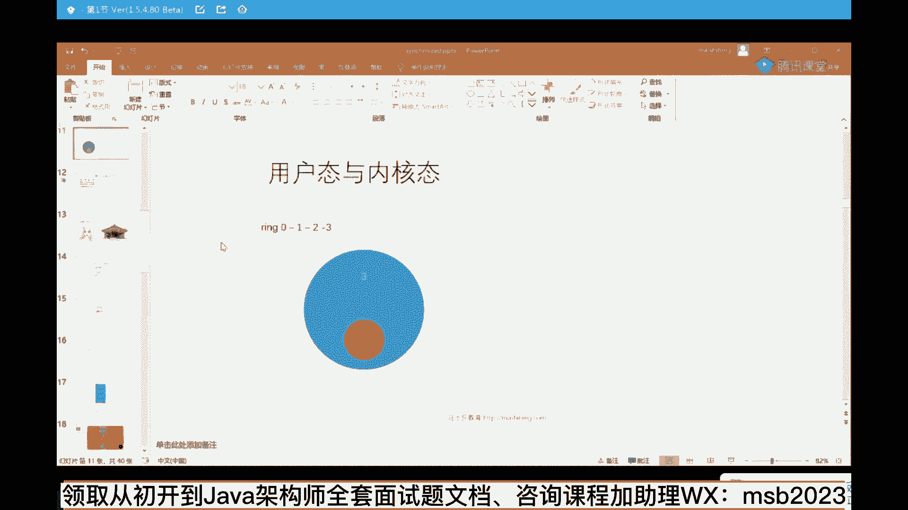

看这里自选组一定比重量级锁的效率高吗，往往有现在有好多人就这么问吗，他他就老老有一种这种说法，说我用j u c的新锁，就一定要比snronized的效率高，no不一定。

凡是说一定的百分之百的这一类的问题，他的回答的一定是不一定不会是百分百，没有绝对的东西，唯一绝对的事情就是没有绝对的东西，自旋锁，你同学们，你们呢大腿想一想，如果只有两三个人在这儿等着上厕所。

然后又赶上每个人都不是很便秘，执行的时间非常短，那我转两圈我就能进去干事了，转两圈，我另外一个人进去干事了，哎挺好very good，很好很好，我就能抢到，抢到时间片了，哎这个挺好的，效率很高。

可是同学们，你们想一下，假如有一个人问养乐多，特别便秘，养乐多没喝，今天结果便秘执行的时间非常长，然后在里边转圈，永远永远执行不完，甚至有阻塞操作，然后呢，旁边有1万个县城在旁边等着。

1万个人拎着裤子在旁边转圈，哈哈整个的cpu的完全消耗在转圈上了，完全消耗在线能切换上了，切换过来之后，我发现我靠还是不行，还没那么多锁，所以这个效率显然很低很低，咱们在这种状态下，你应该进入重量级所。

好这道题是不是解释清楚，好那同学们接下来我们来想想看啊，有一个当然细节上的东西，这种题呢现在问的越来越少了，就是这种细节呢你听过就知道了，没听过就不知道，所以这个就没啥意思，体现不出水平来。

有时候他问原理是能体现出水平，你能你能够了解底层的原理的实现，像这种时候呢就能知道你的理论水平，但是像有一些特别细节的，你比如说自选所什么时候升重量级，四选组啥时候升中了，你组什么时候啊。

像这种的实现呢就特别无聊，我就告诉你，直接告诉你结论就行了，在这里面呢它中间有一个优化过程，看这里。

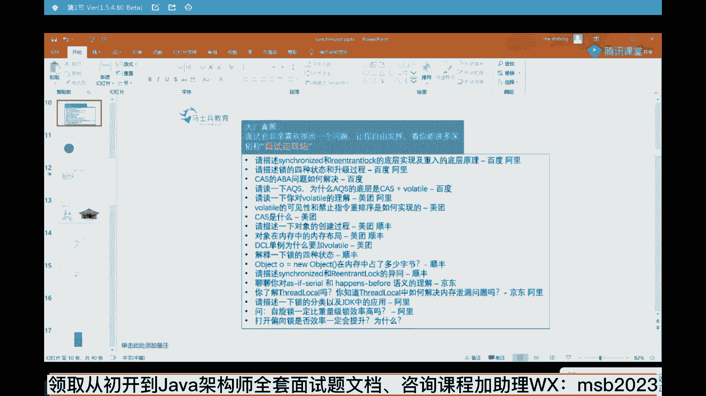

就是我的自选组也要称量，你所什么时候射中了女所呢。

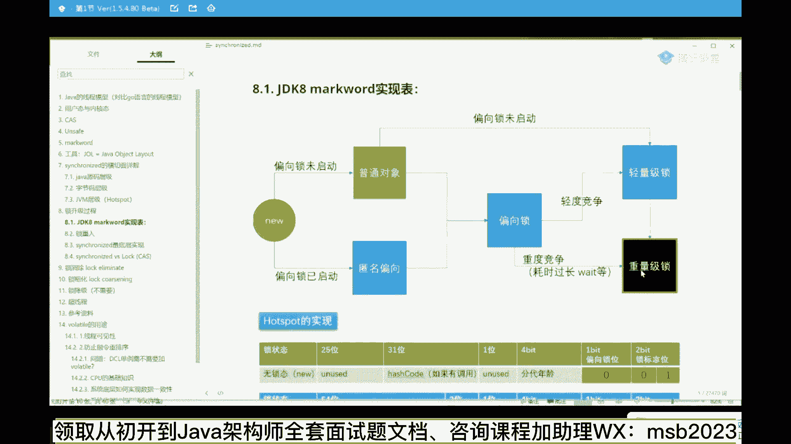

听我说这个呢。

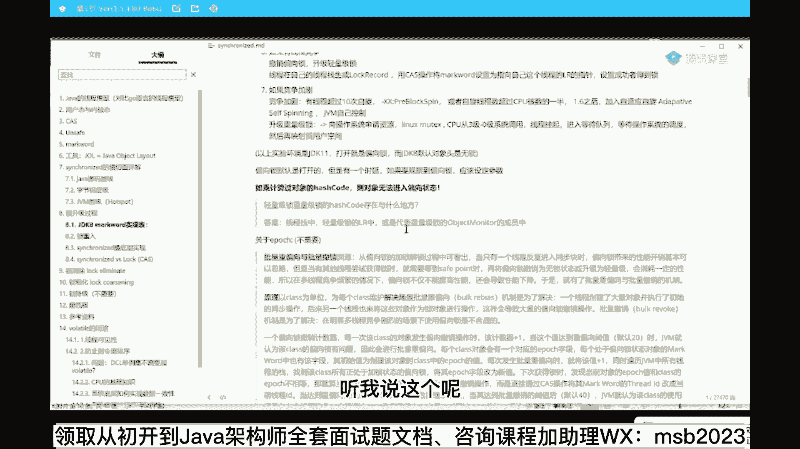

如果这么体贴的人，我当然给你记录下来了，原来的1。6之前，jdk一点六之前叫有线程超过十次，自选转圈转了十次都轮不上他，你懂吗，就大家伙竞争太激烈了，有有哥们儿转圈转了十次都轮不上呢。

那说明好多好多线程在竞争了好，这个时候麻烦进入重量级或者自旋的线程数，超过cpu合适的一半，如果有八核，有四个线程在这等着哎，进入重量级，当然这些细节叫j v m的调优。

jm调优你可以参考的参数有700多个，所以为什么这vm调优比较值钱，那是另外另外一门课，我们先不去管它，不过很幸运的是，目前这种参数不需要你调整了，因为1。6之后加入了自适应自旋。

叫adaptive self spinning，adjective，自适用的self spinning，自适应自旋，adaptive self spinning，我可以动态调整jm自己来控制jvm。

来决定有多少个线程跟他转了多少圈，我会升级成重量级锁，这个事不需要你去操作了。

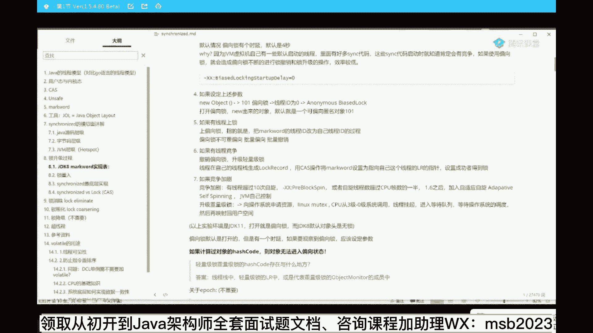

ok这是自旋锁，什么时候升重量级锁，这个过程不知道大家get到了没，来get到的，给老师扣个一好。

这几个概念我相信我解释清楚，我们一会儿再来看这些细节，new出来的时候，一个普通对象，然后或者匿名偏向一会我们讲，然后优先会上偏向偏向左，第一个线程上偏向锁，接下来如果有轻度竞争的话，上轻量级。

如果有重度竞争，就直接干成重量级锁，轻量级和重量级的区别，自旋锁清重量级所区别，刚才我好好的已经讲完了，面试的时候你应该能说得出来了。

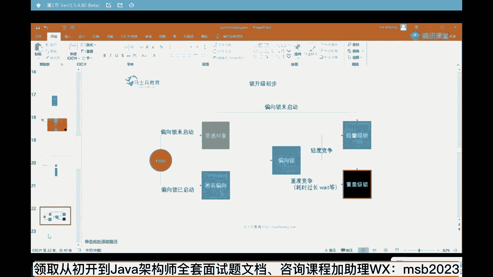

锁升级是通过什么实践的，陈雅兄大哥，你如果这个过程的话。

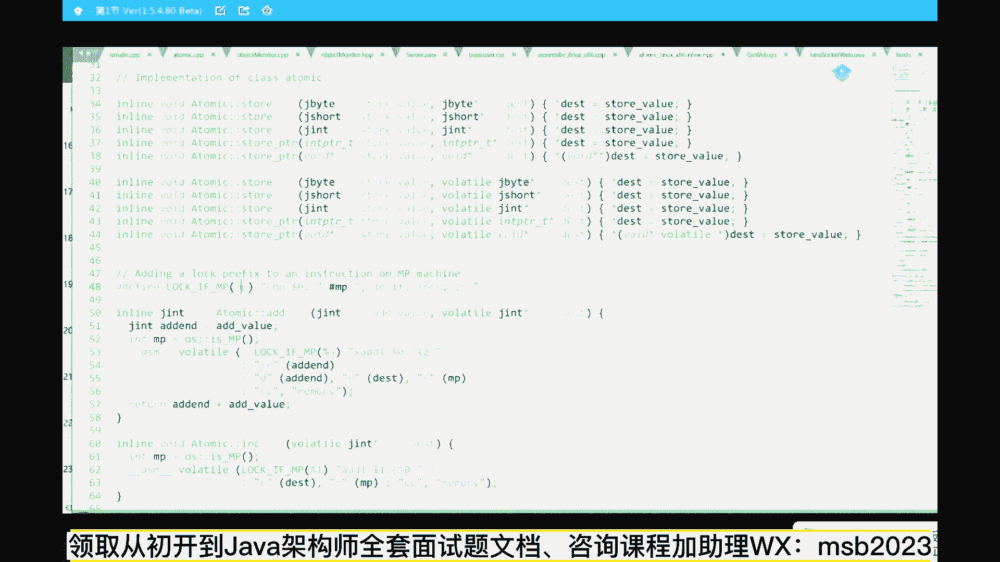

其实我笔记里给你写了。

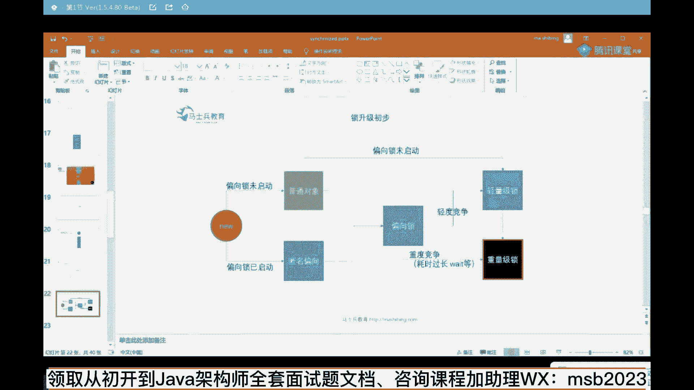

在这个过程特别琐碎和琐碎，和那个那个那个那个那个复杂。

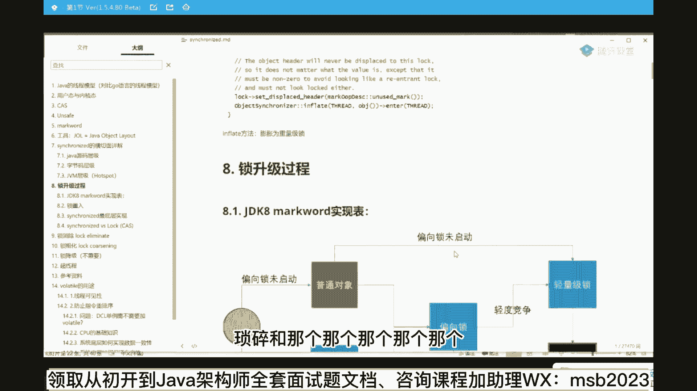

我还是那句话，因为大多数的同学呢他的基础不具备。

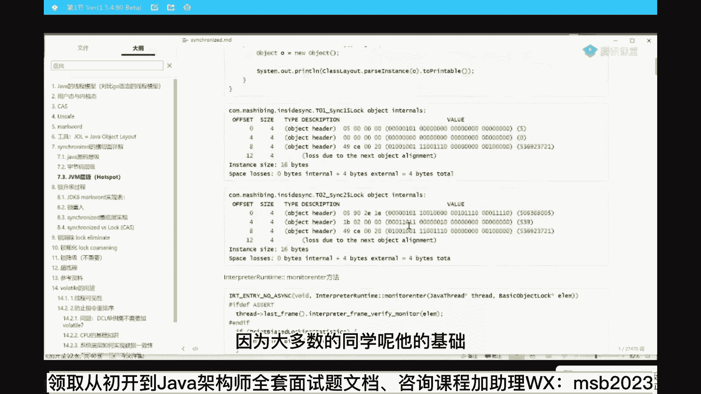

所以呢呃如果你你你自己水平比较高。

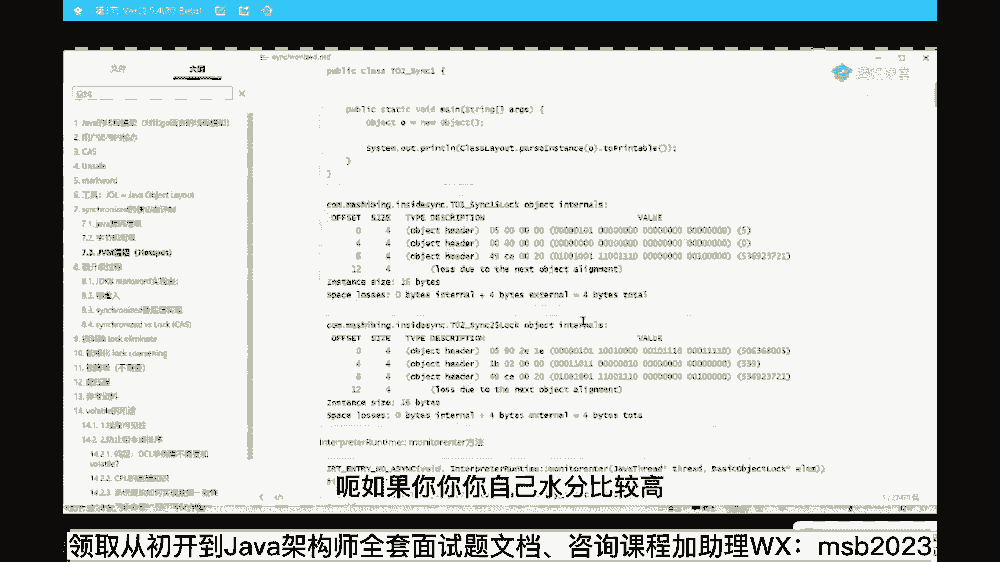

我建议你读什么呢，读这个方法叫interpreter，run time monitor enter方法，这个呢是那个hospital里面的模板类的实现，模板解释器的一个实现啊。

interpret runtime monitor enter方法，这里面有一个详细的锁升级的过程，这个锁升级过程呢基本上体现在两个方法里面，一个方法叫fast enter。

这个方法呢是快速的自旋的这样一个实现，还有一个方法叫slow enter，slow enter，是重量级的底层的操作系统级别的一个实现，所以呃像呃这类内容，你可以去读这个里面呢解释的非常的清楚。

什么情况下他会有自选，什么情况下会有偏向，是这么一个过程，如果我想详细讲的话，你看啊，if如果是说有自旋的情况，看这里，use best locking，这叫偏向锁吗，biased locking。

best叫偏向的意思，如果使用了偏向锁，你应该进入fenter，如果没使用偏向锁，进入进入slow enter等等，去读这个过程，这个过程在这我就不详细解释了。

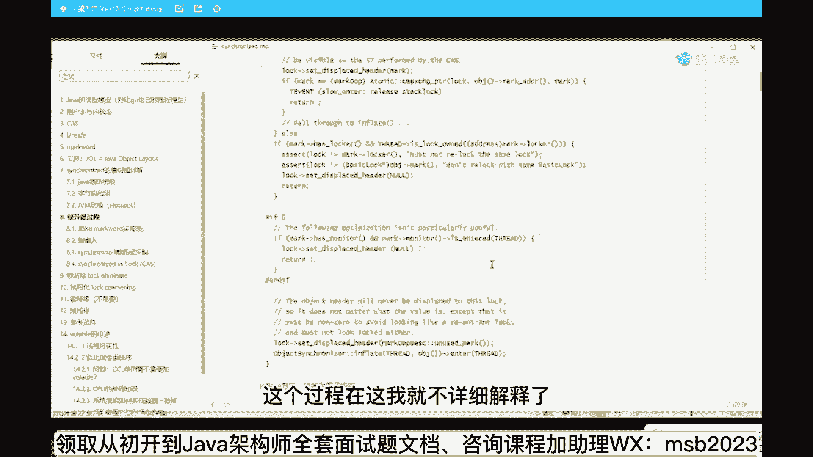

好大家看这里。

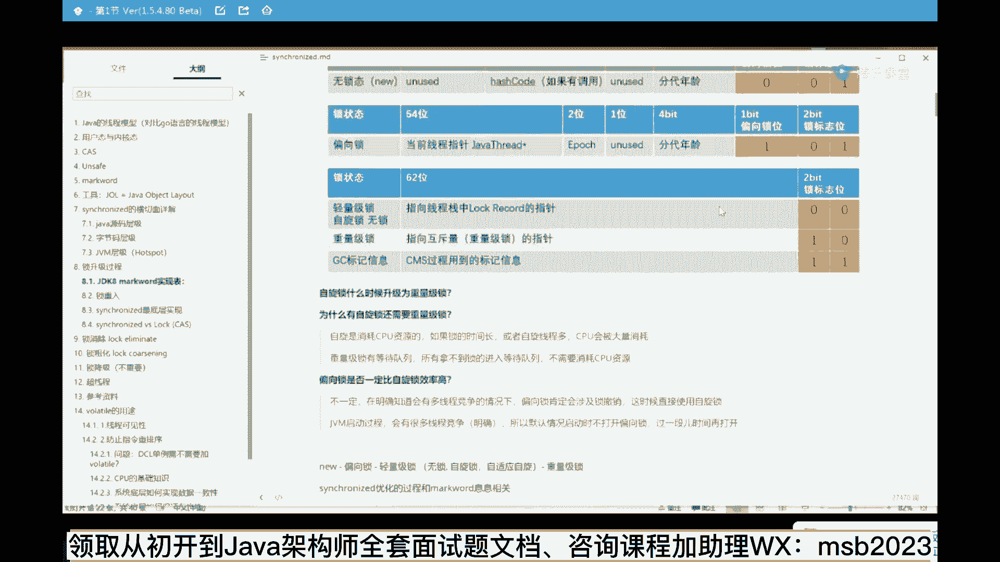

呃还能跟上吗，能跟上的，给老师扣个一来。

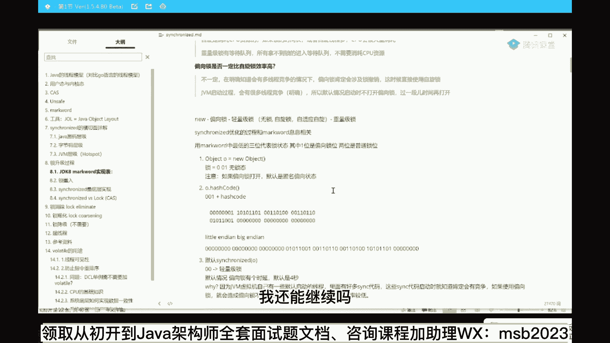