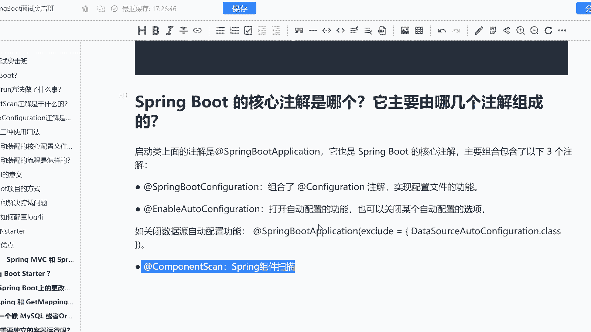

# 马士兵教育MCA架构师课程 - P172：Spring Boot 的核心注解是哪个？它主要由哪几个注解组成的？ - 马士兵学堂 - BV1RY4y1Q7DL

是来自于阿里的一道面试题啊。然后呢首先第一个它它题目是什么呢？是spring boot它的核心注解是哪个？然后呢，主要由哪几个注解去组成。而这道题主要考察的是什么呢？

主要考察的是你对于spring boot源码的一个理解啊。对应的一个就是薪资范围是15K到20K的一个区间。然后岗位呢是终极java开发工程师。

那么各位同学首先我们要考虑清楚它有哪几个就是它的核心注解是哪哪几个，我们来看一下啊，它的核心注解实际上是我们的spring boot application注解，这也是它启动器上面唯一一个注解啊。

O同时它是spring boot的核心注解。而这个注解呢，其实它一共包含了7个注解。但这7个注解当中有4个注解，是原注解。所以意味着它的核心注解，只有3个。那么这三个核心注解。

首先是spring boot configurationration。实际上我们听名字也能够去讲到spring boot。configuration实际上它肯定是封装了configuration注解的。

而configuration是实现当前内为配置类的这样的一个注解。也就是说实现了配置文件的一个功能。还有第二个注解呢是enable auto configurationration注解。

它打开了自动装配的这样的一个功能。同时呢它也可以去干嘛关闭某个自动配置的一个选项。同时请各位注意啊，它里面核心的起作用的注解叫import注解啊，O比如我要关闭某个数据源。

那么我就spring boot application，我直接去排除掉我们的da source configuration。最后呢是一个compcompment scanner这样的一个注解。

它是扫描注解啊。如果说我们没有做任何的配置，那么它会扫描当前类以及其子类，但是如果当我配置了之后，它就会去扫描配置相关的。比如说我在这里我直接加个括号com点码士兵。

那么这个时候它就会去扫描com点码士兵下面的一个东西啊。

那么这是我们的spring boot的一个核心注解。