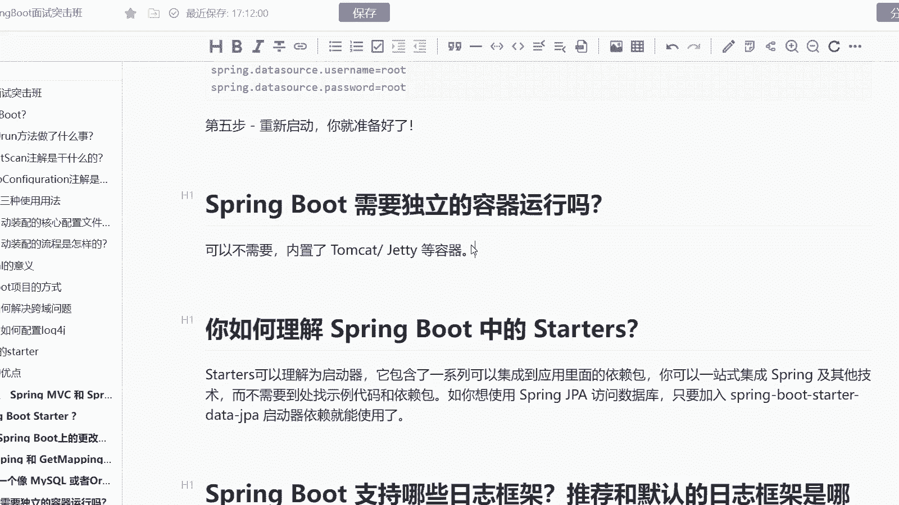
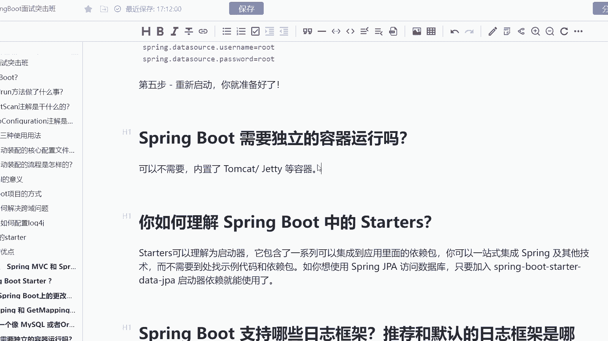
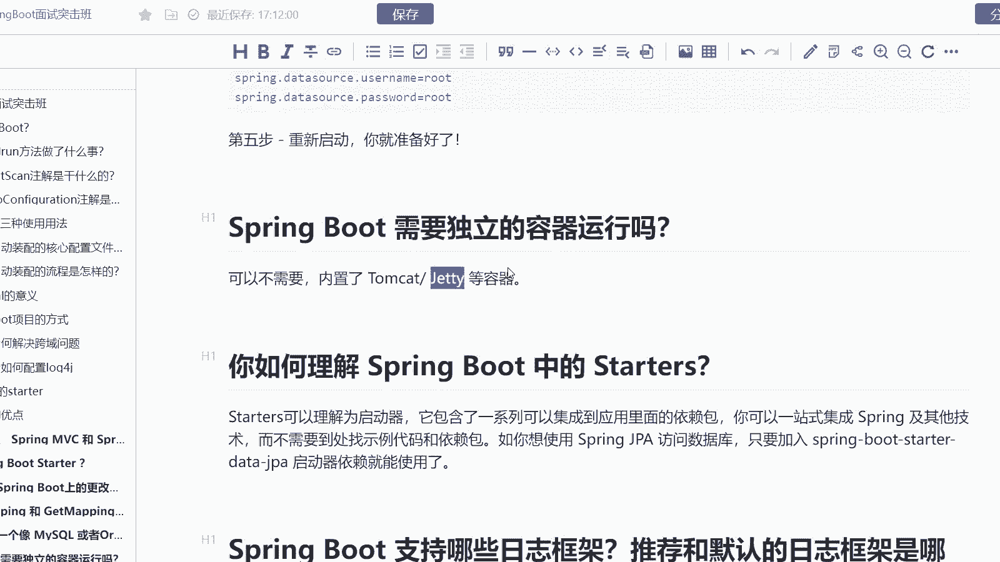
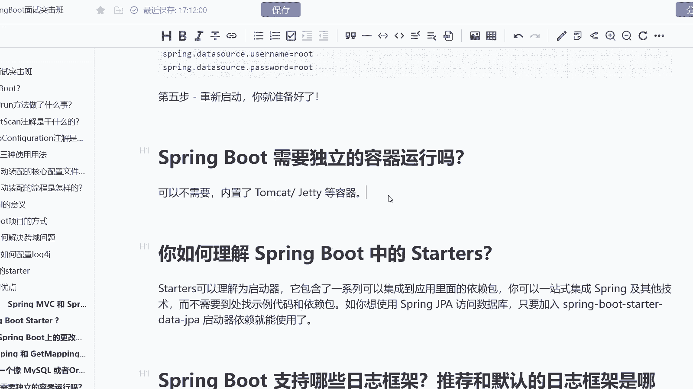
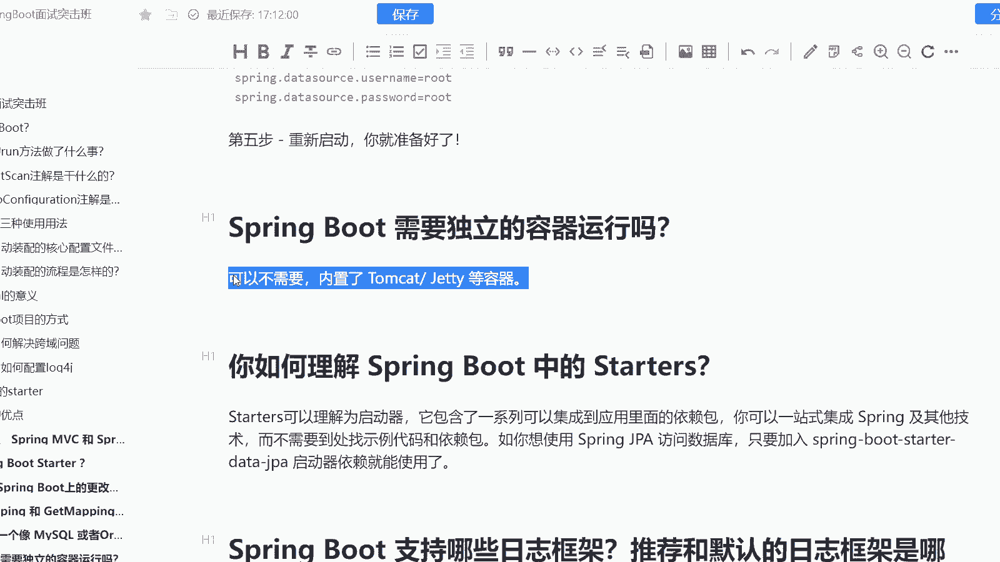
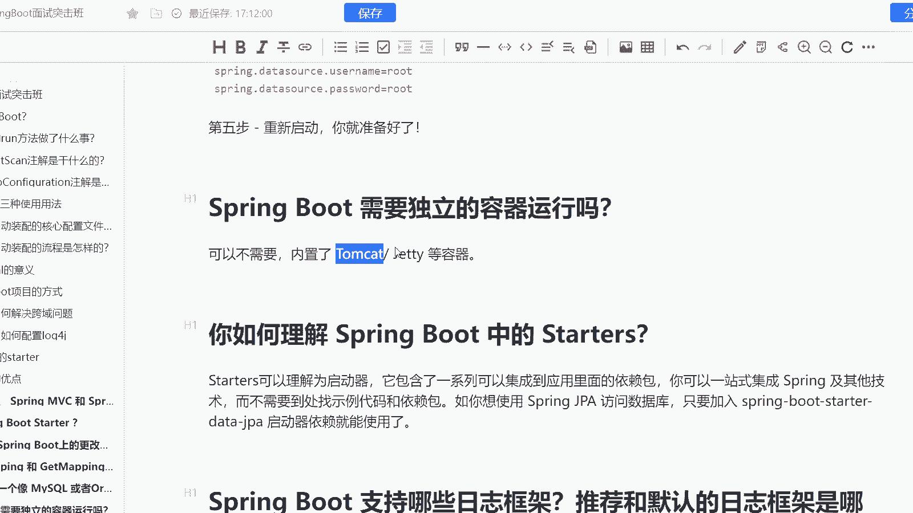
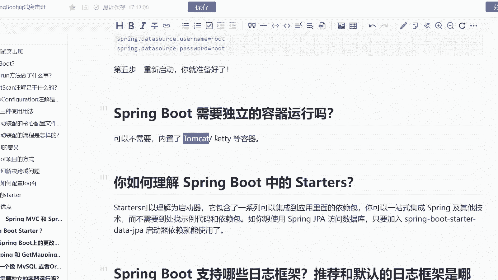
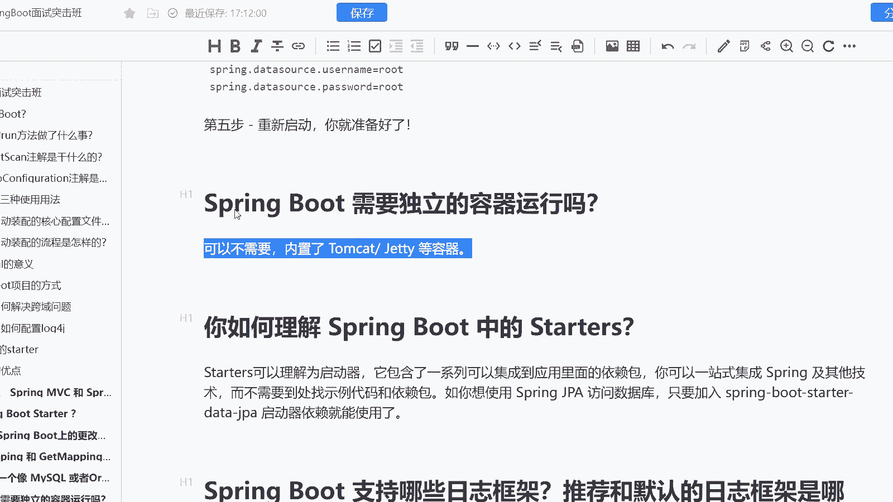

# 马士兵教育MCA架构师课程 - P175：Spring Boot 需要独立的容器运行吗？ - 马士兵学堂 - BV1RY4y1Q7DL

是来自于阿里巴巴的一道面试题啊，是阿里巴巴秋招的一道面试题说sring boot需要独立的容器来运行吗？而面这个面试题其实考察的是什么呢？是你对于sring boot内嵌容器的一个理解啊。

对应的岗位是中级java开发工程师薪资是15到20K这样的一个范畴啊，那么这道题呢，首先它关注的是什么东西呢？首先关注的是你明不明白就是说sring boot它是有内嵌容器的。

那么呢首先我们可以来看一下，我们是不需要独立的容器去进行运行的。首先第一个它内置了tca等等相关的一些容器。可以让你比如说在我们的一个编译器当中就去进行一个代码的运行。而tca呢可以让你直接打成架包。

然后呢使用我们内嵌的tca去进行运行。实际上内嵌的ca啊，它的本质跟我们的就是它的之前用外嵌的ca一样啊。

他也是通过一个s对象调用serv对象的一个star方法来去启动我们tca的区别是什么呢？我初始化呃，我们的一个服务的过程当中，我不需要像以前对吧？使用容器的时候去初始化我们的serv点叉文件了。

我各种get就能直接去完成我的初始化。这是我们spring boot内嵌容器比较核心的一点啊，O。

