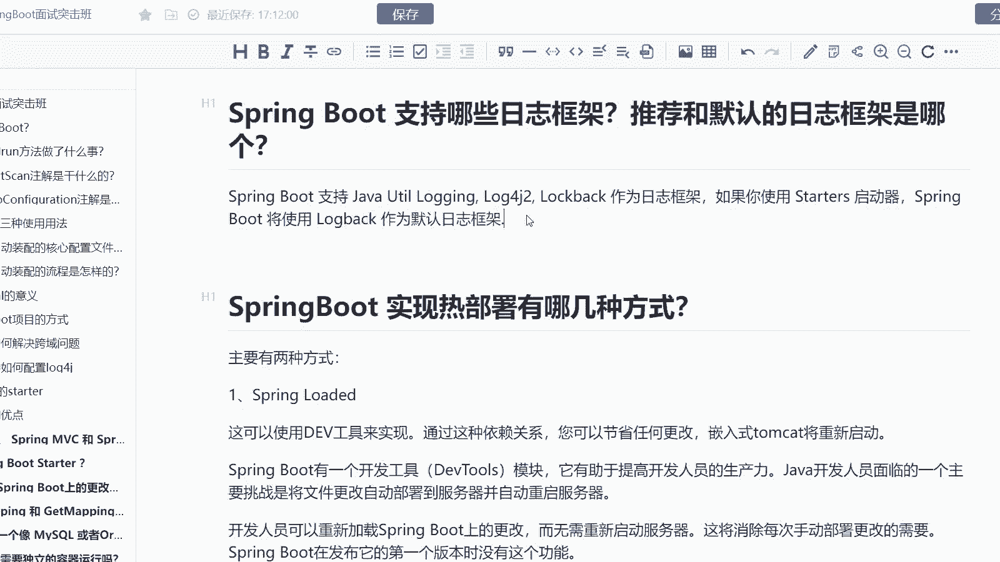

# 系列 6：P177：Spring Boot 支持哪些日志框架？推荐和默认的日志框架是哪个？ - 马士兵学堂 - BV1RY4y1Q7DL

来自于艾9月份的一道面试题啊，spring boot支持哪些日志框架推荐和默认的日志框架到底是哪一个呢？而这道题呢主要考察的是你对于日志框架的一个理解啊。

那么呃我们这道题呢是针对于中级java开发工程师的这样的一个岗位，对应的薪资呢是15到20K这样的一个区间，所以我们来看一下。

首先第一个spring boot它是支持java YouTube当中的一个log的。就相当于比如说你平时在那当中写就是说把日志打log，实际上用的就是这个log啊。

同时它还支持log for j two这样的一个框架以及log back作为我们的日志框架。如果你使用star作为启动器的话，那spring boot将默认使用log back作为默认的日志框架。

这所以如果当你需要引入到这样的一些日志框架的时候，你需要把这个log back得给排除掉，不然的话会冲突的啊。那么这是。

我们这道题。