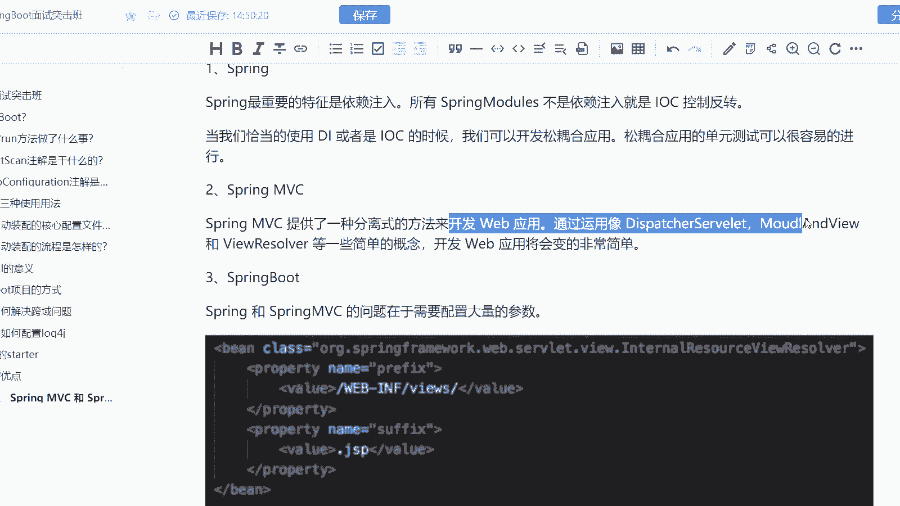
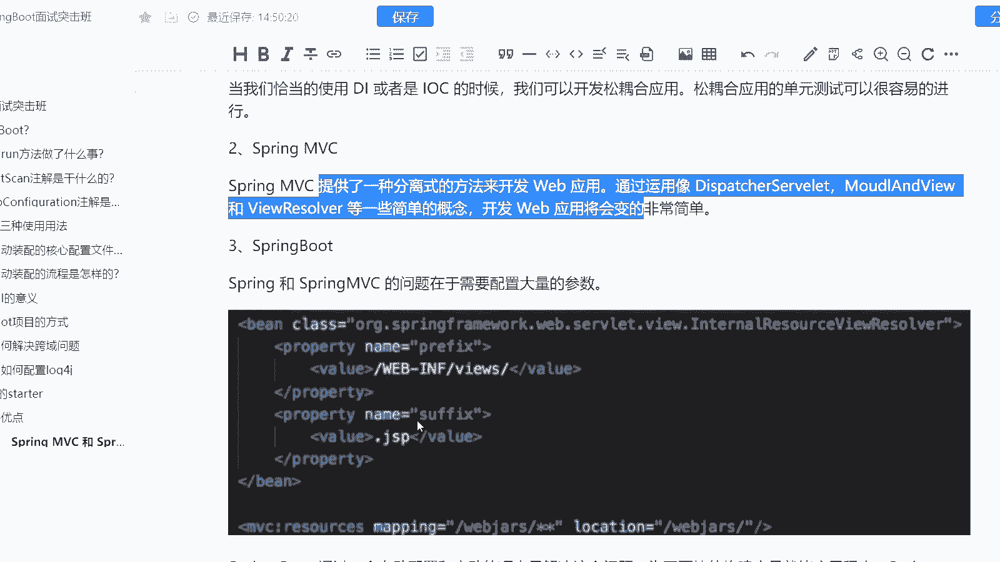
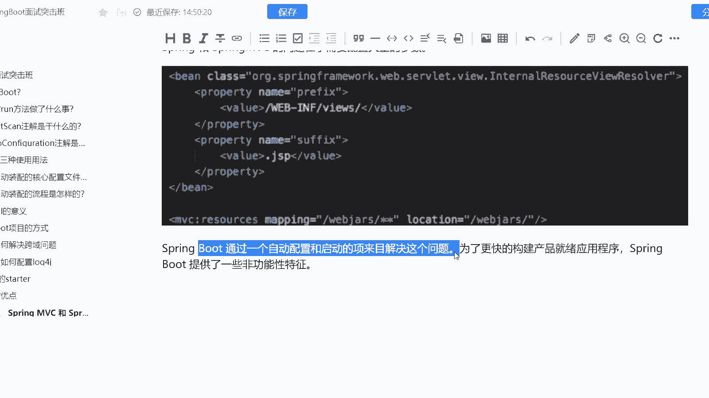
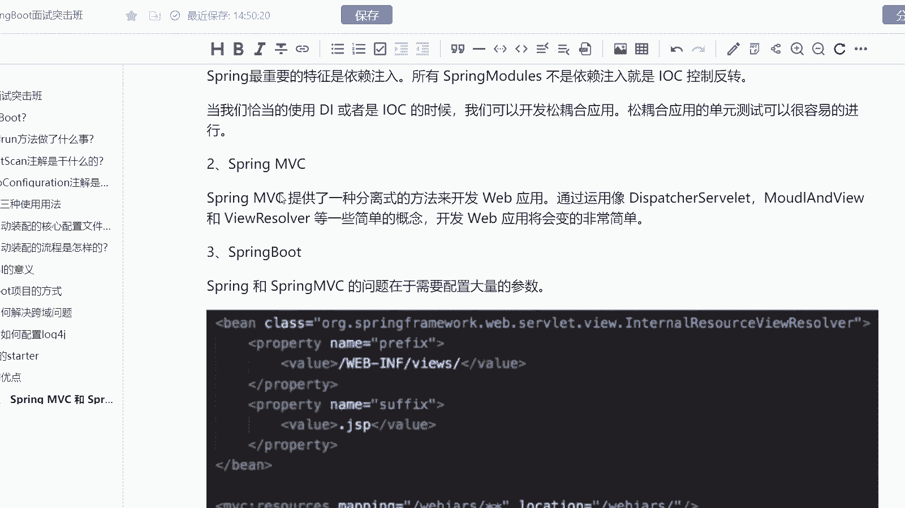
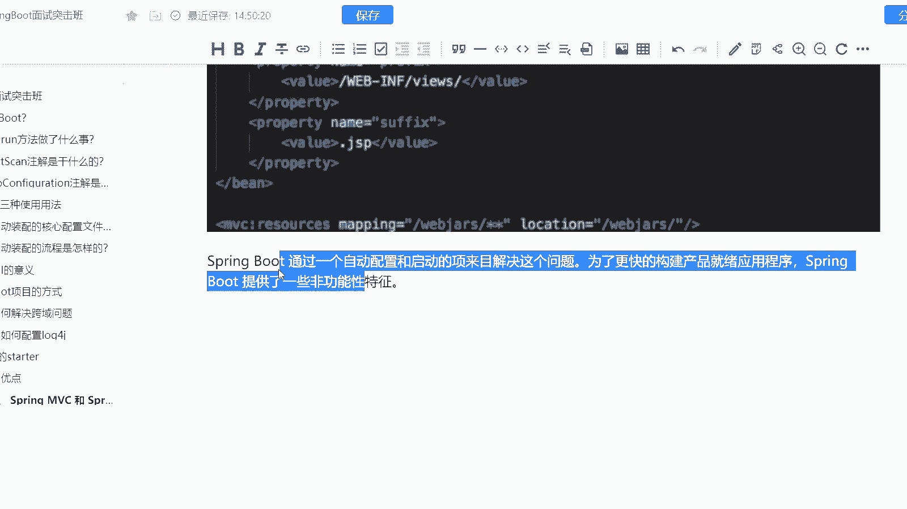
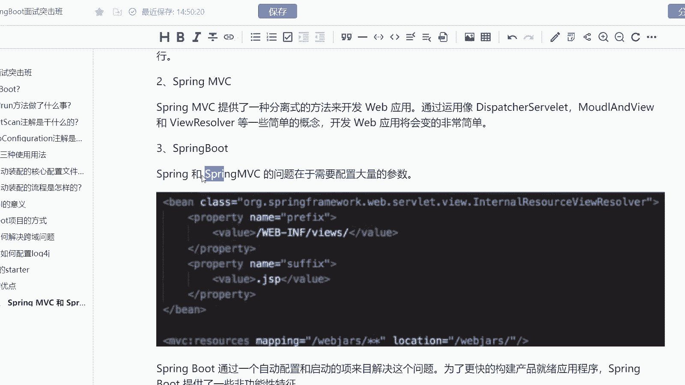
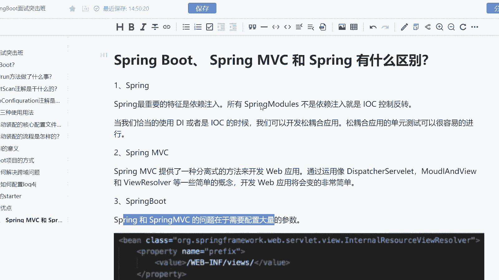

# 马士兵教育MCA架构师课程 - P178：Spring Boot、Spring MVC 和 Spring 有什么区别？ - 马士兵学堂 - BV1RY4y1Q7DL

这是一道来自于阿里的一个9月份的面试题啊。然后呢这道面试题嗯题目是spring bootring mVC跟spring有什么区别？

这道题呢所对应的一个岗位是中高级java开发工程师对应的薪资呢是15到25K而这个区别，其实很多同学啊它也会有一个疑问。他说老师spring boot跟ring mVC到底有怎样的一个区别。

所以我们来看一看啊，首先我们来聊spring它最重要的一个特征是什么呢？是依赖注入，包括所有的thring model不是依赖注入，就是IOC的一个控制反转。

所以其实我们都知道spring的特性ICLPDI对吧？这是它的三大特性啊，当我们恰当的使用DI或者IOC的时候，其实我们可以开发松耦合的一个应用，松耦合的单元测试可以很容易的去进行一个进行，对吧？

而MVC呢它则是另外一种方式，它可以通过一些工具像什么。dispatch或者说model and view或者view resolve这样的一些概念。然后呢来提供一种分离式的开发，来开发我们的we应用。

使得开发外应用呢会变得非常的简单。而spring跟spring mVC它有一个问题啊，什么问题呢？就是我所有的一个并或者说我所有的一些配置，它都会需要有大量的一些参数。

比如说我要提供它的属性n and tape，包括我要提供当前的一个值是什么，对吧？我才能去进行。那么这个时候呢，我们spring boot，它就干的一件事情，什么事情呢？

它通过了一个自动配置的方式来解决这个问题，我把你预先要加载的内容，我先加到我们的内存当中去。

那么这是为了更快的去构建应用，就相当于什么呢？就相当于。

反正我每个病是不是我都要去进行一个A操作B操作C操作，那我干嘛不直接在内存当中把我这些操作给干了呢？对吧？所以这是它更快能够更快的构建应用的一个原因。

包括也会有一个非常就是说好的名词啊来形容它叫做约定优于配置，或者约定大于配置，我提前帮你干了，是高过于你自己配置的，是这个意是这个意思啊，所以spring boot提供了一些非功能性的特征。

包括像什么readies啊MQ啊，我们都可以通过spring boot的一个候选配置condition来进行一个集成啊，O这是spring boot跟spring mVC还有spring的一个区别。

