# 马士兵教育MCA架构师课程 - P179：SpringBoot 中的监视器是什么呢 - 马士兵学堂 - BV1RY4y1Q7DL

这是一道来自于阿里6月份的一道面试题啊，说是spring boot中它的一个监视器是什么呢？OK这道题主要考察的是你对于spring boot的它的一个监听器，它的监视器的一个就是理解啊。

这道面试题在面试高级java开发工程师的时候会问到。然后呢对应的薪资区间是25K到40K这样的一个区间。那么我们来看一下，首先spring boot当中监听器它是监视器，它是什么呢？

而我们的监视器是spring boot。

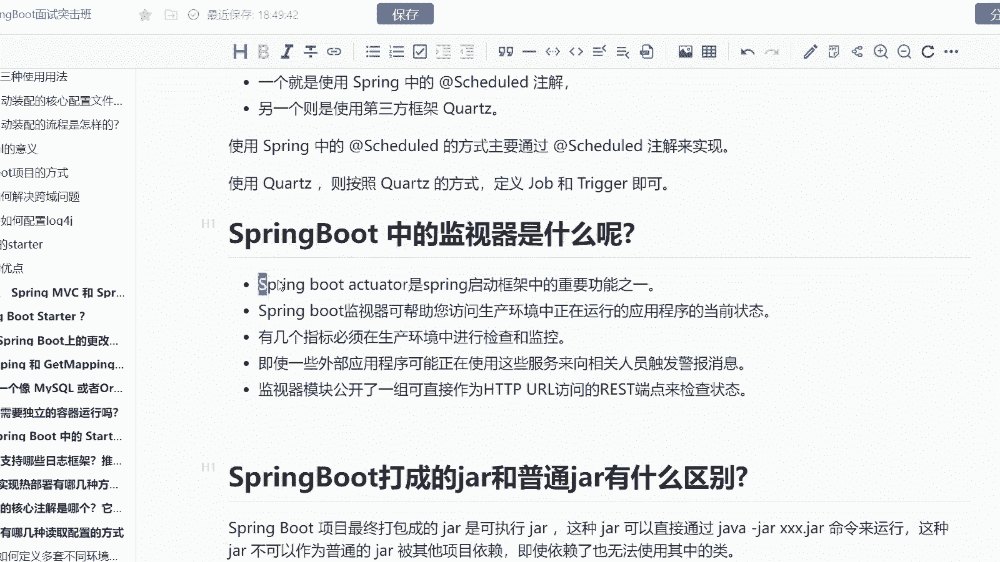

然后呢它是spring启动框架当中重要的一个功能之一，因为它是可以去完成你全程的一个监视的啊。spring boot的监视器可以帮你访问到生产环境中正在运行的应用程序的当前状态。

也就是说可以帮你实时监听。而且有几个指标必须在生产环境中进行检查和监控的情况下，你就可以使用到我们的一个呃我们的这样的一个监视器啊。而且如果有一些外部应用。

可能正在使用这些服务的一个呃像相关人员触发警报信息，啥意思啊？就是假设我有一些第三方的一个程序。而这个第三方的程序很可能就是实现了我们的一个thring boot的监视器来实现的监听我们的应用程序。

所以说这个时候如果你没有开放这样的一个接口，它是没有办法监控的啊，并且监视器的一个模块公开了一组可以作为HTTPURL访问的res的端点来检查当前每个节点的一个状态。啥意思呢？

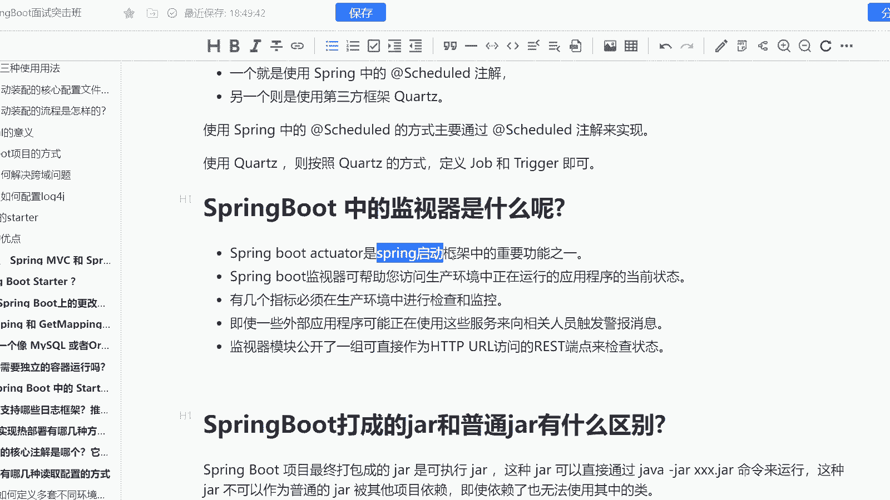

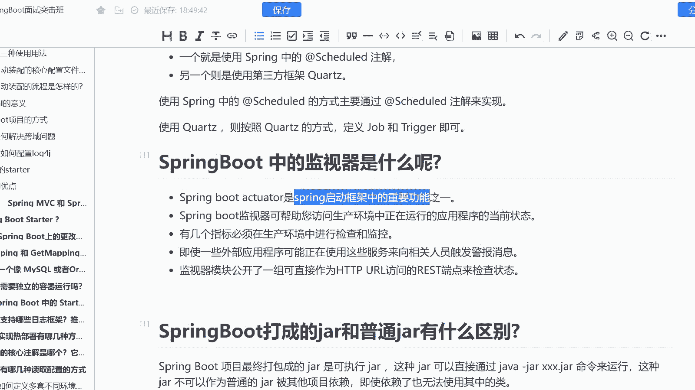

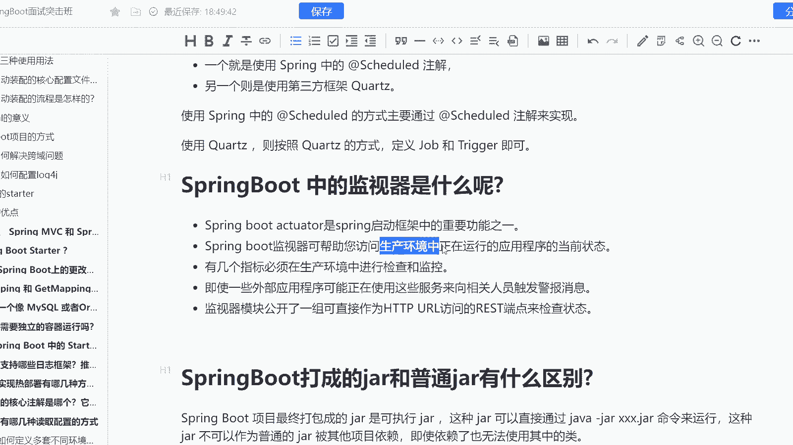

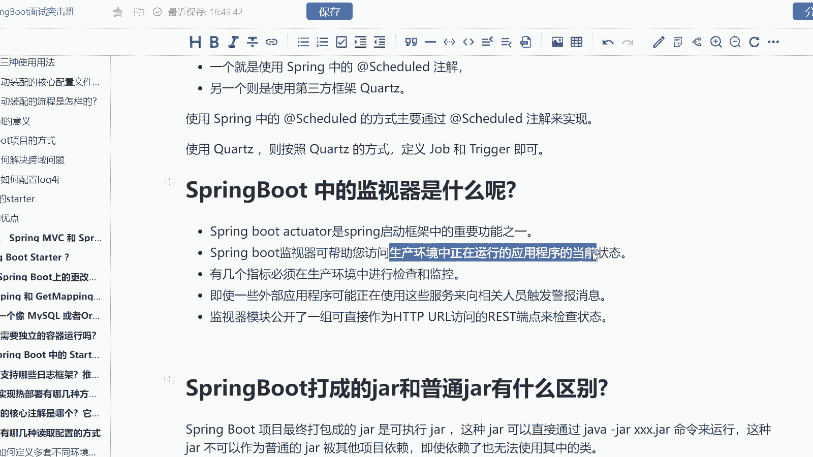

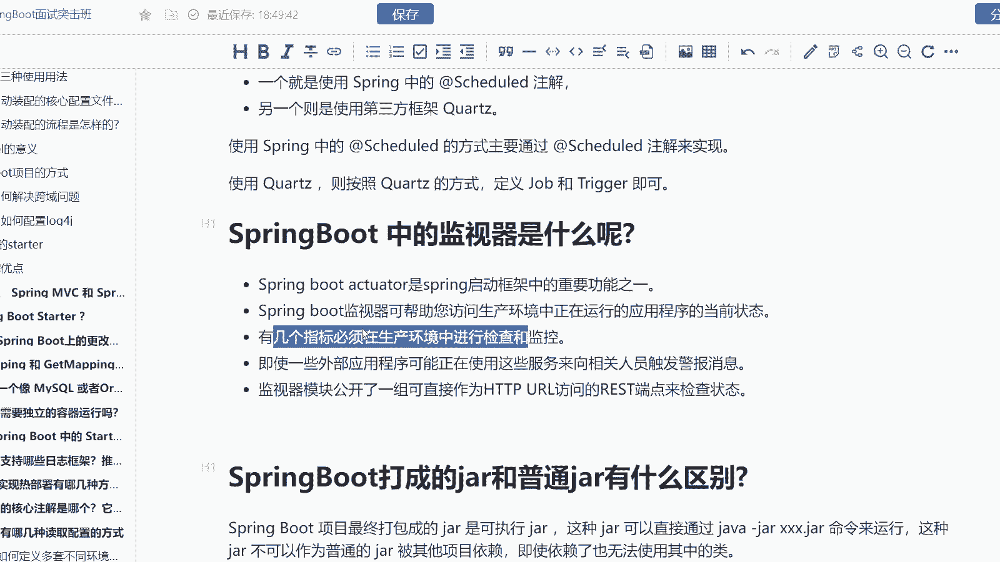

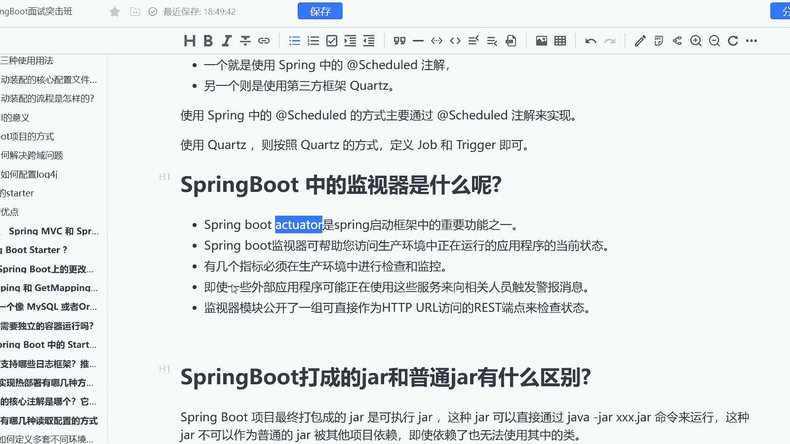

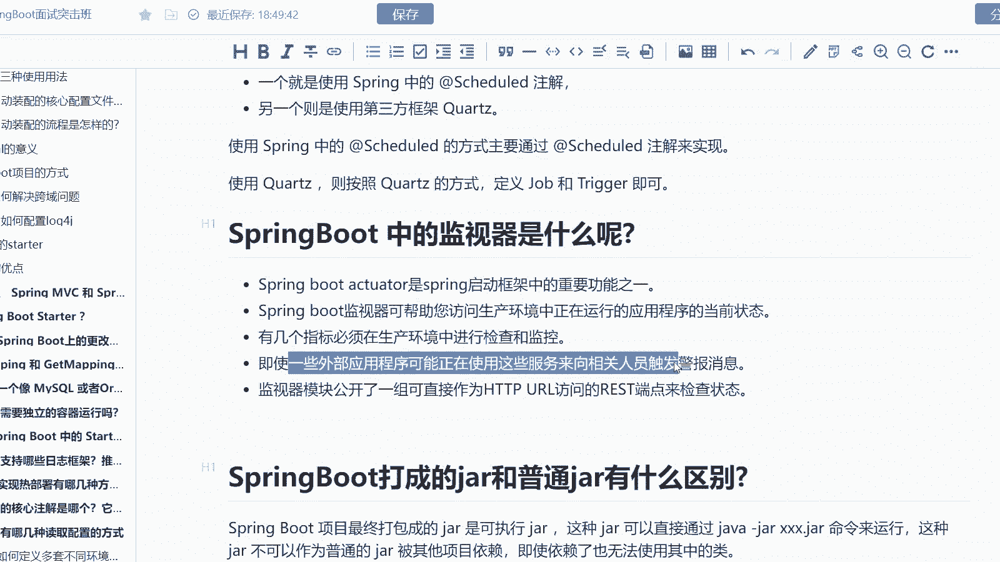

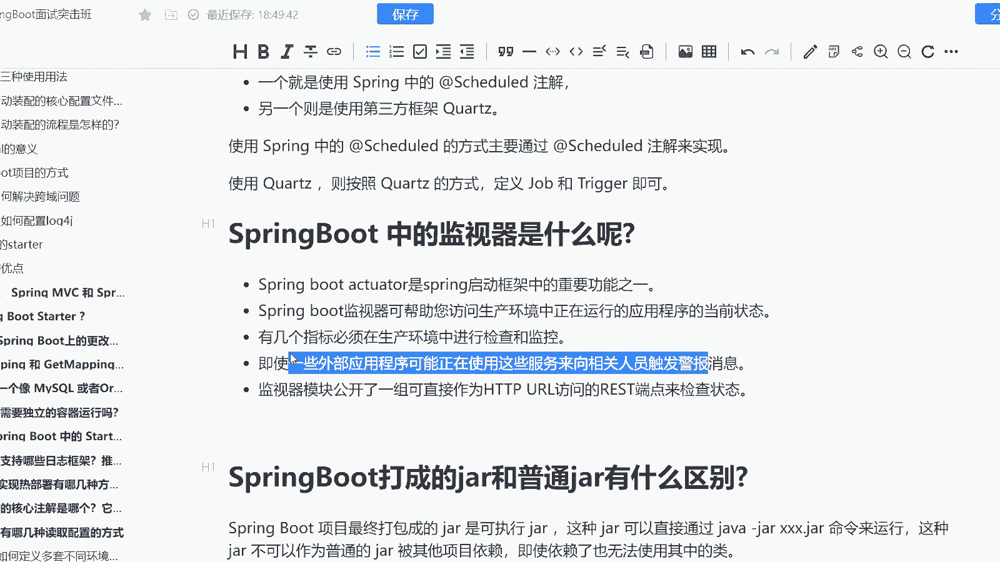

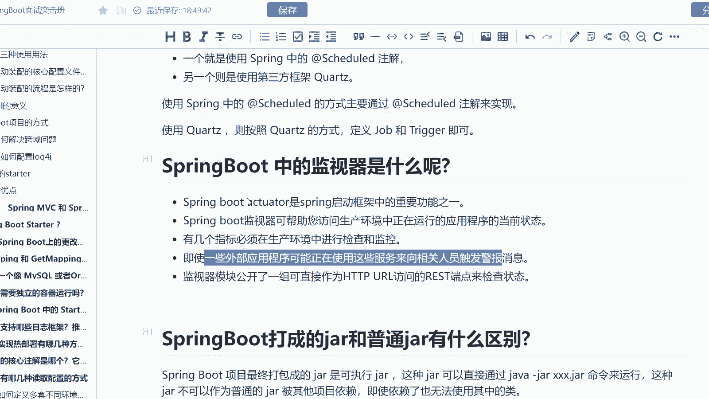

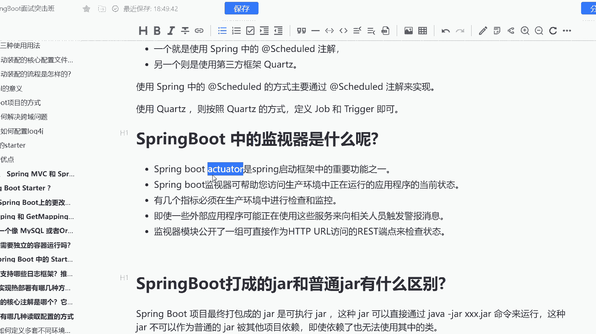

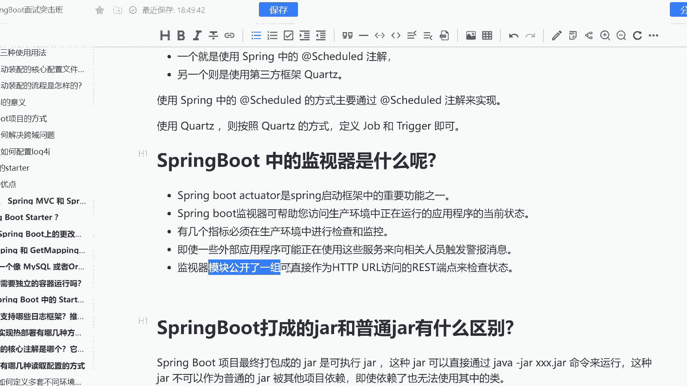

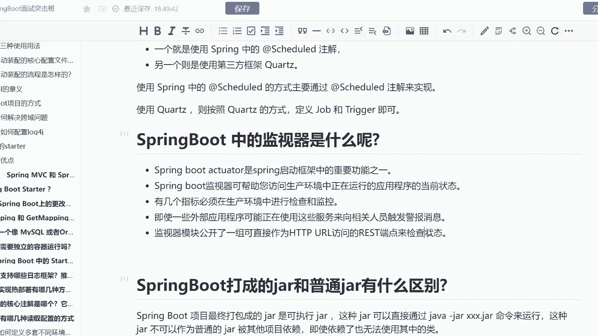

就是其实我对外还是做了一个实现。虽然说我没有说出一个第三方的诚新的组件，但是我是对外做了一套URL的。所以你只需要比如说访问我这套URL就可以实时的来检查我当前spring boot应用的一个状态。

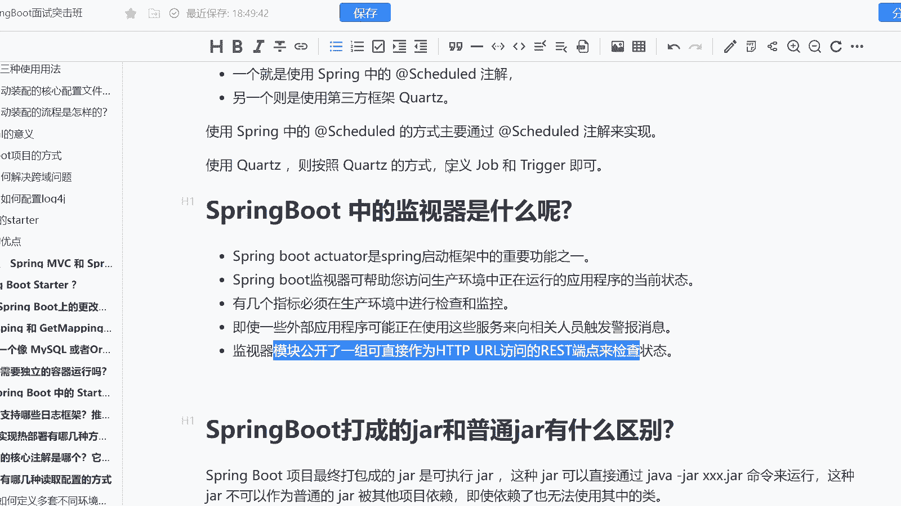