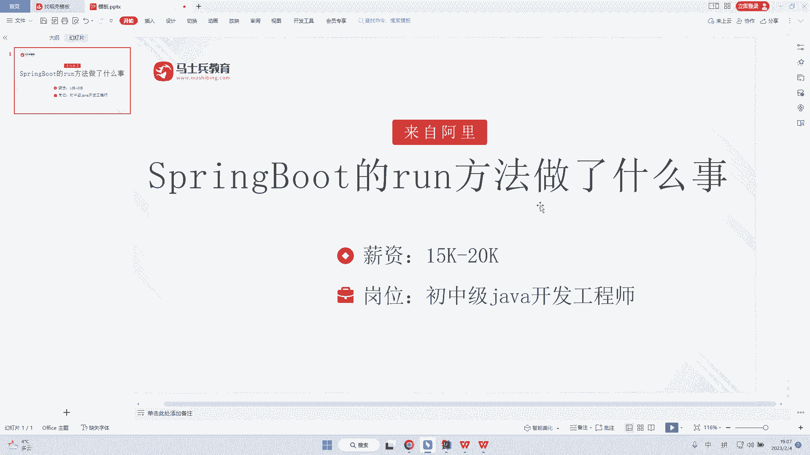
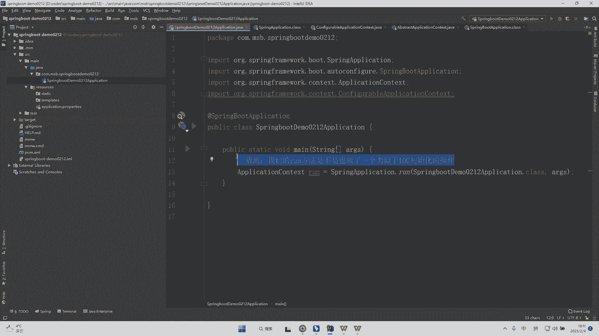

# 系列 6：P181：SpringBoot的run方法做了什么事情 - 马士兵学堂 - BV1RY4y1Q7DL

它是来自于阿里的一道春招的面试题啊，说是什么呢？说是spring boot的run方法做了什么样的一件事情。而这道面试题主要考察的是你对于spring boot源码的一个理解啊。

呃这道面试题呢会在初中级开发工程师的一个面试中，但是呢有的时候也会在高级开发工程师的时候面到，其实呢他考察的是你对于spring源码的一个理解。其实很多同学啊他就会有问题。

他说老师为什么考察的是spring源码的一个理解呢，我们可以直接来看源码啊，首先我们能够去看到咱们在咱们的一个spring boot的一个工程体系当中，它是有这样的一个方法的。

而在 main方法里面做了什么样的一个事情呢？是用spring点run方法调用了一个叫做run方法的。那么这个run方法我们怎么去看呢？首先我们可以去看一下啊，这个run方法它的返回值是fi对不对？

那么这个时候呢其实我们能够。

首先我们把返馈值给打出来啊。可能有些同学对于这个对象不是太熟，但是由于java它是多态的对吧？所以我们书写的时候，其实我们可以直接把这个返回值书写成application context。

OK其实到这里啊，很多同学看到这个代码就会有点眼熟了啊。那么在spring的一个什么在spring加载配置文件的过程当中，或者说在spring IOC初始化的过程当中。

其实它的返回值也是application context。其实此时啊我们可以大胆的去猜测。OK猜测什么呢？猜测我们的run方法是不是也做了。一个类似于。IOC初始化的操作。O那么这个时候我们怎么去看呢？

首先我们点进去我们的一个ro方法，结果我们发现了一段就是说呃代码，而这个代码呢它重新它又调用了我们的一个什么调用了我们的一个方法继续点点完了之后呢，他发现又调用了我们法继续点对吧？

点完了之后到这里我们看到了一段比较长的一个代码。那么首先呢我们可以看到这里是一个就是说秒表计时器啊，而这个秒表计器我们再往下呢就是对吧？创建我们的一个什么这样的一个对象啊。

O而实际上这里面会有很多东西去干嘛呢？呃去干扰你的一个视角啊，就跟我们去做java的时候去封装对象一样，它也会有很多的手动的填充实体类的一个操作。实际上这个呢就相当于我们的手动填充实体类。

它其实对于我们看源码没有帮助的，那么我们继续再往下这是我们的方法返回对象的一个初始化，对吧？设置系统的。的一个属性对不对？然后呢，再往下他在这个位置起了一个监听。当然这个监听他肯定是去看某一类的事情的。

但是这个不是我们关注的重点。然后我们继续往下看，这个是什么？如果英文学的比较好的同学，他就应该知道参数对吧？environment环境环境的配置，然后呢被忽略的并 infer，然后呢再往下图，对吧？

然后呢再继续往下，其实我们才真正意义上的看到哎，我在这里才correect application context去干嘛去真正的去初始化了咱们的这样子的一个，或者说给我们的一个返回对象给赋了值，对不对？

contex赋值。然后呢，在这里set set了什么东西呢？在这里我们去set了咱们的一个obplication star up，对吧？然后呢再继续往下prepare context准备工作。

而在这里呢refresh context我们可以点进去看一下啊，点进去了之后，我们就会发现这里有个refresh方法，再点再点。直到我们比如说继续往下点obabstract啊。

obstract application context。其实我们会发现这一段代码在哪里？见过这就是我们spring源码当中核心的refresh的1个13个模板方法啊。所以大家会发现。

其实我们用了模板模式在这个位置，所以它run方法实际上啊它就是对于这样的一段代码进行了1个IOC初始化的操作。所以我们可以去确定我们的run方法其实就是做了1个IOC初始化的一个操作。

OK那么这是对于ro方法的一个讲解啊。

