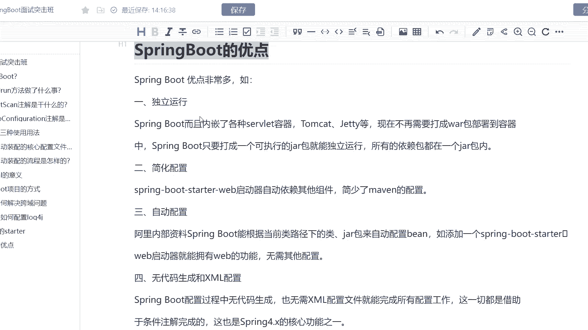
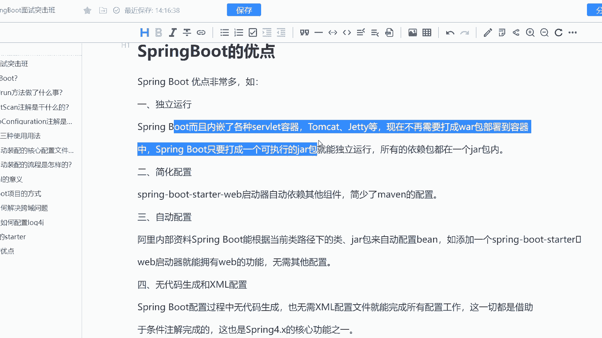
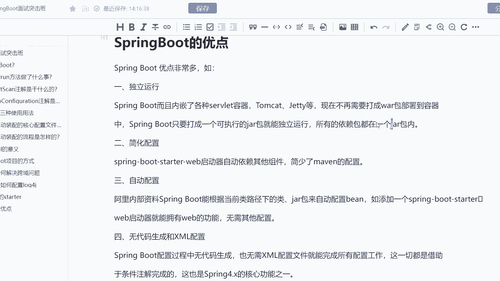
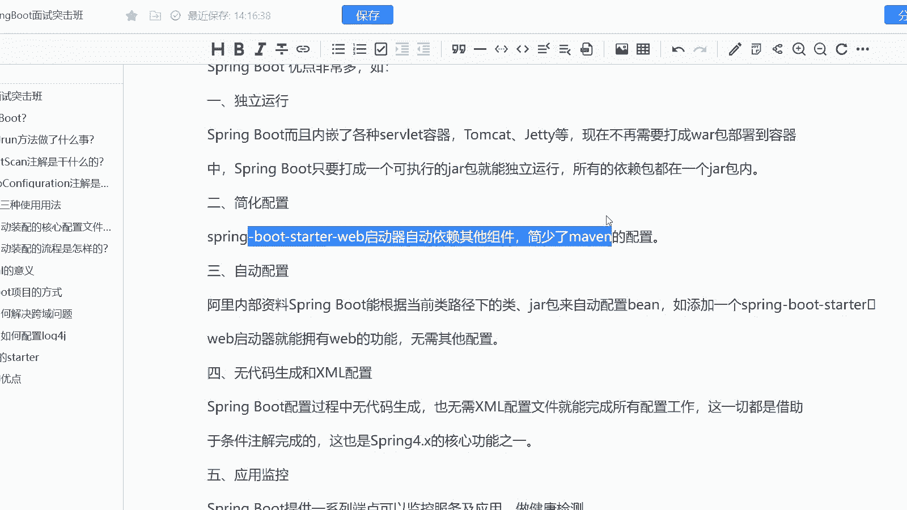
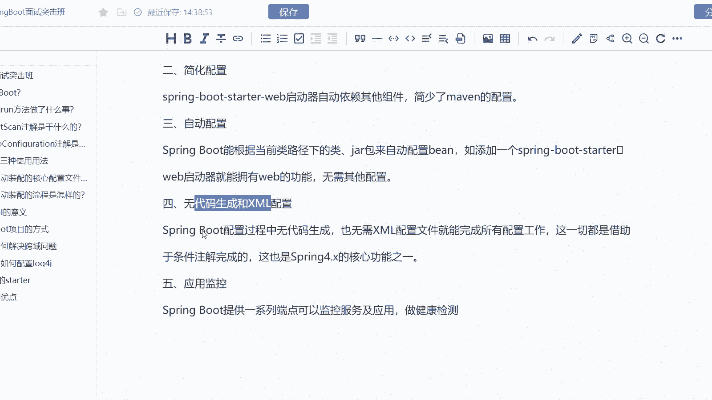
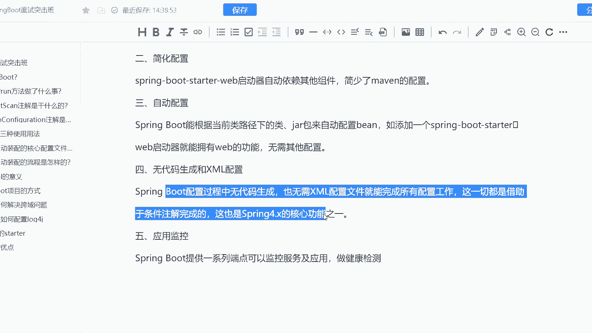
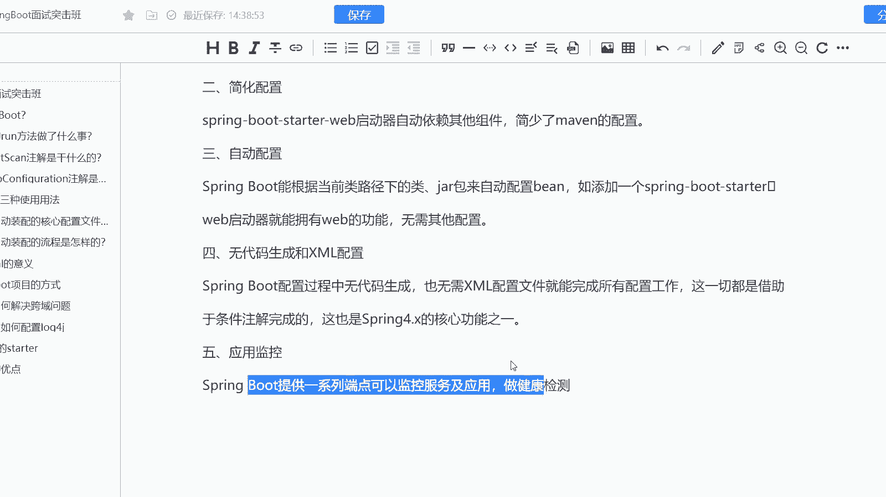

# 系列 6：P182：SpringBoot的优点 - 马士兵学堂 - BV1RY4y1Q7DL

这道题呢是来自于阿里巴巴的一套8月份的面试题，说是spring boot有哪些优点呢？这道题主要考察的是什么呢？这道题主要考察的是对于spring boot的一个基础的理解啊。

然后呢这道题会在就是面试中高级ja开发工程师的时候会去问到大致是P5的一个岗位新对应的薪资是15到25K。那么我们来看一下这道题目啊。

首先呢我们可以看到spring boot它是一个优点非常多的一个上层框架啊，比如它可以独立运行。也就是说它不用依赖于任何的一个容器，它内嵌了很多的容器像什么阶梯啊。

而且它不需要在打包成外包部署到容器中spring boot只要打成一个可执行的架包就能独立运行。原因是因为它内带了一个所有的依赖包都在一个架包当中，并且第二点它可以简化开发。为什么能简化开发呢。

说白了就是把你需要做的事情提前给做了。

它可以直接的去干嘛，自动依赖其他组件，减少了一个meveeven的一个配置。OK第三个它可以自动配置。

ring boot能够去根据什么当前内路径下的类架包来自动的配置并。比如说我添加一个start，我就能拥有web的功能，而无需其他的配置，这个也是它的一个核心的点啊，叫自动装配。

第四个呢它可以无代码生成和叉mail的配置。它的无代码生成，也就是说没必没有必要要叉的一个配置文件，就能完成所有的配置工作。这一切都是借助于条件重起来完成的。这是4。0的一个核心功能之一啊。

包括它还有一系列的应用监控，它可以提供一系列的一个端点，通过呃监控来进行服务的一个检查以及健康监查。O这就是我们ring boot的一个优点啊。

