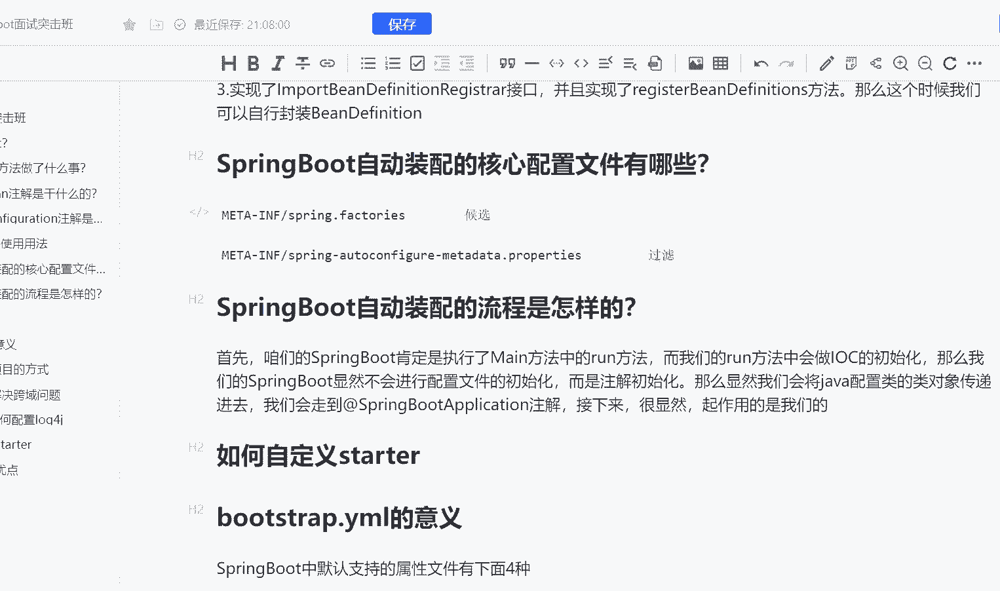
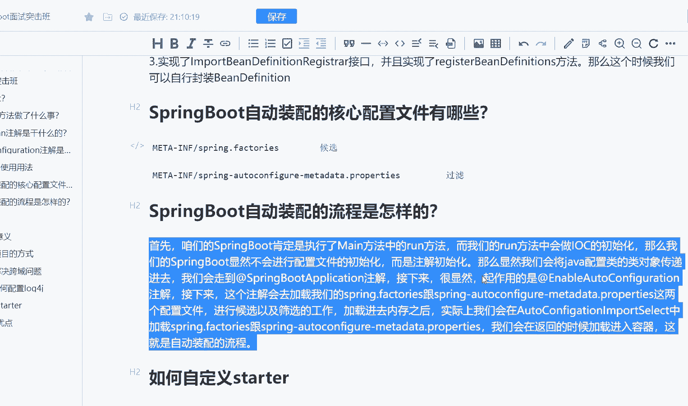

# 马士兵教育MCA架构师课程 - P187：SpringBoot自动装配的流程是怎样的？ - 马士兵学堂 - BV1RY4y1Q7DL

同样是来自阿里的一道8月份面试题啊，说是spring boot的自动装配的流程是怎样的。而这道题主要考察的是什么呢？考察的是你对于sring boot的一个启动的一个源码流程的一个理解啊。

而这道面试题呢，在面试高级 ja开发工程师的时候会问到对应的薪资呢是25K到40K区间啊，然后接下来我们就来讲解一下我们的面试题。首先第一个我们要去梳理一下咱们的一个流程啊。而咱们的流程怎么去梳理呢？

比如一般来说啊，像我们这样的一个面试题，它会有几种问法。比如spring boot配置文件的加载顺序，或者说sring boot它加载的流程是怎样的。那么首先呢咱们的就是咱们写一写啊。

因为这个面试题还是有一些话术的啊。比如说咱们的sring boot，它肯定是执行了什么闷方法中的。run方法。OK而我们的。让方法。中会做IOC的初始化。对吧我首先要在梦方法当中去完成IOC的初始化。

那么我们的spring boot。显然不会进行配置文件的。初始化。那它会进行什么初始化呢？它会进行注解初始化。okK那么显然对吧？这个时候我们会将会将什么东西啊，会将java配置类的什么类对象。

传递进去。那么这个时候呢，其实就是咱们的一个configuration注解啊。OK传递进去了之后呢，我们会走到走到哪呢？走到咱们的一个。Spring。Bot。Obplication。注解。接下来。

很显然，对吧？我们要去干嘛起作用的。是我们的。怎么注解起作用的，看一下啊。

稍等，我这里断点先给放掉取消掉，然后走到这里来。起作用的是enable auto configuration注解了。

OK起作用的是我们这个注解。好，那么。接下来。接下来这个注解。会去干嘛加载我们的。spring点 factoryy。跟。

spring杠auto configurationration杠med data点proice这两个。配置文件。进行候选以及筛选的工作。加载进内存之后呢。加了进去内存之后，实际上。我们。会在。

咱们的一个什么凹 to。Configuration。Autto configuration import select。또。加载。

我是在这个就是说auto configuration当中去加载spring点factorory以及spring。how to configuration meta date点pro这两个配置文件。

我们会在返回的时候加载。进入。容器。这就是自动装配的流程。好，搞定啊，这就是我们自动装配的一个流程啊。OK大家只要面试的时候，把这段话背下来，基本上就没有什么大大问题了啊。

