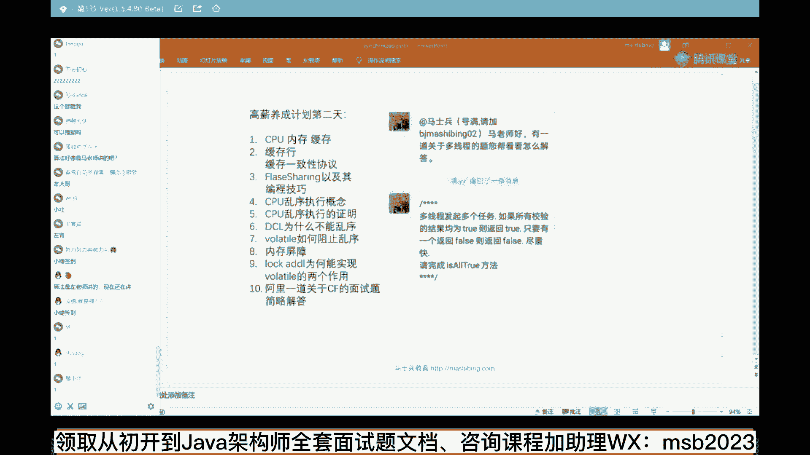
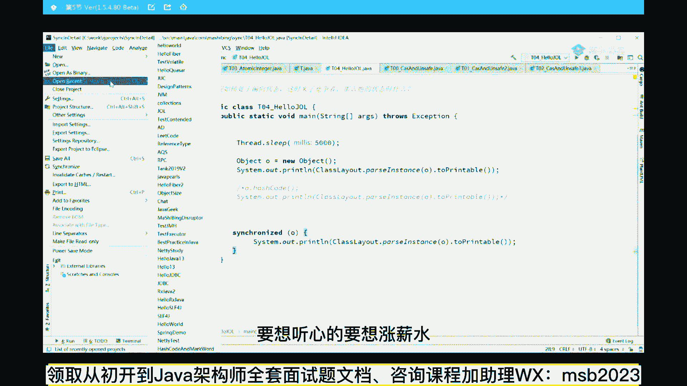
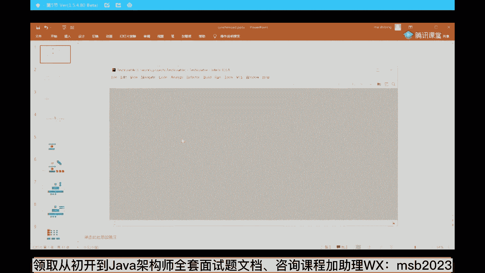
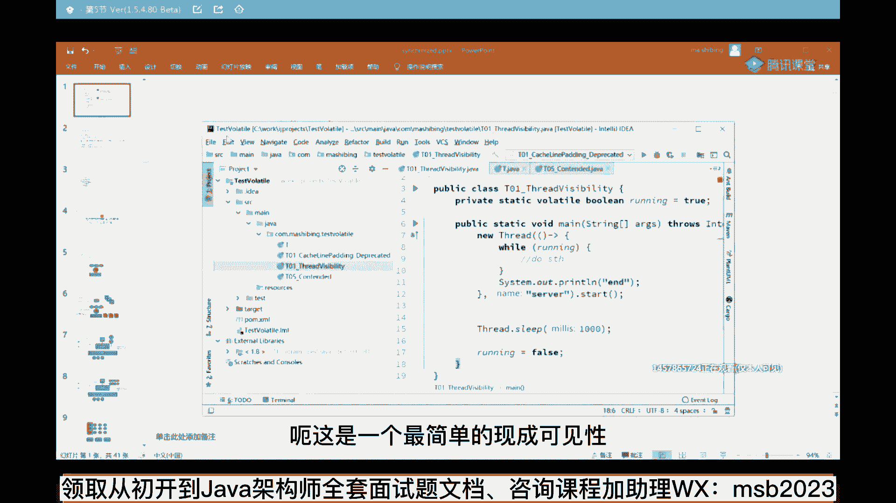
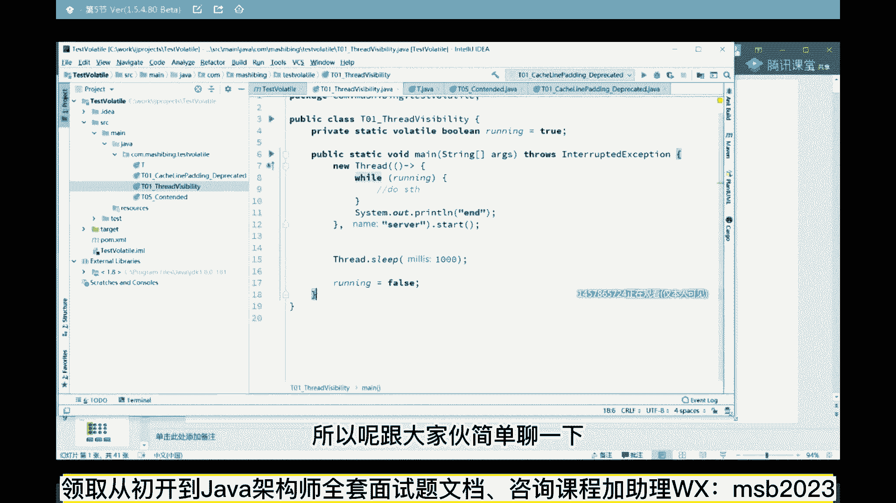
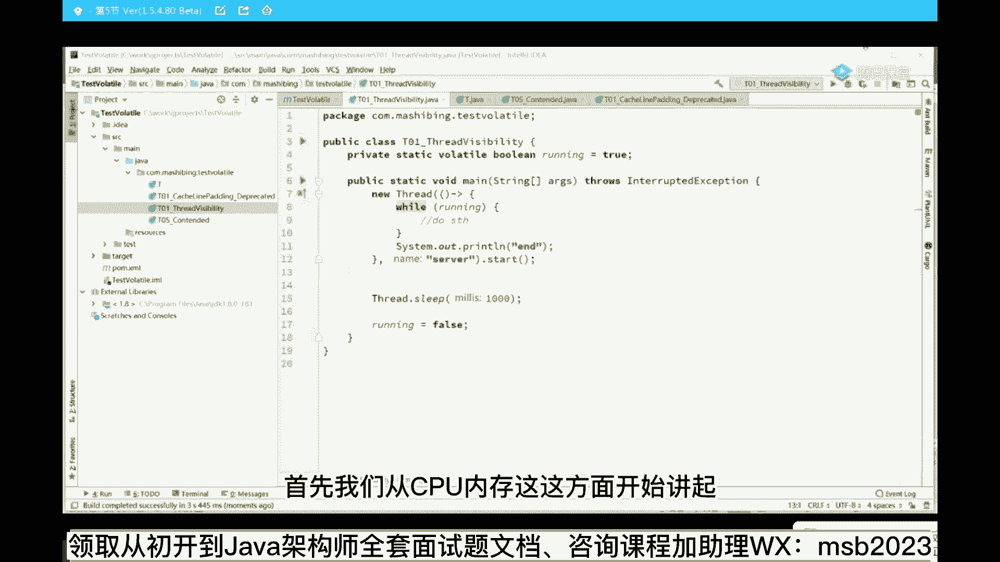
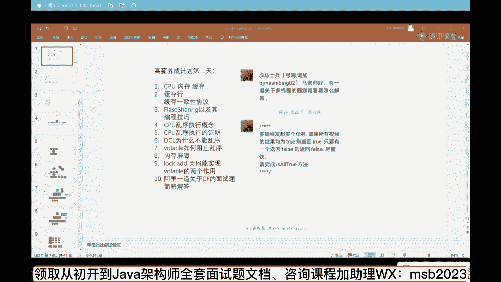
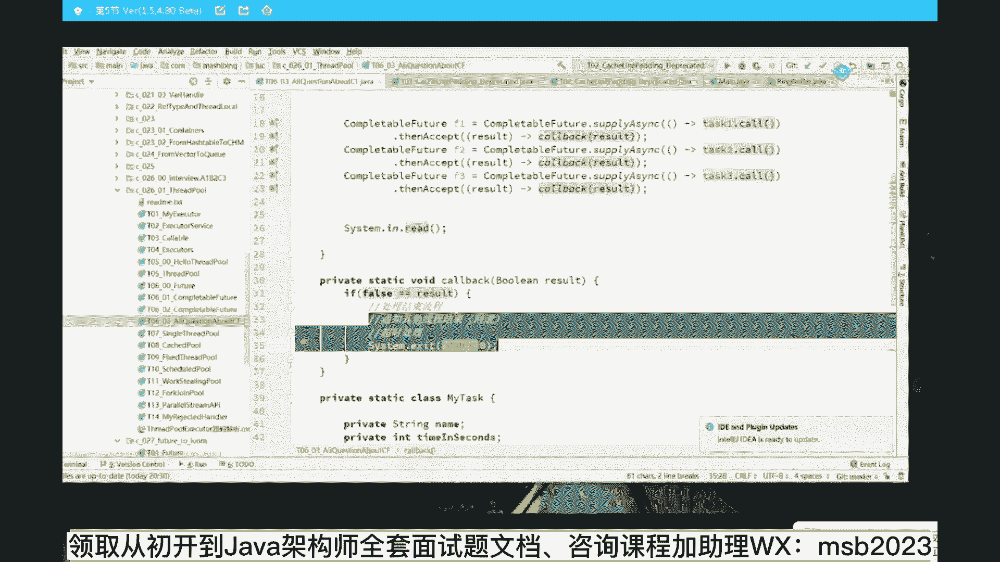
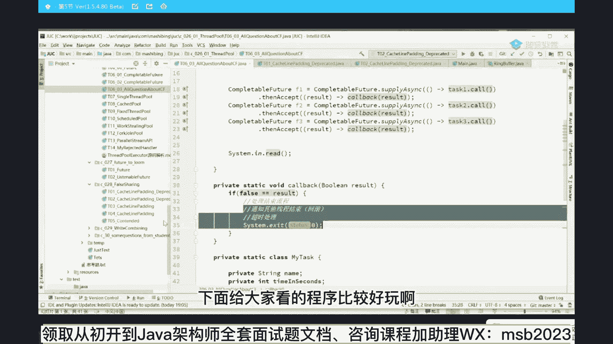
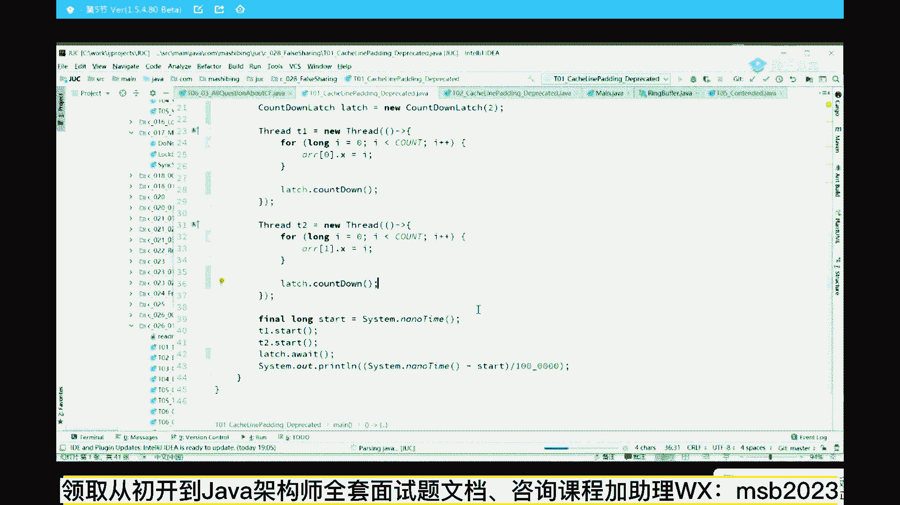

# 马士兵教育MCA架构师课程 - P19：CPU内存行和缓存一致性协议 - 马士兵学堂 - BV1RY4y1Q7DL

其实这个核心呢，我主要是来讲给大家讲的是什么呢，讲的是一个volatile，这关键字呢很多同学可能都知道它有两个作用，第一个呢叫线程可见，第二个呢叫禁止重排，关于线程可见呢这件事情特别简单。

有没有同学需要我讲一讲线程可见性的，有需要的话给老师扣个一来。

其实是用不着的感觉啊，就比较简单的一个东西，如果你些人可见都不太知道的话，那我觉得你你你，你你你这个基础就稍微有点弱了，找一下啊，上周讲过对公开课不能天天讲，那个新的小伙要想听新的，要想涨薪水。

欢迎你报名我们的vip。

嗯这是一个最简单的线程可见性呃。

避免有同学不太知道的，所以呢跟大家伙简单聊一下。

线程可见性的意思呢，就是一旦这个线程里面改了一个值，另外一个线程立马得知道，来我们来看读一下这个小程序，非常简单的小程序啊，快速过一遍，这个小程序呢我有一个主线程main线程。

然后在我的主线程里面开启了一个分支线程，这个线程我new了一个thread，这thread while running，只要这个running设为true，它会不停地执行，一直不断的执行。

什么时候我们这个线程结束了，他才会打印一个end，模拟了一个server的一个操作好了，同学们，下面我问大家一句话，就是当我的主线程睡了一秒钟之后，把这个running设为false，那么我问你。

如果我在这里不写volatile的话，它会停止吗，这就是线程可见性的意思，它会停止吗，不会跑一下，给大家打一点基础啊，好你就在这等着吧，十秒100秒啊，它都不会停止，他不会停，原因是什么呢。

原因非常简单，推荐你们想想看，这是那个值，刚开始呢它为true，作为java里面的线程模型，java memory model，java的内存模型，java memory model，什么意思呢。

它会每一个线程把这个值读到自己的线程，处理的缓存里头，所以这里头有一个缓存的概念，现成的本地内存读到自己的线程，本地内存这块之后呢，他就直接把这个处拿来读，这个时候有另外一个线程改了这个值。

但是请大家注意，这个线程只会在缓存里读，他不会去内存里更新，所以虽然这里的值已经改成false，可是每次他读的依然是一个缓存的值，这样的话呢这个值在两个线程之间就不可见了，我改了之后之后，你看不见。

那我怎么来保证我这边改完了之后，你另外那边呢立马就能看见呢，怎么办呢，加volatile，所以这是volatile的第一个作用，叫线程可见性，跑一下，好马上结束了是吧，把这个比较简单啊来呃。

可以继续同学老师扣个一，我们继续，今天呢我跟大家聊清楚volatile这件事，但是要聊透这件事，尤其是聊透面试中所遇到的各种各样的问题，需要你了解的东西还是比较多的，我们从底层一点点开始讲呃。

首先我们从cpu内存这方面开始讲起。

这个呢需要牵扯到一点点，计算机的组成原理的知识，这个知识呢也比较简单，大家看这里，呃这个图呢是一个计算机的，现代计算机的组成的最核心的一个图，作为cpu来说，它所用到的数据data，它所用到的指令。

ok这些全都要从内存里头给读过来，内存是用来存储这些的，好，cpu的速度特别快，它的速度大概和内存比100比一，这个速度特别快，我读一个东西就得等内存给我返回回来，所以为了提高效率。

cpu和内存中间加了一系列的缓存，缓存这个概念我相信不需要解释了，应该大家伙应该多少都接触过，就是我找一些存储量稍微少一点的，比内存少的，但是速度特别快的，把常用的数据给放到这里，每次我读的时候。

我就不需要去内存里头读，我只需要多本地缓存就可以了，这个缓存根据工业界的实践，目前作为关键时间上来说，缓存一共有三层，如果大家想了解这一点，深入理解计算机系统，就是这个图。

这三级缓存我们分别称之为l one，l two和l three，虽然现在还没有人问，这三级缓存分别位于什么位置的问题，但我还是想讲给你听，因为这个还是挺普遍的一个小知识。

好大家看这里所谓的l one位于什么位置，l2 位于什么位置，l three位于什么位置，看这个图大家就明白，这是我们有两颗cpu两颗，这是第一颗，这是第二颗，我们假设每一颗cpu里面有两个核。

这是第一个和，这是第二个和第三个和第四个核，l l一这集缓存位于核的内部，就是在这盒里面，l2 这就缓存也位于这个核的内部，l3 是两核共享，但是它位于一颗cpu里面，ok这边也一样。

所以当我们从内存里头读一个值的时候，它是怎么读的呢，我们想象一下这个过程，现在我的计算单元要求去计算一个值，要从内存里读这个值过来，他会优先的去l one里找有没有这个值。

如果没有继续去l2 里找有没有，如果没有继续去l three d，如果还没有从内存里头读过来读的时候，首先给它缓存在l3 里面，再缓存在l2 里面，再缓存在l一里面，然后读到寄存器里开始做计算。

好这个大体的流程能够能够理解，同学老师扣一两个l3 ，连起来会好一点，然而并不是，为什么要增加这么多级缓存，以前有同学问过，我说，老师为什么是三级，而不是四级，为什么不是五级，不是六级，不是一级。

不是二级，这个事儿你别问问也没有答案，因为这都是工业界的实践摸索出来的，他并没有一些理论上的这种证明，到现在为止啊，大多数的缓存，因为现在硬件也在不断的发展，一般来说如果从l u单元。

从计算单元访问寄存器的时候，是要小于1纳秒的，访问l one的时候，大概是一个纳秒，访问l two的时候，大概是三个纳秒，访问l three的时候大概是15个纳秒，而访问值去直接访问内存的时候。

好这个时间就要80纳秒，所以他们两个之间的比例大概是一个，100比一的关系，为了提高效率，所以我们要加缓存，这里头呢其实包含着一个朴素的最基本的原理，一个叫时间局部性，一个叫空间局部性。

这块原理性的这种东西呢，你大概听一听，大概理解就是什么意思啊，就是纯理论的东西，什么叫时间局部性，什么叫空间局部性，一般来说我每次访问到这个值的时候，很可能很快的又会访问到这个值。

比如说作为一个循环变量来说，for int i等于零，i等于一，然后i小于多少，你看啊，每一次循环都会访问到同一个变量，所以这是时间局部性，所以由于时间局部性的存在，我是不是把它存在一个最快的位置。

最快能访问到的位置，这个是最合适的，所以这是中间要加缓存，还有一个叫空间局部性，空间局部性的概念，就是说当我访问到这块空间的时候，大家的数据都是挨着盘的存储的，我访问到这个数据之后。

很可能跑到下一个作为一个数组里面，你们自己想一下，我访问这个循环的时候，马上要返回第二个，第三个，第四个，第四个，第五个k，当然这种理论性的东西，如果你能够面试官讲出来，最好讲不出来也没关系，总而言之。

为了提高效率，中间加加缓存，好吧，呃这几个概念呢还算是比较简单，正是由于缓存的存在，所以呢就诞生了各种各样的小小的问题，首先优先的第一个问题是我缓存读过来的时候，按怎么读，第二个问题是我这缓存大家伙。

有一个数据存在了不同的cpu里面，那改了之后该怎么通知，认真听认真听啊，我们先讲第一个概念，先讲第一个概念好看，这里首先我们要读一个值的时候，读一个值过来，这个值读到缓存里之后。

他是不是会只读这一个值过来，然而并不是什么意思呢，就是你们想想看啊，咳咳咳，就跟那个昨天我举过那个集装箱的例子，虽然说有时候你只需要一双鞋，这双鞋呢我还是要装在整个集装箱里，一块的把它运过来。

这个效率会非常高，而且根据这种空间局部性原理，就是我访问到这个值之后，很快就会访问周边这个值，所以我干脆还不如一次性的把这个值分成一块，一块的全体读进来，虽然这个值很可能只占了四个字节。

但是我一次性的一读很可能读好多个字节，读出完整的一块放到我的缓存里，因为还是那句话，根据空间局限原理，我访问到这个值之后，很可能下一次我要访问这个值，假如这个值正好位于缓存，我的效率就提升了。

所以第一个概念叫做缓存，是按照一块儿一块儿来的，好，能get到这一点，同学给老师扣个一，这个概念没问题吧，缓存是按照一块一块来的，那好这一块的大小是多少，听我说，首先作为缓存来讲，从内存里读一块值过来。

放到我的缓存里，它有一个专业名词叫缓存行，叫catch line，缓存行，好，作为缓存行来说，一行目前是多少呢，64个字节，请你给我把这个数给我背过，目前用的最多的不是64k64 个字节，每次讲到这儿。

总有同学问我说，老师为什么不是128，为什么不是32，这个东西是一个工业实践摸索出来的结果，64个字节是现在大多数绝大多数机器用的，一个缓存行的大小，这个呀其实呃非常非常的简单。

也我原来给大家稍微的解释，解释这个理论性的东西啊，就是如果你的缓存行特别大，你们拿大腿想一下，你一行特别大，你恨不得把整个内存1/2全部拿过来，缓存好，那是挺好，但是呢你读过来的效率就会越低。

读取一块儿的时间就会特别慢，如果你的缓存方特别小呢，小力度的，虽然说你的读取的效率很高，但是你局部性空间的效率就比较低，什么意思，因为我找周边的这找不着啊，我得去别另外另外一块还得还得读进来。

所以最终取了一个折中指，目前最多的就是64个字节，记住这一点，还有同学说64个字节呃，这个缓存行这个东西真的存在吗，我告诉你真的存在，我们先讲这个缓存行的呃，刚才我讲了一个这个概念。

就是缓存行是一块一块来的诶，然后呢他目前是64个字节，我们先讲，我们再讲第二个概念，假如现在有这么一个问题啊，听我说，假如现在有这么一个问题，比如说我们这一行数据里边有一个x。

里边有1y这行数据它会读到我们的缓存里，同时它会缓存在不同的cpu上面，cpu盒上面，ok这是cpu一的cpu 2这个x值，我这边呢哎我这第一个第第第第一个cpu，我要读取x的值，我要修改x的值。

那接下来呢我会把整个一根据我们刚才的理论，我会把整个这一行读到l3 ，读到l two，读到l one，读到这里面，与此同时，另外一颗cpu cpu 2我要用到y这个值，但是根据我们刚才理论。

他会把一整块全读进来吗，所以他会把同样的一块数据缓存在自己的l one，l图里面，那这时候就会产生一个小小的问题，假如我这块数据里面的x改了，我要不要通知另外一块数据，说哥们儿，你这个x已经被我改过了。

o大家听明白这意思了吗，这个呢就叫做缓存，要保持一致性，就说我这有一个缓存，我改了之后，我我要通过一种什么机制来通知另外的cpu，同样的一块的缓存，这块呢叫一致性，解决这个一致性的问题啊。

在硬件层面上出了好多好多好多的协议，硬件层面的协议好，这硬件层面协议呢，大家伙我估计啊，绝大多数人都会听说过这个名词叫m e s i，来听说过这个名词给老师扣个一，几个cpu其实几个跟几个没关系啊。

m e s i，因为网上很大多数的文章，凡是讲到volatile都会顺带着聊msi，搞得那个volatile跟msi好像有关系似的，我今天虽然要讲给你听m e s i，但是我先告诉你结论。

volatile跟m e s i没有半毛钱关系，再说一遍，volatile跟msi没有半毛钱关系，那这个m e s是什么意思呢，它就是一个硬件层面的多颗cpu之间，缓存保持一致的这样一种协议的实现。

并且这个协议的实现只是x86 ，这种架构上只是英特尔的cpu上是这种协议，叫m e s i，如果非要详细解释这个msi的话，其实呢它就是缓存行的四种状态，m e s i就是缓存行的四种状态。

分别的状态叫做modified被修改了，exclusive独占，share共享，invalid失效，举个最简单的例子，这有个缓存行，这有个缓存行位于不同的cpu里面，我改了这个值。

我要通知另外一颗cpu里面说，我这已经是modified被改了，所以你这边应该是一个invalid，失效了，你下次要用到我这个值的时候，你自己决定要不要去内存里头重新给我读一遍。

这是当内存里面的一个缓存一致性的协议，的一个实现，这我再说一遍，这个实现m e s i只是x86 的这种架构的cpu，其实别的cpu的它的实现往往叫m i，m o s synfifly dragon。

以及最新的还有一个新的协议，忘了他具体的名字了，一个改进版的缓存一致性协议好，所有的这些全叫缓存一致性，这是在硬件层面保持缓存一致性的，跟volatile没有关系，再说一遍，tf是重点来干货。

今天没有干货，全都不是重点，你抽完奖了，是不是可以撤了，拜拜啊，慢走不送，不要给我带节奏，带节奏，我就会也不能怎么着，你开个玩笑好，我讲到现在为止，大体能是不是能理解什么是缓存，什么是缓存一致性。

什么是缓存一致性协议来能get到这几个概念，同学老师扣个一，一脸懵逼，不会吧，我讲的已经很是不是已经很通俗了，还要怎么再简单吗，已经很清通俗了啊，就是一堆那个需要缓存的东西加进来嘛。

当然呃这个你又没有编程基础，确实稍微难一点点，但是这个就是你和计算机系的专业的区别，就在于这话不多说了，下面我们就来聊一个，有同学说老师这缓存行这东西真的存在吗，真的存在。

老师你能证明吗，完全可以，我给你看一个特别好玩的程序，大家看这里。

下面给大家看的程序比较好玩啊。

呃我们先读程序，一会儿看结果啊，啊看这个小程序，这个小程序呢有这么一个long类型的count，这个count呢是1亿次，接着就循环次数啊，这个循环次数是一个亿1亿次的循环，我有一个类，这个类呢叫t。

它有一个成员变量叫x是long类型的，接下来呢我有一个t类型的数组，只有两个t的对象存在，那么我们拿大腿想一下，仔细听，既然是一个数组，那这个arr 0指向了一个new t，哎。

他一定是new出来的这个对象，2v一又指向一个new t，它一定是new出来的另外一个对象，每一个t里面都有一个x，每个t里面都有一个x好，这俩哥们儿在数组的排列上是挨在一起的，是排在一起的。

所以这是x1 ，这是x2 ，我干了这么一件事儿，我起了两个线程，第一个线程t一不停的修改array，零点x就是改的x1 ，第二个线程不停的修改，2v一的x修改了多少次，修改了一个一次1亿次，好。

就是这么一个简单的小程序，单小程序做这个实验用来干嘛呢，好听我们看它最终执行完的一个时间，跑一下。

