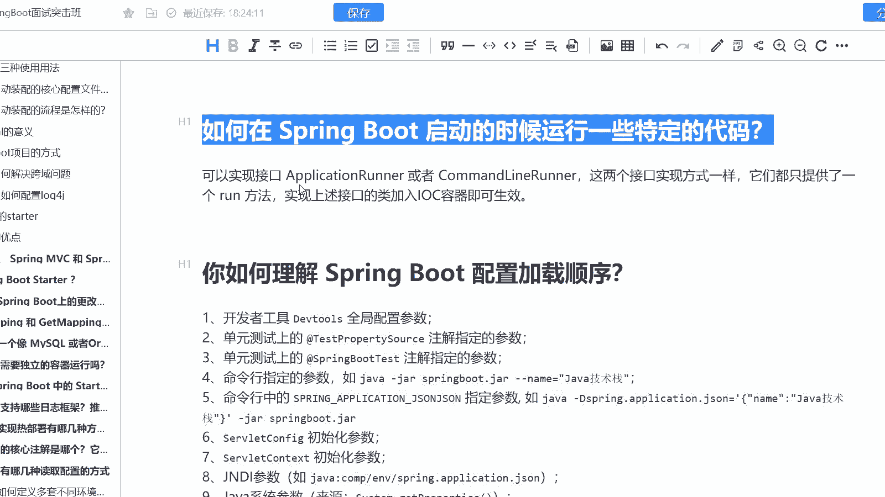
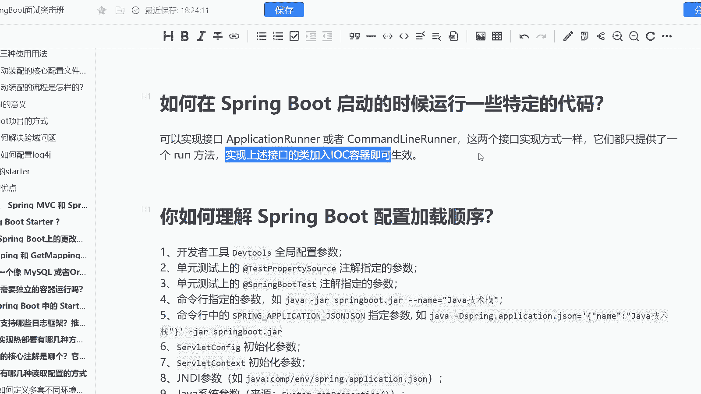

# 马士兵教育MCA架构师课程 - P191：如何在 Spring Boot 启动的时候运行一些特定的代码？ - 马士兵学堂 - BV1RY4y1Q7DL

来自于阿里巴巴的一道9月份的面试题啊，说是如何在spring boot启动的时候运行一些特定的代码。这个时候可能有些同学他就会比较懵逼了。他说老师。

我为什么要在spring boot启动的时候运行一些特定的代码呢？实际上啊我们这道题考察的是什么呢？它考察的是你在比如说写到一些源码，或者说中间键的时候，有没有自己的一个理解啊，O这道题主要考察的这个。

比如说我去自定义咱们的一个什么定时任务调度，那么这个时候呢我们就需要把定时调度的这样的一个触发器啊或者调度器的类去干嘛加入到spring周期当中去，那么这个时候毕竟必定我要就要把它加入IOC容器，对吧？

那么这是一些写中间键的时候，可能会遇到的一些问题啊，那么这个题呢是对应的是高级java开发工程师。对应的心思呢是25到40K这样的一个呃区间啊，那么怎么去弄呢？实际上很简单啊，就当你去实现接口。

比如说plication running。

或者说当你去实现commona lean wrong这样两个接口的时候，这两个接口实现方式是一样的啊，并且他们都只提供了一个run方法。

并且我在课上啊在定时任务调度的课上是帮你们去实现了common嗯 lean wrong啊这样的一个接口啊，实现这些接口呢就可以把这个类加入IOC容器当中啊简单高效啊。

O这就是这道题如何在spring boot启动的时候运行一些特定代码。你的一个回答啊。

