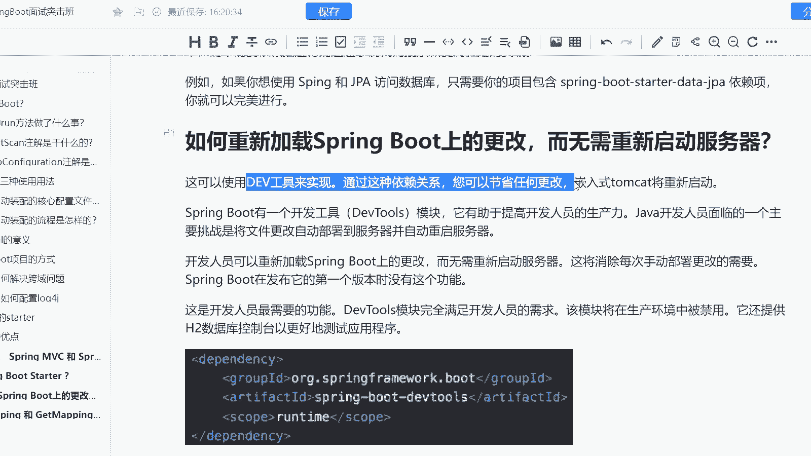
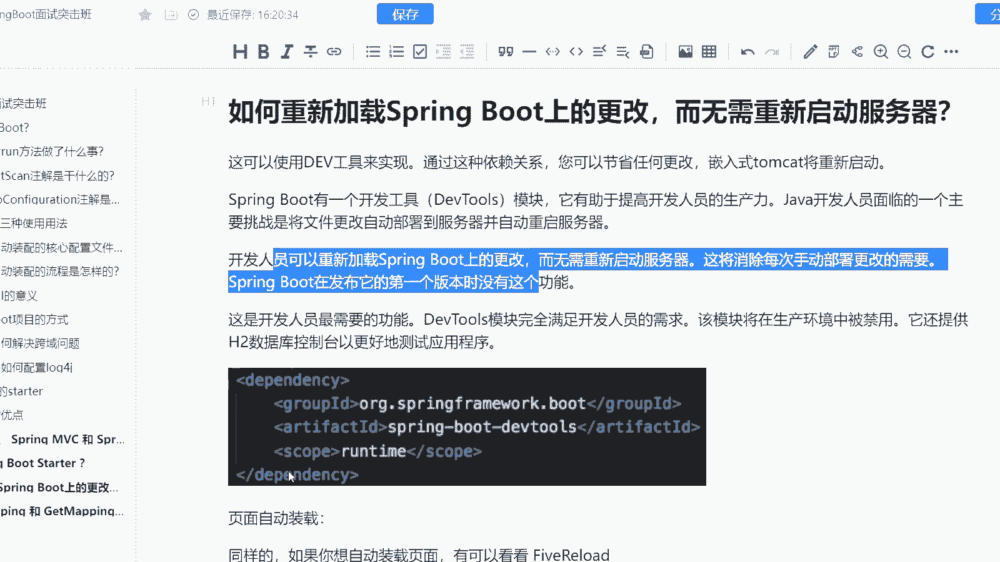
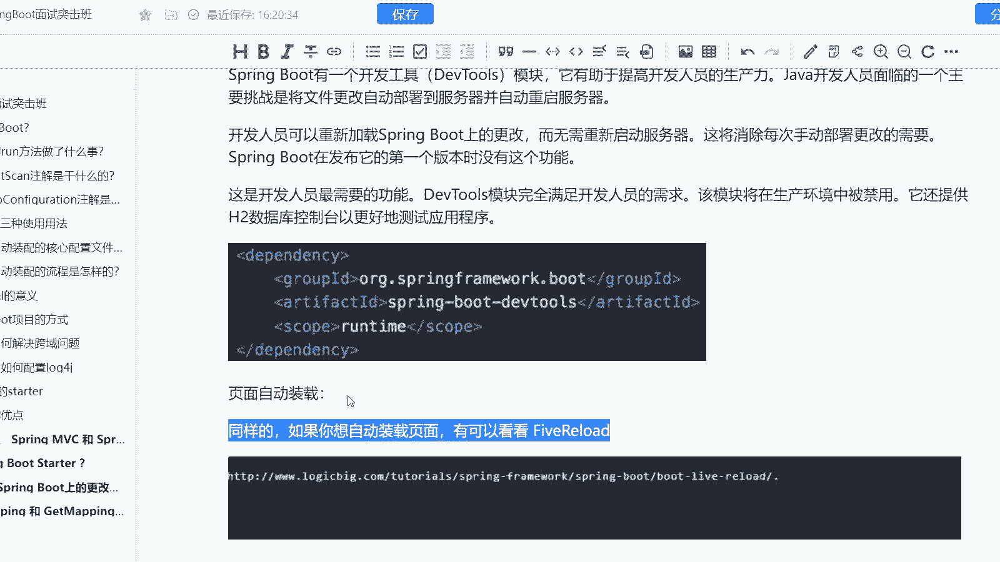

# 马士兵教育MCA架构师课程 - P192：如何重新加载Spring Boot上的更改，而无需重新启动服务器？ - 马士兵学堂 - BV1RY4y1Q7DL

来自于阿里巴巴的一道12月份的面试题啊，在年末前招的说是呢如何重新加载spring boot上的一些功能，而无需更改。无需重新启动我们的服务器。说白了就是热部署。

那么这道题主要考察的是你对于spring boot的一些使用上的细节啊，这道面试题呢在面试高级 java开发工程师的时候会问到对应的新词是25乘以到30K啊。

那么呢我们来看一下这道题它到底是怎么去进行解析的。首先第一个我们应该清楚的知道啊spring boot它是有两种方式可以去进行热部署的。第一种呢是你用呃develop这样的一个工具来进行实现啊。

我们可以通过这样的一个依赖关系。然后呢，你直接通过嵌入式的开发，将tom重新进行启动。因为实际上它是属于一种是么内嵌式容器啊，在spring boot当中，而spring boot它有一个开发工具叫做。

develop tools这样的一个模块，它有助于提高开发者的一个生产力。而java其实遇到的一个主要问题，就是将文件的更改自动部署到服务器，并且自动重启。而我们可以通过这样的一个方式啊。

就是无需重启服务器，每次都可以去进行一个热部署。但是呢在springring1。0的版本当中是没有这样的功能的。所以呢我们的一个什么。模块它是完全满足开发人员的需求的。但是呢在生产环境当中，一般禁用。

因为java它的特性就不支持我们的热部署啊。同时呢它还提供了我们的1个HQ的一个数据库，方便我们更好的去测试我们的一个应用程序，大家可以直接依到这个依依赖这个就是说或者说直接加入这个依赖就okK了。

ORG点spring free walk点boot。然后呢。d这样的一个依赖。然后scope呢就填运行时就OK了。然后呢，如果你想自动装载页面的话呢，可以通过fi loud直接进行。

而我下面呢也贴了截图啊，就是如何去使用我们的five loudok这是页面自动装载的啊。

